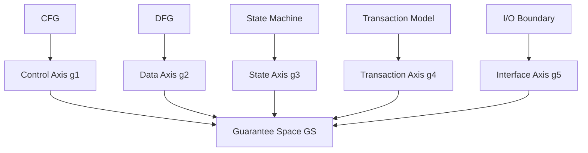
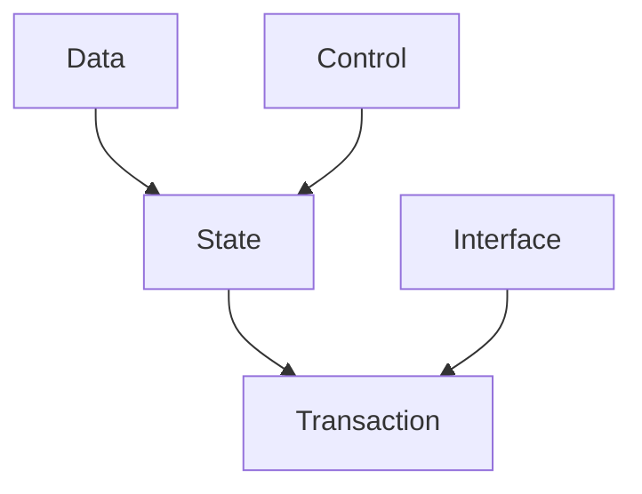

# 09. 保証軸理論 (Guarantee Axis Theory)

**Phase 4: Migration Geometry**  
**Document ID:** `docs/80_geometry/09_Guarantee_Axis_Theory.md`  
**Date:** 2026-03-05

---

## 1. はじめに

保証ベクトル $G(T) = (g_1, \dots, g_5)$ の各次元は、**構造的起源**（その保証が導出されるプログラム構造）を持つ。本文書では **保証軸理論** を形式化する。

---

## 2. 軸と構造のマッピング

| 軸 | 意味 | 構造的起源 |
| :--- | :--- | :--- |
| $g_1$ (Control) | 制御フローの保存 | CFG |
| $g_2$ (Data) | データフローの保存 | DFG |
| $g_3$ (State) | 状態遷移の保存 | State Machine |
| $g_4$ (Transaction) | トランザクション境界の保存 | Transaction Model |
| $g_5$ (Interface) | 外部インターフェースの保存 | I/O Boundary |

---

## 3. 構造的起源図



---

## 4. 幾何学的構造

```mermaid
flowchart LR
    subgraph Structures
        AST[AST]
        CFG[CFG]
        DFG[DFG]
        SM[State Model]
        TM[Transaction Model]
        IO[I/O]
    end
    
    subgraph Axes
        g1[g1 Control]
        g2[g2 Data]
        g3[g3 State]
        g4[g4 Transaction]
        g5[g5 Interface]
    end
    
    subgraph Space
        GS[GS = [0,1]^n]
    end
    
    CFG --> g1
    DFG --> g2
    SM --> g3
    TM --> g4
    IO --> g5
    g1 --> GS
    g2 --> GS
    g3 --> GS
    g4 --> GS
    g5 --> GS
```

---

## 5. 軸依存グラフ

保証軸は **完全に独立ではない**。軸間に構造的な依存関係が存在する：

| 依存関係 | 説明 |
| :--- | :--- |
| State → Data | 状態はデータに依存 |
| Transaction → State | トランザクションは状態に依存 |
| Control → State | 制御は状態に依存 |
| Interface → Transaction | インターフェースはトランザクションに依存 |



完全な形式化については **16_Guarantee_Axis_Dependency.md** を参照。

---

## 6. 結論

保証軸理論は、各ベクトル次元をその **構造的起源** にリンクさせ、**軸依存関係** を捉える。これにより、幾何学（移行距離、安全領域）からプログラム構造（AST, CFG, DFG）へのトレーサビリティが確保される。
