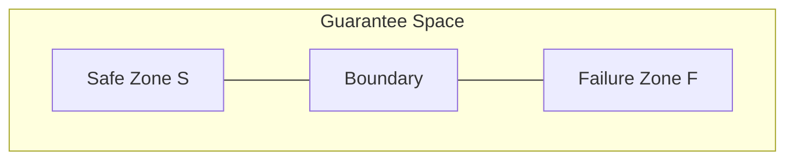

# 14. Migration Topology

**Phase 4.5: Geometry Formalization**  
**Document ID:** `docs/80_geometry/14_Migration_Topology.md`  
**Date:** 2026-03-05

---

## 1. Introduction

**Migration Topology** formalizes the Safe/Failure structure as a topological partition of the Guarantee Space.

---

## 2. Region Definitions

### 2.1 Failure Zone

$$
\mathcal{F} = \{ (g_1, \dots, g_n) \in GS \mid \exists i: g_i < \tau_i \}
$$

### 2.2 Safe Zone

$$
\mathcal{S} = \{ (g_1, \dots, g_n) \in GS \mid g_i \ge \tau_i \quad \forall i \}
$$

### 2.3 Transition Boundary

$$
\partial \mathcal{S} = \{ G \in GS \mid g_i = \tau_i \text{ for some } i \}
$$

---

## 3. Migration Interpretation

- **Safe Migration**: Path $P(t)$ remains in $\mathcal{S}$.
- **Migration Failure**: Path enters $\mathcal{F}$.
- **Boundary**: Critical threshold where migration becomes unsafe.

---

## 4. Diagram

---

## 5. Conclusion

Migration Topology provides the **topological framework** for Safe/Failure classification. It integrates with Metric Space (10) and Path Geometry (12).
