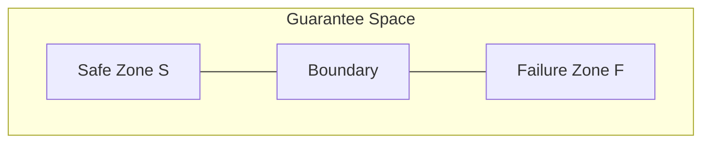

# 14. 移行位相 (Migration Topology)

**Phase 4.5: Geometry Formalization**  
**Document ID:** `docs/80_geometry/14_Migration_Topology.md`  
**Date:** 2026-03-05

---

## 1. はじめに

**移行位相** は、安全/失敗構造を保証空間の位相的分割として形式化する。

---

## 2. 領域定義

### 2.1 失敗ゾーン

$$
\mathcal{F} = \{ (g_1, \dots, g_n) \in GS \mid \exists i: g_i < \tau_i \}
$$

### 2.2 安全ゾーン

$$
\mathcal{S} = \{ (g_1, \dots, g_n) \in GS \mid g_i \ge \tau_i \quad \forall i \}
$$

### 2.3 遷移境界

$$
\partial \mathcal{S} = \{ G \in GS \mid g_i = \tau_i \text{ for some } i \}
$$

---

## 3. 移行の解釈

- **安全な移行**: 経路 $P(t)$ が $\mathcal{S}$ 内に留まる。
- **移行失敗**: 経路が $\mathcal{F}$ に進入する。
- **境界**: 移行が不安全になる臨界閾値。

---

## 4. 図解

---

## 5. 結論

移行位相は、安全/失敗分類のための **位相的枠組み** を提供する。これは距離空間 (10) および経路幾何学 (12) と統合される。
