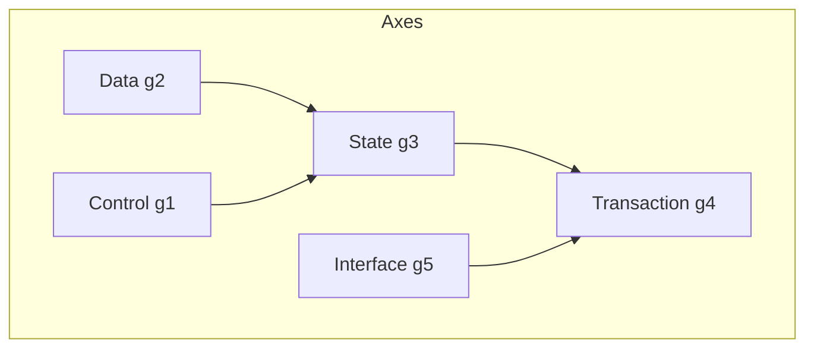
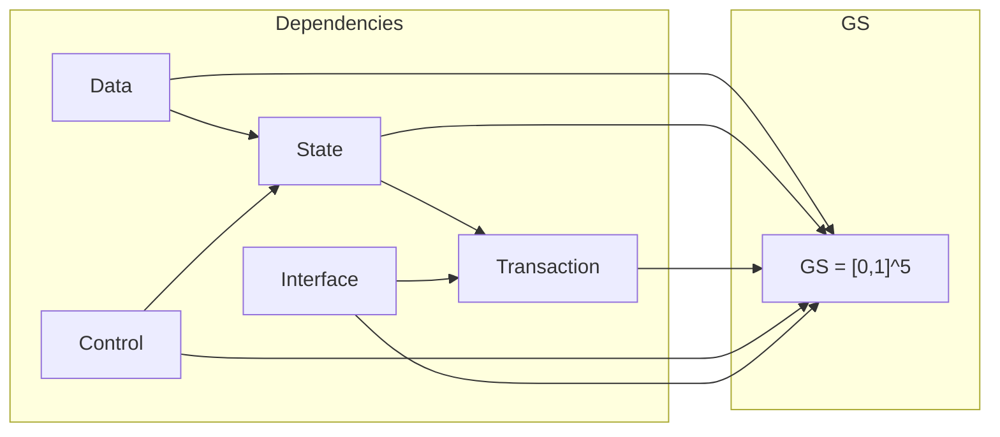

# 16. 保証軸依存関係 (Guarantee Axis Dependency)

**Phase 4.5: Geometry Formalization**  
**Document ID:** `docs/80_geometry/16_Guarantee_Axis_Dependency.md`  
**Date:** 2026-03-05

---

## 1. はじめに

保証軸は **完全に独立ではない**。軸間の構造的依存関係は、移行の順序付けやリスク評価に影響を与える。本文書では **軸依存グラフ** を形式化する。

---

## 2. 依存関係テーブル

| ソース軸 | ターゲット軸 | 意味 |
| :--- | :--- | :--- |
| Data | State | 状態はデータに依存 |
| State | Transaction | トランザクションは状態に依存 |
| Control | State | 制御は状態に依存 |
| Interface | Transaction | インターフェースはトランザクションに依存 |

---

## 3. 軸依存グラフ

---

## 4. 依存関係を持つ幾何学的構造

---

## 5. 依存関係制約

**依存関係制約** は、許容可能な移行経路を制限する。

例えば、Data → State の場合、State に影響を与える移行操作は、Data 保証を侵害してはならない。同様に、Transaction の変更は State 保証を保存しなければならない。

---

## 6. 移行への影響

- **順序付け**: Data と Control は State の前に、State は Transaction の前に対処されるべきである。
- **リスク伝播**: 親軸における劣化は、依存する軸に伝播する。
- **経路幾何学**: 移行経路は可能な限り依存順序を尊重すべきである。
- **経路最適化**: **依存関係制約** は、経路最適化における追加の制約として存在する（12_Migration_Path_Geometry.md 参照）。

---

## 7. 結論

軸依存グラフは、保証次元間の構造的関係を形式化する。これは移行戦略とリスク分析に情報を提供する。
