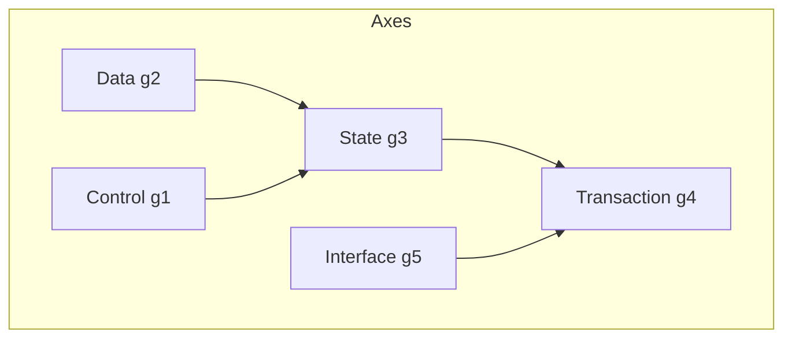

# 16. Guarantee Axis Dependency

**Phase 4.5: Geometry Formalization**  
**Document ID:** `docs/80_geometry/16_Guarantee_Axis_Dependency.md`  
**Date:** 2026-03-05

---

## 1. Introduction

Guarantee Axes are **not fully independent**. Structural dependencies between axes affect migration ordering and risk assessment. This document formalizes the **Axis Dependency Graph**.

---

## 2. Dependency Table

| Source Axis | Target Axis | Meaning |
| :--- | :--- | :--- |
| Data | State | 状態はデータに依存 |
| State | Transaction | トランザクションは状態に依存 |
| Control | State | 制御は状態に依存 |
| Interface | Transaction | インターフェースはトランザクションに依存 |

---

## 3. Axis Dependency Graph



---

## 4. Geometry Structure with Dependencies

```mermaid
flowchart LR
    subgraph Dependencies
        Data --> State
        State --> Transaction
        Control --> State
        Interface --> Transaction
    end
    
    subgraph GS
        GSspace[GS = [0,1]^5]
    end
    
    Data --> GSspace
    State --> GSspace
    Transaction --> GSspace
    Control --> GSspace
    Interface --> GSspace
```

---

## 5. Implications for Migration

- **Ordering**: Data and Control should be addressed before State; State before Transaction.
- **Risk Propagation**: Degradation in a parent axis propagates to dependent axes.
- **Path Geometry**: Migration paths should respect dependency order when possible.

---

## 6. Conclusion

Axis Dependency Graph formalizes structural relationships between guarantee dimensions. It informs migration strategy and risk analysis.
