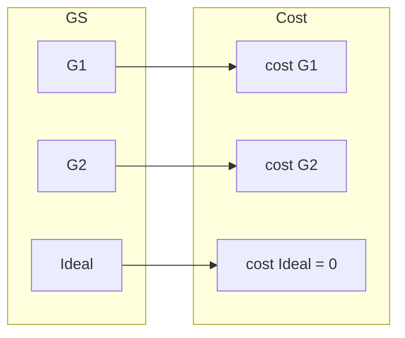
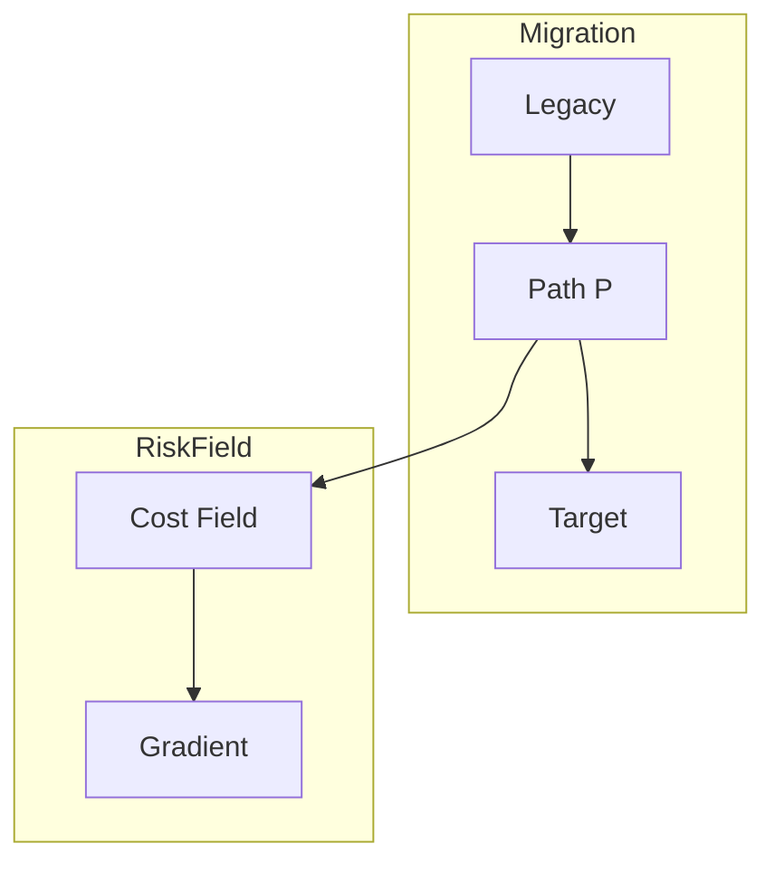

# 17. 移行リスク場 (Migration Risk Field)

**Phase 4.5: Geometry Formalization**  
**Document ID:** `docs/80_geometry/17_Migration_Risk_Field.md`  
**Date:** 2026-03-05

---

## 1. はじめに

**移行リスク場**（コスト場）は、保証空間内の各点に局所的なリスク値を割り当てる。経路リスクは、移行経路に沿ったこの場の積分である。

---

## 2. コスト場定義

**一般形**: コスト関数は任意の非負スカラー場であり得る
$$
cost: GS \to \mathbb{R}_{\ge 0}
$$

**Phase4.5 参照モデル**:
$$
cost(G) = d_w(G, Ideal)
$$

これは、**リスク ≠ 距離** という一般性を保持する。

- **Risk Density**: 局所的移行リスク
- **Cost Field**: 空間上のリスク分布

---

## 3. リスク場図

---

## 4. 勾配

$GS \subset \mathbb{R}^n$ であるため、勾配 $\nabla cost$ は **$\mathbb{R}^n$ から継承された座標系** に関して定義される。

$$
\nabla cost(G) = \text{risk increase direction}
$$

勾配はより高いリスクの方を指す。移行経路は可能な限り、勾配に沿って移動することを避けるべきである。

---

## 5. 経路リスク

$$
Risk(P) = \int_0^1 cost(P(t)) \, dt
$$

経路リスクは、経路に沿ったコスト場の積分である。

---

## 6. 幾何学的構造

---

## 7. 結論

移行リスク場は、局所的リスクを GS 上のスカラー場として形式化する。これは経路幾何学 (12) を距離空間 (10) と接続し、移行経路の最適化をサポートする。
