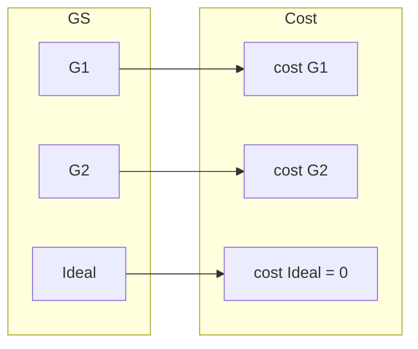
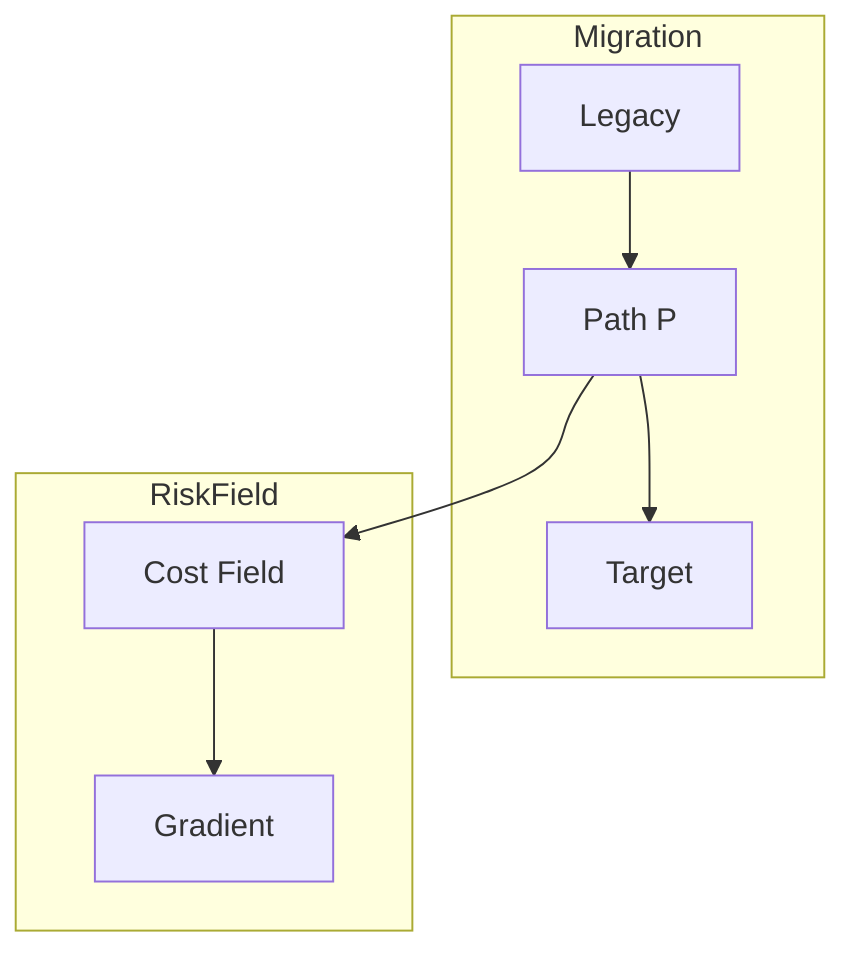

# 17. Migration Risk Field

**Phase 4.5: Geometry Formalization**  
**Document ID:** `docs/80_geometry/17_Migration_Risk_Field.md`  
**Date:** 2026-03-05

---

## 1. Introduction

The **Migration Risk Field** (Cost Field) assigns a local risk value to each point in the Guarantee Space. Path risk is the integral of this field along the migration path.

---

## 2. Cost Field Definition

$$
cost: GS \to \mathbb{R}_{\ge 0}, \quad cost(G) = d_w(G, Ideal)
$$

- **Risk Density**: 局所的移行リスク
- **Cost Field**: 空間上のリスク分布

---

## 3. Risk Field Diagram

---

## 4. Gradient

$$
\nabla cost(G) = \text{risk increase direction}
$$

The gradient points toward higher risk. Migration paths should avoid moving along the gradient when possible.

---

## 5. Path Risk

$$
Risk(P) = \int_0^1 cost(P(t)) \, dt
$$

The path risk is the integral of the cost field along the path.

---

## 6. Geometry Structure

---

## 7. Conclusion

Migration Risk Field formalizes local risk as a scalar field on GS. It connects Path Geometry (12) with Metric Space (10) and supports optimization of migration paths.
