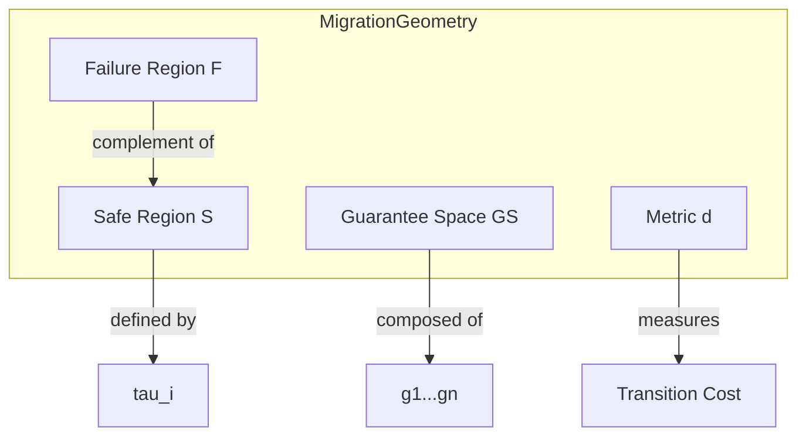

# 20. 移行幾何学定義 (Migration Geometry Definition)

**Phase 5: Migration Geometry Construction**  
**Document ID:** `docs/80_geometry/20_Migration_Geometry_Definition.md`  
**Date:** 2026-03-08

---

## 1. はじめに

移行幾何学は、ソフトウェア移行を **保証空間** 内の幾何学的問題として扱う数学的枠組みである。本文書では **移行幾何学** タプルを形式的に定義する。

---

## 2. 形式的定義

**移行幾何学** はタプル $\mathcal{M}$ である：

$$
\mathcal{M} = (GS, d, \mathcal{S}, \mathcal{F}, \phi)
$$

ここで：

*   **$GS$ (保証空間)**: 保証レベルに関するすべての可能なシステム状態を表す有界超立方体 $[0,1]^n$。これは直交次元を仮定した **一次近似** である。
*   **$d$ (距離)**: 状態間の幾何学的変位を測定する距離関数 $d: GS \times GS \to \mathbb{R}_{\ge 0}$。
*   **$\mathcal{S}$ (安全領域)**: システムが許容可能な保証閾値内で動作する状態を表す部分集合 $\mathcal{S} \subseteq GS$。
*   **$\mathcal{F}$ (失敗領域)**: 許容できない状態を表す補集合 $\mathcal{F} = GS \setminus \mathcal{S}$。
*   **$\phi$ (効用関数)**: 状態の本質的な価値や「健全性」を表すスカラー場 $\phi: GS \to \mathbb{R}$（21_Migration_State_Model 参照）。

---

## 3. 保証空間構造

保証空間は $n$ 個の直交軸によって定義される。

**直交性の仮定**:
このベースラインモデルでは、保証次元は独立であると仮定する。
*   *現実*: 次元はしばしば結合している（例：トランザクション保証は状態の一貫性に依存する）。
*   *モデル*: 幾何学的単純さのために直交として扱い、結合は空間自体を歪めるのではなく **安全領域制約** ($\mathcal{S}$) を通じて処理する。

$$
GS = \prod_{i=1}^{n} [0,1]_i
$$

典型的な次元 ($n=5$):
1.  $g_1$: **Control Flow** (ロジックの意味的等価性)
2.  $g_2$: **Data Flow** (データ系統の整合性)
3.  $g_3$: **State** (状態遷移の一貫性)
4.  $g_4$: **Transaction** (原子性と境界の保存)
5.  $g_5$: **Interface** (外部契約の遵守)

---

## 4. 幾何学的特性

1.  **有界性**: 空間はコンパクトであり、$\vec{0}$ (ゼロ保証) と $\vec{1}$ (理想保証) によって有界である。
2.  **連続性**: 実際の実装ステップは離散的かもしれないが、微積分ベースの最適化（リスク場勾配）を可能にするために、保証を連続変数 $[0,1]$ として扱う。
3.  **異方性**: 空間は等方的ではない。*Data* 軸に沿った移動は、*Interface* 軸に沿った移動とは異なるコスト/リスクプロファイルを持つ可能性がある（重み付き距離 $d$ によって処理される）。

---

## 5. 視覚的表現

---

## 6. 将来の拡張

$\mathcal{M}$ はユークリッド $[0,1]^n$ 基底を使用しているが、将来の研究では以下を探求する可能性がある：

1.  **非直交空間**: $g_{ij}$ 計量テンソルが軸依存関係を捉えるリーマン幾何学。
2.  **束モデル**: 連続的に緩和できない保証のための離散順序理論。
3.  **トポロジー最適化**: 失敗領域を通過する「トンネル」を見つけるための安全領域 $\mathcal{S}$ のホモロジー解析。

---

## 7. 結論

移行幾何学 $\mathcal{M}$ は基礎的な構造を提供する。これは、幾何学的変位 ($d$) を状態効用 ($\phi$) や安全性制約 ($\mathcal{S}$) から分離し、厳密な数学的ベースラインを確立する。
