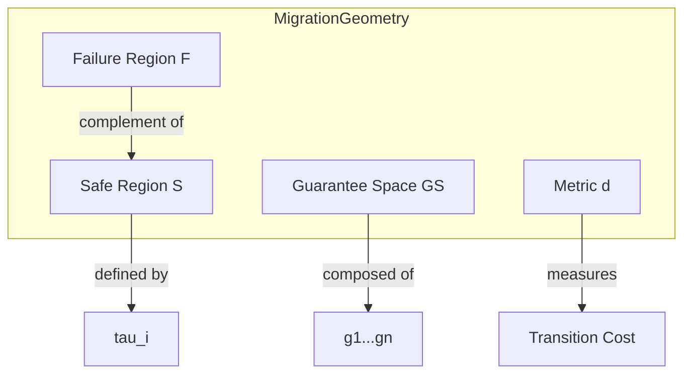

# 20. Migration Geometry Definition

**Phase 5: Migration Geometry Construction**  
**Document ID:** `docs/80_geometry/20_Migration_Geometry_Definition.md`  
**Date:** 2026-03-08

---

## 1. Introduction

Migration Geometry is the mathematical framework that treats software migration as a geometric problem within the **Guarantee Space**. This document formally defines the **Migration Geometry** tuple.

---

## 2. Formal Definition

A **Migration Geometry** is a tuple $\mathcal{M}$:

$$
\mathcal{M} = (GS, d, \mathcal{S}, \mathcal{F}, \phi)
$$

Where:

*   **$GS$ (Guarantee Space)**: The bounded hypercube $[0,1]^n$ representing the space of all possible system states with respect to guarantee levels. This is a **first-order approximation** assuming orthogonal dimensions.
*   **$d$ (Metric)**: A distance function $d: GS \times GS \to \mathbb{R}_{\ge 0}$ measuring the geometric displacement between states.
*   **$\mathcal{S}$ (Safe Region)**: A subset $\mathcal{S} \subseteq GS$ representing states where the system operates within acceptable guarantee thresholds.
*   **$\mathcal{F}$ (Failure Region)**: The complement $\mathcal{F} = GS \setminus \mathcal{S}$, representing unacceptable states.
*   **$\phi$ (Utility Function)**: A scalar field $\phi: GS \to \mathbb{R}$ representing the intrinsic value or "health" of a state (see 21_Migration_State_Model).

---

## 3. Guarantee Space Structure

The Guarantee Space is defined by $n$ orthogonal axes.

**Orthogonality Assumption**:
In this baseline model, we assume guarantee dimensions are independent.
*   *Reality*: Dimensions are often coupled (e.g., Transaction guarantees rely on State consistency).
*   *Model*: We treat them as orthogonal for geometric simplicity, handling couplings via **Safe Region constraints** ($\mathcal{S}$) rather than warping the space itself.

$$
GS = \prod_{i=1}^{n} [0,1]_i
$$

Typical dimensions ($n=5$):
1.  $g_1$: **Control Flow** (Semantic equivalence of logic)
2.  $g_2$: **Data Flow** (Integrity of data lineage)
3.  $g_3$: **State** (Consistency of state transitions)
4.  $g_4$: **Transaction** (Atomicity and boundary preservation)
5.  $g_5$: **Interface** (External contract adherence)

---

## 4. Geometric Properties

1.  **Boundedness**: The space is compact, bounded by $\vec{0}$ (Zero Guarantee) and $\vec{1}$ (Ideal Guarantee).
2.  **Continuity**: We treat guarantees as continuous variables $[0,1]$ to enable calculus-based optimization (Risk Field gradients), though actual implementation steps may be discrete.
3.  **Anisotropy**: The space is not isotropic; movement along the *Data* axis may have a different cost/risk profile than movement along the *Interface* axis (handled by the weighted metric $d$).

---

## 5. Visual Representation

---

## 6. Future Extensions

While $\mathcal{M}$ uses a Euclidean $[0,1]^n$ basis, future research may explore:

1.  **Non-Orthogonal Space**: Riemannian geometry where $g_{ij}$ metric tensor captures axis dependencies.
2.  **Lattice Models**: Discrete order theory for guarantees that cannot be continuously relaxed.
3.  **Topology Optimization**: Homological analysis of the Safe Region $\mathcal{S}$ to find "tunnels" through the Failure Region.

---

## 7. Conclusion

Migration Geometry $\mathcal{M}$ provides the foundational structure. It establishes a rigorous mathematical baseline, separating geometric displacement ($d$) from state utility ($\phi$) and safety constraints ($\mathcal{S}$).
