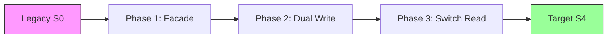

# 21. 移行状態モデル (Migration State Model)

**Phase 5: Migration Geometry Construction**  
**Document ID:** `docs/80_geometry/21_Migration_State_Model.md`  
**Date:** 2026-03-08

---

## 1. はじめに

**移行状態** は、特定の時点におけるシステムの保証レベルのスナップショットを表す。移行幾何学において、状態は保証空間内の **点** である。

---

## 2. 状態定義

状態 $S$ は $GS$ 内のベクトルである：

$$
S = (g_1, g_2, \dots, g_n) \in [0,1]^n
$$

### 2.1 主要な参照状態

*   **レガシー状態 ($S_{legacy}$)**: 移行の出発点。通常、既存の振る舞いに対して高い保証を仮定するが、構造的には不透明な場合がある。
    *   例: それ自身に対して $S_{legacy} = (1.0, 1.0, 1.0, 1.0, 1.0)$。
    *   *注: しばしばターゲットをレガシーに対して正規化するか、その逆を行う。ここでは、$1.0$ を「理想」または「ターゲット」要件が満たされた状態と定義する。*

*   **ターゲット状態 ($S_{target}$)**: 移行のゴール。
    *   例: $S_{target} = (1.0, 1.0, 1.0, 1.0, 1.0)$ (完全な等価性 + 近代化)。

*   **ゼロ状態 ($S_{zero}$)**: 保証の完全な喪失。
    *   $S_{zero} = (0, 0, 0, 0, 0)$。

### 2.2 中間状態

移行は中間状態 $S_t$ を通過することを伴う。

*   **部分移行**: $S_{partial} = (1.0, 0.8, 0.5, 1.0, 0.9)$
    *   *解釈*: ロジックとトランザクションは完璧、データは許容範囲だが、状態の一貫性は一時的に低下している（例：二重書き込み実装中）。

---

## 3. 状態分類

状態は、安全領域 $\mathcal{S}$ に対する位置に基づいて分類される。

1.  **許容状態 (Admissible State)**: $S \in \mathcal{S}$。システムは機能しており安全である。
2.  **不許可状態 (Inadmissible State)**: $S \in \mathcal{F}$。システムは壊れているか、クリティカルな制約（例：データ破損）に違反している。
3.  **境界状態 (Boundary State)**: $S \in \partial\mathcal{S}$。システムは失敗の瀬戸際にあり、エラーのマージンはゼロである。

---

## 4. 状態評価 (効用)

状態がどこから来たかに関わらず、状態の「良さ」を評価するために、スカラー **効用関数** $\phi(S)$ を導入する。

$$
\phi(S) = \text{Utility}(S) \in [0, 1]
$$

*   $\phi(S) \approx 1.0$: 高品質な状態（高い保証、低い技術的負債）。
*   $\phi(S) \approx 0.0$: 低品質な状態。

### 4.1 効用 vs. 安全性

*   **安全性**: 二値分類 ($S \in \mathcal{S}$ または $S \notin \mathcal{S}$)。
*   **効用**: $\mathcal{S}$ 内の連続的な勾配。状態は安全だが効用が低い場合がある（例：「安全だが機能は最小限」）。

---

## 5. 状態遷移

遷移 $T$ は2つの状態間のベクトル差分である：

$$
T_{a \to b} = S_b - S_a = \Delta S
$$

*   **正の遷移**: $\Delta g_i > 0$ (保証の改善 / 回復)
*   **負の遷移**: $\Delta g_i < 0$ (保証の劣化 / リスク受容)

---

## 6. 例: ストラングラーパターンの状態

*   $S_0$: すべてレガシー
*   $S_1$: インターフェース安定 ($g_5=1$)、内部ロジックは不透明。
*   $S_2$: データ同期 ($g_2 \approx 1$)、しかし複雑性は高い。
*   $S_3$: 状態移行 ($g_3 \to 1$)。

---

## 7. 結論

移行状態モデルは、システムの「場所」と「良さ」を定義する。
*   **位置**: 座標ベクトル $S$。
*   **価値**: 効用 $\phi(S)$。
*   **妥当性**: $\mathcal{S}$ への包含。

この分離により、安全境界を尊重しながら高効用状態に向けて最適化することが可能になる。
