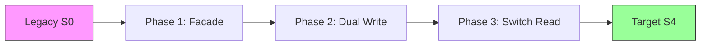

# 21. Migration State Model

**Phase 5: Migration Geometry Construction**  
**Document ID:** `docs/80_geometry/21_Migration_State_Model.md`  
**Date:** 2026-03-08

---

## 1. Introduction

A **Migration State** represents a snapshot of the system's guarantee levels at a specific point in time. In Migration Geometry, a state is a **point** within the Guarantee Space.

---

## 2. State Definition

A state $S$ is a vector in $GS$:

$$
S = (g_1, g_2, \dots, g_n) \in [0,1]^n
$$

### 2.1 Key Reference States

*   **Legacy State ($S_{legacy}$)**: The starting point of migration. Typically assumes high guarantees for existing behavior but may be structurally opaque.
    *   Example: $S_{legacy} = (1.0, 1.0, 1.0, 1.0, 1.0)$ relative to itself.
    *   *Note: Often we normalize the target relative to the legacy, or vice versa. Here, we define $1.0$ as the "Ideal" or "Target" requirement met.*

*   **Target State ($S_{target}$)**: The goal of the migration.
    *   Example: $S_{target} = (1.0, 1.0, 1.0, 1.0, 1.0)$ (Full equivalence + Modernization).

*   **Zero State ($S_{zero}$)**: Total loss of guarantees.
    *   $S_{zero} = (0, 0, 0, 0, 0)$.

### 2.2 Intermediate States

Migration involves passing through intermediate states $S_t$.

*   **Partial Migration**: $S_{partial} = (1.0, 0.8, 0.5, 1.0, 0.9)$
    *   *Interpretation*: Logic and Transaction are perfect, Data is acceptable, but State consistency is temporarily degraded (e.g., during dual-write implementation).

---

## 3. State Classification

States are classified based on their location relative to the Safe Region $\mathcal{S}$.

1.  **Admissible State**: $S \in \mathcal{S}$. The system is functional and safe.
2.  **Inadmissible State**: $S \in \mathcal{F}$. The system is broken or violates critical constraints (e.g., data corruption).
3.  **Boundary State**: $S \in \partial\mathcal{S}$. The system is on the edge of failure; zero margin for error.

---

## 4. State Evaluation (Utility)

We introduce a scalar **Utility Function** $\phi(S)$ to evaluate the "goodness" of a state, independent of where it came from.

$$
\phi(S) = \text{Utility}(S) \in [0, 1]
$$

*   $\phi(S) \approx 1.0$: High-quality state (high guarantees, low technical debt).
*   $\phi(S) \approx 0.0$: Low-quality state.

### 4.1 Utility vs. Safety

*   **Safety**: Binary classification ($S \in \mathcal{S}$ or $S \notin \mathcal{S}$).
*   **Utility**: Continuous gradient within $\mathcal{S}$. A state can be safe but have low utility (e.g., "Safe but minimal functionality").

---

## 5. State Transitions

A transition $T$ is a vector difference between two states:

$$
T_{a \to b} = S_b - S_a = \Delta S
$$

*   **Positive Transition**: $\Delta g_i > 0$ (Guarantee improvement / Recovery)
*   **Negative Transition**: $\Delta g_i < 0$ (Guarantee degradation / Risk acceptance)

---

## 5. Example: Strangler Pattern States

*   $S_0$: All Legacy
*   $S_1$: Interface stable ($g_5=1$), internal logic opaque.
*   $S_2$: Data synched ($g_2 \approx 1$), but complexity high.
*   $S_3$: State moved ($g_3 \to 1$).

---

## 7. Conclusion

The Migration State Model defines the "where" and "how good" of a system.
*   **Position**: Coordinate vector $S$.
*   **Value**: Utility $\phi(S)$.
*   **Validity**: Inclusion in $\mathcal{S}$.

This separation allows us to optimize for high-utility states while respecting safety boundaries.
