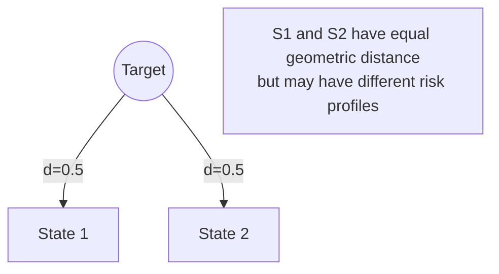

# 22. Migration Distance Metric

**Phase 5: Migration Geometry Construction**  
**Document ID:** `docs/80_geometry/22_Migration_Distance_Metric.md`  
**Date:** 2026-03-08

---

## 1. Introduction

**Migration Distance** quantifies the "effort," "cost," or "change magnitude" required to move between two states. It is the fundamental metric $d$ in the geometry $\mathcal{M}$.

---

## 2. Metric Definition

We define a **Weighted Euclidean Metric** (L2) as the standard distance function, though L1 (Manhattan) is also useful for specific cost models.

### 2.1 Weighted L2 Metric (Effort/Risk)

$$
d_w(A, B) = \sqrt{ \sum_{i=1}^{n} w_i (b_i - a_i)^2 }
$$

*   $A, B$: Two states in $GS$.
*   $w_i$: **Weight** of dimension $i$. High weight implies "hard to change" or "critical to preserve."

### 2.2 Weighted L1 Metric (Cumulative Work)

$$
d_{L1}(A, B) = \sum_{i=1}^{n} w_i |b_i - a_i|
$$

*   Represents the total "amount of stuff" that needs to be migrated if axes are independent.

---

## 3. Weighting Strategy ($w_i$)

Weights reflect the **structural rigidity** or **business criticality** of each guarantee dimension.

| Dimension | Weight ($w_i$) | Rationale |
| :--- | :--- | :--- |
| **Data ($g_2$)** | **High (e.g., 2.0)** | Data is persistent and hardest to repair if corrupted. |
| **Transaction ($g_4$)** | **High (e.g., 1.8)** | Transaction boundaries define consistency; hard to refactor. |
| **State ($g_3$)** | **Medium (e.g., 1.5)** | State transition logic is complex but localizable. |
| **Control ($g_1$)** | **Medium (e.g., 1.2)** | Logic translation is automatable to some extent. |
| **Interface ($g_5$)** | **Low (e.g., 1.0)** | Interfaces can be wrapped/adapted (Facade pattern). |

---

## 4. Distance Interpretation

1.  **Distance to Target**: $d(S_{current}, S_{target})$
    *   Proxy for **Remaining Effort**.
2.  **Distance from Safe Boundary**: $\min_{B \in \partial\mathcal{S}} d(S_{current}, B)$
    *   Proxy for **Safety Margin**.
3.  **Step Distance**: $d(S_t, S_{t+1})$
    *   Proxy for **Step Risk/Cost**. Large jumps are riskier.

---

## 5. Geometry of Costs

Visually, states equidistant from the Target form hyperspheres (in L2) or hypercubes (in L1) centered on the Target.

*Note: Distance measures magnitude. **Risk** implies direction (approaching the Failure Region). Distance combined with the Safe Region defines the optimization landscape.*

---

## 6. Conclusion

The Migration Distance Metric maps abstract "migration difficulty" to a concrete scalar value, enabling quantitative comparison of different migration paths.
