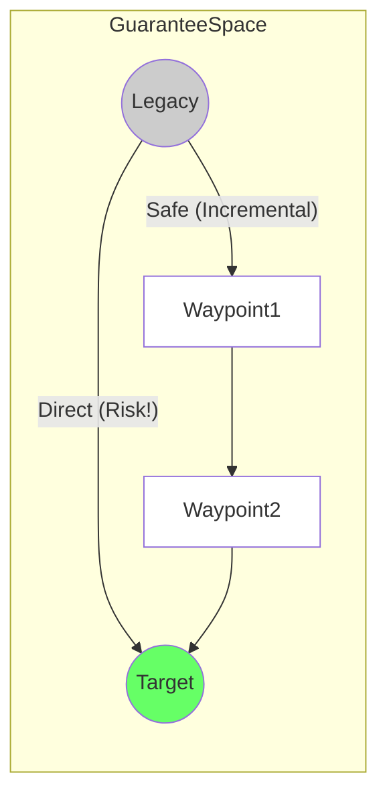

# 23. 移行経路モデル (Migration Path Model)

**Phase 5: Migration Geometry Construction**  
**Document ID:** `docs/80_geometry/23_Migration_Path_Model.md`  
**Date:** 2026-03-08

---

## 1. はじめに

**移行経路** は、レガシーからターゲットへの保証空間を通るシステムの軌跡である。これは移行実行の *戦略* を表す。

---

## 2. 経路定義

### 2.1 連続経路 (理論的)

$$
P: [0, 1] \to GS
$$

*   $P(0) = S_{legacy}$
*   $P(1) = S_{target}$
*   $P(t)$ は移行進捗 $t$ におけるシステム状態を表す。

### 2.2 離散経路 (運用的)

$$
P = \langle S_0, S_1, S_2, \dots, S_k \rangle
$$

*   $S_0 = S_{legacy}$
*   $S_k = S_{target}$
*   各ステップ $S_i \to S_{i+1}$ は移行イテレーション（スプリント、リリース）を表す。

---

## 3. 経路タイプ

### 3.1 直接経路 (ビッグバン)

*   **軌跡**: $S_{legacy}$ と $S_{target}$ を結ぶ測地線（直線）。
*   **特徴**: 最短の幾何学的距離 ($d$)。
*   **リスク**: しばしば $\mathcal{F}$（失敗領域）を横断する。高い露出。
*   **コスト**: 経路統合コストは低いが、失敗した場合のリスクコストは無限大。

### 3.2 安全経路 (インクリメンタル)

*   **軌跡**: $\mathcal{S}$ 内に留まるように制約された曲線。
*   **特徴**: 距離が長い ($d_{safe} > d_{direct}$)。
*   **リスク**: 最小化される。
*   **コスト**: 統合コスト（アダプタ、足場）は高いが、リスクは有界。

### 3.3 境界経路 (アグレッシブ)

*   **軌跡**: 境界 $\partial\mathcal{S}$ に沿う。
*   **特徴**: 最小限の安全性を維持しつつ、速度/効率を最大化する。
*   **リスク**: 摂動に対する感度が高い。

---

## 4. 経路の視覚化

---

## 5. 経路特性

1.  **経路長 (総変位)**:
    $$ L(P) = \int_0^1 |\dot{P}(t)| dt $$
    コード変更の総量のプロキシ。

2.  **安全クリアランス**:
    $$ \min_t \text{dist}(P(t), \partial\mathcal{F}) $$
    プロジェクト中の最小エラーマージン。

---

## 6. 結論

移行経路モデルは、**経路の幾何学**（形状）を **移行の物理学**（コスト/リスク）から分離する。最適化は、長さ vs 安全性のバランスをとる「最良の」形状を探索する。
