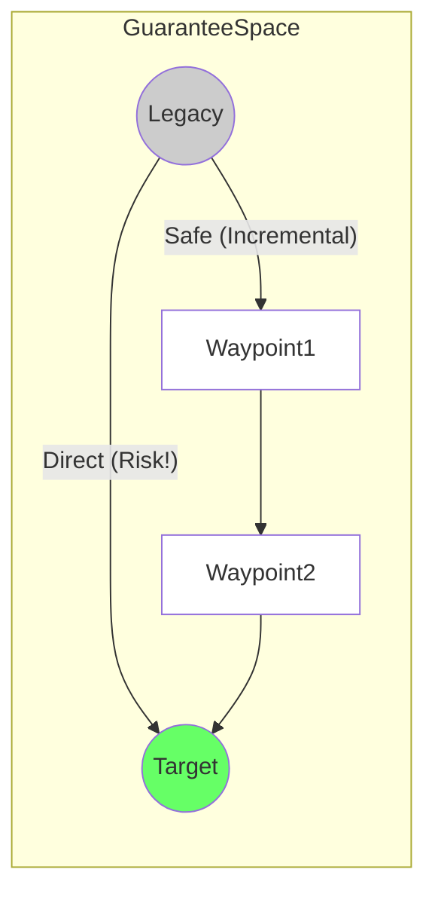

# 23. Migration Path Model

**Phase 5: Migration Geometry Construction**  
**Document ID:** `docs/80_geometry/23_Migration_Path_Model.md`  
**Date:** 2026-03-08

---

## 1. Introduction

A **Migration Path** is the trajectory of the system through the Guarantee Space from Legacy to Target. It represents the *strategy* of migration execution.

---

## 2. Path Definition

### 2.1 Continuous Path (Theoretical)

$$
P: [0, 1] \to GS
$$

*   $P(0) = S_{legacy}$
*   $P(1) = S_{target}$
*   $P(t)$ represents the system state at migration progress $t$.

### 2.2 Discrete Path (Operational)

$$
P = \langle S_0, S_1, S_2, \dots, S_k \rangle
$$

*   $S_0 = S_{legacy}$
*   $S_k = S_{target}$
*   Each step $S_i \to S_{i+1}$ represents a migration iteration (sprint, release).

---

## 3. Path Types

### 3.1 Direct Path (Big Bang)

*   **Trajectory**: Geodesic (straight line) connecting $S_{legacy}$ and $S_{target}$.
*   **Characteristics**: Shortest geometric distance ($d$).
*   **Risk**: Often traverses $\mathcal{F}$ (Failure Region). High exposure.
*   **Cost**: Low path integration cost, but infinite risk cost if it fails.

### 3.2 Safe Path (Incremental)

*   **Trajectory**: A curve constrained to stay within $\mathcal{S}$.
*   **Characteristics**: Longer distance ($d_{safe} > d_{direct}$).
*   **Risk**: Minimized.
*   **Cost**: Higher integration cost (adapters, scaffolding), but bounded risk.

### 3.3 Boundary Path (Aggressive)

*   **Trajectory**: Hugs the boundary $\partial\mathcal{S}$.
*   **Characteristics**: Maximizes speed/efficiency while barely maintaining minimum safety.
*   **Risk**: High sensitivity to perturbations.

---

## 4. Path Visualization

---

## 5. Path Properties

1.  **Path Length (Total Displacement)**:
    $$ L(P) = \int_0^1 |\dot{P}(t)| dt $$
    Proxy for total volume of code changes.

2.  **Safety Clearance**:
    $$ \min_t \text{dist}(P(t), \partial\mathcal{F}) $$
    Minimum margin of error during the project.

---

## 6. Conclusion

The Migration Path Model separates the **Geometry of the Path** (shape) from the **Physics of Migration** (cost/risk). Optimization seeks the "best" shape that balances Length vs. Safety.