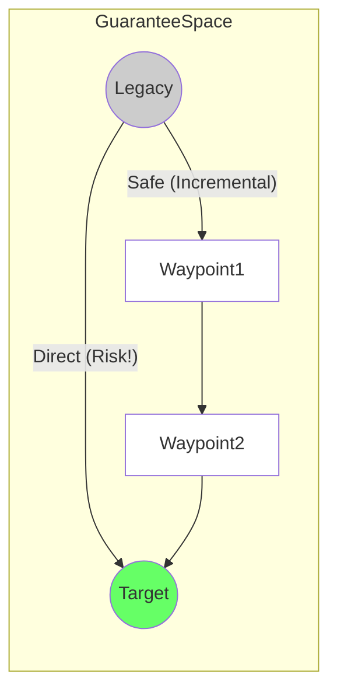

# 23. Migration Path Model

**Phase 5: Migration Geometry Construction**  
**Document ID:** `docs/80_geometry/23_Migration_Path_Model.md`  
**Date:** 2026-03-08

---

## 1. Introduction

A **Migration Path** is the trajectory of the system through the Guarantee Space from Legacy to Target. It represents the *strategy* of migration execution.

---

## 2. Path Definition

### 2.1 Continuous Path (Theoretical)

$$
P: [0, 1] \to GS
$$

*   $P(0) = S_{legacy}$
*   $P(1) = S_{target}$
*   $P(t)$ represents the system state at migration progress $t$.

### 2.2 Discrete Path (Operational)

$$
P = \langle S_0, S_1, S_2, \dots, S_k \rangle
$$

*   $S_0 = S_{legacy}$
*   $S_k = S_{target}$
*   Each step $S_i \to S_{i+1}$ represents a migration iteration (sprint, release).

---

## 3. Path Types

### 3.1 Direct Path (Big Bang)

*   **Trajectory**: Straight line connecting $S_{legacy}$ and $S_{target}$.
*   **Characteristics**: Shortest geometric distance, but often passes through the **Failure Region** (high risk during the "black box" rewrite phase).
*   **Risk**: High probability of $P(t) \in \mathcal{F}$ for $0 < t < 1$.

### 3.2 Safe Path (Incremental)

*   **Trajectory**: A curve that stays strictly within the **Safe Region** $\mathcal{S}$.
*   **Characteristics**: Longer total distance (more steps, intermediate adapters), but maintains system availability and correctness throughout.
*   **Risk**: Low. $P(t) \in \mathcal{S}$ for all $t$.

### 3.3 Boundary Path (Aggressive)

*   **Trajectory**: Hugs the boundary $\partial\mathcal{S}$.
*   **Characteristics**: Maximizes speed/efficiency while barely maintaining minimum safety.
*   **Risk**: High sensitivity to perturbations.

---

## 4. Path Visualization

---

## 5. Path Constraints

1.  **Safety Constraint**:
    $$ \forall t, P(t) \in \mathcal{S} $$
2.  **Monotonicity (Optional)**:
    Ideally, $d(P(t), S_{target})$ should be strictly decreasing. In reality, some steps (e.g., refactoring) might temporarily increase distance to build a better foundation (backtracking).

---

## 6. Conclusion

The Migration Path Model formalizes "migration strategy" as a geometric curve. The core problem of migration design becomes **finding a path $P$ that connects Legacy to Target while staying within $\mathcal{S}$ and minimizing Cost**.
