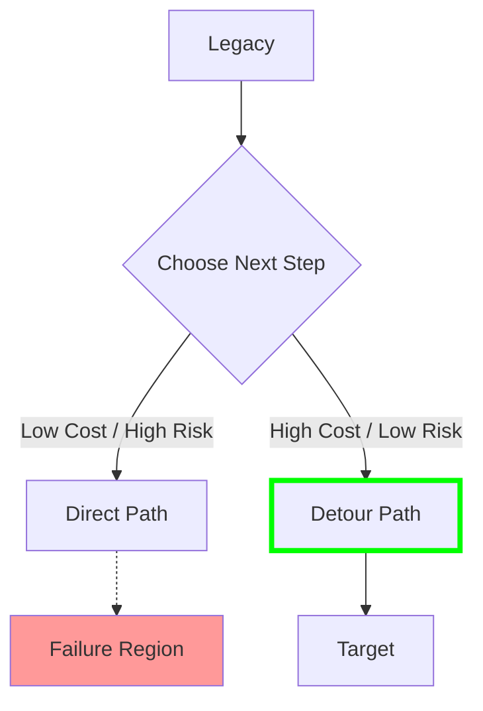

# 25. Migration Optimization Model

**Phase 5: Migration Geometry Construction**  
**Document ID:** `docs/80_geometry/25_Migration_Optimization_Model.md`  
**Date:** 2026-03-08

---

## 1. Introduction

**Migration Optimization** is the mathematical formulation of finding the "best" migration plan. It combines the Geometry, Metric, and Path models into an optimization problem.

---

## 2. Objective Function

We seek to minimize the **Total Migration Cost** $J(P)$.

$$
\min_{P} J(P) = \int_{0}^{1} \left[ \underbrace{Cost(P(t), \dot{P}(t))}_{\text{Movement Cost}} + \underbrace{Risk(P(t))}_{\text{Position Risk}} \right] dt
$$

### 2.1 Terms

1.  **Movement Cost**: Cost of engineering work. Proportional to path length and difficulty.
    *   $\propto d_w(P(t), P(t+\Delta t))$
2.  **Position Risk** (Risk Field): Cost of operating in a degraded state.
    *   $\propto \frac{1}{\text{dist}(P(t), \partial\mathcal{F})}$ (Inverse distance to failure)
    *   High cost if path gets too close to failure boundary.

---

## 3. Constraints

The optimization is subject to:

1.  **Boundary Conditions**:
    *   $P(0) = S_{legacy}$
    *   $P(1) = S_{target}$
2.  **Safety Constraint**:
    *   $P(t) \in \mathcal{S} \quad \forall t \in [0,1]$
3.  **Resource Constraint** (Optional):
    *   $\int |\dot{P}(t)| dt \le \text{Budget}$

---

## 4. The Shortest Safe Path Problem

This is equivalent to the **Shortest Path Problem with Obstacles** in robotics.

*   **Obstacles**: The Failure Region $\mathcal{F}$.
*   **Terrain**: The Guarantee Space with weighted movement costs.

### 4.1 Solution Approaches

1.  **Grid Search / A***: Discretize GS and find the shortest path on the grid.
2.  **Potential Fields**: Treat Target as an attractive force and $\mathcal{F}$ as a repulsive force. The path follows the gradient descent.

---

## 5. Optimization Diagram

---

## 6. Conclusion

Migration planning is mathematically defined as a constrained optimization problem.
*   **Objective**: Minimize (Work + Risk).
*   **Constraint**: Stay Safe.

This formalization allows us to use algorithmic approaches to suggest optimal migration strategies in Phase 6.
