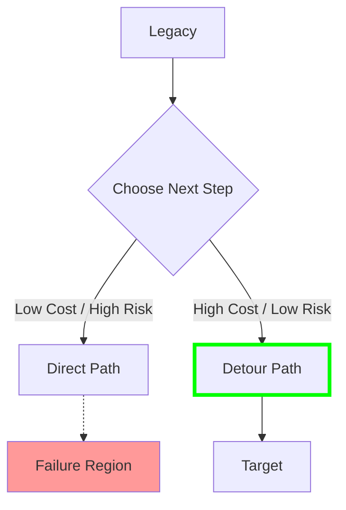

# 25. 移行最適化モデル (Migration Optimization Model)

**Phase 5: Migration Geometry Construction**  
**Document ID:** `docs/80_geometry/25_Migration_Optimization_Model.md`  
**Date:** 2026-03-08

---

## 1. はじめに

**移行最適化** は、「最良の」移行計画を見つけるための数学的定式化である。これは幾何学、メトリクス、経路モデルを最適化問題に統合する。

---

## 2. 目的関数

**総移行コスト** $J(P)$ を最小化することを目指す。
この関数は **運用労力** と **リスク露出** を統合する。

$$
\min_{P} J(P) = \int_{0}^{1} \left[ \underbrace{C_{ops}(\dot{P}(t))}_{\text{Effort}} + \underbrace{C_{risk}(P(t))}_{\text{Exposure}} - \underbrace{\phi(P(t))}_{\text{Utility}} \right] dt
$$

### 2.1 項

1.  **労力 (運動エネルギー)**: 変更のコスト。
    *   $C_{ops} \propto |\dot{P}(t)|^2$ (または L1 では $|\dot{P}|$ )。
    *   急激な変更（高速度）は不均衡にコストがかかる（残業、認知的負荷）。
2.  **リスク露出 (位置エネルギー)**: 危険のコスト。
    *   $C_{risk} \propto \frac{1}{\text{dist}(P(t), \partial\mathcal{F})}$。
    *   失敗に近づきすぎることへのペナルティ。
3.  **効用獲得**:
    *   高効用状態で過ごす時間を最大化したい（オプション項、段階的な価値提供に関連）。

---

## 3. 制約

最適化は以下に従う：

1.  **ハード制約 (安全性)**:
    *   $P(t) \in \mathcal{S} \quad \forall t$
2.  **境界条件**:
    *   $P(0) = S_{legacy}, \quad P(1) = S_{target}$
3.  **ダイナミクス (リソース制限)**:
    *   $|\dot{P}(t)| \le V_{max}$ (チーム容量制限)。

---

## 4. 最短安全経路問題

これはロボット工学における **障害物あり最短経路問題** と等価である。

*   **障害物**: 失敗領域 $\mathcal{F}$。
*   **地形**: 重み付き移動コストを持つ保証空間。

### 4.1 解法アプローチ

1.  **グリッド探索 / A***: GS を離散化し、グリッド上の最短経路を見つける。
2.  **ポテンシャル場**: ターゲットを引力、$\mathcal{F}$ を斥力として扱う。経路は勾配降下に従う。

---

## 5. 最適化図

---

## 6. 結論

移行計画は **制約付き最適制御問題** として定式化される。
*   **状態**: 保証ベクトル $S$。
*   **制御**: 移行速度 $\dot{P}$ (変更率)。
*   **コスト**: 労力 + リスク - 効用。

このモデルは、「アジャイル vs ウォーターフォール」の議論を、最適化ランドスケープにおけるパラメータ選択として数学的に基礎づける。
