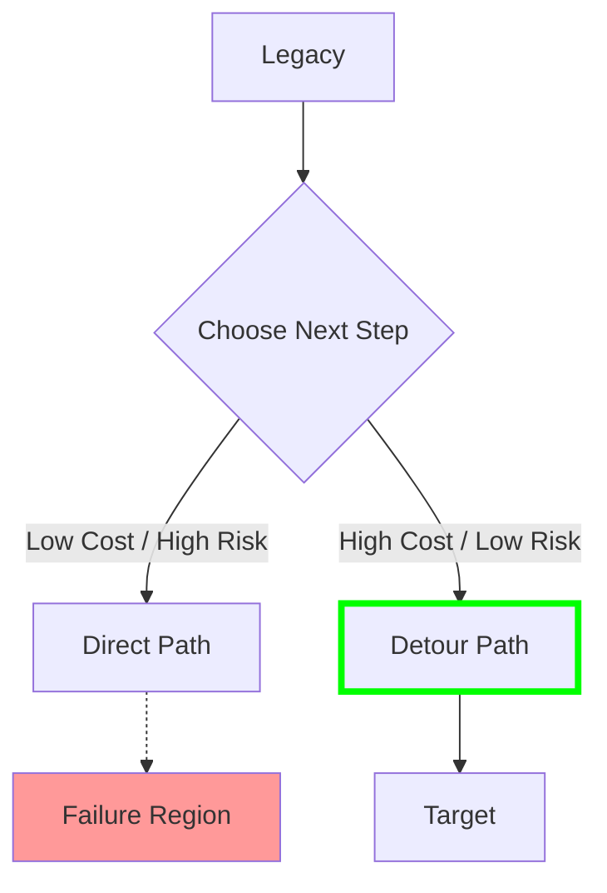

# 25. Migration Optimization Model

**Phase 5: Migration Geometry Construction**  
**Document ID:** `docs/80_geometry/25_Migration_Optimization_Model.md`  
**Date:** 2026-03-08

---

## 1. Introduction

**Migration Optimization** is the mathematical formulation of finding the "best" migration plan. It combines the Geometry, Metric, and Path models into an optimization problem.

---

## 2. Objective Function

We seek to minimize the **Total Migration Cost** $J(P)$.
This function integrates **Operational Effort** and **Risk Exposure**.

$$
\min_{P} J(P) = \int_{0}^{1} \left[ \underbrace{C_{ops}(\dot{P}(t))}_{\text{Effort}} + \underbrace{C_{risk}(P(t))}_{\text{Exposure}} - \underbrace{\phi(P(t))}_{\text{Utility}} \right] dt
$$

### 2.1 Terms

1.  **Effort (Kinetic Energy)**: Cost of change.
    *   $C_{ops} \propto |\dot{P}(t)|^2$ (or $|\dot{P}|$ in L1).
    *   Rapid changes (high velocity) cost disproportionately more (overtime, cognitive load).
2.  **Risk Exposure (Potential Energy)**: Cost of danger.
    *   $C_{risk} \propto \frac{1}{\text{dist}(P(t), \partial\mathcal{F})}$.
    *   Penalty for getting too close to failure.
3.  **Utility Gain**:
    *   We want to maximize time spent in high-utility states (optional term, relevant for incremental value delivery).

---

## 3. Constraints

The optimization is subject to:

1.  **Hard Constraint (Safety)**:
    *   $P(t) \in \mathcal{S} \quad \forall t$
2.  **Boundary Conditions**:
    *   $P(0) = S_{legacy}, \quad P(1) = S_{target}$
3.  **Dynamics (Resource Limits)**:
    *   $|\dot{P}(t)| \le V_{max}$ (Team capacity limit).

---

## 4. The Shortest Safe Path Problem

This is equivalent to the **Shortest Path Problem with Obstacles** in robotics.

*   **Obstacles**: The Failure Region $\mathcal{F}$.
*   **Terrain**: The Guarantee Space with weighted movement costs.

### 4.1 Solution Approaches

1.  **Grid Search / A***: Discretize GS and find the shortest path on the grid.
2.  **Potential Fields**: Treat Target as an attractive force and $\mathcal{F}$ as a repulsive force. The path follows the gradient descent.

---

## 5. Optimization Diagram

---

## 6. Conclusion

Migration planning is formulated as a **Constrained Optimal Control Problem**.
*   **State**: Guarantee Vector $S$.
*   **Control**: Migration Velocity $\dot{P}$ (Change Rate).
*   **Cost**: Effort + Risk - Utility.

This model mathematically grounds "Agile vs. Waterfall" debates as parameter choices in an optimization landscape.
