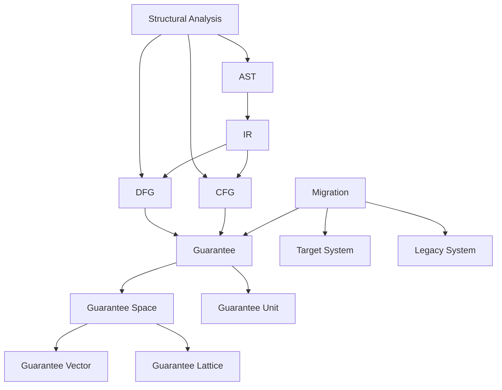

# 相互参照マップ (Cross Reference Map)

用語間の**相互参照関係**を可視化し、概念間のつながりを示します。

## 中核概念の参照関係



## 層間参照パターン

| From Layer | To Layer | 参照の性質 | 主要な関係 |
|------------|----------|------------|------------|
| **Syntax → Structure** | 構文から構造へ | 解析の入力 | AST → IR, CFG, DFG |
| **Structure → Guarantee** | 構造から保証へ | 根拠の提供 | CFG/DFG → Guarantee Unit |
| **Structure → Geometry** | 構造から幾何へ | 空間の構成 | Scope → Guarantee Space |
| **Guarantee → Geometry** | 保証から幾何へ | 空間の定義 | Guarantee → Guarantee Space |
| **Geometry → Decision** | 幾何から判断へ | 判断材料 | Migration Path → Migration Decision |
| **Structure → Decision** | 構造から判断へ | 直接評価 | Structural Risk → Migration Decision |

## 高参照用語（5回以上参照される）

| 用語 | 参照数（概算） | 主な参照元Layer |
|------|----------------|----------------|
| **CFG** | 15+ | Structure, Decision |
| **DFG** | 12+ | Structure, Decision |
| **Guarantee** | 10+ | Guarantee, Geometry, Decision |
| **Migration** | 8+ | Decision, Geometry |
| **Scope** | 8+ | Structure, Decision |
| **Migration Risk** | 6+ | Decision, Geometry |
| **Structural Risk** | 5+ | Decision |

## 概念クラスター

### クラスター1: 構造解析基盤
- **中心**: AST, IR, CFG, DFG
- **周辺**: Basic Block, Node/Edge Taxonomy, Define-Use

### クラスター2: 保証理論
- **中心**: Guarantee, Guarantee Unit  
- **周辺**: Guarantee Composition, Verification, Invariant

### クラスター3: 空間・幾何学
- **中心**: Guarantee Space, Migration Path
- **周辺**: Safe/Failure Region, Migration Cost/Risk

### クラスター4: スコープ・境界
- **中心**: Scope, Scope Boundary
- **周辺**: Impact Scope, Migration Unit, Granularity

### クラスター5: 判断・評価
- **中心**: Migration Decision, Migration Feasibility
- **周辺**: Risk Patterns, Metrics, Strategy

## 参照チェーン例

### 例1: 構造から判断への流れ
```
AST → IR → DFG → Impact Closure → Migration Risk → Migration Decision
```

### 例2: 保証から幾何学への流れ  
```
Guarantee → Guarantee Space → Migration Path → Migration Optimization
```

### 例3: 制御分析の流れ
```
AST → CFG → Basic Block → Control Risk Pattern → Migration Decision
```

## 循環参照

以下の用語ペアは**相互に参照**しています（設計上の意図的な循環）：

- **Define-Use Chain** ↔ **Use-Define Chain**
- **Safe Region** ↔ **Failure Region**  
- **Aggregation Edge** ↔ **Decomposition Edge**
- **Join Operation** ↔ **Meet Operation**
- **Migration Cost** ↔ **Migration Risk**

これらは概念的に対称・補完的な関係にあります。

## 未参照用語（isolated terms）

現在のところ、他の用語から参照されていない**独立用語**はありません。すべての用語が適切に相互接続されています。

---

*この相互参照マップにより、用語集の概念的な一貫性と完全性を確認できます。*