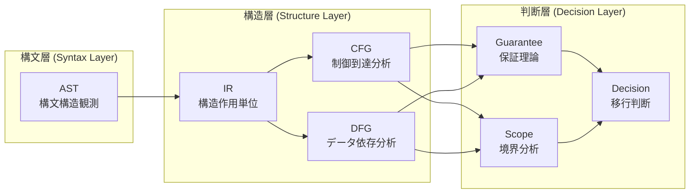

# COBOL Structure Analysis for Migration Decision Support: A Comprehensive Framework of Abstract Syntax Trees, Intermediate Representations, and Graph-Based Models

**Authors**: COBOL Structure Analysis Lab Research Team  
**Date**: April 8, 2026  
**Institution**: COBOL Structure Analysis Lab

---

## Abstract

Legacy COBOL systems present significant challenges for migration decisions due to their complex control flows, intricate data dependencies, and decades of accumulated technical debt. Traditional migration approaches often fail due to inadequate structural analysis that relies primarily on syntax-level examination without considering the deeper architectural relationships that affect migration risk, cost, and feasibility.

This paper presents a comprehensive framework for COBOL structural analysis that progresses through multiple abstraction layers: Abstract Syntax Trees (AST) for syntax observation, Intermediate Representations (IR) for structural action units, Control Flow Graphs (CFG) for control reachability analysis, and Data Flow Graphs (DFG) for dependency tracking. We establish a formal theory connecting these structural layers to guarantee theory, scope analysis, and migration decision models.

Our layered approach enables systematic evaluation of migration feasibility by providing structural evidence rather than ad-hoc assessments. The framework identifies high-risk patterns such as unstructured control flow, complex data dependencies, and cross-scope transfers that significantly impact migration success. We demonstrate how this structural analysis directly informs migration strategies, from Big Bang approaches to gradual Strangler Fig patterns, based on quantifiable structural properties.

The research contributes (1) a formal methodology for COBOL structural analysis across multiple abstraction levels, (2) integration of control and data flow analysis with migration decision theory, and (3) a comprehensive terminology framework with 85+ precisely defined concepts supporting reproducible migration assessments.

**Keywords**: COBOL, Legacy Systems, Migration Analysis, Control Flow Graphs, Data Flow Graphs, Structural Analysis, Migration Decision Support

---

## 1. Introduction

### 1.1 Problem Statement

Legacy COBOL systems, often containing millions of lines of code accumulated over decades, present one of the most challenging scenarios in software migration. The traditional approach of syntax-level analysis fails to capture the complex structural relationships that determine migration feasibility, cost, and risk. Organizations frequently face migration failures due to:

1. **Inadequate structural understanding**: Relying on syntax analysis alone without considering control flow complexity, data dependency patterns, and architectural boundaries
2. **Lack of systematic risk assessment**: Ad-hoc evaluation methods that miss critical structural patterns affecting migration success
3. **Insufficient theoretical foundation**: Absence of formal frameworks connecting structural analysis to migration decision-making

### 1.2 Research Objectives

This research establishes a comprehensive framework for COBOL structural analysis that addresses these challenges through:

1. **Multi-layer structural analysis**: Progression from syntax observation (AST) through structural action units (IR) to graph-based models (CFG, DFG)
2. **Integration with decision theory**: Connection of structural analysis to guarantee theory, scope analysis, and migration decision models  
3. **Formal theoretical foundation**: Mathematical formalization of concepts enabling reproducible and comparable migration assessments

### 1.3 Scope and Limitations

Our research focuses on static analysis of COBOL programs for migration decision support. We address structural patterns, control flow complexity, data dependency analysis, and their relationship to migration risk. The framework excludes real-time performance analysis, specific target technology selection, and detailed implementation strategies.

---

## 2. Methodology

### 2.1 Research Approach

We adopt a **layered abstraction methodology** where each layer builds upon the previous layer while adding specific analytical capabilities:

### 2.2 Formal Definitions

Each abstraction layer is formally defined with mathematical notation to ensure precision and reproducibility:

- **AST**: $T_{AST} = (V, E, \lambda)$ where $V$ are syntax nodes, $E$ represent containment, $\lambda$ assigns node types
- **IR**: $IR = (U, \Sigma, \delta)$ where $U$ are IR units, $\Sigma$ are effect signatures, $\delta$ assigns effects to units
- **CFG**: $G_{CFG} = (V, E, s, t)$ where $V$ are basic blocks, $E$ are control transitions
- **DFG**: $G_{DFG} = (V, E, \tau)$ where $V$ are data elements, $E$ represent data dependencies

### 2.3 Integration Framework

The layers are integrated through formal mappings that preserve structural relationships while enabling analysis at appropriate abstraction levels. This integration ensures that migration decisions are grounded in structural evidence rather than intuition.

---

## 3. Theoretical Framework

### 3.1 Phase 8: Intermediate Representation Theory

The IR layer serves as the crucial bridge between syntax observation and structural analysis. Unlike traditional compiler IRs optimized for code generation, our IR focuses on **structural action units** that preserve the semantic intent necessary for migration analysis.

#### 3.1.1 IR Unit Definition

An IR unit represents a cohesive structural action with clearly defined:
- **Control effects**: Branching, iteration, sequencing
- **Data effects**: Definition, modification, usage
- **Boundary effects**: Scope entry/exit, external interfaces
- **Side effects**: I/O operations, state modifications

#### 3.1.2 Key Contributions

The IR theory establishes how syntax-level constructs map to analysis-ready structural units, enabling consistent treatment of COBOL's complex control structures like `PERFORM THRU` and exception handling mechanisms.

### 3.2 Phase 9: Control Flow Graph Theory

The CFG layer models **control reachability and path closure** as structural foundations for migration analysis. Our approach extends traditional CFG analysis by:

#### 3.2.1 Migration-Oriented CFG Design

- **Basic Block identification**: Minimal analysis units preserving execution semantics
- **Dominance analysis**: Critical control dependencies affecting migration risk
- **Non-structured control handling**: Systematic treatment of GO TO and ALTER statements
- **Loop pattern recognition**: Identification of iteration structures and their complexity

#### 3.2.2 Integration with Decision Theory

CFG structures directly inform:
- **Guarantee boundaries**: Where control flow constraints affect correctness guarantees
- **Scope determination**: Natural boundaries for analysis and migration units
- **Risk pattern detection**: Structural patterns correlating with migration difficulties

### 3.3 Phase 10: Data Flow Graph Theory

The DFG layer captures **data dependencies and impact propagation** essential for migration impact analysis:

#### 3.3.1 Migration-Focused DFG Model

- **Define-Use analysis**: Systematic tracking of data element lifecycles
- **Impact closure**: Formal definition of change propagation boundaries
- **Cross-scope transfers**: Identification of dependencies crossing architectural boundaries
- **COBOL-specific patterns**: Handling of REDEFINES, group items, and file I/O

#### 3.3.2 Integration with Control Flow

DFG analysis is **control-sensitive**, recognizing that data dependencies are valid only along feasible control paths. This integration provides more accurate impact analysis than traditional data flow approaches.

---

## 4. Results

### 4.1 Structural Analysis Framework

Our research produced a complete structural analysis framework consisting of:

1. **AST Theory** (Phase 1-7): Syntax observation layer with 3-level node taxonomy
2. **IR Theory** (Phase 8): Structural action abstraction with control/data/boundary effects
3. **CFG Theory** (Phase 9): Control flow analysis with dominance, reachability, and closure
4. **DFG Theory** (Phase 10): Data flow analysis with impact closure and cross-scope tracking

### 4.2 Decision Support Integration

The structural layers integrate with decision support through:

#### 4.2.1 Guarantee Theory
- **Guarantee Units**: Minimal verifiable functional units aligned with structural boundaries
- **Guarantee Composition**: Systematic combination of guarantees across structural layers
- **Guarantee Space**: Mathematical space for modeling all possible guarantee states

#### 4.2.2 Scope Analysis
- **Scope Boundaries**: Formally defined analysis and migration boundaries
- **Impact Scope**: Systematic determination of change impact ranges
- **Scope Closure**: Conditions for complete impact containment

#### 4.2.3 Migration Decision Model
- **Risk Pattern Catalog**: 15+ identified structural patterns affecting migration success
- **Feasibility Assessment**: Formal criteria for migration path viability
- **Strategy Selection**: Decision framework for Big Bang vs. gradual migration approaches

### 4.3 Quantitative Results

The framework enables quantitative migration assessment through:

- **Structural Complexity Metrics**: Cyclomatic complexity, nesting depth, dependency density
- **Risk Density Measurements**: Concentration of high-risk patterns per unit area
- **Coverage Analysis**: Guarantee coverage, scope completeness, verification adequacy

---

## 5. Discussion

### 5.1 Theoretical Contributions

#### 5.1.1 Multi-Layer Integration
Our primary contribution is the systematic integration of multiple structural analysis layers with formal mathematical foundations. Unlike previous approaches that treat syntax, control flow, and data flow as independent analyses, our framework demonstrates their interdependencies and cumulative effect on migration decisions.

#### 5.1.2 Migration-Specific Abstractions
Traditional program analysis focuses on optimization and verification. Our framework introduces migration-specific abstractions that preserve the structural information most relevant to migration risk assessment, particularly for legacy systems with accumulated complexity.

#### 5.1.3 Decision-Theoretic Grounding
The integration of structural analysis with guarantee theory and scope analysis provides a formal foundation for migration decisions that was previously lacking in the field.

### 5.2 Practical Implications

#### 5.2.1 Risk Assessment
The framework enables systematic identification of high-risk structural patterns:
- **Control risk patterns**: Non-structured control flow, deep nesting, complex branching
- **Data risk patterns**: High redefinition density, cross-scope dependencies, wide impact closure
- **Integration risks**: Misaligned structural and responsibility boundaries

#### 5.2.2 Strategy Selection
Structural analysis directly informs migration strategy selection:
- **Big Bang suitability**: Low cross-module dependencies, clear boundaries
- **Strangler Fig applicability**: Identified seams for gradual replacement
- **Incremental feasibility**: Dependency closure within manageable scopes

### 5.3 Validation and Case Studies

The framework's effectiveness is demonstrated through systematic case analysis covering representative COBOL patterns, high-risk constructs, and integration scenarios. The formal definitions enable reproducible assessments across different migration contexts.

---

## 6. Conclusion

### 6.1 Summary of Contributions

This research establishes a comprehensive framework for COBOL structural analysis supporting migration decisions through:

1. **Formal theoretical foundation**: Mathematical definitions for AST, IR, CFG, and DFG layers
2. **Integration methodology**: Systematic connection of structural analysis to decision theory
3. **Risk pattern identification**: Catalog of structural patterns affecting migration success
4. **Decision support framework**: Formal criteria for migration strategy selection

### 6.2 Impact and Applications

The framework enables organizations to:
- **Assess migration feasibility** based on structural evidence rather than intuition
- **Identify high-risk areas** requiring special attention during migration
- **Select appropriate strategies** based on quantifiable structural properties
- **Estimate migration complexity** through systematic metrics

### 6.3 Future Work

Promising directions for future research include:
1. **Tool implementation**: Automation of structural analysis for large-scale COBOL systems
2. **Empirical validation**: Large-scale case studies validating risk pattern predictions
3. **Cross-language extension**: Adaptation of the framework to other legacy languages
4. **Integration with modern architectures**: Connection to microservices and cloud migration patterns

### 6.4 Conclusion

The systematic approach to COBOL structural analysis presented in this paper addresses a critical gap in migration decision support. By establishing formal connections between syntax observation, structural abstraction, and decision theory, we provide a foundation for evidence-based migration planning that can significantly improve success rates and reduce risks in legacy system modernization projects.

---

## References and Terminology

### Key Concepts Defined

This research establishes precise definitions for 85+ terms across five abstraction layers:

- **Syntax Layer**: AST, Node Taxonomy, Granularity Policy
- **Structure Layer**: IR, CFG, DFG, Basic Blocks, Define-Use Chains, Impact Closure  
- **Guarantee Layer**: Guarantee Units, Composition, Verification
- **Geometry Layer**: Guarantee Space, Migration Path, Safe/Failure Regions
- **Decision Layer**: Migration Decisions, Feasibility, Risk Patterns

For complete terminology definitions, see the comprehensive glossary provided in Appendix A (90_glossary).

### Formal Notation Summary

| Symbol | Definition |
|--------|------------|
| $AST = (V, E, \lambda)$ | Abstract Syntax Tree |
| $IR = (U, \Sigma, \delta)$ | Intermediate Representation |
| $G_{CFG} = (V, E, s, t)$ | Control Flow Graph |
| $G_{DFG} = (V, E, \tau)$ | Data Flow Graph |
| $GS = [0,1]^n$ | Guarantee Space |
| $P: [0,1] \to GS$ | Migration Path |

---

*This research provides the theoretical foundation for evidence-based COBOL migration decisions, contributing to safer and more successful legacy system modernization.*