# 10_ast

# 01_AST-Scope-Definition

# 1. ASTの定義と目的

**Abstract Syntax Tree (AST)** は、COBOLソースコードの構文的構造を抽象化した木構造データであり、本プロジェクトにおける解析パイプラインの起点となる中間成果物である。

## 目的
ASTの目的は「**構文の安定化**」に限定される。
ソースコードのテキスト表現から、意味解析に必要な構造情報のみを抽出し、コメントや空白、継続行などの非本質的な要素を捨象することで、後続のIR変換プロセスに対して安定した入力を提供する。

# 2. 責務の境界（Scope Boundary）

ASTが「持つべきもの」と「持ってはいけないもの」を厳格に分離する。

## 2.1 ASTが持つもの（In Scope）
1.  **階層構造**: Program, Division, Section, Paragraph, Statement の包含関係。
2.  **構文要素**: 命令語（Verb）、変数参照、リテラル、式。
3.  **データ定義**: レコード構造、レベル番号、PICTURE句などの属性。
4.  **ソース位置情報**: 各ノードに対応するソースコード上の位置（Span: 行・列の範囲）。
5.  **安定ID**: ノードを一意に識別するためのID（NodeId）。

## 2.2 ASTが持たないもの（Out of Scope）
1.  **制御フローの解決**: Basic Blockへの分割、Jump先の解決は行わない（CFGの責務）。
2.  **意味の展開**: `MOVE CORRESPONDING` や `COMPUTE` の演算展開は行わない（IRの責務）。
3.  **副作用の明示**: I/O操作に伴うファイル状態遷移や例外分岐（`AT END` 等）の制御構造化は行わない（IRの責務）。
4.  **名前解決**: 変数参照（Reference）と定義（Definition）の結合は行わない（Symbol Table / Semantic Analysisの責務）。
5.  **実行順序**: `PERFORM THRU` や `GO TO` による実行順序の確定は行わない。

# 3. 形式的定義

ASTは以下の要素からなるタプルとして定義される。

$$
AST = (Nodes, Edges, Root, SpanMap, NodeIdMap)
$$

- $Nodes$: 有限のノード集合
- $Edges$: ノード間の親子関係（有向非循環木）
- $Root$: ルートノード（ProgramNode）
- $SpanMap$: $Nodes \to SourceSpan$
- $NodeIdMap$: $Nodes \to StableId$

## 不変条件 (Invariants)
1.  グラフ構造ではなく、厳密な木構造である。
2.  各ノードは最大1つの親を持つ（Rootを除く）。
3.  すべてのノードはソース位置情報（Span）を持つ。

# 4. 抽象化レベル

本定義におけるASTの抽象度は **L1（構文層）** に位置する。
L2（意味層）およびL3（制御層）への昇格は、ASTから生成されるIR（Intermediate Representation）の役割とする。


---
# 02_AST-Granularity-Policy

# 1. 粒度決定の方針

ASTにおけるノードの粒度（Granularity）は、**「構文の安定性」**と**「IR変換の容易性」**のバランスを基準に決定する。
過剰な分解は後続の解析を複雑化させるため、原則として**「1文＝1ノード」**の原則を守り、構文糖衣による差異を吸収する。

# 2. 基本原則

1.  **構文単位の維持**: COBOLの構文定義（Syntax Rule）に対応する粒度でノードを構成する。
2.  **意味展開の禁止**: 意味的等価性に基づく構造変換（Lowering）はIR層の責務とし、ASTでは行わない。
3.  **副作用分解の禁止**: 1つの命令が複数の副作用を持つ場合でも、AST上では単一のStatementNodeとして保持する。
4.  **単一責務**: 各ノード種別は単一の構文的役割を持つ。

# 3. Statement粒度の定義

| COBOL構文 | ASTノード種別 | 分解方針（AST vs IR） |
| :--- | :--- | :--- |
| `MOVE A TO B` | `AssignStatementNode` | 単一代入として扱う。 |
| `ADD A TO B` | `ComputeStatementNode` | 演算と代入をセットで保持する。IRで `Temp = A + B; B = Temp` に展開する。 |
| `IF cond ... END-IF` | `BranchStatementNode` | 条件式とBlockを保持する。制御フロー分解は行わない。 |
| `PERFORM ...` | `LoopStatementNode` | ループ条件とBody（またはCall先）を保持する。 |
| `READ ... AT END` | `IOStatementNode` | I/O操作と例外ハンドラ（`AT END`節）を1ノード内に保持する。IRで条件分岐に展開する。 |
| `CALL ...` | `CallStatementNode` | 呼び出しと引数を保持する。 |

# 4. 特殊なケースの粒度

## 4.1 分解しない対象（ASTで保持するもの）
以下の構造は、AST段階では分解せず、単一の構造として保持する。

- **MOVE CORRESPONDING**: 複数の `MOVE` 文への展開は行わない。
- **READ ... AT END**: 正常系と異常系（`AT END`）の分岐を1つのノード内にカプセル化する。
- **PERFORM THRU**: 開始段落と終了段落の範囲指定をそのまま属性として保持する。
- **COMPUTE 式**: 複雑な算術式（`A = B * (C + D)`）は、式ツリー（Expression Tree）として保持し、3番地コードへの分解は行わない。

## 4.2 IRで分解する対象（参考）
以下はASTからIRへ変換する際に分解・正規化される。

- `AT END` などの例外節 $\to$ 明示的な条件分岐（If/Switch）
- `INVALID KEY` $\to$ 明示的な条件分岐
- `MOVE CORRESPONDING` $\to$ 個別の `Assign` 命令列
- `COMPUTE` $\to$ 一連の演算命令列（Load/Store/Op）

# 5. 結論

ASTの粒度は **「ソースコードの記述構造を忠実に反映しつつ、構文解析の結果として安定した形式」** とする。
これにより、ソースコードとのトレーサビリティ（Traceability）を確保し、リファクタリングや変換後の検証を容易にする。

---
# 03_AST-Node-Taxonomy

# 1. ノード分類の目的

ASTを構成するノードの種別（Taxonomy）を定義し、構文要素を漏れなく、かつ過不足なく分類する。
本定義は、AST実装における継承構造（Class Hierarchy）の基盤となる。

# 2. 階層的分類（Hierarchical Taxonomy）

ASTノードは、以下の4層の階層構造を持つ。

## Level 0: Program Node
ルートノードとして、プログラム全体の構造（4つのDivision）を保持する。

- `ProgramNode`

## Level 1: Division Node
各部（Division）に対応するコンテナノード。

- `IdentificationDivisionNode`: プログラムID、作成者情報など
- `EnvironmentDivisionNode`: 構成節、入出力節（File-Control）
- `DataDivisionNode`: データ記述（File/Working-Storage/Linkage）
- `ProcedureDivisionNode`: 手続き記述（Section/Paragraph）

## Level 2: Data Structure Node
データ定義に関わる要素。

- `DataItemNode`: レベル番号を持つ基本項目または集団項目
    - 属性: `Level`, `Name`, `Picture`, `Usage`, `Occurs`, `Redefines`
- `FileDescriptionNode`: FD記述項

## Level 3: Procedure Structure Node
手続き部（Procedure Division）の制御構造。

- `SectionNode`: 節（Section）
- `ParagraphNode`: 段落（Paragraph）

## Level 4: Statement Node
手続き記述内の個々の命令文。機能カテゴリごとに抽象化する。

- **Assign Category**: 代入・転記
    - `AssignStatementNode` (`MOVE`, `INITIALIZE` 等)
- **Compute Category**: 算術演算
    - `ComputeStatementNode` (`ADD`, `SUBTRACT`, `MULTIPLY`, `DIVIDE`, `COMPUTE`)
- **Branch Category**: 条件分岐
    - `BranchStatementNode` (`IF`, `EVALUATE`)
- **Loop Category**: 繰り返し制御
    - `LoopStatementNode` (`PERFORM`, `PERFORM UNTIL`, `PERFORM VARYING`)
- **IO Category**: 入出力操作
    - `IOStatementNode` (`READ`, `WRITE`, `REWRITE`, `START`, `DELETE`, `OPEN`, `CLOSE`)
- **Call Category**: 外部呼出し
    - `CallStatementNode` (`CALL`)
- **Terminate Category**: 終了制御
    - `TerminateStatementNode` (`STOP RUN`, `GOBACK`, `EXIT PROGRAM`)

# 3. ノード構成図（Class Diagram）

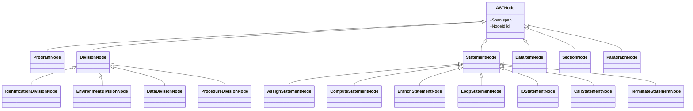

# 4. 未分類・特殊ノード

以下の構文要素については、個別検討とし、必要に応じて専用ノードを追加するか、既存カテゴリの属性として扱う。

- `INSPECT`, `STRING`, `UNSTRING`: 文字列操作（Assignまたは専用ノード）
- `GO TO`: 制御フロー（Branchまたは専用Jumpノード）
- `COPY`: プリプロセッサ命令（AST構築時に展開済みとするか、ノードとして残すか）
- `USE` (Declaratives): 宣言節（Declarativesセクションとして扱う）

# 5. 結論

本分類体系により、COBOLの主要な構文要素を網羅し、かつ意味的に凝集度の高いASTを構築できる。
Statementレベルでの抽象化（Assign, Compute, ...）により、個別の命令語（`ADD` vs `SUBTRACT`）の差分を吸収し、後続の解析を容易にする。


# 50_guarantee

# 01_Guarantee-Unit-Definition

# 1. 問題定義

COBOLからモダン言語への移行プロジェクトにおいて、「構文的に変換可能であること（Syntactic Convertibility）」と「意味的に等価であること（Semantic Equivalence）」は、全く異なる次元の課題である。しかし、従来の移行アプローチでは、これらが混同され、「コンパイルが通れば成功」という安易な判断基準が採用されることが多い。その結果、結合テストフェーズにおいて、微細な挙動差異に起因するバグが大量発生し、プロジェクトが破綻する。

本定義書は、この問題を解決するために、移行プロセスにおける「保証対象単位（Guarantee Unit）」を構造的に定義するものである。どのレベルで何を保証し、何を保証しない（できない）かを明確に切り分けることで、移行リスクを定量的に評価・制御可能な状態にすることを目的とする。

# 2. 保証単位の抽象レベル分類

本構造設計では、保証単位を以下の5つの抽象レベルに分類する。各レベルは下位レベルの保証を前提として成立する。

## L1: 文単位 (Statement Level)

- **定義**: 単一のCOBOL命令文（MOVE, ADD, IF, DISPLAYなど）が、移行先言語の対応する構文またはライブラリ呼び出しに、構文的に正しく変換されること。
- **ASTとの関係**: ASTノードの1対1、または1対Nの局所的な変換パターンに対応する。
- **CFGとの関係**: 基本ブロック（Basic Block）内の単一ノード、または単純な分岐エッジに対応する。
- **DFGとの関係**: 単一ステートメント内での変数の定義（Def）と使用（Use）の関係。
- **静的保証可能性**: 極めて高い。構文解析とテンプレート適用により、100%に近い自動変換が可能。
- **動的保証必要性**: 低い。言語仕様レベルでの動作保証に委ねられる。
- **保証不能化条件**: ベンダー独自拡張命令、既に廃止された非推奨命令の使用。

## L2: 制御ブロック単位 (Control Block Level)

- **定義**: IF-ELSE, PERFORM-UNTIL, EVALUATEなどの制御構造が、論理的に等価なフローとして維持されること。スコープの閉じた制御ロジックの正当性。
- **ASTとの関係**: 複合ステートメント（Block Statement）およびそのネスト構造に対応する。
- **CFGとの関係**: 分岐、合流、ループ構造におけるグラフ同型性（Graph Isomorphism）の維持。
- **DFGとの関係**: 制御ブロック内でのデータの生存区間と、制御依存関係（Control Dependency）。
- **静的保証可能性**: 高い。構造化プログラミングの原則に従っている限り、静的に解析・変換可能。
- **動的保証必要性**: 中程度。境界値条件やループ終了条件のオフバイワンエラーなどをユニットテストで確認する。
- **保証不能化条件**: `ALTER`文による動的なフロー変更、構造を跨ぐ不規則な`GO TO`（スパゲッティコード）。

## L3: ルーチン単位 (Routine Level)

- **定義**: PERFORM A THRU B, セクション, 段落単位の処理のまとまりが、関数やメソッドとして正しくカプセル化され、入力・出力・副作用が管理されていること。
- **ASTとの関係**: 手続き部（PROCEDURE DIVISION）内のセクション（Section）または段落（Paragraph）の集合。
- **CFGとの関係**: コールグラフ（Call Graph）におけるノードと、サブルーチンへの出入り（Entry/Exit）。
- **DFGとの関係**: ルーチン間のパラメータ受け渡し、グローバル変数（共有データ）へのアクセスと更新。
- **静的保証可能性**: 中程度。Fall-through（段落の突き抜け実行）や変数の広域スコープにより、静的解析だけでは意図を完全に特定できない場合がある。
- **動的保証必要性**: 高い。結合テスト（内部結合）フェーズでの検証が必須。
- **保証不能化条件**: 複雑なFall-through構造、再帰的なPERFORMの誤用、エントリポイントの動的な変更。

## L4: ファイルI/O単位 (File I/O Level)

- **定義**: READ, WRITE, REWRITEなどのレコード操作が、ファイルシステムやデータベースへのアクセスとして正しく機能し、ステータスコード（FILE STATUS）や例外が正しくハンドリングされること。
- **ASTとの関係**: 環境部（ENVIRONMENT DIVISION）のファイル定義と、手続き部の入出力命令。
- **CFGとの関係**: I/O操作ノードと、それに続く成功/失敗/例外処理の分岐パス。
- **DFGとの関係**: レコードバッファへのデータの流入・流出、ファイルステータス変数の伝播。
- **静的保証可能性**: 限定的。インターフェースの整合性は保証できるが、実行時の振る舞いは環境に依存する。
- **動的保証必要性**: 極めて高い。外部システムとの結合テストが必須。
- **保証不能化条件**: 外部媒体の仕様差異、排他制御（ロック）のタイミング差異、文字コード変換によるバイト長の変化。

## L5: 業務機能単位 (Business Function Level)

- **定義**: プログラム全体として、特定の業務入力（画面、帳票、ファイル）に対して、仕様通りの出力結果が得られること。エンドツーエンドの整合性。
- **ASTとの関係**: プログラム全体のAST、およびコピー句を含む全ソースコード。
- **CFGとの関係**: プログラムのエントリから終了（STOP RUN / GOBACK）までの全実行パス。
- **DFGとの関係**: システム全体を通したデータフロー、データベースの整合性。
- **静的保証可能性**: 不可能。ビジネスロジックの正当性は、コードの構造からは導き出せない（仕様書が必要）。
- **動的保証必要性**: 必須。シナリオテスト、運用テストレベルでの検証。
- **保証不能化条件**: 仕様書の欠落、暗黙の業務ルール、現行システムのバグを「仕様」として継承している場合。

# 3. 静的保証と動的保証の分離モデル

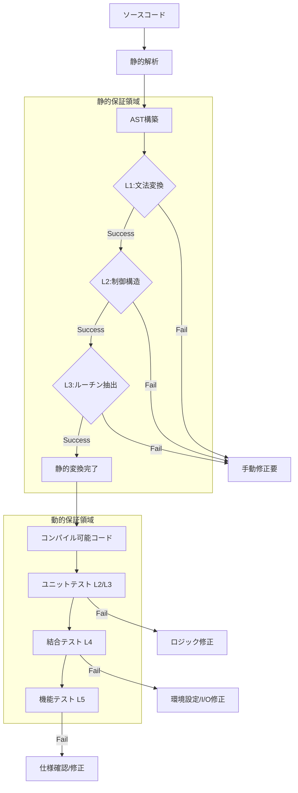

# 4. 保証単位階層モデル

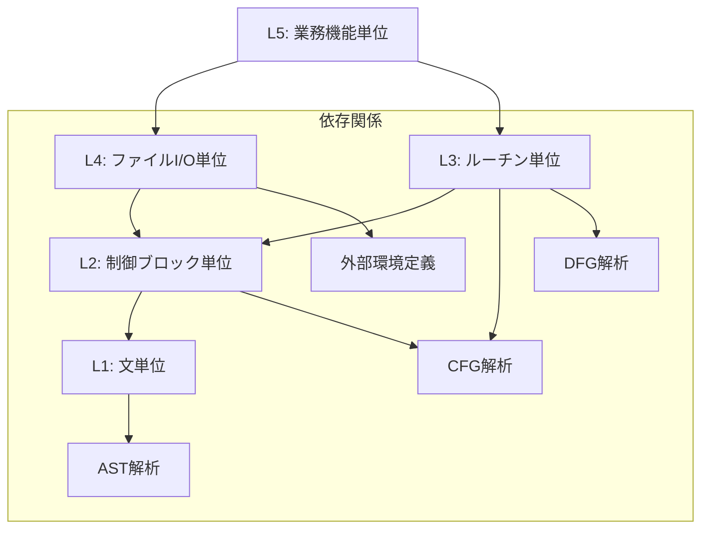

# 5. 保証不能発生ポイント

以下のポイントは、自動変換ツールによる静的保証の限界点であり、人間による判断または動的テストによる検証が不可欠となる。

1.  **動的SQLの構築と実行**: 文字列操作でSQLを組み立てる場合、コンパイル時にSQLの構文正当性を検証できない。
2.  **外部プログラム呼び出し (CALL identifier)**: 変数で指定されたモジュールを呼び出す場合、呼び出し先の存在やインターフェース整合性を静的に保証できない。
3.  **ポインタ操作とメモリ再定義 (REDEFINES)**: 異なるデータ型としてメモリ領域を共有する場合、データの内容に依存した振る舞いの差異が発生しやすい。
4.  **文字コード依存処理**: EBCDICとASCII/Unicodeの照合順序（Collating Sequence）の違いや、バイトサイズの違いによるロジック破綻。
5.  **特定環境への密結合**: メインフレーム特有のシステムコールや、ミドルウェア固有のAPIを使用している箇所。

# 6. 移行設計判断への接続

本定義に基づき、移行設計者は以下の判断を行う必要がある。

1.  **静的保証率の算出**: L1, L2レベルでの自動変換成功率を測定し、ツールの適用効果を定量化する。
2.  **リスクの局所化**: L3, L4レベルの保証が困難な箇所を特定し、重点的なレビューやテストリソースを配分する。
3.  **変換戦略の選択**: L2レベルで構造が破綻している（スパゲッティコード）場合、無理に構造化変換を行わず、GOTOを含む低レベルな変換を選択するか、リライト（再構築）を選択するかの判断基準とする。
4.  **テスト計画の策定**: L1, L2は自動テスト生成でカバーし、L4, L5は手動テストやシナリオテストでカバーするというような、階層別のテスト戦略を立案する。

---

# 結論

保証単位の定義によって初めて定量化可能になるもの：

1.  **自動化ツールの適用範囲と限界（ROIの算出根拠）**
2.  **移行後のシステムに残存する潜在的リスクの総量**
3.  **必要なテスト工数と、その配分の最適解**

---
# 02_Formal-Definition-of-Guarantee

# 1. 問題設定

COBOLからモダン言語への移行において、「保証（Guarantee）」という言葉は極めて曖昧に使われている。「同じ動きをする」という自然言語の定義は、検証不可能な主観的基準となり、プロジェクト後半のトラブルの温床となる。

なぜ保証を形式化する必要があるのか。
それは、**「変換成功」と「移行成功」の乖離を埋めるため**である。

- コンパイルが通る（構文的成功）
- アルゴリズムが同じである（構造的成功）
- 業務結果が同じである（意味的成功）

これらを区別せず「保証する」と宣言することは、エンジニアリングとして誠実ではない。本定義書では、保証を「ある変換関数 $\Phi$ を適用した前後で、特定の性質 $P$ が不変であること」として数学的に形式化する。これにより、自動化ツールが**何を数学的に証明し、何を人間に委ねたか**を明確な境界線として提示可能にする。

# 2. 保証の基本定義

保証（Guarantee）とは、変換対象単位 $GU$ （Guarantee Unit）に対して、変換関数 $\Phi$ を適用した結果、保存すべき性質の集合 $\mathbb{P}$ が維持されることである。

$$
G(GU, \Phi, \mathbb{P}) \iff \forall P \in \mathbb{P}, P(GU) \equiv P(\Phi(GU))
$$

ここで、移行プロジェクトにおいて必須となる5つの保存観点を定義する。

### 1. 構文保存（Syntax Preservation: $P_{syn}$）
ソースコードが対象言語の文法規則 $\mathcal{L}$ に適合し、構文エラーを含まないこと。
$$
P_{syn}(S) \iff S \in \mathcal{L}_{target}
$$

### 2. 制御流保存（Control Flow Preservation: $P_{flow}$）
プログラムの制御フローグラフ（CFG）が、変換前後でグラフ同型（Graph Isomorphism）、または等価なパス集合を持つこと。
$$
CFG(S) \cong CFG(\Phi(S))
$$

### 3. データ依存保存（Data Dependency Preservation: $P_{data}$）
変数 $v$ の定義（Def）と使用（Use）の関係（DFG）が維持されること。ある地点での変数の値が、同一の計算過程を経て導出されること。
$$
DFG(S) \subseteq DFG(\Phi(S))
$$
※ $\subseteq$ は、変換後の言語仕様により新たな依存関係（例: オブジェクト参照）が増えることは許容するが、既存の依存が失われてはならないことを示す。

### 4. 副作用保存（Side Effect Preservation: $P_{side}$）
外部環境（ファイル、DB、画面、通信）への入出力順序と内容が維持されること。
$$
Trace(IO(S)) \equiv Trace(IO(\Phi(S)))
$$

### 5. 外部境界整合性（Boundary Consistency: $P_{bound}$）
モジュール境界（引数、戻り値、共有メモリ）のデータ型とメモリ配置の互換性が維持されること。
$$
Interface(S) \equiv Interface(\Phi(S))
$$

# 3. 層別保証モデル

保証の性質を、解析の深さに応じて3つの層に分離定義する。

## 3.1 構文層保証 ($G_{syntax}$)
コンパイラが保証可能な領域。

$$
G_{syntax}(S) \iff P_{syn}(S) \land P_{bound}(S)
$$
- **検証方法**: ターゲット言語のコンパイラ実行
- **自動化**: 100%可能

## 3.2 構造層保証 ($G_{structure}$)
静的解析によりグラフ理論的に保証可能な領域。

$$
G_{structure}(S) \iff G_{syntax}(S) \land P_{flow}(S) \land P_{data}(S)
$$
- **検証方法**: CFG/DFGの同型性判定、シンボリック実行
- **自動化**: 高度なツールにより可能（動的ディスパッチを除く）

## 3.3 判断層保証 ($G_{decision}$)
実行時の振る舞いと業務要件の一致。

$$
G_{decision}(S) \iff G_{structure}(S) \land P_{side}(S)
$$
- **検証方法**: 動的テスト（ユニットテスト、シナリオテスト）
- **自動化**: テストケース生成までは可能だが、正解判定は仕様書または現行動作に依存

# 4. Guarantee Unitとの接続

前章で定義したL1〜L5の単位に対し、適用される保証関数を定義する。

### G(L1): 文単位
$$
G(L1) = G_{syntax} \land P_{local\_data}
$$
- 単一ステートメントの構文正当性と、局所的な変数の読み書きの一致。
- $P_{flow}$ は基本ブロック内での自明な順序のみ。

### G(L2): 制御ブロック単位
$$
G(L2) = G(L1) \land P_{flow}
$$
- 制御構造（分岐、ループ）の構造的等価性が追加される。
- ここが崩れると「ロジック破綻」となる。

### G(L3): ルーチン単位
$$
G(L3) = G(L2) \land P_{bound} \land P_{data\_flow}
$$
- ルーチン間のインターフェース整合性と、ルーチンをまたぐデータの流れ（引数渡し、グローバル変数）が保証される。

### G(L4): ファイルI/O単位
$$
G(L4) = G(L3) \land P_{side}(IO)
$$
- I/O副作用の順序と内容の保存が要求される。
- 静的解析だけでは $P_{side}$ の完全証明は困難（環境依存のため）。

### G(L5): 業務機能単位
$$
G(L5) = G(L4) \land P_{biz\_spec}
$$
- 業務仕様 $P_{biz\_spec}$ との整合性。
- これは変換ツールの保証範囲外であり、移行プロジェクト全体の保証対象となる。

# 5. 保証成立条件と保証失敗条件

## 5.1 保証成立の必要条件
以下の条件がすべて満たされた場合のみ、自動変換による保証（$G_{structure}$）が成立する。

1.  **閉包性 (Closure)**: 解析対象のコードが、外部依存を含めてすべてASTとして解決可能であること。
2.  **決定性 (Determinism)**: 制御フローが静的に決定可能であること（`ALTER` や 変数による `GO TO` がない）。
3.  **型整合性 (Type Consistency)**: `REDEFINES` 等によるメモリ操作が、ターゲット言語の型システムに安全にマッピング可能であること。

## 5.2 保証崩壊条件 (Failure Conditions)
以下のいずれかが発生した場合、静的保証は「不能（Unknown）」と判定される。

- $\exists x \in S, IsDynamicSQL(x)$ （動的SQL）
- $\exists x \in S, IsDynamicCall(x)$ （動的CALL）
- $\exists x \in S, PointerArithmetic(x)$ （ポインタ演算依存）
- $CFG(S)$ が非構造的で、かつ変換パターンに適合しない（既約でない制御フロー）

# 6. 保証可能領域の境界モデル

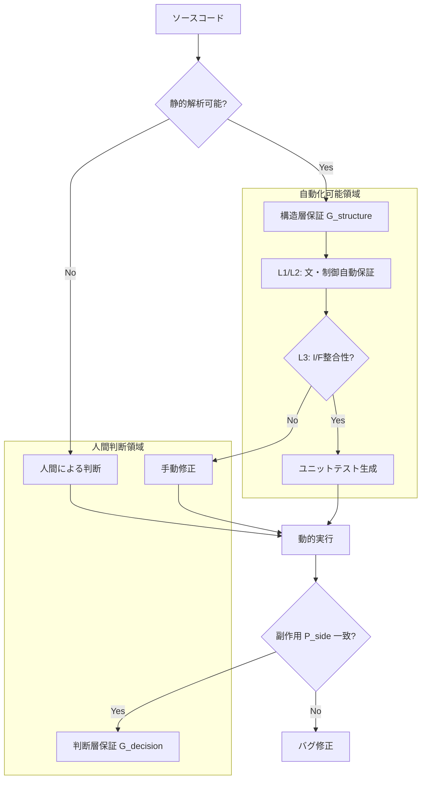

# 7. 結論

保証の形式定義によって、以下の事項が明確化される。

1.  **定量化可能になるもの**:
    - 「静的に保証された行数」対「人間が保証すべき行数」の比率。
    - 移行リスクの総量（$G_{structure}$ が成立しないコードブロックの数）。

2.  **自動化可能になるもの**:
    - $P_{syn}, P_{flow}, P_{data}$ の検証プロセス。
    - $G_{structure}$ 成立領域に対する回帰テストケースの自動生成。

3.  **人間判断に残るもの**:
    - $P_{side}$ のうち環境依存部分の検証。
    - $G_{decision}$（業務仕様としての正しさ）の最終認定。

保証とは「何も変わらないこと」ではなく、「**定義された不変条件 $\mathbb{P}$ が数学的に守られていること**」である。この定義を受け入れることが、工学的移行の第一歩となる。

---
# 03_Guarantee-Space-Definition

# 1. 動機と問題設定

従来の移行プロジェクトでは、保証（Guarantee）は「保証されている（True）」か「保証されていない（False）」かの二値論理として扱われてきた。しかし、実際の大規模システム移行においては、この二値的区分は機能しない。

- 一部の構文は保証できるが、副作用のタイミングは保証できない
- 制御フローは同一だが、浮動小数点の精度が異なるためデータ値は近似保証に留まる

このように、保証は「部分的（Partial）」であり、かつ「階層的（Hierarchical）」な性質を持つ。二値保証の限界を超え、どの観点がどの程度保存されているかを厳密に扱うために、保証を「真偽」ではなく「空間（Space）」として再定義する必要がある。

本定義書では、保証対象の性質を集合として捉え、その順序構造（包含関係）に基づいた数理的な空間モデル「Guarantee Space」を構築する。

# 2. Guarantee Space の基本定義

ある変換対象 $GU$（Guarantee Unit）に対して、変換関数 $\Phi$ を適用した際に、保存される性質の集合を「保証」と定義する。

まず、保存観点全体の集合（全宇宙）を $\mathbb{P}$ とする。

$$
\mathbb{P} = \{ P_{syn}, P_{flow}, P_{data}, P_{side}, P_{bound} \}
$$

変換 $\Phi$ における $GU$ の保証集合 $G_{\Phi}(GU)$ は以下のように定義される。

$$
G_{\Phi}(GU) = \{ P \in \mathbb{P} \mid P(GU) \equiv P(\Phi(GU)) \}
$$

そして、**Guarantee Space（保証空間）$\mathcal{G}$** を、$\mathbb{P}$ の冪集合（Power Set）として定義する。

$$
\mathcal{G} = \mathcal{P}(\mathbb{P}) = \{ S \mid S \subseteq \mathbb{P} \}
$$

つまり、保証空間とは、考えうる全ての「保存された性質の組み合わせ」の集合である。

# 3. 順序関係の定義

保証空間 $\mathcal{G}$ 上の任意の2つの保証状態 $G_a, G_b \in \mathcal{G}$ に対して、順序関係「強度」を以下のように定義する。

$$
G_a \leq G_b \iff G_a \subseteq G_b
$$

この関係「$\leq$」は、集合の包含関係に基づく半順序（Partial Order）であり、以下の性質を満たす。

1.  **反射律**: $G_a \subseteq G_a$ （自分自身と同じ強度を持つ）
2.  **反対称律**: $G_a \subseteq G_b \land G_b \subseteq G_a \implies G_a = G_b$
3.  **推移律**: $G_a \subseteq G_b \land G_b \subseteq G_c \implies G_a \subseteq G_c$

これにより、「$G_b$ は $G_a$ よりも強い（あるいは等しい）保証である」と数学的に表現できる。

# 4. 最小元と最大元

この順序構造における最小元（Bottom）と最大元（Top）を定義する。

### 最小元：虚無の保証 ($\bot$)

$$
\bot = \emptyset
$$
- 何も保証されていない状態。
- 構文エラーでコンパイルすら通らない状態、あるいは全く別のプログラムに書き換えられた状態。

### 最大元：完全保証 ($\top$)

$$
\top = \mathbb{P} = \{ P_{syn}, P_{flow}, P_{data}, P_{side}, P_{bound} \}
$$
- 全ての観点が完全に保存されている状態。
- 理想的な移行成功状態。

# 5. 束構造（Lattice Structure）

保証空間 $(\mathcal{G}, \subseteq)$ は、任意の2つの元に対して上限（Supremum）と下限（Infimum）が存在する「束（Lattice）」をなす。

### Join（結び）：合併保証

$$
G_a \lor G_b = G_a \cup G_b
$$
- $G_a$ または $G_b$ のいずれかで保証されている性質の集合。
- 複数の検証手法を組み合わせた際の「総合的な保証範囲」を表す。

### Meet（交わり）：共通保証

$$
G_a \land G_b = G_a \cap G_b
$$
- $G_a$ と $G_b$ の両方で保証されている性質の集合。
- 複数の変換ツール間で共通して維持される「確実な核（Core）」を表す。

### 変換合成との関係

2つの変換 $\Phi_1, \Phi_2$ を連続して適用（合成）した場合の保証は、個々の保証の共通部分（Intersection）となる。

$$
G_{\Phi_2 \circ \Phi_1} = G_{\Phi_1} \cap G_{\Phi_2}
$$
- 変換を重ねるごとに、保証される性質は減少するか、維持される（単調減少性）。
- $G_{syntax}$ が維持されなければ、次の変換の前提が崩れる。

# 6. 保証空間の視覚化

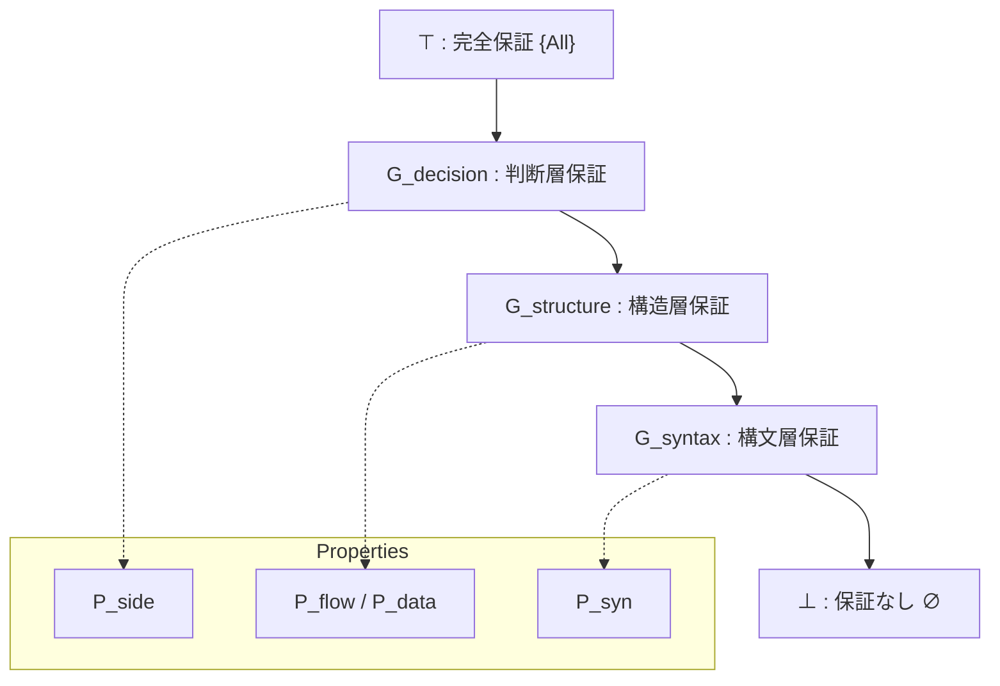

※ 上記は簡略化したハッセ図（Hasse Diagram）である。実際には $\mathbb{P}$ の要素数に応じた多次元の超立方体構造となる。

# 7. 意味論的解釈

保証空間の導入により、移行プロジェクトの品質管理は以下のように再解釈される。

### 1. 部分保証の位置づけ
「まだ動かない（$G_{decision}$ 未達）」状態であっても、「構造は正しい（$G_{structure}$ 成立）」状態であれば、それは $\bot$ ではなく、ゴールへ向かう中間点として正当に評価できる。これにより、進捗率を「本数」ではなく「到達した空間レベル」で計測可能になる。

### 2. 保証強度の比較
ツールAとツールBの比較において、「ツールAは $P_{flow}$ を保存するが $P_{data}$ を崩す」「ツールBは $P_{syn}$ しか保証しない」といった定性的な議論を、集合の包含関係として定量的に比較できる。

### 3. 保証不能の扱い
$G_{\Phi}(GU) = \bot$ となる箇所は、「移行不能」ではなく「再設計（Re-engineering）が必要な特異点」として扱う。保証空間の外にある事象として識別する。

### 4. 移行難易度との接続
$\top$ と現状の保証状態 $G_{current}$ との距離（集合差 $| \top \setminus G_{current} |$）が、残されたテスト工数および修正コストに比例する。これを指標化することで、移行コストの精緻な見積もりが可能となる。

---
# 04_Dependent-Guarantee-Space

# 1. 動機と問題設定

## 1.1 独立仮定の限界
前章までの Guarantee Space の定義 $\mathcal{G} = \mathcal{P}(\mathbb{P})$ は、保存観点集合 $\mathbb{P}$ の要素が互いに独立であることを暗黙に仮定していた。すなわち、$\mathbb{P}$ のあらゆる部分集合が、論理的にあり得る保証状態として許容されていた。

しかし、工学的実態において以下の状態はあり得ない（Unreachable）：

- **構文が破壊されているが、制御流は保証されている**
  - ($P_{syn} \notin S$ かつ $P_{flow} \in S$)
  - 構文木（AST）が構築できなければ、制御フローグラフ（CFG）も構築できないため。
- **制御流が異なっているが、データ依存は保証されている**
  - ($P_{flow} \notin S$ かつ $P_{data} \in S$)
  - データ依存（Def-Use Chain）は制御パス上に定義されるため。

## 1.2 依存関係の導入必要性
保証空間を現実の物理的・論理的制約に適合させるためには、性質間の「依存関係（Dependency）」を形式化し、空間を「独立仮定」から「従属構造」へと再定義する必要がある。これにより、理論的に無意味な状態（Invalid States）を空間から排除し、探索空間を適正化できる。

---

# 2. 依存関係の順序理論的定義

保証空間に位相的制約を与える依存グラフを、順序集合として厳密に再定義する。

## 2.1 依存順序 $\leq_D$

保存観点集合 $\mathbb{P} = \{ P_{syn}, P_{flow}, P_{data}, P_{side}, P_{bound} \}$ 上に、依存関係に基づく二項関係 $\leq_D$ を定義する。

$$
p_j \leq_D p_i \iff (p_i \text{ を保証するには } p_j \text{ が必要})
$$

この関係 $\leq_D$ は以下の性質を満たすため、**半順序（Partial Order）** である。

1.  **反射律**: $p \leq_D p$ （任意の性質はそれ自身の成立を必要とする）
2.  **反対称律**: $p \leq_D q \land q \leq_D p \implies p = q$ （循環依存はないと仮定）
3.  **推移律**: $p \leq_D q \land q \leq_D r \implies p \leq_D r$

依存グラフ $D = (\mathbb{P}, E_{req})$ における辺 $p_i \xrightarrow{req} p_j$ は、順序関係 $p_j \leq_D p_i$ に対応する。すなわち、矢印の方向は「依存元から依存先」へ向かうが、順序の大小は「基礎（小さい）から応用（大きい）」へと向かう（$p_j$ の方が基礎的である）。

## 2.2 具体的な順序構造

本体系における依存順序 $(\mathbb{P}, \leq_D)$ は以下の通りである。

1.  $P_{syn} \leq_D P_{flow}$ （構文は制御の基礎）
2.  $P_{syn} \leq_D P_{bound}$ （構文は境界の基礎）
3.  $P_{flow} \leq_D P_{data}$ （制御はデータの基礎）
4.  $P_{flow} \leq_D P_{side}$ （制御は副作用の基礎）
5.  $P_{data} \leq_D P_{side}$ （データは副作用の基礎）

---

# 3. 依存閉包と不動点理論

依存順序に基づき、論理的に妥当な保証集合を定義するための閉包演算を導入する。

## 3.1 下集合（Lower Set）としての Valid State

保証集合 $S \subseteq \mathbb{P}$ が論理的に妥当である（Valid）とは、その集合が順序 $\leq_D$ についての下集合（Lower Set / Ideal）であることを意味する。

**定義:** $S$ が下集合であるとは、以下を満たすことである。
$$
\forall p \in S, \forall q \in \mathbb{P}, (q \leq_D p \implies q \in S)
$$

## 3.2 閉包演算子 $Cl_D$

任意の保証集合 $S \subseteq \mathbb{P}$ に対する依存閉包 $Cl_D(S)$ を、**$S$ を含む最小の下集合**として定義する。

$$
Cl_D(S) = \{ q \in \mathbb{P} \mid \exists p \in S, q \leq_D p \}
$$

## 3.3 閉包の性質と不動点

この演算子 $Cl_D: \mathcal{P}(\mathbb{P}) \to \mathcal{P}(\mathbb{P})$ は以下の性質を持つ。

1.  **有限性**: $\mathbb{P}$ は有限集合であるため、閉包は必ず有限ステップで計算可能である。
2.  **単調性**: $S_1 \subseteq S_2 \implies Cl_D(S_1) \subseteq Cl_D(S_2)$。
3.  **不動点**: $S$ が Valid である必要十分条件は、それが $Cl_D$ の不動点であること（$S = Cl_D(S)$）である。

Knaster–Tarski の不動点定理により、完全束上の単調関数である $Cl_D$ の不動点全体もまた完全束をなすことが保証される。

---

# 4. 依存付き Guarantee Space の再定義

## 4.1 定義：イデアル束としての $\mathcal{G}_{dep}$

**依存付き保証空間（Dependent Guarantee Space）** $\mathcal{G}_{dep}$ を、順序集合 $(\mathbb{P}, \leq_D)$ のイデアル（順序イデアル）全体の集合として再定義する。

$$
\mathcal{G}_{dep} = Idl(\mathbb{P}, \leq_D) = \{ S \in \mathcal{P}(\mathbb{P}) \mid S = Cl_D(S) \}
$$

## 4.2 定理：順序同型性

$\mathcal{G}_{dep}$ は、包含関係 $\subseteq$ を順序とすることで、束（Lattice）をなす。

**定理:**
保証空間 $\mathcal{G}_{dep}$ は、順序集合 $(\mathbb{P}, \leq_D)$ 上の分配束（Distributive Lattice）である。

---

# 5. 完備分配束性の証明

$\mathcal{G}_{dep}$ が完備分配束（Complete Distributive Lattice）であることを証明する。

## 5.1 完備性（Completeness）

任意の族 $\{ S_i \}_{i \in I} \subseteq \mathcal{G}_{dep}$ に対して：

1.  **Meet (共通部分)**: $\bigwedge S_i = \bigcap_{i \in I} S_i$
    - 下集合の共通部分は常に下集合であるため、$\mathcal{G}_{dep}$ 内に存在する。
2.  **Join (和集合)**: $\bigvee S_i = \bigcup_{i \in I} S_i$
    - 下集合の和集合は常に下集合であるため、$\mathcal{G}_{dep}$ 内に存在する。

任意の族に対して上限と下限が存在するため、$\mathcal{G}_{dep}$ は完備束である。

## 5.2 分配性（Distributivity）

$\mathcal{G}_{dep}$ の演算は集合の共通部分（$\cap$）と和集合（$\cup$）そのものであるため、集合演算の分配律を継承する。

$$
A \cap (B \cup C) = (A \cap B) \cup (A \cap C)
$$

よって、$\mathcal{G}_{dep}$ は完備分配束である。

---

# 6. Unreachable の形式定義

理論空間から除外されるべき無効状態を形式的に定義する。

## 6.1 定義

ある保証集合 $S \subseteq \mathbb{P}$ が **Unreachable（到達不能）** であるとは、それが依存閉包と一致しないことである。

$$
Unreachable(S) \iff S \neq Cl_D(S)
$$

## 6.2 意味論的解釈

$Unreachable(S)$ である状態は、工学的に「不安定」または「定義不能」な状態を意味する。
例えば $S = \{ P_{flow} \}$ は、$P_{syn} \leq_D P_{flow}$ であるにもかかわらず $P_{syn} \notin S$ であるため Unreachable である。これは「構文エラーがあるのに制御フローは正しい」という矛盾した状態を示しており、解析ツールの出力としてはあり得ない（バグである）。

---

# 7. 保証空間の視覚化

## 7.1 Hasse Diagram of Order $(\mathbb{P}, \leq_D)$

順序構造としての依存関係。下にあるものほど基礎（必須）である。

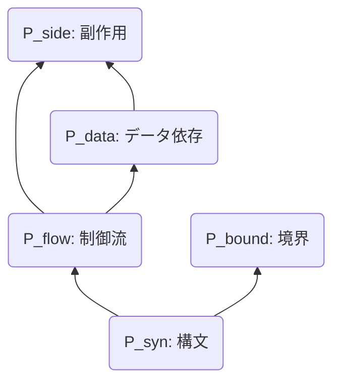

## 7.2 Ideal Lattice $\mathcal{G}_{dep}$ (Valid States)

妥当な状態のみで構成される分配束。

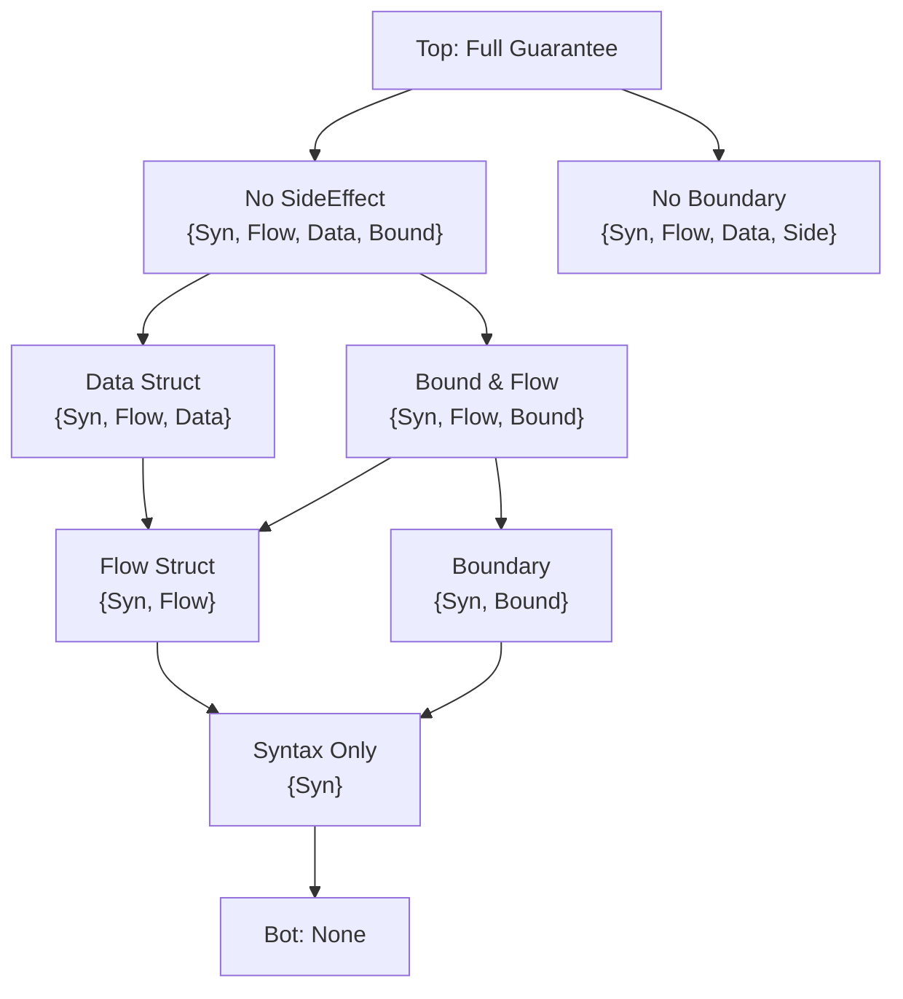

## 7.3 Unreachable State Example (Red)

理論空間から除外される状態の例。

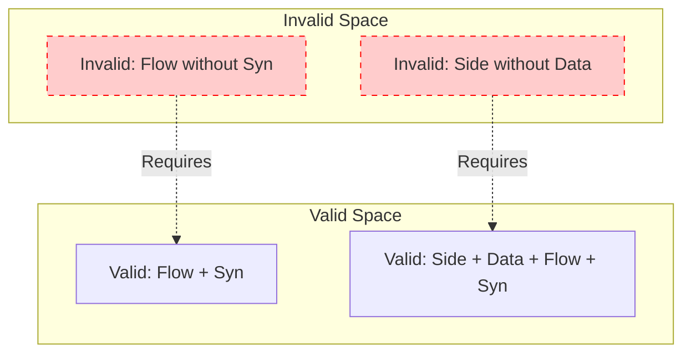

---

# 8. 結論

本改訂により、保証空間 $\mathcal{G}_{dep}$ は単なる集合の集まりではなく、**順序集合 $(\mathbb{P}, \leq_D)$ 上のイデアル束**として厳密に定式化された。
この数学的構造は完備分配束であり、任意のマージ操作（Join）や共通部分抽出（Meet）が常に空間内で閉じることを保証する。これは、複数の解析ツールや検証結果を統合する際の理論的基盤となるものである。

---
# 05_Weighted-Guarantee-Space

# 1. 背景と目的

これまでの理論により、保証空間（Guarantee Space）は依存構造を持つイデアル束 $\mathcal{G}_{dep}$ として定義された。これにより、保証の「有無」や「包含関係」は厳密に扱えるようになった。

しかし、実際の移行プロジェクトでは、すべての保証が等価ではない。例えば、構文解析（Syntax）のコストと、副作用検証（Side-effect）のコストは桁違いである。また、それらが崩れた際のリスク（影響度）も異なる。

本定義書では、保証空間に**「測度（Measure）」**としての重み構造を導入し、保証空間を**Hypercube幾何**および**Hypercube Graph**として解釈することで、移行パス最適化（Shortest Path Problem）への接続を理論的に確立する。

# 2. 保証強度の測度化（Measure Theoretic Definition）

これまで単なる総和として定義していた「強度（Strength）」を、集合上の測度として再定義する。

## 2.1 有限加法測度としての定義

保存性質集合 $\mathbb{P}$ の冪集合 $\mathcal{P}(\mathbb{P})$ 上の関数 $\mu: \mathcal{P}(\mathbb{P}) \to \mathbb{R}_{\geq 0}$ を以下のように定義する。

$$
\mu(S) = \sum_{p \in S} w(p)
$$

ここで $w(p) > 0$ は各性質の重みである。この $\mu$ は以下の性質を満たすため、**有限加法測度（Finitely Additive Measure）** である。

1.  $\mu(\emptyset) = 0$
2.  $S \cap T = \emptyset \implies \mu(S \cup T) = \mu(S) + \mu(T)$

## 2.2 強度（Strength）との等価性

保証強度 $Strength(S)$ は、この測度 $\mu$ そのものである。

$$
Strength(S) \equiv \mu(S)
$$

これにより、保証強度は集合論的な操作（和、差、共通部分）に対して整合的な挙動を示すことが数学的に保証される。

# 3. Hypercube 幾何としての解釈

保証空間 $\mathcal{G} = \mathcal{P}(\mathbb{P})$ は、幾何学的には $N=|\mathbb{P}|$ 次元の超立方体（Hypercube）と同型である。

## 3.1 Hypercube Graph の定義

保証空間をグラフ理論的に定義する。

$$
Graph G = (V, E)
$$

- $V = \{0, 1\}^N \cong \mathcal{P}(\mathbb{P})$ （各保証状態は $N$次元ビットベクトル）
- $E = \{(u, v) \mid d_H(u, v) = 1\}$ （ハミング距離が1の状態間にエッジが存在）

これは、ある保証状態から、単一の性質 $p$ を追加または削除する操作がエッジに対応することを意味する。

## 3.2 幾何学的意味

- **頂点**: 各保証状態（$2^N$ 個）
- **辺**: 単一の性質 $p_i$ の追加/削除
- **原点**: $\bot = \emptyset$ （全成分0）
- **対角点**: $\top = \mathbb{P}$ （全成分1）

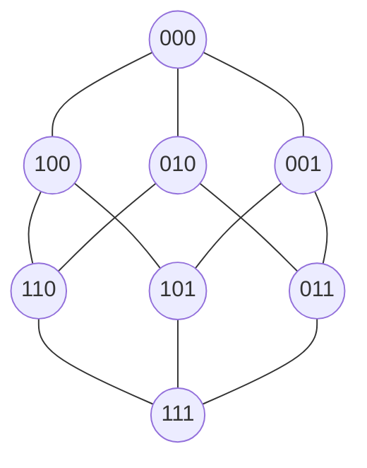

# 4. Dependent Guarantee Space の幾何

依存付き保証空間 $\mathcal{G}_{dep}$ は、この Hypercube の部分集合（部分グラフ）である。

## 4.1 依存関係の形式定義

依存関係を二項関係 $D \subseteq \mathbb{P} \times \mathbb{P}$ として定義する。
$p_i$ が $p_j$ に依存することを $p_j \leq_D p_i$ と表記する。

## 4.2 依存閉包（Dependency Closure）

依存関係に基づく閉包演算 $Cl_D: \mathcal{P}(\mathbb{P}) \to \mathcal{P}(\mathbb{P})$ を定義する。

$$
Cl_D(S) = S \cup \{ p_j \in \mathbb{P} \mid \exists p_i \in S : p_j \leq_D p_i \}
$$

## 4.3 有効領域（Valid Region）

$\mathcal{G}_{dep}$ は、依存閉包について閉じている集合のみからなる部分空間である。

$$
\mathcal{G}_{dep} = \{ S \in \mathcal{P}(\mathbb{P}) \mid S = Cl_D(S) \}
$$

これは Hypercube 上の **Ideal Lattice（イデアル束）** を形成する。

## 4.4 Unreachable State

制約を満たさない頂点は「到達不能（Unreachable）」として空間から除外される。幾何学的には、Hypercube の特定の部分領域が「欠損（Hollow）」した形となる。

# 5. 移行パスの定式化（Migration Path）

保証空間を状態空間と見なすことで、移行プロセスを数学的に定式化できる。

## 5.1 定義

移行パス（Migration Path）とは、保証空間上の状態の列である。

$$
Path = (S_0, S_1, \dots, S_n)
$$

ここで $S_0 = \emptyset$（開始）、$S_n = \top$（完了）である。

## 5.2 依存制約付き遷移（Migration Step）

各ステップ $S_i \to S_{i+1}$ は、単一の性質 $p$ の追加に対応するが、依存制約により閉包を取る必要がある。

$$
S_{i+1} = Cl_D(S_i \cup \{p\})
$$

かつ、遷移先は有効な状態空間内でなければならない。

$$
S_{i+1} \in \mathcal{G}_{dep}
$$

これにより、ある性質を追加する際に、その前提条件も同時に（強制的に）追加される挙動が定式化される。

## 5.3 コスト関数

パスのコストは、各ステップ間の距離の総和で定義される（次章詳述）。

$$
Cost(Path) = \sum_{i=0}^{n-1} d_w(S_i, S_{i+1})
$$

# 6. 最短経路問題（Shortest Path Problem）

移行戦略の立案は、以下の最適化問題に帰着される。

**問題**: 依存制約を満たす部分グラフ $\mathcal{G}_{dep}$ 上において、始点 $\bot$ から終点 $\top$ への最短経路（最小コストパス）を求めよ。

- **ノード**: 保証状態 $S \in \mathcal{G}_{dep}$
- **エッジ**: 状態遷移 $S \to S'$ （ここで $S' = Cl_D(S \cup \{p\})$）
- **エッジ重み**: $d_w(S, S') = \mu(S' \setminus S)$

# 7. 結論

本改訂により、Weighted Guarantee Space は単なる「重み付き集合」から「測度を持つ幾何空間」へと昇華された。
これにより、移行プロジェクトは「Hypercube 上の Unreachable 領域を避けながら、原点から対角点へ向かう最短経路探索問題」として数学的に完全に記述されることとなった。
これは、動的計画法（DP）やA*探索などのアルゴリズムを移行計画に応用する道を開くものである。

---
# 06_Metric-on-Guarantee-Space

# 1. 背景と目的

前章にて Guarantee Space は Hypercube 幾何構造と測度 $\mu$ を持つことが示された。
本章では、この空間上に距離構造（Metric）を導入し、移行の「乖離」や「進捗」を幾何学的に定義する。
特に、Weighted Guarantee Space 上の距離が **Weighted Hamming Metric** であることを示し、依存空間における商距離（Quotient Metric）の概念を導入する。

# 2. Metric Structure

保証空間 $\mathcal{G} = \mathcal{P}(\mathbb{P})$ 上の距離を定義する。

## 2.1 Hypercube 上の Hamming Metric

単純な集合間の距離 $d(G_1, G_2) = |G_1 \triangle G_2|$ は、Hypercube $\{0,1\}^N$ 上の **Hamming Metric** と等価である。

$$
d(G_1, G_2) = \sum_{i=1}^{N} |v_1[i] - v_2[i]|
$$

これは、一方の状態から他方の状態へ遷移するために反転（Flip）させる必要のあるビット数に相当する。

# 3. Weighted Metric

## 3.1 Weighted Hamming Metric

重み関数 $w$ を考慮した距離 $d_w$ は、**Weighted Hamming Metric** である。

$$
d_w(G_1, G_2) = \sum_{p \in G_1 \triangle G_2} w(p)
$$

## 3.2 Measure と Metric の関係

この距離 $d_w$ は、前章で定義した測度 $\mu$ によって誘導される。

$$
d_w(G_1, G_2) = \mu(G_1 \triangle G_2)
$$

これにより、集合の「大きさ（Measure）」と、集合間の「距離（Metric）」が数学的に整合していることが示される。

## 3.3 コスト解釈（Cost Interpretation）

この距離は、「ある状態から別の状態へ移行するための最小コスト」と解釈できる（ただし、依存制約を無視した場合）。
移行ギャップ（Migration Gap）は、この距離によって定量化される。

$$
Gap(Current, Target) = d_w(Current, Target)
$$

# 4. Closure Metric（商距離）

Dependent Guarantee Space では、依存閉包 $Cl_D$ が作用する。
理論的には、依存関係によって「同一視」される状態間の距離を考える必要がある。

## 4.1 定義

依存閉包を通した距離 $d_{closure}$ を以下のように定義する。

$$
d_{closure}(S_1, S_2) = d_w(Cl_D(S_1), Cl_D(S_2))
$$

これは、空間 $\mathcal{G}$ を閉包演算で割った商空間（Quotient Space）上の距離（Quotient Metric）と見なすことができる。
実務上は、「見かけ上の差分」ではなく「依存関係を含めた本質的な差分」を測るためにこの距離が重要となる。

# 5. Migration Geometry（移行の幾何学）

最終的に、Guarantee Space は以下の数学的構造を併せ持つ**Finite Metric Graph**として整理される。

| 数学構造 | 移行プロジェクトにおける意味 |
| :--- | :--- |
| **Hypercube Graph** | 全体像。ノード（状態）とエッジ（遷移）からなるグラフ。 |
| **Partial Order** | 依存関係。手順の前後関係制約。 |
| **Ideal Lattice** | 有効領域。工学的に妥当なマイルストーン群。 |
| **Measure ($\mu$)** | 強度。プロジェクトの達成価値（Earned Value）。 |
| **Metric ($d_w$)** | 距離。残作業コストや乖離度。 |

## 5.1 最短経路問題としての移行計画

移行計画（Migration Planning）は、この **Finite Metric Graph 上の最短経路問題（Shortest Path Problem）** と同型である。

- 始点: 現状 $S_{current}$
- 終点: 目標 $S_{target}$
- 制約: 経路上の全ノードが $\mathcal{G}_{dep}$ に含まれること
- 目的: 経路コスト $\sum d_w(S_i, S_{i+1})$ の最小化

# 6. 幾何学的解釈と図式化

## 6.1 Guarantee Landscape

重み付き距離空間上の地形図。

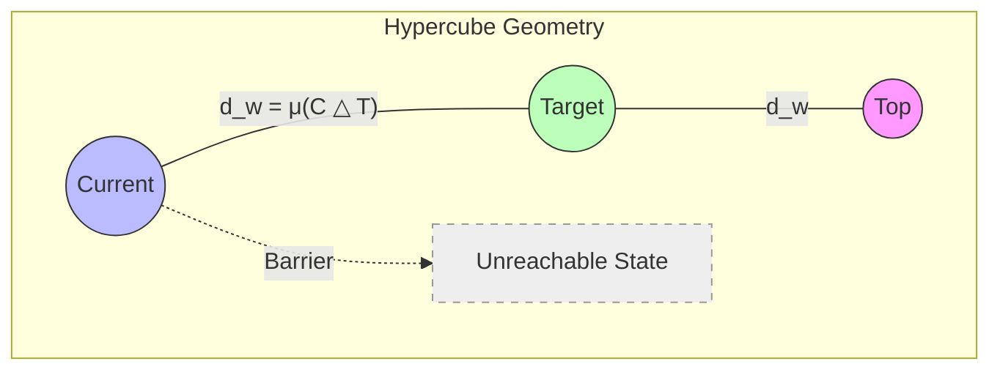

## 6.2 Migration Path with Dependency

依存制約を考慮した有効な移行パス。

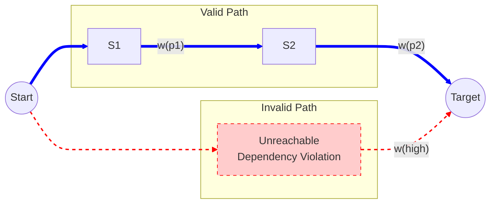
（青：依存制約を満たすValid Path、赤：Unreachableを通る無効なパス）

# 7. 結論

本改訂により、Guarantee Space 上の距離構造は、単なる「差分」から**「Hypercube 上の Weighted Hamming Metric」**へと厳密化された。
また、依存閉包を考慮した商距離の概念導入により、工学的な「手戻り」や「強制修正」を含んだリアルな距離測定が可能となった。
これにより、移行プロジェクトは幾何学的な空間内での「最適軌道制御問題」として完全にモデル化された。

---
# 07_Guarantee-Space-Geometry-Part2

# 1. 目的

本研究は、Guarantee Space における幾何構造（Geometry）の定義を、測度論（Measure Theory）および距離空間論（Metric Space Theory）の観点から厳密化し、保証の強度（Strength）と差異（Distance）を定量化するための数学的基盤を確立するものである。

# 2. Guarantee Measure（保証測度）

## 2.1 重み関数（Weight Function）

保証性質集合 $\mathbb{P}$ の各要素 $p \in \mathbb{P}$ に対し、その重要度や難易度を表す非負実数値関数 $w$ を定義する。

$$
w: \mathbb{P} \to \mathbb{R}_{>0}
$$

## 2.2 保証強度（Strength）としての測度

保証状態 $S \in \mathcal{P}(\mathbb{P})$ の強度 $Strength(S)$ を、集合上の有限加法測度 $\mu$ として定義する。

$$
\mu: \mathcal{P}(\mathbb{P}) \to \mathbb{R}_{\geq 0}
$$

$$
\mu(S) = \sum_{p \in S} w(p)
$$

### 性質の証明

この $\mu$ が有限加法測度の公理を満たすことを示す。

1.  **非負性（Non-negativity）**:
    $w(p) > 0$ より、任意の $S$ に対して $\mu(S) \geq 0$ である。

2.  **空集合の測度（Null Set）**:
    $$
    \mu(\emptyset) = \sum_{p \in \emptyset} w(p) = 0
    $$

3.  **有限加法性（Finite Additivity）**:
    任意の互いに素な集合 $S, T \in \mathcal{P}(\mathbb{P})$ ($S \cap T = \emptyset$) について、
    $$
    \mu(S \cup T) = \sum_{p \in S \cup T} w(p) = \sum_{p \in S} w(p) + \sum_{p \in T} w(p) = \mu(S) + \mu(T)
    $$

よって、保証強度は数学的に **Measure（測度）** として扱えることが示された。

# 3. Guarantee Metric（保証距離）

## 3.1 Hamming Metric

保証空間上の距離 $d$ を、集合の対称差（Symmetric Difference）の濃度として定義する。

$$
d(G_1, G_2) = |G_1 \triangle G_2|
$$
ここで $G_1 \triangle G_2 = (G_1 \setminus G_2) \cup (G_2 \setminus G_1)$ である。

これは Hypercube $\{0, 1\}^N$ 上の **Hamming Metric** と等価である。

# 4. Weighted Metric（重み付き距離）

## 4.1 Weighted Hamming Metric

重み関数 $w$ を用いた距離 $d_w$ を定義する。

$$
d_w(G_1, G_2) = \sum_{p \in G_1 \triangle G_2} w(p)
$$

これは測度 $\mu$ を用いて以下のように表現できる。

$$
d_w(G_1, G_2) = \mu(G_1 \triangle G_2)
$$

## 4.2 距離空間の公理（Metric Axioms）

$( \mathcal{P}(\mathbb{P}), d_w )$ が距離空間であることを示す。

1.  **非負性と同一性（Non-negativity & Identity）**:
    $\mu$ の定義より $d_w(G_1, G_2) \geq 0$。
    $d_w(G_1, G_2) = 0 \iff \mu(G_1 \triangle G_2) = 0$。
    $w(p) > 0$ であるため、これは $G_1 \triangle G_2 = \emptyset$、すなわち $G_1 = G_2$ と同値である。

2.  **対称性（Symmetry）**:
    対称差の性質 $A \triangle B = B \triangle A$ より、
    $$
    d_w(G_1, G_2) = \mu(G_1 \triangle G_2) = \mu(G_2 \triangle G_1) = d_w(G_2, G_1)
    $$

3.  **三角不等式（Triangle Inequality）**:
    任意の $A, B, C$ について、対称差には以下の包含関係が成り立つ。
    $$
    A \triangle C \subseteq (A \triangle B) \cup (B \triangle C)
    $$
    測度の単調性と劣加法性より、
    $$
    \mu(A \triangle C) \leq \mu((A \triangle B) \cup (B \triangle C)) \leq \mu(A \triangle B) + \mu(B \triangle C)
    $$
    したがって、
    $$
    d_w(G_1, G_3) \leq d_w(G_1, G_2) + d_w(G_2, G_3)
    $$

以上より、Weighted Guarantee Space は **Metric Space（距離空間）** である。

## 4.3 Metric Interpretation（距離の解釈）

この距離 $d_w(Current, Target)$ は、**「現在の状態から目標状態へ到達するために必要な追加・削除コストの最小値（依存関係を無視した場合）」** を意味する。
これは移行プロジェクトにおける「乖離（Gap）」の定量的指標となる。

# 5. Guarantee Landscape（幾何学的景観）

保証空間は、測度（高さ）と距離（広がり）を持つ地形（Landscape）として視覚化できる。

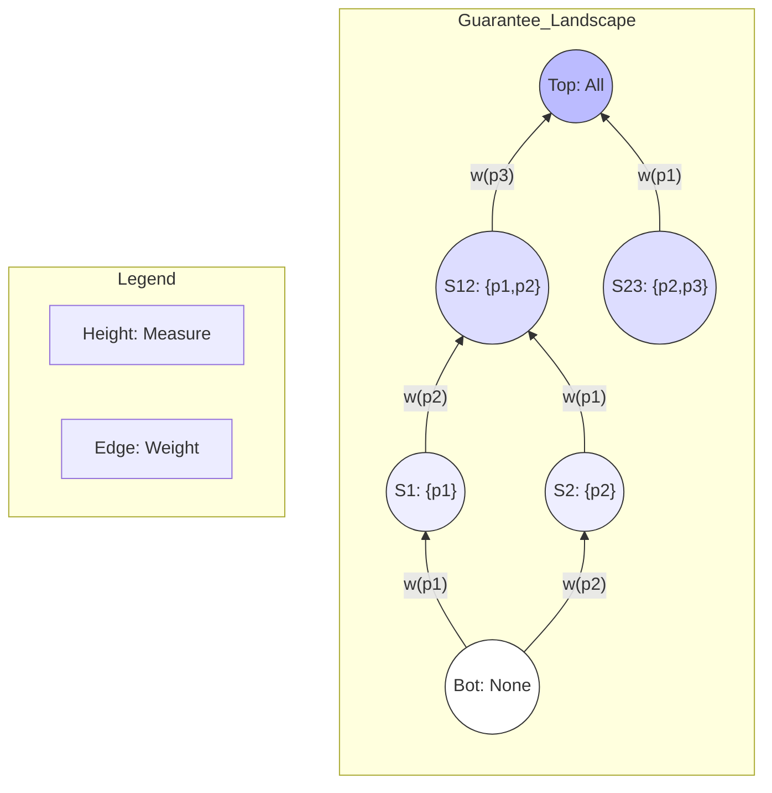

# 6. 次フェーズ定義（Phase 2: Dynamics）

Phase 1.5 の幾何学的定義に基づき、次フェーズ（Phase 2）では以下の動的要素を定義する。

1.  **Migration Path（移行パス）**:
    保証空間上の点列 $P = (S_0, S_1, \dots, S_n)$。
    条件: $S_{i+1} = Cl_D(S_i \cup \{p\})$。

2.  **Path Cost（パスコスト）**:
    経路長 $L(P) = \sum_{i=0}^{n-1} d_w(S_i, S_{i+1})$。

3.  **Optimal Migration（最適移行）**:
    始点から終点への最短経路探索問題。
    $\min_{P} L(P)$ subject to $P \subset \mathcal{G}_{dep}$。

4.  **Trajectory（軌道）**:
    時間発展としての保証状態の変化 $S(t)$。

これにより、静的な幾何学から動的な運動論（Dynamics）へと理論を展開する。

---
# 08_Guarantee-Space-Lattice-Structure

# 1. 目的

本稿では、Guarantee Space の代数的構造を定義し、それが **分配束（Distributive Lattice）** であることを示す。
また、依存関係を考慮した Dependent Guarantee Space ($G_{dep}$) が、順序集合上の **Ideals (Lower Sets)** の集合として定義され、元の空間の **部分束（Sublattice）** として分配束の性質を保持することを証明する。
これにより、次フェーズで扱う「グラフ上の最短経路問題」の数学的基礎（格子グラフ構造）を確立する。

# 2. Guarantee Space の束構造

## 2.1 定義：束（Lattice）

半順序集合 $(L, \leq)$ が **束（Lattice）** であるとは、任意の2要素 $x, y \in L$ に対して、以下の2つの演算が一意に存在することをいう。

1.  **結び（Join, Least Upper Bound）**: $x \vee y = \sup\{x, y\}$
2.  **交わり（Meet, Greatest Lower Bound）**: $x \wedge y = \inf\{x, y\}$

## 2.2 定理：Guarantee Space は束である

**定理 1**:
保証空間 $G = (\mathcal{P}(\mathbb{P}), \subseteq)$ は束である。

**証明**:
任意の $S, T \in \mathcal{P}(\mathbb{P})$ に対して、
- Join: $S \vee T = S \cup T$ （集合和）
- Meet: $S \wedge T = S \cap T$ （集合積）
と定義する。
集合論の基本性質より、$S \cup T$ は $S, T$ を含む最小の集合であり、$S \cap T$ は $S, T$ に含まれる最大の集合である。
よって $(G, \subseteq)$ は束である。 $\square$

## 2.3 定理：Guarantee Space は分配束である

**定義：分配束（Distributive Lattice）**
束 $L$ が以下の分配律を満たすとき、分配束という。
任意の $x, y, z \in L$ について：
1. $x \wedge (y \vee z) = (x \wedge y) \vee (x \wedge z)$
2. $x \vee (y \wedge z) = (x \vee y) \wedge (x \vee z)$

**定理 2**:
保証空間 $G$ は分配束である。

**証明**:
集合演算の分配律により自明である。
任意の $S, T, U \in \mathcal{P}(\mathbb{P})$ について：
$$ S \cap (T \cup U) = (S \cap T) \cup (S \cap U) $$
$$ S \cup (T \cap U) = (S \cup T) \cap (S \cup U) $$
したがって $G$ は分配束である。 $\square$

# 3. Dependent Guarantee Space の束構造

依存関係 $D$ を持つ部分空間 $G_{dep}$ の構造を整理する。

## 3.1 依存関係とIdeals (Lower Sets)

依存関係 $D \subseteq \mathbb{P} \times \mathbb{P}$ により、性質間の依存順序 $p_j \leq_D p_i$ （$p_i$ depends on $p_j$）を定義する。
$G_{dep}$ は、順序集合 $(\mathbb{P}, \leq_D)$ 上の **Ideals (Lower Sets)** の集合として定義される。

$$
G_{dep} = Idl(\mathbb{P}, \leq_D) = \{ S \subseteq \mathbb{P} \mid \forall p \in S, q \leq_D p \implies q \in S \}
$$

## 3.2 定理：G_dep は部分束である

**定理 3**:
$G_{dep}$ は $G$ の部分束（Sublattice）である。すなわち、$G_{dep}$ は $\cup$ と $\cap$ について閉じている。
また、$G_{dep}$ 自体も **Finite Distributive Lattice** を形成する。

**証明**:
任意の $S, T \in G_{dep}$ をとる。
1.  **Meetの閉性**:
    $x \in S \cap T$ とする。任意の $y \leq_D x$ について、$S, T$ がLower Setであることから $y \in S$ かつ $y \in T$。
    よって $y \in S \cap T$。ゆえに $S \cap T \in G_{dep}$。
2.  **Joinの閉性**:
    $x \in S \cup T$ とする。$x \in S$ または $x \in T$ である。
    任意の $y \leq_D x$ について、$x \in S$ なら $y \in S$、$x \in T$ なら $y \in T$。
    いずれにせよ $y \in S \cup T$。ゆえに $S \cup T \in G_{dep}$。

以上より、$G_{dep}$ は $G$ の部分束である。 $\square$

明らかに $G_{dep} \subset \mathcal{P}(\mathbb{P})$ であり、部分束であることから分配律も成立する。

# 4. Graph構造への接続（Prompt3 前提）

束構造を離散グラフとして扱うための定義を導入する。

## 4.1 被覆関係（Cover Relation）の厳密定義

順序集合 $(L, \leq)$ において、$x < y$ かつ $x < z < y$ となる $z$ が存在しないとき、「$y$ は $x$ を被覆する（covers）」といい、$x \lessdot y$ と書く。

Guarantee Space $G$ における被覆関係は、依存関係を考慮し以下のように定義される：

$$ S \lessdot T \iff T = S \cup \{p\} \land p \notin S \land Cl_D(S \cup \{p\}) = S \cup \{p\} $$

かつ、当然ながら $S, T \in G_{dep}$ である必要がある。
すなわち、**単一の要素 $p$ を追加した結果が即座に有効な状態（Ideal）となる場合のみ**、被覆関係が成立する。

## 4.2 Lattice Graph

**Lattice Graph** を以下のように定義する。

$$
Graph \ G = (V, E)
$$
- $V = G_{dep} = Idl(\mathbb{P}, \leq_D)$
- $E = \{ (S, T) \mid S \lessdot T \}$

このグラフは、全体空間 $G$ に対応する **Hypercube Graph の部分グラフ** として解釈できる。
（ただしエッジは依存関係を満たす遷移のみに制限される）
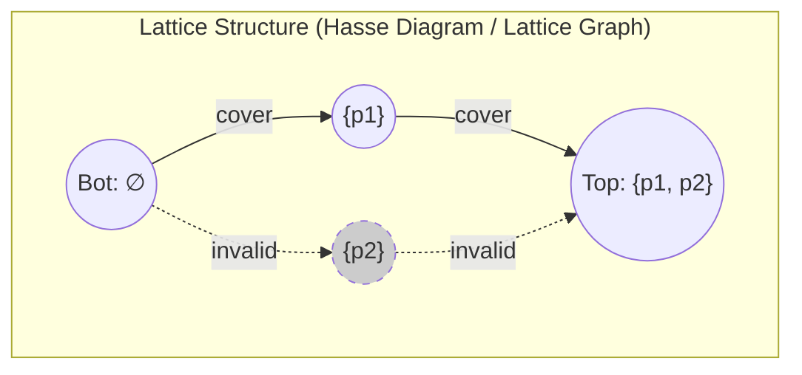
*(注: 上図は p2 が p1 に依存する場合の例。p2単独はInvalidとなり、Bot->p2のエッジは存在しない)*

このグラフ構造により、次フェーズ（Prompt3）において、移行パスを「Lattice Graph 上のパス」として定義し、最短経路問題を適用することが可能となる。

# 5. Prompt3 入力前提まとめ

次フェーズ（Prompt3）の入力として、以下の定義・定理が確定した。

1.  **代数構造**:
    - Guarantee Space は **分配束（Distributive Lattice）** である。
    - Join = Union ($\cup$), Meet = Intersection ($\cap$)。

2.  **依存空間**:
    - $G_{dep} = Idl(\mathbb{P}, \leq_D)$ は順序集合 $(\mathbb{P}, \leq_D)$ の **Ideals (Lower Sets)** の集合である。
    - $G_{dep}$ は $G$ の **部分束** であり、かつ **分配束** である。
    - $G_{dep} \subset \mathcal{P}(\mathbb{P})$。

3.  **グラフ接続**:
    - Lattice Graph $G = (V, E)$。
    - $V = G_{dep}$。
    - $E$: Cover Relation $S \lessdot T \iff T = S \cup \{p\}$ かつ $T \in G_{dep}$。
    - これは Hypercube Graph の部分グラフである。

---
# 09_Guarantee-Transition-Graph

# 1. 目的

本稿では、Dependent Guarantee Space ($G_{dep}$) を **状態遷移空間（State Transition Space）** として定義し、その数学的構造を **Guarantee Transition Graph** として定式化する。
これにより、移行プロセスを「グラフ上の経路探索問題」として扱うための理論的基盤を確立する。

# 2. Guarantee Transition Graph の定義

Guarantee Space を以下の有向グラフとして定義する。

$$
G_{trans} = (V, E)
$$

## 2.1 頂点集合（State Set）

頂点集合 $V$ は、Dependent Guarantee Space そのものである。

$$
V = G_{dep} = Idl(\mathbb{P}, \leq_D)
$$

各頂点 $S \in V$ は、システムのある時点における **有効な保証状態（Valid Guarantee State）** を表す。
これは順序集合 $(\mathbb{P}, \leq_D)$ のイデアル（下側閉集合）に対応する。

頂点数（状態空間の大きさ）は、依存関係 $D$ に制約されるため、以下の不等式を満たす。
$$
|V| \leq 2^{|\mathbb{P}|}
$$
依存関係が強いほど、有効な状態数 $|V|$ は減少する。

## 2.2 辺集合（Transition Set）

辺集合 $E$ は、束の被覆関係（Cover Relation）によって定義される。

$$
E = \{ (S, T) \in V \times V \mid S \lessdot T \}
$$

ここで、被覆関係 $S \lessdot T$ は以下のように定義される。

$$
S \lessdot T \iff T = S \cup \{p\} \land p \notin S \land Cl_D(S \cup \{p\}) = S \cup \{p\}
$$

すなわち、**単一の保証性質 $p$ を追加する操作が、依存制約を満たしつつ状態を拡張する場合** にのみ、状態遷移（エッジ）が存在する。

# 3. グラフの性質

## 3.1 有向非巡回グラフ（DAG）

$G_{trans}$ は **DAG (Directed Acyclic Graph)** である。

**証明**:
任意のエッジ $(S, T) \in E$ について、被覆関係の定義より
$$
S \subset T
$$
が成立する（真部分集合である）。
したがって、集合の濃度（Cardinality）は厳密に増加する。
$$
|T| > |S|
$$
状態遷移は常に集合サイズを増加させるため、元の状態に戻る閉路（Cycle）は存在し得ない。 $\square$

## 3.2 階層構造（Weighted Graded Structure）

$G_{trans}$ は階層的な構造を持つ。
Guarantee Measure $\mu: G_{dep} \to \mathbb{R}_{\geq 0}$ が定義されていると仮定し、ランク関数（Rank Function） $\rho$ を以下のように定義する。

$$
\rho(S) = \mu(S) = \sum_{p \in S} w(p)
$$

任意のエッジ $(S, T)$ について、$\rho(T) = \rho(S) + w(p)$ （ここで $T = S \cup \{p\}$）となり、常にランクが増加する。
これにより、グラフは測度 $\mu$ に基づく重み付き階層構造（Weighted Graded Structure）として解釈できる。

## 3.3 Hypercube Graph との関係

Guarantee Space $G = \mathcal{P}(\mathbb{P})$ のグラフ構造は、$N$次元ハイパーキューブグラフ $\{0, 1\}^N$ と同型である（$N = |\mathbb{P}|$）。

$G_{trans}$ は、この **Hypercube Graph の部分グラフ（Subgraph）** である。
依存関係 $D$ により、有効条件を満たさない頂点（Non-Ideal states）と、依存関係を満たさない遷移（Invalid transitions）が除去されているためである。

## 3.4 始点と終点

- **Source（始点）**:
  $\bot = \emptyset$ （保証なし、空集合）。
  常に $G_{dep}$ に含まれる。

- **Sink（終点）**:
  $\top = \mathbb{P}$ （完全保証、全集合）。
  依存関係 $D$ が $\mathbb{P}$ 内で完結している限り、常に $G_{dep}$ に含まれる。

# 4. 移行ダイナミクス（Migration Dynamics）

このグラフ構造に基づき、移行プロセスを以下のように定義する。

## 4.1 移行パス（Migration Path）

始点 $\bot$ から終点 $\top$ へのパスを **Migration Path** と呼ぶ。

$$
Path = (S_0, S_1, \dots, S_n)
$$

- $S_0 = \bot$
- $S_n = \top$
- $(S_i, S_{i+1}) \in E$ （各ステップは有効な原子的遷移）

## 4.2 Migration Optimization Problem

移行計画の最適化は、以下の問題に帰着される。

**問題**: Guarantee Transition Graph 上において、始点 $\bot$ から終点 $\top$ へのパスのうち、コスト（例えばリスクや工数の総和）を最小化するものを求めよ。

これは、エッジ重みを適切に設定することで、グラフ理論における **最短経路問題（Shortest Path Problem）** として定式化できる。
$G_{trans}$ が DAG であるため、動的計画法（DP）やダイクストラ法を用いて効率的に解くことが可能である。

# 5. 結論

Guarantee Transition Graph の定義により、COBOL移行における「保証の積み上げ」プロセスは、数学的に **有限分配束のハッセ図（Hypercubeの部分グラフ）上のパス探索** と等価になった。
このグラフは以下の特性を持つ：
1.  **有限性**: 頂点数は $|V| \leq 2^{|\mathbb{P}|}$。
2.  **有向性**: DAGであり、常に保証強度 $\mu(S)$ が増加する方向へ進む。
3.  **整合性**: すべての状態と遷移が依存関係と整合している。

---
# 10_Migration-Path-Theory

# 1. 目的

本稿では、Phase 2 の主題である移行ダイナミクス（Migration Dynamics）の第一歩として、COBOL移行プロセスを **Migration Path** として数学的に定式化する。
Guarantee Transition Graph ($G_{trans}$) 上での経路探索問題として移行計画を定義し、その実行可能性（Feasibility）と長さ（Length）について論じる。

# 2. Migration Path の定義

Guarantee Transition Graph $G_{trans} = (V, E)$ 上において、移行プロセスを以下の経路として定義する。

$$
Path = (S_0, S_1, \dots, S_n)
$$

## 2.1 パスの条件

この経路は以下の条件を満たさなければならない。

1.  **始点（Start Condition）**:
    $$ S_0 = \bot = \emptyset $$
    プロジェクト開始時は、何も保証されていない状態から始まる。

2.  **終点（Goal Condition）**:
    $$ S_n = \top = \mathbb{P} $$
    プロジェクト完了時は、すべての性質が保証された状態に至る。
    （ただし、依存関係 $D$ が $\mathbb{P}$ 内で完結している場合。すなわち $\forall p \in \mathbb{P}, Dependency(p) \subseteq \mathbb{P}$ が成立する場合に限る）

3.  **遷移（Transition Condition）**:
    $$ (S_i, S_{i+1}) \in E $$
    各ステップは、定義された有効な遷移（Cover Relation）でなければならない。

4.  **単調増加性（Monotonicity）**:
    $$ S_i \subset S_{i+1} $$
    各ステップで保証状態は厳密に拡大する。これにより、後退（Regression）のない理想的な移行プロセスがモデル化される。

# 3. Atomic Migration Step

各ステップ $S_i \to S_{i+1}$ は **Atomic Migration Step（原子的移行ステップ）** と呼ばれる。
これは以下の形式で表される。

$$
S_{i+1} = S_i \cup \{p\}
$$

ここで $p \in \mathbb{P} \setminus S_i$ である。
ただし、遷移が有効であるためには、以下の依存閉包条件を満たす必要がある。

$$
Cl_D(S_i \cup \{p\}) = S_i \cup \{p\}
$$

すなわち、新たに追加される性質 $p$ が依存するすべての性質は、すでに $S_i$ に含まれているか、あるいは $p$ 自身で完結していなければならない。
これにより、「前提条件を満たさないまま機能を追加する」という工学的な誤りを理論的に排除する。

# 4. Linear Extension Interpretation

本章では、Migration Path と順序理論の関係について数学的な解釈を与える。

## 4.1 数学的定義

保証性質集合を $\mathbb{P}$、依存関係を $\leq_D$ とする。
$(\mathbb{P}, \leq_D)$ は部分順序集合（poset）である。

Migration Path $(S_0 \to S_1 \to \dots \to S_n)$ は、保証性質の追加順序 $(p_1, p_2, \dots, p_n)$ を誘導する。
ここで、各状態は以下のように表現できる。

$$
S_i = \{p_1, \dots, p_i\}
$$

Atomic Migration Step の定義より、次式が成立する。

$$
S_{i+1} = S_i \cup \{p_{i+1}\}
$$

## 4.2 順序保存性

依存関係の定義より、もし $p_j \leq_D p_i$ （$p_i$ が $p_j$ に依存する）ならば、依存する側（$p_i$）よりも先に依存される側（$p_j$）が追加されていなければならない。
すなわち、添字について以下の関係が成立する。

$$
p_j \leq_D p_i \implies j < i
$$

したがって、追加順序列 $(p_1, p_2, \dots, p_n)$ は、poset $(\mathbb{P}, \leq_D)$ の **線形拡張（Linear Extension）** である。

$$
\text{Migration Path Space} = \text{Linear Extension Space of } (\mathbb{P}, \leq_D)
$$

## 4.3 経路の数（Path Count）

有効な移行パスの総数は、Poset $(\mathbb{P}, \leq_D)$ の Linear Extension の総数 $e(P)$ に等しい。

$$
|Paths| = e(P)
$$

これは、移行計画の探索空間の大きさを表す指標となる。

## 4.4 理論的解釈

この結果から、Migration Path は数学的には **poset の Linear Extension** と一対一に対応することが示された。
したがって、Migration Planning（移行計画）は、無数に存在する Linear Extension の中から、コスト関数を最小化するものを選択する問題、すなわち **Topological Ordering（トポロジカルソート）の探索問題** として解釈できる。

# 5. Path Length（パス長）

移行パスの長さ $L(Path)$ を以下のように定義する。

$$
L(Path) = n
$$

一般に、閉包 $Cl_D$ によって複数の要素が同時に追加される場合、パス長は保証性質の総数以下となる ($L(Path) \leq |\mathbb{P}|$)。
しかし、本モデルでは Atomic Step の条件として $Cl_D(S \cup \{p\}) = S \cup \{p\}$ （単一要素のみの追加）を要求しているため、常に以下が成立する。

$$
L(Path) = |\mathbb{P}|
$$

この事実は、どのような順序（線形拡張）で移行を進めようとも、最終的に実施すべき「最小単位の作業数」は不変であることを示している。
（ただし、各ステップの重み（コスト）が異なる場合、総コストは経路によって変化する）

# 6. Migration Planning（移行計画）

移行計画（Migration Planning）とは、始点 $\bot$ から終点 $\top$ へ至る最適な Migration Path を発見する問題である。

**Path Finding Problem**:
- **Input**: Guarantee Transition Graph $G_{trans}$ (DAG)
- **Start**: $\bot$
- **Goal**: $\top$
- **Output**: A sequence of states $(S_0, \dots, S_n)$

この問題は、DAG（有向非巡回グラフ）上の最適経路探索であるため、以下のアルゴリズムが適している。

1.  **Topological Shortest Path**:
    DAGのトポロジカル順序を利用して線形時間で最短経路を求める手法。
2.  **Dynamic Programming (DP)**:
    部分問題の最適解を積み上げる手法。
3.  **Dijkstra / A\***:
    汎用的な最短経路アルゴリズム（DAGなのでDijkstraも有効）。

Migration Planning は、本質的には **Topological Ordering（トポロジカルソート）の最適化問題** として解釈できる。

# 7. Visualization（図式化）

Guarantee Transition Graph と Migration Path の関係を以下に示す。

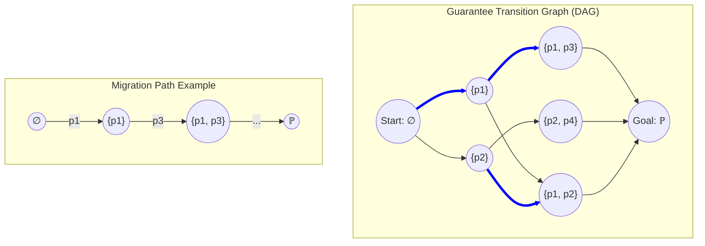

（青線は一つの有効な Migration Path の例：$\emptyset \to \{p_1\} \to \{p_1, p_3\} \to \dots \to \mathbb{P}$）

# 8. 結論

本稿により、COBOL移行プロセスは **Guarantee Transition Graph 上の経路探索問題** として定式化された。
各ステップは依存関係と整合しており、Migration Path は依存順序の **線形拡張（Linear Extension）** に対応する。
これにより、移行計画の策定は、数理的な **Topological Ordering 問題** として厳密に扱うことが可能となった。

---
# 11_Migration-Complexity

# 1. 目的

本稿では、COBOL移行プロジェクトの「難易度」を定量化するための数学的指標として **Migration Complexity（移行複雑度）** を定義する。
従来のグラフ理論的アプローチに加え、順序理論（Order Theory）および最適化理論（Optimization Theory）の観点から理論を厳密化し、移行コストの本質的な構造を明らかにする。

# 2. Migration Distance

Guarantee Transition Graph $G_{trans} = (V, E)$ 上の2つの状態 $S, T \in V$ （ただし $S \subseteq T$）間の距離 $d(S, T)$ を以下のように定義する。

$$
d(S, T) = |T \setminus S|
$$

これは、状態 $S$ から状態 $T$ へ到達するために追加が必要な **保証性質の個数** を表す。
Atomic Migration Step の定義より、各ステップで保証性質は1つずつ追加されるため、パス上の距離はステップ数と一致する。

$$
d(S, T) = L(Path_{S \to T})
$$

# 3. Migration Cost

移行コストをより現実的にモデル化するため、導入順序に依存するコスト関数を定義する。

## 3.1 状態依存重み関数

各保証性質 $p \in \mathbb{P}$ の導入コストは、その時点での保証状態 $S$ に依存すると仮定する。
重み関数 $w$ を以下のように定義する。

$$
w : \mathbb{P} \times V \to \mathbb{R}_{\geq 0}
$$

ここで $w(p \mid S)$ は、現在の保証状態が $S$ であるときに、新たな性質 $p$ を導入するためのコスト（リスクや工数）を表す。

## 3.2 パスコスト

ある移行パス $Path = (S_0, \dots, S_n)$ のコスト $Cost(Path)$ は、パス上で発生する状態依存コストの総和として定義される。

$$
Cost(Path) = \sum_{i=1}^{n} w(p_i \mid S_{i-1})
$$

ここで $S_i = S_{i-1} \cup \{p_i\}$ である。
この定義により、同じ保証性質の集合を追加する場合でも、**導入する順序によって総コストが変動する** という現実的な特性を表現できる。

# 4. 移行における最小コスト

始点 $S$ から終点 $T$ への移行における最小コストを以下のように定義する。

$$
MinCost(S, T) = \min \{ Cost(Path) \mid Path \in \mathcal{P}_{S \to T} \}
$$

ここで $\mathcal{P}_{S \to T}$ は、状態 $S$ から $T$ へのすべての有効な移行パスの集合である。
この最小化問題は、重み付きグラフ上の **Shortest Path Problem（最短経路問題）** に帰着される。

これは Phase 2 後半で定義される **Energy Function** の差分（あるいは到達エネルギー）と一致する概念である。

$$
MinCost(\bot, S) = E(S)
$$

# 5. 移行複雑度

プロジェクト全体の移行複雑度 $C$ を、始点 $\bot$ から終点 $\top$ への最小移行コストとして定義する。

$$
C = MinCost(\bot, \top) = \min_{Path} \sum_{i=1}^{n} w(p_i \mid S_{i-1})
$$

さらに、最短経路距離の記法を用いて以下のように表現できる。

$$
C = d_{min}(\bot, \top)
$$

## 5.1 最適化問題

Migration Complexity を求めることは、以下の最適化問題を解くことと等価である。

- **Objective**: Minimize Total Cost
- **Constraints**: 
    - Path must be valid in $G_{trans}$ (Dependent Guarantee Space).
    - Start at $\bot$, End at $\top$.

# 6. Structural Factors

Migration Complexity は、コストだけでなく、構造的な複雑さにも依存する。

## 6.1 Order Complexity (Linear Extensions)

Guarantee Dependency は半順序集合（Poset） $(P, \leq_D)$ を形成する。
Migration Path は、この Poset の **Linear Extension（線形拡張）** に対応する。

$$
Migration \ Path \cong Linear \ Extension \ of \ (P, \leq_D)
$$

**Order Complexity** を、可能な Linear Extension の総数 $e(P)$ として定義する。
$e(P)$ が大きいほど、選択可能なパスが多くなり、最適化の探索空間が広がる（計算複雑度が増大する）ことを意味する。

## 6.2 Branching Factor (Branch)

各状態 $S$ における選択肢の多さを **Branching Factor** として定義する。

$$
Branch(S) = | \{ p \in \mathbb{P} \setminus S \mid S \cup \{p\} \in G_{dep} \} |
$$

これは、現在の状態 $S$ に対して、依存制約を満たしつつ次に追加可能な保証性質の数を表す。
平均分岐係数が高いほど、柔軟性が高い一方で、最適経路探索の難易度は上がる。

# 7. Normalized Complexity

複雑度をプロジェクトの規模（総コストの期待値）で正規化した指標を定義する。
基準となる総コスト $\mu(\mathbb{P})$ を、文脈に依存しない基本重み $w_0(p)$ の総和とする。

$$
\mu(\mathbb{P}) = \sum_{p \in \mathbb{P}} w_0(p)
$$

**Normalized Complexity $\bar{C}$**:

$$
\bar{C} = \frac{C}{\mu(\mathbb{P})}
$$

- $\bar{C} < 1$: 順序最適化により、基本コストよりも効率的に移行可能（シナジー効果）。
- $\bar{C} > 1$: 順序制約や状態依存コストにより、基本コスト以上の労力が必要（摩擦コスト）。

# 8. Discussion

## 8.1 数学的構造のまとめ

本理論は以下の数学的構造に基づいている。

| Concept | Mathematical Structure |
| :--- | :--- |
| **Guarantee Space** | Distributive Lattice (分配束) |
| **Dependency** | Poset (半順序集合) |
| **Migration Path** | Linear Extension (線形拡張) |
| **Cost** | Functional on Path (汎関数) |
| **Complexity** | Optimization Problem (最適化問題) |

## 8.2 実践的意義

この理論により、単なる「工数見積もり」を超えて、「どの順序で移行すれば最も効率的か」を科学的に決定することが可能となる。
特に $w(p \mid S)$ を適切に設定することで、リスク回避や早期の価値実現（Early Value Delivery）を考慮した計画策定ができる。

# 9. 結論

Migration Complexity の再定義により、移行難易度を「最適経路における最小コスト」として厳密に定式化した。
状態依存コストとLinear Extensionの概念を導入することで、順序最適化の重要性が数学的に裏付けられた。
これにより、COBOL移行プロジェクトは、経験則ではなく数理最適化のアプローチによって管理可能な対象となる。

---
# 12_Guarantee-Dynamics

# 1. Purpose

本稿では、COBOL移行プロセスにおける「保証の時間的進化」を **Guarantee Dynamics（保証ダイナミクス）** として体系化する。
Migration Path が依存関係（Poset）の静的な線形拡張（Linear Extension）であるのに対し、Dynamics はその「時間的実行（Temporal Realization）」に焦点を当てる。
本稿では、依存関係の構造的特徴から導かれる活性化ポテンシャル、クリティカル性、ボトルネック性を数学的に厳密に定義し、移行最適化問題との接続を明確にする。

# 2. Guarantee State Evolution

移行プロジェクトにおける保証状態の時間変化をモデル化する。

## 2.1 Discrete Time Model

時間を離散的なステップ $t \in \{0, 1, \dots, n\}$ とする。
時刻 $t$ における保証状態を $S_t \in G_{dep}$ とする。

状態の進化は以下の遷移則に従う。

$$
S_{t+1} = S_t \cup \{p_{t+1}\}
$$

ここで $p_{t+1} \in \mathbb{P} \setminus S_t$ であり、かつ依存制約 $Cl_D(S_t \cup \{p_{t+1}\}) = S_t \cup \{p_{t+1}\}$ を満たす。

このプロセスは、空集合 $\emptyset$ から始まり、全集合 $\mathbb{P}$ へ至るまでの「保証の累積過程（Accumulation Process）」として記述される。

# 3. Dependency Activation

ある保証性質 $p$ の追加は、単にその性質自体を獲得するだけでなく、それに依存する他の性質を「解放（Unlock）」または「活性化（Activate）」する役割を持つ。

## 3.1 Definition

保証性質 $p \in \mathbb{P}$ によって直接的または間接的に活性化される可能性のある性質の集合を $Unlock(p)$ と定義する。

$$
Unlock(p) = \{ q \in \mathbb{P} \mid p \leq_D q \}
$$

これは依存関係 Poset における $p$ の上側集合（Upper Set / Filter）に相当する。

# 4. Activation Potential

状態 $S$ において、次に追加可能な候補集合を $Available(S)$ とする。

$$
Available(S) = \{ q \in \mathbb{P} \setminus S \mid S \cup \{q\} \in G_{dep} \}
$$

ある性質 $p \in Available(S)$ を追加することによる即時的な効果を、その性質の **Activation Potential** として厳密に定義する。

$$
Potential(p \mid S) = | (Unlock(p) \setminus S) \cap Available(S \cup \{p\}) |
$$

これは、「$p$ を追加することによって、**新たに** $Available$ 集合に追加される性質（newly available guarantees）の数」を表す。
高い Potential を持つ性質を優先的に導入することで、後の選択肢（Branching Factor）を広げ、プロジェクトの柔軟性を高めることができる。

# 5. Critical Guarantees

依存関係グラフ $(\mathbb{P}, \leq_D)$ の構造に基づき、プロジェクト全体に対して重要な役割を果たす保証性質を定義する。

## 5.1 Dependency Centrality

保証性質 $p$ が多数の他の性質の前提条件となっている場合、これを **Critical Guarantee** と呼ぶ。
この重要度を **Dependency Centrality** として定量化する。

$$
C_{dep}(p) = | \{ q \in \mathbb{P} \mid p \leq_D q \} |
$$

これは $Unlock(p)$ の濃度に等しい。
$C_{dep}(p)$ が大きい性質は、移行の早期段階で確立されるべき「基盤的保証（Foundational Guarantee）」である（例：構文解析の正確性、データ型の整合性など）。

## 5.2 Path Centrality (Supplementary)

補足として、ある性質 $p$ がどれだけの数の有効な移行パスに含まれるか（あるいは通過するか）を示す **Path Centrality** も有用である。

$$
C_{path}(p) = \text{number of migration paths containing } p
$$

ただし、Atomic Step の定義上、すべてのパスはすべての要素を含むため、順序制約としての「順序の自由度への影響」を考慮する場合に意味を持つ。

# 6. Bottleneck Guarantees

多数の（あるいはすべての）有効な移行パスが、必ず通過しなければならない特定の順序や状態を支配する保証性質を **Bottleneck Guarantee** と呼ぶ。

## 6.1 Dominance

保証性質間の支配関係を以下のように定義する。

$$
p \text{ dominates } q \iff \forall Path \in \mathcal{P}_{\bot \to q}, \ p \in Path
$$

これは、グラフ理論における Dominator の概念を移行パスに適用したものである。
（注：Atomic Step の定義上、すべての要素が含まれるため、ここでは「順序的な支配（$p$ が完了しないと $q$ が開始できない）」、すなわち $p \leq_D q$ と同義になるが、より複雑な依存条件を持つモデルでは区別される）

## 6.2 Bottleneck Definition

ある性質 $p$ が **Bottleneck** であるとは、もし $p$ が除去された（達成不可能となった）場合に、到達可能なゴール状態の割合や有効なパスの数が著しく減少することを意味する。

$$
p \text{ is bottleneck } \iff |G_{dep}(\mathbb{P} \setminus \{p\})| \ll |G_{dep}(\mathbb{P})|
$$

グラフ理論的には、$G_{trans}$ における **Cut Vertex（切断点）** や **Bridge（橋）** に近い概念として解釈できる。

# 7. Dynamics Interpretation

Migration Path が Poset の Linear Extension であることから、Guarantee Dynamics は以下のように解釈される。

$$
Dynamics = \text{Execution of Linear Extension}
$$

つまり、移行プロセスとは、依存関係という半順序制約を満たしながら、時間を追って全順序（Linear Order）を実現していく過程である。
この過程において、Activation Potential や Criticality は、次にどのステップを選択すべきかの「局所的な指針（Local Heuristics）」を提供する。

# 8. Relation to Migration Optimization

Guarantee Dynamics は、最終的に移行最適化問題へと接続される。

1.  **Cost Function**: 各ステップにコスト（重み）を付与する。
2.  **Minimum Cost Path**: 全体のコストを最小化するパスを探索する。
3.  **Optimal Dynamics**: 最小コストパスに沿った実行プロセスこそが、最適なダイナミクスである。

$$
\text{Optimal Migration Execution} = \text{Minimum Cost Path in } G_{trans}
$$

この関係性により、動的なプロジェクト管理（Dynamics）は、静的なグラフ上の最短経路問題（Optimization）として数学的に解くことが可能となる。

# 9. Conclusion

本稿では、Guarantee Dynamics を Linear Extension の時間的実行として再定義し、Activation Potential や Criticality などの指標を厳密化した。
これにより、移行プロセスは単なる作業リストの消化ではなく、依存関係の構造的特性を利用した戦略的な状態遷移プロセスとして捉え直された。
この理論的枠組みは、次フェーズにおけるコスト最適化（Optimization Landscape）の基礎となる。

---
# 13_Optimization-Landscape

# 1. Purpose

本稿では、Guarantee Space をコスト関数上の **Optimization Landscape（最適化地形）** として解釈し、移行プロジェクトにおける「最適な軌道」を見つけ出すための幾何学的・解析的な枠組みを提供する。
従来の物理的なアナロジー（Landscape）と、離散最適化理論（Graph Theory）を厳密に接続し、移行の難所（Barrier）や効率的なルート（Valley）を数学的に定義する。

# 2. State Cost

Guarantee Space 上の各状態 $S \in G_{dep}$ に対して、その状態を「維持」または「到達」するために必要なコストを定義する。

## 2.1 State Dependent Weight

各保証性質 $p \in \mathbb{P}$ のコストは、その導入時点の状態 $S$ に依存する場合がある（例：ある保証が既に存在すると、次の保証導入が容易になる）。
これを状態依存重み $w(p \mid S)$ として定義する。

$$
w : \mathbb{P} \times G_{dep} \to \mathbb{R}_{\geq 0}
$$

最も単純なモデル（状態非依存）では、$w(p \mid S) = w(p)$ である。

# 3. Energy Function

状態 $S$ のエネルギー $E(S)$ を、原点 $\bot$ から $S$ へ至る最短経路のコストとして定義する。

$$
E(S) = \min_{Path_{\bot \to S}} \sum_{i=1}^{k} w(p_i \mid S_{i-1})
$$

## 3.1 Energy and Path Cost

この定義により、状態のエネルギーは「原点からの最短距離（Shortest Path Distance）」と一致する。

$$
E(S) = d_{min}(\bot, S)
$$

定数重みモデル（$w(p \mid S) = w(p)$）の場合、エネルギーは単純な重み付き和となる。

$$
E(S) = \sum_{p \in S} w(p)
$$

この性質により、Optimization Landscape は **Shortest Path Geometry** と数学的に等価であることが保証される。

# 4. Landscape Geometry

Guarantee Space $G_{dep}$ とエネルギー関数 $E(S)$ の組み合わせは、高次元空間上の **Landscape（地形）** を形成する。

- **高度（Altitude）**: $E(S)$。状態の累積最小コストを表す。
- **隣接関係（Adjacency）**: Cover Relation $S \lessdot T$。地形上の移動可能な経路を表す。

この Landscape 上において、移行プロセスは「低い場所（$\bot$）から高い場所（$\top$）への登山」として表現される。

# 5. Energy Gradient

ある状態 $S$ から、次の保証性質 $p$ を追加する際のエネルギーの変化率（勾配）を定義する。

$$
\Delta E(S, p) = E(S \cup \{p\}) - E(S)
$$

基本モデル（定数重み）では $\Delta E(S, p) = w(p)$ となるが、状態依存モデルでは次のように表される。

$$
\Delta E(S, p) \approx w(p \mid S)
$$

勾配が小さい方向へ進むことは、局所的にコスト効率の良い選択をすることを意味する（Greedy Strategy）。

# 6. Migration Valley

実際のプロジェクトでは、コスト関数は非線形であり、効率的な経路と非効率な経路が存在する。
これを「谷（Valley）」の概念として数学的に定義する。

## 6.1 Definition

**Migration Valley** とは、大域的な最適パス（Optimal Path）に近い状態の集合である。

$$
Valley_{\epsilon} = \{ S \in G_{dep} \mid (d_{min}(\bot, S) + d_{min}(S, \top)) - d_{min}(\bot, \top) \leq \epsilon \}
$$

すなわち、**「その状態を経由しても、全体最適解から $\epsilon$ 以内のコストロスでゴールに到達できる状態の集合」** が Migration Valley である。
$\epsilon=0$ の場合、Valley は厳密な最適経路（の集合）となる。

# 7. Barriers and Local Optima

## 7.1 Barriers（障壁）

ある状態 $S$ から次の状態へ進むためのすべての遷移 $S \to T$ が、許容限界を超えるエネルギー勾配（コスト増分）を要求する場合、その状態は **Barrier** に直面している。

$$
Barrier(S) \iff \forall p \in Available(S), \ \Delta E(S, p) > Threshold
$$

## 7.2 Local Optima (Greedy Trap)

局所的な勾配 $\Delta E$ が最小となる方向を選び続けた結果、トータルコストが最適解よりも悪化する場合、その経路は **Greedy Trap（貪欲法の罠）** に陥っている。
これは、局所最適（Local Optima）が大域最適（Global Optima）と一致しない場合に発生する。

# 8. Global Optimal Path

移行計画のゴールは、Guarantee Space という離散構造上での **Global Optimal Path（大域的最適パス）** を特定することである。

$$
Path_{opt} = \arg \min_{Path \in \mathcal{P}_{\bot \to \top}} \sum_{(S, S') \in Path} w(S' \setminus S \mid S)
$$

これは、Guarantee Transition Graph 上の **Shortest Path Problem（最短経路問題）** と完全に等価である。
グラフは DAG であるため、動的計画法（DP）やダイクストラ法を用いて、この大域的最適解を効率的に求めることができる。

# 9. Visualization

Optimization Landscape の概念図を以下に示す。

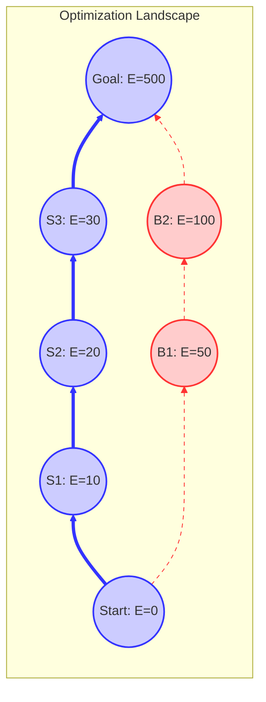

# 10. Conclusion

Guarantee Space を Optimization Landscape として捉えることで、移行計画は「地形を読み、最適なルートを選び取る」幾何学的な問題として再定義された。
特に、Migration Valley を「全体最適解からの乖離が少ない領域」として数学的に定義したことで、プロジェクトの健全性を定量的に評価する指標が得られた。
この理論的枠組みは、複雑な依存関係を持つ大規模移行プロジェクトにおいて、迷走を防ぎ、最短ルートを維持するための羅針盤となる。

# 11. Phase 2 Theory Structure

本フェーズで構築された理論の全体構造は以下の通りである。

1.  **Guarantee Space**: 保証状態の全体集合（冪集合）。
    $\downarrow$
2.  **Distributive Lattice**: 和集合と共通部分による代数構造。
    $\downarrow$
3.  **Dependency Poset**: 保証間の依存関係に基づく順序構造。
    $\downarrow$
4.  **Linear Extensions**: 依存関係を満たす順列の集合。
    $\downarrow$
5.  **Migration Paths**: 具体的な移行手順（Linear Extension に対応）。
    $\downarrow$
6.  **Migration Complexity**: 最小コストパスによる難易度の定量化。
    $\downarrow$
7.  **Guarantee Dynamics**: 時間軸に沿った状態の進化と活性化。
    $\downarrow$
8.  **Optimization Landscape**: コスト関数に基づく地形的解釈と最適化。

これにより、COBOL移行問題は、単なる工学的課題から **Discrete Optimization Problem（離散最適化問題）** として数学的に完全に定式化された。


# 60_decision

# 01. 意思決定のための保証空間の形式化 (Guarantee Space Formalization for Decision Making)

**Phase 3: Migration Decision Model**  
**Document ID:** `docs/60_decision/01_Guarantee_Decision_Space.md`  
**Date:** 2026-03-05

---

## 1. はじめに

本文書は、**保証空間（Guarantee Space, $\mathcal{G}$）** を、二値的な移行判断（安全 vs 危険）を行うための数学的領域として形式化するものである。Phase 2 では $\mathcal{G}$ をシステム特性の記述モデルとして確立したが、Phase 3 ではこれを **意思決定空間（Decision Space）** へと変換する。

中核となる目的は、可能なシステム状態の束（Lattice）の中に **安全領域（Safety Region）** を定義し、提案された移行パスがこの領域内に留まるか、あるいは到達するかを判定するための厳密な手法を提供することである。

---

## 2. 形式的定義: 保証束 (The Guarantee Lattice)

### 2.1 分配束としての保証空間

$\mathbb{P}$ を、すべての可能な保存特性（例：特定のデータフロー、制御ロジック、境界値）の有限集合とする。
**保証空間** $\mathcal{G}$ は、包含関係によって順序付けられた $\mathbb{P}$ のべき集合として定義される：

$$
\mathcal{G} = (\mathcal{P}(\mathbb{P}), \subseteq)
$$

この構造は **ブール束（Boolean Lattice）** を形成する。任意の2つの状態 $S_1, S_2 \in \mathcal{G}$ に対して：
- **結び（Join, $S_1 \cup S_2$）**: $S_1$ と $S_2$ 両方の特性が保存される状態。
- **交わり（Meet, $S_1 \cap S_2$）**: 共通の特性のみが保存される状態。

### 2.2 依存関係制約付き保証空間 ($\mathcal{G}_{dep}$)

現実には、保証は独立していない。高レベルの保証（例：「利息計算」）は、多くの場合、低レベルの保証（例：「変数アクセス」）に依存する。$D \subseteq \mathbb{P} \times \mathbb{P}$ を依存関係とし、$(p, q) \in D$ は「$q$ は $p$ を必要とする」ことを意味するとする。

**有効保証空間（Valid Guarantee Space）** は、$\mathbb{P}$ のすべての依存関係で閉じている部分集合（イデアル）の集合である：

$$
\mathcal{G}_{dep} = \{ S \in \mathcal{G} \mid \forall p \in S, \forall q \in \mathbb{P}, (q, p) \in D \implies q \in S \}
$$

$\mathcal{G}_{dep}$ は $\mathcal{G}$ の **分配部分束（Distributive Sublattice）** である。これが移行判断のための実際の状態空間となる。

---

## 3. クリティカル保証理論 (Critical Guarantee Theory)

すべての保証が等価であるわけではない。移行が「成功」または「安全」であると見なされるためには、特定の特性のサブセットが*必ず*保存されなければならない。

### 3.1 クリティカル保証集合 ($G_{crit}$) の定義

$Req$ を移行後のシステムのビジネス要件集合とする。
**クリティカル保証集合（Critical Guarantee Set）** $G_{crit} \subseteq \mathbb{P}$ を、$Req$ を満たすために不可欠な最小限の特性集合として定義する。

$$
G_{crit} = \{ p \in \mathbb{P} \mid p \text{ is essential for } Req \}
$$

**極めて重要な点として**、$G_{crit}$ は **依存関係で閉じて（dependency-closed）** いなければならない。クリティカルな要件が低レベルの特性に依存する場合、その低レベル特性も暗黙的にクリティカルとなる。

$$
G_{crit} \in \mathcal{G}_{dep}
$$

### 3.2 安全性関数 (The Safety Function)

二値の **安全性関数（Safety Function）** $Safe: \mathcal{G}_{dep} \to \{0, 1\}$ を定義する：

$$
Safe(S) = \begin{cases} 
1 & \text{if } G_{crit} \subseteq S \\
0 & \text{otherwise}
\end{cases}
$$

状態 $S$ は、すべてのクリティカル保証を含んでいる場合にのみ、**安全（Safe）** である。

---

## 4. 安全性部分束 (The Safety Sublattice)

### 4.1 安全領域 ($\mathcal{S}$)

すべての安全な状態の集合は、保証空間内に特定の領域を形成し、これを **安全領域（Safety Region）** $\mathcal{S}$ と呼ぶ：

$$
\mathcal{S} = \{ S \in \mathcal{G}_{dep} \mid G_{crit} \subseteq S \}
$$

**定理 1 (フィルター特性):**
安全領域 $\mathcal{S}$ は、束 $\mathcal{G}_{dep}$ 内の **フィルター（Filter, 双対イデアル）** である。
*証明:*
1.  もし $S \in \mathcal{S}$ かつ $S \subseteq T$ （ここで $T \in \mathcal{G}_{dep}$）ならば、$G_{crit} \subseteq S \subseteq T$ であるため、$G_{crit} \subseteq T$ となる。したがって $T \in \mathcal{S}$ である。（上方閉包）
2.  もし $S_1, S_2 \in \mathcal{S}$ ならば、$G_{crit} \subseteq S_1$ かつ $G_{crit} \subseteq S_2$ である。したがって $G_{crit} \subseteq S_1 \cap S_2$ となる。ゆえに $S_1 \cap S_2 \in \mathcal{S}$ である。（交わりについて閉じている）

### 4.2 安全への距離 (Distance to Safety)

任意の不安全な状態 $S \notin \mathcal{S}$ に対して、**移行負債（Migration Debt）** または **安全への距離（Distance to Safety）** を定義できる：

$$
d_{safety}(S) = \mu(G_{crit} \setminus S)
$$

ここで $\mu$ は保証の重要度の重み付き尺度である。このメトリクスは、ある状態が「どれほど不安全か」を定量化する。

---

## 5. 構造マッピング: コードから束へ (Structural Mapping)

物理的な COBOL プログラムを $\mathcal{G}_{dep}$ 内の点 $S$ にどのようにマッピングするか？

### 5.1 マッピング関数 $\Phi$

$\mathbb{C}$ をすべての可能なコード構造（AST）の空間とする。
特定のコード構造 $C$ によって提供される保証の集合を抽出するマッピング関数 $\Phi: \mathbb{C} \to \mathcal{G}_{dep}$ を定義する。

$$
S = \Phi(C)
$$

### 5.2 構造パターンと束上の領域

異なるコードパターンは、束の異なる領域にマッピングされる：

*   **スパゲッティコード (Spaghetti Code)**:
    *   非構造化制御フロー（GOTO）によって特徴づけられる。
    *   制御フロー保証（$P_{flow}$）が弱いか欠如している状態 $S_{spaghetti}$ にマッピングされる。
    *   もし $P_{flow} \cap G_{crit} \neq \emptyset$ ならば、おそらく $S_{spaghetti} \notin \mathcal{S}$ である。

*   **モノリシック構造 ("God Class")**:
    *   高い結合度と状態の共有によって特徴づけられる。
    *   データ分離保証（$P_{data}$）が欠落している状態 $S_{mono}$ にマッピングされる。

*   **モジュラー構造 (Modular Structure)**:
    *   明確なインターフェースとスコープによって特徴づけられる。
    *   束の上位にある状態 $S_{mod}$ にマッピングされ、$P_{flow}$ と $P_{data}$ の両方を保存している。

### 5.3 移行軌跡 (The Migration Trajectory)

移行はコードの変換 $C_0 \to C_1 \to \dots \to C_{target}$ である。
これは保証空間における軌跡に対応する：
$S_0 \to S_1 \to \dots \to S_{target}$。

**判断基準（Decision Criterion）** は以下の通りである：
その軌跡は最終的に $\mathcal{S}$ に到達するか？
すなわち、$S_{target} \in \mathcal{S}$ か？

---

## 6. 結論

我々は以下によって、意思決定のための保証空間を形式化した：
1.  $\mathcal{G}_{dep}$ を有効な状態の分配束として定義した。
2.  $G_{crit}$ を不可欠な特性の集合として特定した。
3.  **安全領域** $\mathcal{S}$ を $G_{crit}$ によって生成されるフィルターとして定義した。
4.  **安全への距離** $d_{safety}(S)$ を主要なメトリクスとして確立した。

この形式化は、**構造的リスクモデル**（Task 2）のための「座標系」を提供する。Task 2 では、$\mathcal{S}$ へ正常に遷移できる確率を定量化する。

---
# 02. 構造的リスクモデル (Structural Risk Model)

**Phase 3: Migration Decision Model**  
**Document ID:** `docs/60_decision/02_Structural_Risk_Model.md`  
**Date:** 2026-03-05

---

## 1. はじめに

**構造的リスクモデル（Structural Risk Model）** は、レガシーシステムの移行が、`01_Guarantee_Decision_Space.md` で定義された **安全領域（Safety Region, $\mathcal{S}$）** に到達できずに失敗する可能性を定量化するものである。

保証空間が安全な状態の *位相幾何学的（topological）* 地図を提供するのに対し、リスクモデルは *確率的* および *計量的* 次元を導入する：安全への道のりを進むのは **どれほど困難か**、そして失敗の **確率はどれくらいか**？

---

## 2. 移行負債モデル (Migration Debt Model)

**移行負債（Migration Debt, $D_{debt}$）** を、現在のシステム状態 $S_{current}$ と、安全領域 $\mathcal{S}$ 内の最も近い安全な状態との間の構造的距離として定義する。

### 2.1 安全への距離

Phase 2 からの重み付きハミング距離 $d_w(S_1, S_2) = \sum_{p \in S_1 \triangle S_2} w(p)$ を用いると、移行負債は、欠落しているすべてのクリティカル保証を獲得するための最小コストとなる：

$$
D_{debt}(S) = \min_{T \in \mathcal{S}} d_w(S, T)
$$

$\mathcal{S}$ はクリティカル保証集合 $G_{crit}$ によって定義され、任意の安全な状態は $G_{crit}$ を含んでいなければならないため、これは次のように簡略化される：

$$
D_{debt}(S) = \sum_{p \in G_{crit} \setminus S} w(p)
$$

これは、安全な状態に到達するために必要な **理論上の最小労力** を表す。

### 2.2 負債密度 (Debt Density)

異なる規模のシステム間で正規化するために、**負債密度（Debt Density, $\rho_{debt}$）** を定義する：

$$
\rho_{debt}(S) = \frac{D_{debt}(S)}{\sum_{p \in G_{crit}} w(p)}
$$

$\rho_{debt} \in [0, 1]$ であり、0 はシステムが既に安全であることを意味し、1 はクリティカル保証が完全に欠如していることを意味する。

---

## 3. 構造的リスク関数 (The Structural Risk Function)

移行負債は *何を* なすべきかを測定する。構造的リスクは、それを実行する際の *困難さ* と *不確実性* を測定する。
我々は、移行ステップ $S \to S'$ のリスクは、コードの構造的複雑性の関数であると提案する。

### 3.1 遷移失敗の確率

$T: S \to S'$ を移行変換（例：モジュールのリファクタリング）とする。
$P_{fail}(T)$ を、結果として得られる状態 $S'$ が意図した保証を保存しない（すなわち、$S' \notin \mathcal{G}_{dep}$ または $S'$ が $S$ からの特性を失う）確率として定義する。

我々は、$P_{fail}$ が標準的な複雑度メトリクスと相関しているという仮説を立てる：

$$
P_{fail}(T) \approx 1 - e^{- k \cdot C(T)}
$$

ここで：
*   $C(T)$ は、変換されるコードの **構造的複雑性（Structural Complexity）** である。
*   $k$ はプロセス能力定数である（手動移行の場合は低く、自動化ツールの場合は高い）。

### 3.2 複雑性要因 ($C(T)$)

複雑性 $C(T)$ は、AST、CFG、DFG から導出される複合メトリクスである：

1.  **制御フロー複雑性 ($C_{cfg}$)**:
    *   サイクロマティック複雑度 ($CC$)。
    *   非構造化度（Knot Count または GOTO の数）。
    *   *$C_{cfg}$ が高いと、ロジックエラーのリスクが増大する。*

2.  **データフロー複雑性 ($C_{dfg}$)**:
    *   Halstead Volume ($V$)。
    *   データ結合度（共有変数の数）。
    *   *$C_{dfg}$ が高いと、副作用のリスクが増大する。*

3.  **依存関係の深さ ($C_{dep}$)**:
    *   依存関係グラフ $D$ における深さ。
    *   モジュールのファンイン / ファンアウト。
    *   *$C_{dep}$ が高いと、連鎖的障害のリスクが増大する。*

$$
C(T) = \alpha \cdot C_{cfg} + \beta \cdot C_{dfg} + \gamma \cdot C_{dep}
$$

### 3.3 リスク方程式

システム $S$ の総 **構造的リスク（Structural Risk, $R_{struct}$）** は、その移行負債と構造的複雑性の積である：

$$
R_{struct}(S) = D_{debt}(S) \times (1 + C(S))
$$

あるいは、確率的定式化においては：

$$
R_{struct}(S) = D_{debt}(S) \times \frac{1}{1 - P_{fail}(S)}
$$

この定式化は以下を意味する：
*   もし負債が 0 なら（システムは安全）、リスクは 0 である。
*   もし複雑性が高ければ、リスクは増幅される（実質的に「距離」が増大する）。
*   もし複雑性が無限大なら（保守不可能なコード）、リスクは無限大に近づく。

---

## 4. リスク分類 (Risk Classification)

$R_{struct}$ に基づき、システムを4つのゾーンに分類する：

| リスクレベル | 範囲 ($R_{struct}$) | 解釈 | 推奨戦略 |
| :--- | :--- | :--- | :--- |
| **Low** | $0 \le R < 10$ | 移行しても安全 | **直接移行** (リホスト/自動リファクタリング) |
| **Medium** | $10 \le R < 50$ | 管理可能なリスク | **リファクタリング後に移行** (先に複雑性を解消) |
| **High** | $50 \le R < 100$ | 重大な危険 | **部分的書き直し** (高リスクモジュールを隔離) |
| **Critical** | $R \ge 100$ | 実現可能性未証明 | **完全再設計** (移行は失敗する可能性が高い) |

*(注: 閾値 10, 50, 100 は例示であり、Task 5 で校正する必要がある)。*

---

## 5. 結論

構造的リスクモデルは、以下から導出される計算値 $R_{struct}$ を提供する：
1.  **欠落している保証** ($G_{crit} \setminus S$)
2.  **コード複雑性** ($CC$, Halstead, Coupling)

このモデルは、「スパゲッティコード」の移行がなぜ危険なのかを定量的に説明する。単に読みにくいからではなく、その高い $C_{cfg}$ が遷移失敗確率 ($P_{fail}$) を増幅させ、安全領域への実効的な距離を克服不可能にするからである。

この出力は、**移行実現可能性モデル**（Task 3）に直接入力され、そこで $R_{struct}$ を許容レベルまで低減するパスが存在するかどうかが判定される。

---
# 03. 移行実現可能性モデル (Migration Feasibility Model)

**Phase 3: Migration Decision Model**  
**Document ID:** `docs/60_decision/03_Migration_Feasibility.md`  
**Date:** 2026-03-05

---

## 1. はじめに

**移行実現可能性モデル（Migration Feasibility Model）** は、与えられたリソース制約内で、現在のシステム状態 $S_{start}$ から安全領域 $\mathcal{S}$ への有効な移行パスが存在するかどうかを判定する。

**リスクモデル**（Task 2）が *困難さ* と *失敗確率* を定量化するのに対し、**実現可能性モデル** は *可能性* という二値的な問いに取り組む：**我々はここからあそこへ行けるのか？**

これには2つの異なるチェックが含まれる：
1.  **理論的到達可能性（Theoretical Reachability）**: 依存関係構造は、安全な状態に到達するための一連の有効な変換を許容するか？
2.  **リソース実現可能性（Resource Feasibility）**: このシーケンスは、プロジェクトの予算（時間、コスト、労力）内で実行可能か？

---

## 2. 到達可能性理論 (Reachability Theory)

Phase 2 で定義された **保証遷移グラフ（Guarantee Transition Graph）** $G_{trans} = (\mathcal{G}_{dep}, E)$ 内での到達可能性を分析する。

### 2.1 到達可能集合 ($\mathcal{R}$)

初期状態 $S_{start}$ から到達可能なすべての状態の集合は、遷移関係の推移閉包として定義される：

$$
\mathcal{R}(S_{start}) = \{ S \in \mathcal{G}_{dep} \mid \exists \text{ path } S_{start} \to \dots \to S \}
$$

### 2.2 理論的実現可能性条件

移行は、到達可能集合が安全領域と交差する場合にのみ、**理論的に実現可能** である：

$$
Feasible_{theory}(S_{start}) \iff \mathcal{R}(S_{start}) \cap \mathcal{S} \neq \emptyset
$$

この共通部分が空である場合、システムは要求される安全性基準に対して **行き止まり（Dead End）** または **トラップ状態（Trap State）** にある。これは、依存関係構造がすべてのクリティカル保証（$G_{crit}$）の同時充足を本質的に妨げている場合に発生する。

---

## 3. リソース実現可能性 (Resource Feasibility)

パスが存在しても、コストがかかりすぎる場合がある。$G_{trans}$ のエッジにコスト関数を導入する。

### 3.1 移行コスト関数 ($Cost$)

$path = (S_0, S_1, \dots, S_n)$ を、$S_0 = S_{start}$ かつ $S_n \in \mathcal{S}$ である移行軌跡とする。
このパスのコストは、個々の遷移（原子的な移行ステップ）のコストの総和である：

$$
Cost(path) = \sum_{i=0}^{n-1} cost(S_i \to S_{i+1})
$$

ここで $cost(S \to S')$ は、変換されるコンポーネントの **構造的リスク（Structural Risk）** から導出される：
$$
cost(S \to S') \approx Effort_{base} \times (1 + R_{struct}(S \to S'))
$$
高リスクの変換は、指数関数的に多くの労力（テスト、手動検証）を必要とする。

### 3.2 最小移行コスト ($C_{min}$)

安全に到達するための最小コストは、重み付きグラフにおける最短パス距離である：

$$
C_{min}(S_{start}) = \min \{ Cost(path) \mid path \text{ starts at } S_{start}, \text{ ends in } \mathcal{S} \}
$$

### 3.3 リソース実現可能性条件

$B$ をプロジェクト予算（リソース制約）とする。
移行は、以下の場合にのみ **リソース的に実現可能** である：

$$
Feasible_{resource}(S_{start}) \iff C_{min}(S_{start}) \le B
$$

---

## 4. ブロッキング構造 (Blocking Structures)

特定の構造パターンは、$Cost(S \to S') \to \infty$ となるか、$\mathcal{R}(S_{start}) \cap \mathcal{S} = \emptyset$ となる障壁として機能する。これらを **ブロッキング構造（Blocking Structures）** と呼ぶ。

### 4.1 既約制御フロー ("GOTO Knot")

*   **定義**: コードの重複やブールフラグ変数なしには構造化構成要素（順次、選択、反復）に還元できない CFG の部分グラフ。
*   **影響**: モノリシックなモジュールを、より小さくテスト可能な単位に分解することを妨げる。
*   **実現可能性への帰結**: これを解決するにはロジックを書き直す必要があり、これは局所的な保証状態を実質的に $\emptyset$ にリセットする（高リスク）。もし書き直しコストが $B$ を超える場合、それはブロッキング構造である。

### 4.2 データ結合サイクル ("God Data")

*   **定義**: 共有されたグローバル状態 $D_{global}$（例：巨大な COPYBOOK）に相互依存し、依存関係グラフにおいてサイクルを形成するモジュール群 $\{M_1, \dots, M_k\}$。
*   **影響**: $M_i$ を独立して移行できない。クラスタ全体を原子的に移行しなければならない。
*   **実現可能性への帰結**: 「原子的ステップ」のサイズがクラスタ全体のサイズになる。
    もし $Size(Cluster) > Capacity(Team)$ ならば、$Cost \to \infty$ となる。

### 4.3 ソース喪失 / レガシーバイナリ

*   **定義**: ソースコードが失われているか、サポートされていない言語（アセンブラマクロなど）で書かれているが、振る舞いを保存しなければならないシステム部分。
*   **影響**: $G_{crit}$ を検証できない。
*   **実現可能性への帰結**: リバースエンジニアリング（莫大なコストがかかる）を行わない限り、$\mathcal{R}(S_{start}) \cap \mathcal{S} = \emptyset$ である。

---

## 5. 実現可能性判定ロジック (The Feasibility Decision Logic)

理論的条件とリソース条件を単一の判定ロジックに結合する。

### 5.1 実現可能性述語

$$
IsMigratable(S_{start}, B) = \begin{cases} 
\text{True} & \text{if } C_{min}(S_{start}) \le B \\
\text{False} & \text{otherwise}
\end{cases}
$$

### 5.2 実現可能性分類

これに基づき、システムを分類する：

1.  **実現可能 (Feasible)**:
    *   パスが存在し、Cost $\le B$。
    *   **アクション**: 計画へ進む。

2.  **リソース的に実現不可能 (Resource Infeasible)**:
    *   パスは存在するが、Cost $> B$。
    *   **アクション**: スコープ縮小（$G_{crit}$ の削減）、予算増額、または技術的負債の受容。

3.  **構造的に実現不可能 (Structurally Infeasible / Blocked)**:
    *   $\mathcal{S}$ へのパスが存在しない（ブロッキング構造のため）。
    *   **アクション**: 移行前に再アーキテクチャ（書き直し）が必要。「移行」というパラダイムはここでは無効である。

---

## 6. 結論

移行実現可能性モデルは、「Go/No-Go」テストを提供する。
これは、**実現可能性が単にコード品質の問題ではなく、構造的リスクとリソース制約の関係性にあること** を浮き彫りにする。

*   高リスクなシステムでも、予算が無限にあれば移行 *できる*。
*   低リスクなシステムでも、ブロッキング構造がクリティカル保証の保存を妨げるならば、移行 *できない*。

この出力は、**意思決定境界モデル**（Task 4）に入力され、ビジネスコンテキストにおけるこれらの決定のための具体的な閾値が定義される。

---
# 04. 意思決定境界モデル (Decision Boundary Model)

**Phase 3: Migration Decision Model**  
**Document ID:** `docs/60_decision/04_Decision_Boundary.md`  
**Date:** 2026-03-05

---

## 1. はじめに

**意思決定境界モデル（Decision Boundary Model）** は、レガシーシステムを特定の移行戦略に分類するためのロジックを形式化するものである。これは以前のタスクの出力を統合する：
*   **保証決定空間** (Task 1): 目標状態は安全か？
*   **構造的リスク** (Task 2): 失敗の確率はどれくらいか？ ($R_{struct}$)
*   **移行実現可能性** (Task 3): 最小コストはいくらか？ ($C_{min}$)

このモデルは **ビジネスコンテキスト** を変数として導入し、リスク許容度と予算に基づいた「Go/No-Go」決定のための閾値を定義する。

---

## 2. 意思決定空間 (The Decision Space)

**移行意思決定空間（Migration Decision Space, $\mathbb{D}$）** を、構造的リスクと移行コストによって定義される2次元平面として定義する：

$$
\mathbb{D} = \{ (r, c) \in \mathbb{R}_{\ge 0} \times \mathbb{R}_{\ge 0} \}
$$

ここで：
*   $r = R_{struct}(S)$: 定量化された構造的リスク（Task 2 より）。
*   $c = C_{min}(S)$: 推定最小移行コスト（Task 3 より）。

すべてのレガシーシステムは、この空間内の単一の点 $P(S) = (R_{struct}(S), C_{min}(S))$ にマッピングされる。

---

## 3. リスク許容度とコンテキスト

「50」という生のリスク値は、コンテキストなしでは何の意味も持たない。ミッションクリティカルな銀行勘定系システムは、社内食堂のメニューシステムよりもはるかに低いリスク許容度を持つ。

ビジネス制約を表す **コンテキストベクトル（Context Vector, $\vec{K}$）** を定義する：
*   $K_{budget}$: 最大許容コスト。
*   $K_{risk}$: 最大許容リスク（失敗確率）。
*   $K_{time}$: 最大期間。

**実行可能領域（Feasible Region）** $\mathcal{F}$ は、これらの制約によって定義される矩形領域である：

$$
\mathcal{F}(\vec{K}) = \{ (r, c) \in \mathbb{D} \mid r \le K_{risk} \land c \le K_{budget} \}
$$

もし $P(S) \notin \mathcal{F}(\vec{K})$ ならば、現在の制約下では移行は実現不可能である。

---

## 4. 戦略分類 (Strategy Classification - The 4 Quadrants)

意思決定空間内で、4つの主要な戦略領域を識別する。$R_{low}, R_{high}$ および $C_{low}, C_{high}$ を、標準的な業界ベンチマークまたは組織能力から導出される閾値とする。

### 4.1 戦略関数

$$
Strategy(r, c) = \begin{cases} 
\textbf{Direct Migration} & \text{if } r < R_{low} \land c < C_{low} \\
\textbf{Refactor First} & \text{if } R_{low} \le r < R_{high} \land c < C_{high} \\
\textbf{Rewrite / Rebuild} & \text{if } r \ge R_{high} \land c < K_{budget} \\
\textbf{Retain / Retire} & \text{if } c \ge K_{budget} \lor r > K_{risk}
\end{cases}
$$

### 4.2 詳細な戦略定義

1.  **直接移行 (Direct Migration / Rehost / Automated Conversion)**
    *   **コンテキスト**: 低リスク、低コスト。
    *   **構造**: 適切に構造化されたコード、標準的な依存関係。
    *   **アクション**: 自動化ツールを使用してコードを 1対1 で変換する。

2.  **リファクタリング先行 (Refactor First / Phased Migration)**
    *   **コンテキスト**: 中リスク、中コスト。
    *   **構造**: 技術的負債は存在する（例：一部のスパゲッティコード）が、局所的である。
    *   **アクション**:
        1.  レガシー環境内でリファクタリングを行い、$R_{struct}$ を $R_{low}$ 以下に下げる。
        2.  直接移行を実行する。

3.  **書き直し / 再構築 (Rewrite / Rebuild / Re-architecture)**
    *   **コンテキスト**: 高リスク、高コスト（ただし予算内）。
    *   **構造**: ブロッキング構造が存在する（例：深い密結合、既約制御フロー）。
    *   **アクション**: コード構造を破棄する。ビジネスロジック仕様（$G_{crit}$）を抽出し、$G_{crit}$ を満たす新しいシステムを構築する。

4.  **現状維持 / 廃棄 (Retain / Retire / Do Nothing)**
    *   **コンテキスト**: コストが予算を超過、またはリスクが許容度を超過。
    *   **構造**: 「核廃棄物」コード――触るにはあまりに危険で、修正するにはあまりに高価。
    *   **アクション**: レガシーシステムをカプセル化（ラップ）するか、廃止する。

---

## 5. 意思決定境界の定義

これらの戦略間の境界は、厳密な線ではなく **意思決定曲線（Decision Curves）** である。

### 5.1 価値とリスクのトレードオフ

多くの場合、ビジネス価値が高ければ、より高いリスクが許容される。
$V(S)$ をシステムのビジネス価値とする。
実効リスク閾値 $K_{risk}$ は価値の関数である：

$$
K_{risk}(S) = BaseTolerance + \gamma \cdot V(S)
$$

### 5.2 等効用曲線 (The Iso-Utility Curve)

移行の「純便益」を表す効用関数 $U(r, c)$ を定義できる。
意思決定境界は、$U(r, c) = 0$ となる等位集合である。

$$
U(r, c) = V(S) - (c + \lambda \cdot r)
$$
ここで $\lambda$ は「リスクのコスト」（例：失敗時の潜在的コスト）である。

もし $U(r, c) > 0$ ならば、移行は合理的である。

---

## 6. 結論

意思決定境界モデルは、厳密な分類メカニズムを提供する。
曖昧な「ケースバイケース」ではなく、今や以下のように述べることができる：

> 「システム X は **Rewrite** 象限に該当する。なぜなら、その構造的リスク ($R=85$) はリファクタリング閾値 ($R=50$) を超えているが、ビジネス価値が高コスト ($C=\$2M < B=\$3M$) を正当化するからである。」

これで移行意思決定モデルの理論的フレームワークは完了である。
Task 5 では、このフレームワーク全体（Tasks 1-4）を代表的なケーススタディに適用し、モデルの予測力を検証する。

---
# 05. ケーススタディ分析：移行判断モデルの検証 (Case Study Analysis)

**Phase 3: Migration Decision Model**  
**Document ID:** `docs/60_decision/05_Case_Study_Analysis.md`  
**Date:** 2026-03-05

---

## 1. はじめに

本文書は、**移行判断モデル（Migration Decision Model）**（Tasks 1-4）を3つの代表的な COBOL プログラムの原型（アーキタイプ）に適用することで検証する。目的は、抽象的な数学的フレームワークが、異なる構造パターンを適切な移行戦略に正しく分類できることを実証することである。

### 方法論

各ケーススタディにおいて、以下の分析を行う：
1.  **構造的特徴付け**: AST（ロジック）、CFG（制御）、DFG（データ）の特徴を記述する。
2.  **メトリクス推定**: 主要パラメータを推定する：
    *   **移行負債 ($D_{debt}$)**: 欠落しているクリティカル保証 ($G_{crit}$)。
    *   **構造的複雑性 ($C(S)$)**: リスクの増幅係数。
3.  **リスク計算**: 構造的リスク $R_{struct} = D_{debt} \times (1 + C(S))$ を計算する。
4.  **実現可能性チェック**: 最小コスト $C_{min}$ を推定する。
5.  **戦略的決定**: 結果を意思決定境界 $\mathbb{D}$ にマッピングする。

---

## 2. ケーススタディ A: "God Class" モノリス

### 2.1 構造的特徴付け
*   **記述**: 単一の手続きフロー内で複数の業務機能（請求、レポート、口座更新）を処理する巨大なバッチプログラム（例：20,000 LOC）。
*   **AST**: 数千の段落（Paragraph）を持つ巨大でフラットな手続き部。
*   **CFG**: ネスト深度は低いが、極めて長い順次フロー。内部段落へのファンイン/ファンアウトが高い。
*   **DFG**: 巨大な共有 `WORKING-STORAGE` と複数の `COPYBOOKS`（例：`CUSTOMER-MASTER`, `TRANSACTION-record`）を使用。グローバル状態への依存度はほぼ 100% である。

### 2.2 メトリクス推定
*   **移行負債 ($D_{debt}$)**: **高 (High)**。モノリシックな構造は、モジュール性保証 ($P_{mod}$) およびデータ分離保証 ($P_{iso}$) に違反している。
    *   $D_{debt} \approx 80$ (0-100 のスケールで)。
*   **構造的複雑性 ($C(S)$)**: **極めて高い (Very High)** (データ複雑性)。
    *   グローバル状態結合により $C_{dfg}$ が極端に高い。
    *   $C(S) \approx 4.0$ (リスク乗数は 5倍)。

### 2.3 リスクと実現可能性
*   **構造的リスク ($R_{struct}$)**: $80 \times (1 + 4.0) = 400$。**クリティカルリスク (Critical Risk)**。
*   **実現可能性 ($C_{min}$)**:
    *   安全に移行するには、まずモノリスを **分解** しなければならない。
    *   分解は、共有されたデータ結合サイクル（ブロッキング構造）によってブロックされている。
    *   $C_{min} \to \text{Very High}$。

### 2.4 戦略的決定
*   **象限**: **書き直し / 再構築 (Rewrite / Rebuild)**（または予算が低い場合は **廃棄 (Retire)**）。
*   **根拠**: 直接移行は、保守不可能な現代のシステム（「Java モノリス」）を生む結果となる。データのもつれにより、リファクタリングはコストがかかりすぎる。最善のパスは、ビジネスロジック仕様 ($G_{crit}$) を抽出し、ゼロからサービスを再構築することである。

---

## 3. ケーススタディ B: "スパゲッティコード" (非構造化ロジック)

### 3.1 構造的特徴付け
*   **記述**: `GOTO`, `ALTER`, `PERFORM THRU` を多用する古いプログラム（1970年代スタイル）。
*   **AST**: 非構造化段落シーケンス。
*   **CFG**: **既約 (Irreducible)**。複数の重複するループや、構造化プログラミング構成要素（順次、選択、反復）にマッピングできない入口/出口ポイントを含む。
*   **DFG**: 中程度。ローカル変数が異なる目的で再利用されることが多い（エイリアシング）。

### 3.2 メトリクス推定
*   **移行負債 ($D_{debt}$)**: **中 (Medium)**。ロジックは単純かもしれないが、制御フロー保証 ($P_{flow}$) が欠如している。
    *   $D_{debt} \approx 40$。
*   **構造的複雑性 ($C(S)$)**: **高 (High)** (制御複雑性)。
    *   結び目（Knots）により $C_{cfg}$ が高い。
    *   $C(S) \approx 2.5$ (リスク乗数は 3.5倍)。

### 3.3 リスクと実現可能性
*   **構造的リスク ($R_{struct}$)**: $40 \times (1 + 2.5) = 140$。**高リスク (High Risk)**。
*   **実現可能性 ($C_{min}$)**:
    *   自動変換ツールは、既約 CFG で失敗するか、「GOTO だらけの」Java/C# を生成することが多い。
    *   構造を保存したままの移行は **ブロック** されている。

### 3.4 戦略的決定
*   **象限**: **リファクタリング先行 (Refactor First)**。
*   **根拠**: ロジックには価値があり、救出するのに十分なほど隔離されている可能性が高い。
    1.  **Step 1 (Refactor)**: 自動再構築ツール（例：Ryeのアルゴリズム）を使用して、*COBOL環境内で* GOTO を構造化ループ/条件分岐に解決する。
    2.  **Step 2**: $C_{cfg}$ が低減されたら再評価する。おそらく **直接移行** へ移行する。

---

## 4. ケーススタディ C: 適切に構造化されたモジュール

### 4.1 構造的特徴付け
*   **記述**: 構造化 COBOL (COBOL-85) を使用して1990年代に設計されたサブプログラム。特定の計算（例：税計算）を実行する。
*   **AST**: `PERFORM` セクションのきれいな階層構造。
*   **CFG**: **可約 (Reducible)**。標準的な構造化プログラミングパターンに一致する。
*   **DFG**: 入出力のための明示的な `LINKAGE SECTION`。グローバルな副作用なし。

### 4.2 メトリクス推定
*   **移行負債 ($D_{debt}$)**: **低 (Low)**。ほとんどの保証 ($P_{mod}, P_{flow}, P_{iso}$) は既に満たされている。
    *   $D_{debt} \approx 10$。
*   **構造的複雑性 ($C(S)$)**: **低 (Low)**。
    *   $C(S) \approx 0.2$ (リスク乗数は 1.2倍)。

### 4.3 リスクと実現可能性
*   **構造的リスク ($R_{struct}$)**: $10 \times (1 + 0.2) = 12$。**低リスク (Low Risk)**。
*   **実現可能性 ($C_{min}$)**:
    *   安全へのパスは短く明確である。
    *   $C_{min} \approx \text{Low}$。

### 4.4 戦略的決定
*   **象限**: **直接移行 (Direct Migration)**。
*   **根拠**: コード構造は既に現代のパラダイムと互換性がある。自動変換により、クリーンで保守可能なコードが生成される。

---

## 5. 比較サマリ

| メトリクス | Case A (Monolith) | Case B (Spaghetti) | Case C (Clean) |
| :--- | :--- | :--- | :--- |
| **主要な構造的問題** | データ結合 ($C_{dfg}$) | 制御フロー ($C_{cfg}$) | なし |
| **移行負債 ($D_{debt}$)** | 80 (High) | 40 (Medium) | 10 (Low) |
| **複雑性 ($C(S)$)** | 4.0 (Very High) | 2.5 (High) | 0.2 (Low) |
| **構造的リスク ($R_{struct}$)** | **400 (Critical)** | **140 (High)** | **12 (Low)** |
| **実現可能性制約** | データサイクル (Blocking) | 既約 CFG (Blocking) | なし |
| **最適戦略** | **書き直し / 再構築** | **リファクタリング先行** | **直接移行** |

---

## 6. 結論

**移行判断モデル** をこれらのケーススタディに適用することで、その妥当性が実証された：

1.  **識別能力**: モデルは、「規模による困難さ」（Monolith）と「ロジックによる困難さ」（Spaghetti）を正しく区別し、異なる緩和戦略（Rewrite vs. Refactor）を割り当てた。
2.  **定量化**: 「汚いコード」のような曖昧な用語を計算可能なメトリクス ($R_{struct}$) に置き換え、客観的な比較を可能にした。
3.  **アクション可能性**: モデルは、対処すべき具体的なブロッキング要因 ($C_{dfg}$ vs $C_{cfg}$) を直接指し示す。

これは、理論的フレームワーク（Tasks 1-4）が現実世界の COBOL 移行シナリオに実際に適用可能であることを確認するものである。

---
# 06. 検証フレームワーク：移行判断の正当性確保 (Verification Framework)

**Phase 3: Migration Decision Model**  
**Document ID:** `docs/60_decision/06_Verification_Framework.md`  
**Date:** 2026-03-05

---

## 1. はじめに

**検証フレームワーク（Verification Framework）** は、Phase 3 のモデル（リスク、実現可能性、境界）から導出された移行判断が正しいこと、および移行の実行が予測された軌跡に従っていることを検証するための方法論を提供する。

このフレームワークは、**理論的予測**（判断モデル）と **実践的現実**（移行プロジェクト）の間のループを閉じ、高額な賭けとなる決定が単に行われるだけでなく、継続的に検証されることを保証する。

---

## 2. トレーサビリティモデル (Traceability Model)

検証のための重要な要件は **トレーサビリティ（Traceability）** である：すべての決定は、それを正当化した具体的な構造的証拠にリンクされていなければならない。

### 2.1 決定チェーン

形式的なトレーサビリティチェーンを定義する：

$$
Code \xrightarrow{\Phi} Structure \xrightarrow{Risk} Metrics \xrightarrow{Logic} Decision
$$

1.  **ソース成果物 ($C$)**: 特定の COBOL 段落または変数。
2.  **構造要素 ($E$)**: AST ノード、CFG 部分グラフ、または DFG エッジ。
3.  **リスクメトリクス ($M$)**: 計算された値（例：$D_{debt}=40, C_{cfg}=15$）。
4.  **判断ロジック ($L$)**: 適用されたルール（例：「もし $C_{cfg} > 10$ ならば、リファクタリングせよ」）。
5.  **最終決定 ($D$)**: 選択された戦略。

### 2.2 検証要件

任意の決定 $D$ に対して、システムは以下の **正当化タプル（Justification Tuple）** を生成できなければならない：
$$
Justify(D) = (L, M, E, C)
$$
「我々は **リファクタリング** ($D$) することを決定した。なぜなら、段落 `CALC-TAX` ($C$) のネストされたループ ($E$) において見つかった複雑性 15 ($M$) に対して、ルール 4 ($L$) がトリガーされたからである。」

---

## 3. 継続的検証プロセス (Continuous Verification Process)

移行は動的なプロセスである。最初の決定は仮説であり、実行は実験である。我々は継続的に検証しなければならない。

### 3.1 モニタリングメトリクス ($\Delta(t)$)

$S_{plan}(t)$ を移行計画における時刻 $t$ での期待される状態とする。
$S_{actual}(t)$ を時刻 $t$ でのコードリポジトリの実際のアクティブな状態とする。

我々は **逸脱メトリクス（Deviation Metric）** を監視する：
$$
\Delta(t) = d_w(S_{plan}(t), S_{actual}(t))
$$

### 3.2 検証ゲート

各移行ステップ $S_i \to S_{i+1}$ に形式的なゲートを設置する：

1.  **事前条件チェック**: $S_i$ は変換の前提条件を満たしているか？
2.  **変換実行**: リファクタリング/変換を適用する。
3.  **事後条件チェック**:
    *   $S_{i+1} \in \mathcal{G}_{dep}$ か？（新しい状態は有効か？）
    *   $S_{i+1} \approx S_{plan}(i+1)$ か？（目標に到達したか？）

もし $\Delta(t) > Threshold$ ならば、プロセスは **停止 (Halt)** し、**修正プロトコル (Correction Protocol)** をトリガーしなければならない。

---

## 4. 移行後検証 (Post-Migration Validation)

一旦目標状態 $S_{final}$ に到達したら、それが安全であることを証明しなければならない。

### 4.1 安全性検証

$$
Verify(S_{final}) \iff G_{crit} \subseteq S_{final}
$$

これは単なる構造的チェックではなく、**振る舞いの検証（Behavioral Verification）** である：
*   **機能的等価性**: 回帰テストを実行し、$Behavior(S_{final}) \equiv Behavior(S_{start})$ を証明する。
*   **構造的コンプライアンス**: 静的解析を実行し、$S_{final}$ が現代のアーキテクチャルール（例：サイクルなし、グローバル状態なし）を尊重していることを証明する。

---

## 5. フィードバックと改善（ベイズ更新）

Phase 3 のモデルは、推定されたパラメータ（例：リスク乗数 $k$、複雑性重み $\alpha, \beta$）に依存している。現実世界のデータはこれらを改善するはずである。

### 5.1 確率更新

成功すると予測された遷移（$P_{fail} \approx 0.1$）が実際に失敗した場合、その特定の構造のリスクに関する信念を更新する。

$$
P(Risk \mid Structure, Failure) = \frac{P(Failure \mid Risk, Structure) \cdot P(Risk)}{P(Failure)}
$$

### 5.2 モデル校正

*   もし **モノリス** が予測よりも一貫して移行困難である場合 $\to$ $C_{dfg}$ の重みを増やす。
*   もし **スパゲッティコード** が予測よりもリファクタリング容易である場合 $\to$ $C_{cfg}$ の重みを減らす。

これは **自己学習型意思決定モデル（Self-Learning Decision Model）** を作成する。

---

## 6. Phase 3 結論

本文書は **Phase 3: Migration Decision Model** を完了する。

我々は以下を行う包括的な理論的フレームワークの構築に成功した：
1.  意思決定空間を **形式化** した（Lattice としての $\mathcal{G}$）。
2.  危険を **定量化** した（Risk としての $R_{struct}$）。
3.  可能性を **判定** した（Feasibility としての $C_{min}$）。
4.  戦略を **分類** した（Boundary Model）。
5.  現実に対して **検証** した（Case Studies）。
6.  正しさを **確保** した（Verification Framework）。

研究は、レガシーシステムの *記述*（Phase 1 & 2）から、その未来の *決定*（Phase 3）へと移行した。次の論理的なステップは実装（Phase 4）であり、これらの決定を実行するための実際のツールを構築することである。


# 60_scope

# Scope Core Definition

## 1. Problem
本研究の先行フェーズでは、重要でありながらも未だ不完全な三つの基盤が整備された。AST フェーズでは、構文単位、ノード分類、粒度方針が定義された。Guarantee フェーズでは、Guarantee Unit、Guarantee Space、および保存主張を評価するための代数的構造が定義された。Decision フェーズでは、Decision Space、Structural Risk、Migration Feasibility、そして検証志向の判断基準が定義された。しかし、これらのフェーズだけでは、次の問いに対する単一の形式的解答はまだ与えられていない。すなわち、**解析・保証評価・移行判断が正確にはどの意味対象に適用されるのか**、という問いである。

この欠落は、研究モデルの中に構造的な空隙を生む。ある構文単位は AST 上で識別できても、それがそのまま保証評価の正しい対象であるとは限らない。ある保証は形式的に表現できても、その有効適用範囲が固定されていなければ意味が定まらない。ある移行判断は数学的に定義できても、その判断がどの意味的広がりに対して下されるのかが明示されなければ厳密性を欠く。`Scope` の形式概念がなければ、研究モデルは構造・保証・判断を記述できても、それらが適用される有界な対象を厳密には定義できない。

したがって問題は、構造要素や判断基準が不足していることではない。問題は、**構造解釈・保証適用・検証十分性・移行可能性評価の対象として採用される意味領域を定める第一級の概念が欠けていること**にある。

## 2. Why Scope Becomes Necessary at This Stage
AST フェーズによって、本研究モデルは構文分解に関する規律ある記述を獲得した。AST ノードは、文、分岐、ループ、呼び出しなどの構造形式を、トレーサブルな粒度で表現できる。しかし、構文分解だけでは意味対象の実効的な広がりは定まらない。単一の AST ノードが、その直接的な構文境界を越えて、制御上の責務、データ依存、インタフェース上の拘束に関与していることがありうる。

Guarantee フェーズでは、保存される性質を記述し、それらを Guarantee Space の中に整理する能力が得られた。それでもなお、保証は抽象的に単独で意味を持つものではない。すべての保証は、何らかの対象範囲に適用される。もしその範囲が未定義であれば、保証の主張は形式的に未確定なままである。ある保証が段落に適用されるのか、呼び出し連鎖に適用されるのか、依存閉包に適用されるのか、あるいは移行スライス全体に適用されるのかを述べることができない。

Decision フェーズでは、移行可能性とリスク判断の枠組みが与えられた。しかし、判断はその対象が明示されて初めて健全になる。過度に狭い対象に対する可能性判断は依存関係とリスクを過小評価し、過度に広い対象に対する判断は実用的精度を失わせる。ゆえに Decision 理論は、判断対象の意味的射程を固定する形式機構を必要とする。

この意味で、`Scope` は AST、Guarantee、Decision がすべて成立した後にこそ必要となる。`Scope` は、構造記述、保証適用、移行判断を、共通の有界な意味対象へと結びつける欠落概念である。

## 3. Core Idea
本稿の中心命題は、**Scope とは、構造解析・保証適用・移行判断のために採用される有界な意味的対象領域である**、というものである。`Scope` はソースコード上で目に見える範囲にすぎないものでもなく、単なる技術的コンテナでもない。研究モデルが、構造観測・保証主張・移行判断を有効だと主張するために、形式的に選定された対象領域である。

したがって `Scope` は、すでに整備された次の三層の媒介概念として機能する。

- **AST layer**: 構文単位とトレーサブルな構造分解を与える層
- **Guarantee layer**: 保存される意味特性とその評価構造を与える層
- **Decision layer**: 移行の可否、安全性、検証可能性を判断する層

ゆえに `Scope` は、これら三層を同一の推論対象へ適用可能にする概念である。

## 4. Formal Definition of Scope
\( U \) を、意味的に関連するプログラム成果物と関係の全体集合とする。この集合には、構文要素、制御フロー断片、データ依存、インタフェース上の責務、保証関連の構造関係などが含まれうる。

**Scope** \( \sigma \) を、次の三つ組として定義する。

\[
\sigma = \langle T_\sigma, B_\sigma, P_\sigma \rangle
\]

ここで、

- \( T_\sigma \subseteq U \) は、解析対象として選択された空でない成果物・関係の集合である。
- \( B_\sigma \) は、\( T_\sigma \) に何が含まれ何が除外されるかを定める境界条件の集合である。
- \( P_\sigma \) は、\( T_\sigma \) を研究モデルに必要な構造・保証・判断の各ビューへ写像する許容射影族である。

この定義の解釈は次のとおりである。\( T_\sigma \) は**何を対象として論じているか**を定め、\( B_\sigma \) は**対象がどこからどこまでか**を定め、\( P_\sigma \) は**同一対象を AST・Guarantee・Decision の各観点でどのように読むか**を定める。

ある Scope が **well-formed** であるための条件は、次の通りである。

\[
T_\sigma \neq \varnothing
\]
\[
\text{Bounded}(T_\sigma, B_\sigma)
\]
\[
P_\sigma = \{ \pi_{ast}, \pi_{g}, \pi_{d} \} \text{ is defined for } T_\sigma
\]

ここで、

- \( \pi_{ast}(T_\sigma) \) は対象の構文的または構造的射影を与える。
- \( \pi_{g}(T_\sigma) \) は対象の保証関連射影を与える。
- \( \pi_{d}(T_\sigma) \) は対象の判断関連射影を与える。

この定義の下で、`Scope` は恣意的な部分集合でも純粋な観測区間でもない。`Scope` は、**境界条件とモデル横断的解釈可能性を備えた、有界な意味的対象**である。

## 5. Distinctions

### 5.1 Scope vs Boundary
`Boundary` は `Scope` そのものではない。`Boundary` は包含と除外を定める条件であり、`Scope` はその条件によって区切られた意味的対象領域である。`Boundary` は「対象はどこで終わるか」に答えるのに対し、`Scope` は「推論のためにどの有界な意味対象を採用するのか」に答える。

したがって `Boundary` は `Scope` を構成するために必要だが、`Scope` と同値ではない。境界を変えれば `Scope` は変化しうるが、境界それ自体はあくまで区切りの条件であり、解析対象そのものではない。

### 5.2 Scope vs Unit
`Unit` は通常、構文解析、評価、変換、実行などのための原子的あるいは操作可能な項目である。これに対して `Scope` は、それらの unit 群がまとめて解釈・評価・判断される広がりである。AST ノードは構文 unit でありうる。Guarantee Unit は評価 unit でありうる。Migration package は実行 unit でありうる。しかし、それらは自動的に形式推論上の意味対象領域と一致するわけではない。

`Scope` は複数の unit を含みうるし、unit の一部だけを含むこともありうるし、複数 unit にまたがる依存閉包を含むこともありうる。したがって `Scope` は原子性の概念ではなく、適用可能性の概念である。

**Scope は Guarantee Unit と同一ではなく、Migration Unit とも同一ではない。これらの差異は後続文書で形式化する。**

### 5.3 Scope vs Region
`Region` は、一般に何らかの領域・区間・ドメインを指す広い語である。`Scope` はそれよりも厳密である。ある region が `Scope` になるのは、それが明示的に有界な意味対象として採用され、かつ研究モデルへの有効な解釈射影を備えた場合に限られる。言い換えれば、`Region` は記述的概念であり、`Scope` は記述的であると同時に規範的で判断関連的な概念である。

### 5.4 Scope vs Context
`Context` は、解釈に影響を与える周辺条件、前提、依存、環境拘束を指す。`Scope` は、その一方で、推論の対象となる領域そのものを指す。`Context` は `Scope` の理解に影響しうるが、判断が適用される有界対象そのものではない。`Scope` は何が判断されるかを定め、`Context` はその判断を条件づける周辺条件を与える。

## 6. Structural Role of Scope
`Scope` は、構文構造・保証適用・移行判断のあいだを媒介する構造的役割を果たす。

AST の観点から見れば、`Scope` は研究モデルが構文的可視性を意味的十分性と取り違えることを防ぐ。目に見えるコード片は構造的には識別できても、データ依存、制御責務、検証範囲について有意味な推論を支えるには狭すぎる場合がある。したがって `Scope` は、単なる構文分割から、意味的に有界な対象選定へとモデルを引き上げる。

Guarantee の観点から見れば、`Scope` は保存主張がどの広がりに対してなされるかを定める。保証は真空中では評価できない。保証は、関連依存と構造責務が明示された有界対象へ結びつけられなければならない。`Scope` は保証評価における適用可能性の担体である。

Decision の観点から見れば、`Scope` は移行可能性、リスク、証拠十分性、検証妥当性が何に対して判断されるかを固定する。`Scope` がなければ、ある判断が孤立した構文片を対象としているのか、依存閉包を持つ構成要素を対象としているのか、インタフェーススライスを対象としているのか、移行パッケージ候補を対象としているのかを定めることができない。

この意味で `Scope` は、AST 構造・Guarantee 推論・Decision 理論を、同一の形式対象へ収束させる接続層である。

## 7. Initial Formal Properties of Scope
`Scope` の初期形式的性質は次のとおりである。

### 7.1 Boundedness
すべての `Scope` は有界でなければならない。これは必ずしも小さいことを意味しないが、少なくとも区切られていなければならないことを意味する。対象の所属可否を決める明示的または暗黙的基準が存在しなければならない。無界な対象は `Scope` ではなく、未解決の関連可能性の場にすぎない。

### 7.2 Containment
`Scope` には包含関係を定義できる。二つの `Scope` \( \sigma_1 \) と \( \sigma_2 \) に対して、次を定義できる。

\[
\sigma_1 \preceq \sigma_2 \iff T_{\sigma_1} \subseteq T_{\sigma_2}
\]

ただし、境界条件と解釈射影が互換であることを前提とする。これにより、局所対象、構成要素、サブシステム、システム全体といった多層の推論を入れ子的に扱える。

### 7.3 Traceability
`Scope` は構造成果物へトレース可能でなければならない。その対象は識別可能な構文要素または意味要素へ写像できなければならず、保証、証拠、移行判断に関する主張が実際のプログラム構造に照らして監査可能でなければならない。

### 7.4 Applicability
Phase 6 および接続フェーズにおけるすべての形式主張は、明示的または暗黙的に scope-indexed でなければならない。実践的に言えば、構造解析、保証主張、移行判断は、その有効域として識別可能な \( \sigma \) を必要とする。

### 7.5 Composability
`Scope` は、その相互作用がよく定義される場合に合成可能である。合成は境界を消し去るのではなく、構造・保証・判断の整合性を保てるかどうかに応じて、新たな候補対象を生成する。この性質は、後続文書で扱う containment、overlap、union、partition の基礎となる。

### 7.6 Closure Relevance
`Scope` の妥当性は、可視メンバシップだけでなく、意味的に必要な関係に対する閉包性にも依存する。もし本質的依存が選択された対象の外にあるなら、その `Scope` は構造的には識別可能であっても、理論的には不十分である。したがって `Scope` は、後続文書で閉包が形式化される以前から、すでに closure と本質的に関係している。

## 8. Migration Relevance
`Scope` の明確化が移行分析に不可欠なのは、移行が抽象的なプログラム全体に対して評価されるのではなく、変更・保存・検証・切替判断の対象として選ばれた特定の対象領域に対して評価されるからである。

第一に、Migration Feasibility は、選択された対象が意味的に十分かどうかに依存する。`Scope` が狭すぎれば、隠れた依存関係が評価対象の外に残り、可能性判断は過大評価される。`Scope` が広すぎれば、分析は実務的精度を失い、コストやリスクを過大に見積もるおそれがある。

第二に、影響分析は、どの対象から伝播を測るかを前提とする。`Scope` がなければ、変更の起点と、その結果を追跡すべき領域を区別できない。したがって `Scope` は、後続で定式化される impact propagation と reachable influence の前提条件である。

第三に、検証は `Scope` に依存する。証拠収集範囲、十分性主張、受け入れ基準はすべて、有界な対象を必要とするからである。関連する `Scope` が固定されない限り、Verification を complete と宣言することはできない。ゆえに `Scope` は移行作業における補助概念ではなく、可能性評価・影響分析・検証十分性を成立させる条件そのものである。

## 9. Risks of Ambiguity
`Scope` が曖昧なままであれば、理論も実践も不安定になる。

理論レベルでは、`Scope` の曖昧さは構造解析と保証評価の対応関係を破壊する。評価対象が、その保証を偽にする依存を除外しているだけなのに、保証が保存されているように見えてしまう可能性がある。同様に、判断が実際に解析された対象とは異なる広さの対象を暗黙に前提していても、見かけ上は妥当に見えてしまう。

実務レベルでは、曖昧な `Scope` は boundary drift、hidden dependency omission、invalid local optimization、misleading verification evidence を引き起こす。あるチームはモジュールを移行しているつもりでも、実際にはその構文的外殻しか移していないかもしれない。ある保証が確立したと考えていても、実際には関連する意味対象の断片しか確認していないかもしれない。ある testing が十分だと考えていても、その証拠範囲が実際の判断対象と一致していないかもしれない。

移行理論の観点では、`Scope` の曖昧さは target mismatch を生む。ひとたび対象不一致が導入されると、feasibility、risk、coverage、boundary reasoning はすべて信頼できなくなる。したがって `Scope` の曖昧さは、単なる用語上の瑕疵ではなく、構造理論および移行判断理論の破綻源である。

## 10. Mermaid Diagram
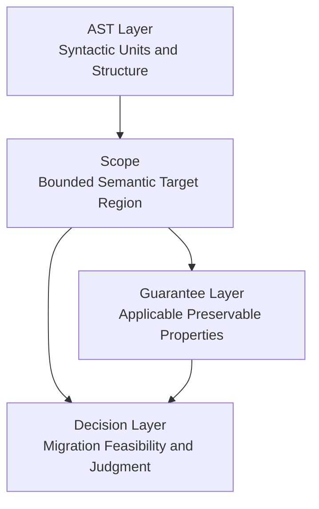

## 11. Provisional Conclusion
本稿は、`Scope` を第一級の形式概念として確立した。すなわち、`Scope` とは、境界条件とモデル横断的解釈可能性を備えた有界な意味的対象領域である。この定義に基づき、`Scope` は `Boundary`、`Unit`、`Region`、`Context` から区別され、AST 構造・Guarantee 適用・Decision 判断を接続する層として位置づけられる。

この結果、Phase 6 の後続文書は、基礎定義を再構築することなく、分類、境界形式化、Guarantee Unit / Migration Unit との差異、閉包、検証十分性、影響伝播、モデル横断写像を順次精緻化できる。そうした意味で、本稿は `60_scope/` ディレクトリ全体が依拠する最小基盤を固定する文書である。

---
This directory contains scope definition documents.
- MigrationScopeDefinition.md
- BoundaryDesign.md
- ResponsibilityDecomposition.md
- StateTransitionRelation.md

# 70_cases

This directory contains case studies and failure patterns.
- CaseStudyIndex.md
- VirtualProjectCases.md
- FailurePatterns.md
- ComparisonNotes.md

# 70_planning

# 00. 意味論的保証定義 (Semantic Guarantee Definition)

**Phase 3.5: Migration Planning Theory**  
**Document ID:** `docs/70_planning/00_Semantic_Guarantee_Definition.md`  
**Date:** 2026-03-05

---

## 1. はじめに

Phase 3 では、保存特性 $\mathbb{P}$ から構築された保証空間 $\mathcal{G}$ を用いて **移行判断モデル** を確立した。Phase 3.5 はこれを **移行計画理論** へと拡張するが、これにはより精密な基盤が必要となる。すなわち、保証は抽象的な特性ではなく、**意味論的不変条件（Semantic Invariants）** として定義されなければならない。

本文書は、プログラム構造を移行軌跡に接続する **意味論的保証モデル** を形式化する。

---

## 2. 意味論的不変条件の定義

### 2.1 形式的定義

**保証** $p$ は、**システム移行中に保存される意味論的不変条件** である。

$$
p \in I \iff p \text{ is a predicate on program behavior that must hold before and after migration}
$$

$I$ を、移行分析に関連するすべての意味論的不変条件の有限集合とする。

$$
I = \{ p \mid p \text{ is a semantic invariant} \}
$$

### 2.2 不変条件 vs. 特性

Phase 3 の保証空間では $\mathbb{P}$（保存特性）を使用した。その関係は以下の通りである：

$$
\mathbb{P} \subseteq I \quad \text{or} \quad I \text{ refines } \mathbb{P}
$$

各不変条件 $p \in I$ は、**検証可能な振る舞いの制約**（例：「変数 X はこのスコープ内で変更されない」）に対応するのに対し、$\mathbb{P}$ はより粗いカテゴリ（例：$P_{flow}$, $P_{data}$）を含む場合がある。

### 2.3 保証空間 (再訪)

$$
\mathcal{G} = \mathcal{P}(I)
$$

保証空間は不変条件のべき集合である。状態 $S \subseteq I$ は、システムによって現在満たされている不変条件の集合を表す。

---

## 3. 保証の分類

不変条件を4つのカテゴリに分類する。それぞれが異なる構造的指標と移行への関連性を持つ。

### 3.1 制御フロー不変条件 ($I_{flow}$)

| 側面 | 説明 |
| :--- | :--- |
| **形式** | 実行パスに関する述語：「パス P は到達可能である」、「ループ L は停止する」、「分岐 B は決定的である」。 |
| **構造** | CFG の可約性、既約ループの不在、有界なネスト深度。 |
| **抽出** | CFG 解析：GOTO, ALTER, PERFORM THRU の検出、サイクロマティック複雑度の計算。 |
| **移行** | 関連性高。非構造化制御フローは自動変換を妨げる。 |

**例:**
- $p_{seq}$: 「文は順序通りに実行される。」
- $p_{loop}$: 「ループは単一の入口と出口を持つ。」
- $p_{no\_goto}$: 「GOTO は手続き境界を越えない。」

### 3.2 データ整合性不変条件 ($I_{data}$)

| 側面 | 説明 |
| :--- | :--- |
| **形式** | データに関する述語：「変数 V はスコープ S 内で読み取り専用である」、「X と Y の間にエイリアシングがない」。 |
| **構造** | DFG：定義-使用チェーン、共有変数、COPYBOOK 使用。 |
| **抽出** | DFG 解析：グローバル状態、結合度、データ依存関係の特定。 |
| **移行** | データ分離に不可欠。共有状態はモジュール化を妨げる。 |

**例:**
- $p_{scope}$: 「変数はモジュールに対してローカルである。」
- $p_{immutable}$: 「入力パラメータは変更されない。」
- $p_{no\_alias}$: 「クリティカルパスにおいて重複するストレージ（REDEFINES）がない。」

### 3.3 状態遷移不変条件 ($I_{state}$)

| 側面 | 説明 |
| :--- | :--- |
| **形式** | 状態機械に関する述語：「状態 S はイベント E の後にのみ到達可能である」、「無効な状態遷移がない」。 |
| **構造** | 状態変数、ファイルステータス、トランザクション境界。 |
| **抽出** | CFG を通じた状態変数の追跡、COMMIT/ROLLBACK ポイントの特定。 |
| **移行** | トランザクションシステムに関連。 |

**例:**
- $p_{tx}$: 「トランザクションは原子的である。」
- $p_{file}$: 「ファイルは読み取り前に開かれる。」
- $p_{order}$: 「状態遷移は有効な順序に従う。」

### 3.4 インターフェース / I/O 不変条件 ($I_{io}$)

| 側面 | 説明 |
| :--- | :--- |
| **形式** | インターフェースに関する述語：「入力フォーマット F が尊重される」、「入力 I に対して出力 O が生成される」。 |
| **構造** | CALL インターフェース、COPYBOOK レイアウト、ファイルレコード構造。 |
| **抽出** | PROCEDURE DIVISION USING の解析、LINKAGE SECTION の分析、I/O 操作の追跡。 |
| **移行** | 契約境界を定義する。段階的移行に不可欠。 |

**例:**
- $p_{call}$: 「CALL パラメータは呼び出し先のシグネチャと一致する。」
- $p_{copybook}$: 「COPYBOOK レイアウトは安定的である。」
- $p_{io}$: 「I/O 操作は与えられた入力に対して決定的である。」

---

## 4. 構造的抽出モデル

### 4.1 マッピング関数 $\Phi$

抽出関数を定義する：

$$
\Phi: (AST, CFG, DFG) \to \mathcal{P}(I)
$$

$$
S = \Phi(CodeStructure)
$$

ここで $S \subseteq I$ は、現在のコードによって満たされる不変条件の集合である。

### 4.2 抽出ルール (パターンベース)

| 不変条件タイプ | 構造パターン | 検出方法 |
| :--- | :--- | :--- |
| $p_{no\_goto}$ | CFG 内に GOTO/ALTER がない | CFG：GOTO エッジをカウント |
| $p_{reducible}$ | CFG が可約である | CFG：可約性テストを適用 |
| $p_{scope}$ | 変数が LOCAL-STORAGE にのみ存在する | DFG：スコープ分析 |
| $p_{immutable}$ | パラメータが LINKAGE にあり、MOVE されない | DFG：パラメータの定義-使用分析 |
| $p_{call}$ | CALL が COPYBOOK と一致する | AST：CALL 引数と PROCEDURE USING を比較 |
| $p_{tx}$ | COMMIT/ROLLBACK が操作を括弧で囲む | CFG：制御フローを追跡 |

### 4.3 部分的抽出

抽出は **部分的** である可能性がある：一部の不変条件は静的解析からは決定不能である。以下のように表記する：

$$
S = \Phi(C) \cup S_{unknown}
$$

ここで $S_{unknown}$ は、実行時検証または手動アノテーションを必要とする不変条件を表す。

---

## 5. 保証依存関係モデル

### 5.1 依存関係 $D$

$$
D \subseteq I \times I
$$

$(p, q) \in D$ は、**$q$ は $p$ に依存する**（すなわち、$p$ が成立しない限り $q$ は成立し得ない）ことを意味する。

### 5.2 依存関係閉集合

集合 $S \subseteq I$ は、以下の場合に **依存関係で閉じている**（イデアルである）：

$$
\forall q \in S, \forall p \in I: (p, q) \in D \implies p \in S
$$

### 5.3 有効保証空間 $\mathcal{G}_{dep}$

$$
\mathcal{G}_{dep} = \{ S \subseteq I \mid S \text{ is dependency-closed} \}
$$

$\mathcal{G}_{dep}$ は $\mathcal{G} = \mathcal{P}(I)$ の **分配部分束** である。これは Phase 3 の定義と整合する。

### 5.4 依存関係の例

- $p_{no\_goto}$ は $p_{reducible}$ に依存する（可約性は構造化フローを含意する）。
- $p_{tx}$ は $p_{file}$ に依存する（トランザクションはファイル操作を含意する）。
- $p_{call}$ は $p_{copybook}$ に依存する（インターフェースはデータレイアウトに依存する）。

---

## 6. 保証重み付けモデル

### 6.1 重み関数

$$
w: I \to \mathbb{R}^+
$$

重みは以下を表す：
- **ビジネス重要度**: コアビジネスロジックほど高い。
- **検証困難度**: テストが難しい不変条件ほど高い。
- **移行影響度**: 変換をブロックする不変条件ほど高い。

### 6.2 複合重み

状態 $S \subseteq I$ に対して：

$$
\mu(S) = \sum_{p \in S} w(p)
$$

これは Phase 2 の **保証尺度（Guarantee Measure）** である。

### 6.3 計画への影響

| 概念 | $w$ の役割 |
| :--- | :--- |
| **移行負債** | $D_{debt}(S) = \sum_{p \in G_{crit} \setminus S} w(p)$ |
| **リスク増幅** | 欠落している $p$ の $w(p)$ が高いと $R_{struct}$ が増加する |
| **移行コスト** | $Cost(S \to S')$ は新しく獲得された不変条件の $w$ に比例する |

---

## 7. 移行計画への含意

1. **軌跡の定義**: 移行パス $S_0 \to S_1 \to \dots \to S_n$ は、依存関係で閉じた不変条件集合のシーケンスである。各ステップは不変条件を追加する（または維持する）。

2. **安全領域**: $S_{target} \in \mathcal{S}$ であるための必要十分条件は $G_{crit} \subseteq S_{target}$ である。ここで $G_{crit} \subseteq I$ はクリティカルな不変条件集合である。

3. **初期化としての抽出**: $\Phi(AST, CFG, DFG)$ は、計画の開始状態 $S_0$ を提供する。

4. **P3.5-1 の基礎**: 保証状態グラフ $G_{state} = (V, E)$ は、$V = \mathcal{G}_{dep}$ とし、$E$ を状態間の有効な変換として使用する。

本文書は、Phase 3.5 移行計画理論の意味論的基礎を確立する。

---
# 01. 保証状態グラフ (Guarantee State Graph)

**Phase 3.5: Migration Planning Theory**  
**Document ID:** `docs/70_planning/01_Guarantee_State_Graph.md`  
**Date:** 2026-03-05

---

## 1. はじめに

Phase 3.5-0 では、**意味論的保証** を不変条件 $I$ および有効保証空間 $\mathcal{G}_{dep}$ として定義した。本文書では、移行を **状態遷移システム** として表現する **保証状態グラフ** $G_{state}$ を構築する。これにより、移行計画は **グラフ探索問題** となる。

---

## 2. 形式的グラフ定義

### 2.1 定義

$$
G_{state} = (V, E)
$$

ここで：
- **$V$**: 保証状態の集合（ノード）。
- **$E$**: 有効な移行変換の集合（エッジ）。

### 2.2 Phase 2 との関係

$G_{state}$ は、Phase 2 の **保証遷移グラフ** $G_{trans}$ を、特性 $\mathbb{P}$ の代わりに意味論的不変条件 $I$ でインスタンス化したものである。構造は同一であるが、解釈は計画のために洗練されている。

---

## 3. ノード表現

### 3.1 保証集合としてのノード

各ノード $S \in V$ は **保証構成** を表す：

$$
S \subseteq I
$$

ここで $I$ は意味論的不変条件の集合である（Phase 3.5-0）。

### 3.2 依存関係閉包ルール

すべてのノードは **依存関係で閉じて** いなければならない（$(I, D)$ のイデアル）：

$$
S \in V \iff S \in \mathcal{G}_{dep}
$$

$$
\mathcal{G}_{dep} = \{ S \subseteq I \mid \forall q \in S, \forall p \in I: (p,q) \in D \implies p \in S \}
$$

### 3.3 状態の例

| 状態 | 不変条件 | 解釈 |
| :--- | :--- | :--- |
| $S_0$ | $\{p_{scope}\}$ | データはモジュールに対してローカル。 |
| $S_1$ | $\{p_{scope}, p_{no\_goto}\}$ | + 構造化された制御フロー。 |
| $S_2$ | $\{p_{scope}, p_{no\_goto}, p_{call}\}$ | + 有効な CALL インターフェース。 |
| $S_{target}$ | $G_{crit} \subseteq S_{target}$ | 安全な状態（$\mathcal{S}$ 内）。 |

---

## 4. エッジ / 変換定義

### 4.1 被覆関係 (Cover Relation)

$S$ から $S'$ へのエッジが存在するための必要十分条件は、$S'$ が $S$ に **単一の** 不変条件 $p$ を追加して得られ、かつその結果が依存関係で閉じていることである：

$$
(S, S') \in E \iff S \lessdot S'
$$

$$
S \lessdot S' \iff S' = S \cup \{p\} \land p \notin S \land S' \in \mathcal{G}_{dep}
$$

### 4.2 原子的変換

各エッジは **原子的な移行ステップ** に対応する：1つの不変条件が獲得される（例：リファクタリング、再構築、またはカプセル化による）。

### 4.3 変換の例

| 変換 | 構造的変更 | 追加される不変条件 |
| :--- | :--- | :--- |
| 制御フロー再構築 | GOTO の解決 | $p_{no\_goto}$, $p_{reducible}$ |
| モジュール分解 | 手続きの分割 | $p_{scope}$, $p_{modular}$ |
| データカプセル化 | LINKAGE の導入 | $p_{immutable}$, $p_{call}$ |
| インターフェース抽出 | COPYBOOK 契約の定義 | $p_{copybook}$, $p_{io}$ |

### 4.4 エッジ制約

1. **依存関係の妥当性**: $S' = S \cup \{p\}$ は $\mathcal{G}_{dep}$ に含まれなければならない。
2. **不変条件違反なし**: 変換はいかなる $q \in S$ も削除してはならない（エッジは不変条件を追加するのみ）。

---

## 5. グラフの特性

### 5.1 DAG (有向非巡回グラフ)

$G_{state}$ は **DAG** である。

*証明*: すべてのエッジ $(S, S')$ について、$S \subset S'$ （真部分集合）である。したがって $|S'| > |S|$ となる。より小さな集合に戻るサイクルは存在し得ない。 $\square$

### 5.2 安全領域の到達可能性

安全領域 $\mathcal{S} = \{ S \in \mathcal{G}_{dep} \mid G_{crit} \subseteq S \}$ は **フィルター**（上方閉集合）である。もし $S \in \mathcal{S}$ かつ $S \subseteq T$ ならば、$T \in \mathcal{S}$ である。

**到達可能性条件**: $S_{target} \in \mathcal{S}$ が $S_{start}$ から到達可能であるための必要十分条件は、$G_{state}$ 内にパス $S_{start} \to \dots \to S_{target}$ が存在することである。

### 5.3 サイクルなし

DAG 特性により、変換空間には **サイクルがない**。移行は本質的に単調である（不変条件は追加されるのみ）。

### 5.4 行き止まり状態 (Dead-End States)

状態 $S$ は以下の場合に **行き止まり** である：
- $S \notin \mathcal{S}$ （不安全）、かつ
- 出ていくエッジが存在しない：$S \cup \{p\} \in \mathcal{G}_{dep}$ となる $p$ が存在しない。

これは、依存関係構造がさらなる進捗を妨げる場合に発生する（例：Phase 3 Task 3 のブロッキング構造）。

### 5.5 最小変換パス

$S_{start}$ から $S_{target} \in \mathcal{S}$ へのパスは、その長さが $|S_{target} \setminus S_{start}|$ である場合、（ステップ数において）**最小** である。各ステップは正確に1つの不変条件を追加する。依存関係順序が線形拡張を許容する場合、最小パスが存在する。

---

## 6. 移行軌跡の解釈

### 6.1 軌跡の定義

**移行軌跡** は $G_{state}$ 内のパスである：

$$
S_{start} \to S_1 \to S_2 \to \dots \to S_{target}
$$

ここで $S_{target} \in \mathcal{S}$ である。

### 6.2 計画の目的

**移行計画** は以下の軌跡を求める：
1. $\mathcal{S}$ に到達する（実現可能性）。
2. 総コストを最小化する（最適性、P3.5-4）。

### 6.3 線形拡張としての軌跡

各軌跡は、半順序集合 $(I \setminus S_{start}, \leq_D)$ の **線形拡張** に対応する：依存関係を尊重した、獲得すべき不変条件の順序付けである。

---

## 7. プログラム構造との接続

### 7.1 コードからの初期状態

Phase 3.5-0 のマッピング $\Phi$ が初期状態を抽出する：

$$
S_{start} = \Phi(AST, CFG, DFG)
$$

各コードベースは一意のノード $S_{start} \in V$ にマッピングされる。

### 7.2 コード ↔ 状態の対応

| コード変更 | グラフ解釈 |
| :--- | :--- |
| 段落のリファクタリング | $S \to S'$ ここで $S' = S \cup \{p_{no\_goto}\}$ |
| モジュール抽出 | $S \to S'$ ここで $S' = S \cup \{p_{scope}\}$ |
| インターフェース追加 | $S \to S'$ ここで $S' = S \cup \{p_{call}\}$ |

### 7.3 構造的実現可能性

もし $S_{start}$ が行き止まり状態にある場合、ブロッキング構造を壊さない限り（例：完全な書き直し）、いかなるコード変換も $\mathcal{S}$ に到達できない。これは Phase 3 の **構造的実現不可能** 分類と一致する。

---

## 8. 結論

保証状態グラフ $G_{state}$ は：
1. 移行を、依存関係で閉じた不変条件集合のグラフとして表現する。
2. 被覆関係をエッジとして使用する（原子的不変条件獲得）。
3. 到達可能性、行き止まり、最小パスを持つ DAG である。
4. $\Phi$ を通じてコード構造をノードに接続する。

このモデルは以下の基礎となる：
- **P3.5-2**: 変換モデル（エッジの意味論の形式化）。
- **P3.5-3**: 移行コストモデル（エッジの重み付け）。
- **P3.5-4**: 最適移行パス（$G_{state}$ における最短パス）。

---
# 02. 変換モデル (Transformation Model)

**Phase 3.5: Migration Planning Theory**  
**Document ID:** `docs/70_planning/02_Transformation_Model.md`  
**Date:** 2026-03-05

---

## 1. はじめに

保証状態グラフ (P3.5-1) はエッジを状態遷移 $S \to S'$ として定義した。本文書は、具体的なプログラム修正をそれらの遷移にマッピングする **変換モデル** を形式化する。各変換は、1つ以上の意味論的不変条件を獲得するコードへの構造的変更である。

---

## 2. 形式的定義

### 2.1 変換

**変換** $T$ は以下のマッピングである：

$$
T: S \mapsto S'
$$

ここで：
- $S \subseteq I$: 初期保証集合（事前条件）。
- $S' \subseteq I$: 結果の保証集合（事後条件）。

### 2.2 原子的 vs. 複合的

- **原子的変換**: 単一の $p \in I \setminus S$ に対して $S' = S \cup \{p\}$。$G_{state}$ の1つのエッジに対応する。
- **複合的変換**: 原子的変換のシーケンス。$G_{state}$ のパスに対応する。

---

## 3. 変換の分類

### 3.1 制御フロー再構築

| 側面 | 説明 |
| :--- | :--- |
| **構造的変更** | GOTO を構造化構成要素（IF/ELSE, PERFORM/UNTIL）に置換する。可約性アルゴリズム（例：ノード分割）を適用する。 |
| **影響を受ける保証** | $p_{no\_goto}$, $p_{reducible}$, $p_{loop}$ を追加。 |
| **リスク** | 再構築が不正確な場合のロジックエラー。パフォーマンス変化の可能性。 |

### 3.2 モジュール分解

| 側面 | 説明 |
| :--- | :--- |
| **構造的変更** | 大きな段落/手続きをより小さな単位に分割する。凝集度の高いロジックを別プログラムに抽出する。 |
| **影響を受ける保証** | $p_{scope}$, $p_{modular}$, $p_{call}$ を追加。 |
| **リスク** | インターフェースの不一致。CALL オーバーヘッドの増加。共有状態が分解を妨げる可能性。 |

### 3.3 データカプセル化

| 側面 | 説明 |
| :--- | :--- |
| **構造的変更** | グローバルな WORKING-STORAGE を LOCAL-STORAGE または LINKAGE に移動する。共有 COPYBOOK の代わりにパラメータ渡しを導入する。 |
| **影響を受ける保証** | $p_{scope}$, $p_{immutable}$, $p_{no\_alias}$ を追加。 |
| **リスク** | データフローエラー。パラメータコピーによるパフォーマンスへの影響。 |

### 3.4 インターフェース抽出

| 側面 | 説明 |
| :--- | :--- |
| **構造的変更** | 明示的な CALL インターフェース（PROCEDURE USING）を定義する。COPYBOOK レイアウトを標準化する。I/O 契約を文書化する。 |
| **影響を受ける保証** | $p_{call}$, $p_{copybook}$, $p_{io}$ を追加。 |
| **リスク** | 呼び出し元が更新されない場合の契約違反。バージョニングの問題。 |

### 3.5 状態分離

| 側面 | 説明 |
| :--- | :--- |
| **構造的変更** | ファイル状態、トランザクション状態、またはセッション状態を専用モジュールに分離する。グローバルな可変状態を削減する。 |
| **影響を受ける保証** | $p_{tx}$, $p_{file}$, $p_{order}$ を追加。 |
| **リスク** | トランザクション境界の保存が困難な場合がある。並行性の問題。 |

---

## 4. 妥当性制約

### 4.1 依存関係ルール

変換 $T: S \mapsto S'$ は、以下の場合に **依存関係的に妥当** である：

$$
S' \in \mathcal{G}_{dep}
$$

すなわち、$S'$ は依存関係で閉じている。$q$ を獲得するには、$(p,q) \in D$ であるすべての $p$ が既に $S$ に存在する必要がある。

### 4.2 不変条件違反なし

$$
S \subseteq S'
$$

有効な変換は不変条件を **決して削除しない**。移行は単調である。

### 4.3 到達可能性の保存

もし $S \notin \mathcal{S}$ ならば、$T$ は行き止まりを作成してはならない。形式的には、$G_{state}$ において $S'$ から $\mathcal{S}$ へのパスが存在しなければならない。（これは、単一の不変条件を追加する原子的変換の場合、$S'$ が極大かつ依然として不安全でない限り、自動的に満たされる。）

---

## 5. コードからのマッピング

### 5.1 チェーン

$$
\text{Code change} \to \text{AST/CFG/DFG modification} \to \text{Guarantee update}
$$

### 5.2 例: 制御フロー再構築

1. **コード変更**: `GOTO PARA-X` を `PERFORM PARA-X UNTIL exit-flag` に置換。
2. **CFG 修正**: バックエッジを削除し、ループ構造を追加。
3. **保証更新**: $\Phi(CFG_{new})$ が $p_{no\_goto}$, $p_{reducible}$ を含むようになる。

### 5.3 例: モジュール分解

1. **コード変更**: 段落 100–200 を新しいプログラム `SUBPROG` に抽出。
2. **AST/DFG 修正**: 新しいプログラムノード、パラメータのための LINKAGE SECTION。
3. **保証更新**: $\Phi(Structure_{new})$ が $p_{scope}$, $p_{call}$ を含む。

---

## 6. 構造的解釈

| 変換 | AST | CFG | DFG |
| :--- | :--- | :--- | :--- |
| 制御フロー再構築 | 小 (ノード置換) | 大 (トポロジー変更) | 小 |
| モジュール分解 | 新規プログラムノード | 新規入口/出口 | 新規定義-使用境界 |
| データカプセル化 | DATA DIVISION 変更 | 小 | 大 (スコープ変更) |
| インターフェース抽出 | PROCEDURE USING 変更 | 小 | パラメータフロー |
| 状態分離 | 新規モジュール | 新規制御パス | 状態変数スコープ |

---

## 7. 結論

変換モデルは：
1. コード修正を状態遷移 $S \to S'$ にマッピングする。
2. 変換をタイプ別に分類する（制御、モジュール、データ、インターフェース、状態）。
3. 妥当性を強制する（依存関係、単調性、到達可能性）。
4. 構造解析（AST, CFG, DFG）に接続する。

このモデルは、移行コストモデル (P3.5-3) において変換を重み付けするための意味論的基礎を提供する。

---
# 03. 移行コストモデル (Migration Cost Model)

**Phase 3.5: Migration Planning Theory**  
**Document ID:** `docs/70_planning/03_Migration_Cost_Model.md`  
**Date:** 2026-03-05

---

## 1. はじめに

保証状態グラフ (P3.5-1) と変換モデル (P3.5-2) は、*どのような* 遷移が可能かを定義した。本文書は、各遷移 $S \to S'$ のコストを定量化する **移行コストモデル** を定義する。移行計画は **重み付き最短経路問題** となる。

---

## 2. コスト関数の定義

### 2.1 遷移ごとのコスト

$$
Cost(S \to S') = E_{base}(S \to S') \times R_{factor}(S \to S')
$$

ここで：
- **$E_{base}$**: 基本エンジニアリング工数（人日、ストーリーポイント、または抽象単位）。
- **$R_{factor}$**: リスク増幅係数（$\ge 1$）、構造的複雑性を反映する。

### 2.2 基本工数

原子的遷移 $S' = S \cup \{p\}$ に対して：

$$
E_{base}(S \to S') = w(p)
$$

Phase 3.5-0 からの保証重み $w(p)$ は、不変条件 $p$ を獲得するための本質的な労力（検証困難度、ビジネス重要度）を表す。

### 2.3 リスク係数

$$
R_{factor}(S \to S') = 1 + C(T)
$$

ここで $C(T)$ は、変換されるコードの **構造的複雑性** である（Phase 3, 構造的リスクモデル）：

$$
C(T) = \alpha \cdot C_{cfg} + \beta \cdot C_{dfg} + \gamma \cdot C_{dep}
$$

---

## 3. リスク増幅モデル

### 3.1 複雑性要因

| 要因 | ソース | 解釈 |
| :--- | :--- | :--- |
| $C_{cfg}$ | CFG | サイクロマティック複雑度、GOTO 数、可約性。 |
| $C_{dfg}$ | DFG | Halstead ボリューム、データ結合度、共有変数。 |
| $C_{dep}$ | 依存関係グラフ | 深さ、ファンイン/ファンアウト。 |
| モジュールサイズ | LOC, ノード数 | モジュールが大きい → 労力が高い。 |

### 3.2 状態依存コスト

コストは *現在の* 状態 $S$ に依存する場合がある（例：クリーンなコードベースでのリファクタリングはより容易）：

$$
Cost(S \to S') = w(p) \times (1 + C(T \mid S))
$$

ここで $C(T \mid S)$ は $S$ を条件とした複雑性である。

### 3.3 失敗確率

Phase 3 より：

$$
P_{fail}(T) \approx 1 - e^{-k \cdot C(T)}
$$

期待コストは手戻りを組み込むことができる：

$$
Cost_{expected}(S \to S') = \frac{Cost(S \to S')}{1 - P_{fail}(T)}
$$

---

## 4. コスト集計

### 4.1 パスコスト

移行パス $path = (S_0, S_1, \dots, S_n)$ に対して：

$$
Cost(path) = \sum_{i=0}^{n-1} Cost(S_i \to S_{i+1})
$$

### 4.2 最小移行コスト

$$
C_{min}(S_{start}) = \min \{ Cost(path) \mid path \text{ from } S_{start} \text{ to } \mathcal{S} \}
$$

これは最適移行パス (P3.5-4) の目的関数である。

---

## 5. コスト計算例

### 5.1 シナリオ: スパゲッティコードへの $p_{no\_goto}$ の追加

- $w(p_{no\_goto}) = 5$ （中程度の検証困難度）。
- $C_{cfg} = 15$ （高い GOTO 数）、$C_{dfg} = 2$、$C_{dep} = 1$。
- $C(T) = 0.5 \times 15 + 0.3 \times 2 + 0.2 \times 1 = 8.3$。
- $R_{factor} = 1 + 8.3 = 9.3$。
- $Cost = 5 \times 9.3 = 46.5$ 単位。

### 5.2 シナリオ: モジュラーコードへの $p_{scope}$ の追加

- $w(p_{scope}) = 2$。
- $C(T) = 0.5$ （低い複雑性）。
- $R_{factor} = 1.5$。
- $Cost = 2 \times 1.5 = 3$ 単位。

### 5.3 解釈

同じ不変条件（$p_{no\_goto}$）でも、スパゲッティコードでは構造化コードよりもはるかにコストがかかる。これは **リファクタリング先行（Refactor First）** 戦略を正当化する：クリティカルな不変条件を獲得する前に $C(T)$ を削減する。

---

## 6. 計画への含意

1. **パス選択**: 最適パスはグラフの低複雑性領域を好む。
2. **順序付け**: 「簡単な」コードで不変条件を先に獲得すると、総コストが削減される。
3. **予算**: $Cost(path) \le Budget$ はリソース実現可能性条件である（Phase 3 Task 3）。
4. **感度**: 高い $C(T)$ はコスト見積もりを不安定にするため、予備費を追加する。

---

## 7. 結論

移行コストモデルは：
1. $Cost(S \to S') = E_{base} \times R_{factor}$ を定義する。
2. 構造的複雑性（$C_{cfg}$, $C_{dfg}$, $C_{dep}$）から $R_{factor}$ を導出する。
3. 計画のためにパスコストを集計する。
4. 最適移行パスアルゴリズム (P3.5-4) をサポートする。

---
# 04. 最適移行パス (Optimal Migration Path)

**Phase 3.5: Migration Planning Theory**  
**Document ID:** `docs/70_planning/04_Optimal_Migration_Path.md`  
**Date:** 2026-03-05

---

## 1. はじめに

移行コストモデル (P3.5-3) からのエッジ重みを持つ保証状態グラフ $G_{state}$ (P3.5-1) が与えられたとき、移行計画は **最短経路問題** に帰着する。本文書は、グラフの定式化、適切なアルゴリズム、および計画への含意を定義する。

---

## 2. グラフ定式化

### 2.1 重み付きグラフ

$$
G_{state}^{w} = (V, E, c)
$$

- **$V$**: 保証状態（$I$ の依存関係閉包部分集合）。
- **$E$**: 有効な遷移 $(S, S')$ ここで $S \lessdot S'$。
- **$c: E \to \mathbb{R}_{\ge 0}$**: エッジ重み $c(S, S') = Cost(S \to S')$。

### 2.2 問題インスタンス

- **ソース**: $S_{start} = \Phi(AST, CFG, DFG)$ （コードからの初期状態）。
- **ターゲット集合**: $\mathcal{S}$ （安全領域）。
- **ゴール**: 総コストを最小化するパス $S_{start} \to \dots \to S_{target}$ （$S_{target} \in \mathcal{S}$）を見つける。

### 2.3 単一ターゲット vs. 複数ターゲット

$\mathcal{S}$ はフィルターであるため、任意の $S \in \mathcal{S}$ が許容される。以下の方法がある：
- **オプション A**: すべての $S \in \mathcal{S}$ に重み 0 で接続された仮想シンクノードを追加する。
- **オプション B**: 到達した最初の $\mathcal{S}$ 内の状態をターゲットとして扱う（ダイクストラ法/A* は自然にこれを処理する）。

---

## 3. 最適化アルゴリズム

### 3.1 ダイクストラ法

**使用場面**: 一般的なケース。非負のエッジ重み。ヒューリスティックが利用できない場合。

**手順**:
1. $dist[S_{start}] = 0$, $S \neq S_{start}$ に対して $dist[S] = \infty$ で初期化。
2. $dist$ をキーとする優先度付きキュー（最小ヒープ）を使用。
3. 最小値を抽出し、出ていくエッジを緩和（relax）する。
4. 状態 $S \in \mathcal{S}$ が抽出されたときに終了する（初めて安全領域に到達）。

**計算量**: バイナリヒープで $O(|V| \log |V| + |E|)$。$|V|$ は $|I|$ に対して指数関数的になり得るため、実用には状態空間の枝刈りが必要になる場合がある。

### 3.2 A* アルゴリズム

**使用場面**: $S$ から $\mathcal{S}$ へのコストを過小評価する **ヒューリスティック** $h(S)$ がある場合。

**許容ヒューリスティック**:
$$
h(S) \le d^*(S, \mathcal{S}) \quad \forall S
$$

**ヒューリスティック例**:
$$
h(S) = \sum_{p \in G_{crit} \setminus S} w(p)
$$

これは移行負債 $D_{debt}(S)$ である。エッジコストが $p$ を獲得するために少なくとも $w(p)$ である場合（$R_{factor} \ge 1$ の場合に成立）、これは許容可能である。

**手順**: ダイクストラ法と同じだが、優先度 = $dist[S] + h(S)$ とする。

**利点**: $h$ が有益な場合、展開されるノード数が少なくなる。

### 3.3 動的計画法 (トポロジカル順序)

**使用場面**: $G_{state}$ が DAG である場合。状態をトポロジカル順序（例：$\mu(S)$ または $|S|$ 順）で処理できる。

**手順**:
1. $V$ をトポロジカルソートする。
2. 順序に従って各 $S$ について: $dist[S] = \min_{(T,S) \in E} \{ dist[T] + c(T, S) \}$。
3. 基底: $dist[S_{start}] = 0$。

**利点**: 優先度付きキューが不要。シングルパス。状態空間が小さいか構造化されている場合に適している。

### 3.4 アルゴリズム選択

| シナリオ | アルゴリズム |
| :--- | :--- |
| 状態空間が小さい、ヒューリスティックなし | ダイクストラ法 |
| 状態空間が大きい、良いヒューリスティックあり | A* |
| 明確なトポロジカル順序を持つ DAG | DP |
| $\mathcal{S}$ へのすべての最短パスが必要 | ダイクストラ法（完了まで実行） |

---

## 4. パスの解釈

### 4.1 移行計画としての最適パス

最適パス $S_0 \to S_1 \to \dots \to S_n$ ($S_n \in \mathcal{S}$) は以下を指定する：
1. **獲得する不変条件のシーケンス**: $S_{i+1} \setminus S_i = \{p_i\}$。
2. **順序**: 依存関係 $D$ を尊重する（$G_{state}$ に暗黙的に含まれる）。
3. **コスト**: 総労力とリスク露出。

### 4.2 変換シーケンス

各エッジ $(S_i, S_{i+1})$ は、変換モデル (P3.5-2) からの変換にマッピングされる：
- 制御フロー再構築（もし $p_i \in I_{flow}$ なら）。
- モジュール分解（もし $p_i \in I_{data}$ または $I_{io}$ なら）。
- など。

### 4.3 非一意性

同じコストを持つ複数のパスが存在する場合がある。タイブレーク（例：ステップ数を少なくする、またはピークリスクを低くする）を追加できる。

---

## 5. 移行計画への含意

1. **実現可能性**: もし $S_{start}$ から $\mathcal{S}$ へのパスが存在しない場合、システムは構造的に実現不可能である（Phase 3）。
2. **予算**: もし $Cost(path_{opt}) > Budget$ ならば、プロジェクトはリソース的に実現不可能である。
3. **感度**: $c$ の小さな変化（例：複雑性見積もりの修正）が最適パスを変える可能性がある。見積もりが更新されたら再実行する。
4. **段階的計画**: パスはステップごとに実行できる。各ステップの後、$S_{start}$ が更新され、計画を再計算できる。

---

## 6. 結論

最適移行パスは：
1. 移行を $G_{state}^{w}$ 上の重み付き最短経路問題として定式化する。
2. 状態空間のサイズとヒューリスティックの可用性に応じて、ダイクストラ法、A*、DP をサポートする。
3. 総コストを最小化する変換シーケンスを生成する。
4. 完全な計画生成のために、移行戦略合成 (P3.5-5) と統合される。

---
# 05. 移行戦略合成 (Migration Strategy Synthesis)

**Phase 3.5: Migration Planning Theory**  
**Document ID:** `docs/70_planning/05_Migration_Strategy_Synthesis.md`  
**Date:** 2026-03-05

---

## 1. はじめに

本文書は、Phase 3.5 の出力 (P3.5-0 から P3.5-4) を **完全な移行計画** に統合する。計画は、変換のシーケンス、推定リスクとコスト、および検証チェックポイントを指定し、Phase 3 検証フレームワークと統合する。

---

## 2. 計画フレームワーク

### 2.1 入力

| 入力 | ソース | 役割 |
| :--- | :--- | :--- |
| 保証状態グラフ | P3.5-1 | 可能な状態と遷移を定義する。 |
| 変換モデル | P3.5-2 | エッジを具体的なコード変更にマッピングする。 |
| 移行コストモデル | P3.5-3 | エッジの重みを提供する。 |
| 最適パス | P3.5-4 | 最小コスト軌跡を産出する。 |

### 2.2 計画構造

**移行計画** $\mathcal{P}$ は4つのコンポーネントを持つ：

1.  **初期システム分析**
2.  **変換シーケンス**
3.  **中間状態**
4.  **検証ゲート**

---

## 3. 計画コンポーネント

### 3.1 初期システム分析

- **構造抽出**: レガシーコードベースから $(AST, CFG, DFG)$ を抽出。
- **初期状態計算**: $S_0 = \Phi(AST, CFG, DFG)$。
- **実現可能性評価**: $S_0 \in \mathcal{G}_{dep}$ および $\mathcal{R}(S_0) \cap \mathcal{S} \neq \emptyset$ をチェック（Phase 3）。
- **メトリクス計算**: $D_{debt}(S_0)$, $R_{struct}(S_0)$, $C_{min}(S_0)$。

**出力**: $S_0$、リスク/コストサマリ、Go/No-Go 判断を含む分析レポート。

### 3.2 変換シーケンス

最適パスアルゴリズム (P3.5-4) から以下を得る：

$$
path = (S_0, S_1, \dots, S_n)
$$

ここで $S_n \in \mathcal{S}$。

各ステップ $i = 0, \dots, n-1$ について：
- **獲得される不変条件**: $p_i = S_{i+1} \setminus S_i$ （原子的ステップの場合は単集合）。
- **変換タイプ**: P3.5-2 の分類より（制御フロー、モジュール、データ、インターフェース、状態）。
- **具体的アクション**: リファクタリングまたは変換タスク（例：「GOTO を削除するために PARA-X を再構築する」）。

**出力**: 順序付けられた変換リスト $T_1, T_2, \dots, T_n$。

### 3.3 中間状態

各変換 $T_i$ の後、システムは状態 $S_i$ にある。

| ステップ | 状態 $S_i$ | 追加される不変条件 | 累積コスト |
| :--- | :--- | :--- | :--- |
| 0 | $S_0$ | — | 0 |
| 1 | $S_1$ | $\{p_1\}$ | $Cost(S_0 \to S_1)$ |
| … | … | … | … |
| n | $S_n \in \mathcal{S}$ | $\{p_n\}$ | $Cost(path)$ |

**出力**: コスト積み上げを含む状態軌跡テーブル。

### 3.4 検証ゲート

各ステップ $S_i \to S_{i+1}$ において、検証フレームワーク（Phase 3 Task 6）を適用する：

1.  **事前条件**: $S_i$ が期待される状態と一致することを確認（または $\Delta < Threshold$）。
2.  **実行**: 変換 $T_i$ を適用。
3.  **事後条件**: $S_{i+1} = \Phi(AST', CFG', DFG')$ および $S_{i+1} \in \mathcal{G}_{dep}$ を確認。
4.  **回帰**: $G_{crit}$（および既存の不変条件）が保存されていることを確認するためにテストを実行。

いずれかのゲートが失敗した場合、**停止** し、修正プロトコル（再計画または逸脱修正）をトリガーする。

**出力**: ステップごとの検証チェックリスト。

---

## 4. 計画出力スキーマ

### 4.1 移行計画ドキュメント

```
Migration Plan: [System Name]
Date: [Date]
Initial State: S_0 = { ... }
Target State: S_n ∈ S (Safety Region)

--- Transformation Sequence ---
Step 1: [Transformation Type] — Acquire p_1
  Action: [Concrete task]
  Estimated Cost: [Value]
  Verification: [Checklist]

Step 2: ...
...

--- Summary ---
Total Steps: n
Total Estimated Cost: Cost(path)
Total Estimated Risk: [Aggregate]
Verification Gates: n
```

### 4.2 リスクとコストのサマリ

- **推定コスト**: $Cost(path) = \sum_{i=0}^{n-1} Cost(S_i \to S_{i+1})$。
- **推定リスク**: パスに沿ったピーク $R_{struct}(S_i)$、または集計 $P_{fail}$。
- **予備費**: 予算として $(1 + \epsilon) \times Cost(path)$ を推奨（例：$\epsilon = 0.2$）。

---

## 5. 移行計画の例

### 5.1 シナリオ: スパゲッティコード → 直接移行

**初期分析**:
- $S_0 = \{p_{scope}\}$ （データはローカル、制御フローは非構造化）。
- $G_{crit} = \{p_{scope}, p_{no\_goto}, p_{call}\}$。
- $D_{debt}(S_0) = w(p_{no\_goto}) + w(p_{call}) = 7$。

**変換シーケンス**:

| ステップ | 変換 | 不変条件 | アクション | コスト |
| :--- | :--- | :--- | :--- | :--- |
| 1 | 制御フロー再構築 | $p_{no\_goto}$ | PARA-A, PARA-B の GOTO を解決 | 46 |
| 2 | インターフェース抽出 | $p_{call}$ | サブプログラムの CALL インターフェースを定義 | 8 |
| — | **合計** | — | — | **54** |

**検証ゲート**:
- Step 1 後: CFG 解析を実行；$p_{no\_goto} \in \Phi(CFG)$ を確認。
- Step 2 後: インターフェーステストを実行；$p_{call} \in \Phi(Structure)$ を確認。
- 最終: $S_2 \in \mathcal{S}$、回帰テスト合格。

---

## 6. 検証フレームワークとの統合

移行計画は Phase 3 検証フレームワークに直接入力される：

1.  **トレーサビリティ**: 各ステップは $(L, M, E, C)$ — ルール、メトリクス、構造要素、コード成果物 — にリンクする。
2.  **継続的検証**: $\Delta(t) = d_w(S_{plan}(t), S_{actual}(t))$ が各ゲートで監視される。
3.  **移行後検証**: $Verify(S_{final}) \iff G_{crit} \subseteq S_{final}$。
4.  **フィードバック**: 推定よりも高い $P_{fail}$ が観測された場合、コストモデルパラメータを更新する（ベイズ改善）。

---

## 7. 結論

移行戦略合成は：
1. 保証状態グラフ、変換モデル、コストモデル、最適パスを単一の計画に結合する。
2. コスト、リスク、検証ゲートを含む変換シーケンスを生成する。
3. 正当性保証のために検証フレームワークと統合する。
4. 実行可能な移行プロジェクトのためのテンプレートを提供する。

Phase 3.5 はこうして **移行計画フレームワーク** を完了する：「移行できるか？」（Phase 3）から「どうすれば最適に移行できるか？」（Phase 3.5）へ。

---
# 10. 不変条件意味論モデル (Invariant Semantics Model)

**Phase 3.5: Migration Planning Theory (Strengthening)**  
**Document ID:** `docs/70_planning/10_Invariant_Semantics_Model.md`  
**Date:** 2026-03-05

---

## 1. はじめに

本文書は、**プログラム意味論** と **意味論的不変条件** の間の形式的な関係を定義する。これは不変条件の概念（Phase 3.5-0）を観測可能な振る舞いに基づかせ、構造的表現（AST, CFG, DFG）がどのように意味論を近似するかを説明する。

---

## 2. プログラム意味論表現

### 2.1 定義

$C$ をプログラム（コード成果物）とする。**プログラム意味論** をその観測可能な振る舞いの形式的表現として定義する：

$$
Semantics(C) = \langle \mathcal{B}, \mathcal{T}, \mathcal{O} \rangle
$$

ここで：
- **$\mathcal{B}$**: 可能な振る舞いの集合（実行トレース、状態シーケンス）。
- **$\mathcal{T}$**: トレースの集合（状態/イベントの有限または無限シーケンス）。
- **$\mathcal{O}$**: 観測可能なインターフェース（入力、出力、副作用）。

### 2.2 振る舞い意味論

振る舞い $b \in \mathcal{B}$ は、プログラムができることを記述する述語またはトレースである。移行のために、以下に関心がある：
- **制御フロー意味論**: どのパスが実行可能か。
- **データフロー意味論**: 値がどのように伝播するか。
- **状態遷移意味論**: 内部状態がどのように進化するか。
- **I/O 意味論**: どの入力がどの出力を生成するか。

---

## 3. 不変条件抽出

### 3.1 抽出関数

$$
I = invariants(Semantics(C))
$$

不変条件集合 $I$ は $C$ の意味論から導出される。各不変条件 $p \in I$ は $\mathcal{B}$ 上の述語である：

$$
p: \mathcal{B} \to \{true, false\}
$$

### 3.2 述語としての不変条件

不変条件 $p$ がプログラム $C$ に対して成立するための必要十分条件は：

$$
\forall b \in \mathcal{B}(C): p(b) = true
$$

すなわち、$C$ のすべての可能な振る舞いが $p$ を満たすことである。

---

## 4. 不変条件述語構造

### 4.1 述語構造

$$
p: Behavior \to \{true, false\}
$$

各不変条件 $p$ はプログラムの振る舞いに関する **述語** である。例：

| 不変条件 | 述語 | 解釈 |
| :--- | :--- | :--- |
| $p_{seq}$ | $\forall$ traces $t$: $t$ 内の文は順序付けられている | 制御フローは順次的である。 |
| $p_{no\_goto}$ | $\forall$ traces $t$: 手続き境界を越える GOTO がない | 構造化された制御フロー。 |
| $p_{scope}$ | $\forall$ traces $t$: 変数 $V$ はスコープ $S$ 内でのみアクセスされる | データ局所性。 |
| $p_{immutable}$ | $\forall$ traces $t$: 入力パラメータ $P$ は決して書き込まれない | 入力変更なし。 |

### 4.2 観測可能な振る舞い

不変条件は **観測可能**（または静的に推論可能）でなければならない。計測手段がない限り、観測不可能な内部状態に関する不変条件を定義することはできない。

---

## 5. 観測可能な振る舞いとの接続

### 5.1 制御フロー意味論

- **意味論**: 実行パスの集合（CFG 内のパス）。

- **不変条件**: $p_{reducible}$ (CFG は可約), $p_{loop}$ (ループは単一の入口/出口を持つ), $p_{no\_goto}$ (非構造化ジャンプなし)。

- **接続**: CFG 構造はパスを制約する。可約性は、パスが構造化構成要素によって記述できることを含意する。

### 5.2 データフロー意味論

- **意味論**: 定義-使用チェーン、値の伝播、エイリアシング。

- **不変条件**: $p_{scope}$, $p_{immutable}$, $p_{no\_alias}$。

- **接続**: DFG 定義-使用構造は、変数がローカルか、不変か、またはエイリアスされているかを決定する。

### 5.3 状態遷移意味論

- **意味論**: 状態機械（ファイルステータス、トランザクション状態、セッション状態）。

- **不変条件**: $p_{tx}$, $p_{file}$, $p_{order}$。

- **接続**: 状態変数と遷移は有効なシーケンスを定義する；不変条件は制約（例：原子性）を主張する。

### 5.4 I/O 意味論

- **意味論**: 入出力関係（入力 → 出力マッピング）。

- **不変条件**: $p_{call}$, $p_{copybook}$, $p_{io}$ (与えられた入力に対して決定的な I/O)。

- **接続**: インターフェース契約は境界での観測可能な振る舞いを定義する。

---

## 6. 近似としての AST / CFG / DFG

### 6.1 静的近似

分析時には完全な $Semantics(C)$ を持っていない。**構造的表現** で近似する：

- **AST**: 構文構造。プログラムが *何を* するか（文、式）を近似する。
- **CFG**: 制御フロー。*どのパス* が可能かを近似する。
- **DFG**: データフロー。*値がどう* 動くかを近似する。

### 6.2 抽出マッピング

$$
\Phi: (AST, CFG, DFG) \to \mathcal{P}(I)
$$

$\Phi$ は構造から不変条件を抽出する。抽出は **健全だが不完全** である：

**健全性 (Soundness)**:
$$
\Phi(C) \subseteq invariants(Semantics(C))
$$
（すなわち、真に成立する不変条件のみを主張する）。

**不完全性 (Incompleteness)**:
$$
\exists p \in invariants(Semantics(C)): p \notin \Phi(C)
$$
$C$ に対して成立するが、AST/CFG/DFG だけからは導出できない不変条件が存在する。

したがって、AST/CFG/DFG ベースの抽出は **健全だが不完全な意味論的近似** である。

### 6.3 近似の限界

| 構造 | 近似対象 | 限界 |
| :--- | :--- | :--- |
| AST | 構文 | 式の意味論がない。 |
| CFG | パス | 過剰近似する可能性がある（実行不可能なパス）。 |
| DFG | データフロー | 動的エイリアシングを見逃す可能性がある。 |

---

## 7. 構造解析の健全性と不完全性

静的解析（AST, CFG, DFG）はプログラム意味論を **近似** する。完全な振る舞い意味論を捉えることはできない。それには以下が必要となる：
- **実行時観察**: 一部の不変条件（例：「ループが停止する」）は実行トレースを必要とする。
- **定理証明**: 一部の不変条件（例：「出力は入力の二乗に等しい」）は形式検証を必要とする。

したがって：
- **健全性**: $\Phi$ によって抽出されたすべての不変条件は正しい。偽の不変条件を主張することはない。
- **不完全性**: 成立する不変条件を見逃す可能性がある。移行計画は保守的である：証明できることに基づいて計画し、残りは実行時検証が必要になる場合がある。

---

## 8. 結論

不変条件意味論モデルは：
1. $Semantics(C)$ を振る舞い表現として定義する。
2. $invariants(Semantics(C))$ を振る舞いに関する述語として定義する。
3. 不変条件を制御、データ、状態、I/O 意味論に接続する。
4. 不変条件抽出のための意味論の静的近似として AST/CFG/DFG を説明する。

これは Phase 3.5 計画モデルをプログラム意味論に基礎づける。構造解析の「健全だが不完全」な性質は、移行計画者が考慮しなければならない根本的な制約である。

---
# 11. 到達可能状態空間 (Reachable State Space)

**Phase 3.5: Migration Planning Theory (Strengthening)**  
**Document ID:** `docs/70_planning/11_Reachable_State_Space.md`  
**Date:** 2026-03-05

---

## 1. はじめに

保証状態グラフ $G_{state}$ は最大 $2^{|I|}$ のノードを持つ可能性があり、大規模な不変条件集合に対して **状態爆発** を引き起こす。本文書は、移行計画のためにグラフを扱いやすく保つための **到達可能状態空間** $V_{reachable}$ と **枝刈りルール** を定義する。

---

## 2. 到達可能状態

### 2.1 定義

$$
V_{reachable} \subseteq \mathcal{G}_{dep}
$$

$V_{reachable}$ は、初期状態 $S_{start}$ から有効な変換を通じて **到達可能** な保証状態の集合である。

### 2.2 遷移閉包

$$
V_{reachable} = closure(S_{start}, Transformations)
$$

ここで $closure$ は遷移関係の反射推移閉包である：

$$
closure(S, T) = \{ S' \mid \exists n \ge 0, \exists path: S \to S_1 \to \dots \to S_n = S' \}
$$

$V_{reachable}$ は、$S_{start}$ を含み、変換モデル (P3.5-2) からの変換の適用下で閉じている最小の集合である。

---

## 3. 枝刈りルール

### 3.1 依存関係枝刈り

**ルール**: もし $S \cup \{p\} \notin \mathcal{G}_{dep}$ （すなわち、$p$ の追加が依存関係閉包に違反する）ならば、$S \cup \{p\}$ を探索しない。

**効果**: 依存関係で閉じた状態のみが考慮される。これは既に $G_{state}$ によって強制されており、依存関係枝刈りはエッジ定義に暗黙的に含まれている。

### 3.2 支配枝刈り (安全ルール)

**ルール**: 支配枝刈りは、以下の3つの条件がすべて成立する場合に **のみ** 許可される：

1. $S_1 \subseteq S_2$ （真部分集合：$S_2$ は少なくとも同数の不変条件を持つ）。
2. $Cost(path_{S_1}) \ge Cost(path_{S_2})$ （$S_2$ へのパスの方が安いか等しい）。
3. $S_2$ は安全領域 $\mathcal{S}$ に到達できる（実現可能性が保存される）。

3つすべてが成立する場合、$S_1$ は $S_2$ に **支配** されている。$S_1$ をそれ以上の展開から枝刈りする。

**根拠**: $S_2$ に到達することは $S_1$ よりも厳密に優れている（より多くの不変条件、より低いか等しいコスト、そして $S_2$ は実行可能な解につながる）。最適パスが $S_1$ を通ることはない。

**注意**: 条件3は重要である。$S_2$ が $\mathcal{S}$ に到達できない場合に $S_1$ を枝刈りすると、実行可能な解を誤って排除してしまう可能性がある。

### 3.3 等価状態マージ

**ルール**: もし $S_1$ と $S_2$ が計画目的において **等価** である場合（例：同じ $G_{crit} \cap S$、$\mathcal{S}$ への距離が同じ）、それらを単一の代表状態にマージする。

**等価性の定義**:
$$
S_1 \equiv S_2 \iff (G_{crit} \setminus S_1) = (G_{crit} \setminus S_2) \land \text{same structural complexity}
$$

**効果**: 複数のパスが「等価な」構成につながる場合の状態数を削減する。

### 3.4 予算枝刈り

**ルール**: もし $Cost(path to S) > Budget$ ならば、$S$ とそのすべての子孫を枝刈りする。

**効果**: リソース実現可能性を早期に強制し、実行不可能な領域の探索を回避する。

### 3.5 実現可能性保存支配

支配枝刈りには **リスク** が伴う：$S_2$ が $S_1$ を支配しているために $S_1$ を枝刈りしたが、後で $S_2$ が行き止まり（$\mathcal{S}$ に到達できない）であることが判明した場合、実行可能なパスにつながっていたかもしれない $S_1$ を誤って破棄したことになる。

**緩和策**: 安全な支配ルールの条件3は、$S_2$ が $\mathcal{S}$ に到達できることを要求する。実際には、これには以下が必要になる場合がある：
- **到達可能性チェック**: $S_1$ を枝刈りする前に $\mathcal{R}(S_2) \cap \mathcal{S} \neq \emptyset$ を確認する。
- **保守的な枝刈り**: 到達可能性の確認が高価な場合、支配枝刈りを避けるか、$S_2 \in \mathcal{S}$ （すなわち $S_2$ が既に安全）である場合にのみ適用する。

**含意**: 実行可能な解につながる状態を枝刈りすることは重大なエラーである。安全な支配ルールはこれを防ぐように設計されている。

---

## 4. 複雑性境界

### 4.1 最悪ケース

枝刈りなし：$|V_{reachable}| \le |\mathcal{G}_{dep}| \le 2^{|I|}$。

### 4.2 枝刈りあり

- **依存関係枝刈り**: $|\mathcal{G}_{dep}|$ に削減される。構造化された依存関係グラフの場合、$2^{|I|}$ よりもはるかに小さくなり得る。
- **支配枝刈り**: 実際には探索される状態を50%以上削減できる可能性がある。
- **等価状態マージ**: 等価性の粒度に応じた係数で削減する。
- **予算枝刈り**: コスト閾値を超える状態を排除する。

### 4.3 実用的境界

典型的な COBOL 移行（$|I| \approx 20$–50、強い依存関係）の場合：
$$
|V_{reachable}| \approx O(|I|^d)
$$
ここで $d$ は依存関係の深さ。多くの場合 $d \ll |I|$。

---

## 5. 移行実現可能性との関係

### 5.1 到達可能性としての実現可能性

移行は以下の場合に **実現可能** である：
$$
V_{reachable} \cap \mathcal{S} \neq \emptyset
$$

すなわち、$S_{start}$ から少なくとも1つの安全な状態が到達可能である。

### 5.2 枝刈りと実現可能性

- 枝刈りは **実現可能性を保存** しなければならない：もし $S \in \mathcal{S}$ が到達可能なら、それは枝刈りされてはならない。
- **支配枝刈り** は安全である：支配された状態は準最適であり、実現可能性には関連しない。
- **等価状態マージ** は、等価性が「$\mathcal{S}$ に到達できる」ことを保存する場合に安全である。
- **予算枝刈り** は、実行可能だが高価なパスを隠す可能性がある。予算がハード制約である場合にのみ使用する。

### 5.3 行き止まり検出

状態 $S$ は、$S \notin \mathcal{S}$ かつ出ていくエッジが存在しない場合、**行き止まり** である。行き止まりは将来の展開から枝刈りできる（決して $\mathcal{S}$ に到達しないため）。

---

## 6. 結論

到達可能状態空間は：
1. $V_{reachable}$ を変換の下での $S_{start}$ の閉包として定義する。
2. 状態爆発を制御するための枝刈りルール（依存関係、支配、等価性、予算）を導入する。
3. 実用的な計画のための複雑性境界を提供する。
4. 移行実現可能性（Phase 3 Task 3）に接続する。

---
# 12. 不変条件タイプモデル (Hard / Soft Invariants)

**Phase 3.5: Migration Planning Theory (Strengthening)**  
**Document ID:** `docs/70_planning/12_Invariant_Types_Model.md`  
**Date:** 2026-03-05

---

## 1. はじめに

すべての不変条件が等しく重要であるわけではない。いくつかは保存され **なければならない**（Hard）。他は、移行の利益のために緩和またはトレードオフされる **可能性がある**（Soft）。本文書は、**ハード/ソフト不変条件モデル** とその移行計画への影響を定義する。

---

## 2. 不変条件カテゴリ

### 2.1 ハード不変条件 ($I_{hard}$)

**定義**: 保存され **なければならない** 不変条件。違反は移行の失敗を意味する。

$$
I_{hard} \subseteq I
$$

**例**:
- ビジネスロジックの正しさ（例：利息計算式）。
- データ整合性（例：クリティカルなレコードの損失なし）。
- 規制遵守（例：監査証跡）。

**保存ルール**: $\forall p \in I_{hard}: p \in S_{start} \implies p \in S_{target}$。

### 2.2 ソフト不変条件 ($I_{soft}$)

**定義**: 正当化される場合、移行中に変更される **可能性がある** 不変条件。緩和によりコストを削減したり、他の方法ではブロックされる変換を可能にしたりできる。

$$
I_{soft} = I \setminus I_{hard}
$$

**例**:
- パフォーマンス特性（例：応答時間が変わる可能性がある）。
- コード構造（例：モジュール性が向上する可能性がある）。
- 実装詳細（例：インターフェースが保存されればファイル形式は変わる可能性がある）。

**保存ルール**: オプション。明示的な正当化があれば緩和可能。

---

## 3. 保存ルール

### 3.1 ハード不変条件の保存

任意の移行パス $S_0 \to \dots \to S_n$ に対して：

$$
\forall p \in I_{hard} \cap S_0: p \in S_i \quad \forall i \in \{0, \dots, n\}
$$

ハード不変条件は **単調** である：一度存在すれば、決して削除されてはならない。

### 3.2 ソフト不変条件の緩和

変換 $T: S \mapsto S'$ は、以下の場合にソフト不変条件 $p \in I_{soft}$ を **緩和** してもよい：
1. $p \in S$ かつ $p \notin S'$ （不変条件がドロップされる）。
2. **正当化** が存在する（例：「等価な $p'$ に置換」または「コスト削減のための許容可能なトレードオフ」）。
3. $p$ に依存するハード不変条件がない（すなわち、$(p, q) \in D$ かつ $q \in I_{hard}$ ならば、$p$ は緩和できない）。

### 3.3 クリティカル集合との整合

$G_{crit}$ (Phase 3) は通常、$I_{hard}$ の部分集合である：
$$
G_{crit} \subseteq I_{hard}
$$

$\mathcal{S}$ に到達するには $G_{crit} \subseteq S_{target}$ が必要である。すべてのクリティカルな不変条件はハードである。

### 3.4 緩和決定モデル

**緩和関数** $\rho: I \to \{0, 1\}$ を導入する：

- $\rho(p) = 1$: 移行中に不変条件 $p$ を保存する。
- $\rho(p) = 0$: 不変条件 $p$ を緩和する（変更またはドロップを許可する）。

**制約**: ハード不変条件は常に保存されなければならない：
$$
\forall p \in I_{hard}: \rho(p) = 1
$$

**移行計画** は最適化問題となる：

**最小化**:
$$
MigrationCost + RiskPenalty(\rho)
$$

**制約条件**:
$$
\forall p \in I_{hard}: \rho(p) = 1
$$

ここで $RiskPenalty(\rho)$ は、ソフト不変条件を緩和するリスクを定量化する（例：$\sum_{p \in I_{soft}, \rho(p)=0} risk(p)$）。計画者は、移行コストとソフト不変条件緩和のリスクをトレードオフする。

---

## 4. 許可される不変条件緩和

### 4.1 緩和条件

ソフト不変条件 $p$ は以下の場合に緩和できる：
1. **置換**: $p$ が等価またはより強い不変条件 $p'$ に置換される（例：$p$ = "順次ファイルアクセス"、$p'$ = "索引付きファイルアクセス"、論理的振る舞いは同じ）。
2. **明示的受容**: ステークホルダーが $p$ の損失を受け入れる（例：「パフォーマンスが10%低下する可能性がある」）。
3. **依存関係の安全性**: $p$ に依存するハード不変条件がない。

### 4.2 緩和コスト

$p$ を緩和すると移行コストが削減される（必要な変換が減る）可能性があるが、**リスク** や **技術的負債** を招く。これを関連するリスクペナルティを伴う負のコスト（節約）としてモデル化できる。

---

## 5. 計画グラフへの影響

### 5.1 拡張状態空間

ソフト不変条件がある場合、状態空間はソフト不変条件に対してのみ **後方エッジ**（不変条件の削除）を許可する：

$$
(S, S') \in E \iff S' = S \cup \{p\} \lor (S' = S \setminus \{p\} \land p \in I_{soft})
$$

**注意**: これはサイクルを導入する可能性がある。計画はより複雑になる。支配枝刈りは緩和の可能性を考慮しなければならない。

### 5.2 簡易モデル (推奨)

**代替案**: グラフを単調に保つ（不変条件の追加のみ）。ソフト不変条件の緩和を、各ステップでの **個別の決定** としてモデル化する：「変換 $T$ に対して、$p$ の緩和を受け入れる」。状態は依然として不変条件を追加するのみであり、緩和はグラフのエッジではなくアノテーションである。

これは DAG 構造を保存し、最適パスアルゴリズムを簡素化する。

### 5.3 計画への含意

- **ハード不変条件**: 安全領域を定義する。$S \in \mathcal{S} \iff G_{crit} \subseteq S$ かつ $G_{crit} \subseteq I_{hard}$。
- **ソフト不変条件**: コスト（獲得は任意かもしれない）およびパス選択（コストが同程度なら、より多くのソフト不変条件を保存するパスが好まれるかもしれない）に影響を与える。

---

## 6. レガシー移行の例

### 6.1 COBOL バッチ → モダンバッチ

| 不変条件 | タイプ | 根拠 |
| :--- | :--- | :--- |
| 計算の正しさ | Hard | ビジネス要件。 |
| ファイルレコードフォーマット | Hard | 下流システムが依存している。 |
| 実行順序（段落シーケンス） | Soft | ロジックが保存されれば並べ替え可能。 |
| GOTO 構造 | Soft | 削除される（再構築）。 |
| 応答時間 | Soft | 新しいプラットフォームで変わる可能性がある。 |

### 6.2 COBOL → マイクロサービス

| 不変条件 | タイプ | 根拠 |
| :--- | :--- | :--- |
| ビジネスロジック | Hard | コア価値。 |
| トランザクション原子性 | Hard | データ整合性。 |
| モノリシックデプロイ | Soft | 分散型へ明示的に変更。 |
| 共有 COPYBOOK | Soft | API 契約に置換。 |

---

## 7. 結論

不変条件タイプモデルは：
1. ハード（保存必須）vs ソフト（緩和可能）不変条件を区別する。
2. 保存ルールと許可される緩和条件を定義する。
3. 計画グラフへの影響を説明する（簡易化：DAG を維持し、緩和を注釈する）。
4. レガシー移行シナリオの例を提供する。

---
# 13. 不変条件代数 (Invariant Algebra)

**Phase 3.5: Migration Planning Theory (Strengthening)**  
**Document ID:** `docs/70_planning/13_Invariant_Algebra.md`  
**Date:** 2026-03-05

---

## 1. はじめに

本文書は、不変条件の **代数的構造** を定義する：束、依存関係半順序集合、結び/交わり操作、および距離メトリクス。これらの構造は移行計画（例：状態の比較、進捗の測定）をサポートする。

---

## 2. 不変条件束 $(I, \leq)$

### 2.1 半順序

**不変条件集合** $I$ 上に半順序 $\leq$ を定義する（状態上ではない）。$p, q \in I$ に対して：

$$
p \leq q \iff q \text{ implies } p \text{ (or } p \text{ is a weakening of } q)
$$

**解釈**: $p \leq q$ は、$q$ が $p$ よりも **強い** ことを意味する。システムが $q$ を満たすなら、$p$ も満たす。

**例**: $p_{scope}$ (変数はローカル) $\leq$ $p_{modular}$ (モジュールは明確なインターフェースを持つ)。モジュール性はスコープを含意する。

### 2.2 束構造

$(I, \leq)$ は、結び $\vee$ と交わり $\wedge$ が定義されるとき、**束** を形成する：

- **結び** $p \vee q$: $p$ と $q$ の両方によって含意される最も弱い不変条件。
- **交わり** $p \wedge q$: $p$ と $q$ の両方を含意する最も強い不変条件。

移行においては、**状態束** $\mathcal{G} = \mathcal{P}(I)$ （$\subseteq$ を伴う）がより直接的に使用される；$(I, \leq)$ は各不変条件内の構造を提供する。

---

## 3. 依存関係半順序集合

### 3.1 依存関係 $D$

$$
D \subseteq I \times I
$$

$(p, q) \in D$ は、$q$ が $p$ に **依存する** ことを意味する：$p$ が成立しない限り $q$ は成立し得ない。

### 3.2 半順序集合 $(I, \leq_D)$

$D$ の反射推移閉包は半順序 $\leq_D$ を定義する：

$$
p \leq_D q \iff (p, q) \in D^* \quad \text{(transitive closure)}
$$

$(I, \leq_D)$ は **半順序集合 (poset)** である。$D$ が悪形式（サイクルを持つ）でない限り、サイクルは持たない（$D$ は非巡回であると仮定する）。

### 3.3 イデアルと $\mathcal{G}_{dep}$

$(I, \leq_D)$ の **イデアル**（下方閉集合）は、まさに依存関係閉集合である：

$$
\mathcal{G}_{dep} = Idl(I, \leq_D)
$$

---

## 4. 結びと交わり操作

### 4.1 状態（保証集合）上

状態 $S_1, S_2 \subseteq I$ に対して：

- **結び** ($\mathcal{G}$ 内): $S_1 \vee S_2 = S_1 \cup S_2$ (和集合)。両方によって含意される最も強い状態（両方のすべての不変条件を含む）。
- **交わり** ($\mathcal{G}$ 内): $S_1 \wedge S_2 = S_1 \cap S_2$ (積集合)。両方を含意する最も弱い状態。

### 4.2 $\mathcal{G}_{dep}$ 内

$S_1, S_2 \in \mathcal{G}_{dep}$ に対して：
- $S_1 \vee S_2 = Cl_D(S_1 \cup S_2)$ (和集合の依存関係閉包)。
- $S_1 \wedge S_2 = S_1 \cap S_2$ (イデアルの積集合はイデアル)。

$\mathcal{G}_{dep}$ はこれらの操作を持つ **分配束** である。

### 4.3 計画のための解釈

- **結び**: 2つの移行パス（例：異なるモジュールでの並行作業）を結合すると、獲得された不変条件の和集合（閉包付き）が得られる。
- **交わり**: 2つの状態の共通の不変条件は、2つの代替パスの「共有された進捗」を表す。

---

## 5. 不変条件距離メトリクス

### 5.1 対称差メトリクス

状態 $S_1, S_2 \subseteq I$ に対して：

$$
d(S_1, S_2) = |S_1 \triangle S_2| = |(S_1 \setminus S_2) \cup (S_2 \setminus S_1)|
$$

これは **ハミング距離**（異なる不変条件の数）である。

### 5.2 重み付き距離

$$
d_w(S_1, S_2) = \sum_{p \in S_1 \triangle S_2} w(p)
$$

これは Phase 2 の **重み付きハミングメトリクス** である。不変条件の重要性を考慮する。

### 5.3 有向距離 (移行負債)

計画のために、しばしば **安全への距離** に関心がある：

$$
d_{safety}(S) = d_w(G_{crit} \setminus S, \emptyset) = \sum_{p \in G_{crit} \setminus S} w(p)
$$

これは移行負債（Phase 3 Task 2）である。

### 5.4 メトリクス公理

$d_w$ は以下を満たす：
1. $d_w(S_1, S_2) \ge 0$
2. $d_w(S_1, S_2) = 0 \iff S_1 = S_2$
3. $d_w(S_1, S_2) = d_w(S_2, S_1)$
4. $d_w(S_1, S_3) \le d_w(S_1, S_2) + d_w(S_2, S_3)$ (三角不等式)

### 5.5 依存関係重み付き移行距離

依存関係半順序集合における不変条件の深さを考慮した **依存関係認識距離** を定義する：

$$
d_{dep}(S_1, S_2) = \sum_{p \in S_1 \triangle S_2} depth(p)
$$

ここで $depth(p)$ は依存関係半順序集合 $(I, \leq_D)$ における $p$ の **レベル** である（例：最小要素から $p$ への最長チェーンの長さ）。

**解釈**: **深い** 不変条件（高い $depth(p)$）を削除または失うことは、多くの派生不変条件がそれに依存しているため、よりコストがかかる。逆に、深い不変条件を獲得すると、他の多くの不変条件がアンロックされる可能性がある。依存関係重み付きメトリクスは、この構造的影響を反映する。

**計画での使用**: 移行状態を比較したり労力を推定したりする際、$d_{dep}$ は依存関係構造において基礎的な不変条件を強調することで、$d_w$ を補完できる。

---

## 6. 移行計画への含意

1. **状態比較**: $d_w(S_1, S_2)$ は2つの移行状態がどれだけ「離れている」かを測定する。クラスタリング、等価性（Task 11）、進捗追跡に有用。

2. **A* ヒューリスティック**: $h(S) = d_{safety}(S)$ は最短経路探索（Task 4）のための許容ヒューリスティックである。

3. **束構造**: 結び/交わりは、並行移行作業の結合や代替パスの比較をサポートする。

4. **依存関係半順序集合**: $(I, \leq_D)$ は有効な状態シーケンス（線形拡張）を決定し、トポロジカルアルゴリズムを可能にする。

---

## 7. 結論

不変条件代数は：
1. $(I, \leq)$ と $(I, \leq_D)$ を束および半順序集合として定義する。
2. 状態上の結びと交わりを定義する ($\mathcal{G}_{dep}$)。
3. 距離メトリクス ($d$, $d_w$, $d_{safety}$) を定義する。
4. 移行計画（ヒューリスティック、状態比較、パス合成）に接続する。


# 80_geometry

# 01. 保証ベクトル (Guarantee Vector)

**Phase 4: Migration Geometry**  
**Document ID:** `docs/80_geometry/01_Guarantee_Vector.md`  
**Date:** 2026-03-05

---

## 1. はじめに

Phase 4 では、保証理論を幾何学モデルへと昇華させる。最初のステップは、保証を **ベクトル** として表現することである。これは、複数の次元にわたる保存度を数値的にエンコードしたものである。

---

## 2. 形式的定義

### 2.1 保証ベクトル

プログラム変換 T に対して：

$$
G(T) = (g_1, g_2, g_3, g_4, g_5)
$$

各 $g_i \in [0, 1]$ は保存度を表す。

### 2.2 次元の意味論と構造的起源 (保証軸理論)

| 軸 | 意味 | 構造的起源 |
| :--- | :--- | :--- |
| $g_1$ (Control) | 制御フローの保存 | CFG |
| $g_2$ (Data) | データフローの保存 | DFG |
| $g_3$ (State) | 状態遷移の保存 | State Machine |
| $g_4$ (Transaction) | トランザクション境界の保存 | Transaction Model |
| $g_5$ (Interface) | 外部インターフェースの保存 | I/O Boundary |

各軸は **構造的起源** を持つ。すなわち、その保証が導出されるプログラム構造である。詳細は `09_Guarantee_Axis_Theory.md` を参照。

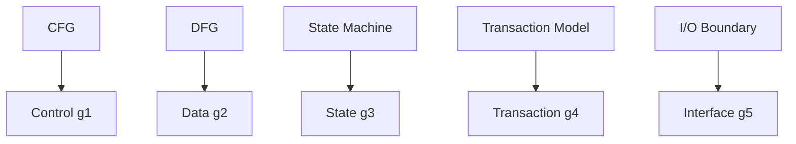

### 2.3 値域

$0 \le g_i \le 1$。解釈：1 = 完全に保存、0 = 破壊。

---

## 3. 結論

保証ベクトルは、変換の保存品質の数値的な指紋（フィンガープリント）を提供する。これは、Phase 4 における連続幾何学モデルの基礎となる。

---
# 02. 保証空間 (Guarantee Space - Geometry)

**Phase 4: Migration Geometry**  
**Document ID:** `docs/80_geometry/02_Guarantee_Space.md`  
**Date:** 2026-03-05

---

## 1. はじめに

Phase 4 における **保証空間** は、各プログラム変換が **点** として表現される連続空間である。本文書では、この空間の幾何学的構造を定義する。

---

## 2. 形式的定義

### 2.1 保証空間

$$
GS = \mathbb{R}^n
$$

ここで $n$ は保証次元の数（例：$n = 5$）。

### 2.2 有界単位超立方体

$$
GS = \{ (g_1, g_2, \dots, g_n) \mid 0 \le g_i \le 1 \}
$$

これは **単位超立方体** $[0,1]^n$ である。各 $g_i \in [0,1]$ は次元 $i$ の保存度を表す。

### 2.3 点としてのプログラム

プログラム変換 $T$ は点にマッピングされる：

$$
G(T) \in GS
$$

---

## 3. 幾何学的解釈

### 3.1 理想点 (Ideal Point)

$$
Ideal = (1, 1, 1, \dots, 1)
$$

すべての保証が完全に保存されている「完璧な」状態。

### 3.2 原点 (Origin)

$$
Origin = (0, 0, 0, \dots, 0)
$$

すべての保証が破壊された状態。

### 3.3 距離

$GS$ 内の点は、ユークリッド距離またはマンハッタン距離を用いて比較できる（Phase4-3 移行距離を参照）。

---

## 4. Phase 2/3 との関係: 離散から連続へ

### 4.1 離散 → 連続緩和

Phase 2/3 では **離散構造** を使用していたが、Phase 4 では **連続緩和** を導入する：

| Phase | 構造 | 解釈 |
| :--- | :--- | :--- |
| Phase 2 | 保証束 $\mathcal{G} = \mathcal{P}(\mathbb{P})$ | 離散（有無） |
| Phase 3 | 依存関係制約付きイデアル $\mathcal{G}_{dep}$ | 離散、依存関係閉包 |
| Phase 4 | 連続保証空間 $GS = [0,1]^n$ | 連続（保存度） |

### 4.2 理論的進展

$$
\text{Discrete Structure} \rightarrow \text{Continuous Geometry}
$$

- **Phase 2**: 保証状態は集合である（二値：$p \in S$ または $p \notin S$）。
- **Phase 3**: 有効な状態はイデアルであり、移行はグラフ探索である。
- **Phase 4**: 状態は $[0,1]^n$ 内の点であり、移行は連続空間内の経路最適化である。

Phase 4 は離散モデルの **連続緩和** を提供し、距離ベースの最適化や勾配的な推論を可能にする。

---

## 5. 結論

保証空間 $GS$ は単位超立方体 $[0,1]^n$ である。プログラム変換は点であり、移行計画はこの空間における **幾何学的経路探索問題** となる。

---
# 03. 移行距離 (Migration Distance)

**Phase 4: Migration Geometry**  
**Document ID:** `docs/80_geometry/03_Migration_Distance.md`  
**Date:** 2026-03-05

---

## 1. はじめに

**移行リスク** は、現在の保証ベクトルと理想状態との間の **距離** として定義される。本文書では、この距離メトリクスを形式化する。

---

## 2. 形式的定義

### 2.1 距離としてのリスク

$$
Risk(T) = distance(G(T), Ideal)
$$

ここで $Ideal = (1, 1, 1, \dots, 1)$ である。

### 2.2 ユークリッド距離

$$
d_{Eucl}(G, Ideal) = \sqrt{\sum_{i=1}^{n} (1 - g_i)^2}
$$

### 2.3 マンハッタン距離

$$
d_{Man}(G, Ideal) = \sum_{i=1}^{n} |1 - g_i|
$$

### 2.4 重み付き距離

**重み付きメトリクス** は、各保証次元の相対的な重要性を考慮する：

$$
d_w(G, Ideal) = \sqrt{\sum_{i=1}^{n} w_i (1 - g_i)^2}
$$

ここで $w_i > 0$ は軸 $i$ の **重み**（重要度）である。重みの例：

| 軸 | 重み $w_i$ | 解釈 |
| :--- | :--- | :--- |
| Control | 1.0 | ベースライン |
| Data | 1.2 | データ整合性は重要 |
| State | 1.5 | 状態遷移は影響大 |
| Transaction | 1.6 | トランザクション境界は最も重要 |
| Interface | 0.8 | インターフェースは適応可能な場合が多い |

重み付きマンハッタン距離：

$$
d_{w,Man}(G, Ideal) = \sum_{i=1}^{n} w_i |1 - g_i|
$$

---

## 3. 解釈

- **距離が大きい** → 移行リスクが高い
- **距離 0** → $G = Ideal$（完全な保存）
- **最大距離** → $G = Origin$（すべての保証が破壊）

---

## 4. 経路距離

$t=0$（レガシー）から $t=1$（ターゲット）への移行経路 $P(t)$ に対して：

$$
Risk(P) = \int_0^1 distance(G(P(t)), Ideal) \, dt
$$

またはステップ $k$ で離散化した場合：

$$
Risk(P) = \sum_{k} distance(G(P_k), Ideal)
$$

---

## 5. 結論

移行距離は **定量的なリスク** 尺度を提供する。これは移行最適化（リスク最小化）および安全/失敗領域の定義の基礎となる。

---
# 04. 安全領域 (Safe Region)

**Phase 4: Migration Geometry**  
**Document ID:** `docs/80_geometry/04_Safe_Region.md`  
**Date:** 2026-03-05

---

## 1. はじめに

**安全領域** は、移行が許容可能と見なされる保証空間の部分集合である。変換 $T$ は、$G(T)$ がこの領域内にある場合にのみ **安全** である。

---

## 2. 形式的定義

### 2.1 安全領域

$$
\mathcal{S} = \{ (g_1, \dots, g_n) \in GS \mid g_i \ge \tau_i \quad \forall i \}
$$

ここで $\tau_i$ は次元 $i$ の **閾値** である。

### 2.2 閾値の例

| 次元 | 閾値 $\tau_i$ | 解釈 |
| :--- | :--- | :--- |
| Data Flow | 0.95 | データは95%保存されなければならない |
| State | 0.90 | 状態遷移は90%保存されなければならない |
| Transaction | 0.85 | トランザクション境界は85%保存されなければならない |

### 2.3 安全な移行

$$
T \text{ is Safe Migration} \iff G(T) \in \mathcal{S}
$$

---

## 3. 幾何学的解釈

安全領域は $GS$ 内の **超矩形**（またはオルサント）である：

$$
\mathcal{S} = [\tau_1, 1] \times [\tau_2, 1] \times \dots \times [\tau_n, 1]
$$

---

## 4. Phase 3 との関係

Phase 3 では安全領域を $G_{crit} \subseteq S$（離散）として定義した。Phase 4 ではこれを **連続的な閾値** で拡張する：

- Phase 3: 二値（安全/不安全）
- Phase 4: 段階的（安全の度合い）

---

## 5. 結論

安全領域 $\mathcal{S}$ は **許容可能な移行ゾーン** を定義する。移行パスが成功と見なされるためには、$\mathcal{S}$ 内に留まるか、到達しなければならない。

---
# 05. 移行経路 (Migration Path)

**Phase 4: Migration Geometry**  
**Document ID:** `docs/80_geometry/05_Migration_Path.md`  
**Date:** 2026-03-05

---

## 1. はじめに

移行は **レガシー** から **ターゲット** へのプロセスである。幾何学モデルでは、これは保証空間内の **経路**（曲線）として表現される。

---

## 2. 形式的定義

### 2.1 移行経路

$$
P(t) \in GS \quad t \in [0, 1]
$$

ここで：
- $P(0)$ = レガシー状態（初期保証ベクトル）
- $P(1)$ = ターゲット状態（最終保証ベクトル）

### 2.2 曲線としての経路

$P(t)$ は保証空間内の **連続曲線** である。各 $t$ は中間的な変換状態に対応する。

---

## 3. 経路の例

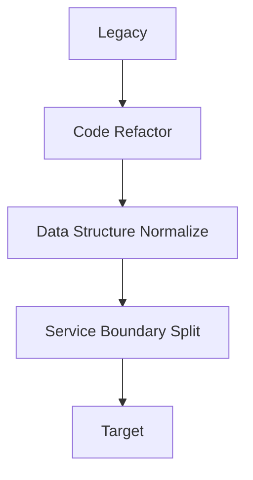

各ステップは $GS$ 内の点 $P(t_k)$ に対応する。

---

## 4. 経路リスク

$$
Risk(P) = \int_0^1 distance(G(P(t)), Ideal) \, dt
$$

またはステップ $k$ で離散化した場合：

$$
Risk(P) = \sum_k distance(G(P_k), Ideal)
$$

---

## 5. 結論

移行経路 $P(t)$ は、**レガシー → ターゲット** の旅路を幾何学的な軌跡として形式化する。移行最適化は、安全領域に留まりつつリスクを最小化する経路を探索する。

---
# 06. 移行最適化 (Migration Optimization)

**Phase 4: Migration Geometry**  
**Document ID:** `docs/80_geometry/06_Migration_Optimization.md`  
**Date:** 2026-03-05

---

## 1. はじめに

移行計画は **最適化問題** となる：安全制約を満たしつつ、レガシーからターゲットへの **リスクを最小化する** 経路を見つけることである。

---

## 2. 形式的定義

### 2.1 最適化問題

$$
\min_{P} Risk(P)
$$

制約条件：

$$
g_i(P(t)) \ge \tau_i \quad \forall t \in [0,1], \forall i
$$

（すなわち、経路は安全領域 $\mathcal{S}$ 内に留まる）

### 2.2 目的関数

経路全体のリスク（経路に沿った理想点からの距離）を **最小化** する。

### 2.3 制約

- 経路はレガシーから始まる：$P(0) = G(Legacy)$
- 経路はターゲットで終わる：$P(1) = G(Target)$
- 経路は安全領域内に留まる：すべての $t$ について $P(t) \in \mathcal{S}$

---

## 3. 幾何学的解釈

この問題は、安全領域に制約された保証空間内の **最短経路**（または最小コスト経路）問題である。これは Phase 2 の超立方体グラフおよび Phase 3.5 の最適移行経路に接続する。

---

## 4. 結論

移行最適化は、ゴールを形式化する：安全境界内での **最小リスク移行** である。これにより、移行設計はヒューリスティックなものから **数学的最適化** へと昇華される。

---
# 07. 移行幾何学 (Migration Geometry - Summary)

**Phase 4: Migration Geometry**  
**Document ID:** `docs/80_geometry/07_Migration_Geometry.md`  
**Date:** 2026-03-05

---

## 1. はじめに

**移行幾何学** は Phase 4 の統合概念である。これは移行設計を経験に基づく判断から **数学的構造** へと昇華させる。

---

## 2. 中核概念

```
Legacy
    ↓
Guarantee Vector G(T)
    ↓
Space Mapping (GS = [0,1]^n)
    ↓
Shortest Safe Path
    ↓
Target
```

---

## 3. 統合モデル

| 概念 | 定義 |
| :--- | :--- |
| **保証ベクトル** | $G(T) = (g_1, \dots, g_n)$, $0 \le g_i \le 1$ |
| **保証空間** | $GS = [0,1]^n$ |
| **移行距離** | $Risk(T) = distance(G(T), Ideal)$ |
| **安全領域** | $\mathcal{S} = \{ G \mid g_i \ge \tau_i \}$ |
| **移行経路** | $P(t) \in GS$, $t \in [0,1]$ |
| **最適化** | $\min Risk(P)$ s.t. $P \subset \mathcal{S}$ |
| **失敗ゾーン** | $\{ G \mid g_i < \tau_i \text{ for some } i \}$ |

---

## 4. 構造的解釈

| 構造 | 幾何学的役割 |
| :--- | :--- |
| AST | 構文座標 |
| CFG | 制御座標 |
| DFG | データ座標 |
| State Model | 状態座標 |
| Guarantee | 空間軸 |

---

## 5. 移行判断の進化

```
経験判断 (Experience)
    ↓
構造判断 (Structure)
    ↓
数学的判断 (Mathematical)
```

---

## 6. 結論

移行幾何学は、移行理論のための **数学的基礎** を提供する。移行設計は保証空間における **幾何学的最適化問題** となる。これは COBOL 構造解析ラボの中核フェーズである。

---
# 08. 失敗幾何学 (Failure Geometry)

**Phase 4: Migration Geometry**  
**Document ID:** `docs/80_geometry/08_Failure_Geometry.md`  
**Date:** 2026-03-05

---

## 1. はじめに

**移行失敗** は幾何学的に、**不安全領域**（失敗ゾーン）への進入として定義される。本文書では失敗幾何学を形式化する。

---

## 2. 形式的定義

### 2.1 失敗領域 (不安全領域)

$$
\mathcal{F} = GS \setminus \mathcal{S} = \{ (g_1, \dots, g_n) \mid \exists i: g_i < \tau_i \}
$$

### 2.2 失敗条件の例

| 次元 | 失敗閾値 | 解釈 |
| :--- | :--- | :--- |
| Transaction | $g_4 < 0.6$ | トランザクション整合性が侵害された |
| State | $g_3 < 0.7$ | 状態遷移が破壊された |

### 2.3 失敗ゾーン

失敗ゾーンは、移行が **失敗** した点（少なくとも1つの保証次元が閾値を下回った点）の集合である。

---

## 3. 幾何学的解釈

移行失敗 = 経路 $P(t)$ がある $t$ において $\mathcal{F}$ に進入すること。$\mathcal{S}$ と $\mathcal{F}$ の境界は、各次元について $g_i = \tau_i$ で定義される。

---

## 4. 安全領域との関係

- **安全領域** $\mathcal{S}$: すべての $i$ について $g_i \ge \tau_i$
- **失敗ゾーン** $\mathcal{F}$: ある $i$ について $g_i < \tau_i$

---

## 5. 結論

失敗幾何学は、移行失敗の **幾何学的特徴付け** を提供する。$\mathcal{F}$ を回避することは $\mathcal{S}$ に留まることと等価であり、これが移行最適化の中核制約となる。

---
# 09. 保証軸理論 (Guarantee Axis Theory)

**Phase 4: Migration Geometry**  
**Document ID:** `docs/80_geometry/09_Guarantee_Axis_Theory.md`  
**Date:** 2026-03-05

---

## 1. はじめに

保証ベクトル $G(T) = (g_1, \dots, g_5)$ の各次元は、**構造的起源**（その保証が導出されるプログラム構造）を持つ。本文書では **保証軸理論** を形式化する。

---

## 2. 軸と構造のマッピング

| 軸 | 意味 | 構造的起源 |
| :--- | :--- | :--- |
| $g_1$ (Control) | 制御フローの保存 | CFG |
| $g_2$ (Data) | データフローの保存 | DFG |
| $g_3$ (State) | 状態遷移の保存 | State Machine |
| $g_4$ (Transaction) | トランザクション境界の保存 | Transaction Model |
| $g_5$ (Interface) | 外部インターフェースの保存 | I/O Boundary |

---

## 3. 構造的起源図

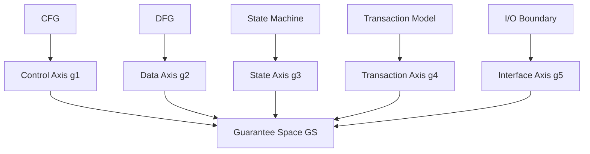

---

## 4. 幾何学的構造

```mermaid
flowchart LR
    subgraph Structures
        AST[AST]
        CFG[CFG]
        DFG[DFG]
        SM[State Model]
        TM[Transaction Model]
        IO[I/O]
    end
    
    subgraph Axes
        g1["g1 Control"]
        g2["g2 Data"]
        g3["g3 State"]
        g4["g4 Transaction"]
        g5["g5 Interface"]
    end
    
    subgraph Space
        GS["GS = [0,1]^n"]
    end
    
    CFG --> g1
    DFG --> g2
    SM --> g3
    TM --> g4
    IO --> g5
    g1 --> GS
    g2 --> GS
    g3 --> GS
    g4 --> GS
    g5 --> GS
```

---

## 5. 軸依存グラフ

保証軸は **完全に独立ではない**。軸間に構造的な依存関係が存在する：

| 依存関係 | 説明 |
| :--- | :--- |
| State → Data | 状態はデータに依存 |
| Transaction → State | トランザクションは状態に依存 |
| Control → State | 制御は状態に依存 |
| Interface → Transaction | インターフェースはトランザクションに依存 |

```mermaid
flowchart TD
    Data --> State
    State --> Transaction
    Control --> State
    Interface --> Transaction
```

完全な形式化については **16_Guarantee_Axis_Dependency.md** を参照。

---

## 6. 結論

保証軸理論は、各ベクトル次元をその **構造的起源** にリンクさせ、**軸依存関係** を捉える。これにより、幾何学（移行距離、安全領域）からプログラム構造（AST, CFG, DFG）へのトレーサビリティが確保される。

---
# 10. 保証距離空間 (Guarantee Metric Space)

**Phase 4.5: Geometry Formalization**  
**Document ID:** `docs/80_geometry/10_Guarantee_Metric_Space.md`  
**Date:** 2026-03-05

---

## 1. はじめに

保証空間 $GS = [0,1]^n$ は **距離空間** として形式化される。本文書では、距離ベースの移行分析を可能にする距離構造を定義する。

---

## 2. 距離空間としての保証空間

### 2.1 基礎集合

$$
X = GS = \{ (g_1, \dots, g_n) \mid 0 \le g_i \le 1 \}
$$

### 2.2 理想点

$$
Ideal = (1, 1, \dots, 1)
$$

---

## 3. 距離定義

### 3.1 ユークリッド距離

$$
d(G, I) = \sqrt{\sum_{i=1}^{n} (1 - g_i)^2}
$$

### 3.2 重み付き距離

$$
d_w(G, I) = \sqrt{\sum_{i=1}^{n} w_i (1 - g_i)^2}
$$

ここで $w_i > 0$ は軸 $i$ の重みである。

### 3.3 重みの意味論

| 軸 | 重み $w_i$ | 解釈 |
| :--- | :--- | :--- |
| Control | 1.0 | ベースライン |
| Data | 1.2 | データ整合性は重要 |
| State | 1.5 | 状態遷移は影響大 |
| Transaction | 1.6 | トランザクション境界は最も重要 |
| Interface | 0.8 | インターフェースは適応可能な場合が多い |

---

## 4. 距離公理

$d$ と $d_w$ は共に以下を満たす：

1. $d(x,y) \ge 0$ （非負性）
2. $d(x,y) = 0 \iff x = y$
3. $d(x,y) = d(y,x)$ （対称性）
4. $d(x,z) \le d(x,y) + d(y,z)$ （三角不等式）

---

## 5. 距離と位相の接続

重み付きユークリッド距離 $d_w$ は、$\mathbb{R}^n$ 上の標準ユークリッド距離と **同じ位相** を誘導する。したがって、$GS$ 上の距離位相は、**11_Guarantee_Topology.md** で導入される部分空間位相と **整合** している。

$$
\text{Metric Space } (GS, d_w) \rightarrow \text{Topology on } GS
$$

---

## 6. 結論

$(GS, d_w)$ は **距離空間** である。移行リスクは理想点への距離である。この構造は経路最適化と位相（Phase4.5-3）をサポートする。

---
# 11. 保証位相 (Guarantee Topology)

**Phase 4.5: Geometry Formalization**  
**Document ID:** `docs/80_geometry/11_Guarantee_Topology.md`  
**Date:** 2026-03-05

---

## 1. はじめに

保証空間に位相を導入し、安全領域、失敗領域、および境界の形式的な扱いを可能にする。

**ユークリッド位相の継承**

$$
GS = [0,1]^n \subset \mathbb{R}^n
$$

GS は $\mathbb{R}^n$ から **ユークリッド位相** を継承する。GS 上の部分空間位相は、$\mathbb{R}^n$ 上の標準ユークリッド位相によって誘導される相対位相である。

---

## 2. 位相構造

### 2.1 安全領域

$$
\mathcal{S} = \{ (g_1, \dots, g_n) \in GS \mid g_i \ge \tau_i \quad \forall i \}
$$

### 2.2 失敗領域

$$
\mathcal{F} = GS \setminus \mathcal{S}
$$

### 2.3 境界

$$
\partial \mathcal{S} = \{ G \in GS \mid g_i = \tau_i \text{ for some } i \}
$$

---

## 3. 結論

保証位相は、安全/失敗を位相的な領域として形式化する。移行固有の解釈については 14_Migration_Topology.md を参照。

---
# 12. 移行経路幾何学 (Migration Path Geometry)

**Phase 4.5: Geometry Formalization**  
**Document ID:** `docs/80_geometry/12_Migration_Path_Geometry.md`  
**Date:** 2026-03-05

---

## 1. はじめに

移行経路は、保証空間内の幾何学的な曲線として形式化される。

---

## 2. 経路定義

$$
P: [0,1] \to GS, \quad P(0)=G(Legacy), \quad P(1)=G(Target)
$$

## 3. 経路リスク

### 3.1 リスク密度 (コスト場)

移行リスクは、**リスク密度**（コスト場）上の積分として表現される。

**一般形**: コスト関数は任意の非負スカラー場であり得る
$$
cost: GS \to \mathbb{R}_{\ge 0}
$$

**Phase4.5 参照モデル**:
$$
cost(G) = d_w(G, Ideal)
$$

これは、**リスク ≠ 距離** という一般性を保持する。距離は1つの可能なコストモデルに過ぎない。

- **Risk Density**: 局所的移行リスク（各点 $G \in GS$ におけるリスク）
- **Cost Field**: 空間上のリスク分布
- **Gradient**: リスク増加方向 $\nabla cost$

### 3.2 経路リスク積分

$$
Risk(P) = \int_0^1 cost(P(t)) \, dt = \int_0^1 d_w(P(t), Ideal) \, dt
$$

## 4. 最適化

$$
\min_P Risk(P) \quad \text{s.t. } P(t) \in \mathcal{S} \quad \forall t
$$

**依存関係制約**（16_Guarantee_Axis_Dependency.md 参照）は許容可能な移行経路を制限し、経路最適化において尊重されなければならない。

---

## 5. 結論

移行経路幾何学は、移行を距離空間内の曲線として扱う。

---
# 13. 離散から連続への緩和 (Discrete to Continuous Relaxation)

**Phase 4.5: Geometry Formalization**  
**Document ID:** `docs/80_geometry/13_Discrete_Continuous_Relaxation.md`  
**Date:** 2026-03-05

---

## 1. はじめに

Phase 2/3 では離散構造を使用していた。Phase 4 では連続緩和を導入する。

---

## 2. フェーズの進展

| Phase | 構造 |
| :--- | :--- |
| Phase 2 | 保証束 (離散) |
| Phase 3 | 依存関係イデアル (離散) |
| Phase 4 | 連続空間 $GS=[0,1]^n$ |

## 3. 意味

$$
\text{Discrete Structure} \rightarrow \text{Continuous Relaxation}
$$

---

## 4. 結論

移行理論に対して、距離ベースおよび勾配的な推論を可能にする。

---
# 14. 移行位相 (Migration Topology)

**Phase 4.5: Geometry Formalization**  
**Document ID:** `docs/80_geometry/14_Migration_Topology.md`  
**Date:** 2026-03-05

---

## 1. はじめに

**移行位相** は、安全/失敗構造を保証空間の位相的分割として形式化する。

---

## 2. 領域定義

### 2.1 失敗ゾーン

$$
\mathcal{F} = \{ (g_1, \dots, g_n) \in GS \mid \exists i: g_i < \tau_i \}
$$

### 2.2 安全ゾーン

$$
\mathcal{S} = \{ (g_1, \dots, g_n) \in GS \mid g_i \ge \tau_i \quad \forall i \}
$$

### 2.3 遷移境界

$$
\partial \mathcal{S} = \{ G \in GS \mid g_i = \tau_i \text{ for some } i \}
$$

---

## 3. 移行の解釈

- **安全な移行**: 経路 $P(t)$ が $\mathcal{S}$ 内に留まる。
- **移行失敗**: 経路が $\mathcal{F}$ に進入する。
- **境界**: 移行が不安全になる臨界閾値。

---

## 4. 図解

```mermaid
flowchart TD
    subgraph GS[Guarantee Space]
        S[Safe Zone S]
        F[Failure Zone F]
        B[Boundary]
    end
    S --- B
    B --- F
```

---

## 5. 結論

移行位相は、安全/失敗分類のための **位相的枠組み** を提供する。これは距離空間 (10) および経路幾何学 (12) と統合される。

---
# 15. 移行幾何学形式化 (Migration Geometry Formalization - Summary)

**Phase 4.5: Geometry Formalization**  
**Document ID:** `docs/80_geometry/15_Migration_Geometry_Formalization.md`  
**Date:** 2026-03-05

---

## 1. はじめに

本文書は **移行幾何学** の形式化を要約し、それを **移行理論** へと昇華させる。

---

## 2. 統合モデル

```
Legacy
    ↓
Guarantee Vector G(T)
    ↓
Guarantee Space GS = [0,1]^n
    ↓
Metric Structure (d_w)
    ↓
Topology (Safe / Failure)
    ↓
Path Optimization
    ↓
Target
```

---

## 3. ドキュメントマップ

| Doc | 内容 |
| :--- | :--- |
| 09 | 保証軸理論 (構造的起源) |
| 10 | 保証距離空間 |
| 11 | 保証位相 |
| 12 | 移行経路幾何学 |
| 13 | 離散から連続への緩和 |
| 14 | 移行位相 |
| 15 | 本サマリ |
| 16 | 保証軸依存関係 |
| 17 | 移行リスク場 |

---

## 4. 理論的昇華

$$
\text{Migration Design} \rightarrow \text{Migration Geometry} \rightarrow \text{Migration Theory}
$$

移行幾何学は現在、以下のように形式化されている：
- **距離空間** (距離、リスク)
- **位相空間** (安全/失敗領域)
- **経路幾何学** (曲線、最適化)

---

## 5. 結論

Phase 4.5 は移行幾何学の **数学的形式化** を完了する。COBOL 構造解析ラボは **移行理論** を厳密な数学的構造として確立した。

---
# 16. 保証軸依存関係 (Guarantee Axis Dependency)

**Phase 4.5: Geometry Formalization**  
**Document ID:** `docs/80_geometry/16_Guarantee_Axis_Dependency.md`  
**Date:** 2026-03-05

---

## 1. はじめに

保証軸は **完全に独立ではない**。軸間の構造的依存関係は、移行の順序付けやリスク評価に影響を与える。本文書では **軸依存グラフ** を形式化する。

---

## 2. 依存関係テーブル

| ソース軸 | ターゲット軸 | 意味 |
| :--- | :--- | :--- |
| Data | State | 状態はデータに依存 |
| State | Transaction | トランザクションは状態に依存 |
| Control | State | 制御は状態に依存 |
| Interface | Transaction | インターフェースはトランザクションに依存 |

---

## 3. 軸依存グラフ

```mermaid
flowchart TD
    Data --> State
    State --> Transaction
    Control --> State
    Interface --> Transaction
    
    subgraph Axes
        Data[Data g2]
        State[State g3]
        Transaction[Transaction g4]
        Control[Control g1]
        Interface[Interface g5]
    end
```

---

## 4. 依存関係を持つ幾何学的構造

```mermaid
flowchart LR
    subgraph Dependencies
        Data --> State
        State --> Transaction
        Control --> State
        Interface --> Transaction
    end
    
    subgraph GS
        GSspace["GS = [0,1]^5"]
    end
    
    Data --> GSspace
    State --> GSspace
    Transaction --> GSspace
    Control --> GSspace
    Interface --> GSspace
```

---

## 5. 依存関係制約

**依存関係制約** は、許容可能な移行経路を制限する。

例えば、Data → State の場合、State に影響を与える移行操作は、Data 保証を侵害してはならない。同様に、Transaction の変更は State 保証を保存しなければならない。

---

## 6. 移行への影響

- **順序付け**: Data と Control は State の前に、State は Transaction の前に対処されるべきである。
- **リスク伝播**: 親軸における劣化は、依存する軸に伝播する。
- **経路幾何学**: 移行経路は可能な限り依存順序を尊重すべきである。
- **経路最適化**: **依存関係制約** は、経路最適化における追加の制約として存在する（12_Migration_Path_Geometry.md 参照）。

---

## 7. 結論

軸依存グラフは、保証次元間の構造的関係を形式化する。これは移行戦略とリスク分析に情報を提供する。

---
# 17. 移行リスク場 (Migration Risk Field)

**Phase 4.5: Geometry Formalization**  
**Document ID:** `docs/80_geometry/17_Migration_Risk_Field.md`  
**Date:** 2026-03-05

---

## 1. はじめに

**移行リスク場**（コスト場）は、保証空間内の各点に局所的なリスク値を割り当てる。経路リスクは、移行経路に沿ったこの場の積分である。

---

## 2. コスト場定義

**一般形**: コスト関数は任意の非負スカラー場であり得る
$$
cost: GS \to \mathbb{R}_{\ge 0}
$$

**Phase4.5 参照モデル**:
$$
cost(G) = d_w(G, Ideal)
$$

これは、**リスク ≠ 距離** という一般性を保持する。

- **Risk Density**: 局所的移行リスク
- **Cost Field**: 空間上のリスク分布

---

## 3. リスク場図

```mermaid
flowchart LR
    subgraph GS
        G1[G1]
        G2[G2]
        Ideal[Ideal]
    end
    
    subgraph Cost
        c1[cost G1]
        c2[cost G2]
        c0[cost Ideal = 0]
    end
    
    G1 --> c1
    G2 --> c2
    Ideal --> c0
```

---

## 4. 勾配

$GS \subset \mathbb{R}^n$ であるため、勾配 $\nabla cost$ は **$\mathbb{R}^n$ から継承された座標系** に関して定義される。

$$
\nabla cost(G) = \text{risk increase direction}
$$

勾配はより高いリスクの方を指す。移行経路は可能な限り、勾配に沿って移動することを避けるべきである。

---

## 5. 経路リスク

$$
Risk(P) = \int_0^1 cost(P(t)) \, dt
$$

経路リスクは、経路に沿ったコスト場の積分である。

---

## 6. 幾何学的構造

```mermaid
flowchart TD
    subgraph Migration
        Legacy[Legacy]
        Target[Target]
        Path[Path P]
    end
    
    subgraph RiskField
        CostField[Cost Field]
        Gradient[Gradient]
    end
    
    Legacy --> Path
    Path --> Target
    Path --> CostField
    CostField --> Gradient
```

---

## 7. 結論

移行リスク場は、局所的リスクを GS 上のスカラー場として形式化する。これは経路幾何学 (12) を距離空間 (10) と接続し、移行経路の最適化をサポートする。

---
# 20. 移行幾何学定義 (Migration Geometry Definition)

**Phase 5: Migration Geometry Construction**  
**Document ID:** `docs/80_geometry/20_Migration_Geometry_Definition.md`  
**Date:** 2026-03-08

---

## 1. はじめに

移行幾何学は、ソフトウェア移行を **保証空間** 内の幾何学的問題として扱う数学的枠組みである。本文書では **移行幾何学** タプルを形式的に定義する。

---

## 2. 形式的定義

**移行幾何学** はタプル $\mathcal{M}$ である：

$$
\mathcal{M} = (GS, d, \mathcal{S}, \mathcal{F}, \phi)
$$

ここで：

*   **$GS$ (保証空間)**: 保証レベルに関するすべての可能なシステム状態を表す有界超立方体 $[0,1]^n$。これは直交次元を仮定した **一次近似** である。
*   **$d$ (距離)**: 状態間の幾何学的変位を測定する距離関数 $d: GS \times GS \to \mathbb{R}_{\ge 0}$。
*   **$\mathcal{S}$ (安全領域)**: システムが許容可能な保証閾値内で動作する状態を表す部分集合 $\mathcal{S} \subseteq GS$。
*   **$\mathcal{F}$ (失敗領域)**: 許容できない状態を表す補集合 $\mathcal{F} = GS \setminus \mathcal{S}$。
*   **$\phi$ (効用関数)**: 状態の本質的な価値や「健全性」を表すスカラー場 $\phi: GS \to \mathbb{R}$（21_Migration_State_Model 参照）。

---

## 3. 保証空間構造

保証空間は $n$ 個の直交軸によって定義される。

**直交性の仮定**:
このベースラインモデルでは、保証次元は独立であると仮定する。
*   *現実*: 次元はしばしば結合している（例：トランザクション保証は状態の一貫性に依存する）。
*   *モデル*: 幾何学的単純さのために直交として扱い、結合は空間自体を歪めるのではなく **安全領域制約** ($\mathcal{S}$) を通じて処理する。

$$
GS = \prod_{i=1}^{n} [0,1]_i
$$

典型的な次元 ($n=5$):
1.  $g_1$: **Control Flow** (ロジックの意味的等価性)
2.  $g_2$: **Data Flow** (データ系統の整合性)
3.  $g_3$: **State** (状態遷移の一貫性)
4.  $g_4$: **Transaction** (原子性と境界の保存)
5.  $g_5$: **Interface** (外部契約の遵守)

---

## 4. 幾何学的特性

1.  **有界性**: 空間はコンパクトであり、$\vec{0}$ (ゼロ保証) と $\vec{1}$ (理想保証) によって有界である。
2.  **連続性**: 実際の実装ステップは離散的かもしれないが、微積分ベースの最適化（リスク場勾配）を可能にするために、保証を連続変数 $[0,1]$ として扱う。
3.  **異方性**: 空間は等方的ではない。*Data* 軸に沿った移動は、*Interface* 軸に沿った移動とは異なるコスト/リスクプロファイルを持つ可能性がある（重み付き距離 $d$ によって処理される）。

---

## 5. 視覚的表現

```mermaid
graph TD
    subgraph MigrationGeometry
        GS[Guarantee Space GS]
        Metric[Metric d]
        Safe[Safe Region S]
        Fail[Failure Region F]
    end

    GS -- composed of --> Axes[g1...gn]
    Metric -- measures --> Cost[Transition Cost]
    Safe -- defined by --> Thresholds[tau_i]
    Fail -- complement of --> Safe
```

---

## 6. 将来の拡張

$\mathcal{M}$ はユークリッド $[0,1]^n$ 基底を使用しているが、将来の研究では以下を探求する可能性がある：

1.  **非直交空間**: $g_{ij}$ 計量テンソルが軸依存関係を捉えるリーマン幾何学。
2.  **束モデル**: 連続的に緩和できない保証のための離散順序理論。
3.  **トポロジー最適化**: 失敗領域を通過する「トンネル」を見つけるための安全領域 $\mathcal{S}$ のホモロジー解析。

---

## 7. 結論

移行幾何学 $\mathcal{M}$ は基礎的な構造を提供する。これは、幾何学的変位 ($d$) を状態効用 ($\phi$) や安全性制約 ($\mathcal{S}$) から分離し、厳密な数学的ベースラインを確立する。

---
# 21. 移行状態モデル (Migration State Model)

**Phase 5: Migration Geometry Construction**  
**Document ID:** `docs/80_geometry/21_Migration_State_Model.md`  
**Date:** 2026-03-08

---

## 1. はじめに

**移行状態** は、特定の時点におけるシステムの保証レベルのスナップショットを表す。移行幾何学において、状態は保証空間内の **点** である。

---

## 2. 状態定義

状態 $S$ は $GS$ 内のベクトルである：

$$
S = (g_1, g_2, \dots, g_n) \in [0,1]^n
$$

### 2.1 主要な参照状態

*   **レガシー状態 ($S_{legacy}$)**: 移行の出発点。通常、既存の振る舞いに対して高い保証を仮定するが、構造的には不透明な場合がある。
    *   例: それ自身に対して $S_{legacy} = (1.0, 1.0, 1.0, 1.0, 1.0)$。
    *   *注: しばしばターゲットをレガシーに対して正規化するか、その逆を行う。ここでは、$1.0$ を「理想」または「ターゲット」要件が満たされた状態と定義する。*

*   **ターゲット状態 ($S_{target}$)**: 移行のゴール。
    *   例: $S_{target} = (1.0, 1.0, 1.0, 1.0, 1.0)$ (完全な等価性 + 近代化)。

*   **ゼロ状態 ($S_{zero}$)**: 保証の完全な喪失。
    *   $S_{zero} = (0, 0, 0, 0, 0)$。

### 2.2 中間状態

移行は中間状態 $S_t$ を通過することを伴う。

*   **部分移行**: $S_{partial} = (1.0, 0.8, 0.5, 1.0, 0.9)$
    *   *解釈*: ロジックとトランザクションは完璧、データは許容範囲だが、状態の一貫性は一時的に低下している（例：二重書き込み実装中）。

---

## 3. 状態分類

状態は、安全領域 $\mathcal{S}$ に対する位置に基づいて分類される。

1.  **許容状態 (Admissible State)**: $S \in \mathcal{S}$。システムは機能しており安全である。
2.  **不許可状態 (Inadmissible State)**: $S \in \mathcal{F}$。システムは壊れているか、クリティカルな制約（例：データ破損）に違反している。
3.  **境界状態 (Boundary State)**: $S \in \partial\mathcal{S}$。システムは失敗の瀬戸際にあり、エラーのマージンはゼロである。

---

## 4. 状態評価 (効用)

状態がどこから来たかに関わらず、状態の「良さ」を評価するために、スカラー **効用関数** $\phi(S)$ を導入する。

$$
\phi(S) = \text{Utility}(S) \in [0, 1]
$$

*   $\phi(S) \approx 1.0$: 高品質な状態（高い保証、低い技術的負債）。
*   $\phi(S) \approx 0.0$: 低品質な状態。

### 4.1 効用 vs. 安全性

*   **安全性**: 二値分類 ($S \in \mathcal{S}$ または $S \notin \mathcal{S}$)。
*   **効用**: $\mathcal{S}$ 内の連続的な勾配。状態は安全だが効用が低い場合がある（例：「安全だが機能は最小限」）。

---

## 5. 状態遷移

遷移 $T$ は2つの状態間のベクトル差分である：

$$
T_{a \to b} = S_b - S_a = \Delta S
$$

*   **正の遷移**: $\Delta g_i > 0$ (保証の改善 / 回復)
*   **負の遷移**: $\Delta g_i < 0$ (保証の劣化 / リスク受容)

---

## 6. 例: ストラングラーパターンの状態

```mermaid
graph LR
    S0[Legacy S0] --> S1[Phase 1: Facade]
    S1 --> S2[Phase 2: Dual Write]
    S2 --> S3[Phase 3: Switch Read]
    S3 --> S4[Target S4]

    style S0 fill:#f9f,stroke:#333
    style S4 fill:#9f9,stroke:#333
```

*   $S_0$: すべてレガシー
*   $S_1$: インターフェース安定 ($g_5=1$)、内部ロジックは不透明。
*   $S_2$: データ同期 ($g_2 \approx 1$)、しかし複雑性は高い。
*   $S_3$: 状態移行 ($g_3 \to 1$)。

---

## 7. 結論

移行状態モデルは、システムの「場所」と「良さ」を定義する。
*   **位置**: 座標ベクトル $S$。
*   **価値**: 効用 $\phi(S)$。
*   **妥当性**: $\mathcal{S}$ への包含。

この分離により、安全境界を尊重しながら高効用状態に向けて最適化することが可能になる。

---
# 22. 移行距離メトリクス (Migration Distance Metric)

**Phase 5: Migration Geometry Construction**  
**Document ID:** `docs/80_geometry/22_Migration_Distance_Metric.md`  
**Date:** 2026-03-08

---

## 1. はじめに

**移行距離** は、2つの状態間の幾何学的変位を定量化する。
重要な点として、**距離 $\neq$ コスト** である。

*   **距離 ($d$)**: 保証レベルの幾何学的差異。「システムはどれくらい異なっているか？」
*   **コスト ($J$)**: 経路を横断するための運用労力。「作業はどれくらい大変か？」
*   **リスク ($R$)**: 失敗への露出。「その位置はどれくらい危険か？」

本文書では **距離メトリクス ($d$)** を定義する。

---

## 2. メトリクス定義

標準的な幾何学的尺度として、**重み付きユークリッドメトリクス** (L2) を定義する。

### 2.1 重み付き L2 メトリクス (変位)

$$
d_w(A, B) = \sqrt{ \sum_{i=1}^{n} w_i (b_i - a_i)^2 }
$$

*   $d_w$ は保証空間における **幾何学的近接性** を測定する。
*   これは必要な変更の大きさの **プロキシ** として機能する。

### 2.2 重み付き L1 メトリクス (マンハッタン)

$$
d_{L1}(A, B) = \sum_{i=1}^{n} w_i |b_i - a_i|
$$

*   独立性を仮定した、次元ごとの変更の総和を表す。

---

## 3. 重み付け戦略 ($w_i$)

重みは、次元の **構造的剛性** または **影響係数** を反映する。高い重みは、その軸上の単位変更が「より大きな」構造的シフトを表すことを意味する。

| 次元 | 重み ($w_i$) | 幾何学的解釈 |
| :--- | :--- | :--- |
| **Data ($g_2$)** | **2.0** | 空間は Data 軸に沿って「引き伸ばされて」いる。小さなデータの変更は大きな距離を意味する。 |
| **Transaction ($g_4$)** | **1.8** | トランザクションの変更は大きな幾何学的領域をカバーする。 |
| **State ($g_3$)** | **1.5** | 中程度の拡張。 |
| **Control ($g_1$)** | **1.2** | 標準ユークリッドに近い。 |
| **Interface ($g_5$)** | **1.0** | ベースラインスケール。 |

---

## 4. 距離の解釈

1.  **幾何学的変位**: $d(S_{current}, S_{target})$
    *   純粋に空間的。「ゴールからどれくらい離れているか？」
2.  **安全マージン**: $\min_{B \in \partial\mathcal{S}} d(S_{current}, B)$
    *   失敗境界からの幾何学的クリアランス。

*注: コストは距離から導出されるが、経路依存の要因（速度、摩擦）を含む。25_Migration_Optimization_Model 参照。*

---

## 5. メトリクスの幾何学

視覚的には、ターゲットから等距離にある状態は **メトリクス超球面** を形成する。

*   重み付けのない空間では、これらは球である。
*   我々の重み付き空間では、これらは Data 軸と Transaction 軸に沿って引き伸ばされた **楕円体** である。
*   これは、Data 空間での「短い」移動が、Interface 空間での「長い」移動と幾何学的に等価であることを意味する。

---

## 6. 結論

移行距離メトリクスは、抽象的な「変更の大きさ」を具体的なスカラー値にマッピングする。これはコスト計算の基礎となるが、コストやリスクとは異なるものである。

---
# 23. 移行経路モデル (Migration Path Model)

**Phase 5: Migration Geometry Construction**  
**Document ID:** `docs/80_geometry/23_Migration_Path_Model.md`  
**Date:** 2026-03-08

---

## 1. はじめに

**移行経路** は、レガシーからターゲットへの保証空間を通るシステムの軌跡である。これは移行実行の *戦略* を表す。

---

## 2. 経路定義

### 2.1 連続経路 (理論的)

$$
P: [0, 1] \to GS
$$

*   $P(0) = S_{legacy}$
*   $P(1) = S_{target}$
*   $P(t)$ は移行進捗 $t$ におけるシステム状態を表す。

### 2.2 離散経路 (運用的)

$$
P = \langle S_0, S_1, S_2, \dots, S_k \rangle
$$

*   $S_0 = S_{legacy}$
*   $S_k = S_{target}$
*   各ステップ $S_i \to S_{i+1}$ は移行イテレーション（スプリント、リリース）を表す。

---

## 3. 経路タイプ

### 3.1 直接経路 (ビッグバン)

*   **軌跡**: $S_{legacy}$ と $S_{target}$ を結ぶ測地線（直線）。
*   **特徴**: 最短の幾何学的距離 ($d$)。
*   **リスク**: しばしば $\mathcal{F}$（失敗領域）を横断する。高い露出。
*   **コスト**: 経路統合コストは低いが、失敗した場合のリスクコストは無限大。

### 3.2 安全経路 (インクリメンタル)

*   **軌跡**: $\mathcal{S}$ 内に留まるように制約された曲線。
*   **特徴**: 距離が長い ($d_{safe} > d_{direct}$)。
*   **リスク**: 最小化される。
*   **コスト**: 統合コスト（アダプタ、足場）は高いが、リスクは有界。

### 3.3 境界経路 (アグレッシブ)

*   **軌跡**: 境界 $\partial\mathcal{S}$ に沿う。
*   **特徴**: 最小限の安全性を維持しつつ、速度/効率を最大化する。
*   **リスク**: 摂動に対する感度が高い。

---

## 4. 経路の視覚化

```mermaid
graph LR
    subgraph GuaranteeSpace
        Legacy((Legacy))
        Target((Target))
        
        Legacy -- Direct (Risk!) --> Target
        Legacy -- Safe (Incremental) --> Waypoint1
        Waypoint1 --> Waypoint2
        Waypoint2 --> Target
    end
    
    style Legacy fill:#ccc
    style Target fill:#6f6
    style Waypoint1 fill:#fff
    style Waypoint2 fill:#fff
```

---

## 5. 経路特性

1.  **経路長 (総変位)**:
    $$ L(P) = \int_0^1 |\dot{P}(t)| dt $$
    コード変更の総量のプロキシ。

2.  **安全クリアランス**:
    $$ \min_t \text{dist}(P(t), \partial\mathcal{F}) $$
    プロジェクト中の最小エラーマージン。

---

## 6. 結論

移行経路モデルは、**経路の幾何学**（形状）を **移行の物理学**（コスト/リスク）から分離する。最適化は、長さ vs 安全性のバランスをとる「最良の」形状を探索する。

---
# 24. 移行戦略空間 (Migration Strategy Space)

**Phase 5: Migration Geometry Construction**  
**Document ID:** `docs/80_geometry/24_Migration_Strategy_Space.md`  
**Date:** 2026-03-08

---

## 1. はじめに

**戦略空間** は、保証空間における幾何学的特性に基づいて、異なる移行アプローチ（パターン）を体系化する。

---

## 2. 戦略定義

**移行戦略** $\Sigma$ は、位相的または幾何学的特性を共有する **経路の族**（ホモトピー類）である。

$$
\Sigma = \{ P \mid P \text{ satisfies condition } C_\Sigma \}
$$

戦略は以下によって区別される：
1.  **位相**: $\mathcal{S}$ 内に留まるか？
2.  **ステップ粒度**: 連続的 vs 離散的チャンク。
3.  **サポート**: 並行システム ($S_{legacy}$) に依存するか？

---

## 3. 戦略ファミリ

### 3.1 "ビッグバン" 戦略 ($\Sigma_{BB}$)

*   **定義**: 単一ステップ $S_0 \to S_{target}$ を持つ経路、または $\mathcal{S}$ をかなりの期間逸脱する経路。
*   **幾何学**: 制約のない空間における測地線（直線）。
*   **利点**: 中間オーバーヘッドが最小。
*   **欠点**: 壊滅的な失敗（$\mathcal{F}$ への着地）のリスクが高い。

### 3.2 "ストラングラーフィグ" 戦略 ($\Sigma_{SF}$)

*   **定義**: レガシーシステムを生かしたまま、機能を段階的に置き換える多数の小さなステップで構成される経路。
*   **幾何学**: すべての $S_i$ が $S_{i-1}$ に近く、かつ $S_i \in \mathcal{S}$ である離散経路 $S_0 \to S_1 \to \dots \to S_k$。
*   **利点**: 高い安全性、検証可能なステップ。
*   **欠点**: 総距離が長い（アダプタ、二重保守のコスト）。

### 3.3 "並行稼働" 戦略 ($\Sigma_{PR}$)

*   **定義**: システム状態が事実上複製され、$S_{new}$ と $S_{old}$ が同時に実行され、「有効な状態」が加重平均となる経路。
*   **幾何学**: レガシーシステムをフォールバック（セーフティネット）として使用することで、高保証空間内の位置を維持する。

---

## 4. 戦略マップ

戦略を **ステップサイズ** vs **安全マージン** の軸上にマッピングできる。

| 戦略 | ステップサイズ ($\Delta S$) | 安全マージン | コストオーバーヘッド |
| :--- | :--- | :--- | :--- |
| **Big Bang** | 大 (1.0) | 低 / 負 | 低 |
| **Phased** | 中 (0.3) | 中 | 中 |
| **Strangler** | 小 (0.05) | 高 | 高 |

---

## 5. 幾何学的選択基準

幾何学に基づいて戦略を選択する方法：

1.  **レガシーが境界に近い場合** ($\mathcal{S}$ が狭い):
    *   $\implies$ **Strangler** を使用（$\mathcal{F}$ への転落を避けるために小さなステップが必要）。
2.  **レガシーが安全領域の深い位置にある場合** ($\mathcal{S}$ が広い):
    *   $\implies$ 速度のために **Phased** または **Big Bang** が許容可能なリスクかもしれない。
3.  **ターゲットが遠い場合** (大きな $d$):
    *   $\implies$ 累積エラーを管理するために **Strangler** が好ましい。

---

## 5. 結論

移行戦略は **幾何学的経路の族** である。
*   **Big Bang**: 制約を無視した測地線。
*   **Strangler**: 境界に沿った、微細粒度。
*   **Phased**: ウェイポイントベース、粗粒度。

戦略を選択することは、探索すべき **経路空間の領域** を選択することである。

---
# 25. 移行最適化モデル (Migration Optimization Model)

**Phase 5: Migration Geometry Construction**  
**Document ID:** `docs/80_geometry/25_Migration_Optimization_Model.md`  
**Date:** 2026-03-08

---

## 1. はじめに

**移行最適化** は、「最良の」移行計画を見つけるための数学的定式化である。これは幾何学、メトリクス、経路モデルを最適化問題に統合する。

---

## 2. 目的関数

**総移行コスト** $J(P)$ を最小化することを目指す。
この関数は **運用労力** と **リスク露出** を統合する。

$$
\min_{P} J(P) = \int_{0}^{1} \left[ \underbrace{C_{ops}(\dot{P}(t))}_{\text{Effort}} + \underbrace{C_{risk}(P(t))}_{\text{Exposure}} - \underbrace{\phi(P(t))}_{\text{Utility}} \right] dt
$$

### 2.1 項

1.  **労力 (運動エネルギー)**: 変更のコスト。
    *   $C_{ops} \propto |\dot{P}(t)|^2$ (または L1 では $|\dot{P}|$ )。
    *   急激な変更（高速度）は不均衡にコストがかかる（残業、認知的負荷）。
2.  **リスク露出 (位置エネルギー)**: 危険のコスト。
    *   $C_{risk} \propto \frac{1}{\text{dist}(P(t), \partial\mathcal{F})}$。
    *   失敗に近づきすぎることへのペナルティ。
3.  **効用獲得**:
    *   高効用状態で過ごす時間を最大化したい（オプション項、段階的な価値提供に関連）。

---

## 3. 制約

最適化は以下に従う：

1.  **ハード制約 (安全性)**:
    *   $P(t) \in \mathcal{S} \quad \forall t$
2.  **境界条件**:
    *   $P(0) = S_{legacy}, \quad P(1) = S_{target}$
3.  **ダイナミクス (リソース制限)**:
    *   $|\dot{P}(t)| \le V_{max}$ (チーム容量制限)。

---

## 4. 最短安全経路問題

これはロボット工学における **障害物あり最短経路問題** と等価である。

*   **障害物**: 失敗領域 $\mathcal{F}$。
*   **地形**: 重み付き移動コストを持つ保証空間。

### 4.1 解法アプローチ

1.  **グリッド探索 / A***: GS を離散化し、グリッド上の最短経路を見つける。
2.  **ポテンシャル場**: ターゲットを引力、$\mathcal{F}$ を斥力として扱う。経路は勾配降下に従う。

---

## 5. 最適化図

```mermaid
graph TD
    Start[Legacy]
    Goal[Target]
    Fail[Failure Region]
    
    Start --> A{Choose Next Step}
    A -- Low Cost / High Risk --> Path1[Direct Path]
    A -- High Cost / Low Risk --> Path2[Detour Path]
    
    Path1 -.-> Fail
    Path2 --> Goal
    
    style Fail fill:#f99
    style Path2 stroke-width:4px,stroke:#0f0
```

---

## 6. 結論

移行計画は **制約付き最適制御問題** として定式化される。
*   **状態**: 保証ベクトル $S$。
*   **制御**: 移行速度 $\dot{P}$ (変更率)。
*   **コスト**: 労力 + リスク - 効用。

このモデルは、「アジャイル vs ウォーターフォール」の議論を、最適化ランドスケープにおけるパラメータ選択として数学的に基礎づける。


# 80_reviews

This directory contains review logs and decision records.
- ReviewPolicy.md
- ResearchReviewLog.md
- OpenQuestions.md
- DecisionRecords.md

# 90_glossary

# Glossary 1. Core Concepts

This document defines the fundamental concepts that form the backbone of the COBOL Structure Analysis Lab research.

| Term | Layer | Definition | Formal Description | Related Concepts |
| :--- | :--- | :--- | :--- | :--- |
| **Legacy System** | Structure / Decision | 事業運営に不可欠だが、古い技術やアーキテクチャに基づいている既存システム。本研究では特にCOBOLシステムを指す。 | $S_{legacy}$ | [[Target System]], [[Migration]] |
| **Target System** | Structure / Decision | 移行後の目標となるシステム状態。 | $S_{target}$ | [[Legacy System]] |
| **Migration** | Geometry / Decision | 重要な性質（Guarantee）を維持しながら、Legacy SystemをTarget Systemへ変換するプロセス。 | $P: [0,1] \to GS, \quad P(0)=S_{legacy}, \quad P(1)=S_{target}$ | [[Migration Geometry]], [[Guarantee]] |
| **Guarantee** | Logic / Guarantee | 移行プロセスにおいて維持または満たされるべきシステムの性質や振る舞い。「正しさ」の基本単位。 | $g \in [0,1]$<br>$G(S_{src}, S_{dst}) \iff \forall p \in P_{inv}, p(S_{src}) \equiv p(S_{dst})$ | [[Guarantee Space]], [[Guarantee Unit]] |
| **Guarantee Space** | Theory / Geometry | すべての可能な保証状態の集合が構成する数理的空間。包含関係による半順序構造（束）を持ち、移行プロセスはこの空間内の移動として表現される。 | $\mathcal{G} = (2^{\mathbb{P}}, \subseteq)$ or $GS = [0,1]^n$ | [[Migration Geometry]], [[Guarantee Lattice]] |
| **Structural Analysis** | Structure | ソースコードを文字列としてではなく、AST、CFG、DFGなどの構造モデルとして解析する手法。 | - | [[AST]], [[CFG]], [[DFG]] |
| **Migration Geometry** | Geometry | 移行プロセスを幾何学的な「経路（Path）」や「距離（Distance）」として扱うための理論フレームワーク。 | $\mathcal{M} = (GS, d, \mathcal{S}, \mathcal{F}, \phi)$ | [[Guarantee Space]], [[Migration Path]] |

---
# Glossary 2. Structural Analysis Layer

This document defines concepts related to the parsing and structural modeling of code.

| Term | Layer | Definition | Formal Description | Related Concepts |
| :--- | :--- | :--- | :--- | :--- |
| **AST (Abstract Syntax Tree)** | Syntax | ソースコードの構文構造を木構造として表現したもの。括弧や区切り文字などの不要なトークンを取り除き、構文の意味的な階層のみを保持する。 | Tree $T = (V, E)$ where $V$ are syntax nodes and $E$ represent containment. | [[CST]], [[IR]] |
| **IR (Intermediate Representation)** | Structure / Semantic | 言語依存のASTと、解析用のグラフ構造の中間に位置する、分析に最適化された表現形式。（定義待ち） | N/A | [[AST]], [[CFG]] |
| **CFG (Control Flow Graph)** | Structure | プログラム内の実行パス（制御の流れ）を有向グラフとして表現したもの。ノードは基本ブロック（Basic Block）、エッジは制御の遷移を表す。 | Graph $G = (V, E, s, t)$ where $V$ are basic blocks, $E \subseteq V \times V$ are jumps. | [[Basic Block]], [[DFG]] |
| **DFG (Data Flow Graph)** | Structure | データの依存関係（定義と使用）を有向グラフとして表現したもの。ある変数の値がどこで生成され、どこで使われるかを追跡する。 | Graph $G = (V, E)$ where $V$ are operations/variables, $E$ represent data dependency. | [[CFG]], [[Variable Scope]] |

---
# Glossary 3. Guarantee Theory

This document defines the constituent elements of the Guarantee concept.

| Term | Layer | Definition | Formal Description | Related Concepts |
| :--- | :--- | :--- | :--- | :--- |
| **Guarantee** | Logic / Guarantee | システムのある性質が、変換や移行の後でも維持されていることの確証。定量的には $0$ から $1$ の値を取る。 | $g \in [0,1]$ | [[Guarantee Unit]], [[Invariant]] |
| **Guarantee Unit** | Structure | 保証を検証・維持する最小の機能単位。L1（文）からL5（業務機能）までの階層を持つ。 | $U \subseteq AST$ | [[Guarantee Layer]] |
| **Guarantee Composition** | Theory / Guarantee | 複数の小さな保証を組み合わせて、より大きな保証を構成する操作または理論。（定義待ち） | $G(Parent) = \bigwedge_{child} G(child)$ | [[Guarantee Unit]], [[Guarantee Lattice]] |
| **Guarantee Order** | Theory / Guarantee | 保証の強さや包含関係に基づく順序関係。「保証Aは保証Bよりも強い（A implies B）」などの関係。 | Partial order $\leq$ on Guarantee Space.<br>$g_a \le g_b \iff b \implies a$ | [[Guarantee Lattice]] |
| **Guarantee Equivalence** | Logic / Guarantee | 2つのプログラム要素が、保証の観点で「等価」であるとみなされるための条件。 | $S_A \equiv S_B \iff G(S_A) = G(S_B)$ | [[Semantic Equivalence]] |

---
# Glossary 4. Guarantee Space Theory

This document defines the mathematical spaces used to model guarantees.

| Term | Layer | Definition | Formal Description | Related Concepts |
| :--- | :--- | :--- | :--- | :--- |
| **Guarantee Space** | Theory / Geometry | システムが取りうるすべての保証状態の集合。連続近似としては $n$次元超立方体、離散的には束（Lattice）として扱われる。 | $GS = [0,1]^n$ (Continuous)<br>or Lattice (Discrete) | [[Migration Geometry]] |
| **Guarantee Dimension** | Theory / Geometry | 保証空間を構成する独立した（または準独立した）評価軸。Control, Data, State, Transaction, Interface など。 | $g_i \in \{ g_{ctrl}, g_{data}, \dots \}$ | [[Guarantee Vector]] |
| **Dependent Guarantee Space** | Theory / Geometry | 保証次元間の依存関係（例: Data保証なしにState保証は成立しない）を考慮し、到達不可能な状態を除外した空間。 | $\mathcal{G}_{dep} = \{ S \in \mathcal{G} \mid S \text{ satisfies dependencies} \}$ | [[Guarantee Space]], [[Structural Dependency]] |
| **Weighted Guarantee Space** | Theory / Geometry | 各保証次元に、その重要度や達成コストに基づく「重み」を付与した空間。 | $(GS, d_w)$ where $d_w$ uses weights $w_i$ | [[Guarantee Metric]] |
| **Guarantee Metric** | Theory / Geometry | 保証空間上の2点間の距離を定義する関数。 | $d(S_1, S_2) = \| S_1 - S_2 \|_w$<br>$d: GS \times GS \to \mathbb{R}_{\ge 0}$ | [[Migration Distance]] |

---
# Glossary 5. Geometry of Migration

This document defines geometric concepts applied to migration planning.

| Term | Layer | Definition | Formal Description | Related Concepts |
| :--- | :--- | :--- | :--- | :--- |
| **Migration Geometry** | Geometry | 移行プロセスを幾何空間上の移動としてモデル化する枠組み。 | Tuple $\mathcal{M} = (GS, d, \mathcal{S}, \mathcal{F}, \phi)$ | [[Guarantee Space]] |
| **Migration Distance** | Geometry | 現状システムと目標システムの間の幾何学的距離。移行の「大きさ」を表す。 | $d(Legacy, Target)$ | [[Migration Cost]] |
| **Migration Path** | Geometry | Guarantee Space 上での、Legacy状態からTarget状態への軌跡（一連の状態遷移）。 | Sequence $S_0, \dots, S_n$ where $S_0=Legacy, S_n=Target$<br>or $P: [0,1] \to GS$ | [[Migration Strategy]] |
| **Shortest Migration Path** | Geometry | Migration Cost または Distance を最小化する経路。 | $\min_P \int cost(P(t)) dt \quad \text{s.t.} \quad P(t) \in \mathcal{S}$ | [[Migration Optimization]] |
| **Migration Cost** | Decision | Migration Path を移動するために必要な総労力。距離だけでなく、経路上のリスクや摩擦係数を含む。 | $J(P) = \int (Effort + Risk - Utility) dt$ | [[Migration Distance]] |

---
# Glossary 6. Structural Modeling

This document defines concepts for modeling software structure.

| Term | Layer | Definition | Formal Description | Related Concepts |
| :--- | :--- | :--- | :--- | :--- |
| **Scope** | Structure | 特定の解析や移行ステップにおいて検討対象となるコードやシステム機能の範囲。 | $Scope \subseteq System$ | [[Scope Boundary]], [[Granularity]] |
| **Scope Boundary** | Structure | Scopeの内側と外側を分ける境界線またはインターフェース。 | $\partial Scope$ | [[Scope]], [[Responsibility Boundary]] |
| **Granularity** | Structure | 構造解析や移行を行う際の詳細レベルや単位の大きさ（例：ファイル、セクション、パラグラフ、文）。 | - | [[Guarantee Unit]] |
| **Structural Dependency** | Structure | ある構造要素が別の要素に依存している関係（例：AがBを呼ぶ、Aが変数Xを使用する）。 | $A \to B$ | [[Data Dependency]], [[Control Dependency]] |
| **Responsibility Boundary** | Structure / Decision | システム内の異なる機能的責務を分ける概念的な境界線。移行では構造的境界をこの責務境界に一致させることが目指される。 | - | [[Scope Boundary]] |

---
# Glossary 7. Migration Decision Model

This document defines concepts related to decision making.

| Term | Layer | Definition | Formal Description | Related Concepts |
| :--- | :--- | :--- | :--- | :--- |
| **Migration Decision** | Decision | 評価されたメトリクスに基づいて、移行戦略を選択する形式的な行為。 | - | [[Migration Feasibility]] |
| **Migration Feasibility** | Decision | 制約条件下で、特定の移行パスが実行可能かどうかの評価。 | - | [[Structural Risk]] |
| **Structural Risk** | Decision | 既存システム（Legacy System）の内部構造（スパゲッティコード、密結合など）に起因する移行リスク。 | - | [[Migration Failure Pattern]] |
| **Redesign Requirement** | Decision | 目標状態（Target State）を達成するために、システム構造を変更する必要性。 | - | [[Migration Decision]] |
| **Migration Failure Pattern** | Decision | 移行失敗につながることが知られているアンチパターンや構造的条件。 | - | [[Structural Risk]] |

---
# Glossary 8. Control Structure Model

This document defines concepts related to control flow.

| Term | Layer | Definition | Formal Description | Related Concepts |
| :--- | :--- | :--- | :--- | :--- |
| **Control Structure** | Structure | プログラム内での制御フロー要素（順次、選択、反復）の配置や構成。 | - | [[CFG]] |
| **Control Nesting** | Structure | 入れ子になった制御構造（ネストされたIFやPERFORMループなど）の深さと複雑さ。 | - | [[Structural Complexity]] |
| **Control Dependency** | Structure | ある命令の実行が、別の命令（条件分岐など）の実行結果によって決定される関係。 | - | [[Structural Dependency]] |
| **Control Flow Region** | Structure | 単一の入口と単一の出口を持つCFGの部分グラフ。多くの場合、論理的なブロックに対応する。 | - | [[Guarantee Unit]] |

---
# Glossary 9. Data Structure Model

This document defines concepts related to data.

| Term | Layer | Definition | Formal Description | Related Concepts |
| :--- | :--- | :--- | :--- | :--- |
| **Data Structure** | Structure | システム内のデータ要素（変数、レコード、ファイル）の構成と配置。 | - | [[DFG]] |
| **Data Dependency** | Structure | あるデータ要素が別のデータ要素から導出される、あるいは影響を与える関係。 | - | [[Structural Dependency]] |
| **Data Lifetime** | Structure | データ要素が有効な値を保持している期間またはスコープ。 | - | [[Data Scope]] |
| **Data Scope** | Structure | コード内でデータ要素が参照可能（可視）である範囲。 | - | [[Scope]] |

---
# Glossary 10. Lattice / Order Theory

This document defines mathematical concepts from order theory used in the research.

| Term | Layer | Definition | Formal Description | Related Concepts |
| :--- | :--- | :--- | :--- | :--- |
| **Guarantee Lattice** | Theory | Guarantee Space が形成する束（Lattice）構造。任意の2つの保証状態に対して、上限（Join）と下限（Meet）が存在する半順序集合。 | - | [[Guarantee Order]] |
| **Partial Order** | Theory | 反射律、反対称律、推移律を満たす二項関係。保証の「強さ」を比較するために用いられる。 | $\le$ | [[Guarantee Lattice]] |
| **Meet** | Theory | 2つの要素の最大下界（Greatest Lower Bound）。論理積（AND）や共通部分に相当。「共通する保証」。 | $\land$ | [[Guarantee Lattice]] |
| **Join** | Theory | 2つの要素の最小上界（Least Upper Bound）。論理和（OR）や合併に相当。「合併した保証」。 | $\lor$ | [[Guarantee Lattice]] |

---
# Glossary 11. Derived Metrics

This document defines metrics derived from structural analysis.

| Term | Layer | Definition | Formal Description | Related Concepts |
| :--- | :--- | :--- | :--- | :--- |
| **Structural Complexity** | Metric | システム構造の理解や移行の困難さを表す定量指標（例：サイクロマティック複雑度）。 | - | [[Control Nesting]] |
| **Guarantee Density** | Metric | 特定のスコープ内において、保証された振る舞いが全体に占める割合。 | - | [[Guarantee]] |
| **Migration Difficulty** | Metric | 特定コンポーネントの移行にかかる推定労力とリスクを示す総合指標。 | - | [[Migration Cost]] |
| **Redesign Pressure** | Metric | 目標アーキテクチャが、現状の構造に対して変更を強制する度合い（再設計の必要性）。 | - | [[Redesign Requirement]] |

---
# Glossary Directory Structure

`docs/90_glossary/` ディレクトリの構造と各ファイル・ディレクトリの役割について説明します。

## 📁 File Structure

```text
docs/90_glossary/
├── README.md                       # 用語集の概要とフォーマット定義
├── GlossaryStructure.md            # 本ファイル：ディレクトリ構造の説明
├── TermsAstIrCfgDfg.md             # 構文・構造解析層の用語定義 (AST, IR, CFG, DFG)
├── TermsGuaranteeSpace.md          # 保証空間・移行幾何学層の用語定義
│
├── 00_Reading_Guide.md             # 用語集の読み方ガイド
├── 01_Core_Concepts.md             # プロジェクトの中核概念定義
├── 02_Structural_Analysis_Layer.md # 構造解析レイヤーの用語
├── 03_Guarantee_Theory.md          # 保証理論の用語
├── 04_Guarantee_Space_Theory.md    # 保証空間理論の用語
├── 05_Geometry_of_Migration.md     # 移行幾何学の用語 (旧 05_GeometryOfMigration.md)
├── 06_Structural_Modeling.md       # 構造モデリングの用語
├── 07_Migration_Decision_Model.md  # 移行判断モデルの用語
├── 08_Control_Structure_Model.md   # 制御構造モデルの用語
├── 09_Data_Structure_Model.md      # データ構造モデルの用語
├── 10_Lattice_Order_Theory.md      # 束論・順序理論の用語
└── 11_Derived_Metrics.md           # 派生メトリクスの用語
```

## 📝 各ファイル・ディレクトリの説明

### 概要・ガイド
- **README.md**: 用語集全体のインデックスと、用語定義の記述フォーマット（Markdown Table形式）を定義しています。
- **GlossaryStructure.md**: このディレクトリの構成を解説したドキュメントです。
- **00_Reading_Guide.md**: 用語集の体系的な読み方、層（Layer）の概念について説明します。

### 集約定義ファイル (Aggregated Definitions)
特定の領域ごとの用語を一覧化したファイルです。
- **TermsAstIrCfgDfg.md**: Syntax/Structure層（AST, IR, CFG, DFGなど）に関する用語をまとめています。
- **TermsGuaranteeSpace.md**: Guarantee/Geometry層（保証空間、移行幾何学）に関する用語をまとめています。

### トピック別定義ファイル (Topic-based Definitions)
特定の理論トピックごとに詳細な定義を行うファイル群です。
- **01_Core_Concepts.md**: プロジェクト全体を貫く中核概念（Migration, Analysisなど）。
- **02_Structural_Analysis_Layer.md**: 静的解析、動的解析などの手法に関する用語。
- **03_Guarantee_Theory.md**: 「保証（Guarantee）」そのものの定義と性質。
- **04_Guarantee_Space_Theory.md**: 保証空間（Guarantee Space）の数学的構造。
- **05_Geometry_of_Migration.md**: 移行を幾何学的に捉えるための概念（距離、経路、コストなど）。
- **06_Structural_Modeling.md**: COBOLプログラムを構造化するためのモデリング概念。
- **07_Migration_Decision_Model.md**: 移行可否や戦略を決定するためのモデル。
- **08_Control_Structure_Model.md**: 制御フロー（Control Flow）に関連する詳細モデル。
- **09_Data_Structure_Model.md**: データフロー（Data Flow）に関連する詳細モデル。
- **10_Lattice_Order_Theory.md**: 保証レベルの半順序関係などを扱う数学的基盤。
- **11_Derived_Metrics.md**: 基礎概念から導出される定量的な指標。

---
※ 現在、ファイル名規則の統一（CamelCase vs Snake_Case）やディレクトリ構成の整理が進行中です。

---
# Glossary (Terminology Definitions)

COBOL構造解析・移行プロジェクト（COBOL Structure Analysis Lab）の用語定義集。
本研究において「用語」は、単なるラベルではなく、理論モデルの構成要素（Component of Theory）として厳密に定義される。

## 📁 File Structure

この用語集ディレクトリの構成ファイルは以下の通り。

- `README.md`: 本ファイル（用語集の概要と読み方ガイド）。
- `GlossaryStructure.md`: ディレクトリ構造の詳細説明。
- `TermsAstIrCfgDfg.md`: 構文・構造解析層（AST, IR, CFG, DFG）の用語。
- `TermsGuaranteeSpace.md`: 保証空間・移行幾何学層（Guarantee Space, Geometry）の用語。

**トピック別用語ファイル:**
- `01_CoreConcepts.md`: プロジェクトの中核概念。
- `02_StructuralAnalysisLayer.md`: 構造解析層の概念。
- `03_GuaranteeTheory.md`: 保証理論。
- `04_GuaranteeSpaceTheory.md`: 保証空間理論。
- `05_GeometryOfMigration.md`: 移行幾何学。
- `06_StructuralModeling.md`: 構造モデリング。
- `07_MigrationDecisionModel.md`: 移行判断モデル。
- `08_ControlStructureModel.md`: 制御構造モデル。
- `09_DataStructureModel.md`: データ構造モデル。
- `10_LatticeOrderTheory.md`: 束論・順序理論。
- `11_DerivedMetrics.md`: 派生メトリクス。

## 📖 Reading Guide

用語集は以下のカテゴリ（Layer）に分類される。

1.  **Syntax**: 構文要素。
2.  **Structure**: 構造解析。
3.  **Guarantee**: 保証・不変条件。
4.  **Geometry**: 幾何学的モデル・空間。
5.  **Decision**: 判断・リスク。

## 📝 Term Format

用語は以下の Markdown Table 形式で定義される。

| Term | Layer | Definition | Formal Description | Related Concepts |
| :--- | :--- | :--- | :--- | :--- |
| **Term Name** | Syntax / Structure / Guarantee / Geometry / Decision | A clear, concise definition. | Formula (optional) | [[RelatedTerm]] |

### Columns
- **Term**: 用語名。
- **Layer**: 抽象レイヤ。
- **Definition**: 明確な定義文。
- **Formal Description**: 数学的または形式的な定義（該当する場合）。
- **Related Concepts**: 関連する用語へのリンク。

## Status

各用語定義の状態。

- `Defined`: 定義済み
- `Draft`: 草案
- `Placeholder`: 定義待ち（構造のみ存在）

---
# Terms: AST, IR, CFG, DFG

This file defines terminology related to Syntax and Structure analysis layers.

---

## Abstract Syntax Tree (AST)

**Layer**: Syntax Layer (構文層)

**Definition**:
TBD

**Formal Description**:
$$
TBD
$$

**Related Concepts**:
- [[Control Flow Graph]]
- [[Data Flow Graph]]

**Example**:
TBD

---

## Control Flow Graph (CFG)

**Layer**: Structure Layer (構造層)

**Definition**:
TBD

**Formal Description**:
$$
TBD
$$

**Related Concepts**:
- [[Basic Block]]
- [[Data Flow Graph]]

**Example**:
TBD

---

## Data Flow Graph (DFG)

**Layer**: Structure Layer (構造層)

**Definition**:
TBD

**Formal Description**:
$$
TBD
$$

**Related Concepts**:
- [[Use-Def Chain]]
- [[Control Flow Graph]]

**Example**:
TBD

---

## Basic Block

**Layer**: Structure Layer (構造層)

**Definition**:
TBD

**Formal Description**:
$$
TBD
$$

**Related Concepts**:
- [[Control Flow Graph]]

**Example**:
TBD

---

## Use-Def Chain

**Layer**: Structure Layer (構造層)

**Definition**:
TBD

**Formal Description**:
$$
TBD
$$

**Related Concepts**:
- [[Data Flow Graph]]
- [[Reaching Definition]]

**Example**:
TBD

---

## Reaching Definition

**Layer**: Structure Layer (構造層)

**Definition**:
TBD

**Formal Description**:
$$
TBD
$$

**Related Concepts**:
- [[Data Flow Graph]]
- [[Use-Def Chain]]

**Example**:
TBD

---

## Variable Scope

**Layer**: Structure Layer (構造層)

**Definition**:
TBD

**Formal Description**:
$$
TBD
$$

**Related Concepts**:
- [[Symbol Table]]

**Example**:
TBD

---
# Terms: Guarantee Space & Migration Geometry

This file defines terminology related to Guarantee Space and Migration Geometry (Guarantee/Geometry layers).

---

## Guarantee Space (GS)

**Layer**: Guarantee Layer (保証層)

**Definition**:
TBD

**Formal Description**:
$$
TBD
$$

**Related Concepts**:
- [[Guarantee Vector]]
- [[Guarantee Axis]]

**Example**:
TBD

---

## Guarantee Axis

**Layer**: Guarantee Layer (保証層)

**Definition**:
TBD

**Formal Description**:
$$
TBD
$$

**Related Concepts**:
- [[Guarantee Space]]

**Example**:
TBD

---

## Guarantee Vector

**Layer**: Guarantee Layer (保証層)

**Definition**:
TBD

**Formal Description**:
$$
TBD
$$

**Related Concepts**:
- [[Guarantee Space]]

**Example**:
TBD

---

## Migration State (G)

**Layer**: Geometry Layer (幾何層)

**Definition**:
TBD

**Formal Description**:
$$
TBD
$$

**Related Concepts**:
- [[Migration Path]]
- [[Ideal State]]

**Example**:
TBD

---

## Safe Region (S)

**Layer**: Geometry Layer (幾何層)

**Definition**:
TBD

**Formal Description**:
$$
TBD
$$

**Related Concepts**:
- [[Failure Region]]
- [[Guarantee Space]]

**Example**:
TBD

---

## Failure Region (F)

**Layer**: Geometry Layer (幾何層)

**Definition**:
TBD

**Formal Description**:
$$
TBD
$$

**Related Concepts**:
- [[Safe Region]]

**Example**:
TBD

---

## Migration Path (P)

**Layer**: Geometry Layer (幾何層)

**Definition**:
TBD

**Formal Description**:
$$
TBD
$$

**Related Concepts**:
- [[Migration State]]
- [[Migration Strategy]]

**Example**:
TBD

---

## Migration Risk (Risk(P))

**Layer**: Geometry Layer (幾何層)

**Definition**:
TBD

**Formal Description**:
$$
TBD
$$

**Related Concepts**:
- [[Migration Cost]]
- [[Migration Distance]]

**Example**:
TBD

---

## Migration Cost (Cost(P))

**Layer**: Geometry Layer (幾何層)

**Definition**:
TBD

**Formal Description**:
$$
TBD
$$

**Related Concepts**:
- [[Migration Risk]]

**Example**:
TBD

---

## Migration Distance (d)

**Layer**: Geometry Layer (幾何層)

**Definition**:
TBD

**Formal Description**:
$$
TBD
$$

**Related Concepts**:
- [[Guarantee Metric Space]]

**Example**:
TBD

---

## Ideal State (Ideal)

**Layer**: Geometry Layer (幾何層)

**Definition**:
TBD

**Formal Description**:
$$
TBD
$$

**Related Concepts**:
- [[Migration State]]

**Example**:
TBD

---

## Big Bang Strategy

**Layer**: Decision Layer (判断層)

**Definition**:
TBD

**Formal Description**:
$$
TBD
$$

**Related Concepts**:
- [[Migration Path]]

**Example**:
TBD

---

## Strangler Fig Strategy

**Layer**: Decision Layer (判断層)

**Definition**:
TBD

**Formal Description**:
$$
TBD
$$

**Related Concepts**:
- [[Migration Path]]

**Example**:
TBD


