# 10_ast

# 01_AST-Scope-Definition

# 1. ASTの定義と目的

**Abstract Syntax Tree (AST)** は、COBOLソースコードの構文的構造を抽象化した木構造データであり、本プロジェクトにおける解析パイプラインの起点となる中間成果物である。

## 目的
ASTの目的は「**構文の安定化**」に限定される。
ソースコードのテキスト表現から、意味解析に必要な構造情報のみを抽出し、コメントや空白、継続行などの非本質的な要素を捨象することで、後続のIR変換プロセスに対して安定した入力を提供する。

# 2. 責務の境界（Scope Boundary）

ASTが「持つべきもの」と「持ってはいけないもの」を厳格に分離する。

## 2.1 ASTが持つもの（In Scope）
1.  **階層構造**: Program, Division, Section, Paragraph, Statement の包含関係。
2.  **構文要素**: 命令語（Verb）、変数参照、リテラル、式。
3.  **データ定義**: レコード構造、レベル番号、PICTURE句などの属性。
4.  **ソース位置情報**: 各ノードに対応するソースコード上の位置（Span: 行・列の範囲）。
5.  **安定ID**: ノードを一意に識別するためのID（NodeId）。

## 2.2 ASTが持たないもの（Out of Scope）
1.  **制御フローの解決**: Basic Blockへの分割、Jump先の解決は行わない（CFGの責務）。
2.  **意味の展開**: `MOVE CORRESPONDING` や `COMPUTE` の演算展開は行わない（IRの責務）。
3.  **副作用の明示**: I/O操作に伴うファイル状態遷移や例外分岐（`AT END` 等）の制御構造化は行わない（IRの責務）。
4.  **名前解決**: 変数参照（Reference）と定義（Definition）の結合は行わない（Symbol Table / Semantic Analysisの責務）。
5.  **実行順序**: `PERFORM THRU` や `GO TO` による実行順序の確定は行わない。

# 3. 形式的定義

ASTは以下の要素からなるタプルとして定義される。

$$
AST = (Nodes, Edges, Root, SpanMap, NodeIdMap)
$$

- $Nodes$: 有限のノード集合
- $Edges$: ノード間の親子関係（有向非循環木）
- $Root$: ルートノード（ProgramNode）
- $SpanMap$: $Nodes \to SourceSpan$
- $NodeIdMap$: $Nodes \to StableId$

## 不変条件 (Invariants)
1.  グラフ構造ではなく、厳密な木構造である。
2.  各ノードは最大1つの親を持つ（Rootを除く）。
3.  すべてのノードはソース位置情報（Span）を持つ。

# 4. 抽象化レベル

本定義におけるASTの抽象度は **L1（構文層）** に位置する。
L2（意味層）およびL3（制御層）への昇格は、ASTから生成されるIR（Intermediate Representation）の役割とする。


---
# 02_AST-Granularity-Policy

# 1. 粒度決定の方針

ASTにおけるノードの粒度（Granularity）は、**「構文の安定性」**と**「IR変換の容易性」**のバランスを基準に決定する。
過剰な分解は後続の解析を複雑化させるため、原則として**「1文＝1ノード」**の原則を守り、構文糖衣による差異を吸収する。

# 2. 基本原則

1.  **構文単位の維持**: COBOLの構文定義（Syntax Rule）に対応する粒度でノードを構成する。
2.  **意味展開の禁止**: 意味的等価性に基づく構造変換（Lowering）はIR層の責務とし、ASTでは行わない。
3.  **副作用分解の禁止**: 1つの命令が複数の副作用を持つ場合でも、AST上では単一のStatementNodeとして保持する。
4.  **単一責務**: 各ノード種別は単一の構文的役割を持つ。

# 3. Statement粒度の定義

| COBOL構文 | ASTノード種別 | 分解方針（AST vs IR） |
| :--- | :--- | :--- |
| `MOVE A TO B` | `AssignStatementNode` | 単一代入として扱う。 |
| `ADD A TO B` | `ComputeStatementNode` | 演算と代入をセットで保持する。IRで `Temp = A + B; B = Temp` に展開する。 |
| `IF cond ... END-IF` | `BranchStatementNode` | 条件式とBlockを保持する。制御フロー分解は行わない。 |
| `PERFORM ...` | `LoopStatementNode` | ループ条件とBody（またはCall先）を保持する。 |
| `READ ... AT END` | `IOStatementNode` | I/O操作と例外ハンドラ（`AT END`節）を1ノード内に保持する。IRで条件分岐に展開する。 |
| `CALL ...` | `CallStatementNode` | 呼び出しと引数を保持する。 |

# 4. 特殊なケースの粒度

## 4.1 分解しない対象（ASTで保持するもの）
以下の構造は、AST段階では分解せず、単一の構造として保持する。

- **MOVE CORRESPONDING**: 複数の `MOVE` 文への展開は行わない。
- **READ ... AT END**: 正常系と異常系（`AT END`）の分岐を1つのノード内にカプセル化する。
- **PERFORM THRU**: 開始段落と終了段落の範囲指定をそのまま属性として保持する。
- **COMPUTE 式**: 複雑な算術式（`A = B * (C + D)`）は、式ツリー（Expression Tree）として保持し、3番地コードへの分解は行わない。

## 4.2 IRで分解する対象（参考）
以下はASTからIRへ変換する際に分解・正規化される。

- `AT END` などの例外節 $\to$ 明示的な条件分岐（If/Switch）
- `INVALID KEY` $\to$ 明示的な条件分岐
- `MOVE CORRESPONDING` $\to$ 個別の `Assign` 命令列
- `COMPUTE` $\to$ 一連の演算命令列（Load/Store/Op）

# 5. 結論

ASTの粒度は **「ソースコードの記述構造を忠実に反映しつつ、構文解析の結果として安定した形式」** とする。
これにより、ソースコードとのトレーサビリティ（Traceability）を確保し、リファクタリングや変換後の検証を容易にする。

---
# 03_AST-Node-Taxonomy

# 1. ノード分類の目的

ASTを構成するノードの種別（Taxonomy）を定義し、構文要素を漏れなく、かつ過不足なく分類する。
本定義は、AST実装における継承構造（Class Hierarchy）の基盤となる。

# 2. 階層的分類（Hierarchical Taxonomy）

ASTノードは、以下の4層の階層構造を持つ。

## Level 0: Program Node
ルートノードとして、プログラム全体の構造（4つのDivision）を保持する。

- `ProgramNode`

## Level 1: Division Node
各部（Division）に対応するコンテナノード。

- `IdentificationDivisionNode`: プログラムID、作成者情報など
- `EnvironmentDivisionNode`: 構成節、入出力節（File-Control）
- `DataDivisionNode`: データ記述（File/Working-Storage/Linkage）
- `ProcedureDivisionNode`: 手続き記述（Section/Paragraph）

## Level 2: Data Structure Node
データ定義に関わる要素。

- `DataItemNode`: レベル番号を持つ基本項目または集団項目
    - 属性: `Level`, `Name`, `Picture`, `Usage`, `Occurs`, `Redefines`
- `FileDescriptionNode`: FD記述項

## Level 3: Procedure Structure Node
手続き部（Procedure Division）の制御構造。

- `SectionNode`: 節（Section）
- `ParagraphNode`: 段落（Paragraph）

## Level 4: Statement Node
手続き記述内の個々の命令文。機能カテゴリごとに抽象化する。

- **Assign Category**: 代入・転記
    - `AssignStatementNode` (`MOVE`, `INITIALIZE` 等)
- **Compute Category**: 算術演算
    - `ComputeStatementNode` (`ADD`, `SUBTRACT`, `MULTIPLY`, `DIVIDE`, `COMPUTE`)
- **Branch Category**: 条件分岐
    - `BranchStatementNode` (`IF`, `EVALUATE`)
- **Loop Category**: 繰り返し制御
    - `LoopStatementNode` (`PERFORM`, `PERFORM UNTIL`, `PERFORM VARYING`)
- **IO Category**: 入出力操作
    - `IOStatementNode` (`READ`, `WRITE`, `REWRITE`, `START`, `DELETE`, `OPEN`, `CLOSE`)
- **Call Category**: 外部呼出し
    - `CallStatementNode` (`CALL`)
- **Terminate Category**: 終了制御
    - `TerminateStatementNode` (`STOP RUN`, `GOBACK`, `EXIT PROGRAM`)

# 3. ノード構成図（Class Diagram）


# 4. 未分類・特殊ノード

以下の構文要素については、個別検討とし、必要に応じて専用ノードを追加するか、既存カテゴリの属性として扱う。

- `INSPECT`, `STRING`, `UNSTRING`: 文字列操作（Assignまたは専用ノード）
- `GO TO`: 制御フロー（Branchまたは専用Jumpノード）
- `COPY`: プリプロセッサ命令（AST構築時に展開済みとするか、ノードとして残すか）
- `USE` (Declaratives): 宣言節（Declarativesセクションとして扱う）

# 5. 結論

本分類体系により、COBOLの主要な構文要素を網羅し、かつ意味的に凝集度の高いASTを構築できる。
Statementレベルでの抽象化（Assign, Compute, ...）により、個別の命令語（`ADD` vs `SUBTRACT`）の差分を吸収し、後続の解析を容易にする。


# 20_ir

# IR Core Definition

## 1. Purpose
本稿は、COBOL 構造解析研究における **IR（Intermediate Representation）** の中核定義を確立する。先行して `10_ast` では構文層としての粒度と分類が整備され、`50_guarantee`・`60_scope`・`60_decision` では、それぞれ保証・境界・移行判断に関する判断接続層の概念が与えられてきた。しかし、構文観測から制御・データ・境界の作用へ、さらに Guarantee / Scope / Decision へ至るまでの **構造的作用の中間媒体** が形式的に固定されていなければ、後段のグラフ理論・保証評価・判断は、いずれも「何に対して」成立するのかを一貫して説明できない。

Phase8 の `20_ir` が担うのは、単なる変換パイプライン上の実装用中間コードの定義ではない。**AST が与える構文構造を、解析可能な構造作用単位へ再編成し、CFG / DFG の母体となりうると同時に、Guarantee / Scope / Decision に接続可能な判断可能構造を供給する抽象層** を理論として固定することが、本稿の目的である。

## 2. Definition of IR
**一文定義**：本研究空間における IR とは、**COBOL ソースから AST により観測された構文要素を、制御作用・データ作用・境界作用・副作用などの意味ある構造単位へ再構成した、構造層（structural action layer）の表現である。**

本研究における IR は、構文木の次に置かれる低レベル命令列ではない。一般的な compiler IR が code generation や最適化の都合で設計されるのに対し、本研究の IR は **理解・比較・影響分析・移行判断の根拠提示** を主目的とする。したがって、特定言語への生成順序やターゲット固有命令から独立した **研究上の構造抽象** として定義される。

この違いは本質的である。compiler IR はしばしば「実行に近い均質な操作列」へ寄るが、本研究の IR は **作用の種類と境界の違いを保持したまま、判断材料となる単位を整える**。ゆえに IR は、AST を単に潰した中間段ではなく、構文層から判断層へ向かうための **構造作用層** と位置づけられる。

## 3. Why IR is Needed After AST
AST だけでは、次の不足が残る。

第一に、**構文カテゴリと解析単位の不一致** である。COBOL の一文は複数の作用を内包しうる。paragraph / section は構文的にはコンテナであるが、PERFORM や GO TO によって **制御上の入口・出口・遷移先** として意味を持つ。AST はそれらを構文的に表現できるが、制御依存やデータ依存の分析、保証適用、判断説明に必要な **作用単位の再編成** までは自動的に与えない。

第二に、**判断可能構造の欠如** である。Guarantee は何が保存されるかを、Scope はどこまでが閉じた対象かを、Decision は移行可否やリスクを論じる。しかしそれらはすべて、「どの単位に対して主張するのか」という問いを伴う。AST ノードは観測には十分でも、保証単位や判断単位としては細かすぎたり粗すぎたりすることがある。

第三に、**移行判断研究における説明責任** である。移行可否は、構文の有無ではなく、制御の跳躍、境界越え、状態遷移、外部依存、複合データ変換といった **構造的リスク要因** に依存する。IR は、これらを比較可能な形に正規化する前段として、判断材料を生成する。

## 4. Boundary of IR
IR が扱うものは、次である。

- 制御の分岐・反復・移譲・終端
- データの定義・利用・変換・集約・分解
- 外部との入出力や呼出に伴う境界作用
- paragraph / section に結びつく制御意味
- 複数作用を束ねる合成単位

一方で、IR が直接扱わないものは、字句規則、構文木の具象形状そのもの、ソース上のコメントや空白、特定ターゲット言語の生成規則、実行時最適化のような実装層の都合である。これらは構文層または実装層の論題であって、IR の直接責務ではない。

AST / CFG / DFG との責務分離も明確である。AST は **観測された構文** を保持し、IR は **作用構造** を保持し、CFG は制御遷移を、DFG はデータ依存をグラフとして表現する。IR は CFG・DFG の **ノード候補・辺候補・作用ラベルの源泉** であり、グラフそのものではない。

## 5. IR as a Structural Layer
研究モデルは、少なくとも三層で理解される。

- **構文層**：COBOL の文法に沿った構造。AST が代表する。
- **構造層**：実行意味を持つ作用への再編成。IR が中心となる。
- **判断層**：Guarantee / Scope / Decision による保証・境界・判断の層。

IR は、構文層と判断層のあいだで **橋渡し** を行う。AST でトレース可能だった構文的根拠を失わずに、Guarantee / Scope / Decision が要求する **単位化・境界化・リスク説明** に耐える表現へ昇格させるのである。

IR の抽象度は、アルゴリズムの手順ではなく **作用の種類と関係** のレベルに置かれる。したがって IR は、構文の具体性と判断の抽象性の中間にありつつ、両者を断絶させない構造層として機能する。

## 6. Relationship to AST / CFG / DFG
AST は IR の **入力観測** である。AST から IR への写像は 1 対 1 に限られず、分割、統合、補助構文の吸収を含む。ゆえに AST と IR の関係は、単なる変換ではなく **再編成を伴う射影** と理解されるべきである。

CFG への接続では、IR 上の制御作用が **分岐、合流、反復、ジャンプ、終端** の骨格を供給する。IR は join 点や loop back edge の要請を意味の上で保持し、CFG フェーズがそれを具体グラフへ落とす。

DFG への接続では、IR 上のデータ作用・境界作用が **def-use・変換・伝播・副作用依存** の候補となる。IR は「どの作用がどのデータに触るか」を識別し、DFG が依存の詳細を定める。

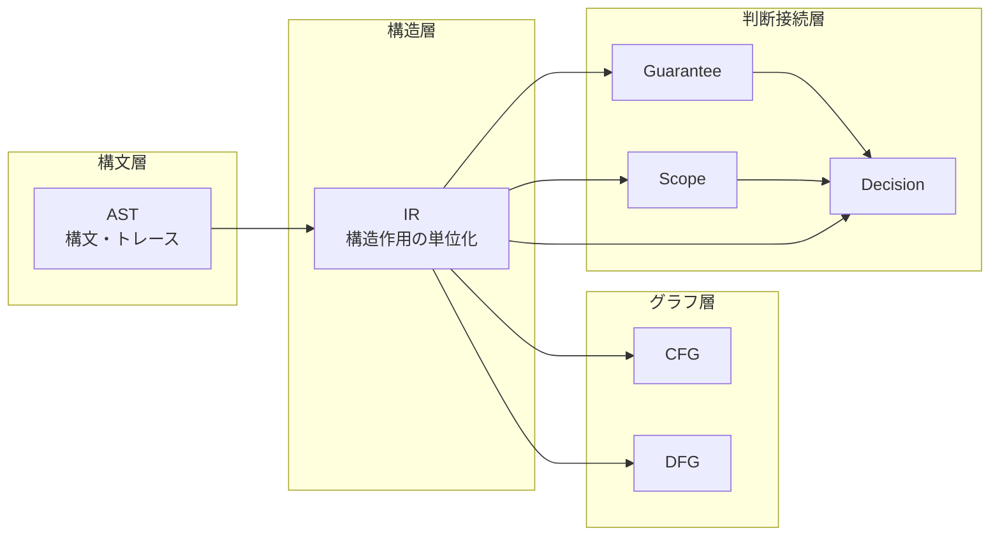

## 7. Relationship to Guarantee / Scope / Decision
**Guarantee** の観点から見れば、IR は保証を掛けうる構造候補を供給する。AST の構文カテゴリ名そのものではなく、作用のまとまりが保証の粒度と対応しうるからである。

**Scope** の観点から見れば、IR はスコープ境界候補を供給する。ループ単位、手続境界、境界作用のまとまり、呼出単位などは、閉じた推論対象の候補となる。

**Decision** の観点から見れば、IR は移行可否やリスクの **構造的根拠** を保持する。制御の非構造化、境界依存、終端の不統一、データ変換密度などは、IR 上で記述できる特徴であり、判断はそれらに依拠する。

この意味で IR は、構文から判断へ向かうための **根拠生成層** である。

## 8. Risks of Not Defining IR Properly
IR が未定義、あるいは AST と混同された場合、次の問題が生じる。

- CFG が構文追随に留まり、PERFORM や GO TO の実効構造を説明できない
- DFG が表層的になり、一文多作用や境界作用の分離が不十分になる
- Guarantee が対象単位を失い、主張の適用範囲が揺れる
- Scope が境界根拠を欠き、閉包や影響伝播の説明が弱くなる
- Decision が説明責任を持てず、判断が慣習依存になる

また、IR を実装寄りに定義しすぎた場合、研究基盤としての **理論的独立性** が失われる。特定生成物の都合で粒度や分類が揺れれば、比較可能性と再現可能性が損なわれる。

## 9. Summary
本稿は、IR を **構文層の次に置かれる構造作用層** として定義し、AST との差分、扱う責務範囲、CFG / DFG への接続、および Guarantee / Scope / Decision との判断接続を固定した。IR は構文の写しではなく、移行判断に耐える **構造単位への再編成** である。この定義は、Phase8 以後の Unit taxonomy、AST 写像、制御抽象、データ抽象、境界抽象の共通基盤となる。

---
# IR Design Principles

## 1. Why Design Principles Are Needed
IR の一文定義だけでは、設計判断の安定した基準は得られない。どの情報を落とし、どの作用を分離し、どの粒度で単位化するかは、文書や実装者の解釈差に敏感である。原則が不在だと、**AST への回帰**、**特定生成物への従属**、**グラフ層への先取り**、**判断層との不整合** が同時に発生し、研究としての比較可能性が損なわれる。

したがって本稿は、IR を **移行判断に耐える構造表現** として設計するための規範群を明示する。原則は、後続の Unit 分類・AST 写像・CFG / DFG 接続の **整合条件** として機能する。

## 2. Core Principles
本研究で IR 設計に従うべき中核原則を、次のように掲げる。

1. **構文従属回避**
2. **実装依存回避**
3. **構造作用優先**
4. **接続可能性維持**
5. **粒度一貫性**
6. **正規化可能性**
7. **境界明示性**
8. **判断単位への昇格可能性**

これらは独立した規則の列ではなく、IR を研究基盤として成立させるための相互依存的原則群である。

## 3. Detailed Explanation of Each Principle
### 3.1 構文従属回避
**定義**：IR の分類軸は parser が返す構文ラベルではなく、プログラムが **何をしているか** に基づく。

**必要性**：構文従属は、COBOL の表記揺れや句の差異を、そのまま分析差として固定してしまう。

**守らない場合の問題**：同じ作用が異なる構文形で別物として扱われ、差分分析や保証適用が不安定になる。

**他原則との関係**：正規化可能性と粒度一貫性を支え、実装依存回避とも補強し合う。

### 3.2 実装依存回避
**定義**：IR の形状を、特定ターゲット言語や生成ツールの都合で決めない。

**必要性**：研究基盤は資産横断の比較と判断の説明に耐えなければならない。

**守らない場合の問題**：生成都合で境界作用が内包化されたり、制御が均質化され、リスク説明が失われる。

**他原則との関係**：判断単位への昇格可能性や接続可能性維持の前提となる。

### 3.3 構造作用優先
**定義**：IR は命令の列ではなく、**制御・データ・境界などの作用の単位と関係** を表す。

**必要性**：DFG・Guarantee・Decision は、構文名ではなく作用に結びつく。

**守らない場合の問題**：一文多作用の分解や境界の分離ができず、依存やリスクの説明が粗くなる。

**他原則との関係**：接続可能性維持の内容を具体化する中心原則である。

### 3.4 接続可能性維持
**定義**：IR は、CFG・DFG・Guarantee・Scope・Decision へ橋を断たないよう設計される。

**必要性**：IR を孤立した中間物にすると、後段理論が各々別物になり、研究の一貫性が崩れる。

**守らない場合の問題**：グラフは存在しても IR と整合せず、判断は再び構文へ退行する。

**他原則との関係**：境界明示性や粒度一貫性と強く結びつく。

### 3.5 粒度一貫性
**定義**：同一の分析目的において、類似構造は類似の粒度で IR 化される。

**必要性**：比較、スライス、閉包、保証単位化は粒度が揃って初めて安定する。

**守らない場合の問題**：一部だけ過度に細かく、一部だけ粗い IR が生まれ、依存閉包や Scope の比較が歪む。

**他原則との関係**：正規化可能性と緊張関係を持ちうるため、目的に応じた意図的例外を後続文書で規定する必要がある。

### 3.6 正規化可能性
**定義**：意味的に近い構造を、IR 上で比較可能なパターンへ寄せる余地を持つこと。

**必要性**：資産間比較、パターン検出、保証テンプレの再利用に不可欠である。

**守らない場合の問題**：構文差がそのまま IR 差となり、「同じリスク」が検出できなくなる。

**他原則との関係**：構文従属回避の実効性を担保する。

### 3.7 境界明示性
**定義**：外部 I/O、CALL、環境依存、終端などの境界越え作用を、内部計算と混同しない。

**必要性**：移行リスクの主因はしばしば境界と契約である。

**守らない場合の問題**：READ と MOVE が同一視され、検証範囲やスコープ推定が誤る。

**他原則との関係**：DFG の副作用依存、Scope の境界候補、Decision のリスク説明と直結する。

### 3.8 判断単位への昇格可能性
**定義**：各 IR Unit が、Guarantee の対象、Scope の候補、Decision の根拠として語れるように設計すること。

**必要性**：IR が単なる実装都合の塊では、判断理論への接続が切れる。

**守らない場合の問題**：説明不能な黒箱単位が増え、監査可能性と再現性が失われる。

**他原則との関係**：接続可能性維持の判断層側の具体化である。

## 4. Tensions and Trade-offs Among Principles
原則群は相互に補強する一方で、いくつかの緊張を持つ。

第一に、**抽象化 vs 情報保持** である。作用優先は情報圧縮を促すが、CFG / DFG に必要な手掛かりを落とせば接続可能性が損なわれる。解は、意味に無関係な構文情報だけを削り、作用に関わる情報は保持することである。

第二に、**正規化 vs COBOL 特有性保持** である。過度の正規化は、PERFORM THRU や EVALUATE ALSO のような COBOL 特有の制御意味を消しかねない。解は、正規化パターンの上に由来タグや補助注記を許容し、比較可能性と固有性を両立することである。

第三に、**粒度細分化 vs 可読性** である。細かい IR は DFG や Guarantee には有利だが、人間レビューや Composite Unit の安定性を損なう可能性がある。そのため、基準粒度を固定し、必要時のみ分解する二段設計が望ましい。

## 5. Principles as Preconditions for Later Models
CFG に対しては、構造作用優先・境界明示性・接続可能性が、分岐・反復・移譲・終端の骨格を支える。DFG に対しては、作用優先と境界明示性が、def-use と副作用伝播の起点を支える。

Guarantee に対しては、判断単位への昇格可能性と粒度一貫性が、保証適用単位を支える。Scope に対しては、境界明示性と粒度一貫性が、閉じた対象の候補と伝播起点を支える。Decision に対しては、上記すべてが、リスクの構造的説明と証拠射程を支える。

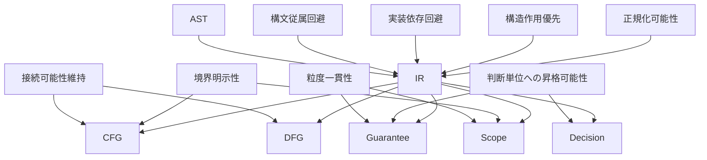

## 6. Summary
IR 設計原則は、定義を **運用可能な規範** に落とすものである。構文従属と実装依存を避けつつ、作用を中心に、グラフ層と判断接続層へ至る道を断たない。原則間の緊張は、正規化・粒度・固有性のバランスとして明示的に管理されるべきであり、この原則群が Phase8 全体の安定条件となる。

---
# IR Unit Taxonomy

## 1. What Is an IR Unit
**一文定義**：IR Unit とは、IR 上で識別される最小の意味ある構造作用のまとまりであり、制御・データ・境界などの観点から責務を型付けした分析単位である。

ここでいう Unit は、AST のノード型や COBOL の文法カテゴリそのものではない。`statement` は構文層の区切りであるが、必ずしも単一の作用に対応しない。したがって IR Unit は **文の写像先** として定義されつつも、必要に応じて **一文から複数 Unit へ分解** され、あるいは複数構文要素を **単一 Unit へ統合** しうる。これは、DFG の精度、Guarantee の適用粒度、Scope の閉包妥当性を同時に満たすためである。

## 2. Why a Taxonomy Is Needed
IR の定義と設計原則が与えられても、構成単位が不明確なままでは分析モデルにならない。分類体系がなければ、AST 写像は揺れ、CFG / DFG 接続は恣意化し、Guarantee / Scope / Decision に対しても統一した語彙を与えられない。

Taxonomy が必要なのは、IR を「ノードの寄せ集め」ではなく、**後続分析に耐える型付き構造** として扱うためである。特に重要なのは、分類を構文カテゴリ名で代用しないことである。さもなければ COBOL の表記揺れに分析が引きずられ、研究上の比較可能性が壊れる。

## 3. Classification Axes
IR Unit を配置する主要軸は次のとおりである。

- **制御作用**：実行順序・分岐・反復・移譲を変えるか
- **データ作用**：データ項の定義・参照・変換を行うか
- **状態遷移**：制御や処理モードに効く状態を更新するか
- **境界越え**：外部ファイル・他プログラム・端末・環境に触れるか
- **呼出**：手続やプログラム境界を跨ぐ移譲を伴うか
- **条件判定**：真偽や選択空間の分割を行うか
- **複合構成**：複数作用を束ねる単位か
- **終端 / 例外 / 中断**：終了や脱出を明示するか

これらは排他的な単軸分類ではなく、1つの Unit が複数軸に関与しうる。ただし、Taxonomy としては **主たる責務** を定める必要がある。

## 4. Proposed Taxonomy of IR Units
本研究で採用する型の族は、次の八類を中核とする。

1. **Control Unit**
2. **Condition / Guard Unit**
3. **Data Operation Unit**
4. **State Transition Unit**
5. **Boundary Interaction Unit**
6. **Invocation Unit**
7. **Composite Unit**
8. **Terminal Unit**

これらは、IR を **作用の型付き集合** として扱うための最小語彙である。

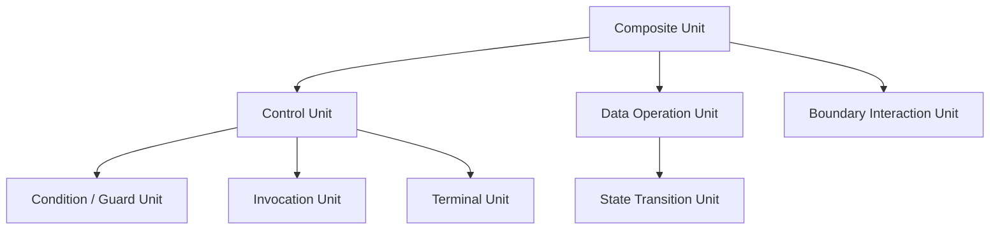

## 5. Detailed Description of Each Unit Type
### 5.1 Control Unit
**定義**：順序、分岐、反復、移譲など、制御フローの骨格を形成する Unit である。  
**典型 COBOL 構造**：IF、EVALUATE、PERFORM 系、GO TO、NEXT SENTENCE。  
**保持すべき情報**：分岐の型、合流点の有無、反復の終了条件、遷移先の種別。  
**後続分析との関係**：CFG のノード・辺候補であり、Scope の制御境界候補にもなる。

### 5.2 Condition / Guard Unit
**定義**：真偽や選択空間の分割を与える条件評価 Unit である。  
**典型 COBOL 構造**：IF 条件、EVALUATE の選択条件、PERFORM UNTIL の条件。  
**保持すべき情報**：条件式の抽象、参照データ、選択空間の分割型。  
**後続分析との関係**：CFG では branch / dispatch の条件核となり、DFG では use 側の候補になる。

### 5.3 Data Operation Unit
**定義**：内部データの更新・変換・集約・分解を担う Unit である。  
**典型 COBOL 構造**：MOVE、COMPUTE、ADD、STRING、UNSTRING、INSPECT。  
**保持すべき情報**：source、target、変換の型、位置依存性。  
**後続分析との関係**：DFG の中心であり、Guarantee のデータ不変条件に直結する。

### 5.4 State Transition Unit
**定義**：処理モードや制御状態に影響する状態遷移を明示する Unit である。  
**典型 COBOL 構造**：フラグ更新、状態コード設定、制御スイッチ変更。  
**保持すべき情報**：遷移前後の状態役割、制御への影響。  
**後続分析との関係**：CFG・DFG の両方にまたがり、Decision 上の複雑性説明に効く。

### 5.5 Boundary Interaction Unit
**定義**：外部リソース、他手続、端末、環境との交差を持つ Unit である。  
**典型 COBOL 構造**：READ、WRITE、REWRITE、CALL、ACCEPT、DISPLAY。  
**保持すべき情報**：境界種別、方向、外部依存、可観測副作用。  
**後続分析との関係**：Scope の外縁候補、Guarantee 困難性、Decision リスク要因となる。

### 5.6 Invocation Unit
**定義**：手続呼出や範囲実行に伴う制御移譲を表す Unit である。  
**典型 COBOL 構造**：CALL、PERFORM paragraph、PERFORM THRU。  
**保持すべき情報**：移譲先、戻り点、範囲、呼出規律。  
**後続分析との関係**：CFG の手続境界、Scope の階層化、Decision の結合度説明に使われる。

### 5.7 Composite Unit
**定義**：複数の Unit を1つの論理塊として束ねる Unit である。  
**典型 COBOL 構造**：paragraph 群、トランザクション的手続のまとまり、複合制御ブロック。  
**保持すべき情報**：内部 Unit 列、入口・出口、外部インタフェース。  
**後続分析との関係**：Scope 候補や移行単位候補の中間表現となる。

### 5.8 Terminal Unit
**定義**：終了、復帰、中断、停止を明示する Unit である。  
**典型 COBOL 構造**：STOP RUN、GOBACK。  
**保持すべき情報**：終了種別、戻り先の有無、実行停止の範囲。  
**後続分析との関係**：CFG の出口候補であり、Decision の切替可能性や安全停止性に関わる。

## 6. Relationships Among Unit Types
IR Unit 間には、少なくとも次の関係が定義できる。

- **包含**：Composite Unit が他の Unit を内部に持つ
- **依存**：Data Operation Unit が Condition / Guard Unit や Boundary Interaction Unit に依存する
- **合成**：複数の Unit が sequence / nested / boundary-inclusive に束ねられる
- **派生**：複数 AST ノードから単一 IR Unit が派生することがある

この関係整理により、IR は単なる型一覧ではなく、**型どうしがどう組み合わさって構造を作るか** を表す体系になる。

## 7. Risks of Poor Taxonomy
分類が曖昧だと、同じ作用が複数型に散らばり、CFG・DFG の生成規則が衝突する。分類を文法カテゴリに回収すると、parser のラベルがそのまま Unit 名になり、表記揺れが分析差になる。逆に過度に細分化しすぎると、Composite Unit なしには Scope が組めず、レビューも困難になる。

したがって、良い Taxonomy とは、細かさを競うものではなく、**後続分析と判断接続に必要な区別をちょうどよく保持する分類** である。

## 8. Summary
IR Unit Taxonomy は、IR を **構文ではなく作用** で型付けする枠組みである。本稿では、Control、Guard、Data Operation、State Transition、Boundary Interaction、Invocation、Composite、Terminal の八類を中核とし、それぞれの責務と後続分析との関係を整理した。この分類の安定が、AST 写像、CFG / DFG 接続、Guarantee / Scope / Decision への接続全体の基盤となる。

---
# AST to IR Mapping

## 1. Why Mapping Is Needed
AST は構文層として、観測の忠実さとトレーサビリティを与える。しかし移行判断に必要なのは、制御・データ・境界の **作用のまとまり** である。写像は、AST が持つ構文情報を **失わずに参照可能** に残しつつ、IR が要求する単位へ **再構成** する操作として位置づけられる。

写像段階で保存すべきは、ソース位置、構文由来の識別子、コンテナ階層などの根拠である。再構成すべきは、一文多作用の分割、補助句の統合、paragraph / section を制御境界としての単位へ昇格させることである。したがって AST→IR 写像は、単なる変換ではなく **構文層から構造層への射影規則** である。

## 2. Mapping Principles
AST→IR 写像には、少なくとも次の原則が必要である。

- **作用優先**：ノード数の一致ではなく、作用責務がどの IR Unit 型に載るかを基準にする
- **トレーサビリティ保持**：各 IR Unit は、根拠となる AST 範囲へ逆参照できる
- **単位一貫性**：同じ構造パターンは同じ族の IR パターンへ寄せる
- **判断接続の予約**：Guarantee / Scope / Decision が参照しうる境界・終端・呼出規律を欠落させない

これらにより、AST から IR への写像は、正規化の入り口でありながら、判断材料の元情報を失わない形で行われる。

## 3. Basic Mapping Patterns
写像の基本パターンは少なくとも次のとおりである。

### 3.1 1対1写像
単一構文要素が単一 IR Unit になる場合である。単純な MOVE や明確な終端文などが典型である。

### 3.2 1対多写像
単一構文が複数 IR Unit に分解される場合である。一文に I/O とデータ更新が混在する場合や、PERFORM が呼出・反復・範囲実行を同時に含む場合がこれに当たる。

### 3.3 多対1写像
複数 AST ノードが単一 IR Unit に統合される場合である。補助句を親作用へ吸収したり、複数の構文断片を1つの Boundary Interaction Unit として扱う場合がある。

### 3.4 コンテナ→境界写像
paragraph / section のような構文コンテナが、IR では **境界単位や呼出可能領域** として意味を持つ場合である。

### 3.5 補助句の吸収
冗長な clause や補助的構文が、独立 Unit ではなく親 Unit に帰属する場合である。

### 3.6 条件表現の統合
IF や EVALUATE における条件部分を、Guard Unit と Control Unit の関係として統合する場合である。

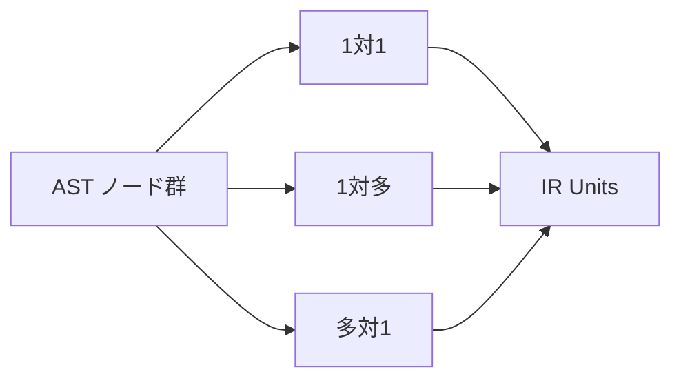

## 4. Mapping Rules for Major COBOL Structures
### 4.1 paragraph / section
構文的にはコンテナだが、IR では PERFORM や GO TO の対象・範囲・遷移先として **制御境界** を持つ。必要に応じて Composite Unit や Invocation Unit の核になる。

### 4.2 IF
Guard Unit と Branch 型 Control Unit に分解される。暗黙の join は制御抽象として保持される。

### 4.3 EVALUATE
複数 Guard と Dispatch 型 Control Unit の組合せに写される。単なる switch 還元ではなく、条件空間分割として扱う余地を持つ。

### 4.4 PERFORM
Invocation、Iteration、あるいは bounded-range execute の複合として写される。PERFORM THRU は単一 call に潰してはならない。

### 4.5 MOVE / COMPUTE
Data Operation Unit へ写される。ただし一文複数作用を含む場合は 1対多写像となる。

### 4.6 READ / WRITE
Boundary Interaction Unit として写される。成功 / 失敗経路は Control Unit と結びつき、I/O 後のデータ更新は Data Operation Unit として分離しうる。

### 4.7 CALL
Invocation Unit として写される。引数の流れは後続の DFG 接続で扱う手掛かりを持つ。

### 4.8 STOP RUN / GOBACK
Terminal Unit に写される。プログラム停止と呼出元復帰は意味上区別される。

## 5. Information Preserved, Added, and Lost
### 保持する情報
- ソース位置
- AST ノード由来の識別子
- コンテナ階層
- paragraph / section 所属

### IR 生成時に新たに付与する情報
- IR Unit 型
- 作用カテゴリ
- 制御境界タグ
- 正規化パターン ID
- 判断接続用の注記

### 失われうる情報
- 冗長な構文飾り
- 意味に影響しない句の表出差
- 正規化により吸収される表記揺れ

### 後続層へ渡す情報
- 制御骨格
- データ作用候補
- 境界・呼出・終端フラグ
- 条件依存の骨格

## 6. Mapping as the Entry Point of Normalization
AST→IR 写像は、**正規化の第一段** である。clause ベースで散らばる条件や、同一意味の異なる構文形を、IR 上の Guard / Control / Data / Boundary のパターンへ寄せる。完全な正規化は `08_IR-Composition-and-Normalization.md` で扱うが、写像時点で **何を揃え、何を固有タグとして残すか** を決めておかなければ、後続の比較・差分分析は安定しない。

## 7. Risks and Failure Modes
写像が曖昧な場合、同じ AST パターンが異なる IR に散らばり、比較不能になる。情報を落としすぎると、境界作用や終端が消え、CFG / DFG / Decision が過小評価を起こす。AST の粒度と IR の粒度が整合しない場合、Guarantee や Scope の単位が揺れ、研究全体の説明責任が弱くなる。

## 8. Summary
AST→IR 写像は、構文層から構造層への射影規則である。1対1 / 1対多 / 多対1、コンテナの境界化、補助構文の吸収を通じて、CFG / DFG および判断接続層へ一貫した入力を与える。写像は正規化の入口でもあり、ここでの規律が後続全体の安定性を決定する。

---
# IR Control Abstraction

## 1. Why Control Abstraction Is Needed
AST は IF や PERFORM を構文的に正しく表す。しかし CFG は **遷移** を、Scope は **境界と閉包** を、Decision は **非構造化や手続結合** を論じる。これらに直結するのは、「branch か」「dispatch か」「反復か」「移譲か」といった **制御作用のカテゴリ** である。IR 上で制御を抽象化せずに CFG を生成すると、構文ノードの数だけノードが増え、join や loop back edge が不明瞭になり、説明不能なグラフが生成されやすい。

したがって制御抽象は、CFG 直接生成の前段として、制御の意味カテゴリを固定する作業である。ここで問うのは「どう辺を張るか」ではなく、「何を制御単位として数えるか」である。

## 2. Core Categories of Control in IR
IR における制御の中核カテゴリは次のとおりである。

- **Sequence**：順次進行
- **Branch**：二択または少数択の条件分岐
- **Dispatch**：条件空間の分割に基づく多択
- **Iteration**：条件またはカウンタに基づく反復
- **Jump**：無条件または条件付きの直接遷移
- **Return / Exit / Termination**：手続・プログラムの終了や復帰

これらは Control Unit / Guard Unit / Terminal Unit と組み合わさり、Invocation Unit とも交差する。制御抽象の目的は、COBOL の多様な制御記法を、このような安定した構造カテゴリへ還元することである。

## 3. Abstraction of Major COBOL Control Structures
### IF
Guard Unit と Branch 型 Control Unit の組として扱う。条件と分岐骨格を分離し、暗黙の合流点を制御抽象として保持する。

### EVALUATE
Dispatch として扱う。単純な switch 還元に閉じず、**条件空間の分割** として理解する。ALSO や複合条件は dispatch の内部構造として保持される。

### PERFORM paragraph
Invocation に近い手続範囲実行として扱う。戻り点が重要な要素であり、単なる Jump とは異なる。

### PERFORM THRU
範囲実行として扱う。単一呼出ではなく、複数 paragraph にまたがる制御範囲として抽象化する。

### PERFORM UNTIL / VARYING
Iteration として扱う。条件 Guard、本体 Sequence、戻り条件を分けて記述することで、後続の CFG 接続が安定する。

### GO TO
Jump として扱う。参照先 paragraph / section は制御境界上のラベルとして IR に現れる。

### NEXT SENTENCE
局所的スキップに相当する Jump / 順序調整として扱う。これは構造化を阻害する要因であり、Decision でも重要なリスクになる。

### STOP RUN / GOBACK
Termination として扱う。プログラム停止と呼出元への復帰は、意味上区別されるべき終端種別である。

## 4. Paragraph and Section as Control Boundaries
paragraph / section は、単なる構文コンテナではない。PERFORM の対象、GO TO の着地点、THRU の範囲端、スコープ候補としての **callable region** を形成しうる。

IR では、少なくとも次を区別する必要がある。

- **参照先**：名前解決されたエントリ
- **遷移先**：Jump の着地点
- **戻り先**：Invocation や範囲実行後の復帰点

これらは AST のコンテナ階層だけでは十分に固定されないため、IR の制御抽象で明示される必要がある。paragraph / section を制御境界として扱うことにより、後続の CFG・Scope・Decision との接続が安定する。

## 5. Connection from IR Control Units to CFG
IR の制御抽象は、CFG において次のような構造へ橋渡しされる。

| IR 制御抽象 | CFG 上の対応 |
|-------------|--------------|
| Sequence | 直列の辺 |
| Branch | 分岐辺と join |
| Dispatch | 多分岐と合流 |
| Iteration | ループヘッダ、back edge、出口 |
| Jump | 直接辺、または中間ノードを介した遷移 |
| Termination | 出口ノード |

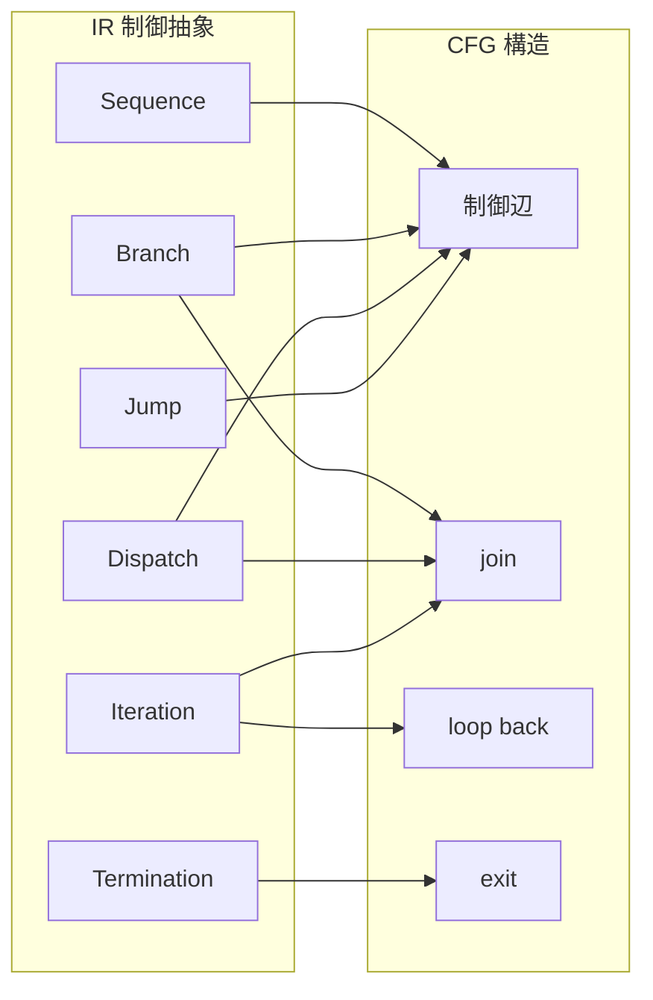

IR は join の要請、loop の戻り、終端の種別を意味の上で保持し、CFG フェーズがそれを具体グラフへ落とす。IR を飛ばすと、これらの説明責任が CFG 単体へ押しつけられ、構造理解が不安定になる。

## 6. Risks and Pitfalls
PERFORM を単純 call とみなすと、THRU、反復、戻り点が失われ、Scope や CFG が実構造から乖離する。EVALUATE を単純 switch とみなすと、条件領域の重なりや ALSO の意味を落とし、Guard の依存と分岐の説明が不足する。GO TO の扱いを曖昧にすると、着地点が構造上どこにあるかを見失い、非構造化リスクを過小評価する。

## 7. Summary
IR における制御抽象は、COBOL の手続制御を Sequence / Branch / Dispatch / Iteration / Jump / Termination に整理し、paragraph / section を **制御境界** として明示する作業である。これにより CFG への橋が意味的に整い、Guarantee / Scope / Decision は制御複雑性を構造的に説明できる。本稿の抽象は実装アルゴリズムではなく、解析と判断のための分類である。

---
# IR Data Operation Model

## 1. Why Data Operation Abstraction Is Needed
データ作用抽象とは、AST 層で観測される文法上のデータ操作を、移行判断と依存分析に耐える **構造的作用単位** へ再編成する IR 上のモデルである。AST は MOVE や STRING を構文ノードとして識別できるが、同一の構文形が異なる意味的作用、たとえば単純代入、変換、分解、集約を内包しうる。したがって DFG を前提とする分析では、**文法ラベルではなく作用の種類とデータ関係** を IR で明示しなければならない。

この抽象が必要な理由は三つある。第一に、構文層だけでは依存の実効的形が定まらないこと。第二に、COBOL は一文に複数のターゲットや中間領域を含みうるため、文単位のままでは DFG の辺候補が過剰統合または過剰分割されること。第三に、移行判断では「何がどのデータ状態をどう変えるか」が説明責任の中心となるため、Guarantee / Scope / Decision が参照できる観測可能な作用記述が必要なことである。

## 2. Core Categories of Data Operations
IR 上のデータ操作は、少なくとも次の分類軸で整理される。

| 区分 | 意味 |
|------|------|
| Assignment | 値または参照先の束縛・複写 |
| Transformation | 演算や変形による意味内容の変化 |
| Aggregation | 複数ソースから単一ターゲットへの収束 |
| Decomposition | 単一ソースから複数ターゲットへの分配 |
| Initialization | 既定状態への初期化・正規化 |
| Formatting / Rearrangement | 書式や配置の再構成 |
| Position-dependent operation | 桁・区切り・位置に依存する処理 |

これらは構文名による区別ではなく、**作用意味** による区別である。同じ MOVE でも単純 Assignment の場合と Formatting を伴う場合があり、同じ STRING でも Aggregation と Position-dependent operation の複合になることがある。

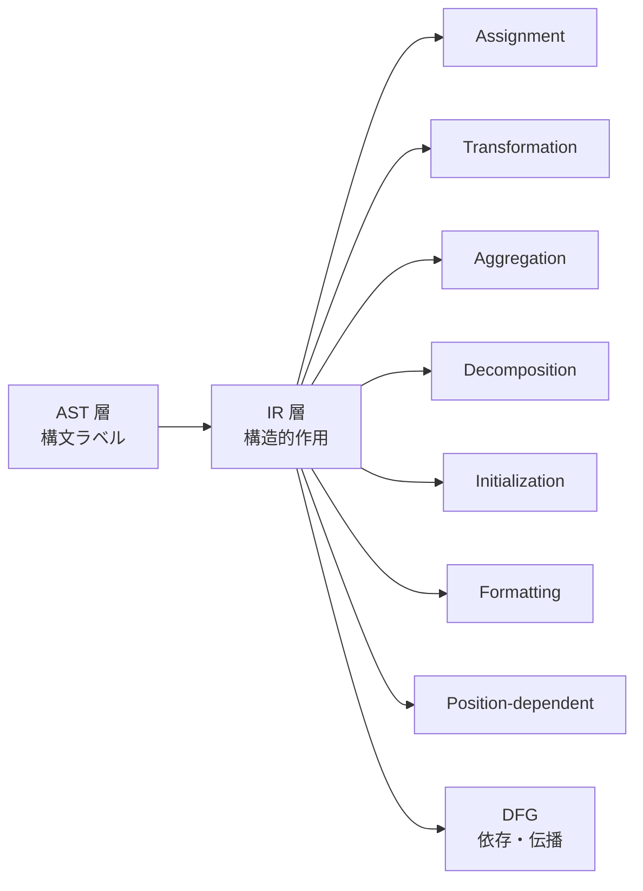

## 3. Abstraction of Major COBOL Data Operations
### MOVE
単純複写から、編集項目や対応付けによる再配置まで幅がある。IR ではコピー単位と位置依存の有無を区別し、単一 Assignment に還元できない場合は Formatting や Decomposition を伴うものとして扱う。

### COMPUTE
典型的には Transformation である。演算、丸め、条件付き更新などがあれば、Transformation と Assignment の合成として読む。

### ADD / SUBTRACT / MULTIPLY / DIVIDE
ターゲットへの累積更新として、Transformation + Assignment とみなすのが自然である。SIZE ERROR のような制御的分岐は別の Control Unit との合成になる。

### INITIALIZE
Initialization に分類される。単純なゼロクリアではなく、「論理領域を既定状態へ戻す」という意味で扱う。

### INSPECT
置換、検査、カウントを含みうるため、Transformation と Position-dependent operation の複合として扱うことが多い。

### STRING
複数ソースの連結は Aggregation、ターゲット領域への書込は Assignment である。POINTER のような位置状態更新は必要に応じて別作用として切り出す。

### UNSTRING
単一ソースから複数受け手への分配であるため、Decomposition と Position-dependent operation の複合として扱う。

## 4. Information Retained in Data Operation Units
各データ作用 IR Unit は、最低限次の情報を保持すべきである。

- **source**：読取・参照となる論理オペランド
- **target**：書込・更新対象
- **intermediate transformation**：source から target への意味写像の種別
- **positional dependency**：桁、区切り、オフセット、配置依存の有無
- **side effect possibility**：例外経路や外部作用と接続する可能性

ここで重要なのは、IR が構文木の写しを保持することではなく、**後続の DFG・Guarantee・Scope が必要とするデータ作用の骨格** を保持することである。

## 5. Connection from IR Data Units to DFG
DFG は IR のデータ作用を母体として構築される。接続規則の骨格は次のとおりである。

- **def / use**：target を def、source を use として展開する
- **transformation edge**：COMPUTE や INSPECT のような変換作用を、変換依存として展開する
- **aggregation / decomposition edge**：STRING / UNSTRING のような多対一、一対多の関係を保持する
- **state change**：フラグや状態項目の更新を、単純データ流に埋め込まず状態変化として注記する

Guarantee への接続では、どの変換が不変条件を破りうるかを特定する手掛かりになる。Scope への接続では、データ作用の伝播外縁がスコープ候補の根拠になる。

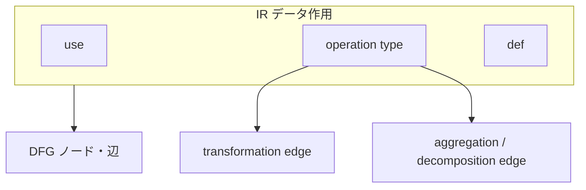

## 6. Risks and Failure Modes
見た目の文法差だけで分類すると、同じ Aggregation が別物の DFG になる。複合操作を単一代入として扱うと、STRING / UNSTRING のような分割・収束構造が消え、移行リスクを過小評価する。位置依存性を落とすと、INSPECT や編集 MOVE のような処理が移行後に非等価になりやすい。副作用可能性を無視すると、境界モデルとの接続が崩れ、Guarantee の適用範囲が曖昧になる。

## 7. Summary
データ作用は AST の構文ラベルではなく、IR 上では Assignment、Transformation、Aggregation、Decomposition、Initialization、Formatting、Position-dependent operation として再分類される。主要 COBOL 操作はいずれもこれらの合成として記述され、DFG では def / use、変換辺、集約・分解辺として展開される。この抽象が、Guarantee / Scope / Decision に対するデータ観点の説明可能性を支える。

---
# IR Boundary and Side Effect Model

## 1. Why Boundary Modeling Is Needed
境界作用とは、手続内部の論理データ更新だけで完結せず、**外部資源・他手続・利用者・実行環境** と交差する IR 上の構造的作用である。通常のデータ操作と境界作用を同一の箱に入れると、依存分析は **観測可能な変化の所在** を誤り、移行では契約・プロトコル・環境差に関するリスクがデータ流の中へ埋没する。

境界を IR で分離する理由は三つある。第一に、Guarantee はしばしば手続内の不変条件だけでは語れず、ファイル属性や呼出規約のような **外部前提** に依存するからである。第二に、Scope は有界な意味対象を選ぶが、境界作用はその **外縁** を定義しうるからである。第三に、Decision は「何が変えられ、何が観測されるか」を説明できなければならず、境界を隠すと判断根拠が内部実装の見かけへ還元されるからである。

## 2. Types of Boundaries in IR
IR は少なくとも次の境界種別を区別する。

| 境界種別 | 指すもの |
|----------|----------|
| File boundary | ファイル・レコード格納との交差 |
| Procedure / program boundary | CALL や他コンパイル単位への越境 |
| User / terminal boundary | ACCEPT / DISPLAY などの端末入出力 |
| External system boundary | 外部サブシステムやメッセージ先との交差 |
| Environment boundary | 日付、環境値、実行条件へのアクセス |

これらの境界は、単なる入出力デバイス分類ではなく、**どこで内部の意味空間が外部の契約や状態と接続されるか** を示す構造区分である。

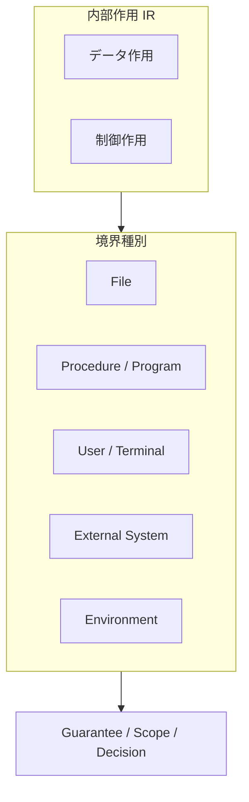

## 3. Major COBOL Boundary Operations
### READ / WRITE / REWRITE / DELETE / START
File boundary の中核である。レコード存在、順序、鍵、ファイル状態は可観測状態を更新しうるため、単純なデータ移送として扱ってはならない。

### CALL
Procedure / program boundary の典型である。パラメタ契約、共有ストレージ、呼出規約は外部依存として IR に現れる。

### ACCEPT / DISPLAY
User / terminal boundary を構成する。人間観測可能な状態変化として、テスト容易性や移行後 UI 代替の議論に直結する。

### SORT / MERGE
ファイルと一時領域にまたがる複合境界として扱う。詳細アルゴリズムではなく、入出力集合と順序意味を保持することが重要である。

これらは AST では文種として識別されるが、IR では **Boundary Interaction Unit** として通常の Data Operation Unit と型を分ける。

## 4. Side Effects as Structural Elements
本研究における副作用は、単なる実装上の副次結果ではなく、**構造概念** である。少なくとも次の三点で捉えられる。

- **可観測状態変化**：プロセス外または手続外から観測可能な結果の変化
- **内部状態変化との区別**：WORKING-STORAGE の更新は内部状態であり、外部資源更新とは区別される
- **外部依存の存在**：境界作用は前提となる資源・契約を伴う

副作用を構造概念として扱うことで、IR は「何が変わったか」だけでなく、「その変化が内部に閉じるのか外部へ漏れるのか」を明示できる。

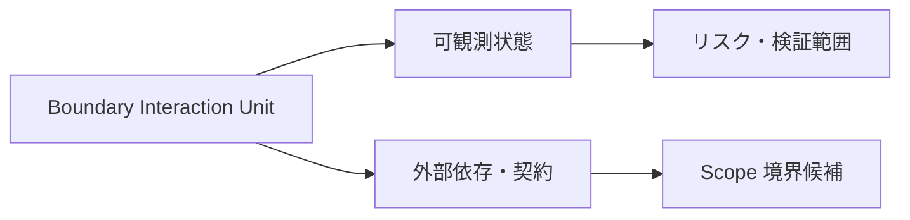

## 5. Connection to Guarantee / Scope / Decision
Guarantee に対しては、境界作用は **保証困難性** を高める。なぜなら外部振る舞いが閉じた意味空間に含まれにくく、保存主張には環境や資源の前提が必要になるからである。

Scope に対しては、境界作用の集合が **Scope boundary candidate** となる。ファイル読書きのまとまり、CALL 連鎖の入口、端末入出力の塊は、どこまでを一つの有界対象とみなすかの根拠になる。

Decision に対しては、境界の種類と密度が直接の **リスク指標** になる。I/O 集中、深い CALL 依存、未文書化の外部境界は、移行可否、段階移行、ラッパ要否を左右する。

## 6. Risks and Pitfalls
境界を見落とすと、READ を単なる代入として扱い、順序・鍵・再実行安全性が判断から消える。CALL を内部関数化してしまうと、Scope と DFG が実依存より狭くなる。WRITE を単純な target 更新とみなすと、永続化とロールバックの問題が Guarantee から脱落する。

## 7. Summary
境界作用は通常のデータ作用と型を分離し、File、Procedure、User、External System、Environment の境界種別として IR に現れる。副作用は実装細目ではなく、**可観測状態と外部依存** を伴う構造として記述される。Guarantee / Scope / Decision はいずれも境界を前提・外縁・リスクとして読む必要があり、IR はそのための基盤単位を供給する。

---
# IR Composition and Normalization

## 1. Why Composition Matters
IR Unit の分類だけでは、プログラム片を **比較可能なまとまり** として扱えない。実際の COBOL は、文の列、入れ子の条件、反復、境界作用が **合成** された形で現れる。合成規則がなければ、同一の意味構造を異なる表層列として扱ってしまい、Scope の包含関係や Guarantee の適用範囲の比較が不安定になる。

合成が必要なのは、解析対象が常に複合的であり、CFG / DFG が単一 Unit ではなく **Unit の配置関係** に依存し、Migration Decision も単文ではなく手続やスライス全体に対して下されるからである。

## 2. How IR Units Compose
IR の合成は、少なくとも次の形として整理される。

| 合成の形 | 意味 |
|----------|------|
| Sequence composition | 実行順序に沿った隣接合成 |
| Nested composition | 条件・境界の内側に入れ子で含まれる合成 |
| Conditional composition | 分岐により排他的に選ばれる合成 |
| Iterative composition | 反復により繰り返される合成 |
| Boundary-inclusive composition | 内部作用と境界作用を同一塊として束ねる合成 |

Composite Unit は、これらの合成規則によって形成される **論理的なまとまり** である。重要なのは、Composite が AST の入れ子そのものではなく、観測・保証・判断の単位を選ぶための階層だということである。

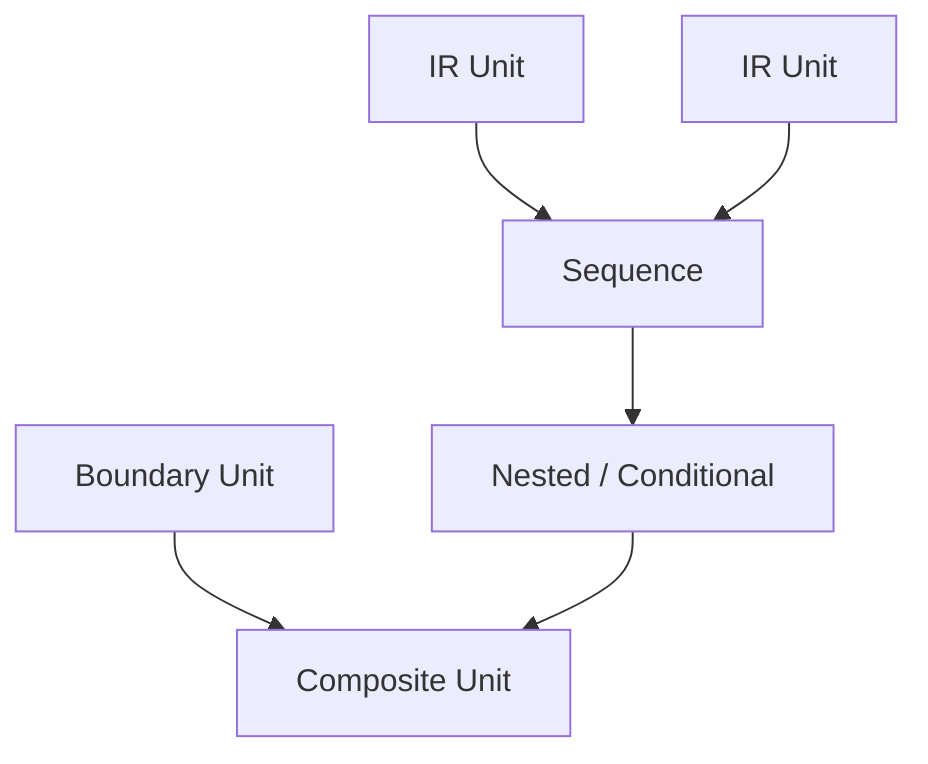

## 3. Why Normalization Is Needed
正規化とは、構文表現の揺れを吸収し、IR 上で **同型の意味構造を同型に見せるための理論的操作** の族である。目的は次の三つである。

- **比較可能性**：資産間・版間で同じパターンかどうかを構造作用で照合する
- **差分分析可能性**：変更の意味的影響を表記差ではなく作用差で捉える
- **Guarantee / Scope 単位化**：保証適用域と有界対象を正規形上の境界で安定化する

正規化がなければ、構文差がそのまま IR 差となり、同じ構造リスクや保証テンプレートを再利用できない。

## 4. What Should Be Normalized
正規化対象として、少なくとも次を想定する。

- **複合文の分解**：一文多作用を作用単位へ分離する
- **入れ子構造の平準化**：解析上は比較可能な制御骨格へ寄せる
- **条件表現の整形**：同値な条件を比較しやすい標準形へ寄せる
- **制御終端の明示**：分岐、ループ、終了の出口を一意に参照可能にする
- **作用単位への分離**：制御・データ・境界が同一文に混在する場合に型分離する

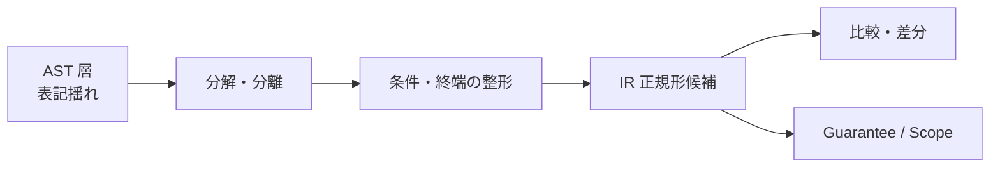

## 5. Limits of Normalization
正規化には限界がある。COBOL 特有構造を失いすぎれば、PERFORM THRU や特殊な境界処理の意味が消える。抽象化しすぎれば、リスクパターンの識別が不可能になる。さらに、桁、符号、編集、端数処理など **意味的非等価になりうる差異** は、正規化で潰してはならない。

したがって正規化は、情報削除ではなく **等価類への整列** と理解されるべきである。保持すべき差異と吸収すべき揺れを分けることが核心である。

## 6. Risks and Failure Modes
正規化しない場合、同一パターンが散在し、Guarantee テンプレートや Scope 候補の再利用が効かなくなる。過正規化した場合、トレーサビリティが失われ、監査や説明責任を満たせなくなる。粒度が崩壊すると、分解しすぎて Composite の意味が壊れるか、統合しすぎて境界が見えなくなる。

## 7. Summary
合成は IR を **手続的意味のまとまり** として扱うための規則であり、正規化は **比較・差分・判断単位の安定** のための規則である。両者は異なる概念だが、互いに補完しあう。AST 層の多様な表現は IR 層で型付きの作用と合成に収斂し、そこから CFG / DFG および Guarantee / Scope / Decision へ一貫した橋が架けられる。

---
# IR Connection to CFG and DFG

## 1. Why the Connection Layer Is Needed
IR は構造的作用の整理層であり、単体では制御の全順序やデータ依存の閉包をグラフとして固定しない。CFG / DFG は解析・検証・移行判断に不可欠だが、AST から直接グラフを構築すると、構文ノードの粒度と作用の粒度が不一致となり、分岐の合流や def / use の実効が歪みやすい。

接続層が必要なのは、IR がすでに **branch / loop / join / exit** および **def / use / transformation** を型付けしており、それを CFG / DFG へ渡すための理論的インタフェースになるからである。また、制御依存とデータ依存を混同しないためにも、AST とグラフのあいだに IR を置く必要がある。

## 2. IR to CFG Connection
IR の制御抽象は、CFG において次の対応を持つ。

| IR 側の骨格 | CFG 側の読み |
|-------------|--------------|
| Sequence | 直列の制御流れ辺 |
| Branch | 条件付きの複数後続 |
| Loop | 後退辺・継続条件 |
| Join | 分岐後の合流点 |
| Exit | 手続・段落・プログラムからの脱出 |
| Jump | GO TO 等の非構造化遷移 |
| Procedure boundary | PERFORM / CALL に伴う入口・出口・復帰 |

IR は CFG のノードや辺をそのまま与えるのではなく、**何がノード候補であり、どこで流れが分かれ、どこで閉じるか** を定める。特に paragraph / section の制御境界、PERFORM の戻り点、STOP RUN / GOBACK の終端種別は、CFG 側で安定した表現を得るための重要な手掛かりである。

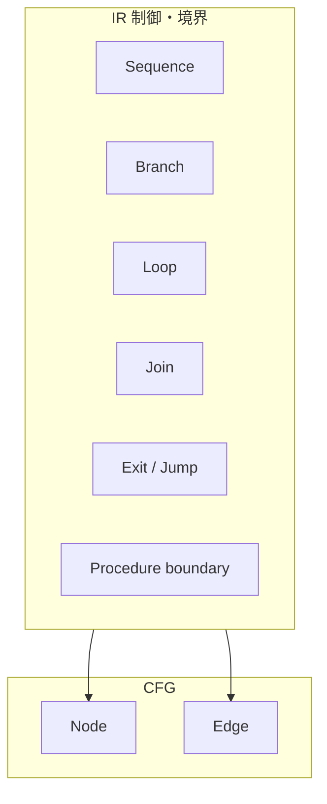

## 3. IR to DFG Connection
IR のデータ作用・境界作用は、DFG において次の対応を持つ。

| IR 側の作用 | DFG 側の読み |
|-------------|--------------|
| def / use | 変数・論理領域の定義・使用 |
| transformation | 演算や書式変換による依存 |
| propagation | 複数文にわたる値の伝播 |
| decomposition / aggregation | 一対多・多対一のデータ構造依存 |
| side effect influence | 境界作用による外部状態依存 |

ここで重要なのは、制御 IR とデータ IR を分けておくことである。条件付き def / use のような場合でも、制御辺とデータ辺を同一視してはならない。IR はそれらの交点を明示しつつ、型の混同を防ぐ層として働く。

## 4. Node Generation Rules
CFG ノード候補となるのは、制御上 **順序が分かれる最小作用点**、分岐、合流、ループ頭、手続境界の入口 / 出口、ジャンプの着地点である。単純データ作用は必ずしも独立 CFG ノードを要しないが、制御上重要な観測点と結びつく場合はノード化されうる。

DFG ノード候補となるのは、**def / use が生じる単位**、変換の演算節、境界作用の可観測イベントである。同一文から複数 DFG ノードが生じることもありうる。

一対一でない場合の扱いも明記されるべきである。複合 IR は複数 CFG ノードまたは複数 DFG ノードへ展開されうるし、逆に意味的に透明な中間はグラフ上で省略されうる。ただし、その場合もトレーサビリティは維持されなければならない。

## 5. Edge Generation Rules
### control flow edge
IR の順序合成と分岐選択から生成される。Jump は例外的遷移や非構造化遷移として辺化される。

### control dependence edge
条件がどの作用の実行可否に効くかを、IR 上の Branch / Dispatch 構造から導く。

### data flow edge
def から use への値依存を表す。Transformation や Aggregation / Decomposition は、その種別に応じた中間構造を介して展開される。

### dependency propagation
境界作用は外部ノードへ接続され、影響分析やスライスの起点になる。

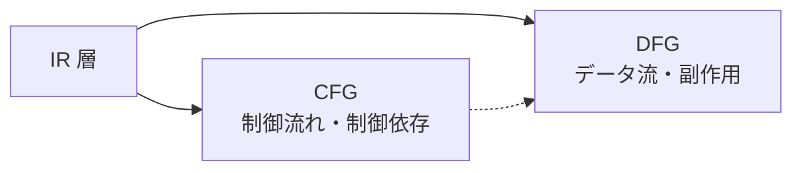

## 6. Risks and Failure Modes
IR 側で合流や出口が十分に表現されていないと、CFG に偽の直列が入りやすい。接続規則が曖昧だと、同じ IR が CFG と DFG で別物として数えられ、Scope の射影が不整合になる。DISPLAY や CALL のような境界作用を制御のみ、またはデータのみへ寄せすぎると、検証範囲と依存範囲の両方が誤る。

## 7. Summary
IR は CFG / DFG の **母体** である。CFG 接続は sequence、branch、loop、join、exit、jump、procedure boundary をノードと制御辺へ写像し、DFG 接続は def / use、transformation、propagation、aggregation / decomposition、副作用をデータ辺へ写像する。ノード生成と辺生成を区別し、一対一を前提にしないことが、後続フェーズ `30_cfg`・`40_dfg` に耐える接続設計となる。

---
# IR Connection to Guarantee, Scope, and Decision

## 1. Why IR Must Connect to Judgment Models
本研究における IR は、変換パイプライン上の実装都合の中間形式ではない。AST で得た構造を **構造的作用** として再編し、Guarantee / Scope / Decision という **判断接続層** へ渡すための層である。Guarantee は「何が保存されるか」を、Scope は「何に対して推論するか」を、Decision は「移行が許容されるか」を扱うが、いずれも **根拠の載る単位** がなければ説明責任を果たせない。IR はその判断可能構造単位の供給源である。

IR が判断モデルに接続されない場合、Guarantee は構文の見かけに張り付き、Scope は恣意的な区切りになり、Decision は再現可能な根拠を欠く。Phase8 の価値は、この接続を理論として固定することにある。

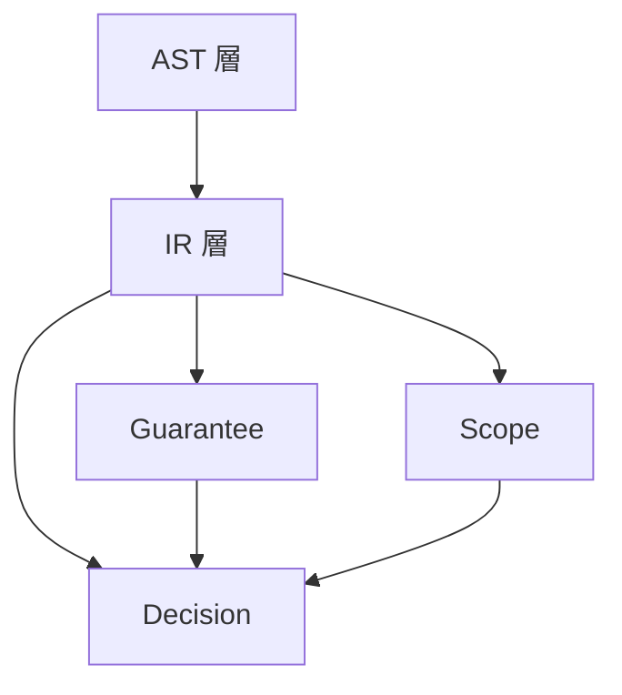

## 2. IR and Guarantee
Guarantee Unit は保存主張の **評価単位** であり、IR Unit は作用・境界・制御の **観測単位** である。両者は一対一に対応するとは限らない。単一の Guarantee が複数 IR Unit の合成に掛かることもあれば、単一 IR Unit が複数保証観点を持つこともある。

IR が Guarantee に接続されるのは、IR が「この作用の下で何が変わるか」を明示するからである。制御作用、データ作用、境界作用、終端作用が識別されていれば、どの Unit に対してどの保存主張を評価すべきかが定まる。

保証困難性を高める IR 特徴としては、次が挙げられる。

- 境界作用の密集
- 位置依存の強いデータ変換
- 非構造化ジャンプ
- 正規化困難な表記揺れ
- 外部依存の強い呼出連鎖

これらは Guarantee Space 上の主張コストを上げ、検証前提を増大させる。

## 3. IR and Scope
Scope は、境界条件と射影族を備えた **有界な意味的対象** である。IR は、その対象集合と境界条件の候補を与える。

第一に、IR Unit は **Scope boundary candidate** になる。paragraph / section、CALL の出入口、ファイル I/O のまとまり、反復単位は、どこまでを1つの閉じた対象とみなせるかの根拠になる。

第二に、IR は **閉包・包含・伝播** の議論を支える。データ作用 IR は依存の内側を、境界作用 IR は外縁を示し、Control Unit はどこで作用が合流・脱出するかを示す。これにより Scope は、構文的ではなく構造的に境界づけられる。

第三に、paragraph / section や boundary interaction は AST 上ではコンテナや文種に見えるが、IR 上では **制御目的地・callable region・越境点** として理解される。この理解が Scope の妥当性を支える。

## 4. IR and Migration Decision
Migration Decision に必要な IR 情報は少なくとも次を含む。

- 作用の型と合成の形
- 外部依存と可観測変化
- 正規化可能性
- 境界の密度と位置
- 説明可能な制御・データパターン

IR は、可否判断を単なる印象論ではなく、**構造的根拠** として説明するための中間表現である。たとえば、高密度分岐、境界作用の集中、複合データ変換、正規化困難性、強い外部依存は、いずれも高リスク IR パターンとして読みうる。

## 5. Structural Features of IR as Risk Indicators
| IR 上の構造特徴 | 判断・リスク上の含意 |
|-----------------|----------------------|
| 高密度制御分岐 | 経路カバレッジと保証コストの増大 |
| 境界作用の集中 | 契約・環境・データ準備要件の増加 |
| 複合データ変換 | 等価性議論と観測点の増加 |
| 正規化困難性 | パターン化移行支援の失効 |
| 外部依存の強さ | ラッパ、段階移行、ロールバック設計の必要性 |

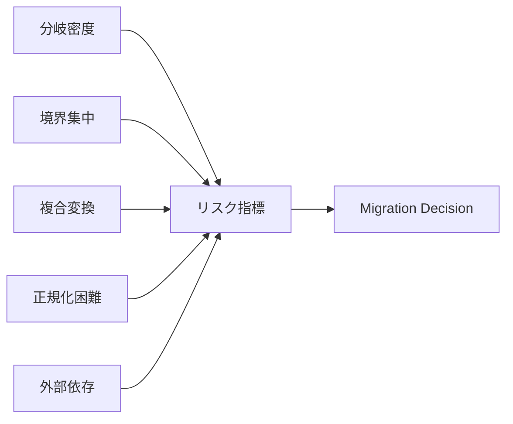

## 6. Conditions for IR to Become a Judgment Unit
IR が判断単位として成立するためには、少なくとも次が必要である。

- **観測可能性**：AST から一意に、または許容可能な曖昧さつきでトレースできること
- **境界明示性**：内部作用と境界作用が混同されないこと
- **他層接続可能性**：CFG / DFG / Guarantee / Scope / Decision へ型整合的に接続できること
- **比較可能性**：正規化と合成の下で他資産と照合できること
- **保証可能性**：少なくとも「なぜ保証困難か」を構造的に説明できること

これらを満たすとき、IR Unit は単なる中間表現ではなく、研究上の **判断単位** として成立する。

## 7. Risks and Failure Modes
IR が判断接続できない場合、Decision は定性的な印象に留まり、監査に耐えない。Guarantee Unit と IR Unit の粒度が不整合な場合、主張の適用漏れや二重適用が起こる。Scope との粒度不整合があると、影響伝播や閉包の説明が弱まる。さらに、リスク要因が IR に現れない設計では、移行理論としての反証可能性が失われる。

## 8. Summary
IR は AST 層の次に位置する **構造的作用層** であり、Guarantee / Scope / Decision という判断接続層への入力である。Guarantee は IR を保存主張の載る現実として、Scope は有界対象の根拠として、Decision は可否・段階・証拠の説明材料として読む。IR の構造特徴はリスク指標となり、判断単位としての成立条件は観測可能性、境界明示性、接続可能性、比較可能性、保証可能性によって与えられる。したがって `20_ir` は、`50_guarantee`、`60_scope`、`60_decision` を分断しないための共通中間理論である。

---
# `20_ir`

Phase 8: IR の文書群です。

`20_ir` は、`10_ast` `50_guarantee` `60_scope` `60_decision` を前提として、  
**構文構造を移行判断に耐える構造作用単位へ再編成するための中間構造理論** を与えます。

IR は単なる実装中間形式ではなく、AST と CFG / DFG、および Guarantee / Scope / Decision のあいだを接続する **構造層** として位置づけられます。

## Documents

- `01_IR-Core-Definition.md`
- `02_IR-Design-Principles.md`
- `03_IR-Unit-Taxonomy.md`
- `04_AST-to-IR-Mapping.md`
- `05_IR-Control-Abstraction.md`
- `06_IR-Data-Operation-Model.md`
- `07_IR-Boundary-and-SideEffect-Model.md`
- `08_IR-Composition-and-Normalization.md`
- `09_IR-Connection-to-CFG-DFG.md`
- `10_IR-Connection-to-Guarantee-Scope-Decision.md`

## Structure

- `01` は IR の定義と位置づけを固定する。
- `02` は IR 設計原則を固定する。
- `03` は IR Unit の分類体系を与える。
- `04` は AST から IR への写像規則を与える。
- `05` `06` `07` は制御・データ・境界の主要作用領域を個別に定義する。
- `08` は合成規則と正規化規則を与え、比較可能性を支える。
- `09` は IR を CFG / DFG へ接続する。
- `10` は IR を Guarantee / Scope / Decision へ接続する。

## Notes

- IR は AST の単なる焼き直しではなく、**制御作用・データ作用・境界作用を型付きで扱う構造表現** である。
- `20_ir` は `30_cfg` `40_dfg` の前段であると同時に、`50_guarantee` `60_scope` `60_decision` を分断しないための中間層である。
- 各文書は、定義、必要性、境界、粒度、接続、リスク、可視化を揃える方針で構成されている。

## Next Connection

- `30_cfg`：IR 上の制御作用をグラフ構造へ展開する
- `40_dfg`：IR 上のデータ作用と副作用を依存構造へ展開する
- `50_guarantee`：Guarantee Unit と IR Unit の対応を精緻化する
- `60_scope`：IR 境界を Scope 境界候補として再評価する
- `60_decision`：IR 特徴量を移行判断材料として再編成する


# 30_cfg

# CFG Core Definition

## 1. 目的
本稿は、COBOL 構造解析研究における **CFG（Control Flow Graph）** の中核定義を確立する。先行して `10_ast` では **構文層** としての観測粒度が与えられ、`20_ir` では **構造作用層（IR）** として制御・データ・境界の作用が再編成されてきた。しかし、分岐点・合流点・反復・非構造遷移・経路の閉包といった **制御到達と経路閉包** を、グラフとして固定しなければ、**判断接続層** における Guarantee（保証）・Scope（境界）・Decision（移行判断）は、「どの制御構造に対して主張するのか」を一貫して説明できない。

Phase9 の `30_cfg` が担うのは、実行トレースの逐次再生図でも、構文木の別表現でもない。**IR が供給する制御作用の骨格を、到達可能性・経路集合・局所閉包の観点からグラフ化し、移行判断・影響分析・保証境界の基礎構造として運用可能にする「制御到達と経路閉包の構造層」** を理論として固定することが、本稿の目的である。

## 2. CFG の定義
**一文定義**：本研究空間における CFG とは、**プログラムの制御が実効的に遷移しうる順序関係を、ノードと有向辺により表した、制御到達と経路閉包の構造層の表現である。**

本研究の CFG は、コンパイラ最適化用の低水準ジャンプ列の可視化を主目的としない。一般の「制御フロー図」が実装都合で均質化されうるのに対し、本研究の CFG は **どこで分岐し、どこで合流し、どの経路集合が閉じるか** を、COBOL における paragraph / section / PERFORM / GO TO 等の実効構造を踏まえて保持する **研究上の制御抽象** として定義される。

CFG は **構文層（AST）** の具象形状そのものではなく、**構造作用層（IR）** の作用列そのものでもない。AST は観測、IR は作用の再編成、CFG は **制御の到達関係と経路構造の閉包** を担う。したがって CFG は、構文から判断へ至る道のりにおいて、**経路と閉包を操作可能な形で外在化する層** と位置づけられる。

## 3. なぜ AST と IR のあとに CFG が必要か
AST のみでは、次の不足が残る。

第一に、**構文カテゴリと制御到達単位の不一致** である。COBOL の一文・一段落は、複数の実効遷移を内包しうる。AST は構文的トレースには十分でも、**分岐の開き方・合流の再統合・ループの戻り** を経路として固定する作業までは与えない。

第二に、**経路閉包の欠如** である。移行可否やリスクはしばしば「どの経路を通れば到達しうるか」「どの領域が局所的に閉じているか」に依存する。AST ノード集合は、経路集合や閉包の代わりにはならない。

第三に、**IR 単体ではグラフとしての制御順序が固定されない** である。IR は branch / join / loop / jump を型付けしうるが、**実際の遷移の骨格** をノード・辺として確定するのは CFG の役割である（`20_ir` の接続議論と整合する）。

## 4. CFG の責務境界
CFG が扱うものは、次である。

- 制御の分岐・合流・反復境界・終端・手続境界に伴う遷移
- paragraph / section を跨ぐ実効遷移（明示的・暗黙的を含む）
- 非構造遷移（GO TO 等）による辺の存在
- 経路（path）として理解されるべき順序関係の骨格
- 局所解析単位（基本ブロック、制御領域）への分解の前提となる分割点

一方で、CFG が直接扱わないものは、字句規則、構文木の具象形状、データの def-use 関係そのもの、外部入出力の意味論、特定ターゲット言語への生成規則である。データ依存は **DFG** の論題であり、保証命題の妥当性そのものは **Guarantee**、境界の業務閉包は **Scope**、総合判断は **Decision** の論題である。CFG はそれらに **構造入力** を供する。

## 5. 最小語彙：ノード・辺・経路・領域
本研究空間における最小語彙は、後続文書で精緻化される前提で、次のとおり固定する。

- **ノード**：制御上、観測・分割・合流のために識別される点。実行可能な直列片の代表、分岐点、合流点、ループ頭、終端、手続境界上の観測点などが候補となる。
- **辺**：あるノードから別ノードへの **実効的制御遷移** を表す有向関係。条件付き・無条件・後退・非構造などの意味分類は別稿で与える。
- **経路**：始点から終点（または観測区間）に至る **辺の有限列** として理解される対象。同一ノード集合でも経路が異なれば、到達意味や保証適用が異なりうる。
- **領域**：CFG 上で入口・出口・内部遷移により **局所的にまとまり** をなす部分グラフ。閉包性は `08` 以降で精密化するが、本稿では「経路・分割の単位としてのまとまり」として位置づける。

## 6. COBOL における単位の二層性
COBOL では **業務・保守上の自然単位**（paragraph / section）と、**制御解析上の最小単位**（基本ブロック等）が一致しないことが常である。本研究では、

- **制御解析単位**＝CFG 上の分割・到達の基準（典型：基本ブロック）
- **業務参照単位**＝paragraph / section 名や手続コンテナ

を区別する。CFG は前者を主として構成しつつ、後者との **対応（トレーサビリティ）** を失わないことが、移行判断において説明責任を満たす条件となる。

## 7. 他モデルとの関係
研究モデルは、次のように理解される。

| 層 | 代表 | 担うもの |
|---|------|----------|
| 構文層 | AST | 文法に沿った観測構造 |
| 構造作用層 | IR | 作用の種類と再編成（制御・データ・境界） |
| 制御到達と経路閉包の構造層 | CFG | 遷移の骨格、経路、合流、閉包の前提 |
| データ依存の構造層 | DFG | def-use・変換・伝播 |
| 判断接続層 | Guarantee / Scope / Decision | 保証・境界・移行判断 |

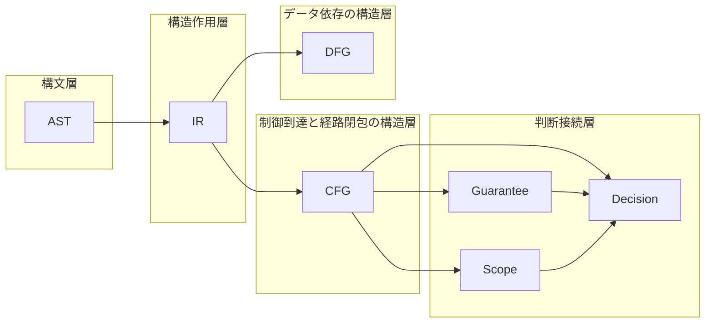

## 8. 判断接続層への接続（前提）
**Guarantee** に対して CFG は、保証を分割・統合する際の **経路依存性** の骨格を与える。同一ノードでも経路によって成立条件が異なりうるからである。

**Scope** に対して CFG は、影響伝播や閉じた推論対象の **境界候補** を与える。制御的閉包と業務的閉包のずれは、CFG 上の領域構造として説明されうる。

**Decision** に対して CFG は、非構造遷移、多出口、深い分岐ネット、未合流経路など **リスクを増幅しうる制御パターン** の根拠を与える。

## 9. 定義不全のリスク
CFG が未定義、あるいは構文層と混同された場合、次が生じる。

- 分岐・合流が図示されず、保証の適用範囲が偽の直列化になる
- PERFORM / GO TO の実効構造が説明できず、移行判断が慣習依存になる
- DFG や Scope との接続が不整合になり、影響分析が信頼できない

## 10. まとめ
本稿は、CFG を **制御到達と経路閉包の構造層** と定義し、構文層（AST）・構造作用層（IR）・データ依存（DFG）・判断接続層（Guarantee / Scope / Decision）との役割分担を固定した。CFG は実行の写しではなく、**経路と閉包を判断可能にする外在化** である。

### 用語簡易表
| 用語 | 本稿での位置づけ |
|------|------------------|
| AST | 構文層 |
| IR | 構造作用層 |
| CFG | 制御到達と経路閉包の構造層 |
| DFG | データ依存の構造層 |
| Guarantee / Scope / Decision | 判断接続層 |

### 他文書との参照関係
- 前提：`20_ir`（IR 中核定義、IR–CFG 接続）
- 続稿：`02` ノード／辺分類、`03` 基本ブロック／領域、`04` 写像、`05` 経路

### Mermaid 図の説明
上図は、AST→IR→CFG/DFG の流れと、CFG が判断接続層へ入力を与える関係を示す。

### 未解決論点
- 「同一 paragraph 内」のみでは足りない閉包の精密定義（`08` へ）
- 動的制御（ALTER 等）を静的 CFG にどう埋め込むかの方針レベルの保留

---
# CFG Node and Edge Taxonomy

## 1. 目的
本稿は、`01_CFG-Core-Definition` で与えた CFG の中核に対し、**ノード型** と **辺型** の分類体系を確定する。分類は実装の都合ではなく、**移行判断・危険構造の識別・保証・境界説明** に直結する軸で与える。構文層（AST）のカテゴリ名と同一視せず、**制御到達と経路閉包の構造層** として何が観測点となり、何が遷移として辺化されるかを固定することが目的である。

## 2. 定義対象のスコープ
対象は、COBOL プログラムに由来する CFG 上のノード・辺の **意味分類** である。データ依存辺（DFG）や型システムは対象外とする。非構造制御の詳細な類型は `07` で拡張しうるが、本稿では **structured / non-structured** の判別基準までを与える。

## 3. 分類の原則
**ノード** は「制御が分割・観測・再統合される点」であり、**辺** は「実効的遷移」である。同一の構文要素が、ノード化と辺化の両方を要請しうるが、**役割を混同しない**。分類軸は次の三つを併用する。

1. **制御役割**（順序・分岐・合流・反復・終端・境界）
2. **遷移様式**（無条件・条件・後退・呼出様・非構造）
3. **COBOL 固有のコンテキスト**（paragraph / section 境界、範囲 PERFORM 等）

## 4. ノード分類
**ノード** を、少なくとも次の型に分類する。

| ノード型 | 定義的要旨 |
|----------|------------|
| Entry | プログラム・手続・解析対象領域の制御入口 |
| Exit / Terminal | 制御が当該単位から逸脱する点 |
| Sequential / Plain | 分岐・合流・ループ頭を内包しない直列実行片の代表点 |
| Branch | 条件または選択により **複数の後続** を持つ観測点 |
| Merge | 複数前駆から **再統合** される観測点 |
| Loop header | 反復制御の **継続判定・反復入口** に相当する観測点 |
| Procedure boundary | PERFORM / CALL 等に伴う **入口・出口・復帰点** の観測 |
| Jump anchor | GO TO の **出発・到着** を明示するための観測点 |
| Exception / interrupt hook | 例外的制御遷移の接続点 |

## 5. 辺分類
**辺** を、少なくとも次の型に分類する。

| 辺型 | 定義的要旨 |
|------|------------|
| Normal / fall-through | 条件なしの **順次進行** または暗黙の次文・次段落への流れ |
| Conditional | 分岐選択に応じた **一対一の遷移** |
| Back edge | 反復に伴う **後退** |
| Call-like transfer | PERFORM / CALL に伴う **下位への移譲** と **復帰** |
| Paragraph transition | paragraph 名を介した **単位間遷移** |
| Section boundary | section 境界を跨ぐ遷移 |
| Non-structured jump | GO TO 等による **構造化パターンから逸脱した** 遷移 |
| Abnormal / exceptional | エラー・中断・終了系の **通常フロー外** 遷移 |

## 6. Structured edge と Non-structured edge
**Structured edge** とは、分岐・合流・反復・手続呼出の **型付け可能な制御パターン** の内部に収まる辺である。すなわち、対応する branch / merge / loop header / procedure boundary により、**経路の再統合または終端** が理論上説明できる遷移を指す。

**Non-structured edge** とは、上記の型付けに **局所的に回収できない** 遷移である。典型は GO TO による **任意ラベルへの飛び** であり、merge の欠落、多入口、ループ外への逸脱などを生じうる。同一グラフ上に両者を載せ、**辺型で差を明示** する。

## 7. COBOL 特有論点
paragraph は保守上の単位であるが、CFG では **paragraph transition 辺** として普遍化する。section は **section boundary** として境界候補と接続しうる。PERFORM THRU は、単一の手続呼出に還元できない **範囲遷移** を生じ、ノード分割と辺の束ね方に影響する。EXIT PARAGRAPH / EXIT SECTION / GOBACK / STOP RUN は **Exit / Terminal** 系のノード・辺分類に接続される。

## 8. 他フェーズとの接続
**構文層（AST）** は、本 taxonomy のラベルではなく **根拠となる観測** を与える。**構造作用層（IR）** は、branch / join / loop / jump / procedure boundary の **意味骨格** を型付けし、CFG はそれを **ノード・辺の具体配置** に落とす。**DFG** とは辺の意味が異なり、混同しない。**判断接続層** では、non-structured edge の密度、merge の欠如、多出口が **リスク指標** となりうる。

## 9. 移行判断への意味
taxonomy は、次の判断質問に答えるための **共通語彙** である。

- どこが分岐点か、どこで経路が再統合されるか
- 非構造遷移が **局所か横断か** を辺型から読み取れるか
- 保証を **経路単位** で分割する必要がある箇所が識別できるか

## 10. まとめ
本稿は、CFG ノード・辺の **型体系** を定義し、structured / non-structured の **判別基準** を与えた。paragraph / section 遷移は **汎用辺型** に収めることで、COBOL 特有性を失わずに一般 CFG 語彙へ接続した。

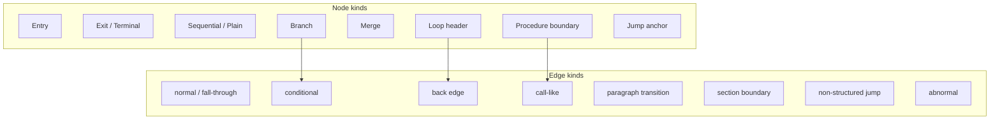

### 用語簡易表
| 記号 | 意味 |
|------|------|
| Merge | 経路の再統合点 |
| Back edge | 反復の後退遷移 |
| Non-structured | 型付け回収不能な遷移 |

### 他文書との参照関係
- 前提：`01_CFG-Core-Definition`
- 続稿：`03` 基本ブロック／領域、`05` 分岐・合流・経路

### Mermaid 図の説明
ノード族と辺族の対応を概観し、どの観測点がどの遷移型と強く結びつくかを示す。

### リスク観点
non-structured jump と abnormal edge が多い領域は、merge を欠く経路が増え、**保証分割** と **テスト設計** の複雑性を高める。

### 未解決論点
- 例外フローを同一 CFG に統合する粒度
- 動的制御の辺型への写し方

---
# Basic Block and Control Region

## 1. 目的
本稿は、CFG を **局所解析単位** として操作するための二つの概念、**基本ブロック（basic block）** と **制御領域（control region）** を定義する。構文層（AST）の statement 列や、業務参照単位である paragraph / section との **意図的なズレ** を明文化し、**制御到達と経路閉包の構造層** 上で、どこまでが直列か、どこから局所閉包が成立しうるかを固定する。Scope 候補との接続可能性を示すことが副次的目的である。

## 2. 定義対象のスコープ
対象は、CFG 上の **分割** と **領域まとまり** の理論定義である。支配・ポスト支配・厳密な閉包演算は `08` で精密化する。本稿では **入口・出口・内部遷移** による領域の直観と、paragraph との二層モデルを確定する。

## 3. 基本ブロックの定義
**基本ブロック** とは、CFG のノード列を次を満たすように分割した **最大の直列実行片** である。

1. ブロック内の任意二点は、ブロック内のみを通る有向路で結ばれる
2. ブロックは **単一入口** を持つ
3. ブロックの最後は、**分岐・ジャンプ・合流への参加・終端** のいずれかにより、直列性が終了する

基本ブロックは **制御解析単位** の典型である。statement 単位や文法上の一行単位ではない。

## 4. 単一入口・単一出口について
**単一入口（SE）** は基本ブロックの要件として採用する。**単一出口（SX）** は基本ブロックに常に課さない。すなわち、一つの基本ブロック末尾から **複数の後続** が出ることはあるが、ブロック内部で出口が分岐しない。

より大きな **領域** に対して SE/SX を論じる場合、SX は「領域を抜ける辺が本質的に一種類に集約できるか」という **閉包議論** に接続する。本稿では、SX を基本ブロックの必須条件とはせず、**control region** 側で扱う。

## 5. 制御領域（control region）の定義
**制御領域** とは、CFG の部分グラフ \(R\) であって、次を満たすものとして定義される。

1. **入口集合** と **出口集合** が識別できる
2. \(R\) の内部の遷移は、\(R\) のノードに閉じて説明できる部分を持つ
3. 領域は **単一入口** を持ちうるし、**単一出口** を持ちうる

領域は **構文の塊** ではなく、**制御のまとまり** として与える。

## 6. statement 単位・block 単位・paragraph 単位
| 単位 | 性質 |
|------|------|
| statement（構文層） | AST 上の記述単位。複数作用・複数遷移を内包しうる |
| basic block（構造層・CFG） | 分岐・合流のない直列片。制御解析の最小単位の典型 |
| paragraph / section（業務参照） | 名付けられた保守・業務単位。CFG 分割点と一致しないことが多い |

## 7. paragraph / section と region のズレ
paragraph は **一続きの文の列** を束ねうるが、PERFORM や GO TO により **実効 CFG は paragraph 境界を恣意的に出入り** する。したがって「paragraph = region」とは限らない。section は **境界候補** として強いが、制御閉包と一致しない場合がある。このズレは **Scope** と **migration unit** の議論で中核となる。

## 8. region と Scope 候補の関係
**Scope 候補** は、影響が伝播しうる範囲を **閉じた推論対象** として切り出す単位である。control region は、その **制御的候補** を供する。ただし業務閉包と制御閉包は一致しないため、Scope は **単一の region 写像** に還元できない場合がある。CFG は **制御側の根拠** を与えるに留まる。

## 9. 構造作用層（IR）・判断接続層との接続
**IR** は、procedure boundary や branch / join を型付けし、**どこでブロック境界が生じうるか** の手掛かりを与える。**Guarantee** は、region 内の経路集合に対して命題を貼りうる。**Decision** は、SE/SX を欠く領域や多出口を **移行難易度** へ写しうる。

## 10. 移行判断への意味
基本ブロックは **変更影響の局所化** と **カバレッジ単位** の基礎となる。control region は **まとめて移行可能か**、**分割が必要か** の初見の構造指標となる。

## 11. まとめ
本稿は、基本ブロックを **単一入口の最大直列片** と定義し、制御領域を **入口・出口・内部遷移による部分グラフのまとまり** として定義した。paragraph / section は **業務参照単位** として区別し、制御解析単位との二層モデルを固定した。

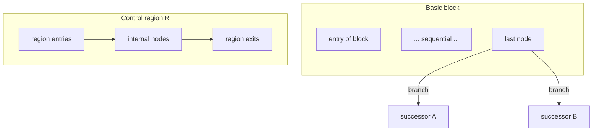

### 用語簡易表
| 用語 | 要約 |
|------|------|
| Basic block | 分岐・合流のない最大直列片、単一入口 |
| Control region | 入口・出口付きの部分グラフのまとまり |
| 二層モデル | 制御解析単位 ≠ paragraph 参照単位 |

### 他文書との参照関係
- 前提：`01`、`02`
- 続稿：`04` 写像、`08` 閉包・支配

### Mermaid 図の説明
基本ブロックの末尾分岐と、領域の入口・内部・出口の模式を示す。

### リスク観点
一つの paragraph が複数基本ブロックに跨り、かつ region が多出口であるとき、**保証単位の分割** と **テストの経路爆発** が同時に悪化しうる。

### 未解決論点
- SE/SX region の十分必要条件を COBOL 実務でどこまで要求するか
- 宣言部・入出力例外を region に含めるかの境界

---
# CFG Mapping from AST and IR

## 1. 目的
本稿は、**構文層（AST）** および **構造作用層（IR）** から、**制御到達と経路閉包の構造層（CFG）** をどう構成するかの **写像規則** を定義する。構文ノードからの機械的な「そのままグラフ化」ではなく、**どの制御構造がノード・辺に落ちるか**、**何が失われ何が保持されるか** を明文化する。DFG 構築とは **別接続面** であることを明示する。

## 2. 定義対象のスコープ
対象は、COBOL の代表的制御構造に対する **理論的写像** である。実装手順やアルゴリズムは扱わない。fall-through、paragraph 跨ぎ、範囲 PERFORM を含む。**動的制御** は静的 CFG では近似ラベルとして扱う余地を残す。

## 3. 写像の二経路：AST 直結と IR 媒介
**AST 直結** で足りる部分は、構文上明示された **順序接続**、単純な **IF / EVALUATE の分岐木**、**GO TO のターゲット** など、構文観測だけで遷移関係が定まる骨格である。

**IR 媒介** が本質的な部分は、一文多作用の分解、paragraph の制御意味の正規化、PERFORM の **入口・出口・復帰** の型付け、branch / join / loop の **意味ラベル**、非構造化度の明示である。IR は CFG に **ノード候補・辺候補・境界ラベル** を供し、CFG はそれを **グラフ配置** に確定する。

## 4. 構文（AST）→CFG の対応（骨格）
| 構文層の観測 | CFG 上の読み（骨格） |
|--------------|----------------------|
| 順次文列 | 基本ブロック内の直列（辺：normal / fall-through） |
| IF | branch ノード、条件辺、合流 merge |
| EVALUATE | 多分岐 branch、各選択肢辺、共通 merge |
| PERFORM（単一） | call-like：手続入口へ、復帰点へ戻る |
| PERFORM THRU | 範囲入口から出口への **順路** と復帰を含む部分グラフ |
| GO TO | non-structured jump 辺、jump anchor ノード |
| EXIT PARAGRAPH / SECTION | 当該単位の出口へ向かう **終端・脱出** 系辺 |
| STOP RUN / GOBACK | Terminal 系ノード・辺 |

**Fall-through** は、次の paragraph 先頭への暗黙遷移を **明示的 control edge** として表現する点が重要である。

## 5. IR（構造作用層）→CFG の対応（骨格）
| IR 側の制御骨格 | CFG 側の読み |
|-----------------|---------------|
| Sequence | 直列の control flow edge |
| Branch | 条件付き複数後続 |
| Loop | 後退辺・継続条件に対応する骨格 |
| Join | 分岐後の merge |
| Exit | 手続・段落・プログラムからの脱出 |
| Jump | GO TO 等の非構造遷移 |
| Procedure boundary | PERFORM / CALL の入口・出口・復帰 |

IR は **ノード・辺を唯一決定しない** 場合がある。同一 IR 複合が複数 CFG ノードに展開されうるし、意味的に透明な点は省略されうる。ただし **トレーサビリティ** を失わないことが研究上の条件である。

## 6. statement 列から基本ブロックを構成する規則
1. **分岐点・合流点・ジャンプの出発・ジャンプの到着・手続境界の観測点** をブロック境界とする。
2. 境界間の最大直列片を **一基本ブロック** とする。
3. paragraph 名は **ラベル** としてノード注釈に付与しうるが、ブロック分割の十分条件ではない。

## 7. paragraph / section を跨ぐ制御
- **明示 PERFORM**：paragraph transition 辺＋call-like の復帰
- **GO TO**：section / paragraph を跨ぐ non-structured jump となりうる
- **section 境界**：section boundary 辺として記録し、Scope 候補と対応付けうる

## 8. 情報の保持と喪失
**保持される典型** は、分岐構造、合流、ループ骨格、非構造遷移の存在、終端種別、手続復帰点である。

**落ちうる典型** は、コメント、空白、ソース上の整形、**データ依存の詳細**、実行時のみ成立する経路である。静的 CFG は **構文的経路の上限近似** を与えるにとどまる。

## 9. DFG との区別
CFG の辺は **制御遷移** である。def-use は **DFG** で表す。条件式がデータに依存する場合でも、**制御辺とデータ辺を同一視しない**。IR は交点を型付けし、二つのグラフへの射影を分離する。

## 10. 判断接続層への含意
写像規則が曖昧だと、**同じソースに対し複数の CFG** が競合し、Guarantee / Scope / Decision の根拠が揺れる。よって写像は **研究規約** として固定し、トレーサビリティを維持する必要がある。

## 11. まとめ
本稿は、AST からの **明示遷移** と IR からの **意味骨格** を組み合わせて CFG を構成する規則を示し、代表構文ごとの対応と情報の保持・喪失を整理した。

```mermaid
flowchart LR
  subgraph Syntax["構文層 AST"]
    A[parse tree / statements]
  end
  subgraph IRlayer["構造作用層 IR"]
    I[control ops\nbranch/join/loop/jump/...]
  end
  subgraph CFGlayer["制御到達と経路閉包 CFG"]
    C[nodes + edges]
  end
  A -->|direct edges where explicit| C
  A --> I
  I -->|shape + labels| C
```

### 用語簡易表
| 用語 | 意味 |
|------|------|
| 写像規則 | AST/IR 要素から CFG 要素への対応規約 |
| Fall-through | 暗黙順序を明示辺化すること |

### 他文書との参照関係
- 前提：`20_ir`（IR 中核、IR–CFG 接続）、`01`〜`03`
- 続稿：`05` 経路、`06`〜`07` ループ・非構造

### Mermaid 図の説明
AST からの直接辺化と、IR 媒介による骨格付与の二経路を示す。

### リスク観点
IR で join が省略されると CFG に偽直列が入り、**保証範囲** が過大・過小に歪む。

### 未解決論点
- ALTER 等の動的制御の静的近似のラベル規約
- COPY 展開後の「唯一の CFG」の定義

---
# Branch, Merge, and Path Structure

## 1. 目的
本稿は、CFG を **経路の構造** として読むための概念、**分岐（branch）**、**合流（merge）**、**経路（path）** を定義する。merge を図上の交点に還元せず、**判断上の再統合点** として扱う。実行可能経路・保証対象経路といった **準備概念** を導入し、**Guarantee** が経路依存になりうる理由を明文化する。**判断接続層** への接続の下地を固定する。

## 2. 定義対象のスコープ
対象は **制御到達と経路閉包の構造層（CFG）** における経路論の基礎である。ループの細目は `06`、非構造遷移の類型は `07`、支配・閉包は `08` で精密化する。本稿では **path の定義**、**branch の開き**、**merge の意味**、**多分岐**、**早期脱出**、**path-sensitive 保証の準備** に焦点を当てる。

## 3. 分岐（branch）
**分岐** とは、CFG 上のノード \(b\) が **二つ以上の後続** を持ち、かつ制御がそのうち **一つを選択** して進む構造として理解される関係である。条件分岐・選択分岐を含む。EVALUATE は **単一ノードの多分岐** として抽象化されうる。

**分岐の開き方** として、各選択肢は **別辺** として表現され、それぞれが **異なる初期経路接頭辞** を生む。

## 4. 合流（merge）
**合流** とは、**二つ以上の異なる前駆** から制御が **同一ノード** \(m\) に入る構造である。merge は **経路が再統合される点** であり、以降の実行は **どの前駆から来たか** によって状態が異なりうる。

判断上、merge は次の意味を持つ。

- **再統合点**：分岐で分かれた経路が **同一の後続解析領域** に戻る
- **観測点**：path-sensitive な性質を持つ場合、merge 以降の主張は **経路履歴** に依存しうる

## 5. 経路（path）
**経路** とは、CFG の辺の有限列 \((e_1,\ldots,e_n)\) であって、辺同士が **首尾一貫して接続** されるものである。経路は **ノードの集合** ではない。同一ノード集合を通っても **辺列が異なれば別経路** ありうる。

**始点・終点** は、解析目的に応じて、プログラム入口から某 merge まで、某 branch から終端までなど **区間** を指定する。

## 6. 経路分類の観点
次の区別は、後続の保証・テスト論で精密化される **準備概念** として導入する。

| 観点 | 説明 |
|------|------|
| 構文的経路 | CFG 上で辺接続として存在する経路 |
| 実行可能経路 | データ・環境制約のもとで **実際にありうる** 経路 |
| 保証対象経路 | Guarantee によって **性質が主張される** 経路部分集合 |
| 未カバー経路 | テスト・証明が **未着手** の経路 |

静的 CFG は **構文的経路の上限近似** を与える。

## 7. 多分岐構造
EVALUATE や多条件 IF は、**扇状の branch** と **共通 merge** として表現される。共通 merge が省略される場合、**経路は合流せず並行して終端** へ向かう。これは **保証の分割** を要請しうる。

## 8. 早期脱出（early exit / early transfer）
EXIT PARAGRAPH、EXIT SECTION、GO TO による **手続・領域からの早期脱出** は、**通常の merge へ至らない経路** を生む。これは **path 集合の分断** を意味し、**カバレッジ・保証単位** の複雑性を上げる。早期脱出は **non-structured** と限らないが、**合流の欠落** と併発しうる。

## 9. ノード集合と経路概念の区別
「ノード集合が同じ」ことは「同一経路」ではない。Guarantee が **状態不変条件** を含む場合、**どの分岐選択列を通ったか** が主張の前提となる。よって **Guarantee Unit は経路依存になりうる**。

## 10. 判断接続層との接続（準備）
- **Guarantee**：保証を **経路単位** で分割・統合する必要の有無は、branch の深さ、merge の有無、早期脱出の有無に依存する
- **Scope**：経路が **領域外へ逸脱** するかどうかは、境界ノード・辺で識別する
- **Decision**：経路数増大、未合流、非構造遷移の混在は **移行リスク** の指標となりうる

## 11. 移行判断への意味
経路構造は、**テスト可能か**、**仕様が経路で分岐しているか**、**移行後も同じ経路集合が意味を持つか** を論じるための **共通言語** である。

## 12. まとめ
本稿は、branch・merge・path を定義し、merge を **再統合点** として位置づけ、経路の **列としての同一性** を強調した。静的 CFG 上の経路と、実行可能・保証対象経路の **段階的区別** を導入し、Guarantee の経路依存性の根拠を与えた。

```mermaid
flowchart TB
  start([start]) --> b{branch}
  b -->|cond1| p1[path prefix 1]
  b -->|cond2| p2[path prefix 2]
  p1 --> m((merge))
  p2 --> m
  m --> tail[downstream]
  p1 -.->|early exit| x[exit without merge]
```

### 用語簡易表
| 用語 | 要約 |
|------|------|
| Path | 辺の有限接続列 |
| Merge | 経路の再統合点 |
| Path-sensitive | 経路履歴に依存する主張 |

### 他文書との参照関係
- 前提：`01`〜`04`、`20_ir`（branch/join 骨格）
- 続稿：`06` ループ、`08` 支配・閉包、`09` 判断接続の詳細

### Mermaid 図の説明
分岐→合流の正常形と、合流を経由しない早期脱出経路の対比を示す。

### リスク観点
merge が欠けたまま終端が増えると **経路集合が指数的に肥大** し、**条件網羅** と **契約保証** のコストが跳ね上がる。

### 未解決論点
- feasible 経路を静的に近似する規約
- 同一 merge 後にいつ path-sensitive を解消してよいか

---
# ループと反復モデル（Loop and Iteration Model）

## 1. 目的
本稿は、Phase9 `30_cfg` において、**CFG を制御到達と経路閉包の構造層**として扱う際の中核要素である **反復構造** を、単なるグラフ上の後退辺（back edge）の存在として還元せず、**制御抽象として識別・分類可能な構造単位**として定式化する。先行する分岐・合流・経路の議論（`05`）と、後続の非構造制御（`07`）、支配・閉包（`08`）、判断接続層（`09` `10`）との接続において、ループが **移行難易度・保証単位・説明責任** に与える差分を固定することが目的である。

**構文層（AST）** は `PERFORM` 等の表層記法を与えるにとどまり、**構造作用層（IR）** は反復に関与する制御作用（条件・範囲・復帰）を型付けする。本稿が扱うのは、その作用が **CFG 上でどのような反復スキーマ（header / body / exit）として現れるか** の理論的整理である。

## 2. 定義対象のスコープ
本稿は次を対象とする。

- `PERFORM` 系に由来する反復（条件反復、添字反復、回数反復、段落範囲反復）
- 単一ループ、入れ子ループ、複合条件を伴う反復の **構造的位置づけ**
- ループ境界における **合流・出口・後退** の意味分類

対象外とするのは、具体的な解析アルゴリズム、ループ不変条件の自動推論、実行時性能、特定ターゲット言語への機械的変換手順である。

## 3. コア概念の定義
### 3.1 反復スキーマ（iteration schema）
**反復スキーマ** とは、CFG の部分構造として、**同一の制御領域を繰り返し通過しうる閉じた経路族** を特徴づける最小の構造パターンである。反復スキーマは、少なくとも次の役割分担を備える。

- **ループ頭（loop header）**：反復が「再入」される観測点
- **ループ本体（loop body）**：反復ごとに実行されうる作用列に対応する領域
- **出口辺（exit edge）**：反復から脱出し、ループ外の合流または後続へ至る辺
- **継続辺（continue edge）**：本体の末尾または中間からループ頭へ戻る経路要素

**一文定義**：本研究空間における反復は、**ループ頭・本体・出口・継続が制御依存として識別可能な閉路構造** として定義される。

### 3.2 後退辺（back edge）の位置づけ
後退辺は反復の **十分条件ではなく記述手段** である。同一の後退辺表象でも、ループ頭の単一性、出口の個数、本体の非連結性などにより **移行リスクと保証難易度は異なりうる**。したがって本稿では、back edge をループ定義の代用とせず、反復スキーマへ還元して語る。

### 3.3 終了条件（termination）の構造的位置づけ
終了条件は **構文層の述語そのもの** ではなく、CFG 上では次のいずれかとして現れる。

- **先判定型**：ループ頭での条件分岐により、継続と出口が分離される
- **後判定型相当**：本体実行後に再条件化され、継続辺がループ頭へ戻る
- **カウンタ／添字駆動**：更新点と境界判定点が本体内部または header に分散する

終了可能性の証明は本稿の主題ではないが、**判断接続層** においては「終了条件が単一箇所に集約されているか」「分散しているか」が、説明可能性と検証コストに直結する。

## 4. ループ分類（loop taxonomy）
| 区分 | 構造的要約 | CFG 上の読み |
|------|------------|--------------|
| 条件反復（UNTIL 型） | 真偽条件による継続／脱出 | header での branch、exit と continue |
| 添字反復（VARYING 型） | 添字範囲と更新による反復 | header／本体に分散した更新・判定、合流の複雑化 |
| 回数反復（TIMES 型） | 回数上限による反復 | 明示カウンタに相当する制御構造 |
| 段落範囲反復 | 単一段落または THRU 範囲の反復実行 | 手続境界ノードと loop header の関係が強い |
| 入れ子反復 | 反復領域の包含 | 内側 exit が外側 header と交差しないことが望ましいが、COBOL では崩れうる |

## 5. COBOL 特有の構造論点
COBOL の反復は、**段落（paragraph）・節（section）** をコンテナとして持ち、`PERFORM THRU` により **制御領域が構文コンテナと一致しない** ことがある。これは次の論点を生む。

- **ループ本体の非連結性**：本体が複数ブロックに分割され、合流が単純化されない
- **出口の暗黙化**：`EXIT PARAGRAPH` / `EXIT SECTION` 等が、CFG 上の出口辺として分散しうる
- **入れ子の交差**：内側の脱出が外側ループの構造を壊す場合、反復スキーマの単純木モデルが失効する

## 6. 他モデルとの接続
- **構文層（AST）**：`PERFORM` の構文種別とオプションが、反復スキーマ推定の手掛かりとなる
- **構造作用層（IR）**：branch／loop／join／procedure boundary の型が、header・exit の候補を供給する
- **制御到達と経路閉包の構造層（CFG）**：本稿の反復は、path 族の閉包性と、merge の多重度を通じて記述される
- **判断接続層**：Guarantee は反復内の経路網羅、Scope は反復領域の境界、Decision は打ち切り困難性や構造複雑性を読む

```mermaid
flowchart TB
  subgraph CFG["CFG（制御到達・経路閉包）"]
    H[loop header]
    B[loop body]
    X[exit edge]
    C[continue to header]
  end
  subgraph Layers["前後層"]
    AST["構文層 AST"]
    IR["構造作用層 IR"]
    J["判断接続層 G/S/D"]
  end
  AST -.-> IR
  IR --> H
  H --> B
  B --> C
  C --> H
  B --> X
  H --> X
  CFG --> J
```

## 7. 移行判断への意味
反復は移行において次の意味を持つ。

- **状態空間の圧縮失敗**：同一ノード集合でも反復回数に依存する挙動は、単純な「ブロック単位置換」を危うくする
- **テスト・保証の経路爆発**：merge と continue の組合せが多いほど、経路ベースの主張が重くなる
- **境界の曖昧化**：段落範囲反復は、業務単位と制御閉包のズレを増幅し、Scope 候補の選定を難しくする

## 8. まとめ
本稿は、CFG 上の反復を **ループ頭・本体・出口・継続** から成る反復スキーマとして定義し、`PERFORM` 系の差異を構造 taxonomy に落とし込んだ。後退辺はループの表象手段にとどめ、終了条件の配置と合流構造を通じて **判断接続層** に橋を架ける。これにより、反復は「循環がある」という弱い記述から、移行・保証・説明に耐える **独立した制御抽象** へ昇格する。

## 9. 用語簡易表
| 用語 | 意味 |
|------|------|
| 反復スキーマ | header／body／exit／continue が識別可能な閉路構造 |
| ループ頭 | 反復の再入点・条件の主座 |
| 出口辺 | 反復領域からの脱出経路 |
| 後退辺 | ループ頭方向への制御辺（表象） |

## 10. 他文書との参照関係
- 前提：`05_Branch-Merge-and-Path-Structure.md`
- 続接：`07_NonStructured-Control-and-GOTO.md`、`08_Dominance-Reachability-and-Closure.md`、`09_CFG-to-Scope-Guarantee-Decision.md`

## 11. Mermaid 図の説明
上図は、IR から供給される制御候補がループ頭へ集約され、継続と出口が分岐する最小スキーマを示す。判断接続層は、このスキーマが生成する **経路閉包** を読む。

## 12. 未解決論点
- 動的制御が反復スキーマに与える不確定性の扱い
- 終了条件とデータ作用が強結合する場合の DFG との合同議論

---
# 非構造制御と GO TO（Non-Structured Control and GOTO）

## 1. 目的
本稿は、COBOL プログラムに現れる **非構造制御** を、道徳的排除の対象ではなく、**CFG 上で観測可能な構造破壊の程度** として理論化する。`30_cfg` における CFG は **制御到達と経路閉包の構造層** であり、構造化された分岐・合流・反復と **同一グラフ上** に非構造辺を載せ、エッジ分類によって差異を明示する立場を採る。

**構文層（AST）** は `GO TO` 等の記法を与え、**構造作用層（IR）** は jump・exit・手続境界として型付けする。本稿は、その結果として **判断接続層** にどの種類の説明負債が発生するかを構造言語で固定する。

## 2. 定義対象のスコープ
対象とするのは次に相当する制御現象である。

- 明示ジャンプ（`GO TO`）に代表される **任意着地点への制御移譲**
- paragraph／section を跨ぐ遷移、および **fall-through** に伴う制御の非構造性
- ループや単一入口領域を破壊する **構造破壊ジャンプ**

対象外とするのは、ジャンプ解決の実装手順、ラベル解析の詳細アルゴリズム、特定ツールによる自動リファクタリング戦略である。

## 3. コア概念の定義
### 3.1 非構造制御（non-structured control）
**非構造制御** とは、CFG を **単一入口・単一出口の合成規則だけで再構成できない** 制御の寄与である。ここで「再構成できない」は、ソース上の整形可能性ではなく、**与えられた CFG の経路構造における合成制約の破れ** として理解する。

### 3.2 非構造辺（non-structured edge）
非構造辺は、通常の順序辺・条件辺に加え、次の性質のいずれかを持つ制御辺として定義される。

- **領域横断性**：固定された control region の境界を、構造化合成の規則に沿わずに跨ぐ
- **入口多重化の誘発**：同一の制御観測点へ、意図的でない多様な前駆から到達しうる状態を安定化する
- **出口多重化の誘発**：同一の意味単位から、非対称な複数の脱出先へ分散する
- **ループ破壊**：反復スキーマの header／exit の読みを、単一の閉路モデルで説明できなくする

### 3.3 構造回復可能性（recoverability）
**構造回復可能性** とは、非構造辺を **等価な構造化スキーマ** へ置換しうるかを、CFG の性質として評価する観念である。

- **局所回復**：限定された部分グラフ内で、多入口・多出口を解消しうる
- **大域回復**：プログラム全体の意味保存のもとで、単一入口単一出口領域へ分解しうる

回復不能性は「悪」の宣告ではなく、**移行・検証・説明コストの上界** を示す記号である。

## 4. 非構造制御の分類
| 類型 | 構造破壊の主効果 | 典型的な判断影響 |
|------|------------------|------------------|
| 局所ジャンプ | 小領域内の出口／入口の再配線 | 局所テストで吸収しうるが、merge の説明が複雑化 |
| 領域横断ジャンプ | control region／paragraph 境界を直接短絡 | Scope 候補と CFG 閉包のズレが拡大 |
| ループ破壊ジャンプ | 反復スキーマの単純モデル失効 | 経路保証・不変条件の説明が困難 |
| 入口多重化 | 単一入口仮定の崩壊 | 保証単位の前提が弱まる |
| 出口多重化 | 合流前の意味分岐の増加 | Decision におけるリスク要因として顕在化 |

## 5. COBOL 特有の構造論点
- **paragraph 横断**：業務記述の自然単位と CFG の最小単位が一致しないため、非構造辺が「遠距離依存」として現れやすい
- **section 境界**：宣言と実行の境界が、制御の見通しを損なう
- **fall-through**：構文上は直列に見えるが、実効は多入口化・多出口化を伴うことがある
- **EXIT 系と jump の混線**：出口制御が分散すると、非構造度の定量化が難しくなる

## 6. 他モデルとの接続
- **IR**：Jump／Exit／Procedure boundary が非構造辺候補を供給する
- **分岐・合流（`05`）**：merge の手前で非構造辺が集中すると path 説明が破綻しやすい
- **反復（`06`）**：ループ破壊は反復スキーマの失効として記録される
- **支配・閉包（`08`）**：入口／出口構造の理解に post-dominator 等が必要になる
- **判断接続層**：Guarantee は経路の未整理さ、Scope は領域横断、Decision は回復コストとして読む

```mermaid
flowchart LR
  subgraph Structured["構造化部分"]
    A[branch]
    M[merge]
  end
  subgraph NonS["非構造寄与"]
    G[GO TO / 遠距離遷移]
  end
  A --> M
  G -.->|non-structured edge| M
  G -.->|region crossing| N[distant node]
```

## 7. 移行判断への意味
非構造制御は、次を通じて移行リスクを押し上げる。

- **説明不能経路の増加**：置換言語側の構造化 idiom への写像が一意でなくなる
- **スコープ分割の困難**：制御閉包と業務閉包の不一致が拡大する
- **テスト設計の負荷**：入口・出口の組合せが増え、カバレッジ方針と Guarantee の整合が取りにくい

## 8. まとめ
本稿は、非構造制御を CFG の **辺の意味分類** として定義し、局所／領域横断／ループ破壊・多入口・多出口という軸で類型化した。構造回復可能性は、移行可否の **説明責任とコスト** を見積るための構造指標として位置づけられる。

## 9. 非構造度の指標候補
アルゴリズムではなく **観測可能な構造特徴** として、次を候補とする。

- 非構造辺の密度
- 遠距離遷移の件数
- 多入口・多出口ノード／領域の個数
- ループ破壊辺の有無と反復スキーマ単純性の喪失度

## 10. 用語簡易表
| 用語 | 意味 |
|------|------|
| 非構造制御 | 単一入口単一出口合成で再構成しにくい制御寄与 |
| 非構造辺 | 上記を生じさせる制御辺のクラス |
| 構造回復 | 等価な構造化スキーマへの置換可能性 |

## 11. 他文書との参照関係
- 前提：`02_CFG-Node-and-Edge-Taxonomy.md`、`05`〜`06`
- 続接：`08`、`09`、`10`

## 12. Mermaid 図の説明
上図は、局所的分岐・合流に対し、遠距離への非構造辺が「領域横断」として重ね掛けされる状況を模式的に示す。

## 13. 未解決論点
- 動的制御による **辺集合そのものの変動** の扱い
- 「等価性」の基準をどの判断接続層概念に結びつけるか

---
# 支配・到達性・閉包（Dominance, Reachability, and Closure）

## 1. 目的
本稿は、CFG を **制御到達と経路閉包の構造層** として扱う際に不可欠な **到達性（reachability）・支配（dominance）・閉包性（closure）** を、証明論ではなく **移行単位の切り出し・保証境界の説明・影響伝播の読み** に接続する水準で定義する。数学的厳密さより、**判断接続層** が参照しうる操作可能概念として固定することが目的である。

## 2. 定義対象のスコープ
対象とするのは、単一プロシージャ／コンパイル単位に対する CFG 上の関係である。複数プログラム間の呼出は、手続境界ノードとして **入口・出口条件** に還元して扱う。

本稿は **アルゴリズム** を扱わない。

## 3. コア概念の定義
### 3.1 到達性（reachability）
ノード \(v\) がノード \(u\) から **到達可能** であるとは、\(u\) から \(v\) へ至る **制御経路** が存在することをいう。到達性は、「その作用は実行されうるか」という **最弱の前提** を与える。到達不能は **デッドコード** の手掛かりとなるが、本研究では主に **保証・テストの無駄削減** と **説明範囲の切断** に用いる。

### 3.2 支配（dominance）
ノード \(d\) がノード \(n\) を **支配** するとは、入口から \(n\) への任意の経路が \(d\) を通過しなければならないことをいう。**直観** として、\(n\) に至る前に **必ず通る関所** である。

### 3.3 ポスト支配（post-dominance）
ノード \(p\) がノード \(n\) を **ポスト支配** するとは、\(n\) から各終端への任意の経路が \(p\) を通過しなければならないことをいう。**直観** として、\(n\) 以降で **必ず通る合流・出口前関所** である。

### 3.4 制御閉包（control closure）
**制御閉包** とは、部分グラフ \(R\) が、与えられた入口・出口の取り方の下で **内部の制御流れが外部へ逸脱せず説明できる** という性質である。実務的には次の区別を採る。

- **弱閉包**：内部から外部への辺が存在しない
- **強閉包**：単一入口・単一出口に近い合成規則で **置換可能** である

### 3.5 単一入口・単一出口領域（SESE）
**SESE 領域** は、支配とポスト支配を用いて **カット可能な制御断片** として理解される。COBOL では非構造辺により SESE 仮定が容易に崩れる点が論点となる。

### 3.6 還元不能性（irreducible control）
**還元不能な制御** とは、ループ構造を単純な階層木で表すことが困難な、**絡み合った後退** を伴う制御である。本稿ではアルゴリズム的判定ではなく、**説明構造としての複雑性** として扱う。

```mermaid
flowchart TB
  ENTRY[entry]
  D[dominator-like cut]
  N[work region]
  P[post-dominator-like cut]
  EXIT[exit]
  ENTRY --> D --> N --> P --> EXIT
```

## 4. COBOL 特有の構造論点
- **多出口・分散出口**：`EXIT` 系・非構造辺により、ポスト支配の基準となる出口集合が曖昧化しうる
- **段落モデルとのズレ**：支配関係は basic block 粒度で安定しやすいが、業務説明は paragraph 粒度で行われる
- **例外・I/O 境界**：宣言部や例外ハンドラは、制御閉包の「外」と「内」を分断しうる

## 5. 他モデルとの接続
- **構文層（AST）**：入口・出口の候補を構文的に与える
- **構造作用層（IR）**：branch／join／exit の骨格が支配・ポスト支配の **候補カット** となる
- **非構造制御（`07`）**：支配関係の説明力を弱める要因として記録される
- **判断接続層**：
  - **Scope**：制御閉包は境界候補の十分条件になりうるが、業務閉包と一致しない
  - **Guarantee**：支配関係は「必ず実行される前提」や「条件付き実行」の説明に効く
  - **Decision**：SESE に近いほど分割容易性が高い、という **構造指標** を与える

## 6. 移行判断への意味
- **migration unit の切り出し**：支配／ポスト支配で挟まれた領域は、置換単位の候補となるが、非構造辺があるとカットが無意味化する
- **影響伝播**：変更点からの到達・逆到達で、説明すべき経路集合を束ねる
- **保証の説明責任**：「すべての経路で」を主張するほど、支配・合流・出口の配置が説明の主役になる

## 7. 制御閉包とスコープ閉包の不一致
制御閉包だけでは Scope が十分に決まらない典型理由は次のとおりである。

- paragraph 名で見た業務まとまりと、CFG の閉包が一致しない
- データ依存や外部 I/O が、制御的には閉じていても **意味的には開いている**

## 8. まとめ
本稿は、到達性・支配・ポスト支配・制御閉包・SESE・還元不能性を、CFG 上の **判断可能な関係** として定義し、非構造制御や COBOL 特有出口がもたらす説明の難度を明示した。これらは **判断接続層** における境界・保証・分割判断の **構造根拠** となる。

## 9. 用語簡易表
| 用語 | 意味 |
|------|------|
| 支配 | 入口からの任意経路が必ず通る前関所 |
| ポスト支配 | 出口側の任意経路が必ず通る後関所 |
| 制御閉包 | 内部制御が外部へ逸脱しない説明可能性 |
| SESE | 単一入口・単一出口に近いカット可能領域 |

## 10. 他文書との参照関係
- 前提：`03`〜`07`
- 続接：`09`、`10`

## 11. Mermaid 図の説明
上図は、入口側の支配カットと出口側のポスト支配カットのあいだに作業領域を挟む **概念的スライス** を示す。

## 12. 未解決論点
- 出口集合の規定がポスト支配に与える影響
- 還元不能性と「人間にとっての理解容易性」の相関

---
# CFG から Scope・Guarantee・Decision への接続（CFG to Scope, Guarantee, and Decision）

## 1. 目的
本稿は、`30_cfg` で与えられた CFG を **制御到達と経路閉包の構造層** として確立したうえで、**判断接続層** における **Scope（境界）・Guarantee（保証）・Decision（移行判断）** へ、どのような **射影規則と限界** で接続するかを明文化する。CFG を単独理論で終わらせず、研究全体の **根拠の流通** を可能にすることが目的である。

## 2. 定義対象のスコープ
対象とするのは、CFG が供給しうる **境界候補・保証単位候補・判断材料** の理論的対応である。データ依存、例外契約、業務意味の完全な固定は、`40_dfg`、`50_guarantee` の詳細、`70_cases` に一部委ねる。

## 3. コア概念の定義
### 3.1 ノード保証・領域保証・経路保証
**ノード保証** は、特定の CFG ノードまたは基本ブロックの実行に関する主張である。**領域保証** は、制御閉包に近い領域に対する主張である。**経路保証** は、分岐選択の組合せに依存する主張であり、**同一ノード集合でも経路により真偽が変わりうる** 点が本研究の要点である。

### 3.2 制御閉包と保証閉包
**制御閉包** は CFG 上の説明可能性である。**保証閉包** は、主張が意味的に閉じている範囲であり、データ・外部境界・例外を含みうる。二者は一致しない。

### 3.3 保証不能経路（unguaranteeable path）
**保証不能経路** とは、与えられた証拠・契約・観測の下で、主張の真偽または適用条件を **十分に説明できない経路** である。原因は、CFG 外の情報欠落である場合もあれば、CFG 上の **多入口・多出口・未閉包・非構造辺** による説明の分裂である場合もある。

### 3.4 判断閉包（decision closure）
**判断閉包** とは、Decision が結論を下すために **最小限そろえるべき根拠束** である。CFG はその一部（制御経路・閉包・危険パターン）を供給し、IR・DFG・Guarantee 契約で補完される。

## 4. 接続マップ
| 判断接続層 | CFG が供給する主な読み |
|------------|-------------------------|
| Scope | 制御閉包、SESE 近似、merge／exit の配置、領域横断辺の有無 |
| Guarantee | 経路集合の分解、必達／条件付き到達、合流前後の説明単位 |
| Decision | 分割容易性、非構造度、ループ・分岐複雑性、未閉包・保証不能の手掛かり |

## 5. COBOL 特有の構造論点
- **paragraph 参照と制御閉包のズレ**：Scope の自然言語境界が、CFG 閉包と一致しない
- **PERFORM THRU と範囲保障**：領域保証を語るとき、手続境界と実効経路の差が問題になる
- **EXIT と GO TO の混在**：経路保証の説明が分岐し、Guarantee の単位選択が難しくなる

## 6. 他モデルとの接続
```mermaid
flowchart LR
  subgraph Syntax["構文層 AST"]
    A[観測された構文]
  end
  subgraph IRl["構造作用層 IR"]
    I[制御作用の型付け]
  end
  subgraph CFGl["構造層 CFG"]
    C[到達・支配・閉包・経路]
  end
  subgraph Judge["判断接続層"]
    S[Scope]
    G[Guarantee]
    D[Decision]
  end
  A --> I --> C
  C --> S
  C --> G
  C --> D
  S --> D
  G --> D
```

- **AST**：境界記号・制御記法の根拠
- **IR**：CFG 構築の手掛かり
- **DFG**：制御閉包が閉じても保証閉包が開く典型原因
- **`10`**：CFG 由来リスクを Decision 入力へ集約

## 7. 移行判断への意味
- **migration decision** は、CFG だけでは完結しない。しかし **「どこを切ると制御説明が壊れるか」** は CFG が最も強い
- **経路保証** が必要な主張ほど、`05`〜`08` の概念が Decision の前提になる
- **保証不能経路** の顕在化は、移行の段階計画や追加証拠獲得を要求する

## 8. まとめ
本稿は、CFG を判断接続層へ接続する際の **射影規則** を、Scope／Guarantee／Decision の三軸で整理し、ノード・領域・経路の三層保証の違い、制御閉包と保証閉包の不一致、保証不能経路の概念を固定した。CFG は **根拠の中枢** であり、**結論の全部** ではない。

## 9. 用語簡易表
| 用語 | 意味 |
|------|------|
| 経路保証 | 分岐選択に依存する主張 |
| 保証閉包 | 主張が意味的に閉じる範囲 |
| 保証不能経路 | 説明・証拠不足で主張が付かない経路 |
| 判断閉包 | Decision に必要な根拠束 |

## 10. 他文書との参照関係
- 前提：`01`〜`08`
- 双方向：`50_guarantee`、`60_scope`、`60_decision`
- 続接：`10`

## 11. Mermaid 図の説明
上図は、AST→IR→CFG の上流と、CFG から三つの判断概念への下流、および Scope／Guarantee から Decision への合流を示す。

## 12. 未解決論点
- Guarantee 契約言語と CFG 射影の **形式整合**
- Scope の最終定義が業務辞書・モジュール境界に依存する場合の運用規則

---
# CFG リスクパターンと移行準備度（CFG Risk Patterns and Migration Readiness）

## 1. 目的
本稿は、`30_cfg` 群で整備した **制御到達と経路閉包の構造層（CFG）** の概念を、**判断接続層** における **移行準備度（migration readiness）** 評価へ接続する。危険の列挙ではなく、各パターンについて **なぜ構造的にリスクとなりうるか** を示し、**観測可能な CFG 特徴** として読み替えることが目的である。後続の事例分析へ展開可能な **入力観測の辞書** を与える。

## 2. 定義対象のスコープ
対象は、CFG 上で識別しうる **高リスク制御パターン** と、それが Scope／Guarantee／Decision に与える **典型的影響** である。実装の検出閾値やスコアリング式は本稿では与えない。

## 3. コア概念の定義
### 3.1 CFG リスクパターン
**CFG リスクパターン** とは、移行・検証・構造回復のいずれかにおいて **コスト上界を押し上げうる制御構造の再帰的に現れる形** である。パターンは独立ではなく、合成により強化されうる。

### 3.2 分割困難領域（hard-to-partition region）
**分割困難領域** とは、単一入口単一出口に近い合成が崩れ、**意味保存のもとでのモジュール化** が難しい領域である。非構造辺、多出口、遠距離 merge が典型因となる。

### 3.3 未閉包経路（non-closed paths）
**未閉包経路** とは、制御閉包の説明下で **入口から出口まで一貫して束ねられない経路族** である。例外処理、動的制御、外部呼出の非局所出口が関与しうる。

### 3.4 移行準備度（migration readiness）
**移行準備度** は単一指標ではなく、**根拠束の充足度** である。CFG はその主要因を供給し、DFG・契約・テスト資産で補完される。

## 4. リスクパターン一覧
| ID | パターン名 | 構造要因（CFG） | 典型的判断影響 |
|----|------------|-----------------|----------------|
| R1 | 深い分岐ネスト | 連鎖 branch、複数 merge | 経路説明・テスト設計の複雑化 |
| R2 | 非構造辺の高密度 | 非構造辺比率、遠距離短絡 | 構造回復コスト、Scope ズレ |
| R3 | 多出口領域 | 出口辺の分散、ポスト支配の曖昧化 | 領域保証の困難、段階移行の障害 |
| R4 | 複雑反復 | 分散した終了条件、本体非連結 | 経路保証・不変条件の説明困難 |
| R5 | 還元不能な絡み | irreducible な後退構造 | 人間理解・工具支援の両難 |
| R6 | 長距離 back edge | ループ頭と本体の地理的分離 | 影響分析・リファクタリングの難度増 |
| R7 | paragraph 横断の複雑化 | 領域横断辺と業務単位の不一致 | 業務スコープと制御スコープの断裂 |
| R8 | 例外・I/O 絡みの分岐 | 異常経路の合流不全 | 未閉包経路、保証不能 |

## 5. 構造要因と判断影響の対応
| 判断接続層 | R1–R8 が効きやすい論点 |
|------------|-------------------------|
| Scope | R2, R3, R7 |
| Guarantee | R1, R4, R8 |
| Decision | R2, R3, R5, R6 |

## 6. COBOL 特有の構造論点
- **PERFORM THRU** は R4／R7 と合成されやすい
- **GO TO** は R2 の主要因である
- **EXIT** 系は R3／R8 を誘発しうる

## 7. 他モデルとの接続
- **先行各稿**：`05`（path）、`06`（loop）、`07`（non-structured）、`08`（dominance／closure）、`09`（判断接続）
- **DFG**：R8 の多くは制御だけでは閉じない
- **事例**：パターンは `70_cases` で **再現条件** として検証されるべきである

```mermaid
flowchart TB
  subgraph Inputs["観測入力（CFG 中心）"]
    P1[branch depth / merge pattern]
    P2[non-structured edges]
    P3[multi-exit]
    P4[loop complexity]
    P5[irreducibility signal]
    P6[long back edges]
    P7[cross-paragraph cuts]
    P8[exception edges open]
  end
  subgraph Risks["リスクパターン R1–R8"]
    R[Risk pattern composition]
  end
  subgraph Out["判断接続層"]
    S[Scope stress]
    G[Guarantee stress]
    D[Decision readiness]
  end
  P1 & P2 & P3 & P4 & P5 & P6 & P7 & P8 --> R
  R --> S
  R --> G
  R --> D
```

## 8. 移行判断への意味
- **準備度評価** は、「R パターンの有無と合成」＋「補助根拠（データ・契約・テスト）」で構成される
- **高リスク CFG** は、移行不可を意味しない。**追加証拠と段階計画** を Decision が要求する記号である

## 9. まとめ
本稿は、CFG 上の構造特徴から R1–R8 のリスクパターンを定義し、Scope／Guarantee／Decision への典型的負荷として整理した。migration readiness は、これら **観測入力** と判断閉包の充足度として理解される。Phase9 はここで、**構造層から判断層への輸送** が可能な状態に至る。

## 10. 用語簡易表
| 用語 | 意味 |
|------|------|
| リスクパターン | コスト上界を押し上げうる再帰的構造形 |
| 分割困難領域 | SESE 的合成が崩れた領域 |
| 未閉包経路 | 制御閉包で束ねきれない経路族 |
| 移行準備度 | 根拠束の充足度 |

## 11. 他文書との参照関係
- 総括的に `01`〜`09` に依存
- `60_decision` への入力辞書として利用

## 12. Mermaid 図の説明
上図は、CFG から得られる観測特徴がリスクパターンへ合成され、三つの判断概念にストレスを与える流れを示す。

## 13. 未解決論点
- パターン間の **重み付けと合成規則**
- 静的 CFG と実効経路の差が準備度を過大／過小評価しうる点

---
# `30_cfg`

Phase 9: CFG の文書群です。

`30_cfg` は、`10_ast` `20_ir` `50_guarantee` `60_scope` `60_decision` を前提として、  
**COBOL の制御構造を、移行判断・保証境界・影響分析に接続可能な制御到達モデルとして定義するフェーズ** を構成します。

CFG は単なる実行順序図ではなく、分岐・合流・反復・非構造遷移・到達可能性・閉包性を、判断可能な構造として外在化する **制御構造層** として位置づけられます。

## Documents

- `01_CFG-Core-Definition.md`
- `02_CFG-Node-and-Edge-Taxonomy.md`
- `03_Basic-Block-and-Control-Region.md`
- `04_CFG-Mapping-from-AST-and-IR.md`
- `05_Branch-Merge-and-Path-Structure.md`
- `06_Loop-and-Iteration-Model.md`
- `07_NonStructured-Control-and-GOTO.md`
- `08_Dominance-Reachability-and-Closure.md`
- `09_CFG-to-Scope-Guarantee-Decision.md`
- `10_CFG-Risk-Patterns-and-Migration-Readiness.md`

## Structure

- `01` は CFG の定義、役割、責務境界を固定する。
- `02` はノードと辺の分類体系を固定する。
- `03` は基本ブロックと制御領域を定義し、解析単位を与える。
- `04` は AST / IR から CFG への写像規則を整理する。
- `05` は分岐・合流・経路構造を定義する。
- `06` は反復とループ構造を定義する。
- `07` は GO TO を含む非構造制御を独立論点として扱う。
- `08` は到達性・支配性・閉包性を導入する。
- `09` は CFG を Scope / Guarantee / Decision に接続する。
- `10` は高リスク制御構造と移行準備度へ接続する。

## Notes

- CFG は **構文層（AST）** と **構造作用層（IR）** の後に置かれる、制御到達と経路閉包の構造層である。
- paragraph / section は保守上の自然単位だが、CFG 上の最小解析単位は basic block であり、両者のズレを明示的に扱う。
- `30_cfg` は `40_dfg` の前段であると同時に、`50_guarantee` `60_scope` `60_decision` を接続するための制御根拠層である。
- 非構造制御は例外ではなく、移行リスクを説明するための第一級の分析対象として扱う。

## Next Connection

- `40_dfg`：制御経路上で生じる def-use / 伝播をデータ依存構造へ展開する
- `50_guarantee`：経路保証・領域保証・保証不能経路を精緻化する
- `60_scope`：CFG の制御閉包を Scope 境界候補として再評価する
- `60_decision`：CFG リスクパターンを移行可否判断へ昇格する
- `70_cases`：高リスク制御構造を事例単位で検証する


# 40_dfg

# DFG Core Definition

## 1. Background

本研究では、`10_ast` で構文構造を観測し、`20_ir` で構造作用を再編成し、`30_cfg` で制御到達と経路閉包を固定してきた。しかし移行可否判断・変更影響分析・保証範囲の評価では、**値がどこで生成され、どこへ伝播し、どこで参照・上書きされるか** を構造的に把握できなければ、CFG 単体では説明しきれない依存関係が残る。

本稿で扱う DFG（Data Flow Graph）は、コンパイラ最適化向けの低レベルなデータフロー解析の写しではない。**移行判断・影響分析・保証可能性評価に耐える、データ依存の構造モデル** として定義する。

## 2. Objective

- COBOL 資産における **値の生成・伝播・参照・上書き・集約** を、グラフとして外在化する。
- 「変数名が同じ」ことと「意味的に同一の値が流れている」ことを区別しうる抽象レベルを固定する。
- AST / IR / CFG / Guarantee / Scope と **責務が重ならない接続点** を明示する。

## 3. Formal Definition

### 3.1 DFG の定義（本研究）

**DFG** は、プログラム断片において観測される **データ要素（値の担い手）** をノードとし、  
**定義（define）・利用（use）・派生・集約・分解・境界横断** といった関係をエッジとして表した **有向グラフ** である。

- **ノード**：データ項目、リテラル、式・文の結果、ファイルレコード、外部入出力の端点、条件に関与するデータなど、**依存関係の端点となりうる観測単位**。
- **エッジ**：値の流れ・依存の向きを表す。**define edge**（あるノードの値が別ノードを定義する）、**use edge**（あるノードの値が別ノードの計算・判定に使われる）、**propagation / derived-from**、**aggregation / decomposition**、**条件依存**、**スコープ横断** など、分類は別稿で体系化する。

### 3.2 定義・使用・再定義・伝播

- **define**：ある時点以降、そのデータ要素が **新たな値を持つ** とみなされる操作（代入、算術結果の格納、READ によるレコード取得、INITIALIZE など）。
- **use**：式・条件・出力・引数などで **参照される** こと。
- **再定義 / overwrite**：同一の論理ストレージ上に **後続の define が重なる** こと。COBOL ではグループと従属項目、REDEFINES により **同名・同領域でも意味が衝突** しうるため、**変数名の同一性だけでは同一性を断定しない**。
- **伝播**：define から use へ、または中間結果を経由した **依存の連鎖**。
- **集約・分岐合流**：複数 use から一つの define、または一つの値が複数の経路で合流する **merge** は、CFG 上の合流点と対応する。

### 3.3 値の同一性と名前の同一性

本研究の DFG では、**データ記述名の一致** と **データ依存として追跡すべき同一性** を分離する。  
階層項目、REDEFINES、OCCURS、COPY 由来の同一物理配置の別名など、**意味境界（`06` で詳述）** に基づきノードを割り当てる。

### 3.4 文・段落・手続きのどこまでを「一つの流れ」にするか

- **既定の抽象**：文レベルで define/use を発生点として記録し、**段落・セクション・プログラム境界** は「境界ノード・横断エッジ」として扱う。
- **集約**：移行判断の単位が段落や CALL 単位である場合、**同一 DFG 上で層を持たせる**（文内の細粒度と、手続き間の粗粒度の両方を扱う）ことを許容し、過剰な SSA 分解は必須としない。

## 4. Structural Role

DFG は **構造層** として、次を担う。

- CFG が **制御到達** を与えるのに対し、DFG は **データ到達・依存閉包の素材** を与える。
- IR が **構造作用の単位化** を与えるのに対し、DFG は **値の依存関係** を明示する。
- 単なる「変数参照一覧」ではなく、**依存の種類と境界** を区別できる表現であること。

## 5. Relation to Other Models

| モデル | 役割 | DFG との関係 |
|--------|------|----------------|
| AST | 構文木・出現位置 | DFG ノード・エッジの **起源**（どの文・式から来たか） |
| IR | 構造作用の単位 | **統一された中間表現** から DFG を生成しやすくする |
| CFG | 制御フロー | **経路依存** により define の reach が変わる。DFG は CFG と独立ではない |
| Guarantee | 保証単位 | データの前提・結果を **依存として** 補助 |
| Scope | 影響境界 | **依存閉包** の根拠として接続 |

```mermaid
flowchart LR
  subgraph Syntax["構文層"]
    AST["AST"]
  end
  subgraph Structural["構造層"]
    IR["IR"]
    CFG["CFG"]
    DFG["DFG"]
  end
  subgraph Judgment["判断層"]
    G["Guarantee"]
    S["Scope"]
    D["Decision"]
  end
  AST --> IR
  IR --> CFG
  IR --> DFG
  CFG --- DFG
  DFG --> G
  DFG --> S
  G --> D
  S --> D
```

## 6. Value for Migration Decision

- **変更影響分析**：変更起点からの **依存伝播**（正方向）と **必要なテスト・検証範囲**（閉包）の根拠。
- **未保証領域の検出**：外部境界・ファイル・CALL 越しに **依存が張り出している** 箇所の特定。
- **移行単位の補助**：依存が密な部分は **一括移行** が現実的、などの **材料**（唯一の決定因子ではない）。
- **CFG では見えない依存**：条件分岐の両側で共有されるデータ、ループ内更新とループ外参照の関係。
- **Scope 閉包**：「どこまでを含めれば影響が閉じるか」の **データ側の根拠**。
- **Guarantee Unit**：入力前提・出力結果を **データ依存** で記述する際の補助。

## 7. Abstraction Levels

| 層 | 内容 |
|----|------|
| **構文層** | MOVE / COMPUTE / READ / WRITE 等の **構文上の出現**。構文の列挙は DFG の定義入力であり、終着点ではない。 |
| **構造層** | define-use、kill、reach、依存の種類、CFG との **制御敏感** 関係。 |
| **判断層** | 「この項目変更はどこまで波及するか」「保証対象に含めるべき範囲はどこか」「移行困難度の高い依存の塊はどこか」。 |

## 8. Open Issues

- REDEFINES や可変長とポインタの **意味境界** の粒度は、プロジェクト方針で揺れうる。
- path-sensitive な完全な reach と、判断に十分な **path-insensitive 近似** のバランス。
- 実行時フォーマットや外部システム仕様の **未記述部分** は DFG だけでは閉じない残余不確実性を残す。

## 9. Summary

本研究における DFG は、**値の依存構造を移行判断に接続するための中核モデル** である。  
AST / IR / CFG と混同せず、**名前と値の同一性を分離**し、**Guarantee / Scope** への接続を前提とする。以降の文書（`02`〜`10`）では、分類、define/use/reach、文単位規則、CFG 統合、境界、閉包、検証、リスク、全体接続を順に固定する。

---
# DFG Node and Edge Taxonomy

## 1. Purpose

DFG を比較・検証・説明可能にするため、**ノード種別** と **エッジ種別** を体系化する。分類は AST ノードの焼き直しではなく、**データ依存という構造** を記述するための語彙である。

## 2. Design Principles

- **移行分析に効く粒度**：最適化のための過細分解は必須としない。
- **意味境界を尊重**：グループ／従属／REDEFINES は「名前」ではなく **論理データ要素** として扱う。
- **CFG との併記**：エッジは可能なら **制御敏感** であることを前提に分類する。
- **Scope / Guarantee への影響**：境界横断・保証単位の独立性を損ねるエッジを区別する。

## 3. Node Taxonomy

### 3.1 上位分類

| 区分 | 説明 | 例 |
|------|------|-----|
| **Data Item Node** | プログラムが参照する論理データ要素 | 基本項目、グループ、従属、INDEX 付き要素 |
| **Literal / Constant Node** | ソース上の定数・図式定数 | 数値リテラル、ZERO、SPACE、定数領域 |
| **Expression Result Node** | 式評価の中間・最終結果 | COMPUTE 右辺の部分式（必要に応じて） |
| **Statement Result Node** | 文の実行結果としてのまとまり | 文レベルで集約する「文結果」 |
| **Input Source Node** | 外部からの入力の起点 | ファイルレコード、ACCEPT バッファ、CALL 入力 |
| **Output Sink Node** | 外部への出力の終点 | DISPLAY、WRITE、CALL 出力、レポート行 |
| **File Record Node** | ファイルセクション・レコードの論理単位 | FD 配下のレコード構造 |
| **Condition-related Data Node** | 条件式に現れるデータ | IF / EVALUATE / UNTIL の判定に使う項目 |
| **Temporary / Implicit Value Node** | 暗黙の中間・一時領域 | STRING 作業域、暗黙の再定義対象 |
| **Aggregate / Group Node** | 集約単位 | グループ全体を一つの塊として扱う場合 |
| **Subfield / Element Node** | 部分項目・配列要素 | OCCURS の要素、下位の数値項目 |

### 3.2 粒度方針

- **変数単位** だけでは足りない：**項目階層** と **物理配置の共有** を考慮する。
- **フィールド単位** は、移行時に型・桁が独立に変わりうる場合に採用する。
- **配列要素** は、添字が静的に分岐する場合と動的な場合で **到達の不確実性** が変わる。
- **グループ単位** と **下位単位** は、MOVE や REDEFINES の **同時更新** を説明するために両方を持ちうる。

## 4. Edge Taxonomy

各エッジについて **意味・発生条件・始点終点・CFG との関係・Scope/Guarantee への影響** を一貫して記述する。

| エッジ種別 | 意味 | 発生条件（概要） | 始点→終点 | CFG / 判断層 |
|------------|------|------------------|-----------|----------------|
| **define** | 終点が新たな値を持つ | 代入、算術格納、READ 等 | 値の源 → 定義先 | 到達経路で kill が変わる |
| **use** | 終点の計算・判定に始点が必要 | 右辺、条件、出力 | 参照元 → 使用箇所 | 条件 use は経路で有効域が変わる |
| **overwrite / redefine** | 同一領域の上書き・再解釈 | 同一ストレージ上の別名・別下位 | 上書き元 → 上書き先 | REDEFINES は意味衝突リスク |
| **propagation** | 値の流れの総称 | define-use の連鎖 | 任意 | reach の素材 |
| **derived-from** | 派生（計算・変換） | COMPUTE、算術文 | オペランド → 結果 | 多入力→一出力 |
| **aggregation** | 複数から一つへ | 複数項目の結合、グループ MOVE | 複数 → 一つ | 閉包が膨らむ |
| **decomposition** | 一つから複数へ | UNSTRING、部分参照 | 一つ → 複数 | 検証単位が増える |
| **input-origin** | 外部入力からの定義 | READ、ACCEPT | 入力源 → データ項目 | 境界外依存 |
| **output-consumption** | 外部への利用 | WRITE、DISPLAY | データ → シンク | 仕様変更の影響 |
| **condition-dependency** | 条件の真偽にデータが関与 | IF / UNTIL | データ → 条件付き文 | 経路分岐と連動 |
| **cross-scope transfer** | スコープ・境界をまたぐ | CALL USING、グローバル、ファイル | 境界片側 → 片側 | 保証・Scope の不一致 |

## 5. Connection Constraints

- **define の無い use** は、初期値・外部入力・未初期化の可能性として **検証対象** に残す。
- **Output Sink** から **Data Item** への「逆方向の define」は通常しない（外部入力は Input Source 経由）。
- **Literal** は define のソースとしてのみ接続し、通常は **overwrite されない**（定数領域の例外は別扱い）。
- **Condition-related** と **値 use** は同じ項目でも **エッジ種別を分けて** よい（移行時のテスト観点が異なるため）。

## 6. Granularity Policy

| 判断 | 採用 |
|------|------|
| 移行で項目単位の変更が見込まれる | 下位項目までノード化 |
| グループ全体の一括移行 | Aggregate を主とし下位は省略可 |
| 条件分岐がデータ依存に強く効く | condition-dependency を明示 |
| ファイルが境界 | File Record と I/O エッジを明示 |

## 7. Migration Analysis Value

- **高密度依存**（多数のエッジが同一ノードに集中）は、変更影響が広い **警告材料**。
- **cross-scope transfer** が多いほど、**単体テスト・保証の切り出し** が難しくなる。
- **overwrite / redefine** が多い領域は、**意味の衝突** と **デバッグ困難** の温床。

## 8. Open Questions

- 式の中間結果を **どこまでノード化するか** はツール負荷と判断の解像度のトレードオフ。
- **動的配列・ポインタ** をどの程度 DFG に含めるかは、対象 COBOL のサブセット次第。

## 9. Summary

ノードは **データと外部端点と条件** をカバーし、エッジは **define/use・派生・集約・境界・条件** を区別する。  
この分類は `03` の define/use/reach、`04` の文単位規則の **語彙** として用いる。

---
# Define-Use and Reaching Definition Model

## 1. Background

移行判断では「どこで定義された値がどこで使われるか」と「ある use に到達しうる definition は何か」を明示する必要がある。本稿では define / use / kill / reach を、COBOL と本研究の抽象レベルに合わせて **構造規則** として定義する。

## 2. Core Concepts

- **Definition（define）**：あるプログラム点において、データ要素が **新しい値を持つ** とみなされること。
- **Use**：式・条件・出力・引数などで **値が読まれる** こと。
- **Kill**：同一の論理ストレージ上で、**後続の define により** 先行する定義が無効化されること。
- **Reaching definition**：CFG 上のある点において、**その use に到達しうる** define の集合。

## 3. Definition Model

### 3.1 define の種類（概念）

| 操作群 | define の特徴 |
|--------|----------------|
| **MOVE** | 送信元（または式）から受信先へ **値のコピー／移動** による定義 |
| **COMPUTE / 算術文** | 右辺式の評価結果が **格納先** を定義 |
| **READ / ACCEPT** | 外部入力が **レコード／項目** を定義 |
| **INITIALIZE** | 初期値付与により **複数項目を一括定義** |
| **STRING / UNSTRING** | 送信側・区切り・受信側により **複数 define** |
| **INSPECT** | 置換・カウント等で **対象項目を更新** する場合に define |
| **SET** | 条件名・ポインタ等の **状態** を定義 |

### 3.2 グループと従属

- **グループ MOVE** では、対応する下位項目に **同時に define** が発生しうる。
- **従属項目** だけを更新すると、**親グループの「意味」** は暗黙に変わる場合がある（論理ノードの扱いは境界モデルで補足）。

### 3.3 Conditional definition

条件付き文の内側での代入は、その **経路を通った場合にのみ** define が有効。CFG 上の **経路** とセットで解釈する。

## 4. Use Model

### 4.1 use の典型

| 種類 | 例 |
|------|-----|
| **右辺参照** | MOVE 送信、算術のオペランド |
| **条件参照** | IF / EVALUATE / PERFORM UNTIL の条件 |
| **出力・引数** | WRITE のレコード、DISPLAY、CALL の USING |
| **添字・長さ** | 配列添字、可変長の LENGTH OF |
| **ファイルキー** | READ のキー指定 |

### 4.2 条件 use と値 use

- **条件 use**：分岐・反復の **制御** に効く。CFG と強く結びつく。
- **値 use**：計算・移動の **データ** に効く。両方を区別すると、テストと移行影響の説明がしやすい。

## 5. Reaching Definition Model

### 5.1 CFG との関係

reach は **CFG の経路** 上で定義される。同一の文でも、**前に通った経路** によって、ある use に届く define は異なる。

### 5.2 Kill

- 同じデータ要素に対する **後続の define** が kill を発生させる。
- **REDEFINES** や **同一物理領域** では、一方の define が他方の「値の解釈」を **実質上無効化** しうる（**別名 kill** として扱う方針を取りうる）。

### 5.3 合流点（merge）

複数経路が合流するとき、ある use に対する reaching definitions は **集合** となる。path-insensitive 近似では **和集合** を取り、過剰な依存（保守的）になる。

### 5.4 未初期化・到達不明

- **define が存在しない use**：未初期化、外部から必ず入る前提、または **解析不能**。
- **到達しない define**：デッドコードまたは不要代入。**移行時は削除候補** だが、仕様上必要な副作用がある場合もある。

### 5.5 Scope 境界をまたぐ場合

CALL の引数やファイル経由では、define が **別モジュール・別実行単位** にある。reach は **モジュール内 CFG** だけでは閉じず、**境界を越えた追跡** が必要。

## 6. Merge and Kill Rules

| 状況 | 規則（概念） |
|------|----------------|
| 直列 | 直前の define が reach（kill がなければ） |
| 分岐後合流 | 各分岐の define 集合を merge |
| ループ | 反復により **同じ define が複数回**、不変項目と更新項目を区別 |
| 同一ストレージ別名 | REDEFINES による **意味上の kill** を規約で定義 |

## 7. Connection to CFG and Scope

- **path-sensitive** 解析：精度は高いがコストと仕様の完全性が必要。
- **path-insensitive**：移行判断の **最初のスクリーニング** に向く。
- **Scope**：影響閉包を切るとき、reach が **境界外に伸びている** 場合は Scope 不足のシグナル。

## 8. Migration Risk Interpretation

- **再定義が多い項目**：追跡が難しく、テスト漏れリスクが高い。
- **多数の reaching definitions**：その use は **仕様が複雑** または **経路が多い**。
- **条件分岐で保証が分かれる**：Guarantee Unit を **経路別** に分ける必要が出る。
- **Guarantee Unit の入力前提**：define が「前提を満たす入力」に対応し、use が「保証したい観測」に対応する、という **接続** が可能。

## 9. Summary

define / use / kill / reach は **CFG とセット** で解釈し、COBOL の **階層・共有領域** を別名 kill として扱う方針を明文化する。  
`04` の文単位規則は、本稿の **形式基盤** の上に載る。

---
# Statement-Level Data Flow Rules

## 1. Purpose

主要 COBOL 文ごとに **define / use / 暗黙ノード / エッジ種別 / CFG 上の注意 / Scope・Guarantee / 移行リスク** を揃え、文単位の DFG 生成規則を固定する。実装コードではなく **抽象規則** として記述する。

## 2. Rule Design Policy

- 文の **データ効果** に焦点を当てる（制御効果は CFG と連携）。
- **グループ・部分項目** は境界モデル（`06`）と整合する前提で、ここでは **典型** を示す。
- 丸め・サイズ超過などの **実行時例外** は、DFG の必須要素とはせず **注記** とする。

## 3. Rules by Statement

### 3.1 MOVE

| 項目 | 内容 |
|------|------|
| 役割 | 値の複製・編集付き移動 |
| define | 受信側（グループなら対応する下位を含む） |
| use | 送信側、編集文字列・変換指定に関与する項目 |
| 暗黙ノード | 編集が複雑な場合、中間イメージ（任意） |
| エッジ | define, use, derived-from（計算付きの場合） |
| CFG | 文は通常1基本ブロック内 |
| Scope / Guarantee | 大きなグループ MOVE は **影響面が広い** |
| リスク | グループ対応ミス、異なる型・桁の暗黙変換 |

### 3.2 COMPUTE

| 項目 | 内容 |
|------|------|
| define | 左辺項目 |
| use | 右辺の全オペランド |
| 暗黙ノード | 式が複雑な場合、部分式ノード（任意） |
| エッジ | derived-from, use, define |
| CFG | 例外条件（SIZE ERROR 等）がある場合は **分岐** とリンク |
| リスク | 丸め順序、中間精度は仕様依存 |

### 3.3 ADD / SUBTRACT / MULTIPLY / DIVIDE

| 項目 | 内容 |
|------|------|
| define | 格納先（GIVING 含む） |
| use | オペランド全て |
| エッジ | 複数 use → 一 define（aggregation 的） |
| リスク | サイズエラー分岐、余り |

### 3.4 IF

| 項目 | 内容 |
|------|------|
| define | なし（代入を伴わない場合） |
| use | 条件式内の全データ |
| エッジ | condition-dependency から **_then/else 内の文** へ（統合は `05`） |
| CFG | 分岐・合流が必須。reach は **分岐で分割** |
| リスク | 条件の網羅、デッド分岐 |

### 3.5 EVALUATE

| 項目 | 内容 |
|------|------|
| use | 選択対象、WHEN 条件のデータ |
| エッジ | 複数条件と **選ばれた文** のデータ依存 |
| CFG | 多路分岐。合流点での merge |
| リスク | フォールスルー、OTHER の有無 |

### 3.6 PERFORM（条件参照がある場合）

| 項目 | 内容 |
|------|------|
| use | UNTIL / VARYING の条件・添字 |
| define | 本文内の文に委譲 |
| CFG | ループエッジ。反復による **累積 define** |
| リスク | 無限ループ、ループ不変の誤認 |

### 3.7 READ

| 項目 | 内容 |
|------|------|
| define | レコード領域（INTO 指定含む） |
| use | キー、ファイル状態を参照する場合 |
| エッジ | input-origin, define |
| Scope | ファイル境界 **越えの define** |
| リスク | AT END、無効レコード |

### 3.8 WRITE

| 項目 | 内容 |
|------|------|
| use | 出力レコード内容 |
| define | 通常なし（レコードを書き換えない場合） |
| エッジ | use → output-consumption |
| リスク | レコードレイアウト変更の波及 |

### 3.9 REWRITE

| 項目 | 内容 |
|------|------|
| use | 新内容 |
| define | ファイル上のレコード像（論理） |
| リスク | READ-REWRITE 間の **他トランザクション** は DFG 外 |

### 3.10 ACCEPT

| 項目 | 内容 |
|------|------|
| define | 受信項目 |
| エッジ | input-origin |
| Scope | 端末・システム入力境界 |

### 3.11 DISPLAY

| 項目 | 内容 |
|------|------|
| use | 出力対象 |
| エッジ | output-consumption |

### 3.12 INITIALIZE

| 項目 | 内容 |
|------|------|
| define | 指定項目（複数）一括 |
| use | 置換が VALUE 句等で別項目を参照する場合 |
| リスク | **広範囲の同時 define**、見落とし |

### 3.13 STRING

| 項目 | 内容 |
|------|------|
| use | 送信項目、区切り |
| define | 受信、POINTER 更新 |
| 暗黙 | 連結結果の一時像（任意） |
| リスク | 長さ超過、POINTER 連鎖 |

### 3.14 UNSTRING

| 項目 | 内容 |
|------|------|
| use | ソース |
| define | 複数受信、区切りカウンタ |
| エッジ | decomposition |
| リスク | 区切り曖昧性 |

### 3.15 INSPECT

| 項目 | 内容 |
|------|------|
| use | 検査対象 |
| define | 置換・変換で **対象を更新** する場合 |
| リスク | 全置換・部分置換の見誤り |

### 3.16 SET

| 項目 | 内容 |
|------|------|
| define | 設定先（条件名、ポインタ等） |
| use | TO 句の参照 |

### 3.17 CALL（引数）

| 項目 | 内容 |
|------|------|
| use / define | BY REFERENCE / CONTENT / VALUE に応じ **呼び出し側** の項目は use、**被呼び出し側** での副作用は cross-scope |
| Scope | **手続き境界** を越える主な源 |

## 4. Cross-Cutting Concerns

- **EVALUATE / IF** は条件 use が **CFG と直交** する。
- **PERFORM** は **同一データへの反復 define** を生む。
- **ファイル I/O** は **外部シンク・ソース** として必ず境界ノード化するのが安全。

## 5. Migration Risk Notes

- **INITIALIZE / STRING / UNSTRING / INSPECT** は変更時の **暗黙の波及** が大きい。
- **グループ MOVE / COMPUTE** は **桁・符号・編集** の移行仕様とセットで検証が必要。

## 6. Summary

文単位で define/use を揃えることで、`05` 以降の **CFG 統合・境界・閉包** の入力として一貫した規則を与える。

---
# DFG and CFG Integration

## 1. Background

CFG は制御の流れを、DFG は値の依存を表す。移行判断では **「どの制御経路において、どの値依存が成立するか」** を扱う必要があり、両者を独立したままでは不十分である。

## 2. Distinct Roles of CFG and DFG

| | CFG | DFG |
|---|-----|-----|
| 主対象 | 分岐・合流・反復・到達 | define / use / 伝播 |
| 辺の意味 | 制御が次へ進む | 値が依存する |
| 典型用途 | 経路・網羅・非構造制御 | 変更影響・データテスト |

**片方だけでは足りない理由**：CFG だけでは **同じ経路でもデータの出所** が分からない。DFG だけでは **条件が偽のときに無効な依存** を区別しにくい。

## 3. Integration Points

- **CFG 上の各制御点** に、そこで **有効な reaching definitions** を対応づける（概念上の **プロダクト**）。
- **分岐条件** は DFG 上では **条件 use** とし、CFG の **出辺** と対応させる。
- **合流点** では、各前驱からの **データ依存集合を merge** する。

```mermaid
flowchart TB
  B1["分岐点: 条件 use"]
  P1["経路1上の define"]
  P2["経路2上の define"]
  M["合流点: reach の merge"]
  B1 --> P1
  B1 --> P2
  P1 --> M
  P2 --> M
```

## 4. Branching, Loop, and Merge

### 4.1 分岐（IF / EVALUATE）

- **定義が分岐する**場合：各 arm に **局所的な define** が付き、合流後の use は **両方の定義に依存しうる**（path-insensitive では保守的に結線）。
- **条件 use と値 use**：条件は **制御敏感**、代入の右辺は **データ依存**。保証は **経路別** に分けて記述しうる。

### 4.2 ループ（PERFORM VARYING / UNTIL）

- **反復的再定義**：ループ変数・集計項目は **複数回の define** が同一 CFG サイクル上にある。
- **ループ不変項目**：更新がなければ reach は **エントリの定義** を維持しうる（不変解析は任意）。
- **PERFORM UNTIL**：条件の use が **各反復** で評価される。

### 4.3 合流

- **複数定義の merge**：不確実性（どの定義が有効か）が **移行テストの分岐** に直結。
- **条件付き定義**：合流点で **φ 的な未決** を明示するか、保守的に **両方から辺** を張るかは方針。

### 4.4 GO TO / EXIT / NEXT SENTENCE

- CFG 上の **非構造遷移** は、データ依存の **到達可能性** を変える。`30_cfg` の非構造モデルと **同一の CFG** を前提に DFG を重ねる。

## 5. Control-Dependent Data Relations

- **Control-dependent use**：条件が真のときだけ意味を持つ use（例：THEN 内のみの代入の前提）。
- **CFG edge と DFG edge**：制御の辺は **実行順**、データの辺は **値依存**。同一プログラム点に **両方が接続** される。
- **control predicate を DFG に載せるか**：本研究では **条件を読むデータ** をノード化し **condition-dependency** として表す（PDG 実装までは踏み込まない）。

## 6. Implications for Scope and Guarantee

- **分岐ごとに保証範囲が変わる**場合、Guarantee Unit を **経路別** に分割する根拠が CFG+DFG で与えられる。
- **Scope**：合流点以降の **大きな reach 集合** は、Scope を広げる必要の **シグナル**。
- **可能依存と必須依存**：全経路で成立する依存（必須）と、一部経路のみ（可能）を区別すると **移行リスク説明** が鋭くなる。

## 7. Migration Decision Value

- **条件依存の多層化** は、テストケース数と **仕様の分岐** を増やす。
- **ループ内更新** は回帰テストの **反復観測** が必要。
- **単純 DFG**（CFG を無視）との差は、**「実際には実行されない経路の依存」** の混入・欠落の差として説明できる。

## 8. Summary

DFG は CFG から **完全には独立しない**。分岐・合流・ループ・非構造遷移は **reach と merge** を通じてデータ依存の意味を変える。  
`07` の影響伝播は、本稿の **統合視点** を前提とする。

---
# DFG Boundary and Scope Model

## 1. Purpose

データ依存は文・段落・プログラム・外部を越えて伝播する。**どこで DFG を切り、どこまで追えば影響が「閉じた」とみなせるか** を、境界候補と Scope 接続として定義する。

## 2. Boundary Candidates

| 境界 | 意味 | DFG 上の扱い |
|------|------|----------------|
| **Statement** | 文の前後 | define/use の最小発生単位 |
| **Paragraph** | 段落 | 保守・命名の単位。横断エッジは **段落呼出し** |
| **Section** | 節 | 初期化・共通処理の塊 |
| **Procedure Division** | 手続き部 | メイン処理の外枠 |
| **Program** | コンパイル単位 | CALL / パラメータで **他プログラム** と接続 |
| **External interface** | システム間 | ファイル、DB、MQ、端末 |
| **File** | 入出力 | レコード型・レイアウトが **契約** |

## 3. Scope Levels

本研究の **Scope**（`60_scope`）と対応づける。

- **文／基本ブロックスコープ**：局所的な reach。
- **段落／PERFORM スコープ**：手続き的まとまり。
- **プログラムスコープ**：WORKING-STORAGE 等の寿命。
- **連携スコープ**：LINKAGE、ファイル、CALL。

**DFG から Scope を支える** とは：依存閉包が **どの境界をまたいでいるか** を列挙し、**Scope 境界候補** の妥当性を検討する材料を与えること。

## 4. Boundary Crossing Relations

### 4.1 記憶クラス・セクション

- **WORKING-STORAGE / LOCAL-STORAGE**：プログラム内の **長寿命** データ。依存は **同一 CFG 内** で完結しやすい。
- **LINKAGE / USING**：**呼び出し契約**。define/use が **モジュール間** に跨る。
- **FILE SECTION**：レコード記述。**READ/WRITE** が **ファイル境界** のエッジ。

### 4.2 データ構造

- **グループと従属**：親を単位にするか下位を単位にするかで **閉包の見え方** が変わる。
- **REDEFINES**：同一物理領域の **別名**。境界を「名前」ではなく **配置** で切る必要。
- **OCCURS**：要素単位の依存。**添字の use** が CFG と結合。
- **COPY**：同一構造の **複製**。変更は **全コピー先** に波及しうる。

### 4.3 物理配置と論理境界

論理項目名で Scope を切っても、**REDEFINES やグループ MOVE** で論理をまたぐ依存が残る。**物理境界**（レコード・領域）を補助線とする。

## 5. Closure Conditions

- **内部閉包**：同一プログラム・同一ファイル内のみで依存が止まる。
- **連携閉包**：契約されたインタフェース（レコードレイアウト、CALL 引数）までを含む。
- **Scope 閉包**（`60_scope`）：判断上「ここまで含めれば十分」という **意図的な切断**。DFG は **根拠** を与え、**不足**（境界外への辺）を検知する。

## 6. Connection to Guarantee and Migration Units

- **Guarantee Unit** が **小さすぎる**：DFG 上の依存が **単体の外に出る** 場合、保証が **分割されすぎ** ている可能性。
- **Migration Unit** をファイル単位で切る場合、**ファイルレコードへの依存** が別ファイルに伸びていないかを確認。

## 7. Risk Interpretation

- **ファイル・CALL 越え** が集中：統合テスト・契約変更のリスク。
- **COPY 共有**：局所修正が **横断的**。
- **REDEFINES 頻繁**：意味衝突と **検証困難**。

## 8. Summary

境界は **文から外部** まで多層であり、DFG は **横断エッジ** でそれを可視化する。  
Scope は DFG の **閉包要求** と整合させ、不足は **境界外依存** として検出する。`07` で伝播・閉包を形式化する。

---
# Impact Propagation and Closure on DFG

## 1. Background

移行判断では、ある変更が **どこまで伝播しうるか** を把握する必要がある。DFG は **正向きの影響伝播** と **依存閉包** の主な根拠となる。

## 2. Impact Propagation Model

### 2.1 定義

**影響伝播**：変更された **データ要素・文・式・入出力仕様** から、DFG 上の **依存エッジ** を辿って到達しうる **ノード・文・境界** の集合へ広がること。

### 2.2 伝播の単位

- **項目単位**：データ項目の桁・型・初期値・意味の変更。
- **文単位**：式の変更、代入先の変更。
- **インタフェース単位**：ファイルレイアウト、CALL シグネチャ。

## 3. Direct and Indirect Effects

| 種類 | 説明 |
|------|------|
| **直接** | 変更ノードから **出る辺** の先が直接影響 |
| **間接** | 複数ホップの define-use 連鎖、集約・分解経由 |

## 4. Conditional and Cross-Boundary Effects

- **条件付き**：CFG 上 **一部の経路のみ** で伝播が成立。テストは **経路網羅** が必要。
- **境界越え**：ファイル、CALL、共有領域。**Scope を拡張** しないと閉包が取れない。

## 5. Closure Conditions

### 5.1 閉包の考え方

**依存閉包**（順方向）：変更起点から DFG の **正向き閉包**（一定のエッジ種別の集合に限定可）。

**逆依存閉包**（テスト・回帰の観点）：ある観測点に影響しうる **原因側** の集合。

### 5.2 未観測・外部で止まる場合

- **未モデル化ノード**：仕様未記述。**閉包未達** は残余不確実性として明示。
- **外部境界**：契約上ここまで、と **意図的に切断**。ただし **契約変更** は別タスク。

### 5.3 CFG 未確定

path-sensitive でない場合、**過大な閉包** になる。移行判断では **保守的** であり、コスト見積の **上振れ** として解釈する。

### 5.4 Guarantee 範囲に収まる閉包 / 収まらない閉包

- **収まる**：保証設計と整合。
- **収まらない**：保証の **再分割**、Scope の **拡張**、または **未保証の明示**。

## 6. Migration Risk Interpretation

- **影響半径が大きい項目**：ハブノード。優先的に **仕様の凍結・テスト強化**。
- **再定義密度が高い領域**：変更の **波及経路が多い**。
- **Migration Unit**：閉包が **単位をまたぐ** なら、分割移行が **困難**。
- **部分移行の難所**：閉包が **複数サブシステム** にまたがる箇所。

```mermaid
flowchart LR
  C["変更起点"]
  D1["直接依存先"]
  D2["間接依存先"]
  B["境界"]
  C --> D1 --> D2
  D2 --> B
```

## 7. Relationship to Scope and Guarantee

- Scope の **閉包条件** に、DFG の **順閉包** をマッピングする。
- Guarantee は **閉包が保証単位に収まるか** を問う。

## 8. Summary

影響伝播は **DFG 上の閉包** として定義し、CFG・境界・path 抽象の **不確実性** を注記する。  
`08` の検証は、この閉包が **信頼できるか** を問う。

---
# DFG Verification Model

## 1. Purpose

構築された DFG 研究モデルについて、**何をもって妥当とみなすか** を検証観点として整理する。テストコードやツールの実装ではなく、**研究モデルとしての受入条件** を対象とする。

## 2. Validation Dimensions

1. **構造整合性**：ノード・エッジ種別の一貫性。
2. **参照整合性**：define/use の整合、欠落・過剰。
3. **他モデル整合**：AST / IR / CFG / Scope。
4. **ケース照合**：代表事例での説明可能性。
5. **判断への有効性**：Guarantee・影響分析に使えるか。

## 3. Structural Consistency Checks

| 観点 | 内容 |
|------|------|
| ノード種別 | 未定義の種別がないか |
| エッジ種別 | 禁止接続（例：リテラルへの define）がないか |
| 暗黙ノード | STRING 等の **一貫した方針** で載っているか |
| 境界 | ファイル・CALL に **端点** があるか |

## 4. Cross-Model Consistency Checks

| 対象 | 確認内容 |
|------|-----------|
| **AST** | 各エッジが **起源となる文・式** に追跡可能か |
| **IR** | IR 上の **作用単位** とデータ効果が矛盾しないか |
| **CFG** | reach が **ありえない経路** に依存していないか（方針による） |
| **Scope** | 閉包が **意図した境界** で切れているか説明できるか |
| **Guarantee** | 保証の前提・結果に **必要な依存** が含まれるか |

### 4.1 欠落依存・過剰依存

- **欠落**：実際にはデータが流れるのに辺がない → **影響見落とし**。
- **過剰**：実行されない経路の依存 → **テストコスト過大**（path-insensitive の代償）。

## 5. Case-Based Validation

`70_cases` と接続し、少なくとも以下の **タイプ** をカバーする。

| タイプ | 狙い |
|--------|------|
| 代表構文 | MOVE / COMPUTE / IF |
| 高リスク | STRING / INITIALIZE / REDEFINES |
| ファイル I/O | READ / WRITE 境界 |
| 条件分岐 | reach の分岐 |
| ループ | 反復 define |
| 複合 | 制御・データ・境界が重なる |

## 6. Residual Uncertainty

- **仕様未記述** の外部システム：DFG で閉じない。
- **動的添字・可変長**：静的解析の限界。
- **簡略化**：グループを一ノードにまとめた **情報損失** を文書化する。

## 7. Acceptance Criteria

DFG 定義が「十分」と言えるための **最低条件**（例）：

1. 分類（`02`）と文規則（`04`）に **矛盾する辺** がない。
2. 主要ケースで **説明責任** が果たせる（なぜその依存か）。
3. CFG との統合（`05`）の前提で **reach の解釈** が一貫。
4. Scope / Guarantee への **接続可能性** が示せる。

## 8. Summary

検証は **層立て** で行い、残余不確実性を **明示** する。`09` のリスクは、検証で **信頼できる依存** を前提に整理する。

---
# DFG Risk Patterns and Migration Implications

## 1. Purpose

DFG から読み取れる **構造パターン** を、移行困難性・保証困難性・分割困難性に **接続** する。一般論ではなく **依存グラフ上の特徴** に根ざす。

## 2. Risk Pattern Catalog

| パターン | 構造的特徴 | なぜリスクか | 補足モデル | 阻害する移行方針 | 追加分析 |
|----------|-------------|--------------|------------|------------------|----------|
| **高再定義密度** | 同一ノードへの define が多数 | 追跡・テストが複雑 | CFG, Cases | 局所リファクタ | 経路別 reach |
| **多数 reaching definitions** | 合流後の use に多様な定義 | 仕様の分岐が多い | CFG, Scope | 一括置換 | 条件整理 |
| **境界越え依存の集中** | cross-scope エッジがハブに集まる | 契約変更の波及 | Scope, Guarantee | 単体での先行移行 | 契約テスト |
| **条件依存の複雑化** | condition エッジが多層 | テスト観点爆発 | CFG | 機能単位の単純移行 | 分岐網羅 |
| **ループ内更新集中** | サイクル上に define が密 | 不変誤認・回帰漏れ | CFG | データのみの切り出し | 不変解析 |
| **グループ／部分の混在更新** | aggregation/decomposition が交差 | 意味衝突 | 境界モデル | スキーマ単位移行 | レイアウト整合 |
| **ファイル I/O 暗黙依存** | レコード経由で遠距離依存 | 実行時まで見えない | Scope | ファイル単位の独立移行 | レコード契約 |
| **初期化と再代入の競合** | INITIALIZE と後続 define が競う | 期待値の誤解 | Cases | 初期化方針の固定 | ライフサイクル |
| **出力仕様への広域波及** | sink への依存閉包が大きい | ユーザー影響 | Guarantee | UI だけの変更 | 影響閉包の可視化 |
| **Scope に収まらない閉包** | 閉包が保証単位を超える | 保証不足 | Scope, Guarantee | 小さなリリース | Scope 拡張または未保証 |

## 3. Interpretation by Migration Context

- **段階移行**：境界越え依存が多い **カット線** は、DFG 上で **辺が少ない** 箇所を探す（完全ではないヒューリスティック）。
- **部分移行**：閉包が **単一サブシステム内** に収まるかが目安。
- **ビッグバン**：閉包が **全域** に広がる場合、リスクの **可視化** が目的になる。

## 4. Connection to Scope and Guarantee

- **Scope**：閉包が **意図した境界** を超えるパターンを **赤旗** とする。
- **Guarantee**：依存が **保証単位を横断** する場合、**前提の共有** または **単位の再定義**。

## 5. Prioritization and Decision Support

| 指標（概念） | 判断材料の使い方 |
|--------------|------------------|
| 出次数・入次数 | ハブの特定 |
| 境界エッジ数 | 統合リスク |
| reach 集合サイズ | テスト広さの上界（近似） |

**単なる危険一覧ではなく**、各パターンに **追加で確認するモデル** と **阻害する移行戦略** を対応づける。

## 6. Summary

DFG は **高密度・境界・条件・閉包** の観点でリスクを **構造化** する。`10` で全体理論に接続する。

---
# DFG Connection to AST IR CFG Guarantee Scope Cases

## 1. Purpose

`40_dfg` を研究全体に位置づけ、**AST / IR / CFG / Guarantee / Scope / Cases** への接続マップを完成させる。単独の要約ではなく、**DFG が追加する見え方** を中心に述べる。

## 2. DFG in the Overall Research Architecture

- **構文層（AST）** → **構造作用（IR）** → **制御（CFG）** と **データ（DFG）** → **判断（Guarantee / Scope / Decision）** と **検証（Cases）**。
- DFG は **値の依存** を担う **構造層** であり、CFG と **双方向に参照** される（reach・条件伝播）。

## 3. Connection to AST

- **DFG が AST から受け取るもの**：文種、オペランド、データ記述への参照、式の構造。
- **AST だけでは足りないもの**：**同一物理領域の別名**、**実行経路**、**ファイル境界**の意味。  
→ IR・CFG・境界モデルで補う。

## 4. Connection to IR

- IR を介して **構文差異を吸収** し、**データ効果** を統一表現に近づけられる。
- **利点**：複数方言・前処理・マクロに依存するソースでも、**IR 上の作用** から DFG 生成規則を適用しやすい。

## 5. Connection to CFG

- **reaching definition**、**条件付き伝播**、**ループ内の再定義** は CFG の経路に依存。
- **統合モデル**：制御とデータの **二層** を同一プログラム点で対応づける（`05`）。

## 6. Connection to Guarantee

- **Guarantee Unit** の **入力前提**（どのデータが何を満たすか）と **結果**（何が保証されるか）を **データ依存** で記述する。
- **未保証領域**：境界外への依存が **保証の外に出る** 場合を検出。

## 7. Connection to Scope

- **影響閉包** の **データ側根拠**。
- **Scope 境界** が DFG 上で **辺を切断** できるか、または **意図的な未追跡** として説明できるか。

## 8. Connection to Cases

- `70_cases` で **代表パターン**（高リスク構文、境界、複合）を照合し、DFG 規則の **妥当性** を補強。
- **ケース**が「この依存が説明できるか」を **反証** する役割も持つ。

## 9. Integrated Research View

```mermaid
flowchart TB
  AST["AST\n構文・位置"]
  IR["IR\n構造作用"]
  CFG["CFG\n制御到達"]
  DFG["DFG\nデータ依存"]
  G["Guarantee"]
  S["Scope"]
  C["Cases"]
  D["Decision"]

  AST --> IR
  IR --> CFG
  IR --> DFG
  CFG --- DFG
  DFG --> G
  DFG --> S
  CFG --> G
  CFG --> S
  C --> DFG
  C --> CFG
  G --> D
  S --> D
```

## 10. Summary

DFG は **AST/IR の効果** と **CFG の経路** を結び、**Guarantee / Scope** に **データ面の根拠** を与え、**Cases** で **検証** される。  
これにより **構文層 → 構造層 → 判断層** がデータ面で貫通し、変更影響・移行判断・保証設計へ **橋渡し** できる状態になる。

---
# `40_dfg`

Phase 10: DFG の文書群です。

`40_dfg` は、`10_ast` `20_ir` `30_cfg` `50_guarantee` `60_scope` `70_cases` を前提として、  
**COBOL 資産におけるデータ依存構造を、移行判断・変更影響分析・保証評価に接続可能なモデルとして定義するフェーズ** を構成します。

DFG はコンパイラ最適化向けのデータフロー解析の写しではなく、**値の生成・伝播・参照・上書き・境界横断** を **構造として** 外在化する **データ依存層** として位置づけられます。CFG と独立ではなく、**制御経路とセット** で解釈されます。

## Documents

- `01_DFG-Core-Definition.md`
- `02_DFG-Node-and-Edge-Taxonomy.md`
- `03_Define-Use-and-Reaching-Definition-Model.md`
- `04_Statement-Level-DataFlow-Rules.md`
- `05_DFG-vs-CFG-Integration.md`
- `06_DFG-Boundary-and-Scope-Model.md`
- `07_Impact-Propagation-and-Closure-on-DFG.md`
- `08_DFG-Verification-Model.md`
- `09_DFG-Risk-Patterns-and-Migration-Implications.md`
- `10_DFG-Connection-to-AST-IR-CFG-Guarantee-Scope-Cases.md`

## Structure

- `01` は DFG の中核定義、目的、AST/IR/CFG/判断層との境界を固定する。
- `02` はノード／エッジの分類体系と粒度方針を固定する。
- `03` は define/use/kill/reach と CFG・Scope との接続を定義する。
- `04` は主要 COBOL 文の依存生成規則を整理する。
- `05` は DFG と CFG の統合（分岐・合流・ループ・非構造制御）を定義する。
- `06` はデータ境界・スコープ・境界横断と Scope／Guarantee との対応を整理する。
- `07` は影響伝播・依存閉包・逆閉包と移行判断への接続を定義する。
- `08` は DFG 妥当性の検証観点と受入条件を整理する。
- `09` は高リスク依存パターンと移行含意を整理する。
- `10` は AST / IR / CFG / Guarantee / Scope / Cases への接続マップで完結する。

## Notes

- DFG は **名前の同一性** と **値・意味の依存** を分離し、グループ・REDEFINES・COPY 由来の **意味境界** を重視する。
- **path-sensitive** と **path-insensitive** のトレードオフは、判断層の用途に応じて明示する。
- `30_cfg` は制御到達を与え、`40_dfg` はその経路上で **データ依存の成立条件** を説明する。

## Prior Connection

- `30_cfg`：制御経路・合流・ループ・非構造遷移（reach・merge の前提）

## Next Connection

- `50_guarantee`：データ前提・結果・保証単位の独立性
- `60_scope`：影響閉包・境界妥当性
- `60_decision`：依存リスクを移行可否判断へ
- `70_cases`：代表・高リスクケースでの照合と検証


# 50_guarantee

# 01_Guarantee-Unit-Definition

# 1. 問題定義

COBOLからモダン言語への移行プロジェクトにおいて、「構文的に変換可能であること（Syntactic Convertibility）」と「意味的に等価であること（Semantic Equivalence）」は、全く異なる次元の課題である。しかし、従来の移行アプローチでは、これらが混同され、「コンパイルが通れば成功」という安易な判断基準が採用されることが多い。その結果、結合テストフェーズにおいて、微細な挙動差異に起因するバグが大量発生し、プロジェクトが破綻する。

本定義書は、この問題を解決するために、移行プロセスにおける「保証対象単位（Guarantee Unit）」を構造的に定義するものである。どのレベルで何を保証し、何を保証しない（できない）かを明確に切り分けることで、移行リスクを定量的に評価・制御可能な状態にすることを目的とする。

# 2. 保証単位の抽象レベル分類

本構造設計では、保証単位を以下の5つの抽象レベルに分類する。各レベルは下位レベルの保証を前提として成立する。

## L1: 文単位 (Statement Level)

- **定義**: 単一のCOBOL命令文（MOVE, ADD, IF, DISPLAYなど）が、移行先言語の対応する構文またはライブラリ呼び出しに、構文的に正しく変換されること。
- **ASTとの関係**: ASTノードの1対1、または1対Nの局所的な変換パターンに対応する。
- **CFGとの関係**: 基本ブロック（Basic Block）内の単一ノード、または単純な分岐エッジに対応する。
- **DFGとの関係**: 単一ステートメント内での変数の定義（Def）と使用（Use）の関係。
- **静的保証可能性**: 極めて高い。構文解析とテンプレート適用により、100%に近い自動変換が可能。
- **動的保証必要性**: 低い。言語仕様レベルでの動作保証に委ねられる。
- **保証不能化条件**: ベンダー独自拡張命令、既に廃止された非推奨命令の使用。

## L2: 制御ブロック単位 (Control Block Level)

- **定義**: IF-ELSE, PERFORM-UNTIL, EVALUATEなどの制御構造が、論理的に等価なフローとして維持されること。スコープの閉じた制御ロジックの正当性。
- **ASTとの関係**: 複合ステートメント（Block Statement）およびそのネスト構造に対応する。
- **CFGとの関係**: 分岐、合流、ループ構造におけるグラフ同型性（Graph Isomorphism）の維持。
- **DFGとの関係**: 制御ブロック内でのデータの生存区間と、制御依存関係（Control Dependency）。
- **静的保証可能性**: 高い。構造化プログラミングの原則に従っている限り、静的に解析・変換可能。
- **動的保証必要性**: 中程度。境界値条件やループ終了条件のオフバイワンエラーなどをユニットテストで確認する。
- **保証不能化条件**: `ALTER`文による動的なフロー変更、構造を跨ぐ不規則な`GO TO`（スパゲッティコード）。

## L3: ルーチン単位 (Routine Level)

- **定義**: PERFORM A THRU B, セクション, 段落単位の処理のまとまりが、関数やメソッドとして正しくカプセル化され、入力・出力・副作用が管理されていること。
- **ASTとの関係**: 手続き部（PROCEDURE DIVISION）内のセクション（Section）または段落（Paragraph）の集合。
- **CFGとの関係**: コールグラフ（Call Graph）におけるノードと、サブルーチンへの出入り（Entry/Exit）。
- **DFGとの関係**: ルーチン間のパラメータ受け渡し、グローバル変数（共有データ）へのアクセスと更新。
- **静的保証可能性**: 中程度。Fall-through（段落の突き抜け実行）や変数の広域スコープにより、静的解析だけでは意図を完全に特定できない場合がある。
- **動的保証必要性**: 高い。結合テスト（内部結合）フェーズでの検証が必須。
- **保証不能化条件**: 複雑なFall-through構造、再帰的なPERFORMの誤用、エントリポイントの動的な変更。

## L4: ファイルI/O単位 (File I/O Level)

- **定義**: READ, WRITE, REWRITEなどのレコード操作が、ファイルシステムやデータベースへのアクセスとして正しく機能し、ステータスコード（FILE STATUS）や例外が正しくハンドリングされること。
- **ASTとの関係**: 環境部（ENVIRONMENT DIVISION）のファイル定義と、手続き部の入出力命令。
- **CFGとの関係**: I/O操作ノードと、それに続く成功/失敗/例外処理の分岐パス。
- **DFGとの関係**: レコードバッファへのデータの流入・流出、ファイルステータス変数の伝播。
- **静的保証可能性**: 限定的。インターフェースの整合性は保証できるが、実行時の振る舞いは環境に依存する。
- **動的保証必要性**: 極めて高い。外部システムとの結合テストが必須。
- **保証不能化条件**: 外部媒体の仕様差異、排他制御（ロック）のタイミング差異、文字コード変換によるバイト長の変化。

## L5: 業務機能単位 (Business Function Level)

- **定義**: プログラム全体として、特定の業務入力（画面、帳票、ファイル）に対して、仕様通りの出力結果が得られること。エンドツーエンドの整合性。
- **ASTとの関係**: プログラム全体のAST、およびコピー句を含む全ソースコード。
- **CFGとの関係**: プログラムのエントリから終了（STOP RUN / GOBACK）までの全実行パス。
- **DFGとの関係**: システム全体を通したデータフロー、データベースの整合性。
- **静的保証可能性**: 不可能。ビジネスロジックの正当性は、コードの構造からは導き出せない（仕様書が必要）。
- **動的保証必要性**: 必須。シナリオテスト、運用テストレベルでの検証。
- **保証不能化条件**: 仕様書の欠落、暗黙の業務ルール、現行システムのバグを「仕様」として継承している場合。

# 3. 静的保証と動的保証の分離モデル

```mermaid
graph TD
    Input[ソースコード] --> StaticAnalysis[静的解析]
    StaticAnalysis --> AST_Construct[AST構築]
    
    subgraph StaticGuarantee[静的保証領域]
        AST_Construct --> L1_Check{L1:文法変換}
        L1_Check -->|Success| L2_Check{L2:制御構造}
        L2_Check -->|Success| L3_Anal{L3:ルーチン抽出}
        L3_Anal -->|Success| StaticOK[静的変換完了]
    end

    subgraph DynamicGuarantee[動的保証領域]
        StaticOK --> Compilable[コンパイル可能コード]
        Compilable --> UnitTests[ユニットテスト L2/L3]
        UnitTests --> IO_Tests[結合テスト L4]
        IO_Tests --> Biz_Tests[機能テスト L5]
    end

    L1_Check -->|Fail| ManualFix[手動修正要]
    L2_Check -->|Fail| ManualFix
    L3_Anal -->|Fail| ManualFix
    
    UnitTests -->|Fail| LogicFix[ロジック修正]
    IO_Tests -->|Fail| EnvFix[環境設定/I/O修正]
    Biz_Tests -->|Fail| SpecFix[仕様確認/修正]
```

# 4. 保証単位階層モデル

```mermaid
graph TD
    L5[L5: 業務機能単位] --> L4[L4: ファイルI/O単位]
    L5 --> L3[L3: ルーチン単位]
    
    L4 --> L2[L2: 制御ブロック単位]
    L3 --> L2
    
    L2 --> L1[L1: 文単位]
    
    subgraph Dependencies[依存関係]
        L1 --> AST[AST解析]
        L2 --> CFG[CFG解析]
        L3 --> CFG
        L3 --> DFG[DFG解析]
        L4 --> Ext[外部環境定義]
    end
```

# 5. 保証不能発生ポイント

以下のポイントは、自動変換ツールによる静的保証の限界点であり、人間による判断または動的テストによる検証が不可欠となる。

1.  **動的SQLの構築と実行**: 文字列操作でSQLを組み立てる場合、コンパイル時にSQLの構文正当性を検証できない。
2.  **外部プログラム呼び出し (CALL identifier)**: 変数で指定されたモジュールを呼び出す場合、呼び出し先の存在やインターフェース整合性を静的に保証できない。
3.  **ポインタ操作とメモリ再定義 (REDEFINES)**: 異なるデータ型としてメモリ領域を共有する場合、データの内容に依存した振る舞いの差異が発生しやすい。
4.  **文字コード依存処理**: EBCDICとASCII/Unicodeの照合順序（Collating Sequence）の違いや、バイトサイズの違いによるロジック破綻。
5.  **特定環境への密結合**: メインフレーム特有のシステムコールや、ミドルウェア固有のAPIを使用している箇所。

# 6. 移行設計判断への接続

本定義に基づき、移行設計者は以下の判断を行う必要がある。

1.  **静的保証率の算出**: L1, L2レベルでの自動変換成功率を測定し、ツールの適用効果を定量化する。
2.  **リスクの局所化**: L3, L4レベルの保証が困難な箇所を特定し、重点的なレビューやテストリソースを配分する。
3.  **変換戦略の選択**: L2レベルで構造が破綻している（スパゲッティコード）場合、無理に構造化変換を行わず、GOTOを含む低レベルな変換を選択するか、リライト（再構築）を選択するかの判断基準とする。
4.  **テスト計画の策定**: L1, L2は自動テスト生成でカバーし、L4, L5は手動テストやシナリオテストでカバーするというような、階層別のテスト戦略を立案する。

---

# 結論

保証単位の定義によって初めて定量化可能になるもの：

1.  **自動化ツールの適用範囲と限界（ROIの算出根拠）**
2.  **移行後のシステムに残存する潜在的リスクの総量**
3.  **必要なテスト工数と、その配分の最適解**

---
# 02_Formal-Definition-of-Guarantee

# 1. 問題設定

COBOLからモダン言語への移行において、「保証（Guarantee）」という言葉は極めて曖昧に使われている。「同じ動きをする」という自然言語の定義は、検証不可能な主観的基準となり、プロジェクト後半のトラブルの温床となる。

なぜ保証を形式化する必要があるのか。
それは、**「変換成功」と「移行成功」の乖離を埋めるため**である。

- コンパイルが通る（構文的成功）
- アルゴリズムが同じである（構造的成功）
- 業務結果が同じである（意味的成功）

これらを区別せず「保証する」と宣言することは、エンジニアリングとして誠実ではない。本定義書では、保証を「ある変換関数 $\Phi$ を適用した前後で、特定の性質 $P$ が不変であること」として数学的に形式化する。これにより、自動化ツールが**何を数学的に証明し、何を人間に委ねたか**を明確な境界線として提示可能にする。

# 2. 保証の基本定義

保証（Guarantee）とは、変換対象単位 $GU$ （Guarantee Unit）に対して、変換関数 $\Phi$ を適用した結果、保存すべき性質の集合 $\mathbb{P}$ が維持されることである。

$$
G(GU, \Phi, \mathbb{P}) \iff \forall P \in \mathbb{P}, P(GU) \equiv P(\Phi(GU))
$$

ここで、移行プロジェクトにおいて必須となる5つの保存観点を定義する。

### 1. 構文保存（Syntax Preservation: $P_{syn}$）
ソースコードが対象言語の文法規則 $\mathcal{L}$ に適合し、構文エラーを含まないこと。
$$
P_{syn}(S) \iff S \in \mathcal{L}_{target}
$$

### 2. 制御流保存（Control Flow Preservation: $P_{flow}$）
プログラムの制御フローグラフ（CFG）が、変換前後でグラフ同型（Graph Isomorphism）、または等価なパス集合を持つこと。
$$
CFG(S) \cong CFG(\Phi(S))
$$

### 3. データ依存保存（Data Dependency Preservation: $P_{data}$）
変数 $v$ の定義（Def）と使用（Use）の関係（DFG）が維持されること。ある地点での変数の値が、同一の計算過程を経て導出されること。
$$
DFG(S) \subseteq DFG(\Phi(S))
$$
※ $\subseteq$ は、変換後の言語仕様により新たな依存関係（例: オブジェクト参照）が増えることは許容するが、既存の依存が失われてはならないことを示す。

### 4. 副作用保存（Side Effect Preservation: $P_{side}$）
外部環境（ファイル、DB、画面、通信）への入出力順序と内容が維持されること。
$$
Trace(IO(S)) \equiv Trace(IO(\Phi(S)))
$$

### 5. 外部境界整合性（Boundary Consistency: $P_{bound}$）
モジュール境界（引数、戻り値、共有メモリ）のデータ型とメモリ配置の互換性が維持されること。
$$
Interface(S) \equiv Interface(\Phi(S))
$$

# 3. 層別保証モデル

保証の性質を、解析の深さに応じて3つの層に分離定義する。

## 3.1 構文層保証 ($G_{syntax}$)
コンパイラが保証可能な領域。

$$
G_{syntax}(S) \iff P_{syn}(S) \land P_{bound}(S)
$$
- **検証方法**: ターゲット言語のコンパイラ実行
- **自動化**: 100%可能

## 3.2 構造層保証 ($G_{structure}$)
静的解析によりグラフ理論的に保証可能な領域。

$$
G_{structure}(S) \iff G_{syntax}(S) \land P_{flow}(S) \land P_{data}(S)
$$
- **検証方法**: CFG/DFGの同型性判定、シンボリック実行
- **自動化**: 高度なツールにより可能（動的ディスパッチを除く）

## 3.3 判断層保証 ($G_{decision}$)
実行時の振る舞いと業務要件の一致。

$$
G_{decision}(S) \iff G_{structure}(S) \land P_{side}(S)
$$
- **検証方法**: 動的テスト（ユニットテスト、シナリオテスト）
- **自動化**: テストケース生成までは可能だが、正解判定は仕様書または現行動作に依存

# 4. Guarantee Unitとの接続

前章で定義したL1〜L5の単位に対し、適用される保証関数を定義する。

### G(L1): 文単位
$$
G(L1) = G_{syntax} \land P_{local\_data}
$$
- 単一ステートメントの構文正当性と、局所的な変数の読み書きの一致。
- $P_{flow}$ は基本ブロック内での自明な順序のみ。

### G(L2): 制御ブロック単位
$$
G(L2) = G(L1) \land P_{flow}
$$
- 制御構造（分岐、ループ）の構造的等価性が追加される。
- ここが崩れると「ロジック破綻」となる。

### G(L3): ルーチン単位
$$
G(L3) = G(L2) \land P_{bound} \land P_{data\_flow}
$$
- ルーチン間のインターフェース整合性と、ルーチンをまたぐデータの流れ（引数渡し、グローバル変数）が保証される。

### G(L4): ファイルI/O単位
$$
G(L4) = G(L3) \land P_{side}(IO)
$$
- I/O副作用の順序と内容の保存が要求される。
- 静的解析だけでは $P_{side}$ の完全証明は困難（環境依存のため）。

### G(L5): 業務機能単位
$$
G(L5) = G(L4) \land P_{biz\_spec}
$$
- 業務仕様 $P_{biz\_spec}$ との整合性。
- これは変換ツールの保証範囲外であり、移行プロジェクト全体の保証対象となる。

# 5. 保証成立条件と保証失敗条件

## 5.1 保証成立の必要条件
以下の条件がすべて満たされた場合のみ、自動変換による保証（$G_{structure}$）が成立する。

1.  **閉包性 (Closure)**: 解析対象のコードが、外部依存を含めてすべてASTとして解決可能であること。
2.  **決定性 (Determinism)**: 制御フローが静的に決定可能であること（`ALTER` や 変数による `GO TO` がない）。
3.  **型整合性 (Type Consistency)**: `REDEFINES` 等によるメモリ操作が、ターゲット言語の型システムに安全にマッピング可能であること。

## 5.2 保証崩壊条件 (Failure Conditions)
以下のいずれかが発生した場合、静的保証は「不能（Unknown）」と判定される。

- $\exists x \in S, IsDynamicSQL(x)$ （動的SQL）
- $\exists x \in S, IsDynamicCall(x)$ （動的CALL）
- $\exists x \in S, PointerArithmetic(x)$ （ポインタ演算依存）
- $CFG(S)$ が非構造的で、かつ変換パターンに適合しない（既約でない制御フロー）

# 6. 保証可能領域の境界モデル

```mermaid
graph TD
    Code[ソースコード] --> StaticCheck{静的解析可能?}
    StaticCheck -- Yes --> G_Struct[構造層保証 G_structure]
    StaticCheck -- No --> ManualReview[人間による判断]
    
    G_Struct --> L1L2[L1/L2: 文・制御自動保証]
    L1L2 --> L3Check{L3: I/F整合性?}
    
    L3Check -- Yes --> UnitGen[ユニットテスト生成]
    L3Check -- No --> ManualFix[手動修正]
    
    UnitGen --> DynamicExec[動的実行]
    ManualReview --> DynamicExec
    ManualFix --> DynamicExec
    
    DynamicExec --> SideEffect{副作用 P_side 一致?}
    SideEffect -- Yes --> G_Decide[判断層保証 G_decision]
    SideEffect -- No --> BugFix[バグ修正]
    
    subgraph AutoDomain[自動化可能領域]
        G_Struct
        L1L2
        L3Check
        UnitGen
    end
    
    subgraph HumanDomain[人間判断領域]
        ManualReview
        ManualFix
        G_Decide
    end
```

# 7. 結論

保証の形式定義によって、以下の事項が明確化される。

1.  **定量化可能になるもの**:
    - 「静的に保証された行数」対「人間が保証すべき行数」の比率。
    - 移行リスクの総量（$G_{structure}$ が成立しないコードブロックの数）。

2.  **自動化可能になるもの**:
    - $P_{syn}, P_{flow}, P_{data}$ の検証プロセス。
    - $G_{structure}$ 成立領域に対する回帰テストケースの自動生成。

3.  **人間判断に残るもの**:
    - $P_{side}$ のうち環境依存部分の検証。
    - $G_{decision}$（業務仕様としての正しさ）の最終認定。

保証とは「何も変わらないこと」ではなく、「**定義された不変条件 $\mathbb{P}$ が数学的に守られていること**」である。この定義を受け入れることが、工学的移行の第一歩となる。

---
# 03_Guarantee-Space-Definition

# 1. 動機と問題設定

従来の移行プロジェクトでは、保証（Guarantee）は「保証されている（True）」か「保証されていない（False）」かの二値論理として扱われてきた。しかし、実際の大規模システム移行においては、この二値的区分は機能しない。

- 一部の構文は保証できるが、副作用のタイミングは保証できない
- 制御フローは同一だが、浮動小数点の精度が異なるためデータ値は近似保証に留まる

このように、保証は「部分的（Partial）」であり、かつ「階層的（Hierarchical）」な性質を持つ。二値保証の限界を超え、どの観点がどの程度保存されているかを厳密に扱うために、保証を「真偽」ではなく「空間（Space）」として再定義する必要がある。

本定義書では、保証対象の性質を集合として捉え、その順序構造（包含関係）に基づいた数理的な空間モデル「Guarantee Space」を構築する。

# 2. Guarantee Space の基本定義

ある変換対象 $GU$（Guarantee Unit）に対して、変換関数 $\Phi$ を適用した際に、保存される性質の集合を「保証」と定義する。

まず、保存観点全体の集合（全宇宙）を $\mathbb{P}$ とする。

$$
\mathbb{P} = \{ P_{syn}, P_{flow}, P_{data}, P_{side}, P_{bound} \}
$$

変換 $\Phi$ における $GU$ の保証集合 $G_{\Phi}(GU)$ は以下のように定義される。

$$
G_{\Phi}(GU) = \{ P \in \mathbb{P} \mid P(GU) \equiv P(\Phi(GU)) \}
$$

そして、**Guarantee Space（保証空間）$\mathcal{G}$** を、$\mathbb{P}$ の冪集合（Power Set）として定義する。

$$
\mathcal{G} = \mathcal{P}(\mathbb{P}) = \{ S \mid S \subseteq \mathbb{P} \}
$$

つまり、保証空間とは、考えうる全ての「保存された性質の組み合わせ」の集合である。

# 3. 順序関係の定義

保証空間 $\mathcal{G}$ 上の任意の2つの保証状態 $G_a, G_b \in \mathcal{G}$ に対して、順序関係「強度」を以下のように定義する。

$$
G_a \leq G_b \iff G_a \subseteq G_b
$$

この関係「$\leq$」は、集合の包含関係に基づく半順序（Partial Order）であり、以下の性質を満たす。

1.  **反射律**: $G_a \subseteq G_a$ （自分自身と同じ強度を持つ）
2.  **反対称律**: $G_a \subseteq G_b \land G_b \subseteq G_a \implies G_a = G_b$
3.  **推移律**: $G_a \subseteq G_b \land G_b \subseteq G_c \implies G_a \subseteq G_c$

これにより、「$G_b$ は $G_a$ よりも強い（あるいは等しい）保証である」と数学的に表現できる。

# 4. 最小元と最大元

この順序構造における最小元（Bottom）と最大元（Top）を定義する。

### 最小元：虚無の保証 ($\bot$)

$$
\bot = \emptyset
$$
- 何も保証されていない状態。
- 構文エラーでコンパイルすら通らない状態、あるいは全く別のプログラムに書き換えられた状態。

### 最大元：完全保証 ($\top$)

$$
\top = \mathbb{P} = \{ P_{syn}, P_{flow}, P_{data}, P_{side}, P_{bound} \}
$$
- 全ての観点が完全に保存されている状態。
- 理想的な移行成功状態。

# 5. 束構造（Lattice Structure）

保証空間 $(\mathcal{G}, \subseteq)$ は、任意の2つの元に対して上限（Supremum）と下限（Infimum）が存在する「束（Lattice）」をなす。

### Join（結び）：合併保証

$$
G_a \lor G_b = G_a \cup G_b
$$
- $G_a$ または $G_b$ のいずれかで保証されている性質の集合。
- 複数の検証手法を組み合わせた際の「総合的な保証範囲」を表す。

### Meet（交わり）：共通保証

$$
G_a \land G_b = G_a \cap G_b
$$
- $G_a$ と $G_b$ の両方で保証されている性質の集合。
- 複数の変換ツール間で共通して維持される「確実な核（Core）」を表す。

### 変換合成との関係

2つの変換 $\Phi_1, \Phi_2$ を連続して適用（合成）した場合の保証は、個々の保証の共通部分（Intersection）となる。

$$
G_{\Phi_2 \circ \Phi_1} = G_{\Phi_1} \cap G_{\Phi_2}
$$
- 変換を重ねるごとに、保証される性質は減少するか、維持される（単調減少性）。
- $G_{syntax}$ が維持されなければ、次の変換の前提が崩れる。

# 6. 保証空間の視覚化

```mermaid
graph TD
    Top["⊤ : 完全保証 {All}"]
    
    G_Decide["G_decision : 判断層保証"]
    G_Struct["G_structure : 構造層保証"]
    G_Syn["G_syntax : 構文層保証"]
    
    Bottom["⊥ : 保証なし ∅"]
    
    Top --> G_Decide
    G_Decide --> G_Struct
    G_Struct --> G_Syn
    G_Syn --> Bottom
    
    subgraph Properties
        P_side[P_side]
        P_flow["P_flow / P_data"]
        P_syn[P_syn]
    end
    
    G_Decide -.-> P_side
    G_Struct -.-> P_flow
    G_Syn -.-> P_syn
```

※ 上記は簡略化したハッセ図（Hasse Diagram）である。実際には $\mathbb{P}$ の要素数に応じた多次元の超立方体構造となる。

# 7. 意味論的解釈

保証空間の導入により、移行プロジェクトの品質管理は以下のように再解釈される。

### 1. 部分保証の位置づけ
「まだ動かない（$G_{decision}$ 未達）」状態であっても、「構造は正しい（$G_{structure}$ 成立）」状態であれば、それは $\bot$ ではなく、ゴールへ向かう中間点として正当に評価できる。これにより、進捗率を「本数」ではなく「到達した空間レベル」で計測可能になる。

### 2. 保証強度の比較
ツールAとツールBの比較において、「ツールAは $P_{flow}$ を保存するが $P_{data}$ を崩す」「ツールBは $P_{syn}$ しか保証しない」といった定性的な議論を、集合の包含関係として定量的に比較できる。

### 3. 保証不能の扱い
$G_{\Phi}(GU) = \bot$ となる箇所は、「移行不能」ではなく「再設計（Re-engineering）が必要な特異点」として扱う。保証空間の外にある事象として識別する。

### 4. 移行難易度との接続
$\top$ と現状の保証状態 $G_{current}$ との距離（集合差 $| \top \setminus G_{current} |$）が、残されたテスト工数および修正コストに比例する。これを指標化することで、移行コストの精緻な見積もりが可能となる。

---
# 04_Dependent-Guarantee-Space

# 1. 動機と問題設定

## 1.1 独立仮定の限界
前章までの Guarantee Space の定義 $\mathcal{G} = \mathcal{P}(\mathbb{P})$ は、保存観点集合 $\mathbb{P}$ の要素が互いに独立であることを暗黙に仮定していた。すなわち、$\mathbb{P}$ のあらゆる部分集合が、論理的にあり得る保証状態として許容されていた。

しかし、工学的実態において以下の状態はあり得ない（Unreachable）：

- **構文が破壊されているが、制御流は保証されている**
  - ($P_{syn} \notin S$ かつ $P_{flow} \in S$)
  - 構文木（AST）が構築できなければ、制御フローグラフ（CFG）も構築できないため。
- **制御流が異なっているが、データ依存は保証されている**
  - ($P_{flow} \notin S$ かつ $P_{data} \in S$)
  - データ依存（Def-Use Chain）は制御パス上に定義されるため。

## 1.2 依存関係の導入必要性
保証空間を現実の物理的・論理的制約に適合させるためには、性質間の「依存関係（Dependency）」を形式化し、空間を「独立仮定」から「従属構造」へと再定義する必要がある。これにより、理論的に無意味な状態（Invalid States）を空間から排除し、探索空間を適正化できる。

---

# 2. 依存関係の順序理論的定義

保証空間に位相的制約を与える依存グラフを、順序集合として厳密に再定義する。

## 2.1 依存順序 $\leq_D$

保存観点集合 $\mathbb{P} = \{ P_{syn}, P_{flow}, P_{data}, P_{side}, P_{bound} \}$ 上に、依存関係に基づく二項関係 $\leq_D$ を定義する。

$$
p_j \leq_D p_i \iff (p_i \text{ を保証するには } p_j \text{ が必要})
$$

この関係 $\leq_D$ は以下の性質を満たすため、**半順序（Partial Order）** である。

1.  **反射律**: $p \leq_D p$ （任意の性質はそれ自身の成立を必要とする）
2.  **反対称律**: $p \leq_D q \land q \leq_D p \implies p = q$ （循環依存はないと仮定）
3.  **推移律**: $p \leq_D q \land q \leq_D r \implies p \leq_D r$

依存グラフ $D = (\mathbb{P}, E_{req})$ における辺 $p_i \xrightarrow{req} p_j$ は、順序関係 $p_j \leq_D p_i$ に対応する。すなわち、矢印の方向は「依存元から依存先」へ向かうが、順序の大小は「基礎（小さい）から応用（大きい）」へと向かう（$p_j$ の方が基礎的である）。

## 2.2 具体的な順序構造

本体系における依存順序 $(\mathbb{P}, \leq_D)$ は以下の通りである。

1.  $P_{syn} \leq_D P_{flow}$ （構文は制御の基礎）
2.  $P_{syn} \leq_D P_{bound}$ （構文は境界の基礎）
3.  $P_{flow} \leq_D P_{data}$ （制御はデータの基礎）
4.  $P_{flow} \leq_D P_{side}$ （制御は副作用の基礎）
5.  $P_{data} \leq_D P_{side}$ （データは副作用の基礎）

---

# 3. 依存閉包と不動点理論

依存順序に基づき、論理的に妥当な保証集合を定義するための閉包演算を導入する。

## 3.1 下集合（Lower Set）としての Valid State

保証集合 $S \subseteq \mathbb{P}$ が論理的に妥当である（Valid）とは、その集合が順序 $\leq_D$ についての下集合（Lower Set / Ideal）であることを意味する。

**定義:** $S$ が下集合であるとは、以下を満たすことである。
$$
\forall p \in S, \forall q \in \mathbb{P}, (q \leq_D p \implies q \in S)
$$

## 3.2 閉包演算子 $Cl_D$

任意の保証集合 $S \subseteq \mathbb{P}$ に対する依存閉包 $Cl_D(S)$ を、**$S$ を含む最小の下集合**として定義する。

$$
Cl_D(S) = \{ q \in \mathbb{P} \mid \exists p \in S, q \leq_D p \}
$$

## 3.3 閉包の性質と不動点

この演算子 $Cl_D: \mathcal{P}(\mathbb{P}) \to \mathcal{P}(\mathbb{P})$ は以下の性質を持つ。

1.  **有限性**: $\mathbb{P}$ は有限集合であるため、閉包は必ず有限ステップで計算可能である。
2.  **単調性**: $S_1 \subseteq S_2 \implies Cl_D(S_1) \subseteq Cl_D(S_2)$。
3.  **不動点**: $S$ が Valid である必要十分条件は、それが $Cl_D$ の不動点であること（$S = Cl_D(S)$）である。

Knaster–Tarski の不動点定理により、完全束上の単調関数である $Cl_D$ の不動点全体もまた完全束をなすことが保証される。

---

# 4. 依存付き Guarantee Space の再定義

## 4.1 定義：イデアル束としての $\mathcal{G}_{dep}$

**依存付き保証空間（Dependent Guarantee Space）** $\mathcal{G}_{dep}$ を、順序集合 $(\mathbb{P}, \leq_D)$ のイデアル（順序イデアル）全体の集合として再定義する。

$$
\mathcal{G}_{dep} = Idl(\mathbb{P}, \leq_D) = \{ S \in \mathcal{P}(\mathbb{P}) \mid S = Cl_D(S) \}
$$

## 4.2 定理：順序同型性

$\mathcal{G}_{dep}$ は、包含関係 $\subseteq$ を順序とすることで、束（Lattice）をなす。

**定理:**
保証空間 $\mathcal{G}_{dep}$ は、順序集合 $(\mathbb{P}, \leq_D)$ 上の分配束（Distributive Lattice）である。

---

# 5. 完備分配束性の証明

$\mathcal{G}_{dep}$ が完備分配束（Complete Distributive Lattice）であることを証明する。

## 5.1 完備性（Completeness）

任意の族 $\{ S_i \}_{i \in I} \subseteq \mathcal{G}_{dep}$ に対して：

1.  **Meet (共通部分)**: $\bigwedge S_i = \bigcap_{i \in I} S_i$
    - 下集合の共通部分は常に下集合であるため、$\mathcal{G}_{dep}$ 内に存在する。
2.  **Join (和集合)**: $\bigvee S_i = \bigcup_{i \in I} S_i$
    - 下集合の和集合は常に下集合であるため、$\mathcal{G}_{dep}$ 内に存在する。

任意の族に対して上限と下限が存在するため、$\mathcal{G}_{dep}$ は完備束である。

## 5.2 分配性（Distributivity）

$\mathcal{G}_{dep}$ の演算は集合の共通部分（$\cap$）と和集合（$\cup$）そのものであるため、集合演算の分配律を継承する。

$$
A \cap (B \cup C) = (A \cap B) \cup (A \cap C)
$$

よって、$\mathcal{G}_{dep}$ は完備分配束である。

---

# 6. Unreachable の形式定義

理論空間から除外されるべき無効状態を形式的に定義する。

## 6.1 定義

ある保証集合 $S \subseteq \mathbb{P}$ が **Unreachable（到達不能）** であるとは、それが依存閉包と一致しないことである。

$$
Unreachable(S) \iff S \neq Cl_D(S)
$$

## 6.2 意味論的解釈

$Unreachable(S)$ である状態は、工学的に「不安定」または「定義不能」な状態を意味する。
例えば $S = \{ P_{flow} \}$ は、$P_{syn} \leq_D P_{flow}$ であるにもかかわらず $P_{syn} \notin S$ であるため Unreachable である。これは「構文エラーがあるのに制御フローは正しい」という矛盾した状態を示しており、解析ツールの出力としてはあり得ない（バグである）。

---

# 7. 保証空間の視覚化

## 7.1 Hasse Diagram of Order $(\mathbb{P}, \leq_D)$

順序構造としての依存関係。下にあるものほど基礎（必須）である。

```mermaid
graph BT
    %% Nodes
    P_side(P_side: 副作用)
    P_data(P_data: データ依存)
    P_flow(P_flow: 制御流)
    P_bound(P_bound: 境界)
    P_syn(P_syn: 構文)

    %% Order Relations (p_j <= p_i implies edge p_j --> p_i)
    P_syn --> P_flow
    P_syn --> P_bound
    P_flow --> P_data
    P_flow --> P_side
    P_data --> P_side
    
    %% Implicit transitivity: P_syn --> P_data, P_syn --> P_side
```

## 7.2 Ideal Lattice $\mathcal{G}_{dep}$ (Valid States)

妥当な状態のみで構成される分配束。

```mermaid
graph TD
    Top["Top: Full Guarantee"]
    
    S_NoSide["No SideEffect<br>{Syn, Flow, Data, Bound}"]
    S_NoBound["No Boundary<br>{Syn, Flow, Data, Side}"]
    
    S_Data["Data Struct<br>{Syn, Flow, Data}"]
    S_BoundFlow["Bound & Flow<br>{Syn, Flow, Bound}"]
    
    S_Flow["Flow Struct<br>{Syn, Flow}"]
    S_Bound["Boundary<br>{Syn, Bound}"]
    
    S_Syn["Syntax Only<br>{Syn}"]
    
    Bot["Bot: None"]

    %% Lattice Edges (Subset relation)
    Top --> S_NoSide
    Top --> S_NoBound
    
    S_NoSide --> S_Data
    S_NoSide --> S_BoundFlow
    
    S_Data --> S_Flow
    S_BoundFlow --> S_Flow
    S_BoundFlow --> S_Bound
    
    S_Flow --> S_Syn
    S_Bound --> S_Syn
    
    S_Syn --> Bot
```

## 7.3 Unreachable State Example (Red)

理論空間から除外される状態の例。

```mermaid
graph TD
    subgraph Invalid Space
        Inv1[Invalid: Flow without Syn]:::invalid
        Inv2[Invalid: Side without Data]:::invalid
    end
    
    subgraph Valid Space
        S_Flow[Valid: Flow + Syn]
        S_Side[Valid: Side + Data + Flow + Syn]
    end
    
    Inv1 -.->|Requires| S_Flow
    Inv2 -.->|Requires| S_Side
    
    classDef invalid fill:#ffcccc,stroke:#ff0000,stroke-dasharray: 5 5;
```

---

# 8. 結論

本改訂により、保証空間 $\mathcal{G}_{dep}$ は単なる集合の集まりではなく、**順序集合 $(\mathbb{P}, \leq_D)$ 上のイデアル束**として厳密に定式化された。
この数学的構造は完備分配束であり、任意のマージ操作（Join）や共通部分抽出（Meet）が常に空間内で閉じることを保証する。これは、複数の解析ツールや検証結果を統合する際の理論的基盤となるものである。

---
# 05_Weighted-Guarantee-Space

# 1. 背景と目的

これまでの理論により、保証空間（Guarantee Space）は依存構造を持つイデアル束 $\mathcal{G}_{dep}$ として定義された。これにより、保証の「有無」や「包含関係」は厳密に扱えるようになった。

しかし、実際の移行プロジェクトでは、すべての保証が等価ではない。例えば、構文解析（Syntax）のコストと、副作用検証（Side-effect）のコストは桁違いである。また、それらが崩れた際のリスク（影響度）も異なる。

本定義書では、保証空間に**「測度（Measure）」**としての重み構造を導入し、保証空間を**Hypercube幾何**および**Hypercube Graph**として解釈することで、移行パス最適化（Shortest Path Problem）への接続を理論的に確立する。

# 2. 保証強度の測度化（Measure Theoretic Definition）

これまで単なる総和として定義していた「強度（Strength）」を、集合上の測度として再定義する。

## 2.1 有限加法測度としての定義

保存性質集合 $\mathbb{P}$ の冪集合 $\mathcal{P}(\mathbb{P})$ 上の関数 $\mu: \mathcal{P}(\mathbb{P}) \to \mathbb{R}_{\geq 0}$ を以下のように定義する。

$$
\mu(S) = \sum_{p \in S} w(p)
$$

ここで $w(p) > 0$ は各性質の重みである。この $\mu$ は以下の性質を満たすため、**有限加法測度（Finitely Additive Measure）** である。

1.  $\mu(\emptyset) = 0$
2.  $S \cap T = \emptyset \implies \mu(S \cup T) = \mu(S) + \mu(T)$

## 2.2 強度（Strength）との等価性

保証強度 $Strength(S)$ は、この測度 $\mu$ そのものである。

$$
Strength(S) \equiv \mu(S)
$$

これにより、保証強度は集合論的な操作（和、差、共通部分）に対して整合的な挙動を示すことが数学的に保証される。

# 3. Hypercube 幾何としての解釈

保証空間 $\mathcal{G} = \mathcal{P}(\mathbb{P})$ は、幾何学的には $N=|\mathbb{P}|$ 次元の超立方体（Hypercube）と同型である。

## 3.1 Hypercube Graph の定義

保証空間をグラフ理論的に定義する。

$$
Graph G = (V, E)
$$

- $V = \{0, 1\}^N \cong \mathcal{P}(\mathbb{P})$ （各保証状態は $N$次元ビットベクトル）
- $E = \{(u, v) \mid d_H(u, v) = 1\}$ （ハミング距離が1の状態間にエッジが存在）

これは、ある保証状態から、単一の性質 $p$ を追加または削除する操作がエッジに対応することを意味する。

## 3.2 幾何学的意味

- **頂点**: 各保証状態（$2^N$ 個）
- **辺**: 単一の性質 $p_i$ の追加/削除
- **原点**: $\bot = \emptyset$ （全成分0）
- **対角点**: $\top = \mathbb{P}$ （全成分1）

```mermaid
graph TD
    %% 3D Hypercube representation (simplified)
    Bot((000))
    P1((100))
    P2((010))
    P3((001))
    
    P12((110))
    P13((101))
    P23((011))
    
    Top((111))
    
    Bot --- P1
    Bot --- P2
    Bot --- P3
    
    P1 --- P12
    P1 --- P13
    P2 --- P12
    P2 --- P23
    P3 --- P13
    P3 --- P23
    
    P12 --- Top
    P13 --- Top
    P23 --- Top
```

# 4. Dependent Guarantee Space の幾何

依存付き保証空間 $\mathcal{G}_{dep}$ は、この Hypercube の部分集合（部分グラフ）である。

## 4.1 依存関係の形式定義

依存関係を二項関係 $D \subseteq \mathbb{P} \times \mathbb{P}$ として定義する。
$p_i$ が $p_j$ に依存することを $p_j \leq_D p_i$ と表記する。

## 4.2 依存閉包（Dependency Closure）

依存関係に基づく閉包演算 $Cl_D: \mathcal{P}(\mathbb{P}) \to \mathcal{P}(\mathbb{P})$ を定義する。

$$
Cl_D(S) = S \cup \{ p_j \in \mathbb{P} \mid \exists p_i \in S : p_j \leq_D p_i \}
$$

## 4.3 有効領域（Valid Region）

$\mathcal{G}_{dep}$ は、依存閉包について閉じている集合のみからなる部分空間である。

$$
\mathcal{G}_{dep} = \{ S \in \mathcal{P}(\mathbb{P}) \mid S = Cl_D(S) \}
$$

これは Hypercube 上の **Ideal Lattice（イデアル束）** を形成する。

## 4.4 Unreachable State

制約を満たさない頂点は「到達不能（Unreachable）」として空間から除外される。幾何学的には、Hypercube の特定の部分領域が「欠損（Hollow）」した形となる。

# 5. 移行パスの定式化（Migration Path）

保証空間を状態空間と見なすことで、移行プロセスを数学的に定式化できる。

## 5.1 定義

移行パス（Migration Path）とは、保証空間上の状態の列である。

$$
Path = (S_0, S_1, \dots, S_n)
$$

ここで $S_0 = \emptyset$（開始）、$S_n = \top$（完了）である。

## 5.2 依存制約付き遷移（Migration Step）

各ステップ $S_i \to S_{i+1}$ は、単一の性質 $p$ の追加に対応するが、依存制約により閉包を取る必要がある。

$$
S_{i+1} = Cl_D(S_i \cup \{p\})
$$

かつ、遷移先は有効な状態空間内でなければならない。

$$
S_{i+1} \in \mathcal{G}_{dep}
$$

これにより、ある性質を追加する際に、その前提条件も同時に（強制的に）追加される挙動が定式化される。

## 5.3 コスト関数

パスのコストは、各ステップ間の距離の総和で定義される（次章詳述）。

$$
Cost(Path) = \sum_{i=0}^{n-1} d_w(S_i, S_{i+1})
$$

# 6. 最短経路問題（Shortest Path Problem）

移行戦略の立案は、以下の最適化問題に帰着される。

**問題**: 依存制約を満たす部分グラフ $\mathcal{G}_{dep}$ 上において、始点 $\bot$ から終点 $\top$ への最短経路（最小コストパス）を求めよ。

- **ノード**: 保証状態 $S \in \mathcal{G}_{dep}$
- **エッジ**: 状態遷移 $S \to S'$ （ここで $S' = Cl_D(S \cup \{p\})$）
- **エッジ重み**: $d_w(S, S') = \mu(S' \setminus S)$

# 7. 結論

本改訂により、Weighted Guarantee Space は単なる「重み付き集合」から「測度を持つ幾何空間」へと昇華された。
これにより、移行プロジェクトは「Hypercube 上の Unreachable 領域を避けながら、原点から対角点へ向かう最短経路探索問題」として数学的に完全に記述されることとなった。
これは、動的計画法（DP）やA*探索などのアルゴリズムを移行計画に応用する道を開くものである。

---
# 06_Metric-on-Guarantee-Space

# 1. 背景と目的

前章にて Guarantee Space は Hypercube 幾何構造と測度 $\mu$ を持つことが示された。
本章では、この空間上に距離構造（Metric）を導入し、移行の「乖離」や「進捗」を幾何学的に定義する。
特に、Weighted Guarantee Space 上の距離が **Weighted Hamming Metric** であることを示し、依存空間における商距離（Quotient Metric）の概念を導入する。

# 2. Metric Structure

保証空間 $\mathcal{G} = \mathcal{P}(\mathbb{P})$ 上の距離を定義する。

## 2.1 Hypercube 上の Hamming Metric

単純な集合間の距離 $d(G_1, G_2) = |G_1 \triangle G_2|$ は、Hypercube $\{0,1\}^N$ 上の **Hamming Metric** と等価である。

$$
d(G_1, G_2) = \sum_{i=1}^{N} |v_1[i] - v_2[i]|
$$

これは、一方の状態から他方の状態へ遷移するために反転（Flip）させる必要のあるビット数に相当する。

# 3. Weighted Metric

## 3.1 Weighted Hamming Metric

重み関数 $w$ を考慮した距離 $d_w$ は、**Weighted Hamming Metric** である。

$$
d_w(G_1, G_2) = \sum_{p \in G_1 \triangle G_2} w(p)
$$

## 3.2 Measure と Metric の関係

この距離 $d_w$ は、前章で定義した測度 $\mu$ によって誘導される。

$$
d_w(G_1, G_2) = \mu(G_1 \triangle G_2)
$$

これにより、集合の「大きさ（Measure）」と、集合間の「距離（Metric）」が数学的に整合していることが示される。

## 3.3 コスト解釈（Cost Interpretation）

この距離は、「ある状態から別の状態へ移行するための最小コスト」と解釈できる（ただし、依存制約を無視した場合）。
移行ギャップ（Migration Gap）は、この距離によって定量化される。

$$
Gap(Current, Target) = d_w(Current, Target)
$$

# 4. Closure Metric（商距離）

Dependent Guarantee Space では、依存閉包 $Cl_D$ が作用する。
理論的には、依存関係によって「同一視」される状態間の距離を考える必要がある。

## 4.1 定義

依存閉包を通した距離 $d_{closure}$ を以下のように定義する。

$$
d_{closure}(S_1, S_2) = d_w(Cl_D(S_1), Cl_D(S_2))
$$

これは、空間 $\mathcal{G}$ を閉包演算で割った商空間（Quotient Space）上の距離（Quotient Metric）と見なすことができる。
実務上は、「見かけ上の差分」ではなく「依存関係を含めた本質的な差分」を測るためにこの距離が重要となる。

# 5. Migration Geometry（移行の幾何学）

最終的に、Guarantee Space は以下の数学的構造を併せ持つ**Finite Metric Graph**として整理される。

| 数学構造 | 移行プロジェクトにおける意味 |
| :--- | :--- |
| **Hypercube Graph** | 全体像。ノード（状態）とエッジ（遷移）からなるグラフ。 |
| **Partial Order** | 依存関係。手順の前後関係制約。 |
| **Ideal Lattice** | 有効領域。工学的に妥当なマイルストーン群。 |
| **Measure ($\mu$)** | 強度。プロジェクトの達成価値（Earned Value）。 |
| **Metric ($d_w$)** | 距離。残作業コストや乖離度。 |

## 5.1 最短経路問題としての移行計画

移行計画（Migration Planning）は、この **Finite Metric Graph 上の最短経路問題（Shortest Path Problem）** と同型である。

- 始点: 現状 $S_{current}$
- 終点: 目標 $S_{target}$
- 制約: 経路上の全ノードが $\mathcal{G}_{dep}$ に含まれること
- 目的: 経路コスト $\sum d_w(S_i, S_{i+1})$ の最小化

# 6. 幾何学的解釈と図式化

## 6.1 Guarantee Landscape

重み付き距離空間上の地形図。

```mermaid
graph TD
    subgraph Hypercube Geometry
        Top((Top))
        Current((Current))
        Target((Target))
        
        %% Weighted Distance
        Current -- "d_w = μ(C △ T)" --- Target
        Target -- "d_w" --- Top
        
        %% Unreachable Region
        Unreach[Unreachable State]:::invalid
        Current -.->|Barrier| Unreach
    end
    
    style Top fill:#f9f,stroke:#333
    style Target fill:#bfb,stroke:#333
    style Current fill:#bbf,stroke:#333
    classDef invalid fill:#eee,stroke:#999,stroke-dasharray: 5 5;
```

## 6.2 Migration Path with Dependency

依存制約を考慮した有効な移行パス。

```mermaid
graph LR
    Start((Start)) --> S1
    S1 --"w(p1)"--> S2
    S2 --"w(p2)"--> Target((Target))
    
    Start --> A1
    A1 --"w(high)"--> Target
    
    linkStyle 0,1,2 stroke-width:4px,stroke:blue;
    linkStyle 3,4 stroke-width:2px,stroke:red,stroke-dasharray: 5 5;
    
    subgraph Valid Path
    S1
    S2
    end
    
    subgraph Invalid Path
    A1[Unreachable<br>Dependency Violation]:::invalid
    end
    
    classDef invalid fill:#ffcccc,stroke:#ff0000,stroke-dasharray: 5 5;
```
（青：依存制約を満たすValid Path、赤：Unreachableを通る無効なパス）

# 7. 結論

本改訂により、Guarantee Space 上の距離構造は、単なる「差分」から**「Hypercube 上の Weighted Hamming Metric」**へと厳密化された。
また、依存閉包を考慮した商距離の概念導入により、工学的な「手戻り」や「強制修正」を含んだリアルな距離測定が可能となった。
これにより、移行プロジェクトは幾何学的な空間内での「最適軌道制御問題」として完全にモデル化された。

---
# 07_Guarantee-Space-Geometry-Part2

# 1. 目的

本研究は、Guarantee Space における幾何構造（Geometry）の定義を、測度論（Measure Theory）および距離空間論（Metric Space Theory）の観点から厳密化し、保証の強度（Strength）と差異（Distance）を定量化するための数学的基盤を確立するものである。

# 2. Guarantee Measure（保証測度）

## 2.1 重み関数（Weight Function）

保証性質集合 $\mathbb{P}$ の各要素 $p \in \mathbb{P}$ に対し、その重要度や難易度を表す非負実数値関数 $w$ を定義する。

$$
w: \mathbb{P} \to \mathbb{R}_{>0}
$$

## 2.2 保証強度（Strength）としての測度

保証状態 $S \in \mathcal{P}(\mathbb{P})$ の強度 $Strength(S)$ を、集合上の有限加法測度 $\mu$ として定義する。

$$
\mu: \mathcal{P}(\mathbb{P}) \to \mathbb{R}_{\geq 0}
$$

$$
\mu(S) = \sum_{p \in S} w(p)
$$

### 性質の証明

この $\mu$ が有限加法測度の公理を満たすことを示す。

1.  **非負性（Non-negativity）**:
    $w(p) > 0$ より、任意の $S$ に対して $\mu(S) \geq 0$ である。

2.  **空集合の測度（Null Set）**:
    $$
    \mu(\emptyset) = \sum_{p \in \emptyset} w(p) = 0
    $$

3.  **有限加法性（Finite Additivity）**:
    任意の互いに素な集合 $S, T \in \mathcal{P}(\mathbb{P})$ ($S \cap T = \emptyset$) について、
    $$
    \mu(S \cup T) = \sum_{p \in S \cup T} w(p) = \sum_{p \in S} w(p) + \sum_{p \in T} w(p) = \mu(S) + \mu(T)
    $$

よって、保証強度は数学的に **Measure（測度）** として扱えることが示された。

# 3. Guarantee Metric（保証距離）

## 3.1 Hamming Metric

保証空間上の距離 $d$ を、集合の対称差（Symmetric Difference）の濃度として定義する。

$$
d(G_1, G_2) = |G_1 \triangle G_2|
$$
ここで $G_1 \triangle G_2 = (G_1 \setminus G_2) \cup (G_2 \setminus G_1)$ である。

これは Hypercube $\{0, 1\}^N$ 上の **Hamming Metric** と等価である。

# 4. Weighted Metric（重み付き距離）

## 4.1 Weighted Hamming Metric

重み関数 $w$ を用いた距離 $d_w$ を定義する。

$$
d_w(G_1, G_2) = \sum_{p \in G_1 \triangle G_2} w(p)
$$

これは測度 $\mu$ を用いて以下のように表現できる。

$$
d_w(G_1, G_2) = \mu(G_1 \triangle G_2)
$$

## 4.2 距離空間の公理（Metric Axioms）

$( \mathcal{P}(\mathbb{P}), d_w )$ が距離空間であることを示す。

1.  **非負性と同一性（Non-negativity & Identity）**:
    $\mu$ の定義より $d_w(G_1, G_2) \geq 0$。
    $d_w(G_1, G_2) = 0 \iff \mu(G_1 \triangle G_2) = 0$。
    $w(p) > 0$ であるため、これは $G_1 \triangle G_2 = \emptyset$、すなわち $G_1 = G_2$ と同値である。

2.  **対称性（Symmetry）**:
    対称差の性質 $A \triangle B = B \triangle A$ より、
    $$
    d_w(G_1, G_2) = \mu(G_1 \triangle G_2) = \mu(G_2 \triangle G_1) = d_w(G_2, G_1)
    $$

3.  **三角不等式（Triangle Inequality）**:
    任意の $A, B, C$ について、対称差には以下の包含関係が成り立つ。
    $$
    A \triangle C \subseteq (A \triangle B) \cup (B \triangle C)
    $$
    測度の単調性と劣加法性より、
    $$
    \mu(A \triangle C) \leq \mu((A \triangle B) \cup (B \triangle C)) \leq \mu(A \triangle B) + \mu(B \triangle C)
    $$
    したがって、
    $$
    d_w(G_1, G_3) \leq d_w(G_1, G_2) + d_w(G_2, G_3)
    $$

以上より、Weighted Guarantee Space は **Metric Space（距離空間）** である。

## 4.3 Metric Interpretation（距離の解釈）

この距離 $d_w(Current, Target)$ は、**「現在の状態から目標状態へ到達するために必要な追加・削除コストの最小値（依存関係を無視した場合）」** を意味する。
これは移行プロジェクトにおける「乖離（Gap）」の定量的指標となる。

# 5. Guarantee Landscape（幾何学的景観）

保証空間は、測度（高さ）と距離（広がり）を持つ地形（Landscape）として視覚化できる。

```mermaid
graph TD
    subgraph "Guarantee_Landscape"
        direction BT
        
        S0(("Bot: None"))
        S1a(("S1: {p1}"))
        S1b(("S2: {p2}"))
        S2a(("S12: {p1,p2}"))
        S2b(("S23: {p2,p3}"))
        S3(("Top: All"))
        
        S0 -- "w(p1)" --> S1a
        S0 -- "w(p2)" --> S1b
        S1a -- "w(p2)" --> S2a
        S1b -- "w(p1)" --> S2a
        S2a -- "w(p3)" --> S3
        S2b -- "w(p1)" --> S3

        classDef level0 fill:#fff,stroke:#333
        classDef level1 fill:#eef,stroke:#333
        classDef level2 fill:#ddf,stroke:#333
        classDef level3 fill:#bbf,stroke:#333

        class S0 level0
        class S1a,S1b level1
        class S2a,S2b level2
        class S3 level3
    end

    subgraph "Legend"
        L1["Height: Measure"]
        L2["Edge: Weight"]
    end
```

# 6. 次フェーズ定義（Phase 2: Dynamics）

Phase 1.5 の幾何学的定義に基づき、次フェーズ（Phase 2）では以下の動的要素を定義する。

1.  **Migration Path（移行パス）**:
    保証空間上の点列 $P = (S_0, S_1, \dots, S_n)$。
    条件: $S_{i+1} = Cl_D(S_i \cup \{p\})$。

2.  **Path Cost（パスコスト）**:
    経路長 $L(P) = \sum_{i=0}^{n-1} d_w(S_i, S_{i+1})$。

3.  **Optimal Migration（最適移行）**:
    始点から終点への最短経路探索問題。
    $\min_{P} L(P)$ subject to $P \subset \mathcal{G}_{dep}$。

4.  **Trajectory（軌道）**:
    時間発展としての保証状態の変化 $S(t)$。

これにより、静的な幾何学から動的な運動論（Dynamics）へと理論を展開する。

---
# 08_Guarantee-Space-Lattice-Structure

# 1. 目的

本稿では、Guarantee Space の代数的構造を定義し、それが **分配束（Distributive Lattice）** であることを示す。
また、依存関係を考慮した Dependent Guarantee Space ($G_{dep}$) が、順序集合上の **Ideals (Lower Sets)** の集合として定義され、元の空間の **部分束（Sublattice）** として分配束の性質を保持することを証明する。
これにより、次フェーズで扱う「グラフ上の最短経路問題」の数学的基礎（格子グラフ構造）を確立する。

# 2. Guarantee Space の束構造

## 2.1 定義：束（Lattice）

半順序集合 $(L, \leq)$ が **束（Lattice）** であるとは、任意の2要素 $x, y \in L$ に対して、以下の2つの演算が一意に存在することをいう。

1.  **結び（Join, Least Upper Bound）**: $x \vee y = \sup\{x, y\}$
2.  **交わり（Meet, Greatest Lower Bound）**: $x \wedge y = \inf\{x, y\}$

## 2.2 定理：Guarantee Space は束である

**定理 1**:
保証空間 $G = (\mathcal{P}(\mathbb{P}), \subseteq)$ は束である。

**証明**:
任意の $S, T \in \mathcal{P}(\mathbb{P})$ に対して、
- Join: $S \vee T = S \cup T$ （集合和）
- Meet: $S \wedge T = S \cap T$ （集合積）
と定義する。
集合論の基本性質より、$S \cup T$ は $S, T$ を含む最小の集合であり、$S \cap T$ は $S, T$ に含まれる最大の集合である。
よって $(G, \subseteq)$ は束である。 $\square$

## 2.3 定理：Guarantee Space は分配束である

**定義：分配束（Distributive Lattice）**
束 $L$ が以下の分配律を満たすとき、分配束という。
任意の $x, y, z \in L$ について：
1. $x \wedge (y \vee z) = (x \wedge y) \vee (x \wedge z)$
2. $x \vee (y \wedge z) = (x \vee y) \wedge (x \vee z)$

**定理 2**:
保証空間 $G$ は分配束である。

**証明**:
集合演算の分配律により自明である。
任意の $S, T, U \in \mathcal{P}(\mathbb{P})$ について：
$$ S \cap (T \cup U) = (S \cap T) \cup (S \cap U) $$
$$ S \cup (T \cap U) = (S \cup T) \cap (S \cup U) $$
したがって $G$ は分配束である。 $\square$

# 3. Dependent Guarantee Space の束構造

依存関係 $D$ を持つ部分空間 $G_{dep}$ の構造を整理する。

## 3.1 依存関係とIdeals (Lower Sets)

依存関係 $D \subseteq \mathbb{P} \times \mathbb{P}$ により、性質間の依存順序 $p_j \leq_D p_i$ （$p_i$ depends on $p_j$）を定義する。
$G_{dep}$ は、順序集合 $(\mathbb{P}, \leq_D)$ 上の **Ideals (Lower Sets)** の集合として定義される。

$$
G_{dep} = Idl(\mathbb{P}, \leq_D) = \{ S \subseteq \mathbb{P} \mid \forall p \in S, q \leq_D p \implies q \in S \}
$$

## 3.2 定理：G_dep は部分束である

**定理 3**:
$G_{dep}$ は $G$ の部分束（Sublattice）である。すなわち、$G_{dep}$ は $\cup$ と $\cap$ について閉じている。
また、$G_{dep}$ 自体も **Finite Distributive Lattice** を形成する。

**証明**:
任意の $S, T \in G_{dep}$ をとる。
1.  **Meetの閉性**:
    $x \in S \cap T$ とする。任意の $y \leq_D x$ について、$S, T$ がLower Setであることから $y \in S$ かつ $y \in T$。
    よって $y \in S \cap T$。ゆえに $S \cap T \in G_{dep}$。
2.  **Joinの閉性**:
    $x \in S \cup T$ とする。$x \in S$ または $x \in T$ である。
    任意の $y \leq_D x$ について、$x \in S$ なら $y \in S$、$x \in T$ なら $y \in T$。
    いずれにせよ $y \in S \cup T$。ゆえに $S \cup T \in G_{dep}$。

以上より、$G_{dep}$ は $G$ の部分束である。 $\square$

明らかに $G_{dep} \subset \mathcal{P}(\mathbb{P})$ であり、部分束であることから分配律も成立する。

# 4. Graph構造への接続（Prompt3 前提）

束構造を離散グラフとして扱うための定義を導入する。

## 4.1 被覆関係（Cover Relation）の厳密定義

順序集合 $(L, \leq)$ において、$x < y$ かつ $x < z < y$ となる $z$ が存在しないとき、「$y$ は $x$ を被覆する（covers）」といい、$x \lessdot y$ と書く。

Guarantee Space $G$ における被覆関係は、依存関係を考慮し以下のように定義される：

$$ S \lessdot T \iff T = S \cup \{p\} \land p \notin S \land Cl_D(S \cup \{p\}) = S \cup \{p\} $$

かつ、当然ながら $S, T \in G_{dep}$ である必要がある。
すなわち、**単一の要素 $p$ を追加した結果が即座に有効な状態（Ideal）となる場合のみ**、被覆関係が成立する。

## 4.2 Lattice Graph

**Lattice Graph** を以下のように定義する。

$$
Graph \ G = (V, E)
$$
- $V = G_{dep} = Idl(\mathbb{P}, \leq_D)$
- $E = \{ (S, T) \mid S \lessdot T \}$

このグラフは、全体空間 $G$ に対応する **Hypercube Graph の部分グラフ** として解釈できる。
（ただしエッジは依存関係を満たす遷移のみに制限される）
```mermaid
graph TD
    subgraph "Lattice Structure (Hasse Diagram / Lattice Graph)"
        Top(("Top: {p1, p2}"))
        p1(("{p1}"))
        p2(("{p2}"))
        Bot(("Bot: ∅"))

        Bot -->|cover| p1
        Bot -.->|invalid| p2
        p1 -->|cover| Top
        p2 -.->|invalid| Top
    end
    
    %% p2をグレーかつ点線で強調
    style p2 fill:#ccc,stroke-dasharray:5 5
```
*(注: 上図は p2 が p1 に依存する場合の例。p2単独はInvalidとなり、Bot->p2のエッジは存在しない)*

このグラフ構造により、次フェーズ（Prompt3）において、移行パスを「Lattice Graph 上のパス」として定義し、最短経路問題を適用することが可能となる。

# 5. Prompt3 入力前提まとめ

次フェーズ（Prompt3）の入力として、以下の定義・定理が確定した。

1.  **代数構造**:
    - Guarantee Space は **分配束（Distributive Lattice）** である。
    - Join = Union ($\cup$), Meet = Intersection ($\cap$)。

2.  **依存空間**:
    - $G_{dep} = Idl(\mathbb{P}, \leq_D)$ は順序集合 $(\mathbb{P}, \leq_D)$ の **Ideals (Lower Sets)** の集合である。
    - $G_{dep}$ は $G$ の **部分束** であり、かつ **分配束** である。
    - $G_{dep} \subset \mathcal{P}(\mathbb{P})$。

3.  **グラフ接続**:
    - Lattice Graph $G = (V, E)$。
    - $V = G_{dep}$。
    - $E$: Cover Relation $S \lessdot T \iff T = S \cup \{p\}$ かつ $T \in G_{dep}$。
    - これは Hypercube Graph の部分グラフである。

---
# 09_Guarantee-Transition-Graph

# 1. 目的

本稿では、Dependent Guarantee Space ($G_{dep}$) を **状態遷移空間（State Transition Space）** として定義し、その数学的構造を **Guarantee Transition Graph** として定式化する。
これにより、移行プロセスを「グラフ上の経路探索問題」として扱うための理論的基盤を確立する。

# 2. Guarantee Transition Graph の定義

Guarantee Space を以下の有向グラフとして定義する。

$$
G_{trans} = (V, E)
$$

## 2.1 頂点集合（State Set）

頂点集合 $V$ は、Dependent Guarantee Space そのものである。

$$
V = G_{dep} = Idl(\mathbb{P}, \leq_D)
$$

各頂点 $S \in V$ は、システムのある時点における **有効な保証状態（Valid Guarantee State）** を表す。
これは順序集合 $(\mathbb{P}, \leq_D)$ のイデアル（下側閉集合）に対応する。

頂点数（状態空間の大きさ）は、依存関係 $D$ に制約されるため、以下の不等式を満たす。
$$
|V| \leq 2^{|\mathbb{P}|}
$$
依存関係が強いほど、有効な状態数 $|V|$ は減少する。

## 2.2 辺集合（Transition Set）

辺集合 $E$ は、束の被覆関係（Cover Relation）によって定義される。

$$
E = \{ (S, T) \in V \times V \mid S \lessdot T \}
$$

ここで、被覆関係 $S \lessdot T$ は以下のように定義される。

$$
S \lessdot T \iff T = S \cup \{p\} \land p \notin S \land Cl_D(S \cup \{p\}) = S \cup \{p\}
$$

すなわち、**単一の保証性質 $p$ を追加する操作が、依存制約を満たしつつ状態を拡張する場合** にのみ、状態遷移（エッジ）が存在する。

# 3. グラフの性質

## 3.1 有向非巡回グラフ（DAG）

$G_{trans}$ は **DAG (Directed Acyclic Graph)** である。

**証明**:
任意のエッジ $(S, T) \in E$ について、被覆関係の定義より
$$
S \subset T
$$
が成立する（真部分集合である）。
したがって、集合の濃度（Cardinality）は厳密に増加する。
$$
|T| > |S|
$$
状態遷移は常に集合サイズを増加させるため、元の状態に戻る閉路（Cycle）は存在し得ない。 $\square$

## 3.2 階層構造（Weighted Graded Structure）

$G_{trans}$ は階層的な構造を持つ。
Guarantee Measure $\mu: G_{dep} \to \mathbb{R}_{\geq 0}$ が定義されていると仮定し、ランク関数（Rank Function） $\rho$ を以下のように定義する。

$$
\rho(S) = \mu(S) = \sum_{p \in S} w(p)
$$

任意のエッジ $(S, T)$ について、$\rho(T) = \rho(S) + w(p)$ （ここで $T = S \cup \{p\}$）となり、常にランクが増加する。
これにより、グラフは測度 $\mu$ に基づく重み付き階層構造（Weighted Graded Structure）として解釈できる。

## 3.3 Hypercube Graph との関係

Guarantee Space $G = \mathcal{P}(\mathbb{P})$ のグラフ構造は、$N$次元ハイパーキューブグラフ $\{0, 1\}^N$ と同型である（$N = |\mathbb{P}|$）。

$G_{trans}$ は、この **Hypercube Graph の部分グラフ（Subgraph）** である。
依存関係 $D$ により、有効条件を満たさない頂点（Non-Ideal states）と、依存関係を満たさない遷移（Invalid transitions）が除去されているためである。

## 3.4 始点と終点

- **Source（始点）**:
  $\bot = \emptyset$ （保証なし、空集合）。
  常に $G_{dep}$ に含まれる。

- **Sink（終点）**:
  $\top = \mathbb{P}$ （完全保証、全集合）。
  依存関係 $D$ が $\mathbb{P}$ 内で完結している限り、常に $G_{dep}$ に含まれる。

# 4. 移行ダイナミクス（Migration Dynamics）

このグラフ構造に基づき、移行プロセスを以下のように定義する。

## 4.1 移行パス（Migration Path）

始点 $\bot$ から終点 $\top$ へのパスを **Migration Path** と呼ぶ。

$$
Path = (S_0, S_1, \dots, S_n)
$$

- $S_0 = \bot$
- $S_n = \top$
- $(S_i, S_{i+1}) \in E$ （各ステップは有効な原子的遷移）

## 4.2 Migration Optimization Problem

移行計画の最適化は、以下の問題に帰着される。

**問題**: Guarantee Transition Graph 上において、始点 $\bot$ から終点 $\top$ へのパスのうち、コスト（例えばリスクや工数の総和）を最小化するものを求めよ。

これは、エッジ重みを適切に設定することで、グラフ理論における **最短経路問題（Shortest Path Problem）** として定式化できる。
$G_{trans}$ が DAG であるため、動的計画法（DP）やダイクストラ法を用いて効率的に解くことが可能である。

# 5. 結論

Guarantee Transition Graph の定義により、COBOL移行における「保証の積み上げ」プロセスは、数学的に **有限分配束のハッセ図（Hypercubeの部分グラフ）上のパス探索** と等価になった。
このグラフは以下の特性を持つ：
1.  **有限性**: 頂点数は $|V| \leq 2^{|\mathbb{P}|}$。
2.  **有向性**: DAGであり、常に保証強度 $\mu(S)$ が増加する方向へ進む。
3.  **整合性**: すべての状態と遷移が依存関係と整合している。

---
# 10_Migration-Path-Theory

# 1. 目的

本稿では、Phase 2 の主題である移行ダイナミクス（Migration Dynamics）の第一歩として、COBOL移行プロセスを **Migration Path** として数学的に定式化する。
Guarantee Transition Graph ($G_{trans}$) 上での経路探索問題として移行計画を定義し、その実行可能性（Feasibility）と長さ（Length）について論じる。

# 2. Migration Path の定義

Guarantee Transition Graph $G_{trans} = (V, E)$ 上において、移行プロセスを以下の経路として定義する。

$$
Path = (S_0, S_1, \dots, S_n)
$$

## 2.1 パスの条件

この経路は以下の条件を満たさなければならない。

1.  **始点（Start Condition）**:
    $$ S_0 = \bot = \emptyset $$
    プロジェクト開始時は、何も保証されていない状態から始まる。

2.  **終点（Goal Condition）**:
    $$ S_n = \top = \mathbb{P} $$
    プロジェクト完了時は、すべての性質が保証された状態に至る。
    （ただし、依存関係 $D$ が $\mathbb{P}$ 内で完結している場合。すなわち $\forall p \in \mathbb{P}, Dependency(p) \subseteq \mathbb{P}$ が成立する場合に限る）

3.  **遷移（Transition Condition）**:
    $$ (S_i, S_{i+1}) \in E $$
    各ステップは、定義された有効な遷移（Cover Relation）でなければならない。

4.  **単調増加性（Monotonicity）**:
    $$ S_i \subset S_{i+1} $$
    各ステップで保証状態は厳密に拡大する。これにより、後退（Regression）のない理想的な移行プロセスがモデル化される。

# 3. Atomic Migration Step

各ステップ $S_i \to S_{i+1}$ は **Atomic Migration Step（原子的移行ステップ）** と呼ばれる。
これは以下の形式で表される。

$$
S_{i+1} = S_i \cup \{p\}
$$

ここで $p \in \mathbb{P} \setminus S_i$ である。
ただし、遷移が有効であるためには、以下の依存閉包条件を満たす必要がある。

$$
Cl_D(S_i \cup \{p\}) = S_i \cup \{p\}
$$

すなわち、新たに追加される性質 $p$ が依存するすべての性質は、すでに $S_i$ に含まれているか、あるいは $p$ 自身で完結していなければならない。
これにより、「前提条件を満たさないまま機能を追加する」という工学的な誤りを理論的に排除する。

# 4. Linear Extension Interpretation

本章では、Migration Path と順序理論の関係について数学的な解釈を与える。

## 4.1 数学的定義

保証性質集合を $\mathbb{P}$、依存関係を $\leq_D$ とする。
$(\mathbb{P}, \leq_D)$ は部分順序集合（poset）である。

Migration Path $(S_0 \to S_1 \to \dots \to S_n)$ は、保証性質の追加順序 $(p_1, p_2, \dots, p_n)$ を誘導する。
ここで、各状態は以下のように表現できる。

$$
S_i = \{p_1, \dots, p_i\}
$$

Atomic Migration Step の定義より、次式が成立する。

$$
S_{i+1} = S_i \cup \{p_{i+1}\}
$$

## 4.2 順序保存性

依存関係の定義より、もし $p_j \leq_D p_i$ （$p_i$ が $p_j$ に依存する）ならば、依存する側（$p_i$）よりも先に依存される側（$p_j$）が追加されていなければならない。
すなわち、添字について以下の関係が成立する。

$$
p_j \leq_D p_i \implies j < i
$$

したがって、追加順序列 $(p_1, p_2, \dots, p_n)$ は、poset $(\mathbb{P}, \leq_D)$ の **線形拡張（Linear Extension）** である。

$$
\text{Migration Path Space} = \text{Linear Extension Space of } (\mathbb{P}, \leq_D)
$$

## 4.3 経路の数（Path Count）

有効な移行パスの総数は、Poset $(\mathbb{P}, \leq_D)$ の Linear Extension の総数 $e(P)$ に等しい。

$$
|Paths| = e(P)
$$

これは、移行計画の探索空間の大きさを表す指標となる。

## 4.4 理論的解釈

この結果から、Migration Path は数学的には **poset の Linear Extension** と一対一に対応することが示された。
したがって、Migration Planning（移行計画）は、無数に存在する Linear Extension の中から、コスト関数を最小化するものを選択する問題、すなわち **Topological Ordering（トポロジカルソート）の探索問題** として解釈できる。

# 5. Path Length（パス長）

移行パスの長さ $L(Path)$ を以下のように定義する。

$$
L(Path) = n
$$

一般に、閉包 $Cl_D$ によって複数の要素が同時に追加される場合、パス長は保証性質の総数以下となる ($L(Path) \leq |\mathbb{P}|$)。
しかし、本モデルでは Atomic Step の条件として $Cl_D(S \cup \{p\}) = S \cup \{p\}$ （単一要素のみの追加）を要求しているため、常に以下が成立する。

$$
L(Path) = |\mathbb{P}|
$$

この事実は、どのような順序（線形拡張）で移行を進めようとも、最終的に実施すべき「最小単位の作業数」は不変であることを示している。
（ただし、各ステップの重み（コスト）が異なる場合、総コストは経路によって変化する）

# 6. Migration Planning（移行計画）

移行計画（Migration Planning）とは、始点 $\bot$ から終点 $\top$ へ至る最適な Migration Path を発見する問題である。

**Path Finding Problem**:
- **Input**: Guarantee Transition Graph $G_{trans}$ (DAG)
- **Start**: $\bot$
- **Goal**: $\top$
- **Output**: A sequence of states $(S_0, \dots, S_n)$

この問題は、DAG（有向非巡回グラフ）上の最適経路探索であるため、以下のアルゴリズムが適している。

1.  **Topological Shortest Path**:
    DAGのトポロジカル順序を利用して線形時間で最短経路を求める手法。
2.  **Dynamic Programming (DP)**:
    部分問題の最適解を積み上げる手法。
3.  **Dijkstra / A\***:
    汎用的な最短経路アルゴリズム（DAGなのでDijkstraも有効）。

Migration Planning は、本質的には **Topological Ordering（トポロジカルソート）の最適化問題** として解釈できる。

# 7. Visualization（図式化）

Guarantee Transition Graph と Migration Path の関係を以下に示す。

```mermaid
graph TD
    subgraph "Guarantee Transition Graph (DAG)"
        Bot(("Start: ∅"))
        
        %% Layer 1
        L1_1(("{p1}"))
        L1_2(("{p2}"))
        
        %% Layer 2
        L2_1(("{p1, p3}"))
        L2_2(("{p2, p4}"))
        L2_3(("{p1, p2}"))
        
        %% Layer 3
        Top(("Goal: ℙ"))
        
        %% Valid Transitions
        Bot --> L1_1
        Bot --> L1_2
        
        L1_1 --> L2_1
        L1_1 --> L2_3
        L1_2 --> L2_2
        L1_2 --> L2_3
        
        L2_1 --> Top
        L2_2 --> Top
        L2_3 --> Top
    end

    %% Highlight one Migration Path
    linkStyle 0,2,5 stroke:blue,stroke-width:4px

    subgraph "Migration Path Example"
        direction LR
        P_Start(("∅")) -- "p1" --> P_S1(("{p1}"))
        P_S1 -- "p3" --> P_S2(("{p1, p3}"))
        P_S2 -- "..." --> P_Goal(("ℙ"))
    end
```

（青線は一つの有効な Migration Path の例：$\emptyset \to \{p_1\} \to \{p_1, p_3\} \to \dots \to \mathbb{P}$）

# 8. 結論

本稿により、COBOL移行プロセスは **Guarantee Transition Graph 上の経路探索問題** として定式化された。
各ステップは依存関係と整合しており、Migration Path は依存順序の **線形拡張（Linear Extension）** に対応する。
これにより、移行計画の策定は、数理的な **Topological Ordering 問題** として厳密に扱うことが可能となった。

---
# 11_Migration-Complexity

# 1. 目的

本稿では、COBOL移行プロジェクトの「難易度」を定量化するための数学的指標として **Migration Complexity（移行複雑度）** を定義する。
従来のグラフ理論的アプローチに加え、順序理論（Order Theory）および最適化理論（Optimization Theory）の観点から理論を厳密化し、移行コストの本質的な構造を明らかにする。

# 2. Migration Distance

Guarantee Transition Graph $G_{trans} = (V, E)$ 上の2つの状態 $S, T \in V$ （ただし $S \subseteq T$）間の距離 $d(S, T)$ を以下のように定義する。

$$
d(S, T) = |T \setminus S|
$$

これは、状態 $S$ から状態 $T$ へ到達するために追加が必要な **保証性質の個数** を表す。
Atomic Migration Step の定義より、各ステップで保証性質は1つずつ追加されるため、パス上の距離はステップ数と一致する。

$$
d(S, T) = L(Path_{S \to T})
$$

# 3. Migration Cost

移行コストをより現実的にモデル化するため、導入順序に依存するコスト関数を定義する。

## 3.1 状態依存重み関数

各保証性質 $p \in \mathbb{P}$ の導入コストは、その時点での保証状態 $S$ に依存すると仮定する。
重み関数 $w$ を以下のように定義する。

$$
w : \mathbb{P} \times V \to \mathbb{R}_{\geq 0}
$$

ここで $w(p \mid S)$ は、現在の保証状態が $S$ であるときに、新たな性質 $p$ を導入するためのコスト（リスクや工数）を表す。

## 3.2 パスコスト

ある移行パス $Path = (S_0, \dots, S_n)$ のコスト $Cost(Path)$ は、パス上で発生する状態依存コストの総和として定義される。

$$
Cost(Path) = \sum_{i=1}^{n} w(p_i \mid S_{i-1})
$$

ここで $S_i = S_{i-1} \cup \{p_i\}$ である。
この定義により、同じ保証性質の集合を追加する場合でも、**導入する順序によって総コストが変動する** という現実的な特性を表現できる。

# 4. 移行における最小コスト

始点 $S$ から終点 $T$ への移行における最小コストを以下のように定義する。

$$
MinCost(S, T) = \min \{ Cost(Path) \mid Path \in \mathcal{P}_{S \to T} \}
$$

ここで $\mathcal{P}_{S \to T}$ は、状態 $S$ から $T$ へのすべての有効な移行パスの集合である。
この最小化問題は、重み付きグラフ上の **Shortest Path Problem（最短経路問題）** に帰着される。

これは Phase 2 後半で定義される **Energy Function** の差分（あるいは到達エネルギー）と一致する概念である。

$$
MinCost(\bot, S) = E(S)
$$

# 5. 移行複雑度

プロジェクト全体の移行複雑度 $C$ を、始点 $\bot$ から終点 $\top$ への最小移行コストとして定義する。

$$
C = MinCost(\bot, \top) = \min_{Path} \sum_{i=1}^{n} w(p_i \mid S_{i-1})
$$

さらに、最短経路距離の記法を用いて以下のように表現できる。

$$
C = d_{min}(\bot, \top)
$$

## 5.1 最適化問題

Migration Complexity を求めることは、以下の最適化問題を解くことと等価である。

- **Objective**: Minimize Total Cost
- **Constraints**: 
    - Path must be valid in $G_{trans}$ (Dependent Guarantee Space).
    - Start at $\bot$, End at $\top$.

# 6. Structural Factors

Migration Complexity は、コストだけでなく、構造的な複雑さにも依存する。

## 6.1 Order Complexity (Linear Extensions)

Guarantee Dependency は半順序集合（Poset） $(P, \leq_D)$ を形成する。
Migration Path は、この Poset の **Linear Extension（線形拡張）** に対応する。

$$
Migration \ Path \cong Linear \ Extension \ of \ (P, \leq_D)
$$

**Order Complexity** を、可能な Linear Extension の総数 $e(P)$ として定義する。
$e(P)$ が大きいほど、選択可能なパスが多くなり、最適化の探索空間が広がる（計算複雑度が増大する）ことを意味する。

## 6.2 Branching Factor (Branch)

各状態 $S$ における選択肢の多さを **Branching Factor** として定義する。

$$
Branch(S) = | \{ p \in \mathbb{P} \setminus S \mid S \cup \{p\} \in G_{dep} \} |
$$

これは、現在の状態 $S$ に対して、依存制約を満たしつつ次に追加可能な保証性質の数を表す。
平均分岐係数が高いほど、柔軟性が高い一方で、最適経路探索の難易度は上がる。

# 7. Normalized Complexity

複雑度をプロジェクトの規模（総コストの期待値）で正規化した指標を定義する。
基準となる総コスト $\mu(\mathbb{P})$ を、文脈に依存しない基本重み $w_0(p)$ の総和とする。

$$
\mu(\mathbb{P}) = \sum_{p \in \mathbb{P}} w_0(p)
$$

**Normalized Complexity $\bar{C}$**:

$$
\bar{C} = \frac{C}{\mu(\mathbb{P})}
$$

- $\bar{C} < 1$: 順序最適化により、基本コストよりも効率的に移行可能（シナジー効果）。
- $\bar{C} > 1$: 順序制約や状態依存コストにより、基本コスト以上の労力が必要（摩擦コスト）。

# 8. Discussion

## 8.1 数学的構造のまとめ

本理論は以下の数学的構造に基づいている。

| Concept | Mathematical Structure |
| :--- | :--- |
| **Guarantee Space** | Distributive Lattice (分配束) |
| **Dependency** | Poset (半順序集合) |
| **Migration Path** | Linear Extension (線形拡張) |
| **Cost** | Functional on Path (汎関数) |
| **Complexity** | Optimization Problem (最適化問題) |

## 8.2 実践的意義

この理論により、単なる「工数見積もり」を超えて、「どの順序で移行すれば最も効率的か」を科学的に決定することが可能となる。
特に $w(p \mid S)$ を適切に設定することで、リスク回避や早期の価値実現（Early Value Delivery）を考慮した計画策定ができる。

# 9. 結論

Migration Complexity の再定義により、移行難易度を「最適経路における最小コスト」として厳密に定式化した。
状態依存コストとLinear Extensionの概念を導入することで、順序最適化の重要性が数学的に裏付けられた。
これにより、COBOL移行プロジェクトは、経験則ではなく数理最適化のアプローチによって管理可能な対象となる。

---
# 12_Guarantee-Dynamics

# 1. Purpose

本稿では、COBOL移行プロセスにおける「保証の時間的進化」を **Guarantee Dynamics（保証ダイナミクス）** として体系化する。
Migration Path が依存関係（Poset）の静的な線形拡張（Linear Extension）であるのに対し、Dynamics はその「時間的実行（Temporal Realization）」に焦点を当てる。
本稿では、依存関係の構造的特徴から導かれる活性化ポテンシャル、クリティカル性、ボトルネック性を数学的に厳密に定義し、移行最適化問題との接続を明確にする。

# 2. Guarantee State Evolution

移行プロジェクトにおける保証状態の時間変化をモデル化する。

## 2.1 Discrete Time Model

時間を離散的なステップ $t \in \{0, 1, \dots, n\}$ とする。
時刻 $t$ における保証状態を $S_t \in G_{dep}$ とする。

状態の進化は以下の遷移則に従う。

$$
S_{t+1} = S_t \cup \{p_{t+1}\}
$$

ここで $p_{t+1} \in \mathbb{P} \setminus S_t$ であり、かつ依存制約 $Cl_D(S_t \cup \{p_{t+1}\}) = S_t \cup \{p_{t+1}\}$ を満たす。

このプロセスは、空集合 $\emptyset$ から始まり、全集合 $\mathbb{P}$ へ至るまでの「保証の累積過程（Accumulation Process）」として記述される。

# 3. Dependency Activation

ある保証性質 $p$ の追加は、単にその性質自体を獲得するだけでなく、それに依存する他の性質を「解放（Unlock）」または「活性化（Activate）」する役割を持つ。

## 3.1 Definition

保証性質 $p \in \mathbb{P}$ によって直接的または間接的に活性化される可能性のある性質の集合を $Unlock(p)$ と定義する。

$$
Unlock(p) = \{ q \in \mathbb{P} \mid p \leq_D q \}
$$

これは依存関係 Poset における $p$ の上側集合（Upper Set / Filter）に相当する。

# 4. Activation Potential

状態 $S$ において、次に追加可能な候補集合を $Available(S)$ とする。

$$
Available(S) = \{ q \in \mathbb{P} \setminus S \mid S \cup \{q\} \in G_{dep} \}
$$

ある性質 $p \in Available(S)$ を追加することによる即時的な効果を、その性質の **Activation Potential** として厳密に定義する。

$$
Potential(p \mid S) = | (Unlock(p) \setminus S) \cap Available(S \cup \{p\}) |
$$

これは、「$p$ を追加することによって、**新たに** $Available$ 集合に追加される性質（newly available guarantees）の数」を表す。
高い Potential を持つ性質を優先的に導入することで、後の選択肢（Branching Factor）を広げ、プロジェクトの柔軟性を高めることができる。

# 5. Critical Guarantees

依存関係グラフ $(\mathbb{P}, \leq_D)$ の構造に基づき、プロジェクト全体に対して重要な役割を果たす保証性質を定義する。

## 5.1 Dependency Centrality

保証性質 $p$ が多数の他の性質の前提条件となっている場合、これを **Critical Guarantee** と呼ぶ。
この重要度を **Dependency Centrality** として定量化する。

$$
C_{dep}(p) = | \{ q \in \mathbb{P} \mid p \leq_D q \} |
$$

これは $Unlock(p)$ の濃度に等しい。
$C_{dep}(p)$ が大きい性質は、移行の早期段階で確立されるべき「基盤的保証（Foundational Guarantee）」である（例：構文解析の正確性、データ型の整合性など）。

## 5.2 Path Centrality (Supplementary)

補足として、ある性質 $p$ がどれだけの数の有効な移行パスに含まれるか（あるいは通過するか）を示す **Path Centrality** も有用である。

$$
C_{path}(p) = \text{number of migration paths containing } p
$$

ただし、Atomic Step の定義上、すべてのパスはすべての要素を含むため、順序制約としての「順序の自由度への影響」を考慮する場合に意味を持つ。

# 6. Bottleneck Guarantees

多数の（あるいはすべての）有効な移行パスが、必ず通過しなければならない特定の順序や状態を支配する保証性質を **Bottleneck Guarantee** と呼ぶ。

## 6.1 Dominance

保証性質間の支配関係を以下のように定義する。

$$
p \text{ dominates } q \iff \forall Path \in \mathcal{P}_{\bot \to q}, \ p \in Path
$$

これは、グラフ理論における Dominator の概念を移行パスに適用したものである。
（注：Atomic Step の定義上、すべての要素が含まれるため、ここでは「順序的な支配（$p$ が完了しないと $q$ が開始できない）」、すなわち $p \leq_D q$ と同義になるが、より複雑な依存条件を持つモデルでは区別される）

## 6.2 Bottleneck Definition

ある性質 $p$ が **Bottleneck** であるとは、もし $p$ が除去された（達成不可能となった）場合に、到達可能なゴール状態の割合や有効なパスの数が著しく減少することを意味する。

$$
p \text{ is bottleneck } \iff |G_{dep}(\mathbb{P} \setminus \{p\})| \ll |G_{dep}(\mathbb{P})|
$$

グラフ理論的には、$G_{trans}$ における **Cut Vertex（切断点）** や **Bridge（橋）** に近い概念として解釈できる。

# 7. Dynamics Interpretation

Migration Path が Poset の Linear Extension であることから、Guarantee Dynamics は以下のように解釈される。

$$
Dynamics = \text{Execution of Linear Extension}
$$

つまり、移行プロセスとは、依存関係という半順序制約を満たしながら、時間を追って全順序（Linear Order）を実現していく過程である。
この過程において、Activation Potential や Criticality は、次にどのステップを選択すべきかの「局所的な指針（Local Heuristics）」を提供する。

# 8. Relation to Migration Optimization

Guarantee Dynamics は、最終的に移行最適化問題へと接続される。

1.  **Cost Function**: 各ステップにコスト（重み）を付与する。
2.  **Minimum Cost Path**: 全体のコストを最小化するパスを探索する。
3.  **Optimal Dynamics**: 最小コストパスに沿った実行プロセスこそが、最適なダイナミクスである。

$$
\text{Optimal Migration Execution} = \text{Minimum Cost Path in } G_{trans}
$$

この関係性により、動的なプロジェクト管理（Dynamics）は、静的なグラフ上の最短経路問題（Optimization）として数学的に解くことが可能となる。

# 9. Conclusion

本稿では、Guarantee Dynamics を Linear Extension の時間的実行として再定義し、Activation Potential や Criticality などの指標を厳密化した。
これにより、移行プロセスは単なる作業リストの消化ではなく、依存関係の構造的特性を利用した戦略的な状態遷移プロセスとして捉え直された。
この理論的枠組みは、次フェーズにおけるコスト最適化（Optimization Landscape）の基礎となる。

---
# 13_Optimization-Landscape

# 1. Purpose

本稿では、Guarantee Space をコスト関数上の **Optimization Landscape（最適化地形）** として解釈し、移行プロジェクトにおける「最適な軌道」を見つけ出すための幾何学的・解析的な枠組みを提供する。
従来の物理的なアナロジー（Landscape）と、離散最適化理論（Graph Theory）を厳密に接続し、移行の難所（Barrier）や効率的なルート（Valley）を数学的に定義する。

# 2. State Cost

Guarantee Space 上の各状態 $S \in G_{dep}$ に対して、その状態を「維持」または「到達」するために必要なコストを定義する。

## 2.1 State Dependent Weight

各保証性質 $p \in \mathbb{P}$ のコストは、その導入時点の状態 $S$ に依存する場合がある（例：ある保証が既に存在すると、次の保証導入が容易になる）。
これを状態依存重み $w(p \mid S)$ として定義する。

$$
w : \mathbb{P} \times G_{dep} \to \mathbb{R}_{\geq 0}
$$

最も単純なモデル（状態非依存）では、$w(p \mid S) = w(p)$ である。

# 3. Energy Function

状態 $S$ のエネルギー $E(S)$ を、原点 $\bot$ から $S$ へ至る最短経路のコストとして定義する。

$$
E(S) = \min_{Path_{\bot \to S}} \sum_{i=1}^{k} w(p_i \mid S_{i-1})
$$

## 3.1 Energy and Path Cost

この定義により、状態のエネルギーは「原点からの最短距離（Shortest Path Distance）」と一致する。

$$
E(S) = d_{min}(\bot, S)
$$

定数重みモデル（$w(p \mid S) = w(p)$）の場合、エネルギーは単純な重み付き和となる。

$$
E(S) = \sum_{p \in S} w(p)
$$

この性質により、Optimization Landscape は **Shortest Path Geometry** と数学的に等価であることが保証される。

# 4. Landscape Geometry

Guarantee Space $G_{dep}$ とエネルギー関数 $E(S)$ の組み合わせは、高次元空間上の **Landscape（地形）** を形成する。

- **高度（Altitude）**: $E(S)$。状態の累積最小コストを表す。
- **隣接関係（Adjacency）**: Cover Relation $S \lessdot T$。地形上の移動可能な経路を表す。

この Landscape 上において、移行プロセスは「低い場所（$\bot$）から高い場所（$\top$）への登山」として表現される。

# 5. Energy Gradient

ある状態 $S$ から、次の保証性質 $p$ を追加する際のエネルギーの変化率（勾配）を定義する。

$$
\Delta E(S, p) = E(S \cup \{p\}) - E(S)
$$

基本モデル（定数重み）では $\Delta E(S, p) = w(p)$ となるが、状態依存モデルでは次のように表される。

$$
\Delta E(S, p) \approx w(p \mid S)
$$

勾配が小さい方向へ進むことは、局所的にコスト効率の良い選択をすることを意味する（Greedy Strategy）。

# 6. Migration Valley

実際のプロジェクトでは、コスト関数は非線形であり、効率的な経路と非効率な経路が存在する。
これを「谷（Valley）」の概念として数学的に定義する。

## 6.1 Definition

**Migration Valley** とは、大域的な最適パス（Optimal Path）に近い状態の集合である。

$$
Valley_{\epsilon} = \{ S \in G_{dep} \mid (d_{min}(\bot, S) + d_{min}(S, \top)) - d_{min}(\bot, \top) \leq \epsilon \}
$$

すなわち、**「その状態を経由しても、全体最適解から $\epsilon$ 以内のコストロスでゴールに到達できる状態の集合」** が Migration Valley である。
$\epsilon=0$ の場合、Valley は厳密な最適経路（の集合）となる。

# 7. Barriers and Local Optima

## 7.1 Barriers（障壁）

ある状態 $S$ から次の状態へ進むためのすべての遷移 $S \to T$ が、許容限界を超えるエネルギー勾配（コスト増分）を要求する場合、その状態は **Barrier** に直面している。

$$
Barrier(S) \iff \forall p \in Available(S), \ \Delta E(S, p) > Threshold
$$

## 7.2 Local Optima (Greedy Trap)

局所的な勾配 $\Delta E$ が最小となる方向を選び続けた結果、トータルコストが最適解よりも悪化する場合、その経路は **Greedy Trap（貪欲法の罠）** に陥っている。
これは、局所最適（Local Optima）が大域最適（Global Optima）と一致しない場合に発生する。

# 8. Global Optimal Path

移行計画のゴールは、Guarantee Space という離散構造上での **Global Optimal Path（大域的最適パス）** を特定することである。

$$
Path_{opt} = \arg \min_{Path \in \mathcal{P}_{\bot \to \top}} \sum_{(S, S') \in Path} w(S' \setminus S \mid S)
$$

これは、Guarantee Transition Graph 上の **Shortest Path Problem（最短経路問題）** と完全に等価である。
グラフは DAG であるため、動的計画法（DP）やダイクストラ法を用いて、この大域的最適解を効率的に求めることができる。

# 9. Visualization

Optimization Landscape の概念図を以下に示す。

```mermaid
graph TD
    subgraph "Optimization Landscape"
        direction BT
        
        %% Nodes with cost (height)
        S0((Start: E=0)):::valley
        
        %% Low Cost Path (Valley)
        S1a((S1: E=10)):::valley
        S2a((S2: E=20)):::valley
        S3a((S3: E=30)):::valley
        
        %% High Cost Path (Peak/Ridge)
        S1b((B1: E=50)):::peak
        S2b((B2: E=100)):::peak
        
        %% Goal
        Goal((Goal: E=500)):::valley
        
        %% Edges
        S0 --> S1a
        S1a --> S2a
        S2a --> S3a
        S3a --> Goal
        
        S0 --> S1b
        S1b --> S2b
        S2b --> Goal
        
        %% Styles
        classDef valley fill:#ccf,stroke:#33f,stroke-width:2px;
        classDef peak fill:#fcc,stroke:#f33,stroke-width:2px;
        
        linkStyle 0,1,2,3 stroke:#33f,stroke-width:4px;
        linkStyle 4,5,6 stroke:#f33,stroke-width:1px,stroke-dasharray: 5 5;
    end
```

# 10. Conclusion

Guarantee Space を Optimization Landscape として捉えることで、移行計画は「地形を読み、最適なルートを選び取る」幾何学的な問題として再定義された。
特に、Migration Valley を「全体最適解からの乖離が少ない領域」として数学的に定義したことで、プロジェクトの健全性を定量的に評価する指標が得られた。
この理論的枠組みは、複雑な依存関係を持つ大規模移行プロジェクトにおいて、迷走を防ぎ、最短ルートを維持するための羅針盤となる。

# 11. Phase 2 Theory Structure

本フェーズで構築された理論の全体構造は以下の通りである。

1.  **Guarantee Space**: 保証状態の全体集合（冪集合）。
    $\downarrow$
2.  **Distributive Lattice**: 和集合と共通部分による代数構造。
    $\downarrow$
3.  **Dependency Poset**: 保証間の依存関係に基づく順序構造。
    $\downarrow$
4.  **Linear Extensions**: 依存関係を満たす順列の集合。
    $\downarrow$
5.  **Migration Paths**: 具体的な移行手順（Linear Extension に対応）。
    $\downarrow$
6.  **Migration Complexity**: 最小コストパスによる難易度の定量化。
    $\downarrow$
7.  **Guarantee Dynamics**: 時間軸に沿った状態の進化と活性化。
    $\downarrow$
8.  **Optimization Landscape**: コスト関数に基づく地形的解釈と最適化。

これにより、COBOL移行問題は、単なる工学的課題から **Discrete Optimization Problem（離散最適化問題）** として数学的に完全に定式化された。


# 60_decision

# 01. 意思決定のための保証空間の形式化 (Guarantee Space Formalization for Decision Making)

**Phase 3: Migration Decision Model**  
**Document ID:** `docs/60_decision/01_Guarantee_Decision_Space.md`  
**Date:** 2026-03-05

---

## 1. はじめに

本文書は、**保証空間（Guarantee Space, $\mathcal{G}$）** を、二値的な移行判断（安全 vs 危険）を行うための数学的領域として形式化するものである。Phase 2 では $\mathcal{G}$ をシステム特性の記述モデルとして確立したが、Phase 3 ではこれを **意思決定空間（Decision Space）** へと変換する。

中核となる目的は、可能なシステム状態の束（Lattice）の中に **安全領域（Safety Region）** を定義し、提案された移行パスがこの領域内に留まるか、あるいは到達するかを判定するための厳密な手法を提供することである。

---

## 2. 形式的定義: 保証束 (The Guarantee Lattice)

### 2.1 分配束としての保証空間

$\mathbb{P}$ を、すべての可能な保存特性（例：特定のデータフロー、制御ロジック、境界値）の有限集合とする。
**保証空間** $\mathcal{G}$ は、包含関係によって順序付けられた $\mathbb{P}$ のべき集合として定義される：

$$
\mathcal{G} = (\mathcal{P}(\mathbb{P}), \subseteq)
$$

この構造は **ブール束（Boolean Lattice）** を形成する。任意の2つの状態 $S_1, S_2 \in \mathcal{G}$ に対して：
- **結び（Join, $S_1 \cup S_2$）**: $S_1$ と $S_2$ 両方の特性が保存される状態。
- **交わり（Meet, $S_1 \cap S_2$）**: 共通の特性のみが保存される状態。

### 2.2 依存関係制約付き保証空間 ($\mathcal{G}_{dep}$)

現実には、保証は独立していない。高レベルの保証（例：「利息計算」）は、多くの場合、低レベルの保証（例：「変数アクセス」）に依存する。$D \subseteq \mathbb{P} \times \mathbb{P}$ を依存関係とし、$(p, q) \in D$ は「$q$ は $p$ を必要とする」ことを意味するとする。

**有効保証空間（Valid Guarantee Space）** は、$\mathbb{P}$ のすべての依存関係で閉じている部分集合（イデアル）の集合である：

$$
\mathcal{G}_{dep} = \{ S \in \mathcal{G} \mid \forall p \in S, \forall q \in \mathbb{P}, (q, p) \in D \implies q \in S \}
$$

$\mathcal{G}_{dep}$ は $\mathcal{G}$ の **分配部分束（Distributive Sublattice）** である。これが移行判断のための実際の状態空間となる。

---

## 3. クリティカル保証理論 (Critical Guarantee Theory)

すべての保証が等価であるわけではない。移行が「成功」または「安全」であると見なされるためには、特定の特性のサブセットが*必ず*保存されなければならない。

### 3.1 クリティカル保証集合 ($G_{crit}$) の定義

$Req$ を移行後のシステムのビジネス要件集合とする。
**クリティカル保証集合（Critical Guarantee Set）** $G_{crit} \subseteq \mathbb{P}$ を、$Req$ を満たすために不可欠な最小限の特性集合として定義する。

$$
G_{crit} = \{ p \in \mathbb{P} \mid p \text{ is essential for } Req \}
$$

**極めて重要な点として**、$G_{crit}$ は **依存関係で閉じて（dependency-closed）** いなければならない。クリティカルな要件が低レベルの特性に依存する場合、その低レベル特性も暗黙的にクリティカルとなる。

$$
G_{crit} \in \mathcal{G}_{dep}
$$

### 3.2 安全性関数 (The Safety Function)

二値の **安全性関数（Safety Function）** $Safe: \mathcal{G}_{dep} \to \{0, 1\}$ を定義する：

$$
Safe(S) = \begin{cases} 
1 & \text{if } G_{crit} \subseteq S \\
0 & \text{otherwise}
\end{cases}
$$

状態 $S$ は、すべてのクリティカル保証を含んでいる場合にのみ、**安全（Safe）** である。

---

## 4. 安全性部分束 (The Safety Sublattice)

### 4.1 安全領域 ($\mathcal{S}$)

すべての安全な状態の集合は、保証空間内に特定の領域を形成し、これを **安全領域（Safety Region）** $\mathcal{S}$ と呼ぶ：

$$
\mathcal{S} = \{ S \in \mathcal{G}_{dep} \mid G_{crit} \subseteq S \}
$$

**定理 1 (フィルター特性):**
安全領域 $\mathcal{S}$ は、束 $\mathcal{G}_{dep}$ 内の **フィルター（Filter, 双対イデアル）** である。
*証明:*
1.  もし $S \in \mathcal{S}$ かつ $S \subseteq T$ （ここで $T \in \mathcal{G}_{dep}$）ならば、$G_{crit} \subseteq S \subseteq T$ であるため、$G_{crit} \subseteq T$ となる。したがって $T \in \mathcal{S}$ である。（上方閉包）
2.  もし $S_1, S_2 \in \mathcal{S}$ ならば、$G_{crit} \subseteq S_1$ かつ $G_{crit} \subseteq S_2$ である。したがって $G_{crit} \subseteq S_1 \cap S_2$ となる。ゆえに $S_1 \cap S_2 \in \mathcal{S}$ である。（交わりについて閉じている）

### 4.2 安全への距離 (Distance to Safety)

任意の不安全な状態 $S \notin \mathcal{S}$ に対して、**移行負債（Migration Debt）** または **安全への距離（Distance to Safety）** を定義できる：

$$
d_{safety}(S) = \mu(G_{crit} \setminus S)
$$

ここで $\mu$ は保証の重要度の重み付き尺度である。このメトリクスは、ある状態が「どれほど不安全か」を定量化する。

---

## 5. 構造マッピング: コードから束へ (Structural Mapping)

物理的な COBOL プログラムを $\mathcal{G}_{dep}$ 内の点 $S$ にどのようにマッピングするか？

### 5.1 マッピング関数 $\Phi$

$\mathbb{C}$ をすべての可能なコード構造（AST）の空間とする。
特定のコード構造 $C$ によって提供される保証の集合を抽出するマッピング関数 $\Phi: \mathbb{C} \to \mathcal{G}_{dep}$ を定義する。

$$
S = \Phi(C)
$$

### 5.2 構造パターンと束上の領域

異なるコードパターンは、束の異なる領域にマッピングされる：

*   **スパゲッティコード (Spaghetti Code)**:
    *   非構造化制御フロー（GOTO）によって特徴づけられる。
    *   制御フロー保証（$P_{flow}$）が弱いか欠如している状態 $S_{spaghetti}$ にマッピングされる。
    *   もし $P_{flow} \cap G_{crit} \neq \emptyset$ ならば、おそらく $S_{spaghetti} \notin \mathcal{S}$ である。

*   **モノリシック構造 ("God Class")**:
    *   高い結合度と状態の共有によって特徴づけられる。
    *   データ分離保証（$P_{data}$）が欠落している状態 $S_{mono}$ にマッピングされる。

*   **モジュラー構造 (Modular Structure)**:
    *   明確なインターフェースとスコープによって特徴づけられる。
    *   束の上位にある状態 $S_{mod}$ にマッピングされ、$P_{flow}$ と $P_{data}$ の両方を保存している。

### 5.3 移行軌跡 (The Migration Trajectory)

移行はコードの変換 $C_0 \to C_1 \to \dots \to C_{target}$ である。
これは保証空間における軌跡に対応する：
$S_0 \to S_1 \to \dots \to S_{target}$。

**判断基準（Decision Criterion）** は以下の通りである：
その軌跡は最終的に $\mathcal{S}$ に到達するか？
すなわち、$S_{target} \in \mathcal{S}$ か？

---

## 6. 結論

我々は以下によって、意思決定のための保証空間を形式化した：
1.  $\mathcal{G}_{dep}$ を有効な状態の分配束として定義した。
2.  $G_{crit}$ を不可欠な特性の集合として特定した。
3.  **安全領域** $\mathcal{S}$ を $G_{crit}$ によって生成されるフィルターとして定義した。
4.  **安全への距離** $d_{safety}(S)$ を主要なメトリクスとして確立した。

この形式化は、**構造的リスクモデル**（Task 2）のための「座標系」を提供する。Task 2 では、$\mathcal{S}$ へ正常に遷移できる確率を定量化する。

---
# 02. 構造的リスクモデル (Structural Risk Model)

**Phase 3: Migration Decision Model**  
**Document ID:** `docs/60_decision/02_Structural_Risk_Model.md`  
**Date:** 2026-03-05

---

## 1. はじめに

**構造的リスクモデル（Structural Risk Model）** は、レガシーシステムの移行が、`01_Guarantee_Decision_Space.md` で定義された **安全領域（Safety Region, $\mathcal{S}$）** に到達できずに失敗する可能性を定量化するものである。

保証空間が安全な状態の *位相幾何学的（topological）* 地図を提供するのに対し、リスクモデルは *確率的* および *計量的* 次元を導入する：安全への道のりを進むのは **どれほど困難か**、そして失敗の **確率はどれくらいか**？

---

## 2. 移行負債モデル (Migration Debt Model)

**移行負債（Migration Debt, $D_{debt}$）** を、現在のシステム状態 $S_{current}$ と、安全領域 $\mathcal{S}$ 内の最も近い安全な状態との間の構造的距離として定義する。

### 2.1 安全への距離

Phase 2 からの重み付きハミング距離 $d_w(S_1, S_2) = \sum_{p \in S_1 \triangle S_2} w(p)$ を用いると、移行負債は、欠落しているすべてのクリティカル保証を獲得するための最小コストとなる：

$$
D_{debt}(S) = \min_{T \in \mathcal{S}} d_w(S, T)
$$

$\mathcal{S}$ はクリティカル保証集合 $G_{crit}$ によって定義され、任意の安全な状態は $G_{crit}$ を含んでいなければならないため、これは次のように簡略化される：

$$
D_{debt}(S) = \sum_{p \in G_{crit} \setminus S} w(p)
$$

これは、安全な状態に到達するために必要な **理論上の最小労力** を表す。

### 2.2 負債密度 (Debt Density)

異なる規模のシステム間で正規化するために、**負債密度（Debt Density, $\rho_{debt}$）** を定義する：

$$
\rho_{debt}(S) = \frac{D_{debt}(S)}{\sum_{p \in G_{crit}} w(p)}
$$

$\rho_{debt} \in [0, 1]$ であり、0 はシステムが既に安全であることを意味し、1 はクリティカル保証が完全に欠如していることを意味する。

---

## 3. 構造的リスク関数 (The Structural Risk Function)

移行負債は *何を* なすべきかを測定する。構造的リスクは、それを実行する際の *困難さ* と *不確実性* を測定する。
我々は、移行ステップ $S \to S'$ のリスクは、コードの構造的複雑性の関数であると提案する。

### 3.1 遷移失敗の確率

$T: S \to S'$ を移行変換（例：モジュールのリファクタリング）とする。
$P_{fail}(T)$ を、結果として得られる状態 $S'$ が意図した保証を保存しない（すなわち、$S' \notin \mathcal{G}_{dep}$ または $S'$ が $S$ からの特性を失う）確率として定義する。

我々は、$P_{fail}$ が標準的な複雑度メトリクスと相関しているという仮説を立てる：

$$
P_{fail}(T) \approx 1 - e^{- k \cdot C(T)}
$$

ここで：
*   $C(T)$ は、変換されるコードの **構造的複雑性（Structural Complexity）** である。
*   $k$ はプロセス能力定数である（手動移行の場合は低く、自動化ツールの場合は高い）。

### 3.2 複雑性要因 ($C(T)$)

複雑性 $C(T)$ は、AST、CFG、DFG から導出される複合メトリクスである：

1.  **制御フロー複雑性 ($C_{cfg}$)**:
    *   サイクロマティック複雑度 ($CC$)。
    *   非構造化度（Knot Count または GOTO の数）。
    *   *$C_{cfg}$ が高いと、ロジックエラーのリスクが増大する。*

2.  **データフロー複雑性 ($C_{dfg}$)**:
    *   Halstead Volume ($V$)。
    *   データ結合度（共有変数の数）。
    *   *$C_{dfg}$ が高いと、副作用のリスクが増大する。*

3.  **依存関係の深さ ($C_{dep}$)**:
    *   依存関係グラフ $D$ における深さ。
    *   モジュールのファンイン / ファンアウト。
    *   *$C_{dep}$ が高いと、連鎖的障害のリスクが増大する。*

$$
C(T) = \alpha \cdot C_{cfg} + \beta \cdot C_{dfg} + \gamma \cdot C_{dep}
$$

### 3.3 リスク方程式

システム $S$ の総 **構造的リスク（Structural Risk, $R_{struct}$）** は、その移行負債と構造的複雑性の積である：

$$
R_{struct}(S) = D_{debt}(S) \times (1 + C(S))
$$

あるいは、確率的定式化においては：

$$
R_{struct}(S) = D_{debt}(S) \times \frac{1}{1 - P_{fail}(S)}
$$

この定式化は以下を意味する：
*   もし負債が 0 なら（システムは安全）、リスクは 0 である。
*   もし複雑性が高ければ、リスクは増幅される（実質的に「距離」が増大する）。
*   もし複雑性が無限大なら（保守不可能なコード）、リスクは無限大に近づく。

---

## 4. リスク分類 (Risk Classification)

$R_{struct}$ に基づき、システムを4つのゾーンに分類する：

| リスクレベル | 範囲 ($R_{struct}$) | 解釈 | 推奨戦略 |
| :--- | :--- | :--- | :--- |
| **Low** | $0 \le R < 10$ | 移行しても安全 | **直接移行** (リホスト/自動リファクタリング) |
| **Medium** | $10 \le R < 50$ | 管理可能なリスク | **リファクタリング後に移行** (先に複雑性を解消) |
| **High** | $50 \le R < 100$ | 重大な危険 | **部分的書き直し** (高リスクモジュールを隔離) |
| **Critical** | $R \ge 100$ | 実現可能性未証明 | **完全再設計** (移行は失敗する可能性が高い) |

*(注: 閾値 10, 50, 100 は例示であり、Task 5 で校正する必要がある)。*

---

## 5. 結論

構造的リスクモデルは、以下から導出される計算値 $R_{struct}$ を提供する：
1.  **欠落している保証** ($G_{crit} \setminus S$)
2.  **コード複雑性** ($CC$, Halstead, Coupling)

このモデルは、「スパゲッティコード」の移行がなぜ危険なのかを定量的に説明する。単に読みにくいからではなく、その高い $C_{cfg}$ が遷移失敗確率 ($P_{fail}$) を増幅させ、安全領域への実効的な距離を克服不可能にするからである。

この出力は、**移行実現可能性モデル**（Task 3）に直接入力され、そこで $R_{struct}$ を許容レベルまで低減するパスが存在するかどうかが判定される。

---
# 03. 移行実現可能性モデル (Migration Feasibility Model)

**Phase 3: Migration Decision Model**  
**Document ID:** `docs/60_decision/03_Migration_Feasibility.md`  
**Date:** 2026-03-05

---

## 1. はじめに

**移行実現可能性モデル（Migration Feasibility Model）** は、与えられたリソース制約内で、現在のシステム状態 $S_{start}$ から安全領域 $\mathcal{S}$ への有効な移行パスが存在するかどうかを判定する。

**リスクモデル**（Task 2）が *困難さ* と *失敗確率* を定量化するのに対し、**実現可能性モデル** は *可能性* という二値的な問いに取り組む：**我々はここからあそこへ行けるのか？**

これには2つの異なるチェックが含まれる：
1.  **理論的到達可能性（Theoretical Reachability）**: 依存関係構造は、安全な状態に到達するための一連の有効な変換を許容するか？
2.  **リソース実現可能性（Resource Feasibility）**: このシーケンスは、プロジェクトの予算（時間、コスト、労力）内で実行可能か？

---

## 2. 到達可能性理論 (Reachability Theory)

Phase 2 で定義された **保証遷移グラフ（Guarantee Transition Graph）** $G_{trans} = (\mathcal{G}_{dep}, E)$ 内での到達可能性を分析する。

### 2.1 到達可能集合 ($\mathcal{R}$)

初期状態 $S_{start}$ から到達可能なすべての状態の集合は、遷移関係の推移閉包として定義される：

$$
\mathcal{R}(S_{start}) = \{ S \in \mathcal{G}_{dep} \mid \exists \text{ path } S_{start} \to \dots \to S \}
$$

### 2.2 理論的実現可能性条件

移行は、到達可能集合が安全領域と交差する場合にのみ、**理論的に実現可能** である：

$$
Feasible_{theory}(S_{start}) \iff \mathcal{R}(S_{start}) \cap \mathcal{S} \neq \emptyset
$$

この共通部分が空である場合、システムは要求される安全性基準に対して **行き止まり（Dead End）** または **トラップ状態（Trap State）** にある。これは、依存関係構造がすべてのクリティカル保証（$G_{crit}$）の同時充足を本質的に妨げている場合に発生する。

---

## 3. リソース実現可能性 (Resource Feasibility)

パスが存在しても、コストがかかりすぎる場合がある。$G_{trans}$ のエッジにコスト関数を導入する。

### 3.1 移行コスト関数 ($Cost$)

$path = (S_0, S_1, \dots, S_n)$ を、$S_0 = S_{start}$ かつ $S_n \in \mathcal{S}$ である移行軌跡とする。
このパスのコストは、個々の遷移（原子的な移行ステップ）のコストの総和である：

$$
Cost(path) = \sum_{i=0}^{n-1} cost(S_i \to S_{i+1})
$$

ここで $cost(S \to S')$ は、変換されるコンポーネントの **構造的リスク（Structural Risk）** から導出される：
$$
cost(S \to S') \approx Effort_{base} \times (1 + R_{struct}(S \to S'))
$$
高リスクの変換は、指数関数的に多くの労力（テスト、手動検証）を必要とする。

### 3.2 最小移行コスト ($C_{min}$)

安全に到達するための最小コストは、重み付きグラフにおける最短パス距離である：

$$
C_{min}(S_{start}) = \min \{ Cost(path) \mid path \text{ starts at } S_{start}, \text{ ends in } \mathcal{S} \}
$$

### 3.3 リソース実現可能性条件

$B$ をプロジェクト予算（リソース制約）とする。
移行は、以下の場合にのみ **リソース的に実現可能** である：

$$
Feasible_{resource}(S_{start}) \iff C_{min}(S_{start}) \le B
$$

---

## 4. ブロッキング構造 (Blocking Structures)

特定の構造パターンは、$Cost(S \to S') \to \infty$ となるか、$\mathcal{R}(S_{start}) \cap \mathcal{S} = \emptyset$ となる障壁として機能する。これらを **ブロッキング構造（Blocking Structures）** と呼ぶ。

### 4.1 既約制御フロー ("GOTO Knot")

*   **定義**: コードの重複やブールフラグ変数なしには構造化構成要素（順次、選択、反復）に還元できない CFG の部分グラフ。
*   **影響**: モノリシックなモジュールを、より小さくテスト可能な単位に分解することを妨げる。
*   **実現可能性への帰結**: これを解決するにはロジックを書き直す必要があり、これは局所的な保証状態を実質的に $\emptyset$ にリセットする（高リスク）。もし書き直しコストが $B$ を超える場合、それはブロッキング構造である。

### 4.2 データ結合サイクル ("God Data")

*   **定義**: 共有されたグローバル状態 $D_{global}$（例：巨大な COPYBOOK）に相互依存し、依存関係グラフにおいてサイクルを形成するモジュール群 $\{M_1, \dots, M_k\}$。
*   **影響**: $M_i$ を独立して移行できない。クラスタ全体を原子的に移行しなければならない。
*   **実現可能性への帰結**: 「原子的ステップ」のサイズがクラスタ全体のサイズになる。
    もし $Size(Cluster) > Capacity(Team)$ ならば、$Cost \to \infty$ となる。

### 4.3 ソース喪失 / レガシーバイナリ

*   **定義**: ソースコードが失われているか、サポートされていない言語（アセンブラマクロなど）で書かれているが、振る舞いを保存しなければならないシステム部分。
*   **影響**: $G_{crit}$ を検証できない。
*   **実現可能性への帰結**: リバースエンジニアリング（莫大なコストがかかる）を行わない限り、$\mathcal{R}(S_{start}) \cap \mathcal{S} = \emptyset$ である。

---

## 5. 実現可能性判定ロジック (The Feasibility Decision Logic)

理論的条件とリソース条件を単一の判定ロジックに結合する。

### 5.1 実現可能性述語

$$
IsMigratable(S_{start}, B) = \begin{cases} 
\text{True} & \text{if } C_{min}(S_{start}) \le B \\
\text{False} & \text{otherwise}
\end{cases}
$$

### 5.2 実現可能性分類

これに基づき、システムを分類する：

1.  **実現可能 (Feasible)**:
    *   パスが存在し、Cost $\le B$。
    *   **アクション**: 計画へ進む。

2.  **リソース的に実現不可能 (Resource Infeasible)**:
    *   パスは存在するが、Cost $> B$。
    *   **アクション**: スコープ縮小（$G_{crit}$ の削減）、予算増額、または技術的負債の受容。

3.  **構造的に実現不可能 (Structurally Infeasible / Blocked)**:
    *   $\mathcal{S}$ へのパスが存在しない（ブロッキング構造のため）。
    *   **アクション**: 移行前に再アーキテクチャ（書き直し）が必要。「移行」というパラダイムはここでは無効である。

---

## 6. 結論

移行実現可能性モデルは、「Go/No-Go」テストを提供する。
これは、**実現可能性が単にコード品質の問題ではなく、構造的リスクとリソース制約の関係性にあること** を浮き彫りにする。

*   高リスクなシステムでも、予算が無限にあれば移行 *できる*。
*   低リスクなシステムでも、ブロッキング構造がクリティカル保証の保存を妨げるならば、移行 *できない*。

この出力は、**意思決定境界モデル**（Task 4）に入力され、ビジネスコンテキストにおけるこれらの決定のための具体的な閾値が定義される。

---
# 04. 意思決定境界モデル (Decision Boundary Model)

**Phase 3: Migration Decision Model**  
**Document ID:** `docs/60_decision/04_Decision_Boundary.md`  
**Date:** 2026-03-05

---

## 1. はじめに

**意思決定境界モデル（Decision Boundary Model）** は、レガシーシステムを特定の移行戦略に分類するためのロジックを形式化するものである。これは以前のタスクの出力を統合する：
*   **保証決定空間** (Task 1): 目標状態は安全か？
*   **構造的リスク** (Task 2): 失敗の確率はどれくらいか？ ($R_{struct}$)
*   **移行実現可能性** (Task 3): 最小コストはいくらか？ ($C_{min}$)

このモデルは **ビジネスコンテキスト** を変数として導入し、リスク許容度と予算に基づいた「Go/No-Go」決定のための閾値を定義する。

---

## 2. 意思決定空間 (The Decision Space)

**移行意思決定空間（Migration Decision Space, $\mathbb{D}$）** を、構造的リスクと移行コストによって定義される2次元平面として定義する：

$$
\mathbb{D} = \{ (r, c) \in \mathbb{R}_{\ge 0} \times \mathbb{R}_{\ge 0} \}
$$

ここで：
*   $r = R_{struct}(S)$: 定量化された構造的リスク（Task 2 より）。
*   $c = C_{min}(S)$: 推定最小移行コスト（Task 3 より）。

すべてのレガシーシステムは、この空間内の単一の点 $P(S) = (R_{struct}(S), C_{min}(S))$ にマッピングされる。

---

## 3. リスク許容度とコンテキスト

「50」という生のリスク値は、コンテキストなしでは何の意味も持たない。ミッションクリティカルな銀行勘定系システムは、社内食堂のメニューシステムよりもはるかに低いリスク許容度を持つ。

ビジネス制約を表す **コンテキストベクトル（Context Vector, $\vec{K}$）** を定義する：
*   $K_{budget}$: 最大許容コスト。
*   $K_{risk}$: 最大許容リスク（失敗確率）。
*   $K_{time}$: 最大期間。

**実行可能領域（Feasible Region）** $\mathcal{F}$ は、これらの制約によって定義される矩形領域である：

$$
\mathcal{F}(\vec{K}) = \{ (r, c) \in \mathbb{D} \mid r \le K_{risk} \land c \le K_{budget} \}
$$

もし $P(S) \notin \mathcal{F}(\vec{K})$ ならば、現在の制約下では移行は実現不可能である。

---

## 4. 戦略分類 (Strategy Classification - The 4 Quadrants)

意思決定空間内で、4つの主要な戦略領域を識別する。$R_{low}, R_{high}$ および $C_{low}, C_{high}$ を、標準的な業界ベンチマークまたは組織能力から導出される閾値とする。

### 4.1 戦略関数

$$
Strategy(r, c) = \begin{cases} 
\textbf{Direct Migration} & \text{if } r < R_{low} \land c < C_{low} \\
\textbf{Refactor First} & \text{if } R_{low} \le r < R_{high} \land c < C_{high} \\
\textbf{Rewrite / Rebuild} & \text{if } r \ge R_{high} \land c < K_{budget} \\
\textbf{Retain / Retire} & \text{if } c \ge K_{budget} \lor r > K_{risk}
\end{cases}
$$

### 4.2 詳細な戦略定義

1.  **直接移行 (Direct Migration / Rehost / Automated Conversion)**
    *   **コンテキスト**: 低リスク、低コスト。
    *   **構造**: 適切に構造化されたコード、標準的な依存関係。
    *   **アクション**: 自動化ツールを使用してコードを 1対1 で変換する。

2.  **リファクタリング先行 (Refactor First / Phased Migration)**
    *   **コンテキスト**: 中リスク、中コスト。
    *   **構造**: 技術的負債は存在する（例：一部のスパゲッティコード）が、局所的である。
    *   **アクション**:
        1.  レガシー環境内でリファクタリングを行い、$R_{struct}$ を $R_{low}$ 以下に下げる。
        2.  直接移行を実行する。

3.  **書き直し / 再構築 (Rewrite / Rebuild / Re-architecture)**
    *   **コンテキスト**: 高リスク、高コスト（ただし予算内）。
    *   **構造**: ブロッキング構造が存在する（例：深い密結合、既約制御フロー）。
    *   **アクション**: コード構造を破棄する。ビジネスロジック仕様（$G_{crit}$）を抽出し、$G_{crit}$ を満たす新しいシステムを構築する。

4.  **現状維持 / 廃棄 (Retain / Retire / Do Nothing)**
    *   **コンテキスト**: コストが予算を超過、またはリスクが許容度を超過。
    *   **構造**: 「核廃棄物」コード――触るにはあまりに危険で、修正するにはあまりに高価。
    *   **アクション**: レガシーシステムをカプセル化（ラップ）するか、廃止する。

---

## 5. 意思決定境界の定義

これらの戦略間の境界は、厳密な線ではなく **意思決定曲線（Decision Curves）** である。

### 5.1 価値とリスクのトレードオフ

多くの場合、ビジネス価値が高ければ、より高いリスクが許容される。
$V(S)$ をシステムのビジネス価値とする。
実効リスク閾値 $K_{risk}$ は価値の関数である：

$$
K_{risk}(S) = BaseTolerance + \gamma \cdot V(S)
$$

### 5.2 等効用曲線 (The Iso-Utility Curve)

移行の「純便益」を表す効用関数 $U(r, c)$ を定義できる。
意思決定境界は、$U(r, c) = 0$ となる等位集合である。

$$
U(r, c) = V(S) - (c + \lambda \cdot r)
$$
ここで $\lambda$ は「リスクのコスト」（例：失敗時の潜在的コスト）である。

もし $U(r, c) > 0$ ならば、移行は合理的である。

---

## 6. 結論

意思決定境界モデルは、厳密な分類メカニズムを提供する。
曖昧な「ケースバイケース」ではなく、今や以下のように述べることができる：

> 「システム X は **Rewrite** 象限に該当する。なぜなら、その構造的リスク ($R=85$) はリファクタリング閾値 ($R=50$) を超えているが、ビジネス価値が高コスト ($C=\$2M < B=\$3M$) を正当化するからである。」

これで移行意思決定モデルの理論的フレームワークは完了である。
Task 5 では、このフレームワーク全体（Tasks 1-4）を代表的なケーススタディに適用し、モデルの予測力を検証する。

---
# 05. ケーススタディ分析：移行判断モデルの検証 (Case Study Analysis)

**Phase 3: Migration Decision Model**  
**Document ID:** `docs/60_decision/05_Case_Study_Analysis.md`  
**Date:** 2026-03-05

---

## 1. はじめに

本文書は、**移行判断モデル（Migration Decision Model）**（Tasks 1-4）を3つの代表的な COBOL プログラムの原型（アーキタイプ）に適用することで検証する。目的は、抽象的な数学的フレームワークが、異なる構造パターンを適切な移行戦略に正しく分類できることを実証することである。

### 方法論

各ケーススタディにおいて、以下の分析を行う：
1.  **構造的特徴付け**: AST（ロジック）、CFG（制御）、DFG（データ）の特徴を記述する。
2.  **メトリクス推定**: 主要パラメータを推定する：
    *   **移行負債 ($D_{debt}$)**: 欠落しているクリティカル保証 ($G_{crit}$)。
    *   **構造的複雑性 ($C(S)$)**: リスクの増幅係数。
3.  **リスク計算**: 構造的リスク $R_{struct} = D_{debt} \times (1 + C(S))$ を計算する。
4.  **実現可能性チェック**: 最小コスト $C_{min}$ を推定する。
5.  **戦略的決定**: 結果を意思決定境界 $\mathbb{D}$ にマッピングする。

---

## 2. ケーススタディ A: "God Class" モノリス

### 2.1 構造的特徴付け
*   **記述**: 単一の手続きフロー内で複数の業務機能（請求、レポート、口座更新）を処理する巨大なバッチプログラム（例：20,000 LOC）。
*   **AST**: 数千の段落（Paragraph）を持つ巨大でフラットな手続き部。
*   **CFG**: ネスト深度は低いが、極めて長い順次フロー。内部段落へのファンイン/ファンアウトが高い。
*   **DFG**: 巨大な共有 `WORKING-STORAGE` と複数の `COPYBOOKS`（例：`CUSTOMER-MASTER`, `TRANSACTION-record`）を使用。グローバル状態への依存度はほぼ 100% である。

### 2.2 メトリクス推定
*   **移行負債 ($D_{debt}$)**: **高 (High)**。モノリシックな構造は、モジュール性保証 ($P_{mod}$) およびデータ分離保証 ($P_{iso}$) に違反している。
    *   $D_{debt} \approx 80$ (0-100 のスケールで)。
*   **構造的複雑性 ($C(S)$)**: **極めて高い (Very High)** (データ複雑性)。
    *   グローバル状態結合により $C_{dfg}$ が極端に高い。
    *   $C(S) \approx 4.0$ (リスク乗数は 5倍)。

### 2.3 リスクと実現可能性
*   **構造的リスク ($R_{struct}$)**: $80 \times (1 + 4.0) = 400$。**クリティカルリスク (Critical Risk)**。
*   **実現可能性 ($C_{min}$)**:
    *   安全に移行するには、まずモノリスを **分解** しなければならない。
    *   分解は、共有されたデータ結合サイクル（ブロッキング構造）によってブロックされている。
    *   $C_{min} \to \text{Very High}$。

### 2.4 戦略的決定
*   **象限**: **書き直し / 再構築 (Rewrite / Rebuild)**（または予算が低い場合は **廃棄 (Retire)**）。
*   **根拠**: 直接移行は、保守不可能な現代のシステム（「Java モノリス」）を生む結果となる。データのもつれにより、リファクタリングはコストがかかりすぎる。最善のパスは、ビジネスロジック仕様 ($G_{crit}$) を抽出し、ゼロからサービスを再構築することである。

---

## 3. ケーススタディ B: "スパゲッティコード" (非構造化ロジック)

### 3.1 構造的特徴付け
*   **記述**: `GOTO`, `ALTER`, `PERFORM THRU` を多用する古いプログラム（1970年代スタイル）。
*   **AST**: 非構造化段落シーケンス。
*   **CFG**: **既約 (Irreducible)**。複数の重複するループや、構造化プログラミング構成要素（順次、選択、反復）にマッピングできない入口/出口ポイントを含む。
*   **DFG**: 中程度。ローカル変数が異なる目的で再利用されることが多い（エイリアシング）。

### 3.2 メトリクス推定
*   **移行負債 ($D_{debt}$)**: **中 (Medium)**。ロジックは単純かもしれないが、制御フロー保証 ($P_{flow}$) が欠如している。
    *   $D_{debt} \approx 40$。
*   **構造的複雑性 ($C(S)$)**: **高 (High)** (制御複雑性)。
    *   結び目（Knots）により $C_{cfg}$ が高い。
    *   $C(S) \approx 2.5$ (リスク乗数は 3.5倍)。

### 3.3 リスクと実現可能性
*   **構造的リスク ($R_{struct}$)**: $40 \times (1 + 2.5) = 140$。**高リスク (High Risk)**。
*   **実現可能性 ($C_{min}$)**:
    *   自動変換ツールは、既約 CFG で失敗するか、「GOTO だらけの」Java/C# を生成することが多い。
    *   構造を保存したままの移行は **ブロック** されている。

### 3.4 戦略的決定
*   **象限**: **リファクタリング先行 (Refactor First)**。
*   **根拠**: ロジックには価値があり、救出するのに十分なほど隔離されている可能性が高い。
    1.  **Step 1 (Refactor)**: 自動再構築ツール（例：Ryeのアルゴリズム）を使用して、*COBOL環境内で* GOTO を構造化ループ/条件分岐に解決する。
    2.  **Step 2**: $C_{cfg}$ が低減されたら再評価する。おそらく **直接移行** へ移行する。

---

## 4. ケーススタディ C: 適切に構造化されたモジュール

### 4.1 構造的特徴付け
*   **記述**: 構造化 COBOL (COBOL-85) を使用して1990年代に設計されたサブプログラム。特定の計算（例：税計算）を実行する。
*   **AST**: `PERFORM` セクションのきれいな階層構造。
*   **CFG**: **可約 (Reducible)**。標準的な構造化プログラミングパターンに一致する。
*   **DFG**: 入出力のための明示的な `LINKAGE SECTION`。グローバルな副作用なし。

### 4.2 メトリクス推定
*   **移行負債 ($D_{debt}$)**: **低 (Low)**。ほとんどの保証 ($P_{mod}, P_{flow}, P_{iso}$) は既に満たされている。
    *   $D_{debt} \approx 10$。
*   **構造的複雑性 ($C(S)$)**: **低 (Low)**。
    *   $C(S) \approx 0.2$ (リスク乗数は 1.2倍)。

### 4.3 リスクと実現可能性
*   **構造的リスク ($R_{struct}$)**: $10 \times (1 + 0.2) = 12$。**低リスク (Low Risk)**。
*   **実現可能性 ($C_{min}$)**:
    *   安全へのパスは短く明確である。
    *   $C_{min} \approx \text{Low}$。

### 4.4 戦略的決定
*   **象限**: **直接移行 (Direct Migration)**。
*   **根拠**: コード構造は既に現代のパラダイムと互換性がある。自動変換により、クリーンで保守可能なコードが生成される。

---

## 5. 比較サマリ

| メトリクス | Case A (Monolith) | Case B (Spaghetti) | Case C (Clean) |
| :--- | :--- | :--- | :--- |
| **主要な構造的問題** | データ結合 ($C_{dfg}$) | 制御フロー ($C_{cfg}$) | なし |
| **移行負債 ($D_{debt}$)** | 80 (High) | 40 (Medium) | 10 (Low) |
| **複雑性 ($C(S)$)** | 4.0 (Very High) | 2.5 (High) | 0.2 (Low) |
| **構造的リスク ($R_{struct}$)** | **400 (Critical)** | **140 (High)** | **12 (Low)** |
| **実現可能性制約** | データサイクル (Blocking) | 既約 CFG (Blocking) | なし |
| **最適戦略** | **書き直し / 再構築** | **リファクタリング先行** | **直接移行** |

---

## 6. 結論

**移行判断モデル** をこれらのケーススタディに適用することで、その妥当性が実証された：

1.  **識別能力**: モデルは、「規模による困難さ」（Monolith）と「ロジックによる困難さ」（Spaghetti）を正しく区別し、異なる緩和戦略（Rewrite vs. Refactor）を割り当てた。
2.  **定量化**: 「汚いコード」のような曖昧な用語を計算可能なメトリクス ($R_{struct}$) に置き換え、客観的な比較を可能にした。
3.  **アクション可能性**: モデルは、対処すべき具体的なブロッキング要因 ($C_{dfg}$ vs $C_{cfg}$) を直接指し示す。

これは、理論的フレームワーク（Tasks 1-4）が現実世界の COBOL 移行シナリオに実際に適用可能であることを確認するものである。

---
# 06. 検証フレームワーク：移行判断の正当性確保 (Verification Framework)

**Phase 3: Migration Decision Model**  
**Document ID:** `docs/60_decision/06_Verification_Framework.md`  
**Date:** 2026-03-05

---

## 1. はじめに

**検証フレームワーク（Verification Framework）** は、Phase 3 のモデル（リスク、実現可能性、境界）から導出された移行判断が正しいこと、および移行の実行が予測された軌跡に従っていることを検証するための方法論を提供する。

このフレームワークは、**理論的予測**（判断モデル）と **実践的現実**（移行プロジェクト）の間のループを閉じ、高額な賭けとなる決定が単に行われるだけでなく、継続的に検証されることを保証する。

---

## 2. トレーサビリティモデル (Traceability Model)

検証のための重要な要件は **トレーサビリティ（Traceability）** である：すべての決定は、それを正当化した具体的な構造的証拠にリンクされていなければならない。

### 2.1 決定チェーン

形式的なトレーサビリティチェーンを定義する：

$$
Code \xrightarrow{\Phi} Structure \xrightarrow{Risk} Metrics \xrightarrow{Logic} Decision
$$

1.  **ソース成果物 ($C$)**: 特定の COBOL 段落または変数。
2.  **構造要素 ($E$)**: AST ノード、CFG 部分グラフ、または DFG エッジ。
3.  **リスクメトリクス ($M$)**: 計算された値（例：$D_{debt}=40, C_{cfg}=15$）。
4.  **判断ロジック ($L$)**: 適用されたルール（例：「もし $C_{cfg} > 10$ ならば、リファクタリングせよ」）。
5.  **最終決定 ($D$)**: 選択された戦略。

### 2.2 検証要件

任意の決定 $D$ に対して、システムは以下の **正当化タプル（Justification Tuple）** を生成できなければならない：
$$
Justify(D) = (L, M, E, C)
$$
「我々は **リファクタリング** ($D$) することを決定した。なぜなら、段落 `CALC-TAX` ($C$) のネストされたループ ($E$) において見つかった複雑性 15 ($M$) に対して、ルール 4 ($L$) がトリガーされたからである。」

---

## 3. 継続的検証プロセス (Continuous Verification Process)

移行は動的なプロセスである。最初の決定は仮説であり、実行は実験である。我々は継続的に検証しなければならない。

### 3.1 モニタリングメトリクス ($\Delta(t)$)

$S_{plan}(t)$ を移行計画における時刻 $t$ での期待される状態とする。
$S_{actual}(t)$ を時刻 $t$ でのコードリポジトリの実際のアクティブな状態とする。

我々は **逸脱メトリクス（Deviation Metric）** を監視する：
$$
\Delta(t) = d_w(S_{plan}(t), S_{actual}(t))
$$

### 3.2 検証ゲート

各移行ステップ $S_i \to S_{i+1}$ に形式的なゲートを設置する：

1.  **事前条件チェック**: $S_i$ は変換の前提条件を満たしているか？
2.  **変換実行**: リファクタリング/変換を適用する。
3.  **事後条件チェック**:
    *   $S_{i+1} \in \mathcal{G}_{dep}$ か？（新しい状態は有効か？）
    *   $S_{i+1} \approx S_{plan}(i+1)$ か？（目標に到達したか？）

もし $\Delta(t) > Threshold$ ならば、プロセスは **停止 (Halt)** し、**修正プロトコル (Correction Protocol)** をトリガーしなければならない。

---

## 4. 移行後検証 (Post-Migration Validation)

一旦目標状態 $S_{final}$ に到達したら、それが安全であることを証明しなければならない。

### 4.1 安全性検証

$$
Verify(S_{final}) \iff G_{crit} \subseteq S_{final}
$$

これは単なる構造的チェックではなく、**振る舞いの検証（Behavioral Verification）** である：
*   **機能的等価性**: 回帰テストを実行し、$Behavior(S_{final}) \equiv Behavior(S_{start})$ を証明する。
*   **構造的コンプライアンス**: 静的解析を実行し、$S_{final}$ が現代のアーキテクチャルール（例：サイクルなし、グローバル状態なし）を尊重していることを証明する。

---

## 5. フィードバックと改善（ベイズ更新）

Phase 3 のモデルは、推定されたパラメータ（例：リスク乗数 $k$、複雑性重み $\alpha, \beta$）に依存している。現実世界のデータはこれらを改善するはずである。

### 5.1 確率更新

成功すると予測された遷移（$P_{fail} \approx 0.1$）が実際に失敗した場合、その特定の構造のリスクに関する信念を更新する。

$$
P(Risk \mid Structure, Failure) = \frac{P(Failure \mid Risk, Structure) \cdot P(Risk)}{P(Failure)}
$$

### 5.2 モデル校正

*   もし **モノリス** が予測よりも一貫して移行困難である場合 $\to$ $C_{dfg}$ の重みを増やす。
*   もし **スパゲッティコード** が予測よりもリファクタリング容易である場合 $\to$ $C_{cfg}$ の重みを減らす。

これは **自己学習型意思決定モデル（Self-Learning Decision Model）** を作成する。

---

## 6. Phase 3 結論

本文書は **Phase 3: Migration Decision Model** を完了する。

我々は以下を行う包括的な理論的フレームワークの構築に成功した：
1.  意思決定空間を **形式化** した（Lattice としての $\mathcal{G}$）。
2.  危険を **定量化** した（Risk としての $R_{struct}$）。
3.  可能性を **判定** した（Feasibility としての $C_{min}$）。
4.  戦略を **分類** した（Boundary Model）。
5.  現実に対して **検証** した（Case Studies）。
6.  正しさを **確保** した（Verification Framework）。

研究は、レガシーシステムの *記述*（Phase 1 & 2）から、その未来の *決定*（Phase 3）へと移行した。次の論理的なステップは実装（Phase 4）であり、これらの決定を実行するための実際のツールを構築することである。


# 60_scope

# Scope Core Definition

## 1. Problem
本研究の先行フェーズでは、重要でありながらも未だ不完全な三つの基盤が整備された。AST フェーズでは、構文単位、ノード分類、粒度方針が定義された。Guarantee フェーズでは、Guarantee Unit、Guarantee Space、および保存主張を評価するための代数的構造が定義された。Decision フェーズでは、Decision Space、Structural Risk、Migration Feasibility、そして検証志向の判断基準が定義された。しかし、これらのフェーズだけでは、次の問いに対する単一の形式的解答はまだ与えられていない。すなわち、**解析・保証評価・移行判断が正確にはどの意味対象に適用されるのか**、という問いである。

この欠落は、研究モデルの中に構造的な空隙を生む。ある構文単位は AST 上で識別できても、それがそのまま保証評価の正しい対象であるとは限らない。ある保証は形式的に表現できても、その有効適用範囲が固定されていなければ意味が定まらない。ある移行判断は数学的に定義できても、その判断がどの意味的広がりに対して下されるのかが明示されなければ厳密性を欠く。`Scope` の形式概念がなければ、研究モデルは構造・保証・判断を記述できても、それらが適用される有界な対象を厳密には定義できない。

したがって問題は、構造要素や判断基準が不足していることではない。問題は、**構造解釈・保証適用・検証十分性・移行可能性評価の対象として採用される意味領域を定める第一級の概念が欠けていること**にある。

## 2. Why Scope Becomes Necessary at This Stage
AST フェーズによって、本研究モデルは構文分解に関する規律ある記述を獲得した。AST ノードは、文、分岐、ループ、呼び出しなどの構造形式を、トレーサブルな粒度で表現できる。しかし、構文分解だけでは意味対象の実効的な広がりは定まらない。単一の AST ノードが、その直接的な構文境界を越えて、制御上の責務、データ依存、インタフェース上の拘束に関与していることがありうる。

Guarantee フェーズでは、保存される性質を記述し、それらを Guarantee Space の中に整理する能力が得られた。それでもなお、保証は抽象的に単独で意味を持つものではない。すべての保証は、何らかの対象範囲に適用される。もしその範囲が未定義であれば、保証の主張は形式的に未確定なままである。ある保証が段落に適用されるのか、呼び出し連鎖に適用されるのか、依存閉包に適用されるのか、あるいは移行スライス全体に適用されるのかを述べることができない。

Decision フェーズでは、移行可能性とリスク判断の枠組みが与えられた。しかし、判断はその対象が明示されて初めて健全になる。過度に狭い対象に対する可能性判断は依存関係とリスクを過小評価し、過度に広い対象に対する判断は実用的精度を失わせる。ゆえに Decision 理論は、判断対象の意味的射程を固定する形式機構を必要とする。

この意味で、`Scope` は AST、Guarantee、Decision がすべて成立した後にこそ必要となる。`Scope` は、構造記述、保証適用、移行判断を、共通の有界な意味対象へと結びつける欠落概念である。

## 3. Core Idea
本稿の中心命題は、**Scope とは、構造解析・保証適用・移行判断のために採用される有界な意味的対象領域である**、というものである。`Scope` はソースコード上で目に見える範囲にすぎないものでもなく、単なる技術的コンテナでもない。研究モデルが、構造観測・保証主張・移行判断を有効だと主張するために、形式的に選定された対象領域である。

したがって `Scope` は、すでに整備された次の三層の媒介概念として機能する。

- **AST layer**: 構文単位とトレーサブルな構造分解を与える層
- **Guarantee layer**: 保存される意味特性とその評価構造を与える層
- **Decision layer**: 移行の可否、安全性、検証可能性を判断する層

ゆえに `Scope` は、これら三層を同一の推論対象へ適用可能にする概念である。

## 4. Formal Definition of Scope
\( U \) を、意味的に関連するプログラム成果物と関係の全体集合とする。この集合には、構文要素、制御フロー断片、データ依存、インタフェース上の責務、保証関連の構造関係などが含まれうる。

**Scope** \( \sigma \) を、次の三つ組として定義する。

\[
\sigma = \langle T_\sigma, B_\sigma, P_\sigma \rangle
\]

ここで、

- \( T_\sigma \subseteq U \) は、解析対象として選択された空でない成果物・関係の集合である。
- \( B_\sigma \) は、\( T_\sigma \) に何が含まれ何が除外されるかを定める境界条件の集合である。
- \( P_\sigma \) は、\( T_\sigma \) を研究モデルに必要な構造・保証・判断の各ビューへ写像する許容射影族である。

この定義の解釈は次のとおりである。\( T_\sigma \) は**何を対象として論じているか**を定め、\( B_\sigma \) は**対象がどこからどこまでか**を定め、\( P_\sigma \) は**同一対象を AST / CFG / DFG / Guarantee / Decision などの各観点でどのように読むか**を定める。

ある Scope が **well-formed** であるための条件は、次の通りである。

\[
T_\sigma \neq \varnothing
\]
\[
\text{Bounded}(T_\sigma, B_\sigma)
\]
\[
\{\pi \mid \pi \in P_\sigma\} \text{ is defined for the intended views of } T_\sigma
\]

ここで、

- \( \pi_{ast}(T_\sigma) \) は対象の構文的射影を与える。
- \( \pi_{cfg}(T_\sigma) \) は対象の制御構造的射影を与える。
- \( \pi_{dfg}(T_\sigma) \) は対象の依存・データ流射影を与える。
- \( \pi_{g}(T_\sigma) \) は対象の保証関連射影を与える。
- \( \pi_{d}(T_\sigma) \) は対象の判断関連射影を与える。

ここで `Scope` が well-formed であるために必要なのは、すべての conceivable な射影が定義されていることではなく、**その時点で意図される分析目的に必要な射影が定義されていること** である。後続の文書では、この射影族が CFG / DFG / Verification などを含む形へ段階的に精緻化される。

この定義の下で、`Scope` は恣意的な部分集合でも純粋な観測区間でもない。`Scope` は、**境界条件とモデル横断的解釈可能性を備えた、有界な意味的対象**である。

## 5. Distinctions

### 5.1 Scope vs Boundary
`Boundary` は `Scope` そのものではない。`Boundary` は包含と除外を定める条件であり、`Scope` はその条件によって区切られた意味的対象領域である。`Boundary` は「対象はどこで終わるか」に答えるのに対し、`Scope` は「推論のためにどの有界な意味対象を採用するのか」に答える。

したがって `Boundary` は `Scope` を構成するために必要だが、`Scope` と同値ではない。境界を変えれば `Scope` は変化しうるが、境界それ自体はあくまで区切りの条件であり、解析対象そのものではない。

### 5.2 Scope vs Unit
`Unit` は通常、構文解析、評価、変換、実行などのための原子的あるいは操作可能な項目である。これに対して `Scope` は、それらの unit 群がまとめて解釈・評価・判断される広がりである。AST ノードは構文 unit でありうる。Guarantee Unit は評価 unit でありうる。Migration package は実行 unit でありうる。しかし、それらは自動的に形式推論上の意味対象領域と一致するわけではない。

`Scope` は複数の unit を含みうるし、unit の一部だけを含むこともありうるし、複数 unit にまたがる依存閉包を含むこともありうる。したがって `Scope` は原子性の概念ではなく、適用可能性の概念である。

**Scope は Guarantee Unit と同一ではなく、Migration Unit とも同一ではない。これらの差異は後続文書で形式化する。**

### 5.3 Scope vs Region
`Region` は、一般に何らかの領域・区間・ドメインを指す広い語である。`Scope` はそれよりも厳密である。ある region が `Scope` になるのは、それが明示的に有界な意味対象として採用され、かつ研究モデルへの有効な解釈射影を備えた場合に限られる。言い換えれば、`Region` は記述的概念であり、`Scope` は記述的であると同時に規範的で判断関連的な概念である。

### 5.4 Scope vs Context
`Context` は、解釈に影響を与える周辺条件、前提、依存、環境拘束を指す。`Scope` は、その一方で、推論の対象となる領域そのものを指す。`Context` は `Scope` の理解に影響しうるが、判断が適用される有界対象そのものではない。`Scope` は何が判断されるかを定め、`Context` はその判断を条件づける周辺条件を与える。

## 6. Structural Role of Scope
`Scope` は、構文構造・保証適用・移行判断のあいだを媒介する構造的役割を果たす。

AST の観点から見れば、`Scope` は研究モデルが構文的可視性を意味的十分性と取り違えることを防ぐ。目に見えるコード片は構造的には識別できても、データ依存、制御責務、検証範囲について有意味な推論を支えるには狭すぎる場合がある。したがって `Scope` は、単なる構文分割から、意味的に有界な対象選定へとモデルを引き上げる。

Guarantee の観点から見れば、`Scope` は保存主張がどの広がりに対してなされるかを定める。保証は真空中では評価できない。保証は、関連依存と構造責務が明示された有界対象へ結びつけられなければならない。`Scope` は保証評価における適用可能性の担体である。

Decision の観点から見れば、`Scope` は移行可能性、リスク、証拠十分性、検証妥当性が何に対して判断されるかを固定する。`Scope` がなければ、ある判断が孤立した構文片を対象としているのか、依存閉包を持つ構成要素を対象としているのか、インタフェーススライスを対象としているのか、移行パッケージ候補を対象としているのかを定めることができない。

この意味で `Scope` は、AST 構造・Guarantee 推論・Decision 理論を、同一の形式対象へ収束させる接続層である。

## 7. Initial Formal Properties of Scope
`Scope` の初期形式的性質は次のとおりである。

### 7.1 Boundedness
すべての `Scope` は有界でなければならない。これは必ずしも小さいことを意味しないが、少なくとも区切られていなければならないことを意味する。対象の所属可否を決める明示的または暗黙的基準が存在しなければならない。無界な対象は `Scope` ではなく、未解決の関連可能性の場にすぎない。

### 7.2 Containment
`Scope` には包含関係を定義できる。二つの `Scope` \( \sigma_1 \) と \( \sigma_2 \) に対して、次を定義できる。

\[
\sigma_1 \preceq \sigma_2 \iff T_{\sigma_1} \subseteq T_{\sigma_2}
\]

ただし、境界条件と解釈射影が互換であることを前提とする。これにより、局所対象、構成要素、サブシステム、システム全体といった多層の推論を入れ子的に扱える。

### 7.3 Traceability
`Scope` は構造成果物へトレース可能でなければならない。その対象は識別可能な構文要素または意味要素へ写像できなければならず、保証、証拠、移行判断に関する主張が実際のプログラム構造に照らして監査可能でなければならない。

### 7.4 Applicability
Phase 6 および接続フェーズにおけるすべての形式主張は、明示的または暗黙的に scope-indexed でなければならない。実践的に言えば、構造解析、保証主張、移行判断は、その有効域として識別可能な \( \sigma \) を必要とする。

### 7.5 Composability
`Scope` は、その相互作用がよく定義される場合に合成可能である。合成は境界を消し去るのではなく、構造・保証・判断の整合性を保てるかどうかに応じて、新たな候補対象を生成する。この性質は、後続文書で扱う containment、overlap、union、partition の基礎となる。

### 7.6 Closure Relevance
`Scope` の妥当性は、可視メンバシップだけでなく、意味的に必要な関係に対する閉包性にも依存する。もし本質的依存が選択された対象の外にあるなら、その `Scope` は構造的には識別可能であっても、理論的には不十分である。したがって `Scope` は、後続文書で閉包が形式化される以前から、すでに closure と本質的に関係している。

## 8. Migration Relevance
`Scope` の明確化が移行分析に不可欠なのは、移行が抽象的なプログラム全体に対して評価されるのではなく、変更・保存・検証・切替判断の対象として選ばれた特定の対象領域に対して評価されるからである。

第一に、Migration Feasibility は、選択された対象が意味的に十分かどうかに依存する。`Scope` が狭すぎれば、隠れた依存関係が評価対象の外に残り、可能性判断は過大評価される。`Scope` が広すぎれば、分析は実務的精度を失い、コストやリスクを過大に見積もるおそれがある。

第二に、影響分析は、どの対象から伝播を測るかを前提とする。`Scope` がなければ、変更の起点と、その結果を追跡すべき領域を区別できない。したがって `Scope` は、後続で定式化される impact propagation と reachable influence の前提条件である。

第三に、検証は `Scope` に依存する。証拠収集範囲、十分性主張、受け入れ基準はすべて、有界な対象を必要とするからである。関連する `Scope` が固定されない限り、Verification を complete と宣言することはできない。ゆえに `Scope` は移行作業における補助概念ではなく、可能性評価・影響分析・検証十分性を成立させる条件そのものである。

## 9. Risks of Ambiguity
`Scope` が曖昧なままであれば、理論も実践も不安定になる。

理論レベルでは、`Scope` の曖昧さは構造解析と保証評価の対応関係を破壊する。評価対象が、その保証を偽にする依存を除外しているだけなのに、保証が保存されているように見えてしまう可能性がある。同様に、判断が実際に解析された対象とは異なる広さの対象を暗黙に前提していても、見かけ上は妥当に見えてしまう。

実務レベルでは、曖昧な `Scope` は boundary drift、hidden dependency omission、invalid local optimization、misleading verification evidence を引き起こす。あるチームはモジュールを移行しているつもりでも、実際にはその構文的外殻しか移していないかもしれない。ある保証が確立したと考えていても、実際には関連する意味対象の断片しか確認していないかもしれない。ある testing が十分だと考えていても、その証拠範囲が実際の判断対象と一致していないかもしれない。

移行理論の観点では、`Scope` の曖昧さは target mismatch を生む。ひとたび対象不一致が導入されると、feasibility、risk、coverage、boundary reasoning はすべて信頼できなくなる。したがって `Scope` の曖昧さは、単なる用語上の瑕疵ではなく、構造理論および移行判断理論の破綻源である。

## 10. Mermaid Diagram
```mermaid
flowchart TD
    A[AST Layer\nSyntactic Units and Structure]
    S[Scope\nBounded Semantic Target Region]
    G[Guarantee Layer\nApplicable Preservable Properties]
    D[Decision Layer\nMigration Feasibility and Judgment]

    A --> S
    S --> G
    S --> D
    G --> D
```

## 11. Provisional Conclusion
本稿は、`Scope` を第一級の形式概念として確立した。すなわち、`Scope` とは、境界条件とモデル横断的解釈可能性を備えた有界な意味的対象領域である。この定義に基づき、`Scope` は `Boundary`、`Unit`、`Region`、`Context` から区別され、AST 構造・Guarantee 適用・Decision 判断を接続する層として位置づけられる。

この結果、Phase 6 の後続文書は、基礎定義を再構築することなく、分類、境界形式化、Guarantee Unit / Migration Unit との差異、閉包、検証十分性、影響伝播、モデル横断写像を順次精緻化できる。そうした意味で、本稿は `60_scope/` ディレクトリ全体が依拠する最小基盤を固定する文書である。

---
# Scope Taxonomy

## 1. 問題設定

`01_Scope-Core-Definition.md` では、`Scope` を **有界な意味的対象領域** として定義した。しかし、この定義だけでは研究モデルはまだ十分に運用できない。理由は、`Scope` が単一の未分化な概念のままでは、**どの種類の解析・保証・判断に対して** その領域を採用しているのかが区別できないからである。

たとえば、構文上の可視範囲を `Scope` と呼ぶことも、データ依存の閉包を `Scope` と呼ぶことも、移行パッケージの候補範囲を `Scope` と呼ぶことも、いずれも日常語としては自然である。しかし研究モデルでは、これらは **異なる分析目的** と **異なる妥当性条件** を伴う。同一のラベルで混在させると、保証評価の対象と移行判断の対象が入れ替わり、境界・包含・影響・検証・完全性の各議論が互いにすり替わる。

したがって `Scope` は、**分類体系を備えた概念族** として扱わなければならない。分類は装飾ではなく、研究モデルが複数の抽象層（構文・構造・保証・判断）を横断するために不可欠である。

## 2. 分類原理

本稿の分類原理は次の三つからなる。

**第一に、分析目的の原理である。**  
`Scope` は常に「何のために切り出すか」に応じて意味が定まる。構文トレースのため、制御構造の保存のため、データ整合のため、依存閉包のため、移行可否のため、といった目的が異なれば、採用すべき対象領域の形も異なる。

**第二に、抽象層の原理である。**  
`Scope` は構文層にのみ存在するのではなく、**構造層**（制御・データ・依存）および **判断層**（保証・検証・移行）にまたがる。同一のソース断片に対しても、層ごとに異なる `Scope` が定義されうる。

**第三に、射影と境界の原理である。**  
`Scope` は三つ組 \( \langle T, B, P \rangle \) として与えられる。類型分類の本質は、**どの射影 \(P\)**（構文的・構造的・保証的・判断的）を主に固定するか、および **どの境界条件 \(B\)** を主に課すかの違いとして整理できる。

以上より、本稿は `Scope` を「単一の集合」ではなく、**類型ごとに主目的と主たる抽象層が異なる概念** の族として整理する。

## 3. 主要な Scope 類型

研究モデルに必要な主要な `Scope` 類型は、少なくとも次の十種を含む。

- **Syntactic Scope**：構文表現上の可視範囲とトレース可能性を主に固定する。
- **Structural Scope**：構文を超えた構造的まとまり（モジュール・段落・サブシステム等）を主に固定する。
- **Control Scope**：制御到達・分岐・ループ・呼び出しの責務を主に固定する。
- **Data Scope**：データフロー・変数・レコード・ファイルの整合を主に固定する。
- **Dependency Scope**：依存関係の閉包・影響伝播の前提を主に固定する。
- **Guarantee Scope**：保証の適用・評価・合成の対象を主に固定する。
- **Decision Scope**：移行可否・リスク・境界判断の対象を主に固定する。
- **Verification Scope**：検証・証拠・ゲートの射程を主に固定する。
- **Impact Scope**：変更起点からの影響到達・伝播範囲を主に固定する。
- **Migration Scope**：移行計画・段階・パッケージングの実行単位に近い対象を主に固定する。

### 3.1 面向性の整理（syntax-facing / structure-facing / judgment-facing）

各 Scope 類型は、研究モデルにおける **主な向き** を次のように整理できる。

- **syntax-facing**（構文に面する）：**Syntactic Scope**。AST 粒度・構文単位のトレースに直結する。
- **structure-facing**（構造に面する）：**Structural、Control、Data、Dependency** の各 Scope。CFG / DFG / 依存グラフ等の構造解釈に直結する。
- **judgment-facing**（判断に面する）：**Guarantee、Decision、Verification、Impact、Migration** の各 Scope。保証評価・移行判断・検証十分性・影響分析・移行計画に直結する。

注意：面向性は排他的ではない。たとえば **Dependency Scope** は `structure-facing` であると同時に、後続の **Impact Scope** や **Guarantee Scope** と強く結びつく。

## 4. 各 Scope 類型の記述

### 4.1 Syntactic Scope

- **定義**：ソースコード上の構文要素として識別可能な範囲。通常は AST ノード列、文、段落境界などに対応する。
- **主目的**：構文解析・トレース・構文変換の正しさを議論する対象を固定する。
- **抽象層**：主に **Syntax / Structure** の入口層。
- **他の Scope との代表的関係**：Structural Scope より狭いことが多い。Control / Data Scope は Syntactic Scope を越えて再解釈される。

### 4.2 Structural Scope

- **定義**：構文単位の寄せ集めではなく、設計上・モジュール上・責務上のまとまりとして採用される範囲。
- **主目的**：責務境界・分解・再構成の議論を可能にする。
- **抽象層**：**Structure**。
- **他の Scope との代表的関係**：Syntactic Scope を包含しうる。Migration Scope と重なりやすいが、後者は実行計画に寄る。

### 4.3 Control Scope

- **定義**：制御フロー上の到達可能性・分岐・ループ・例外ハンドラに関わる範囲。
- **主目的**：制御の保存・改変・検証の対象を固定する。
- **抽象層**：**Structure**（CFG 中心）。
- **他の Scope との代表的関係**：Data Scope と交差する。依存関係は Dependency Scope 側で補完される。

### 4.4 Data Scope

- **定義**：変数・データ項目・レコード・ファイル・API 等のデータ整合とライフサイクルに関わる範囲。
- **主目的**：データ整合性・不変条件・移行後のデータ意味の保存を議論する。
- **抽象層**：**Structure**（DFG / データモデル中心）。
- **他の Scope との代表的関係**：Guarantee Scope と強く結びつく。Impact Scope の入力としても使われる。

### 4.5 Dependency Scope

- **定義**：依存関係（呼び出し・参照・共有状態・外部 I/O）に基づいて閉じた、または閉じたとみなす範囲。
- **主目的**：影響伝播・閉包・分割可能性の前提を固定する。
- **抽象層**：**Structure**（グラフ閉包）。
- **他の Scope との代表的関係**：Impact Scope の基礎。Verification Scope の「十分な範囲」議論にも接続する。

### 4.6 Guarantee Scope

- **定義**：保証の主張・評価・合成が有効な範囲。Guarantee Space 上の議論が適用される対象領域。
- **主目的**：何が保存され、何が失われるかを論じる。
- **抽象層**：**Guarantee**（論理・束構造の上）。
- **他の Scope との代表的関係**：Data / Control Scope と交差する。Decision Scope は「安全領域」への接続を担う。

### 4.7 Decision Scope

- **定義**：移行可否・リスク・境界・戦略的トレードオフの判断が下される範囲。
- **主目的**：判断の対象と根拠の射程を固定する。
- **抽象層**：**Decision**。
- **他の Scope との代表的関係**：Verification Scope とセットで語られる。Migration Scope と混同しやすいが、Decision は「判断」、Migration は「計画・実行単位」に寄る。

### 4.8 Verification Scope

- **定義**：検証・証拠収集・テスト・レビュー・ゲートが及ぶ範囲。
- **主目的**：十分性・網羅性・再現性の議論を可能にする。
- **抽象層**：**Decision / Meta**（証拠とプロセス）。
- **他の Scope との代表的関係**：Guarantee Scope と強く結びつく。Dependency Scope とずれると誤った十分性判断になる。

### 4.9 Impact Scope

- **定義**：変更起点からの影響が到達しうる範囲。伝播解析の対象。
- **主目的**：影響過大・過小見積もりを防ぐ。
- **抽象層**：**Structure / Decision** の境界。
- **他の Scope との代表的関係**：Dependency Scope と深く重なる。Migration Scope の「切り出し」に影響する。

### 4.10 Migration Scope

- **定義**：移行計画・段階・パッケージング・カットオーバーに関わる範囲。実行単位に近いが、**Migration Unit と同一ではない**。
- **主目的**：移行実施可能性と運用上のまとまりを議論する。
- **抽象層**：**Decision**（実行計画）と **Structure**（対象の切り出し）の合成。
- **他の Scope との代表的関係**：Structural / Dependency / Verification / Impact と衝突しうる。後続文書で `Scope` と `Migration Unit` の差を形式化する。

## 5. 層横断的解釈

`Scope` は単一層に閉じない。同一のソース領域に対して、次のような **層横断** が起きる。

- **構文層**：Syntactic Scope が「どこに書かれているか」を与える。
- **構造層**：Control / Data / Dependency Scope が「どう動き、何に依存するか」を与える。
- **判断層**：Guarantee / Decision / Verification / Migration Scope が「何を保証し、何を判断し、どこまで検証するか」を与える。

研究モデルでは、これらは **同一の `Scope` 記号** で一括化してはならない。むしろ、同一対象に対して **複数の射影** を明示し、どの類型の `Scope` が主であるかを宣言する必要がある。

## 6. Scope の重なりと緊張関係

異なる `Scope` 類型は、次のように **重なり**、**乖離**、**部分衝突** しうる。

- **重なり**：たとえば Data Scope と Guarantee Scope は同一領域を共有しつつ、評価基準が異なる。
- **乖離**：Syntactic Scope の境界は小さく、Dependency Scope の閉包は大きくなりうる。この乖離は「局所は安全だが全体は危険」という誤りを生む。
- **部分衝突**：Migration Scope は運用上のまとまりを優先し、Verification Scope は証拠の十分性を要求する。両者の最適化は一致しない。

この緊張は欠陥ではなく、**モデルが現実の制約を表現している証拠**である。分類体系の役割は、この緊張を言語化し、後続の境界・包含・閉包の文書で扱える形に落とすことにある。

## 7. 移行判断上の意義

分類体系は移行設計に次の効果を与える。

- **見積もりの精度**：Impact Scope と Dependency Scope を明示しないと、影響範囲が過小評価される。
- **検証計画の妥当性**：Verification Scope が Guarantee Scope とずれると、テストは通るが移行は危険、という状態が成立する。
- **段階移行の設計**：Migration Scope と Structural Scope の関係を誤ると、カットオーバー単位が破綻する。

この意味で、分類は「用語整理」ではなく、**移行判断の入力を正規化する** ための理論装置である。

## 8. Mermaid 図

```mermaid
flowchart TB
    subgraph SyntaxLayer["Syntax-facing"]
        S[Syntactic Scope]
    end

    subgraph StructureLayer["Structure-facing"]
        ST[Structural Scope]
        C[Control Scope]
        DA[Data Scope]
        DEP[Dependency Scope]
    end

    subgraph JudgmentLayer["Judgment-facing"]
        G[Guarantee Scope]
        DEC[Decision Scope]
        V[Verification Scope]
        I[Impact Scope]
        M[Migration Scope]
    end

    S --> ST
    ST --> C
    ST --> DA
    C --> DEP
    DA --> DEP
    DEP --> I
    G --> DEC
    DEC --> V
    I --> M
    G --> V
```

## 9. 暫定結論

本稿は、`Scope` を単一概念として扱うことの限界を示し、**研究モデルに必要な主要類型** を十種に整理した。分類原理は、分析目的・抽象層・射影と境界の三つに基づく。

この分類は、後続の `03_Scope-Boundary-Model.md`（境界）、`04_Scope-Composition-and-Containment.md`（包含・合成）、`07_Impact-Scope-and-Propagation.md`（影響）、`08_Verification-Scope.md`（検証）、`09_Scope-Closure-and-Completeness.md`（閉包・完全性）など、**各文書が扱う論点の座標系** を与えるための基礎である。

次のステップでは、各類型に対して境界条件をどのように定式化するか、また類型間の写像をどう整合させるかを、後続文書で精緻化する。

---
# Scope Boundary Model

## 1. 問題設定

`01_Scope-Core-Definition.md` では、`Scope` を **有界な意味的対象領域** として定義した。だが、`Scope` が有界であるという主張だけでは、なお一つの重要な問いが残る。すなわち、**何がその有界性を与えているのか**、という問いである。

この問いに答えるためには、`Boundary` を `Scope` とは別概念として導入しなければならない。`Scope` は対象領域であるが、`Boundary` はその対象領域を制約し、露出させ、区切り、時には危険にする条件の体系である。両者を混同すると、対象の切り出しと、その切り出しを正当化する条件が一体化してしまい、解析・保証・判断の各レイヤで不安定性が生じる。

特に移行研究では、境界が曖昧なまま「この範囲を移行対象とする」と宣言することが多い。しかしそのとき曖昧なのは、対象そのものではなく、**何を内部とみなし、何を外部とみなし、何を横断とみなすか** という境界条件である。したがって、`Scope Theory` においては `Boundary` の形式化が不可欠である。

## 2. 中心命題

本稿の中心命題は次の通りである。

> **Scope は有界な意味的対象領域であるが、Boundary はその有界性を与える条件体系であり、Scope と同一ではない。**

この命題には三つの含意がある。

1. `Scope` は対象であり、`Boundary` は対象の所属・非所属を決める条件である。
2. 一つの `Scope` は単一の境界線ではなく、複数の境界条件によって定義されうる。
3. 境界の曖昧さは単なる記述上の不明瞭さではなく、影響分析・保証帰属・検証十分性・移行可否判断を不安定化させる構造的原因である。

## 3. Boundary の形式的定義

意味的に関連する成果物と関係の宇宙を \( U \) とする。ある `Scope` \( \sigma \) に対して、`Boundary` \( B_\sigma \) を次のように定義する。

\[
B_\sigma = \{ b_1, b_2, \dots, b_n \}
\]

ここで各 \( b_i \) は、対象 \( x \in U \) に対して所属可否または横断可否を判定する **境界条件** である。すなわち、各 \( b_i \) は述語または制約として働く。

\[
b_i : U \to \{0,1\}
\]

このとき、`Scope` の対象集合 \( T_\sigma \) は、境界条件群 \( B_\sigma \) によって許容される要素の集合として与えられる。

\[
T_\sigma = \{ x \in U \mid \forall b \in B_\sigma,\; b(x)=1 \}
\]

ただし、この式は `Boundary` を単純なフィルタとみなした最小形である。実際には、境界条件には次のような多様な役割がある。

- **所属条件**：対象を内部に含めるか除外するかを決める。
- **接続条件**：どの依存・制御・データ経路を正当な接続とみなすかを決める。
- **露出条件**：外部へ公開されるインタフェースや副作用面を決める。
- **判断条件**：どこまでを検証・保証・意思決定の責任範囲に含めるかを決める。

したがって `Boundary` は単なる幾何学的な「線」ではなく、**所属・接続・露出・責任を決める分析的条件体系** である。

## 4. Scope と Boundary

### 4.1 Boundary がどのように Scope を区切るか

`Boundary` は `Scope` を **contain** するのではなく、**delimit** する。ここで containment は対象集合間の包含関係を指し、delimitation はどこまでを内部とみなすかを定める条件を指す。すなわち、

- **containment**：\( T_{\sigma_1} \subseteq T_{\sigma_2} \) のような対象集合の関係
- **delimitation**：どの条件により \( T_\sigma \) が成立するかという境界条件の関係

同じ対象集合に対しても、異なる境界記述がありうる。たとえば「同一段落に属する」ことを境界にする場合と、「同一責務モジュールに属する」ことを境界にする場合では、結果として近い対象集合が得られても、その分析意味は異なる。

### 4.2 なぜ Boundary は Scope と同一でないのか

`Scope` は「何が対象か」に答える。`Boundary` は「なぜそこまでを対象とみなすのか」に答える。前者は対象領域、後者は対象領域を成立させる条件体系である。

もし `Boundary` と `Scope` を同一視すると、次の問題が起きる。

- 解析対象と所属基準が区別できなくなる。
- 対象の境界変更が、対象そのものの変更と混同される。
- 影響分析で「外部依存を無視しただけ」の切り出しが、正当な `Scope` であるかのように扱われる。

### 4.3 1つの Scope を複数の Boundary が定めうること

一つの `Scope` は、複数の境界条件の組で定義されうる。たとえば `Verification Scope` では、次のような複合境界が同時に作用する。

- 構文的境界：どのルーチン群を対象にするか
- 依存境界：どの依存閉包までを含めるか
- 証拠境界：どのテスト・レビュー・証跡を十分とみなすか

この意味で `Boundary` は単数よりも複数で語られるべきことが多い。`Scope` は一つでも、それを定める `Boundary` は多層的でありうる。

## 5. Boundary の類型

### 5.1 Explicit Boundary

明示的に記述される境界である。モジュール境界、ファイル境界、API 境界、明示的なインタフェース、宣言された責務境界などがこれに当たる。利点はトレース可能性が高いことである。

### 5.2 Implicit Boundary

記法上は明示されないが、依存、慣習、共有状態、運用ルールなどによって事実上成立している境界である。暗黙境界は、移行時に最も見落とされやすい。

### 5.3 Internal Boundary

一つの `Scope` の内部をさらに分節する境界である。段落間、処理段階間、責務分割間、サブモジュール間の境界がこれに当たる。内部境界は、`Scope` の内部構造と再構成可能性に関わる。

### 5.4 External Boundary

`Scope` と外部環境の接面を定める境界である。入出力、外部呼び出し、共有データ、DB、ファイル、メッセージングなどがここに含まれる。外部境界は保証帰属と副作用責任に直結する。

### 5.5 Structural Boundary

構文・制御・データ・依存といった構造解釈に基づく境界である。CFG の分岐境界、DFG の定義使用閉包、呼び出しグラフ上の切断点などが該当する。

### 5.6 Judgment Boundary

保証適用、検証十分性、移行可否、リスク判断といった判断行為の責任範囲を定める境界である。`Decision Boundary` や `Verification Gate` は、この judgment-facing な境界の具体例である。

## 6. Boundary Crossing

`Boundary Crossing` とは、ある対象、作用、または主張が、ある `Scope` を定める境界条件をまたいで有効化されることを指す。

### 6.1 制御の境界横断

制御フローがあるモジュール、段落、責務領域の外へ到達する場合、制御は境界を横断している。典型例は、想定されたローカル処理を越える分岐、`PERFORM THRU`、非局所的ジャンプ、例外ハンドラ経由の脱出である。

### 6.2 データの境界横断

データ定義・更新・参照が、ある対象領域の外にある共有状態、外部 I/O、グローバル変数へ波及する場合、データは境界を横断している。これは `Data Scope` と `External Boundary` の接面で特に重要である。

### 6.3 依存の境界横断

呼び出し関係、参照関係、共有リソース、暗黙的前提が `Scope` 外へつながる場合、依存が境界を横断している。この横断が見落とされると、`Dependency Scope` は閉じていないのに閉じているかのように扱われる。

### 6.4 保証適用の境界横断

ある保証主張が、その `Scope` 内部ではなく、外部境界をまたぐ依存や副作用に依拠して成立している場合、保証適用は境界横断を伴っている。たとえば局所関数の正しさが外部状態の不変性に依存しているなら、保証は局所 `Scope` に閉じていない。

## 7. Boundary Violation

`Boundary Violation` とは、ある `Scope` に対して採用された境界条件が、解析、保証、検証、判断の前提と整合しない状態を指す。これは単に境界をまたぐことではなく、**またぎ方が前提と衝突すること** を意味する。

### 7.1 境界違反の基本形

境界違反は少なくとも次のような場合に起きる。

- 内部とみなした対象が、実際には外部依存に決定的に支配されている。
- 外部とみなして除外した対象が、実際には保証や検証に必須である。
- judgment boundary が structural boundary より狭く、判断が必要条件を欠く。
- verification boundary が dependency boundary より狭く、証拠が十分でない。

### 7.2 Boundary ambiguity as a precursor of migration failure

移行失敗は、しばしばコード変換そのものの難しさよりも、**境界の曖昧さ** に先行される。どこまでを内部とみなし、どこからを外部依存とみなすかが曖昧なまま進むと、次の連鎖が起きる。

1. `Scope` が過小に切り出される。  
2. 依存横断や副作用横断が見落とされる。  
3. Guarantee の帰属先が誤る。  
4. Verification の証拠範囲が不足する。  
5. 移行判断が楽観的に歪む。  

したがって境界曖昧性は、移行失敗の結果ではなく、**その前駆状態** とみなされるべきである。

## 8. 移行判断上の意義

正しい `scope-boundary alignment` は、移行実現性に次の形で効く。

- **Impact 分析の妥当性**：境界が正しくなければ、影響到達範囲は過小評価または過大評価される。
- **Verification の十分性**：境界が正しくなければ、何を検証すべきかが定まらず、証拠の完備性を主張できない。
- **Guarantee の帰属**：境界が正しくなければ、どの保証が局所に属し、どの保証が外部条件に依存するかを区別できない。
- **Migration feasibility**：境界が正しくなければ、移行単位の切り出しは実行可能性よりも先に破綻する。

このため `Boundary Model` は、後続の `07_Impact-Scope-and-Propagation.md` と `08_Verification-Scope.md` の前提であり、さらに `09_Scope-Closure-and-Completeness.md` で問われる「十分に閉じた `Scope` か」という判断の基礎になる。

## 9. Mermaid 図

```mermaid
flowchart TD
    subgraph ScopeRegion["Scope"]
        A[Internal Element A]
        B[Internal Element B]
    end

    X[External Dependency]
    Y[External Verification Evidence]

    A --> B
    B --> X
    Y -. evidence .-> B

    classDef scope fill:#e8f2ff,stroke:#3366cc,stroke-width:2px;
    classDef external fill:#fff2e8,stroke:#cc6633,stroke-width:1px;

    class A,B scope;
    class X,Y external;
```

## 10. 暫定結論

本稿は、`Boundary` を `Scope` の内部に含まれる対象そのものではなく、**Scope を成立させる条件体系** として定式化した。これにより、`Scope` の有界性は単なる線引きではなく、所属・接続・露出・責任の条件として理解される。

また、明示境界 / 暗黙境界、内部境界 / 外部境界、構造境界 / 判断境界を区別し、境界横断と境界違反を定義した。特に、境界曖昧性が影響分析の誤り、保証帰属の誤り、検証十分性の誤り、ひいては移行失敗の前駆状態になることを明確にした。

次の文書では、`04_Scope-Composition-and-Containment.md` で境界により区切られた複数の `Scope` の包含・合成・交差を扱い、`07_Impact-Scope-and-Propagation.md` と `08_Verification-Scope.md` で境界横断が影響と証拠射程にどう現れるかを精緻化する。

---
# Scope Composition and Containment

## 1. 問題設定

`01_Scope-Core-Definition.md` は `Scope` を三つ組 \( \sigma = \langle T_\sigma, B_\sigma, P_\sigma \rangle \) として定義した。`02_Scope-Taxonomy.md` は `Scope` の類型を与えた。`03_Scope-Boundary-Model.md` は `Boundary` を対象を成立させる条件体系として定義した。

しかし、これらだけではまだ不十分である。理由は、実際の解析・移行・検証では **`Scope` は単体で現れない** からである。局所 `Scope` と全体 `Scope`、依存閉包 `Scope` と構文可視 `Scope`、検証 `Scope` と影響 `Scope` は、包含・重なり・合成・分割という形で常に関係する。もしこれらの関係を形式化しなければ、次の誤りが再び日常語に戻る。

- 「この範囲に含まれるから同じ分析対象だ」という誤り
- 「重なっているから統合できる」という誤り
- 「分割したから影響も分割される」という誤り

したがって本稿の目的は、`Scope` 同士の **構造関係** と **構造操作** を、研究モデル上の関係として定義することである。

## 2. 中心命題

本稿の中心命題は次の通りである。

> **`Scope` は孤立した対象領域ではない。`Scope` は包含・階層化・重なり・交差・合成・分割という関係構造の中に置かれたとき初めて、解析・保証・判断の対象として安定する。**

この命題は、`Scope` を集合の要素として扱うことと矛盾しない。ただし集合論は補助であり、本稿が主に扱うのは **境界条件と射影の整合** を伴う関係である。

## 3. Containment

二つの `Scope` \( \sigma_1, \sigma_2 \) について、**containment**（包含）を次のように定義する。

\[
\sigma_1 \preceq_{\mathrm{ct}} \sigma_2
\]

であるとは、次を満たすことである。

1. **対象集合の包含**：\( T_{\sigma_1} \subseteq T_{\sigma_2} \)
2. **境界の整合**：\( B_{\sigma_2} \) により許容される対象は、\( B_{\sigma_1} \) により過度に狭められない（内部境界の追加はよいが、外部依存の隠蔽は不可）。
3. **射影の整合**：\( P_{\sigma_1} \) は \( P_{\sigma_2} \) の制限として解釈できる（同一対象に対し、より局所的な分析目的を追加してよいが、矛盾する読み替えは不可）。

直感として、\( \sigma_1 \preceq_{\mathrm{ct}} \sigma_2 \) は「\( \sigma_1 \) は \( \sigma_2 \) の内部に局所化された `Scope` である」ことを意味する。

## 4. Nesting

**Nesting**（入れ子）は、包含関係の有限鎖として定義される。

\[
\sigma_0 \preceq_{\mathrm{ct}} \sigma_1 \preceq_{\mathrm{ct}} \cdots \preceq_{\mathrm{ct}} \sigma_k
\]

階層的な `Scope` は、たとえば次に現れる。

- 文レベル \( \to \) ルーチンレベル \( \to \) サブシステムレベル
- 局所変更対象 \( \to \) 依存閉包 \( \to \) システム境界

Nesting が重要なのは、**上位 `Scope` の判断が下位 `Scope` の局所最適と衝突しうる** からである。Nesting は「分割可能性」を与える一方で、「責務の階層化」を要求する。

## 5. Overlap

二つの `Scope` \( \sigma_1, \sigma_2 \) が **overlap**（部分重複）するとは、次を満たすことである。

\[
T_{\sigma_1} \cap T_{\sigma_2} \neq \varnothing
\]

かつ、

\[
\neg(\sigma_1 \preceq_{\mathrm{ct}} \sigma_2) \land \neg(\sigma_2 \preceq_{\mathrm{ct}} \sigma_1)
\]

Overlap は分析上不可避である。たとえば、データ依存はある `Data Scope` に属し、制御構造は別の `Control Scope` に属し、両者は部分重複しうる。

Overlap が重要なのは、**同一成果物が複数の分析目的に同時に属する** とき、保証帰属と検証責任が衝突しうるからである。

## 6. Intersection

二つの `Scope` の **intersection**（交差）は、単なる集合の交差では足りない。最小の定義として、

\[
T_{\sigma_1 \cap \sigma_2} = T_{\sigma_1} \cap T_{\sigma_2}
\]

を考えるが、これを `Scope` として正当化するには、

\[
B_{\sigma_1 \cap \sigma_2} = \mathrm{Merge}(B_{\sigma_1}, B_{\sigma_2})
\]

\[
P_{\sigma_1 \cap \sigma_2} = \mathrm{Align}(P_{\sigma_1}, P_{\sigma_2})
\]

が必要である。ここで `Merge` と `Align` は、境界条件と射影を矛盾なく合成する操作を指す（詳細は実装・体系依存であり、本稿では **整合合成が可能な場合に限り交差が well-formed** とする）。

交差の意味は、「両方の分析目的が同時に課す制約を受ける最小区分」を表す。典型例は、局所変更点と依存閉包の交差が **実効的な変更コア** を与える場合である。

## 7. Union / Composition

二つの `Scope` を結合する操作として、**union** と **composition** を区別する。

### 7.1 Union（和）

集合としての和を

\[
T_{\sigma_1 \cup \sigma_2} = T_{\sigma_1} \cup T_{\sigma_2}
\]

と定義しうるが、これ単体では `Scope` として well-formed とは限らない。和が `Scope` になるには、結合後の境界 \( B_{\sigma_1 \cup \sigma_2} \) が、外部依存の欠落や検証責任の空白を生まないことが必要である。

### 7.2 Composition（合成）

**composition** は、単なる和集合より強い。composition は、二つの `Scope` を **同一の移行判断・検証計画・保証評価の枠** に収める意図を伴う。形式的には、

\[
\sigma_3 = \sigma_1 \oplus \sigma_2
\]

は、\( T_{\sigma_3} \) と \( B_{\sigma_3}, P_{\sigma_3} \) を、移行パッケージングや検証ゲート設計に整合するよう再構成する操作である。

composition が正当化される典型条件は次のとおりである。

- 依存閉包が合成後も説明可能である
- 外部境界の責務が重複・欠落しない
- Verification / Guarantee の射程が矛盾しない

### 7.3 結合された Scope が分析的一貫性を失うのはどのような場合か

**結合された `Scope` が分析的一貫性を失う** のは、集合としては結べたが、境界条件と射影が整合しない場合である。代表的には次の通りである。

1. **依存閉包の欠落**：和集合は取れたが、外部依存が `Boundary` から落ち、影響分析が偽になる。
2. **検証射程の断裂**：合成後に `Verification Scope` が不連続になり、証拠が途中で途切れる。
3. **保証の帰属衝突**：一方の `Guarantee Scope` に属する性質と、他方の前提が両立しない。
4. **判断単位の混線**：`Decision Scope` が「一つの Go/No-Go」として整合しない複数の実行単位を束ねる。
5. **暗黙境界の再出現**：明示的に合成したつもりが、暗黙の共有状態や運用前提が境界外に残る。

この節の要点は、**一貫性の失敗はしばしば「大きさ」の問題ではなく「境界の合成可能性」の問題** であるということである。

## 8. Partition

`Scope` \( \sigma \) の **partition**（分割）は、索引集合 \( I \) 上の部分 `Scope` 族 \( \{\sigma_i\}_{i \in I} \) が次を満たすこととして定義される。

1. **被覆**：\( T_\sigma = \bigcup_{i \in I} T_{\sigma_i} \)
2. **非重複（通常の分割）**：\( i \neq j \Rightarrow T_{\sigma_i} \cap T_{\sigma_j} = \varnothing \)

実務上は非重複が厳しすぎる場合がある。その場合は **重複を許容する分割**（overlap あり）を区別し、重複部に対して追加の調停条件を課す。

分割が重要なのは、大きな移行対象を **並列化可能な単位** に落とすためである。ただし分割は、依存と検証を同時に分割できることを意味しない。

## 9. 構造的解釈

包含・重なり・交差・合成・分割を、次の構造に接続する。

### 9.1 Control structure

制御構造では、`Scope` の包含はしばしば **到達可能性の包含** と衝突しうる。局所 `Scope` が小さくても、制御の出口が外部へ飛ぶなら、包含関係は誤った安全感を与える。

### 9.2 Data structure

データ構造では、分割は **定義使用関係** を切断しうる。変数・レコード・ファイル境界で分割したつもりが、暗黙の共有や別名参照で再び重なることがある。

### 9.3 Dependency structure

依存構造では、合成と分割は **グラフ上の切断** と同型の問題を持つ。切断は並列化を可能にするが、カットエッジが外部契約や副作用を隠すと、合成 `Scope` は一貫性を失う。

## 10. 移行判断上の意義

包含と合成は、移行判断に次の形で効く。

- **migration packaging**：複数モジュールを一つの移行単位に束ねることは、composition の典型である。束ね方が誤ると、依存がパッケージ外に漏れる。
- **cutover design**：カットオーバー境界は、しばしば `Scope` の合成点である。境界が曖昧だと、切替時点で責務が分裂する。
- **verification planning**：検証は分割可能に見えて、証拠の連続性を要求する。partition が検証ゲートを壊す典型例は、テストが局所成功するが系統としては失敗するケースである。

careless composition は、**無効な migration grouping** を生む。すなわち、運用上のまとまりとして見えるが、依存・検証・保証のいずれかが合成後に破綻するグルーピングである。

## 11. Mermaid 図

```mermaid
flowchart TB
    subgraph Nested["Nested scopes"]
        S2[Scope sigma2 larger]
        S1[Scope sigma1 inner]
        S0[Scope sigma0 innermost]
        S0 --> S1
        S1 --> S2
    end

    subgraph Overlap["Overlapping scopes"]
        A[Scope A]
        B[Scope B]
        A --- X[Overlap region]
        B --- X
    end

    subgraph Compose["Composition"]
        P[Scope sigma1]
        Q[Scope sigma2]
        R[Composed Scope sigma1 oplus sigma2]
        P --> R
        Q --> R
    end
```

## 12. 暫定結論

本稿は、`Scope` を孤立した対象ではなく、包含・階層化・重なり・交差・合成・分割という **関係構造** の中で扱うための基礎を与えた。特に、合成は集合の和よりも強く、**境界条件と射影の整合**が分析的一貫性の核心であることを示した。

この結果、後続の `07_Impact-Scope-and-Propagation.md` では伝播が分割と合成をどう跨ぐか、`08_Verification-Scope.md` では検証射程が合成後にどう連続するか、`09_Scope-Closure-and-Completeness.md` では分割が閉包を壊さない条件を問うことができる。

---
# Scope vs Guarantee Unit

## 1. 問題設定

`50_guarantee` では **Guarantee Unit** と **Guarantee Space** が定義され、保存される性質を評価するための代数的枠組みが与えられた。`01_Scope-Core-Definition.md` では **Scope** を \( \sigma = \langle T_\sigma, B_\sigma, P_\sigma \rangle \) として定義した。両者は移行研究の語彙の中で頻繁に隣接するが、**同一の概念ではない**。

この区別を曖昧にすると、次の誤りが再び日常語へ戻る。

- 「この範囲を移行対象としたから、その範囲に対する保証が一つにまとまる」という誤り
- 「保証単位の階層を決めたから、解析・判断の対象としての Scope も同じ階層に揃う」という誤り
- 「ある性質が保証されたから、その Scope の同一性は保証された」という誤り

本稿の目的は、**Scope** と **Guarantee Unit** を、研究モデル上で**厳密に区別**し、その接続を **構造中心** に固定することである。数値メトリクスや格子の細部だけに流れず、**適用範囲**と**評価単位**の差異を核に据える。

## 2. Scope の再確認

**Scope** \( \sigma \) は、構造解析・保証適用・移行判断のために採用される **有界な意味的対象領域** である。形式的には三つ組

\[
\sigma = \langle T_\sigma, B_\sigma, P_\sigma \rangle
\]

として与えられる。ここで \( T_\sigma \) は対象成果物・関係の集合、\( B_\sigma \) は境界条件、\( P_\sigma \) は AST / CFG / DFG / Guarantee / Decision などの各ビューへの射影族である。

`Scope` の本質は **「何を、どの境界で、どの読み方で対象とするか」** を固定する **target range**（適用範囲の記述）である。`Scope` はそれ自体、**保証の真偽や強度を与える評価器ではない**。

## 3. Guarantee Unit の再確認

**Guarantee Unit**（保証単位）は、`50_guarantee` において、**変換・移行に対して何を保存し、どの粒度で検証・主張するか**を束ねる **評価単位** として定義された。抽象レベル L1（文）から L5（業務機能）までの階層を持ち、**同一の単位に対して** Guarantee Space 上の保存状態や合成ルールが論じられる。

Guarantee Space 理論において、ある単位 \( GU \) に対して保存観点の集合や順序関係は **評価の対象** として定まる。すなわち Guarantee Unit は **「どの保証がどの単位に帰属し、どう合成されるか」** の **evaluative unit**（評価単位）である。

## 4. 中核的差異

本稿の中核的差異は次のとおりである。

| 観点 | Scope | Guarantee Unit |
|------|--------|----------------|
| 役割 | **target range**：解析・保証適用・判断の **対象領域** を固定する | **evaluative unit**：保存主張を **評価・帰属する単位** を固定する |
| 主な問い | 何が含まれ、何が外か、どの境界で読むか | どの粒度で、どの性質が、どの手続で評価されるか |
| 同一視の危険 | **保証されるものそのもの** と混同される | **意味領域全体** と混同される |

- **Scope は target range である**：対象の広がりと境界と射影を規定する。
- **Guarantee Unit は evaluative unit である**：保証の主張が **どの単位に帰属し、どう検証されるか** を規定する。

両者は移行研究で往々にして一緒に語られるが、**前者は論じる対象の枠**であり、**後者は主張の評価の枠**である。

## 5. 構造的関係

### 5.1 1つの Scope が複数の Guarantee Unit を含む

一つの `Scope` \( \sigma \) の内部に、**複数の Guarantee Unit** が存在しうる。例えば、同一の \( T_\sigma \) は、文単位の保存主張、ルーチン単位の合成主張、業務シナリオ単位の検証主張に、**それぞれ別の \( GU \)** として割り当てられる。

このとき、**Scope の境界は一つでも、Guarantee の帰属単位は複数**である。逆に、**単一の \( GU \)** が、複数の構造断片（モジュール、コピーブック、データ定義）にまたがることもある。すなわち **1つの Guarantee Unit が複数の内部構造にまたがる** 関係もありうる。

### 5.2 Scope に対して部分的な Guarantee coverage しかない場合

**Guarantee coverage**（保証被覆）は、ある `Scope` \( \sigma \) に対して、選択された観点の集合のうち **実際に評価・主張が及ぶ部分** を指す。\( T_\sigma \) 全体が均一に保証されるとは限らない。局所の \( GU \) では主張できても、依存の外部や副作用面では **未評価** のまま残ることがある。

この場合、**Scope は「全体の対象」として定義されているが、Guarantee はその一部にしか乗っていない**。不均一な被覆は欠陥というより、**構造的事実**として記述される。

## 6. Guarantee Coverage と Scope

Guarantee の適用と `Scope` の区切りは、次のように相互作用する。

- **適用（applicability）**：ある保証主張が、どの \( GU \) に対して形式的に述べられるか。
- **射程（coverage）**：その主張が、どの \( T_\sigma \) のどの部分にまで及ぶとみなすか。
- **境界との整合**：\( B_\sigma \) が外部に依存を隠すと、Guarantee が **Scope 内だけ**で完結したと見せかけ、被覆が過大評価される。

### 6.1 Guarantee applicability は Scope identity を定義しない

**Guarantee applicability**（保証の適用可否）が、ある `Scope` に対して成立したからといって、**その Scope の同一性（何を対象とするかの固定）が定義されたことにはならない**。

例えば、文レベルの \( GU \) に対して構文保存の主張が適用可能でも、**\( \sigma \) の境界がどこまでか**、**どの依存が含まれるか**は別問題である。逆に、**同一の \( T_\sigma \)** に対しても、選ぶ \( GU \) の階層によって **評価可能な主張の集合** は変わる。

したがって、**「Guarantee applicability は Scope identity を定義しない」**。これは、保証理論と Scope 理論を接続するときの **排中律に誤った対応をしない** ための制約である。

## 7. 混同のリスク

Scope と Guarantee Unit を **conflation**（同一視）すると、保証理論は次のように不安定化する。

1. **帰属の誤り**：保証が評価された単位と、解析対象としての `Scope` がずれているのに、**同一のまとまり**として扱われる。
2. **被覆の過大評価**：`Scope` のラベルが「保証された領域」であるかのように読まれ、**未評価の外部依存**が見えなくなる。
3. **合成の誤り**：Guarantee の合成（例：小さい \( GU \) の主張の結合）を、**Scope の合成**と同一視し、境界整合なしにパッケージングが進む。
4. **Decision の錯誤**：移行可否の判断が、**評価単位の都合**で切り出され、**対象範囲の実効的な広がり**と乖離する。

**Scope は「保証されるものそのもの」と同じではない**。保証は常に **ある単位と観点に対する主張**であり、`Scope` は **主張が適用される前の対象領域の記述**である。

## 8. 移行判断上の意義

この区別は、**guarantee attribution**（どの保証がどの単位に帰属するか）と **migration decision**（どの範囲をいつ移行するか）を分離して接続するために必要である。

- **Migration feasibility**：可否は、対象の実効的な依存と境界（`Scope`）と、評価可能な主張の集合（`GU` と Guarantee Space）の **両方**に依存する。単に「保証がある」ことでは十分条件にならない。
- **Guarantee-based reasoning**：推論の鎖は **評価単位** 上で動く。しかし、**検証の十分性**や **影響の到達** を問うときは、**Scope** 上の境界と被覆を明示しなければ、推論の対象がずれる。

## 9. Mermaid 図

```mermaid
flowchart TB
    subgraph Sigma["Scope sigma"]
        T[Target set T_sigma]
        B[Boundary B_sigma]
        P[Projections P_sigma]
    end

    subgraph GUlayer["Multiple Guarantee Units inside sigma"]
        GU1[GU at fine grain]
        GU2[GU at module grain]
        GU3[GU spanning structures]
    end

    subgraph Cov["Guarantee coverage"]
        Full[Evaluated region]
        Partial[Partially covered]
        Gap[Uncovered / externalized]
    end

    T --> GU1
    T --> GU2
    T --> GU3
    GU1 --> Full
    GU2 --> Partial
    GU3 --> Partial
    B -.-> Gap
```

## 10. 暫定結論

本稿は、**Scope** を **target range**、**Guarantee Unit** を **evaluative unit** として区別した。両者は密接に関係するが同一ではなく、**一つの Scope 内に複数の Guarantee Unit** が立ち、**被覆は部分的・不均一**でありうる。さらに、**Guarantee applicability は Scope identity を定義しない**。

この区別を固定することで、`06_Scope-vs-Migration-Unit.md` 以降で、移行単位・検証範囲・影響伝播と **保証帰属** を混線しない議論が可能になる。

---
# Scope vs Migration Unit

## 1. 問題設定

`01_Scope-Core-Definition.md` は、解析・保証適用・判断の対象としての `Scope` を定義した。`05_Scope-vs-Guarantee-Unit.md` は、`Scope` と `Guarantee Unit` を区別し、対象範囲と評価単位が同一ではないことを示した。しかし移行研究では、なお一つの混同が残る。すなわち、**分析対象として切り出された `Scope`** と、**実際に移行実行・パッケージング・カットオーバーに載せられる単位** を同一視する混同である。

この混同が危険なのは、構造的に一貫した分析対象が、そのままでは運用上・実行上の単位にならないことがあるからである。依存閉包としては安定した `Scope` であっても、リリース境界、共有データ、運用時間窓、外部インタフェース、責務分割の都合により、単一の実行単位としては成立しないことがある。逆に、運用上ひとまとめに切り替えるしかない単位が、分析上は複数の異質な `Scope` を束ねてしまうこともある。

したがって本稿の目的は、**analysis unit** と **execution unit** を明示的に分離し、`Scope` と `Migration Unit` の不一致を、移行リスクの偶然的副作用ではなく **構造的源** として定義することである。

## 2. Scope の再確認

`Scope` \( \sigma \) は、構造解析・保証適用・移行判断のために採用される **有界な意味的対象領域** であり、

\[
\sigma = \langle T_\sigma, B_\sigma, P_\sigma \rangle
\]

として与えられる。ここで \( T_\sigma \) は対象集合、\( B_\sigma \) は境界条件、\( P_\sigma \) は AST / CFG / DFG / Guarantee / Decision などの各ビューへの射影族である。

`Scope` の役割は、**何を分析対象とみなし、どこまでを内部とし、どの観点で読むか** を固定することである。ゆえに `Scope` は本質的に **analytical scope** であり、対象の構造的一貫性を与えるが、それ自体は実行計画やリリース順序を直接には定めない。

## 3. Migration Unit の形式的定義

`Migration Unit` \( \mu \) を、移行における **実務的・運用的な実行単位** として定義する。これは、単にコード片の集合ではなく、**一つの移行ステップとして実行・切替・検証・回復手順を束ねられる単位** である。

最小の形式として、

\[
\mu = \langle E_\mu, C_\mu, O_\mu \rangle
\]

と置く。ここで、

- \( E_\mu \) は、その単位として一括実行される成果物・変換操作・配備対象の集合
- \( C_\mu \) は、同時実行・順序・依存・切替窓を規定する **packaging constraints**
- \( O_\mu \) は、切替、ロールバック、観測、運用責任を含む **operational commitments**

を表す。

この定義の要点は、`Migration Unit` が **「何を対象として理解するか」** ではなく、**「何を一つの実行単位として動かせるか」** を定める点にある。したがって `Migration Unit` は **migration execution unit** である。

## 4. 中核的差異

`Scope` と `Migration Unit` の差異は次のように要約できる。

| 観点 | Scope | Migration Unit |
|------|-------|----------------|
| 基本役割 | **analytical scope**：対象領域の意味的・構造的境界を固定する | **migration execution unit**：移行の実行・切替・運用の単位を固定する |
| 主な問い | 何を同一の分析対象として扱うべきか | 何を一括して安全に実行・配備・切替できるか |
| 整合条件 | 境界・射影・依存の説明可能性 | packaging constraints・切替条件・運用責務の実行可能性 |
| 失敗の典型 | 境界曖昧、依存閉包欠落、分析的一貫性の崩壊 | 配備不能、切替不能、ロールバック不能、運用窓超過 |

- **analysis unit** は、対象を理解し、評価し、判断するための単位である。
- **execution unit** は、その判断を実際の移行ステップに落とすための単位である。

両者は関係するが、前者の整合がそのまま後者の実行可能性を保証するわけではない。

## 5. Scope Mismatch

`Scope mismatch` とは、分析上採用された `Scope` と、実行上必要となる `Migration Unit` の境界・粒度・束ね方が一致しないことである。この不一致は両方向に起こりうる。

### 5.1 分析スコープの方が小さい場合

分析上は局所 `Scope` \( \sigma \) が十分に見えても、実際の移行ではそれを単独で切り出せない場合がある。典型例は、共有データ、切替時点の整合性、共通ジョブ制御、外部契約が局所 `Scope` の外にある場合である。このとき必要な `Migration Unit` \( \mu \) は、\( \sigma \) より広くならざるをえない。

すなわち、**分析単位は局所化できても、実行単位は原子的に大きくなる**。

### 5.2 分析スコープの方が大きい場合

逆に、分析上は一つの大きな `Scope` として扱うのが自然でも、実行ではそれを複数の `Migration Unit` に分割しなければならないことがある。理由は、停止時間制約、段階導入、平行稼働、運用責務の分離、テストゲートの段階化などである。

このとき、**構造的には一体の対象** が、実行上は複数ステップに裂かれる。

### 5.3 mismatch の意味

重要なのは、mismatch が設計ミスの徴候に限られないことである。むしろそれは、**意味的境界** と **運用的境界** が異なる原理で決まることの表現である。したがって mismatch は、移行リスクの偶発事象ではなく、**planning logic が扱うべき一次構造**である。

## 6. Packaging と Cutover への含意

`Migration Unit` は、移行グルーピング、リリースパッケージング、カットオーバー設計に直接関わる。このとき packaging は単なる業務計画ではなく、**どの境界で原子的操作を要求されるか** を決める構造操作である。

- **migration grouping**：複数の `Scope` を一つの `Migration Unit` に束ねると、分析的には異質な対象が同時切替を要求される。
- **release packaging**：一つの `Scope` を複数のパッケージに分けると、境界内の依存と保証が時間差で露出する。
- **cutover design**：切替境界は `Scope` の境界と一致するとは限らない。むしろ切替可能性は、`C_\mu` と `O_\mu` の整合で決まる。

cutover feasibility は、単にコードが変換可能かどうかではなく、**一時的な混在状態・ロールバック可能性・外部契約維持** を含めて判定される。したがって `Scope` が well-formed であっても、それが直ちに **cutover-feasible** とはいえない。

## 7. 構造と運用の緊張関係

構造的整合と運用的実行可能性のあいだには、しばしば緊張がある。分析では依存閉包がきれいにまとまり、保証適用の境界も説明できる `Scope` が見つかることがある。しかし、その `Scope` を一括で配備・切替しようとすると、停止時間、外部調整、共有状態同期、運用監視の準備が追いつかないことがある。

### 7.1 Analytical coherence does not guarantee migration executability

**Analytical coherence does not guarantee migration executability.**

これは、`Scope` が分析理論の観点で一貫していることと、`Migration Unit` が運用理論の観点で実行可能であることが、**別の成立条件** に従うことを意味する。

- `Scope` の coherence は、境界・依存・射影の整合に依存する。
- `Migration Unit` の executability は、同時切替可能性、ロールバック可能性、責務分担、時間窓、外部契約維持に依存する。

ゆえに、**structural coherence** と **operational feasibility** は乖離しうる。構造上よい切り方が、運用上よい切り方である保証はない。

## 8. 移行判断上の意義

この区別を無視すると、feasibility judgment は二重に崩れる。

1. **過小評価**：局所 `Scope` をそのまま `Migration Unit` とみなし、実行時に必要な外部依存・切替条件・運用負荷を落とす。
2. **過大評価**：運用都合で大きく束ねた単位を、そのまま分析対象とみなし、構造的異質性を見逃す。

したがって migration planning logic は、少なくとも次の二段階を区別しなければならない。

1. **analytical scoping**：何を一つの意味的対象として評価するかを定める。
2. **execution packaging**：それをどの単位で配備・切替・回復するかを定める。

両者の対応は自明ではなく、mismatch を明示的に記述すること自体が、移行判断の健全性条件になる。

## 9. Mermaid 図

```mermaid
flowchart TB
    subgraph A["Case A: multiple scopes in one migration unit"]
        S1[Scope sigma1]
        S2[Scope sigma2]
        MU1[Migration Unit mu1]
        S1 --> MU1
        S2 --> MU1
    end

    subgraph B["Case B: one scope split into multiple migration units"]
        SX[Scope sigmaX]
        MU2[Migration Unit mu2]
        MU3[Migration Unit mu3]
        SX --> MU2
        SX --> MU3
    end
```

## 10. 暫定結論

本稿は、`Scope` を **analytical scope**、`Migration Unit` を **migration execution unit** として区別した。前者は対象の意味的・構造的境界を与え、後者は移行の実行・配備・切替・回復の単位を与える。両者はしばしば一致しない。とりわけ `Scope mismatch` は、analysis と execution の間にある偶然的なズレではなく、**migration planning logic が明示的に扱うべき構造差** である。

この区別により、後続の impact、verification、closure の議論においても、**何を分析しているのか** と **何を一括実行できるのか** を混線させずに接続できる。

---
# Impact Scope and Propagation

## 1. 問題設定

変更影響分析は、しばしば「どのノードが影響を受けるか」という列挙問題として記述される。しかし、`Scope Theory` の観点から見るならば、この記述は不十分である。理由は、影響が単独ノードに静止して存在するのではなく、**構造関係を通じて伝播し、その到達範囲が一つの意味的領域を成す** からである。

`03_Scope-Boundary-Model.md` は境界条件を、`04_Scope-Composition-and-Containment.md` は `Scope` 間の構造関係を定義した。これに続く本稿では、変更の起点から始まる伝播が、どのように control / data / dependency 構造を横断し、結果として **Impact Scope** を形成するかを定義する。

この形式化が必要なのは、影響分析を単なる参照数やテキスト一致に還元すると、伝播の意味が失われるからである。変更が影響を及ぼすのは、文字列が似ているからではなく、**構造的に到達可能であり、かつ意味的に依存している** からである。したがって impact analysis には、`Scope` の語彙が必要である。

## 2. 中心命題

本稿の中心命題は次の通りである。

> **影響とは、変更起点から構造的に伝播して形成される到達領域であり、単なる影響ノードの平坦な一覧ではなく、一つの `Scope` を持つ現象である。**

この命題の要点は二つある。

1. 影響は、起点と無関係なノードの集まりではなく、**propagation path** によって結ばれた領域である。
2. その領域は境界を持ち、局所影響・拡張影響・閉包条件を伴うため、`Scope` として表現されるべきである。

### 2.1 Impact は平坦な影響物一覧ではなく、Scope を持つ現象である

影響を「変更に関係しそうな要素の集合」とだけみなすと、なぜその要素が含まれるのか、どこまでを境界とみなすのか、どの経路を通って到達したのかが消える。`Impact` は、**起点・経路・到達・境界** を備えた構造現象であり、したがって `Scope` として記述されなければならない。

## 3. Change Origin

**Change Origin** \( o \) とは、変更影響が出発する最小の構造起点である。これは単なる編集箇所の文字位置ではなく、意味的に識別可能な構造要素でなければならない。たとえば文、条件分岐、データ定義、呼出点、インタフェース境界、共有状態更新点などが `Change Origin` になりうる。

最小形として、`Change Origin` を

\[
o \in U
\]

と置く。ただし \( U \) は意味的に関連する成果物・関係の宇宙である。`Change Origin` が妥当であるためには、少なくとも次の条件が必要である。

- **構造的同定可能性**：AST / CFG / DFG / dependency graph のいずれかにおいて節点または関係として識別できる。
- **意味的有効性**：その変更が下流の振る舞い・依存・保証に差を生みうる。
- **境界帰属可能性**：どの `Scope` の内部で生じた変更かを記述できる。

ゆえに `Change Origin` は、編集座標ではなく、**伝播を開始しうる意味的な出発点** である。

## 4. Propagation Path

**Propagation Path** とは、`Change Origin` から他の構造要素へ影響が伝わるとみなされる構造経路である。任意の二要素 \( x, y \in U \) に対し、

\[
x \leadsto y
\]

を、\( x \) の変更が構造関係を通じて \( y \) に影響を及ぼしうることを表す基本伝播関係とする。

このとき propagation path は、

\[
o = v_0 \leadsto v_1 \leadsto \cdots \leadsto v_n = x
\]

のような有限列として与えられる。

伝播を駆動する主要な構造関係は次の三つである。

- **control propagation**：分岐条件、到達可能性、反復、呼出連鎖を通じて制御挙動が変化する。
- **data propagation**：定義使用関係、共有状態、レコード構造、値依存を通じてデータ意味が変化する。
- **dependency propagation**：モジュール依存、外部契約、インタフェース責務、共有資源依存を通じて影響が広がる。

重要なのは、propagation path が単なる辺の接続ではなく、**意味的に有効な structural reachability** を表すことである。すなわち、経路が存在しても、その経路が影響の媒体として解釈不能ならば、影響伝播とはみなさない。

## 5. Reachability

影響における **reachability** は、起点からの単純なグラフ到達ではなく、影響媒体として妥当な経路に制限された **structural reachability** である。

`Change Origin` \( o \) から到達可能な要素全体を、

\[
\mathcal{R}_{imp}(o) = \{ x \in U \mid \exists \text{ propagation path } o \leadsto^* x \}
\]

として定義する。ただし \( \leadsto^* \) は、control / data / dependency 関係に基づく伝播の推移閉包である。

この定義で重要なのは、到達可能性が次の二重条件を持つことである。

1. **構造的条件**：何らかの有効な path が存在すること
2. **意味的条件**：その path が振る舞い・値・依存責務の差を媒介しうること

したがって、reachability は「参照があるか」より強く、「変更差分がどこまで伝わりうるか」を述べる。

## 6. Impact Scope

**Impact Scope** \( \sigma_{imp}(o) \) を、`Change Origin` \( o \) から意味的に有効な伝播によって到達された領域として定義する。形式的には、

\[
\sigma_{imp}(o) = \langle T_{imp}(o), B_{imp}(o), P_{imp}(o) \rangle
\]

と置く。

ここで、

- \( T_{imp}(o) \subseteq \mathcal{R}_{imp}(o) \) は、影響対象として採用される要素集合
- \( B_{imp}(o) \) は、どこまでを影響内とみなし、どこからを外部露出・未閉包・未確定領域とみなすかを定める境界条件
- \( P_{imp}(o) \) は、影響を control / data / dependency / decision の各観点から読むための射影族

を表す。

`Impact Scope` は、単なる reachable set ではない。reachable set のうち、**意味的に関連し、境界づけられ、分析可能な領域** が `Impact Scope` である。ゆえに `Impact Scope` は、影響の計数結果ではなく、**変更差分が占有する分析領域** を表す。

### 6.1 control、data、dependency が Impact Scope をどう駆動するか

- **control** は、経路の可達性や分岐結果の変化を通じて影響を広げる。条件変更は、局所文を超えて実行経路全体を変える。
- **data** は、値の生成・変換・参照を通じて影響を広げる。データ定義やレコード構造の変更は、使用点へと連鎖する。
- **dependency** は、呼出・共有資源・契約面を通じて影響を広げる。局所実装の変更が、外部モジュールや運用前提まで到達することを可能にする。

この三者は独立ではなく、相互に重なりながら `Impact Scope` の境界を押し広げる。

## 7. Local vs Extended Impact Scope

影響範囲は一様ではない。少なくとも次の二層を区別する必要がある。

### 7.1 Local Impact Scope

**Local Impact Scope** \( \sigma_{loc}(o) \) は、`Change Origin` の近傍にある即時影響領域である。典型的には、

- 同一構文単位
- 直接の制御分岐先
- 直接の def-use 接続
- 同一モジュール内の直近依存

など、1 ステップまたは低深度の伝播で到達する領域を含む。

最小形として、

\[
\sigma_{loc}(o) = \langle T_{loc}(o), B_{loc}(o), P_{loc}(o) \rangle
\]

と置き、\( T_{loc}(o) \) は低深度の propagation path によって到達される要素集合とする。ここで local とは「近い」という印象語ではなく、**伝播深度と媒介関係が限定された影響領域** を指す。

### 7.2 Extended Impact Scope

**Extended Impact Scope** \( \sigma_{ext}(o) \) は、推移的伝播を含めた拡張影響領域であり、

\[
T_{loc}(o) \subseteq T_{ext}(o)
\]

を満たす。ここでは局所変更が、呼出連鎖、共有データ、外部契約、検証責務、移行パッケージ境界へと波及する。

同様に、

\[
\sigma_{ext}(o) = \langle T_{ext}(o), B_{ext}(o), P_{ext}(o) \rangle
\]

と置くことができる。`extended` は、単に広いという意味ではなく、**推移閉包により意味的責務が押し広げられた領域** を表す。

局所影響だけを見ると安全に見える変更でも、拡張影響まで追うと **Migration Unit** や verification planning に効くことがある。したがって extended impact を無視した分析は、局所的には正しいが移行判断としては不十分である。

local と extended の区別は、影響分析の粒度制御にも対応する。前者は即時検討・差分理解に向き、後者は packaging・verification・feasibility judgment に向く。

## 8. Impact Closure

**Impact Closure** とは、`Impact Scope` がそれ以上の有意な伝播先を残さず、影響領域として閉じたとみなせる条件である。

`Impact Scope` が閉じたとみなせるためには、少なくとも次が必要である。

1. **伝播飽和**：既知の control / data / dependency 関係に基づく到達が安定している。
2. **境界明示**：外部へ露出する依存、契約、観測点が `B_{imp}` に記述されている。
3. **未確定領域の隔離**：追跡不能・情報不足・外部ブラックボックスがある場合、それが閉包外として明示されている。

影響閉包は、「すべてを含んだ」という意味ではない。むしろ、**どこまでを含み、どこから先は未確定または外部か** が安定して記述された状態を指す。

## 9. 移行判断上の意義

`Impact Scope` は、risk、packaging、verification、feasibility に直接関わる。

- **risk**：`Impact Scope` が広いほど、変更が到達しうる責務面と失敗面が増え、構造的リスクは上がる。
- **packaging**：拡張影響が複数 `Scope` や複数 `Migration Unit` を跨ぐなら、変更は単独パッケージとして切れない可能性がある。
- **verification**：検証対象は local impact ではなく、少なくとも必要な extended impact まで届かなければならない。
- **feasibility**：局所変更に見えても、`Impact Scope` が大きく閉じないなら、実行コストや cutover complexity が上がり、移行実現可能性は下がる。

この意味で `Impact Scope` は、単なる変更後確認の範囲ではない。**どこまでの変更を一つの判断対象とみなすか** を与えるため、`60_decision` における structural risk や feasibility reasoning への橋渡し概念になる。

## 10. Mermaid 図

```mermaid
flowchart LR
    O[Change Origin]
    C1[Control edge]
    D1[Data edge]
    P1[Dependency edge]
    L[Local Impact Scope]
    E[Extended Impact Scope]

    O --> C1 --> L
    O --> D1 --> L
    L --> P1 --> E
```

## 11. 暫定結論

本稿は、変更影響を `Change Origin` から始まる構造的伝播として定義し、その到達領域を **Impact Scope** として形式化した。影響は単なる参照一覧ではなく、control / data / dependency によって駆動される **structural reachability** の結果であり、局所影響と拡張影響、さらに閉包条件を持つ。

この基盤により、後続の verification、closure、AST / CFG / DFG への写像において、**変更がどこまで広がるか** を `Scope` の語彙で安定して論じることができる。

---
# Verification Scope

## 1. 問題設定

検証は、しばしば「どれだけテストを実行したか」や「いくつのケースを通したか」という活動量で語られる。しかし `Scope Theory` の観点では、この記述は不十分である。なぜなら、検証の妥当性は件数ではなく、**どの対象領域に対して証拠を集め、どの境界までを確認したか** に依存するからである。

`50_guarantee` は保証主張の観点集合と強度を定義し、`60_decision` は検証を判断正当化の手続として扱った。さらに `07_Impact-Scope-and-Propagation.md` は、変更影響が `Impact Scope` を形成することを示した。これに続く本稿では、**どの範囲に対して検証証拠が必要または十分とされるのか** を `Verification Scope` として形式化する。

ここで扱う verification は、一般的な testing coverage とは異なる。問題は「何件試験したか」ではなく、**保証支援と移行判断の妥当性を支えるために、どこまでを確認すべきか** である。したがって verification には独自の `Scope` 概念が必要である。

## 2. 中心命題

本稿の中心命題は次の通りである。

> **検証は、適切に定義された target scope に対してのみ妥当であり、検証信頼は絶対的な性質ではなく、常にその scope に束縛される。**

この命題には三つの含意がある。

1. 同一の証拠でも、適用される `Verification Scope` が変われば意味が変わる。
2. 十分な検証とは、活動量ではなく、必要な境界と依存を含む対象領域に対して証拠が整っていることである。
3. したがって verification confidence は「高い / 低い」という絶対値ではなく、**どの `Scope` に対して成立しているか** で述べられる。

### 2.1 Verification confidence is scoped, not absolute

**Verification confidence is scoped, not absolute.**

ある局所変更に対して十分な証拠が揃っていても、それは局所 `Verification Scope` における confidence を意味するにすぎない。依存境界や外部契約まで含む拡張領域に対して同じ confidence が成立するとは限らない。

## 3. Verification Scope の形式的定義

**Verification Scope** \( \sigma_{ver} \) を、証拠収集と妥当性確認の対象として採用される検証領域として定義する。`Scope Theory` と整合させて、

\[
\sigma_{ver} = \langle T_{ver}, B_{ver}, P_{ver} \rangle
\]

と置く。

ここで、

- \( T_{ver} \) は、検証対象として扱われる成果物・関係・振る舞い観測点の集合
- \( B_{ver} \) は、どこまでを検証内とし、どこからを前提・外部・未検証領域とみなすかを定める境界条件
- \( P_{ver} \) は、同一対象を機能・構造・依存・判断証拠の各観点で読むための射影族

を表す。

`Verification Scope` の役割は、「どこで証拠を集め、どこまでを確認済みとみなし、どこから先を未確認または外部前提とみなすか」を固定することである。ゆえに `Verification Scope` は、テストケースの集合ではなく、**証拠が意味を持つ対象領域** を記述する。

## 4. Verification Scope の類型

検証範囲は一様ではない。少なくとも次の四類型を区別する必要がある。

### 4.1 Local Verification Scope

**Local Verification Scope** \( \sigma_{ver}^{loc} \) は、変更点や対象単位の近傍に限定された検証領域である。典型的には、同一文、同一ルーチン、同一局所制御分岐、同一データ変換単位が含まれる。

この類型は、局所変換の整合、単位レベルの回帰、直近の def-use 整合確認に向く。ただし局所で十分に見えても、境界横断や依存伝播を捉えきれないことがある。

### 4.2 Boundary Verification Scope

**Boundary Verification Scope** \( \sigma_{ver}^{bnd} \) は、`Scope` の境界で露出・横断・契約維持を確認する検証領域である。ここでは、内部実装の正しさよりも、

- 何が外部へ露出するか
- どのインタフェース前提が保たれるか
- どこで責務が切り替わるか

が中心になる。

Boundary verification は、局所ロジックが正しくても、境界で意味が壊れる事態を検出するために必要である。

### 4.3 Dependency Verification Scope

**Dependency Verification Scope** \( \sigma_{ver}^{dep} \) は、依存関係を通じて妥当性を確認する検証領域である。対象は、呼出先、共有状態、外部サービス、共通データ定義、横断的副作用などを含む。

この類型は、局所対象そのものではなく、**その対象が依存する構造が変化後も整合するか** を問う。したがって dependency verification は、変更箇所から少し離れた領域に証拠収集を要求する。

### 4.4 Extended Verification Scope

**Extended Verification Scope** \( \sigma_{ver}^{ext} \) は、local / boundary / dependency verification を必要に応じて含む拡張検証領域である。これは、単一の局所単位では妥当性が言い切れない場合に、判断や保証支援のために必要な範囲まで押し広げられた `Verification Scope` を表す。

拡張検証は「広くやること」自体が目的ではない。目的は、必要な保証主張や移行判断に対して **証拠不足が残らない範囲** まで検証領域を定めることである。

## 5. Impact Scope との関係

`Verification Scope` と `Impact Scope` は密接に関係するが、同一ではない。少なくとも次の三つの関係がある。

### 5.1 一致する場合

`Verification Scope` が `Impact Scope` と一致するのは、影響伝播で到達した領域そのものが、検証上も必要十分な対象である場合である。これは、変更影響と証拠要求がほぼ同じ境界を持つ比較的整ったケースである。

### 5.2 超える場合

`Verification Scope` は `Impact Scope` を超えることがある。典型例は、境界検証や依存検証により、直接影響を受けた領域の外にも妥当性確認が必要な場合である。たとえば、影響そのものは局所でも、意思決定の正当化には外部契約維持の証拠が必要になる。

### 5.3 遅れる場合

`Verification Scope` が `Impact Scope` に遅れるとは、影響が到達しているのに、その全域に対して証拠収集が届いていない状態を指す。これは under-verification の典型形であり、局所的な成功が全体の妥当性と誤読される原因になる。

## 6. Evidence Adequacy

**Evidence Adequacy** とは、選定された `Verification Scope` に対して、保証支援または判断正当化に必要な証拠が十分であることをいう。十分性は活動量ではなく、少なくとも次の三条件で評価される。

1. **領域十分性**：必要な \( T_{ver} \) を実際に覆っていること
2. **境界十分性**：\( B_{ver} \) で規定された露出・横断・外部前提が確認されていること
3. **主張整合性**：集めた証拠が、支えたい guarantee support や decision evidence の型に対応していること

### 6.1 Verification Evidence Collection Region

証拠は、検証対象そのものと完全に一致する場所からだけ集まるとは限らない。そこで **Verification Evidence Collection Region** \( E_{ver}(\sigma_{ver}) \) を、`Verification Scope` を支える証拠を実際に収集する領域として定義する。

\[
E_{ver}(\sigma_{ver}) \supseteq T_{ver}
\]

が成り立つことがある。たとえば、対象は局所ルーチンでも、証拠は外部契約テスト、依存先観測、移行前後比較、運用ログなどから集められる。このとき重要なのは、収集領域が広いこと自体ではなく、**必要な主張を支えるように構成されていること** である。

## 7. Under-Verification のリスク

`Under-Verification` とは、選ばれた `Verification Scope` が、実際に支えようとする guarantee や decision を正当化するには狭すぎる状態をいう。これは、単に「まだ試験が足りない」という意味ではなく、**検証対象の境界設定そのものが不足している** 状態である。

このとき次のリスクが生じる。

1. **invalid guarantees**：局所証拠を全体保証へ不当に拡張し、保証主張が無効になる。
2. **weak decision evidence**：意思決定を支えるには範囲が足りず、判断根拠が弱いままになる。
3. **false confidence**：確認済み領域の confidence が、未確認領域にも及ぶかのように誤読される。

false confidence が危険なのは、検証が失敗していないために、むしろ成功したように見える点にある。問題は証拠の有無ではなく、**証拠が支えている scope を誤って広く読んでしまうこと** である。

## 8. 移行判断上の意義

`Verification Scope` は、feasibility、confidence、decision support に直接関わる。

- **feasibility**：必要な `Verification Scope` が極端に広い場合、検証コストと切替複雑性が増し、移行実現可能性は下がる。
- **confidence**：confidence は収集した証拠量ではなく、どの `Verification Scope` に対して adequacy が成立したかで述べられる。
- **decision support**：移行判断は、`Justify(D)` を支える証拠がどの範囲を覆っているかに依存するため、`Verification Scope` は decision evidence の境界を与える。

また、`Verification Scope` は `Guarantee Unit` とも接続する。保証主張がどの単位に帰属するかを `Guarantee Unit` が定めるのに対し、**その主張を支える証拠がどこまで必要か** を `Verification Scope` が定める。したがって verification は、guarantee theory に対する外的補助手続ではなく、**guarantee support の成立範囲を規定する構造概念** である。

## 9. Mermaid 図

```mermaid
flowchart LR
    subgraph Impact["Impact Scope"]
        I1[Local impact]
        I2[Boundary impact]
        I3[Dependency impact]
    end

    subgraph Verify["Verification Scope"]
        V1[Local verification]
        V2[Boundary verification]
        V3[Dependency verification]
        V4[Extended verification]
    end

    I1 --> V1
    I2 --> V2
    I3 --> V3
    V2 --> V4
    V3 --> V4
```

## 10. 暫定結論

本稿は、検証証拠が妥当であるための対象領域を **Verification Scope** として形式化した。verification は活動量ではなく、**どの範囲に対して、どの境界まで、どの主張を支える証拠が揃っているか** によって評価される。さらに `Verification Scope` は、local / boundary / dependency / extended という類型を持ち、`Impact Scope` と一致する場合もあれば、超える場合、遅れる場合もある。

この結果、verification confidence は絶対値ではなく scope に束縛された性質であり、under-verification は invalid guarantees と weak decision evidence、そして false confidence を生む構造的原因であることが明確になった。

---
# Scope Closure and Completeness

## 1. 問題設定

`Scope` を定義することは、対象領域を切り出すための必要条件ではあるが、十分条件ではない。`01_Scope-Core-Definition.md` は `Scope` を有界な意味的対象領域として定義し、`03_Scope-Boundary-Model.md` は境界条件を、`04_Scope-Composition-and-Containment.md` は `Scope` 間の構造関係を、`07_Impact-Scope-and-Propagation.md` は影響伝播領域を、`08_Verification-Scope.md` は検証証拠領域を定義した。しかし、なお残る問いは、**その `Scope` が intended analytical use に対して十分か** という問いである。

対象が bounded であることは、単に「どこまでを内側とみなすか」が書かれていることを意味するにすぎない。だが分析・保証帰属・検証・移行判断が健全に成立するためには、その `Scope` が関連構造に対して閉じており、必要な内容を十分に含んでいなければならない。そうでなければ、境界は引かれていても、判断の前提は欠けたままになる。

したがって本稿の目的は、`closure` と `completeness` を `Scope` に対する **adequacy condition** として定義し、bounded な `Scope` がいつ十分であり、いつ不十分であるかを形式化することである。

## 2. 中心命題

本稿の中心命題は次の通りである。

> **`Scope` は、その intended analytical use に対して adequate、closed、かつ sufficiently complete でなければならない。bounded であることだけでは十分ではない。**

この命題には三つの含意がある。

1. `Scope` の adequacy は、サイズではなく **目的に対する十分性** によって決まる。
2. `closure` は、関連する依存・伝播・境界関係に対して、対象が安定して閉じていることを要求する。
3. `completeness` は単一概念ではなく、structural / dependency / guarantee / verification の各目的に対して相対的に定まる。

### 2.1 Scope は bounded であっても inadequate でありうる

**Scope は bounded であっても inadequate でありうる。**

すなわち、境界が明示されていても、その内部に判断に必要な構造や依存や証拠が欠けていれば、その `Scope` は分析対象としては不十分である。boundedness は存在条件であり、adequacy は利用条件である。

## 3. Scope Closure

**Scope Closure** とは、ある `Scope` が、その目的に関連する構造関係および依存関係に対して、意味的に開いた端を残さず閉じている性質である。

`Scope` \( \sigma = \langle T_\sigma, B_\sigma, P_\sigma \rangle \) に対して、closure を目的依存の述語

\[
Closed(\sigma \mid \Pi)
\]

として置く。ここで \( \Pi \) は intended analytical use を表す。`Closed(\sigma \mid \Pi)` が成り立つとは、\( \Pi \) に関係する構造関係 \( R_\Pi \) に対して、`Scope` 内の要素から有意に到達される必要要素が、`Boundary` により明示的に外部化されていない限り、適切に内部へ含まれていることである。

直感的には、closure とは「この `Scope` だけを見れば、その目的に必要な関係の開放端が説明可能である」ことを意味する。

### 3.1 dependency と propagation に対する closure

closure は特に dependency と propagation に明示的に接続される必要がある。`07` で定義した `Impact Scope` は、変更起点からの伝播閉包を扱った。ここでの closure はそれを一般化し、変更影響だけでなく、判断対象として必要な依存関係の切れ目が適切に記述されていることを要求する。

- **dependency closure**：内部要素が依存する重要外部が未記述のまま残っていないこと
- **propagation closure**：有意な伝播経路が境界外へ漏れている場合、それが未考慮ではなく、明示的な外部前提または未完了領域として記述されていること

したがって closure は、単なるグラフ閉包ではなく、**境界を伴う relation-sensitive な閉包** である。

## 4. Structural Completeness

**Structural Completeness** とは、対象 `Scope` が、その intended use に必要な構造内容を十分に含んでいる性質である。

\[
Complete_{struct}(\sigma \mid \Pi)
\]

が成り立つとは、制御構造、主要データ構造、境界露出点、責務単位など、\( \Pi \) に必要な構造要素が欠落なく含まれていることをいう。

重要なのは、structural completeness が「要素数が多い」ことを意味しない点である。必要なのは、**関係解釈に必要な構造差分が欠けていないこと** である。たとえば、局所文だけを抜き出しても、その文を支える制御分岐やデータ定義が欠けていれば、bounded ではあっても structurally complete ではない。

## 5. Dependency Completeness

**Dependency Completeness** とは、対象 `Scope` が、依存関係上重要な要素を十分に含んでいる性質である。

\[
Complete_{dep}(\sigma \mid \Pi)
\]

が成り立つとは、直接依存だけでなく、判断に有意な共有状態、外部契約、共通定義、呼出連鎖が、未説明のまま境界外に漏れていないことをいう。

dependency completeness は、単に「全部の依存を含む」ことではない。目的 \( \Pi \) に無関係な依存まで無制限に含める必要はない。必要なのは、**その目的に対して実質的に依存しているものが落ちていないこと** である。ゆえに dependency completeness も purpose-sensitive である。

## 6. Guarantee Completeness

**Guarantee Completeness** とは、その `Scope` が意味ある guarantee attribution を支えられるだけの内容を含んでいる性質である。

\[
Complete_{g}(\sigma \mid G)
\]

と置き、ここで \( G \) は支えたい保証主張の集合である。`Complete_g` が成り立つとは、ある guarantee を `Scope` に帰属させる際に必要な対象、境界、依存前提が、未説明の空白として残っていないことをいう。

`05_Scope-vs-Guarantee-Unit.md` で示したように、`Scope` は guarantee unit そのものではない。しかし、ある guarantee を「この `Scope` に対して意味を持つ」と言うためには、その主張を支える構造・依存・境界が十分に含まれていなければならない。そうでなければ guarantee attribution は形式上可能でも、実質的には空疎になる。

## 7. Verification Completeness

**Verification Completeness** とは、その `Scope` が十分な verification evidence を支えられるだけの対象領域を持っている性質である。

\[
Complete_{ver}(\sigma \mid \sigma_{ver})
\]

が成り立つとは、必要な `Verification Scope` を支持する対象・境界・依存が、当該 `Scope` 内または明示的外部前提として説明可能であることをいう。

`08_Verification-Scope.md` で定義した evidence adequacy と接続すると、verification completeness は、少なくとも次を要求する。

1. `Verification Scope` を導出するための影響領域が説明できること
2. 必要な boundary / dependency verification が切り落とされていないこと
3. verification evidence collection region がどこに広がるかを説明できること

この意味で verification completeness は、単にテストが存在することではなく、**十分な検証を支える対象領域が閉じていること** を意味する。

## 8. Decision Adequacy

**Decision Adequacy** とは、`closure` と各種 `completeness` が、migration feasibility judgment を支えるのに十分である状態をいう。

\[
Adequate_{dec}(\sigma) \Rightarrow Closed(\sigma \mid \Pi_{dec}) \land Complete_{struct} \land Complete_{dep} \land Complete_{g} \land Complete_{ver}
\]

ここで \( \Pi_{dec} \) は判断目的を表す。重要なのは、decision adequacy が最も要求水準の高い adequacy condition になりやすいことである。なぜなら、移行判断は構造理解、依存理解、保証支援、検証十分性を同時に必要とするからである。

false feasibility judgment が生まれるのは、bounded な `Scope` を、そのまま adequate な decision target と誤認したときである。構造や依存や検証範囲が欠けていれば、理論上「移行可能」に見えても、それは不完全な対象に対する過度に楽観的な判断である。

## 9. Incomplete Scope のリスク

不完全な `Scope` は、理論的にも実務的にも危険である。少なくとも次のリスクがある。

1. **分析錯誤**：structural completeness が不足し、対象の意味解釈そのものが歪む。
2. **依存漏れ**：dependency completeness が不足し、影響伝播や cutover 条件を過小評価する。
3. **保証の空洞化**：guarantee completeness が不足し、保証帰属が見かけ上だけ成立する。
4. **検証の虚偽安定**：verification completeness が不足し、under-verification に基づく false confidence が生じる。
5. **false feasibility judgment**：closure や completeness が欠けた対象に対して、移行実現可能性を過大評価する。

### 9.1 どのような Scope が判断に不十分か

判断に不十分な `Scope` とは、bounded ではあっても、次のいずれかを満たす `Scope` である。

- 主要な依存が境界外に漏れたまま説明されていない
- 影響伝播が外部へ伸びているのに propagation closure が取れていない
- guarantee attribution を支える前提が対象内に含まれていない
- verification adequacy を支える範囲が対象内に収まらず、しかも外部前提としても明示されていない

このような `Scope` は、分析対象として存在はしても、判断対象としては inadequate である。

## 10. Mermaid 図

```mermaid
flowchart LR
    subgraph Incomplete["Incomplete Scope"]
        A1[Core target]
        A2[Missing dependency]
        A3[Missing evidence edge]
        A1 -.-> A2
        A1 -.-> A3
    end

    subgraph Complete["Closed / Complete Scope"]
        B1[Core target]
        B2[Required dependency]
        B3[Verification support]
        B1 --> B2
        B1 --> B3
    end
```

## 11. 暫定結論

本稿は、`Scope` の adequacy condition として `closure` と `completeness` を定義した。`Scope` は bounded であるだけでは不十分であり、用途に応じて closed であり、structural / dependency / guarantee / verification の各観点で sufficiently complete でなければならない。

この結果、`Scope` の adequacy はサイズや coverage percentage ではなく、**関係と目的に対する十分性** によって評価されることが明確になった。とくに不完全な `Scope` は false feasibility judgment を生み、保証・検証・判断のすべてを不安定化させる。

---
# Scope Mapping to AST CFG DFG

## 1. 問題設定

Phase 6 の `Scope Theory` は、`Scope` を有界な意味的対象領域として定義し、その境界、関係、影響、検証、adequacy condition を整備してきた。しかし、それだけではまだ不十分である。理由は、本研究プロジェクトが単一モデルの理論ではなく、AST、CFG、DFG、Guarantee、Decision という複数の構造モデルを横断して推論を行うからである。

もし `Scope` を各モデルへ写像しなければ、AST における対象範囲、CFG における到達範囲、DFG における依存範囲、Guarantee における適用範囲、Decision における判断範囲が、別々の局所概念として漂うことになる。その結果、同じ変更・同じ保証・同じ判断を論じているつもりでも、各層が実際には異なる対象を見ているという不整合が生じる。

したがって本稿の目的は、`Scope` を **theory-level** では一貫した概念として保ちつつ、AST / CFG / DFG / Guarantee / Decision の各層で **どのように異なって現れるか** を写像関係として定式化することである。

## 2. 中心命題

本稿の中心命題は次の通りである。

> **`Scope` は principle 上は model-invariant であるが、その manifestation は model-specific である。**

この命題は、すべてのモデルが同一の表現形式で `Scope` を持つことを意味しない。むしろ逆である。`Scope` は理論上は同一の対象領域の境界づけを表すが、

- AST では構文的包摂と粒度として現れ、
- CFG では制御到達と分岐構造として現れ、
- DFG では依存・値伝播構造として現れ、
- Guarantee では適用可能性と被覆として現れ、
- Decision では判断境界と証拠範囲として現れる。

### 2.1 Model-specific manifestation and theory-level invariance

**Model-specific manifestation and theory-level invariance** とは、`Scope` が理論レベルでは同一の意味的対象を保ちながら、各モデルの語彙に応じて異なる仕方で可視化されることをいう。

したがってここで重要なのは **equivalence** ではなく **correspondence** である。AST 上の `Scope` 表現、CFG 上の `Scope` 表現、DFG 上の `Scope` 表現は、同一形ではない。しかし、それらは一つの抽象 `Scope` を異なる観測モデルへ投影した結果として、相互に対応づけられる。

## 3. AST における Scope

AST-facing `Scope` は、syntax-oriented tree structure において、**どの構文部分木または部分森が対象として採用されるか** という形で現れる。ここで `Scope` は、単なるノード集合ではなく、構文粒度と包含関係の中で意味的に解釈される対象領域である。

AST における `Scope` の特徴は次のとおりである。

- **粒度可視性**：文、段落、節、ルーチンなど、どの単位で対象を区切るかが明示される。
- **containment 可視性**：`04` で定義した containment / nesting が、部分木包含として比較的直観的に観測できる。
- **境界の近似性**：AST 境界は可視だが、それがそのまま意味的境界とは限らない。

このため AST-facing `Scope` は、`Scope` の最も見えやすい manifestation ではあるが、最も十分な manifestation ではない。AST は **何が構文上まとまっているか** を示すが、**何が意味上十分か** を単独では保証しない。

## 4. CFG における Scope

CFG-facing `Scope` は、control reachability と branching structure において、**どの制御経路、到達領域、分岐責務が対象範囲に含まれるか** という形で現れる。

ここで `Scope` は、単なるノード列ではなく、**制御上の有意な閉包** として読まれる。ある対象が CFG-facing `Scope` として意味を持つためには、少なくとも次が必要である。

- 主要な到達経路が説明可能であること
- 分岐の入口と出口が境界条件に照らして解釈できること
- ループ、条件分岐、例外的脱出が責務面として整理されていること

AST では局所に見える対象でも、CFG ではその影響が広く開くことがある。したがって CFG-facing `Scope` は、`07` の `Impact Scope` や `09` の closure と特に強く結びつく。ここで `Scope` は、**どこまで制御上の影響と責務を追うべきか** の manifestation である。

## 5. DFG における Scope

DFG-facing `Scope` は、dependency と data propagation の構造において、**どの値依存、定義使用関係、共有状態、データ意味が対象範囲に含まれるか** という形で現れる。

DFG の観点では、`Scope` は空間的近さではなく、**依存連鎖の意味的近さ** によって現れる。ここで重要なのは次の点である。

- 局所構文境界を越えて、値の生成元と使用先がつながること
- レコード構造、共有状態、別名、外部 I/O が対象範囲を押し広げうること
- `07` の propagation と `09` の dependency completeness が、この層で最も強く現れること

したがって DFG-facing `Scope` は、`Scope` の dependence-sensitive manifestation である。AST や CFG で見える境界よりも、DFG ではしばしば広い意味的連鎖が対象になる。

## 6. Guarantee 理論における Scope

Guarantee-facing `Scope` は、guarantee applicability と coverage を枠づける manifestation である。`05_Scope-vs-Guarantee-Unit.md` で示したように、`Scope` は Guarantee Unit そのものではない。しかし、どの guarantee がどの対象範囲に意味を持つか、どこまでを被覆できているかは、`Scope` を介してしか安定に述べられない。

Guarantee 理論における `Scope` の働きは次のとおりである。

- **applicability framing**：ある guarantee 主張が、どの意味的対象に対して適用可能かを定める
- **coverage framing**：適用された guarantee が、対象のどの部分を支えているかを定める
- **attribution constraint**：guarantee attribution に必要な前提・依存・境界を固定する

この層での `Scope` は、対象を graph として見るよりも、**どの主張がどの広がりに対して成立するか** という評価射程として現れる。

## 7. Decision 理論における Scope

Decision-facing `Scope` は、feasibility、evidence、judgment boundary を枠づける manifestation である。`06_Scope-vs-Migration-Unit.md` は分析対象と実行単位を区別し、`08_Verification-Scope.md` は証拠範囲を、`09` は decision adequacy を定義した。これらを通じて、Decision 理論における `Scope` は、**何に対して判断が下され、どの証拠がその判断を支えるか** を定める。

Decision-facing `Scope` の特徴は次のとおりである。

- **judgment boundary**：どの対象を一つの判断単位として扱うかを定める
- **evidence sufficiency**：どの evidence scope が必要かを定める
- **feasibility framing**：移行可能性・リスク・cutover 条件を、どの広がりに対して問うかを定める

この層では `Scope` は、単なる構造観測対象ではなく、**判断の妥当性条件を支える対象範囲** として現れる。

## 8. Cross-Model Correspondence

各モデル間の写像は、同型や単純な等価ではなく correspondence として理解されるべきである。抽象 `Scope`

\[
\sigma = \langle T_\sigma, B_\sigma, P_\sigma \rangle
\]

に対して、各モデルへの manifestation を

\[
M_{ast}(\sigma),\; M_{cfg}(\sigma),\; M_{dfg}(\sigma),\; M_{g}(\sigma),\; M_{d}(\sigma)
\]

と書くことができる。ここで各 \( M_x \) は同一表現を返す必要はなく、むしろ各層の構造語彙に応じて **異なる可視化** を返す。

cross-model correspondence が成立するためには、少なくとも次が必要である。

1. **対象整合**：各 manifestation が同じ抽象対象 \( T_\sigma \) を別様に見ていること
2. **境界整合**：各層での境界読みが、互いに矛盾しないこと
3. **目的整合**：保証・検証・判断で使う manifestation が、意図した analytical use に対して整合していること

この correspondence は、AST -> CFG -> DFG -> Guarantee -> Decision の一方向射影ではなく、**相互制約的な整合関係** である。たとえば DFG で見える依存の開きが、AST で切られた局所 `Scope` の adequacy を再評価させることがある。

## 9. 移行判断上の意義

cross-model scope alignment は、reliable migration reasoning に不可欠である。理由は、移行判断が単一モデルに依存しないからである。

- AST だけに依拠すると、構文的にまとまって見える対象を過大評価する。
- CFG だけに依拠すると、制御責務は見えるが保証被覆や証拠要求が薄くなる。
- DFG だけに依拠すると、依存連鎖は見えるが判断単位としてのまとまりを失うことがある。
- Guarantee / Decision だけに依拠すると、主張と判断は述べられても、構造的基盤が空洞化する。

したがって reliable migration reasoning には、各モデルでの `Scope` manifestation を整列させ、**どのモデルで何が見えており、どこで境界がずれているか** を意識化する必要がある。この alignment が取れて初めて、feasibility、verification、packaging、guarantee attribution が互いに矛盾しない。

## 10. Mermaid 図

```mermaid
flowchart TB
    S[Abstract Scope sigma]
    S --> A[AST-facing manifestation]
    S --> C[CFG-facing manifestation]
    S --> D[DFG-facing manifestation]
    S --> G[Guarantee-facing manifestation]
    S --> J[Decision-facing manifestation]

    A -. correspondence .-> C
    C -. correspondence .-> D
    D -. correspondence .-> G
    G -. correspondence .-> J
```

## 11. 暫定結論

本稿は、`Scope` を AST / CFG / DFG / Guarantee / Decision の各モデルへ写像し、`Scope` が principle 上は model-invariant でありながら、manifestation においては model-specific であることを示した。ここで重要なのは equivalence ではなく correspondence であり、各層は一つの抽象 `Scope` を異なる仕方で可視化している。

この統合により、Phase 6 は `Scope Theory` を単独理論として閉じるのではなく、後続の構造フェーズへ接続する橋を与えた。今後 AST / CFG / DFG 側を精緻化するときも、`Scope` はそれらを横断して対象整合を保つ基底概念として機能する。

---
# `60_scope`

Phase 6: Scope Theory の文書群です。

## Documents

- `01_Scope-Core-Definition.md`
- `02_Scope-Taxonomy.md`
- `03_Scope-Boundary-Model.md`
- `04_Scope-Composition-and-Containment.md`
- `05_Scope-vs-Guarantee-Unit.md`
- `06_Scope-vs-Migration-Unit.md`
- `07_Impact-Scope-and-Propagation.md`
- `08_Verification-Scope.md`
- `09_Scope-Closure-and-Completeness.md`
- `10_Scope-Mapping-to-AST-CFG-DFG.md`

## Notes

- `Scope` は Phase 6 全体を通じて、三つ組 \( \langle T, B, P \rangle \) を基礎とする。
- `P` は単一固定の表現ではなく、AST / CFG / DFG / Guarantee / Decision などの各モデルでの読みを与える射影族として扱う。
- 各文書は、定義、差分、伝播、検証、完全性、モデル横断写像へと段階的に接続する。

# 70_cases

# Case Core Definition

## 1. 文書の目的
本稿は、`70_cases` フェーズにおける **Case** を第一級の研究概念として定義することを目的とする。ここでいう `Case` は、単なる事例紹介、サンプルコード、説明用エピソードではない。`Case` とは、**移行判断を検証し、保証要求を観測し、構造モデルの適用可能性を点検するために採用される、記述可能かつ比較可能な構造的判断単位** である。

`10_ast` が構造観測の基盤を与え、`50_guarantee` が保存主張の語彙を与え、`60_decision` が移行判断の語彙を与えたとしても、それだけでは研究はまだ実証的に閉じない。なぜなら、どの構造がどの保証を呼び起こし、どの判断軸において問題化するかを、同一の観測単位に束ねる概念が必要だからである。本稿の役割は、その欠落を `Case` という形で埋めることにある。

## 2. Case の必要性
AST は構文的な可視性を与えるが、それだけでは判断単位を与えない。Guarantee は保存すべき性質を与えるが、それだけでは適用すべき構造配置を与えない。Decision は可否・リスク・検証十分性の判断軸を与えるが、それだけでは何に対する判断なのかを具体化しない。

`60_scope` において `Scope` は、解析・保証・判断の対象となる **有界な意味的対象領域** として定義された。しかし `Scope` が対象領域を固定しても、なお次の問いが残る。すなわち、**どのような構造配置を、どのような観測・保証・判断の束として記述すれば、研究上比較可能な単位になるのか** という問いである。

`Case` はこの問いに対する答えである。`Case` が必要なのは、理論を現実の判断材料へ接続するためであり、同時に理論が本当に説明力を持つかを反証可能な形で点検するためである。`Case` がなければ、理論は抽象的に整っていても、どの構造がどの判断困難性を生むのかを再現可能な形で示せない。

## 3. Case の定義
本研究において **Case** \( c \) は、次の条件を満たす構造的記述単位として理解される。

1. **対象が固定されていること**  
   `Case` は、何を対象にしているかが明示されていなければならない。この対象は `Scope` と整合する形で有界化され、少なくとも「何が内側で、何が外側か」を記述できなければならない。

2. **観測束を持つこと**  
   `Case` は、AST / CFG / DFG における関与要素を通じて、構文・制御・データ依存の観測可能な根拠を持たなければならない。言い換えれば、`Case` は「なぜそのように記述されるのか」を構造的に遡れる必要がある。

3. **保証要求と判断論点を接続できること**  
   `Case` は、想定される `Guarantee` の候補集合と、移行判断上の論点を同一の記述内で接続できなければならない。単に構造があるだけでは `Case` にならず、保証や判断にとって意味を持つ構造配置である必要がある。

4. **比較可能であること**  
   `Case` は、他の `Case` と比較可能でなければならない。比較可能性とは、記述形式の共通性、分類可能性、判断論点の対応づけ可能性を含む。

この意味で `Case` は、**構造観測の断片** でも **保証評価の原子単位** でも **判断結果そのもの** でもない。`Case` は、それらを結び付けて検証可能にするための中間的な研究単位である。

## 4. Case の最小構成要素
`Case` を研究文書として成立させるための最小構成要素は、少なくとも次のとおりである。

- **識別子**：比較・参照のための安定した ID と名称
- **対象範囲**：何を `Case` に含め、何を含めないかという範囲記述
- **構文的手がかり**：対象構文、主要 AST 要素
- **構造要約**：制御構造、データ依存、I/O 依存、外部依存、境界の明瞭性
- **保証候補**：どのような保存主張が立ち上がるか
- **判断論点**：可移行性、要分割性、要代替性、判定不能条件など
- **影響方向**：変更時にどこへ波及しやすいか
- **検証観点**：何を確認しなければならないか

これらは後続の `03_Cases-Description-Template.md` で具体的なテンプレートとして整備されるが、本稿ではその理論的必要条件だけを固定する。

## 5. Case と Scope / Guarantee / Decision の関係
### 5.1 Case と Scope
`Scope` は対象領域を定める。`Case` は、その対象領域に対して **どの観測・保証・判断を同時に載せるか** を定める。したがって `Case` は `Scope` と整合しなければならないが、`Scope` と同一ではない。`Scope` が有界な意味対象であるのに対し、`Case` はその対象を研究上の比較・検証単位として記述したものである。

### 5.2 Case と Guarantee
`Guarantee` は保存されるべき性質の記述である。`Case` は、どの構造配置においてどの `Guarantee` が要求されるかを観測する単位である。よって `Case` は保証の内容そのものではなく、保証要求を立ち上げる構造条件の記述単位である。

### 5.3 Case と Decision
`Decision` は移行可否・リスク・検証十分性に関する判断である。`Case` は、その判断を支える説明単位である。`Decision` が結論であるのに対し、`Case` はその結論に至るための観測束と論点束を与える。

## 6. Case の抽象度（構文層／構造層／判断層）
`Case` は単一層の概念ではない。少なくとも三つの抽象レベルを区別して扱う必要がある。

### 6.1 構文層
構文層では、Case はどのような COBOL 構文要素に anchoring されているかが問題となる。ここで重要なのは、Case が AST ノード群へトレース可能であることであり、Case 自体を AST の部分木と同一視することではない。

### 6.2 構造層
構造層では、Case は CFG / DFG / 依存構造の上で意味を持つ。分岐、反復、共有データ、I/O、外部定義、境界横断などが、この層での主要な記述対象となる。Case の難しさの多くは、構文層ではなくこの構造層で立ち上がる。

### 6.3 判断層
判断層では、Case は Guarantee 候補、移行判断論点、検証要求、影響評価の単位となる。この層で初めて「可移行か」「要分割か」「保証密度が高いか」といった論点が意味を持つ。

この三層を混同すると、構文上見えることと、構造上成立することと、判断上主張できることが区別できなくなる。したがって `Case` は、**三層を横断しつつも混同しないための整理単位** として定義される必要がある。

## 7. Case を判断検証単位とみなす理由
`Case` が判断検証単位である理由は、次の三点に要約できる。

1. **再現性**  
   同じ `Case` 記述を見れば、異なる研究者が同じ構造論点へ戻れる。

2. **比較可能性**  
   同じテンプレートと分類軸を通じて、ケース間差異を構造語彙で説明できる。

3. **反証可能性**  
   ある判断や保証主張が誤っている場合、どの構造記述がその誤りを示すかを追跡できる。

この意味で `Case` は、理論を事例へ適用するための受け皿であると同時に、理論の説明力を試す実験台でもある。

## 8. この定義が `70_cases` 全体に与える意味
本定義は、`70_cases` 全体の基礎となる。`02_Cases-Taxonomy.md` は `Case` を分類可能にし、`03_Cases-Description-Template.md` は記述可能にし、`04_Cases-Structural-Pattern-Model.md` は抽象化可能にする。さらに `05` 以降では、Case を Guarantee、Decision、Impact、Verification、cross-model mapping へ接続していく。

逆に `Case` の定義が曖昧であれば、後続の分類は機能ラベルの寄せ集めになり、テンプレートは記述様式に留まり、比較や検証は恣意的になる。したがって `Case` の基礎定義は、`70_cases` が単なるケース集へ崩れることを防ぐための最初の防波堤である。

## 9. まとめ
`Case` とは、構造観測・保証要求・移行判断を同一の記述に束ね、比較・検証・反証を可能にする **構造的判断単位** である。`Case` は `Scope`、`Guarantee`、`Decision` と密接に関わるが、それらのいずれとも同一ではない。本稿によって、`70_cases` は「事例を集める章」ではなく、理論を実証可能にする接続層として出発できる。

---
# Cases Taxonomy

## 1. 文書の目的
本稿は、`70_cases` における **Case の分類体系（Taxonomy）** を定義することを目的とする。Case を集めること自体は研究の目的ではない。重要なのは、集められた Case 群を **構造的差異に基づいて整理し、代表パターンとして再利用可能にすること** である。

Case が分類されなければ、研究は個別記述の蓄積に留まり、どの構造がどの保証要求や判断困難性を生むのかを一般化できない。したがって Taxonomy は、`70_cases` における単なる目録ではなく、Case 群を理論へ接続するための中間構造である。

## 2. ケース分類が必要な理由
Case は `01_Cases-Core-Definition.md` で定義したように、構造観測・保証要求・判断論点を束ねる単位である。しかし、Case が増えるほど知見が深まるわけではない。むしろ、分類原理がなければ次の問題が生じる。

- 同型の構造が別の名前で重複収集される
- 表面的な業務名称や機能ラベルで整理され、構造比較ができなくなる
- Guarantee / Decision の再利用性が下がる
- 研究上のカバレッジが見えなくなる

分類が必要なのは、Case の数を増やすためではなく、**Case 群を構造語彙で秩序立てるため** である。分類は、代表ケース選定、比較、優先順位付け、検証方針、将来の評価体系の前提になる。

## 3. ケース分類の基本原則
Case の分類体系は、少なくとも次の原則に従う。

### 3.1 構造主導であること
分類は、業務ラベルや機能名称ではなく、制御構造、データ依存、I/O 依存、外部依存、境界明瞭性、影響伝播性といった **構造的差異** を中心に設計されなければならない。

### 3.2 判断再利用に資すること
分類は、Guarantee や Decision の再利用性を高めるためのものである。したがって「何が似ているか」だけでなく、**似ているものに同じ判断や同じ保証チェックを適用できるか** を重視する。

### 3.3 主分類と副分類を区別すること
1つの Case は複数の構造軸にまたがりうる。そのため、完全な相互排他性だけを求めると分類体系が不自然になる。そこで本研究では、**最も支配的な軸を主分類** とし、その他を副分類として扱う。

### 3.4 分類粒度を意識すること
Case は単一構文レベルから連携境界レベルまで異なる粒度を取りうる。したがって分類体系は、構造軸だけでなく、**どの粒度でその構造が問題化しているか** を同時に示せなければならない。

## 4. 主要分類軸
`70_cases` で採用すべき主要分類軸は、少なくとも次のとおりである。

### 4.1 制御構造中心ケース
分岐、反復、段落遷移、非局所的制御移動など、CFG 的構造が主たる困難性を生むケースである。ここでは経路の複雑性と到達可能性の理解が中心論点となる。

### 4.2 データ構造中心ケース
共有データ、定義使用関係、レコード構造、状態保持など、DFG 的構造が主たる困難性を生むケースである。データ整合性や保証密度の増大と結びつきやすい。

### 4.3 I/O 中心ケース
ファイル入出力、外部媒体とのやり取り、レコードフォーマット、順序依存など、I/O がケースの構造と判断を支配するタイプである。観測可能性や再現可能性が主要論点になる。

### 4.4 外部依存中心ケース
COPY、外部呼び出し、外部仕様、環境依存など、Case の外側にある定義や挙動が重要な拘束条件になるケースである。境界の外部化と保証前提の外在化が問題になる。

### 4.5 保証困難ケース
Guarantee の適用・確認・合成が困難なケースである。これは構造軸であると同時に判断軸でもあり、複雑な制御・データ共有・外部依存の複合によって生じやすい。

### 4.6 影響伝播が大きいケース
変更が Case 内部に留まらず、周辺構造や他の Case へ広く波及しやすいタイプである。これは Impact 分析や Decision の優先順位付けに直結する。

### 4.7 境界曖昧ケース
Case の内外が責務、依存、保証、検証の観点で一致しにくいケースである。分類上重要なのは、曖昧さそのものを構造特性として捉えることである。

### 4.8 分割移行しやすいケース / しにくいケース
Case の構造が切り出しや段階移行に向くかどうかを示す軸である。これは単なる実行計画上の都合ではなく、依存閉包、保証分解可能性、境界明瞭性と関わる。

## 5. 分類粒度の設計
構造軸に加えて、Case は次のような粒度で分類される必要がある。

### 5.1 単一構文ケース
一つの構文単位または極めて局所的な構造を中心とするケースである。記述は小さいが、保証や判断の観点では他層へ拡張しうる。

### 5.2 複合構造ケース
複数の構造要因が重なって成立するケースである。制御・データ・I/O が複合し、単一分類では説明しきれないことが多い。

### 5.3 業務責務ケース
構造と責務境界が比較的明確に結びついているケースである。業務機能で分類するのではなく、責務と構造の対応が主題となる。

### 5.4 連携・システム境界ケース
外部システム、複数プログラム、共有仕様など、Case がシステム境界をまたぐ粒度で成立するケースである。外部依存や判定不能条件が現れやすい。

## 6. 主分類・副分類の考え方
Taxonomy を運用する際には、**主分類** と **副分類** を分けて考える。

- **主分類**：その Case において最も支配的な構造困難性を表す軸
- **副分類**：補助的に現れる構造軸や判断軸

例えば、外部仕様に強く拘束されつつ共有データも多いケースでは、外部依存中心を主分類、データ構造中心を副分類とすることができる。この運用により、完全な相互排他性を強要せずに比較可能性を維持できる。

## 7. 代表ケース選定基準
分類体系は、代表ケースを選ぶためにも使われる。代表ケースとは、単に典型的であるだけでなく、**その分類軸が生む判断困難性を最もよく露出するもの** でなければならない。少なくとも次の基準が重要である。

- その分類軸の特徴が明瞭であること
- 保証要求や判断論点が構造から説明できること
- 他の類似ケースへ一般化可能であること
- 反例や境界条件を考える際の基準点になること

代表ケース選定は、ケース収集を「量」から「構造代表性」へ転換する役割を持つ。

## 8. Taxonomy と Guarantee / Decision の関係
Taxonomy は、Guarantee や Decision の適用を効率化する。

Guarantee の観点では、分類軸によって **どの保証が立ち上がりやすいか** が予測できる。たとえば、データ構造中心ケースでは整合性や不変条件に関する保証が重要になり、I/O 中心ケースでは外部契約や観測可能性に関する保証が重要になる。

Decision の観点では、分類軸によって **何が判断困難性の主因か** が整理される。境界曖昧ケースでは判定不能条件の管理が重要になり、分割移行しにくいケースでは移行単位の再設計が論点となる。

したがって Taxonomy は、Case 群に対して同じ判断手順や同じ保証チェックを再利用するための **事前整流装置** として機能する。

## 9. 今後のケース収集・比較への利用
本 Taxonomy は、今後の `70_cases` で次のように利用される。

- **ケース収集方針**：どの分類軸のケースが不足しているかを監視する
- **比較方針**：同一主分類内で差異を比較し、異なる主分類間で緊張関係を比較する
- **カバレッジ方針**：構造軸と粒度軸の両方から、研究上の穴を点検する

特に重要なのは、Case を集めるたびに「どの分類軸をどれだけ代表しているか」を記録することである。これにより `70_cases` は単なる文書集合ではなく、理論のカバレッジ地図として機能する。

## 10. まとめ
Case の Taxonomy とは、Case 群を構造語彙で整理し、Guarantee と Decision の再利用を可能にする分類原理である。本稿では、構造主導、主分類 / 副分類、粒度設計、代表ケース選定という原則の下で、主要な分類軸を定義した。これにより `70_cases` は、雑多な事例集ではなく、代表パターンを通じて理論を精緻化するための体系へ進むことができる。

---
# Cases Description Template

## 1. 文書の目的
本稿は、`70_cases` における各 `Case` を **同一のテンプレートで記述できるようにするための記述様式** を定義することを目的とする。ここで必要なのは、単なる文書フォーマットではない。`Case` を比較可能、再利用可能、検証可能な研究単位として運用するためには、**何をどの順序で、どの抽象層に分けて記述するか** をあらかじめ固定しておく必要がある。

`01_Cases-Core-Definition.md` が `Case` の意味を定義し、`02_Cases-Taxonomy.md` が `Case` の分類原理を定義したとすれば、本稿はそれらを **実際に書ける形へ落とす運用規格** である。テンプレートがなければ、Case 記述は人ごとに揺れ、比較や判断再利用が困難になる。

## 2. ケース記述テンプレートが必要な理由
テンプレートが必要な理由は三つある。

第一に、**記述のばらつきを抑えるため** である。自由記述だけに依存すると、同じ構造を異なる語で表現してしまい、Case 間の差異が実体以上に大きく見えることがある。

第二に、**比較可能性を高めるため** である。Case の比較は、単なる文章の読み比べではなく、同じ項目どうしを並べて初めて成立する。制御構造、データ依存、境界の明瞭性、保証候補、判断論点が、同じ位置に現れる必要がある。

第三に、**Guarantee と Decision を接続しやすくするため** である。Case 記述の中で、構造要約と保証候補と判断論点が分離されていなければ、構造から何が導かれているのかが不明になる。したがってテンプレートは、単なる見た目の統一ではなく、研究モデルの因果関係を保つための装置である。

## 3. テンプレート設計原則
Case 記述テンプレートは、次の原則に従う。

### 3.1 三層分離
`Case` は、構文層・構造層・判断層を分けて記述しなければならない。構文層では何が観測対象かを示し、構造層では CFG / DFG / 境界の特徴を示し、判断層では Guarantee と Decision に関わる論点を示す。この三層を分けることで、「見えているもの」と「構造的に成立しているもの」と「判断上主張できるもの」を区別できる。

### 3.2 構造中心
テンプレートは業務説明ではなく、構造記述を中心に置く。業務的背景や用途は備考に書けても、それが Case の本体ではない。Case の中心は、制御、データ、I/O、外部依存、境界、影響の構造である。

### 3.3 比較軸の埋め込み
テンプレートには、後続の比較・評価・検証にそのまま使える項目をあらかじめ含める必要がある。たとえば境界明瞭性、分割可能性、保証候補、検証コストといった項目は、単なる説明欄ではなく、Case 比較の軸として機能する。

### 3.4 不明情報の明示
情報不足を空欄のままにしてはならない。未観測、要確認、判定不能などを明示することで、記述上の欠落と構造上の不明確性を区別できるようにする。

## 4. テンプレート項目一覧
本研究で推奨する Case 記述項目は、少なくとも次のとおりである。

- ケースID
- ケース名
- 主分類
- 副分類タグ
- 対象範囲
- 対象構文
- 構造要約
- 主な AST / CFG / DFG 関与要素
- 制御構造上の特徴
- データ依存上の特徴
- I/O 依存
- 外部依存
- 境界の明瞭性
- 想定される Guarantee
- 判断上の論点
- 想定リスク
- 分割可能性
- 変更影響の方向
- 検証コスト / 観測コスト
- 備考

この一覧は固定的な見出し集合であり、後続の分類、比較、影響分析、検証戦略へ直接つながる。

## 5. 各項目の意味
### 5.1 ケースID / ケース名
Case を一意に参照するための識別子と、人が読んで理解しやすい名称である。名称は説明的でよいが、識別子は安定している必要がある。

### 5.2 主分類 / 副分類タグ
`02_Cases-Taxonomy.md` で定義した分類体系に基づき、その Case の支配的な構造軸と補助的な軸を明示する。これにより、Case がどの文脈で比較されるべきかが分かる。

### 5.3 対象範囲
Case が何を含み、何を含まないかを示す範囲記述である。これは `Scope` に対応するが、`Scope` の厳密定義そのものではなく、Case 記述としての operational な境界記述である。

### 5.4 対象構文
Case がどの COBOL 構文に anchored されているかを示す。これは AST へのトレーサビリティを担保するための入口である。

### 5.5 構造要約
その Case の制御・データ・依存・境界の骨格を一段落程度でまとめた要約である。ここは判断結論を書かず、構造上何が問題なのかだけを書く。

### 5.6 主な AST / CFG / DFG 関与要素
Case の観測根拠となる構造要素を記述する。AST ノード、制御経路、依存関係などを並べることで、後から構造確認が可能になる。

### 5.7 制御構造上の特徴
分岐、反復、非局所ジャンプ、段落遷移など、制御上の難しさや特徴を記述する。

### 5.8 データ依存上の特徴
共有データ、定義使用関係、状態保持、レコード更新など、DFG 的な特徴を記述する。

### 5.9 I/O 依存 / 外部依存
ファイル、外部呼び出し、COPY、外部仕様など、Case の外側と接続する要素を明示する。

### 5.10 境界の明瞭性
Case の内外がどこまで明確かを示す。これは後続の判定不能条件や検証コストと強く結びつく。

### 5.11 想定される Guarantee
その構造からどのような保証要求が生じるかを記述する。これは保証の確定宣言ではなく、Case に付随する保証候補の整理である。

### 5.12 判断上の論点
可移行性、要分割性、要代替性、判定不能性など、Decision 上の論点を書く。ここでも結論だけでなく、何が論点なのかを書くことが重要である。

### 5.13 想定リスク / 分割可能性 / 変更影響の方向
Case が持つリスク、切り出しやすさ、変更の波及方向を記述することで、比較・優先順位・影響分析に接続する。

### 5.14 検証コスト / 観測コスト
Case を検証するための証拠収集や構造把握の難しさを記述する。これは `09_Cases-Verification-Strategy.md` へ接続する。

### 5.15 備考
分類上の注意、関連ケース、未解決事項などを補足する欄である。

## 6. 構文層／構造層／判断層の分離
本テンプレートでは、項目を次の三層に分けて扱う。

### 6.1 構文層
- 対象構文
- 主な AST 要素

この層では、「何がソース上の観測起点か」を明確にする。

### 6.2 構造層
- 対象範囲
- 構造要約
- CFG / DFG 関与要素
- 制御構造上の特徴
- データ依存上の特徴
- I/O 依存
- 外部依存
- 境界の明瞭性
- 分割可能性
- 変更影響の方向

この層では、構造上何が起きているかを書く。

### 6.3 判断層
- 想定される Guarantee
- 判断上の論点
- 想定リスク
- 検証コスト / 観測コスト

この層では、構造がどのような判断や保証要求につながるかを書く。

三層を分けることにより、構造事実と判断結論の混同を防ぎ、Case 記述の監査可能性を高める。

## 7. 比較可能性を高めるためのルール
Case を比較可能にするには、テンプレート項目が単に埋まっているだけでは足りない。少なくとも次のルールが必要である。

- 同じ項目には同じ意味で書くこと
- 「高 / 中 / 低」「あり / なし」「明瞭 / 不明瞭」などの定性的尺度を一定に保つこと
- 構造要約と判断論点を同じ欄に混ぜないこと
- 不明情報を空欄にせず、未観測や要確認と書くこと
- 結論だけでなく、その根拠となる構造記述へ戻れること

このルールにより、Case 比較は文章の印象比較ではなく、構造比較として成立する。

## 8. 不明情報・判定不能の扱い
不明情報は、Case 記述の欠陥ではなく、研究上の重要な情報である。したがって次のように扱う。

- **未観測**：まだ構造確認ができていない
- **要確認**：外部仕様や依存関係の確認が必要
- **判定不能**：情報不足により判断論点を確定できない

この区別により、「情報がない」のか「構造が曖昧なのか」「判断が保留なのか」を分けて記録できる。とくに判定不能は Decision 上の正当な状態であり、空白とは異なる。

## 9. 推奨テンプレート（そのまま使える形）
以下のテンプレートを、Case 記述の標準様式として推奨する。

```markdown
### Case: {CASE_ID} - {CASE_NAME}

#### 分類
- 主分類:
- 副分類タグ:

#### 構文層
- 対象構文:
- 主な AST 要素:

#### 構造層
- 対象範囲:
- 構造要約:
- 主な CFG 要素:
- 主な DFG 要素:
- 制御構造上の特徴:
- データ依存上の特徴:
- I/O 依存:
- 外部依存:
- 境界の明瞭性:
- 分割可能性:
- 変更影響の方向:

#### 判断層
- 想定される Guarantee:
- 判断上の論点:
- 想定リスク:
- 検証コスト / 観測コスト:

#### 備考
- 
```

このテンプレートは、後続の分類、比較、影響分析、検証戦略のいずれにもそのまま接続できる最小形として設計されている。

## 10. まとめ
Case 記述テンプレートとは、`70_cases` を記述の集合ではなく、比較・検証・再利用可能な研究体系として運用するための規格である。本稿では、三層分離、構造中心、不明情報の明示、比較軸の埋め込みという原則の下で、Case 記述に必要な項目とその意味を整理し、標準テンプレートを提示した。これにより `70_cases` は、後続の構造パターン化、Guarantee 接続、Decision 接続、比較、影響、検証へと安定して接続できる。
# Cases Description Template

## 1. 文書の目的
本稿は、`70_cases` における各 `Case` を、**同一のテンプレートで記述できるようにするための記述様式** を定義することを目的とする。Case が比較可能であり、検証可能であり、Guarantee や Decision に接続可能であるためには、単に内容が良いだけでなく、**記述形式そのものが構造的であること** が必要である。

テンプレートは単なる文書フォーマットではない。それは `Case` を **研究単位として安定化するための規範** である。したがって本稿では、見栄えや説明のしやすさではなく、比較可能性、再利用性、検証可能性を最大化する観点からテンプレートを設計する。

## 2. ケース記述テンプレートが必要な理由
Case は `01_Cases-Core-Definition.md` で定義したように、構造観測・保証要求・判断論点を束ねる単位である。しかし、その記述方法がケースごとにばらつくなら、次の問題が起きる。

- 同じ構造特性が異なる表現で書かれ、比較が難しくなる
- Taxonomy 上どこに位置づくかが不明瞭になる
- Guarantee や Decision の対応づけが恣意的になる
- 不明情報と判定不能条件が混同される
- 将来の自動抽出・自動比較に接続できなくなる

したがってテンプレートは、Case を単に「説明する」ためではなく、**Case を研究上操作可能な単位にするため** に必要である。

## 3. テンプレート設計原則
Case 記述テンプレートは、少なくとも次の原則に従う必要がある。

### 3.1 三層分離
テンプレートは、構文層・構造層・判断層を明示的に分けて記述できなければならない。構文上見えること、構造上成立すること、判断上主張されることを混同しないためである。

### 3.2 比較可能性優先
各項目は、他の Case と比較するための軸になりうる形で書かれていなければならない。自由な物語化ではなく、構造差異が見えるように設計することが必要である。

### 3.3 観測根拠への接続
Case 記述は AST / CFG / DFG へトレースできる形でなければならない。これは厳密なノード列挙を意味しないが、少なくとも構文・制御・データ依存の観測根拠を曖昧にしないことを意味する。

### 3.4 不明情報の明示
テンプレートは、「まだ観測していないこと」と「観測した結果として判定不能であること」を区別できるように設計されなければならない。

## 4. テンプレート項目一覧
Case 記述テンプレートには、少なくとも次の項目を含める。

- ケースID
- ケース名
- 対象範囲
- 対象構文
- 構造要約
- 主な AST / CFG / DFG 関与要素
- 制御構造上の特徴
- データ依存上の特徴
- I/O 依存
- 外部依存
- 境界の明瞭性
- 想定される Guarantee
- 判断上の論点
- 想定リスク
- 分割可能性
- 変更影響の方向
- 検証コスト / 観測コスト
- 備考

これらは、Case を単独で説明するためだけでなく、Case 群を比較し、分類し、評価し、保証・判断モデルへ接続するための必須フィールドとして置かれる。

## 5. 各項目の意味
### 5.1 ケースID / ケース名
識別と参照のための基本情報である。ケース名は人間可読性のために必要だが、比較やツール連携のためには安定した ID が不可欠である。

### 5.2 対象範囲
Case が何を含み、何を明示的に含まないかを示す。これは `Scope` と整合している必要がある。

### 5.3 対象構文 / AST 要素
Case がどの構文カテゴリに anchored されているかを示す。Case を AST と同一視するためではなく、Case の構文的起点をトレース可能にするために必要である。

### 5.4 構造要約 / CFG / DFG 関与要素
制御構造、データ依存、依存境界、共有状態、外部接続など、Case の主要な構造特性を短くまとめる。これはテンプレート全体の中核であり、比較の起点になる。

### 5.5 制御構造上の特徴
分岐、反復、段落遷移、多重条件など、CFG 的な観点で何が問題になるかを示す。

### 5.6 データ依存上の特徴
共有データ、定義使用関係、不変条件、更新順序、暗黙依存など、DFG 的観点で重要な点を示す。

### 5.7 I/O 依存 / 外部依存
Case がどれだけ外部契約や環境に拘束されているかを示す。これは Guarantee と Decision の両方に強く効く。

### 5.8 境界の明瞭性
Case の内外がどこまで明確かを示す。曖昧さは重要な観測結果であり、省略してはならない。

### 5.9 想定される Guarantee
その Case において重要になる保存主張の候補を列挙する。ここでは Guarantee を確定するのではなく、Case が何を要求するかを明示する。

### 5.10 判断上の論点 / 想定リスク
可移行性、要分割性、代替の必要性、判定不能条件など、Decision に関わる論点とリスク仮説を記述する。

### 5.11 分割可能性 / 変更影響の方向 / 検証コスト
Case を移行や影響分析や検証の単位として扱う際に、どの方向へ難しさが現れるかを示す。これは後続の比較・影響・検証戦略で活用される。

## 6. 構文層／構造層／判断層の分離
テンプレートでは、三層を明確に分けて扱う。

### 構文層
- 対象構文
- 主要 AST 要素

### 構造層
- 対象範囲
- 構造要約
- CFG / DFG 関与要素
- 制御構造上の特徴
- データ依存上の特徴
- I/O 依存
- 外部依存
- 境界の明瞭性

### 判断層
- 想定される Guarantee
- 判断上の論点
- 想定リスク
- 分割可能性
- 変更影響の方向
- 検証コスト / 観測コスト

この層別記述により、「構文上見えるから判断できる」「構造が複雑だからそのまま高リスクと断定する」といった短絡を避けられる。

## 7. 比較可能性を高めるためのルール
テンプレートを比較可能な様式として機能させるには、次のルールが重要である。

- 同じ種類の情報は同じ欄に記述する
- 構造要約と判断結論を混同しない
- 定性的情報と将来定量化可能な情報を区別する
- 主分類 / 副分類を明示できる余地を持つ
- 不明情報を空欄にせず、理由付きで記述する

特に重要なのは、Case の難しさを物語的に書くのではなく、**どの欄のどの特性がその難しさを支えているか** を見えるようにすることである。

## 8. 不明情報・判定不能の扱い
テンプレート運用では、「不明」と「判定不能」を区別する。

- **不明情報**：まだ観測していない、または情報取得できていない状態
- **判定不能**：観測や仕様が欠けているため、Decision を確定できない状態

不明情報はテンプレート上で明示し、その不明がどの判断に影響するかを書かなければならない。判定不能は、判断層における正当な出力であり、空欄ではない。

## 9. 推奨テンプレート（そのまま使える形）
以下を `70_cases` における推奨 Case 記述テンプレートとする。

```markdown
# {{Case ID}} {{Case Name}}

## 1. 基本情報
- 主分類:
- 副分類:
- 対象範囲:

## 2. 構文層
- 対象構文:
- 主な AST 要素:

## 3. 構造層
- 構造要約:
- 主な CFG 関与:
- 主な DFG 関与:
- 制御構造上の特徴:
- データ依存上の特徴:
- I/O 依存:
- 外部依存:
- 境界の明瞭性:

## 4. 判断層
- 想定される Guarantee:
- 判断上の論点:
- 想定リスク:
- 分割可能性:
- 変更影響の方向:
- 検証コスト / 観測コスト:

## 5. 備考
- 不明情報:
- 判定不能条件:
- 関連 Case:
```

このテンプレートは、単なる記入フォームではなく、Case を研究データとして蓄積するための最小スキーマである。

## 10. まとめ
Case 記述テンプレートは、`70_cases` における比較可能性・再利用性・検証可能性を保証するための規範である。本稿では、Case 記述に必要な項目、その意味、三層分離、比較ルール、不明情報の扱いを整理した。これにより `70_cases` は、個別記述の集合ではなく、理論的に比較・検証可能なケースベースへ進むことができる。

---
# Cases Structural Pattern Model

## 1. 文書の目的
本稿は、`Case` を単なる個別事例としてではなく、**構造パターンとして抽象化するためのモデル** を定義することを目的とする。`70_cases` の価値は、ケースをたくさん並べることではなく、個別 Case の背後にある反復的な構造を取り出し、判断再利用と理論検証に使える形へ整えることにある。

`01` で `Case` を判断検証単位として定義し、`02` で Taxonomy を置き、`03` で記述テンプレートを定義した。ここで次に必要なのは、Case の個別性を保ちつつも、そこから **Case → Pattern → Decision** という抽象化の橋を設計することである。本稿は、その橋を与える。

## 2. 構造パターン化の必要性
Case を個別記述のまま保持するだけでは、比較や知見の再利用に限界がある。たとえば同じようなデータ共有や同じような制御分岐が複数の Case に現れていても、それらを別々のものとして扱ってしまえば、保証要求や判断困難性の共通構造を見落とすことになる。

構造パターン化が必要なのは、個別 Case の背後にある **再出現する骨格** を明らかにするためである。パターン化により、次のことが可能になる。

- Case 群を少数の代表型で説明できる
- Guarantee や Decision のチェック項目を再利用できる
- 研究上のカバレッジを Case 数ではなく構造代表性で測れる
- リスクパターンや難所パターンを理論的に取り出せる

したがって構造パターン化は、Case の情報を削ることではなく、Case 群の説明力を高めるための抽象化である。

## 3. 構造パターンの定義
本研究において **構造パターン** とは、複数の `Case` に共通して現れうる **制御・データ・依存・境界の配置骨格** を、個別事例から抽出して固定した抽象モデルである。

ここで重要なのは、構造パターンが構文パターンでも業務機能分類でもないという点である。

- **Case との差**：Case は検証単位であり、パターンはその背後の再利用可能な骨格である
- **構文パターンとの差**：構文の見た目ではなく、CFG / DFG / 境界の関係が中心である
- **業務機能分類との差**：業務上の用途ではなく、構造上の困難性や依存配置で識別する

したがって構造パターンは、個別 Case を圧縮したラベルではなく、**保証要求と判断論点を再利用するための抽象構造** である。

## 4. Case と Pattern の関係
Case と Pattern の関係は、個別と抽象の関係である。ただし、その抽象化は任意であってはならない。

1つの Case は、通常、1つ以上の構造パターンに関与する。しかし比較と再利用のためには、少なくとも **主パターン** を1つ定め、必要に応じて副パターンを付加するのが望ましい。これにより、Case の個別差異を失わずに、どの抽象骨格に属するかを明示できる。

逆に1つの構造パターンは、複数の Case を包含しうる。異なる業務文脈や異なるソース記述であっても、制御・依存・境界の骨格が同型であれば、同じパターンに属しうる。

この意味で Pattern は、Case 群の上に定義される **同型類に近い抽象単位** である。

## 5. 代表的な構造パターン一覧
`70_cases` で少なくとも意識すべき代表的な構造パターンは次のとおりである。

### 5.1 単純分岐型
浅い条件分岐を中心に成立するケースである。局所的に理解しやすいが、他の依存が重なると判断論点が増える。

### 5.2 多分岐判定型
複数条件、多出口、ネストした判定が組み合わさるタイプである。制御経路の爆発と保証網羅性が問題になりやすい。

### 5.3 ネスト複雑型
分岐や反復が深く入れ子になっており、局所の見通しが悪くなるタイプである。構造理解コストと検証コストが高まりやすい。

### 5.4 状態依存型
フラグ、モード、共有状態などにより、後続の挙動が条件づけられるタイプである。データ依存と制御依存が結びつきやすい。

### 5.5 反復更新型
ループや繰返し処理の中でデータが段階的に更新されるタイプである。更新順序や不変条件が Guarantee 上の主要論点となる。

### 5.6 入出力駆動型
I/O が制御やデータ依存の結節点になるタイプである。観測可能性、外部契約、再現可能性が重要になる。

### 5.7 外部定義拘束型
COPY、外部仕様、外部データ定義、他システムとの契約などが内部構造を強く拘束するタイプである。Case の内外境界が外部仕様と連動する。

### 5.8 段落遷移複雑型
段落間ジャンプや `PERFORM` 系の制御遷移が複雑に絡み、局所構文では追い切れないタイプである。CFG 的把握が中心課題になる。

### 5.9 データ共有密結合型
複数処理が共有データに強く依存し、局所変更が広く波及しやすいタイプである。Guarantee 分解や分割移行が難しい。

### 5.10 境界曖昧型
責務、依存、保証、検証の観点で境界が一致しにくいタイプである。判定不能や影響過小評価の温床になりやすい。

これらのパターンは排他的な一覧ではなく、Case 比較や分類を整理するための基本語彙として使う。

## 6. パターン抽出の原則
個別 Case から構造パターンを抽出する際には、次の原則が必要である。

### 6.1 必要情報を落としすぎない
識別子名や業務固有名は抽象化してよいが、Guarantee や Decision に効く制御・依存・境界情報は残さなければならない。

### 6.2 構文ではなく構造を残す
見た目が似ていることよりも、制御到達、データ共有、外部拘束、境界横断がどう配置されているかを優先して残す。

### 6.3 個別差異をパラメータ化する
同じパターンに属していても、複雑度、共有度、外部依存強度などには差がある。これらはパターンの外へ捨てるのではなく、パターン内の変数として持つべきである。

### 6.4 主パターンと副パターンを分ける
1つの Case に複数の骨格が重なる場合でも、どの骨格が支配的かを決める必要がある。これにより比較と代表ケース選定が安定する。

## 7. パターンと Guarantee / Decision の関係
構造パターンは、それ自体が Guarantee や Decision ではないが、それらを再利用するための接続点になる。

Guarantee の観点では、あるパターンがどのような保証要求を生みやすいかを整理できる。たとえば反復更新型では不変条件や更新順序保証が重要になり、外部定義拘束型では外部契約保証が重要になる。

Decision の観点では、どのパターンが可移行性を高め、どのパターンが要分割や要代替の判断を呼びやすいかを整理できる。たとえばデータ共有密結合型や境界曖昧型は、分割移行を難しくする代表例である。

この意味で構造パターンは、Guarantee / Decision の **条件側の語彙** として働く。

## 8. ケース比較・評価への利用
構造パターンは、Case 比較と評価に次のように使われる。

- **Case 比較**：同じパターンに属するケース同士を比べることで差異を明確にする
- **ケース群カバレッジ**：どのパターンが未収集か、どのパターンが過剰かを点検する
- **リスク抽出**：高リスクパターンに属する Case を優先的に検討する
- **将来の評価体系**：構造パターンを評価ルールやスコアリングの入力単位とする

これにより `70_cases` は、個別ケース記述の集合から、再利用可能な判断パターン群へ移行できる。

## 9. まとめ
構造パターンとは、個別 `Case` の背後にある再出現可能な制御・データ・依存・境界の骨格である。本稿では、Case と Pattern の違いを明確にし、代表的な構造パターンと抽出原則を定義した。これにより `70_cases` は、個別ケースから判断テンプレートへ至る抽象化の経路を持つことができる。

---
# Cases vs Guarantee

## 1. 文書の目的
本稿は、`Case` と `Guarantee` の関係を整理し、**Case がどのような保証要求を生み、Guarantee 理論の検証材料としてどのように機能するか** を定義することを目的とする。ここで扱うのは、Guarantee Space 全体の再定義ではなく、`70_cases` において Case が **保証適用の観測単位** としてどのような位置を占めるかである。

`50_guarantee` において Guarantee は、保存されるべき性質、評価単位、保証空間の関係として整理された。しかし、その保証がどのような構造配置においてどの程度要求され、どのように検証困難性を生むかを理解するには、Case 層が必要である。本稿はその接続を与える。

## 2. Case と Guarantee を接続する意義
Guarantee は、対象が定まらなければ意味を持たない。何を保存するかという問いは、常に **何に対して保存を主張するのか** という問いを伴う。`Scope` はその対象領域を定めるが、それだけでは、どのような構造配置においてどの保証が問題化するかは記述しきれない。

`Case` は、構造観測と保証要求を同一の単位に載せることで、この不足を補う。ノード単位では依存や境界横断が小さすぎて見えにくく、Scope 単位だけでは構造差異が粗すぎて保証密度や保証衝突の違いが見えにくい。Case はその中間にあり、**構造のどの特徴が保証要求を立ち上げるかを説明する単位** になる。

したがって Case 単位で Guarantee を考えることの意義は、保証を抽象的主張のままにせず、**構造的条件付きの検証対象** として扱えるようにすることにある。

## 3. ケースが保証要求を生む仕組み
Case が保証要求を生むのは、その内部にある構造配置が、保存性・整合性・再現性・境界安定性などの論点を立ち上げるからである。主な要因は次のとおりである。

### 3.1 制御構造の複雑性
分岐、反復、段落遷移、例外的経路などが複雑になると、どの経路で同じ性質が維持されるかを確認する必要が生じる。経路数が増えるほど、保証確認コストも増える。

### 3.2 データ依存
共有データ、更新順序、状態保持、定義使用関係は、整合性や不変条件に関する保証を要求する。データ依存が濃いほど、局所保証は大域条件へ引き上げられやすい。

### 3.3 I/O 依存
入出力や外部媒体とのやり取りは、観測可能性、再現可能性、インタフェース同等性に関する保証を必要とする。内部だけを見た保証では不十分になることが多い。

### 3.4 外部依存
COPY、外部定義、他プログラム呼び出し、環境仕様などがある場合、Guarantee の前提条件が Case の外側へ押し出される。その結果、保証適用範囲と検証証拠範囲の調整が必要になる。

### 3.5 境界曖昧性
Case の内外が不明瞭であると、どこまでを保証対象に含めるべきかが不安定になる。これは、見かけ上は局所に見える保証が、実際には外部条件に依存しているという誤りを生みやすい。

### 3.6 影響伝播性
変更が他構造へ波及しやすい Case では、局所保証だけでは不十分となる。影響が保証適用領域を押し広げるため、Case は Guarantee の最小単位であるより、**保証要求を露出する単位** として理解されるべきである。

## 4. 保証密度の高いケース
本稿では **保証密度** を、「1つの Case に対して同時に要求される Guarantee の量と相互拘束の強さ」として理解する。保証密度が高いケースでは、保証項目の数が多いだけでなく、それらを同時に確認するための証拠収集や境界調整のコストも高くなる。

保証密度が高くなりやすいのは、たとえば次のようなケースである。

- 制御とデータ依存が強く結びついているケース
- I/O と外部依存が保証前提を左右するケース
- 共有データが多く、局所変更が他箇所へ波及しやすいケース
- 境界が不明瞭で、保証対象の切り出し自体が難しいケース

重要なのは、保証密度は行数や構文量ではなく、**構造上どれだけ多くの保存条件が同時に活性化するか** によって決まるという点である。

## 5. 保証衝突が起きやすいケース
**保証衝突** とは、複数の保証要件や前提条件が同一 Case 上で緊張関係を持ち、単純には同時充足できない状態を指す。たとえば、局所最適化と大域整合性、I/O 契約の維持と内部構造の再編成、部分移行と共有状態一貫性などは、互いに衝突しうる。

保証衝突が起きやすいのは、次のような構造配置である。

- 外部契約に強く拘束されつつ内部再編成の余地が小さいケース
- 共有データが多く、複数の不変条件が同じ箇所へ集中するケース
- 制御経路が多く、経路ごとに保持すべき条件が異なるケース
- 分割移行を想定すると保証前提が分裂するケース

保証衝突は単なる困難性ではなく、**どの構造がどの保証要求を同時に押し出しているか** を可視化する機会でもある。その意味で Case は、Guarantee の緊張関係を観測する装置として機能する。

## 6. 保証分解可能性とケース構造
**保証分解可能性** とは、1つの Case に対して必要な保証要求を、より小さな局所保証へ分解し、その合成によって全体保証を支えられる度合いを指す。

分解しやすいケースは、一般に次の特徴を持つ。

- 境界が比較的明瞭である
- データ共有が限定されている
- 制御構造が局所化しやすい
- 外部依存が明示的である

逆に分解しにくいケースは、次の特徴を持つ。

- 共有データが広く波及している
- 制御とデータ依存が絡み合っている
- 外部仕様が内部構造に深く食い込んでいる
- Case の境界自体が安定しない

保証分解可能性は、分割移行や段階移行のしやすさとも強く関係する。ただし両者は同一ではない。分解可能でも運用判断上は難しいことがあり、逆に構造的には重いが段階的導入が可能なこともある。したがって保証分解可能性は、Decision への入力条件として理解されるべきである。

## 7. Case と Guarantee Space の関係
Guarantee Space は、保証の種類、関係、合成可能性を扱う理論空間である。Case は、その空間全体を再定義するものではなく、**特定の構造配置がどの保証集合を活性化するかを切り出す観測面** として機能する。

各 Case に対して、想定される保証集合 \( G_c \) を考えることができる。ここで \( G_c \) は、その Case の構造要約、依存、境界、外部拘束を考慮したときに問題化する Guarantee の候補集合である。Case 比較とは、単に構造差異を比べるだけでなく、**どの Guarantee 集合がどの程度重なるか、どこで乖離するか** を比較することでもある。

この意味で Case は、Guarantee Space への局所的な射影面として理解できる。

## 8. ケースを用いた Guarantee 理論の検証可能性
Case 群を用いることで、Guarantee 理論に対して少なくとも次の点を検証できる。

1. **適用可能性の検証**  
   既存の Guarantee 語彙が、現実の構造差異を十分に説明できるかを点検できる。

2. **保証密度の検証**  
   複雑な Case に対して、どの保証が同時に立ち上がるかを比較できる。

3. **衝突と分解の検証**  
   理論上分解可能とみなした保証が、実際の構造ではどこで衝突するかを観測できる。

4. **理論不足の発見**  
   既存の保証分類では記述しきれないケースが現れた場合、Guarantee 理論の側に新たな区別や語彙が必要であることが分かる。

したがって Case は、Guarantee 理論を適用する場であると同時に、その理論を鍛え直す場でもある。

## 9. まとめ
Case は、Guarantee を抽象的保存主張のままに留めず、**構造条件付きの保証要求** として観測可能にする単位である。本稿では、Case が保証要求を生む要因、保証密度、保証衝突、保証分解可能性を整理し、Case が Guarantee Space の局所的射影面として機能することを示した。これにより `70_cases` は、Guarantee 理論を具体的構造へ接地し、その妥当性を検証する層として位置づけられる。

---
# Cases vs Decision

## 1. 文書の目的
本稿は、`Case` と `Decision` の関係を整理し、**Case をどの判断軸で評価し、どのように移行可否・要分割・要代替・要保留といった判断へ接続するか** を定義することを目的とする。ここで重要なのは、Decision を単なる結果ラベルの集合として扱わないことである。Case は、判断がどの構造観測に基づいて成立しているかを説明可能にする単位であり、その意味で `70_cases` は `60_decision` の適用層である。

`60_decision` が判断軸を与えたとしても、どの程度の構造情報が揃っていれば判断できるのか、なぜその判断になるのかを言語化するには、Case 単位での整理が必要である。本稿はその橋渡しを行う。

## 2. Case 単位で判断する意義
移行判断は、プログラム全体へ一括に下されるわけでも、個々の AST ノードへ直接下されるわけでもない。全体単位では粗すぎて局所構造の差異が消え、ノード単位では狭すぎて依存や境界が見えなくなる。Case はその中間に位置し、**構造、保証要求、影響、境界を束ねた判断単位** として機能する。

Case 単位で判断する意義は、少なくとも次の三点にある。

- **説明可能性**：なぜその判断に至るのかを、構造上の理由に戻って説明できる
- **比較可能性**：類似した構造配置に対し、判断の一貫性を検証できる
- **反証可能性**：判断が誤っていれば、どの観測不足または構造誤認が原因かを追える

したがって Case は、Decision の対象であると同時に、Decision の監査単位でもある。

## 3. ケース評価の主要判断軸
`70_cases` において、Case は少なくとも次の判断軸で評価されるべきである。

### 3.1 可移行
Case が、その構造と保証要求を保ったまま、実質的に移行可能であると考えられる状態である。ここでいう可移行は、単に変換可能という意味ではなく、**構造的説明と保証維持の見通しがあること** を含む。

### 3.2 要分割
Case をそのまま単一単位として扱うには構造的負荷が高く、境界再設計や責務分割が必要と判断される状態である。依存閉包が大きい場合や、共有データが多い場合に現れやすい。

### 3.3 要代替
同じ意味を保持したまま直接移行することが難しく、別の実現方式や設計変更を前提としなければならない状態である。外部依存や構造拘束が強く、既存形態をそのまま移せない場合に問題化する。

### 3.4 要保留 / 判定不能
構造情報、外部仕様、Guarantee 要件、境界条件などが不足しており、現時点では判断を確定できない状態である。これは失敗ではなく、Decision モデルにおける正当な出力である。

これらの軸は単純な1ラベル分類ではなく、段階的・複合的に記述されうる。たとえば「最終的には可移行だが、その前に要分割」といった構造を持つことがある。

## 4. 判断に必要な観測情報
Case に対する Decision は、少なくとも次の観測情報に依拠する。

### 4.1 制御構造
分岐、反復、到達可能性、段落遷移の複雑性は、Case の理解容易性と検証負荷に直結する。

### 4.2 データ依存
共有状態、更新順序、定義使用関係、データ境界は、局所変更がどこまで有効かを左右する。

### 4.3 I/O 依存
入出力契約や観測可能性の有無は、保証確認や段階移行の難しさを左右する。

### 4.4 外部依存
COPY、外部呼び出し、外部仕様、環境前提は、判定可能性の前提条件になる。

### 4.5 境界の明瞭性
Case の内外が明瞭でないと、何に対する Decision かが不安定になる。

### 4.6 保証要求
どの Guarantee を維持すべきかが不明なら、可移行性も評価できない。Decision は Guarantee に無関係ではない。

### 4.7 影響範囲
Case の変更がどこまで波及するかによって、リスクと分割可能性の判断が変わる。

このように Decision は、構造を見た判断であって、表面的なコード片の見た目だけで成立するものではない。

## 5. 判定不能条件
判定不能とは、構造上の複雑さではなく、**判断に必要な前提が不足している状態** を指す。典型的には次の条件がある。

- CFG / DFG の把握が不十分である
- 外部仕様や I/O 契約が確認できない
- 維持すべき Guarantee が未定義である
- Case の境界が曖昧である
- 変更影響の波及先が十分に観測されていない

判定不能を曖昧な結論として扱ってはならない。それは、研究上「何が不足しているか」を明示するための重要な状態である。Case において判定不能条件を記述することは、Decision モデルの適用限界を明らかにすることでもある。

## 6. ケースを通じた判断説明性
Decision の品質は、結論ラベルの妥当性だけでなく、**なぜその結論になるのかを構造的に説明できるか** によって決まる。Case はその説明性を担保する単位である。

たとえば、

- なぜ可移行なのか
- なぜ要分割なのか
- なぜ要代替なのか
- なぜ判定不能なのか

といった問いに対し、Case 記述は制御、データ、境界、Guarantee、影響の観点から根拠を返せなければならない。これにより Decision はブラックボックスの結論ではなく、監査可能な判断になる。

## 7. ケースによる Decision モデル検証
Case 群は、Decision モデルを適用するだけでなく、その健全性を検証するためにも使われる。

### 7.1 判断一貫性の確認
類似した構造パターンに対して、判断が大きくぶれるなら、Decision 軸または観測ルールの側に不足がある可能性がある。

### 7.2 判断軸不足の発見
Case を通して見たときに、既存の判断軸では説明しきれない状況が繰り返し現れるなら、新しい判断軸や補助軸が必要であることが分かる。

### 7.3 判定不能の境界確認
どの程度の観測情報が揃えば判定可能になるかを、Case 群を通じて比較できる。

この意味で Case は、Decision モデルの適用対象であると同時に、Decision モデルを鍛え直すための反証場でもある。

## 8. 今後の評価・比較への接続
Case と Decision の対応づけは、後続の比較・優先順位付け・影響分析・検証戦略に接続される。Case にどの判断軸が立ち上がるかを整理しておくことで、PoC 向きケース、本番危険ケース、優先的に観測すべきケースを体系的に選べるようになる。

また、構造パターンと Decision 結果の対応が蓄積されれば、将来的にはケースベースの判断支援や半自動分類にもつながる。

## 9. まとめ
Case は `Decision` の適用層であり、移行可否や難易度を **構造的理由付きで説明する単位** である。本稿では、Case を可移行・要分割・要代替・要保留の判断軸へ接続し、そのために必要な観測情報と判定不能条件を整理した。これにより `70_cases` は、Decision 理論を現実の構造差異へ接地し、その一貫性を検証する層として機能できる。

---
# Cases Comparison and Ordering

## 1. 文書の目的
本稿は、複数の `Case` を比較し、**難易度・優先順位・実証価値・危険性の観点から順序づけるための原理** を定義することを目的とする。`70_cases` は Case を記述するだけでは完結しない。Case 群を比較し、どの順で扱うべきか、どれが代表性を持ち、どれが危険信号を持つのかを整理して初めて、研究計画と移行判断へ接続できる。

本稿で扱うのは、厳密な数式スコアリングではなく、**比較原理** と **順序づけ原理** である。すなわち、どの Case をなぜ先に見るのか、どの Case を慎重に扱うべきかを、構造語彙で説明するための文書である。

## 2. ケース比較が必要な理由
Case 群を比較しないまま蓄積すると、次の問題が起きる。

- 類似 Case が重複して集まり、研究上の広がりが見えなくなる
- 実証順序が場当たり的になり、学習効果が低い
- 本来先に観察すべき危険ケースが後回しになる
- 判断モデルのカバレッジ不足を見落とす

Case 比較が必要なのは、優劣を決めるためではなく、**構造的な違いが何を引き起こすかを相対化するため** である。比較によって初めて、代表ケースの選定、PoC 対象の選定、危険ケースの識別、判断モデルの偏りの点検が可能になる。

## 3. ケース比較軸
Case 比較の主要軸は、少なくとも次のとおりである。

### 3.1 構造複雑度
制御構造、データ依存、外部拘束、境界の交差がどの程度複雑かを示す軸である。複雑度が高いほど、理解コスト、保証コスト、検証コストが増えやすい。

### 3.2 保証要求量
その Case に対してどれだけ多くの Guarantee が立ち上がり、どの程度相互拘束が強いかを示す軸である。これは `05_Cases-vs-Guarantee.md` でいう保証密度と密接に関係する。

### 3.3 影響範囲
変更や構造誤認が、その Case の外へどの程度波及しうるかを示す軸である。影響範囲が広いほど、局所 PoC だけでは安全判断が難しくなる。

### 3.4 境界明瞭性
Case の内外がどこまで明確かを示す軸である。境界が曖昧な Case は、判断も検証も不安定になりやすい。

### 3.5 分割可能性
Case を小さな単位へ切り出し、段階移行や局所検証へ落としやすいかを示す軸である。

### 3.6 外部依存強度
I/O、COPY、外部呼び出し、環境前提など、Case の外側に依存する要素がどれだけ強いかを示す軸である。

### 3.7 検証コスト
その Case を保証・判断の観点で十分に確認するために必要な観測・証拠収集のコストである。

### 3.8 判断困難性
既存の Decision 軸でどれだけ説明しやすいか、または判定不能条件に落ちやすいかを示す軸である。

これらの比較軸は独立ではなく、互いに連動する。たとえば構造複雑度が高いと保証要求量も増えやすく、境界明瞭性が低いと判断困難性と検証コストが上がりやすい。

## 4. 比較結果の読み方
Case 比較は、単に「どちらが難しいか」を決めるためのものではない。比較結果は次のように読む必要がある。

第一に、**何が難しさの主因か** を分解する。構造複雑度が高いのか、外部依存が重いのか、保証要求が多いのかを区別することで、Case の本質が見える。

第二に、**比較軸どうしの緊張関係** を見る。たとえば構造は単純でも外部依存が強いケース、構造は複雑だが境界は明瞭なケースなど、単純な一軸比較では捉えられない差異が重要になる。

第三に、**研究目的と実務目的を切り分ける**。研究上は良い反例であっても、実務上は最初に触れるべきでないケースがありうる。したがって比較結果は、その利用目的に応じて解釈しなければならない。

## 5. ケースの順序づけ原理
Case の順序づけは、少なくとも次の原理に従って行うのが望ましい。

### 5.1 研究着手しやすいケースを先に置く
構造が比較的明瞭で、境界も安定し、保証要求が局所に近い Case は、理論の初期適用に向く。これらは PoC やテンプレート検証の入口として有効である。

### 5.2 代表性の高いケースを早めに入れる
単純だからという理由だけで入口 Case を選ぶと、理論が現実の難所を説明できるかどうかが見えなくなる。したがって、早い段階で代表的パターンを含める必要がある。

### 5.3 危険ケースは十分な準備の後に扱う
境界曖昧、外部依存過多、保証衝突多発、影響伝播大などのケースは、研究上重要だが、初期段階では判断軸やテンプレートが未整備だと扱いにくい。したがって危険ケースは、比較軸と記述様式が安定した後で扱うのが望ましい。

### 5.4 類似ケースの連続投入を避ける
同じパターンばかりを続けて扱うと、研究上のカバレッジが偏る。順序づけは学習曲線と代表性の両立を考えて設計する必要がある。

## 6. PoC 向きケースと危険ケース
### 6.1 PoC 向きケース
PoC 向きケースは、次の特徴を持つ。

- 境界が比較的明瞭
- 分割可能性が高い
- 外部依存が限定的
- 保証要求量が中程度以下
- 判断結果を説明しやすい

これらは理論の入口として有効であり、テンプレートや Taxonomy の妥当性確認にも向く。

### 6.2 危険ケース
危険ケースは、次の特徴を持つ。

- 境界が曖昧
- 外部依存が強い
- 保証密度が高い
- 影響伝播が大きい
- 判定不能条件が多い

危険ケースは、研究上の難所であると同時に、Decision モデルの弱点を露出しやすい。そのため後回しにするのではなく、**準備の整った段階で重点的に扱うべき対象** と理解するのが適切である。

## 7. ケースカバレッジと代表性
Case 群の評価では、単純な件数ではなく、**どの比較軸の組合せをどれだけカバーしているか** が重要である。たとえば制御複雑度の高い Case ばかりが集まり、外部依存中心 Case が不足していれば、研究は偏ったものになる。

したがって Case カバレッジは、Taxonomy の分類軸と Comparison の比較軸の両方を使って点検されるべきである。代表性とは、多数派であることではなく、**理論上区別すべき構造差異を代表していること** である。

## 8. 研究計画・移行判断への利用
本稿の比較原理と順序づけ原理は、研究計画と移行判断の双方に使われる。

研究計画の観点では、どの Case を先に扱い、どの段階で危険ケースを導入するかを決める基準になる。移行判断の観点では、PoC 対象選定、本番優先順位、検証計画の立案に使われる。

また、比較結果が蓄積されれば、Case ごとの難易度や優先順位を経験則ではなく、構造軸にもとづいて説明できるようになる。

## 9. まとめ
Case の比較と順序づけは、`70_cases` を単なる記述集ではなく、**研究実施順と移行優先順位に接続する体系** として成立させるために不可欠である。本稿では、構造複雑度、保証要求量、影響範囲、境界明瞭性、分割可能性、外部依存強度、検証コスト、判断困難性を主要比較軸として整理し、PoC 向きケースと危険ケースの違い、順序づけ原理、カバレッジの考え方を定義した。

---
# Cases Impact and Propagation

## 1. 文書の目的
本稿は、Case ごとの変更影響と影響伝播の特性を整理し、**Case を変更影響分析の観測単位として扱う枠組み** を定義することを目的とする。`70_cases` における Case は、単に構造や保証要求を記述するための単位ではなく、変更が生じたときに **どこへ、どのように、どの程度広がるか** を観測する単位でもある。

`60_scope` では `Impact Scope` とその伝播が理論的に定義された。本稿はその議論を `Case` へ接続し、Case の比較、優先順位付け、検証要求、移行判断に影響分析を組み込むための基礎を与える。

## 2. Case を影響分析単位として扱う意義
変更影響をノード単位だけで見ると、局所的な変化しか捉えられない。一方、システム全体単位で見ると、影響が広すぎてどの構造が波及の原因か分からなくなる。Case はその中間にあり、**構造的まとまりと判断単位を保ったまま、影響の伝播を追跡できる**。

Case を影響分析単位として扱う意義は、少なくとも次の三点にある。

- **局所と大域の橋渡し**：変更の起点と、その波及先を同一の観測語彙で追える
- **Guarantee / Decision への接続**：影響がどの保証要求や判断軸へ波及するかを説明できる
- **比較可能性**：どの Case が影響を内側で閉じやすく、どの Case が外へ広げやすいかを比べられる

この意味で Case は、構造観測単位であると同時に、影響伝播の実験単位でもある。

## 3. 主な変更種別
Case に対する影響分析では、少なくとも次の変更種別を区別して扱う必要がある。

### 3.1 データ項目変更
変数、レコード、共有状態、フィールド定義の変更である。DFG 上の伝播を引き起こしやすく、保証整合性にも強く影響する。

### 3.2 制御条件変更
条件分岐、遷移条件、反復条件の変更である。CFG 上の到達可能性や実行経路に直接波及する。

### 3.3 I/O 仕様変更
入力形式、出力形式、ファイル仕様、入出力順序などの変更である。Case 内部だけでなく外部契約にも波及しやすい。

### 3.4 COPY / 外部定義変更
外部定義や共有定義に対する変更である。単一 Case の外側で広い影響を持つことが多い。

### 3.5 外部呼び出し条件変更
呼び出し先仕様、前提条件、応答契約などの変更である。Case の境界の外側へ影響を押し出しやすい。

これらの変更種別を区別することで、何が起点で何が波及先かを整理しやすくなる。

## 4. ケース内影響とケース外伝播
Case における影響分析では、**Case 内部で閉じる影響** と **Case 外部へ拡張する影響** を区別する必要がある。

### 4.1 ケース内影響
変更の影響が、その Case の内部構造だけで説明可能な状態である。たとえば局所条件変更が内部の分岐とデータ更新にのみ影響する場合がこれに当たる。ケース内影響は、比較的局所的な検証や分割計画に向いている。

### 4.2 ケース外伝播
変更が、他の Case、共有データ、外部契約、検証責務、判断対象へ波及する状態である。たとえば共有データ変更や外部仕様変更は、Case の外側へ容易に伝播する。

重要なのは、局所的に見える変更でも、構造的には外へ広がることがありうる点である。Case は、その広がりの方向と強さを記述するための単位として機能する。

## 5. 影響伝播しやすい構造
影響が広がりやすい Case には、いくつかの典型構造がある。

### 5.1 共有データが多いケース
複数の処理や Case が同じデータ定義を参照していると、データ変更の影響が広範に波及しやすい。

### 5.2 外部依存が強いケース
外部仕様や他システム契約に依存する Case では、変更が外へ伝播しやすく、同時に外からの影響も受けやすい。

### 5.3 境界が曖昧なケース
Case の内外が曖昧であると、影響が Case 内で閉じるかどうかを判定しにくい。その結果、影響過小評価が起きやすい。

### 5.4 制御とデータが強結合なケース
制御条件とデータ更新が密接に結びついていると、一方の変更がもう一方の保証や判断に連鎖しやすい。

これらの構造は、Case の危険度や優先順位を決める際の重要な指標になる。

## 6. 影響閉包の考え方
`60_scope` において `Impact Closure` は、意味的に有意な伝播先を残さない状態として論じられた。Case 側では、これを **その Case に対する影響評価が、どこまでで閉じたとみなせるか** という問いに引き直す必要がある。

Case が影響閉包を持つとは、少なくとも次の条件が満たされることである。

- 主要な制御伝播先が把握されている
- 主要なデータ依存先が把握されている
- 外部依存や契約変更の波及先が認識されている
- Guarantee と Decision に対する主要波及先が識別されている

逆に、Case が閉じない場合は、影響評価をその Case だけで完結させてはならない。閉じないこと自体が、その Case の特徴であり、判断上のリスクになる。

## 7. Guarantee / Decision への波及
影響分析は、Guarantee と Decision に直接つながる。

Guarantee の観点では、影響がどの保証要件を再検証させるかが重要になる。局所変更でも、共有データや外部契約を介して大域保証へ波及することがある。

Decision の観点では、影響範囲が広い Case は、要分割や要保留の判断を呼びやすい。また、影響閉包が不十分な Case では、移行可否判断そのものが不安定になる。

したがって影響分析は、Case の付随情報ではなく、Guarantee と Decision を成立させる前提条件の一部である。

## 8. 将来の変更影響分析モデルへの接続
本稿の整理は、将来的な変更影響分析モデルや半自動支援へ接続される。Case 単位で、変更種別、伝播方向、外部波及、影響閉包の有無を記録できれば、Case 比較や優先順位付け、検証対象選定にそのまま利用できる。

さらに、構造パターンと影響伝播パターンの対応が取れるようになれば、どの種類の Case がどの程度の影響リスクを持ちやすいかを経験的に蓄積できる。

## 9. まとめ
Case は、変更影響を観測するための適切な中間単位である。本稿では、主な変更種別、ケース内影響とケース外伝播、影響しやすい構造、影響閉包、Guarantee / Decision への波及を整理した。これにより `70_cases` は、静的な記述集ではなく、変更と移行判断の波及を扱う動的な研究層として位置づけられる。

---
# Cases Verification Strategy

## 1. 文書の目的
本稿は、`70_cases` で定義・分類・比較された Case 群を、**どのように検証するか** の戦略を定義することを目的とする。`70_cases` は、Case を記述して終わる章ではない。Case が研究上有効であるためには、その定義、分類、構造記述、Guarantee 割当、Decision 判断、比較結果が、一定の妥当性を持つことを確認しなければならない。

本稿でいう検証とは、実行テストの自動化だけではない。むしろ、Case 群が **理論を適用し検証する単位として十分に機能しているか** を点検することである。そのため本稿は、`70_cases` 全体の品質保証方針として位置づけられる。

## 2. `70_cases` における検証対象
Case 群に対して検証すべき対象は、少なくとも次のとおりである。

### 2.1 ケース定義の妥当性
`Case` が本当に構造的判断単位として定義されているか、単なる事例や業務説明へ崩れていないかを確認する。

### 2.2 ケース分類の妥当性
Taxonomy が構造差異に基づいて機能しているか、分類軸や主分類 / 副分類が恣意的になっていないかを確認する。

### 2.3 構造記述の正しさ
テンプレートに記載された AST / CFG / DFG / 境界情報が、実際の構造と整合しているかを確認する。

### 2.4 Guarantee 割当の妥当性
Case に対して想定された Guarantee が、その構造差異に基づいて適切に導かれているかを確認する。

### 2.5 Decision 判断の一貫性
可移行、要分割、要代替、要保留といった判断が、構造観測と論理的につながっているかを確認する。

### 2.6 ケース比較の妥当性
比較軸や順序づけが、印象や恣意ではなく構造差異に基づいているかを確認する。

これらは互いに独立ではなく、1つが崩れると他も不安定になる。したがって検証戦略は、Case 記述全体を横断して設計される必要がある。

## 3. 検証観点
`70_cases` における検証は、次の観点から行われる。

### 3.1 一貫性
同じ原理で記述された Case 群に、同じ分類・保証・判断ルールが適用されているかを見る。表記の統一だけでなく、論理の一貫性が重要である。

### 3.2 再現性
別の研究者が同じ Case 記述を読んだとき、同じ構造論点と同じ判断理由へ到達できるかを見る。再現性は、Case 記述テンプレートとトレーサビリティに依存する。

### 3.3 説明可能性
Case に対してなされた分類、保証割当、判断結果が、構造記述へ戻って説明できるかを見る。

### 3.4 網羅性
Case 群が構造パターン、危険パターン、代表ケースを十分にカバーしているかを見る。件数ではなく、理論上区別すべき差異を押さえているかが重要である。

### 3.5 判定可能性
どの Case が十分な観測情報を持ち、どの Case が判定不能条件を持つかが適切に記述されているかを見る。判定不能を曖昧にしないことが重要である。

## 4. 検証方法
Case 群の検証は、複数の方法を組み合わせて行う。

### 4.1 レビュー
各 Case 文書を読み、構造記述、Guarantee 候補、Decision 論点の整合性を確認する。レビューは最も基本的な検証方法である。

### 4.2 ケース間比較
類似した Taxonomy や Pattern を持つ Case 同士を比較し、分類や判断が整合しているかを確認する。

### 4.3 代表ケースによる確認
各構造パターンや分類軸を代表する Case を用いて、理論の説明力が十分かを確認する。

### 4.4 境界ケースによる確認
境界曖昧、外部依存過多、保証衝突多発など、理論が崩れやすい Case を用いて、定義や分類の限界を点検する。

### 4.5 反例による確認
既存の Taxonomy や Guarantee / Decision の枠組みでうまく説明できない Case を意図的に取り上げ、理論不足を洗い出す。

これらを組み合わせることで、Case 群の整合性だけでなく、研究モデル全体の伸びしろも見えるようになる。

## 5. 代表ケース・境界ケース・反例の扱い
Case 検証では、すべての Case を同じ重みで扱う必要はない。とくに次の三種類は重要である。

### 5.1 代表ケース
分類軸や構造パターンを典型的に表す Case である。テンプレート、Taxonomy、Pattern、Guarantee、Decision の整合確認に使う。

### 5.2 境界ケース
分類しづらい、境界が曖昧、外部依存が強いなど、理論の境界条件を露出する Case である。理論の適用可能範囲を確認するのに有効である。

### 5.3 反例
既存理論では説明困難な Case である。反例は失敗ではなく、新しい区別や軸の必要性を示す研究資源である。

この三種類を区別して扱うことで、検証戦略は単なる品質確認に留まらず、理論精緻化の循環へ入る。

## 6. 検証失敗の兆候
Case 群の検証が失敗している、または不十分であることを示す兆候として、少なくとも次がある。

- 分類が毎回ぶれる
- 同じような Case に異なる Guarantee が恣意的に割り当てられる
- Decision 結果は書かれているが理由が説明できない
- テンプレート記述の粒度が大きく揺れる
- 影響分析の結果と分割可能性判断が整合しない
- 判定不能条件が明示されず、空欄や曖昧語で済まされる

これらの兆候が現れた場合、個別 Case を修正するだけでなく、Taxonomy、テンプレート、Pattern、Guarantee 接続、Decision 接続のいずれかに遡って見直す必要がある。

## 7. 将来の自動化との接続
本稿の検証戦略は、将来的な自動支援にもつながる。たとえば、

- 構造抽出支援
- ケース比較支援
- 判断補助
- カバレッジ確認

などは、Case テンプレートと検証観点が安定して初めて可能になる。ただし自動化の対象は、Case そのものを置き換えることではなく、**Case 記述と検証の補助** と考えるべきである。

## 8. 研究全体における意味
`70_cases` の検証戦略は、研究全体において「理論が実証的に耐えているか」を確認する層である。AST、Guarantee、Decision の各理論が個別には整っていても、Case 群を通した検証がなければ、それらが本当に現実の構造差異を説明できるかは分からない。

したがって本稿は、`70_cases` を文書群から研究インフラへ引き上げるための基盤である。

## 9. まとめ
Case 検証とは、Case 文書が書かれていることを確認する作業ではなく、Case が **理論適用・判断説明・反例発見の単位として機能しているか** を点検することである。本稿では、検証対象、検証観点、検証方法、代表ケース・境界ケース・反例の扱い、検証失敗の兆候、自動化への接続を整理した。これにより `70_cases` は、記述だけでなく検証を内包する研究フェーズとして成立する。

---
# Cases Mapping to AST CFG DFG Guarantee Decision

## 1. 文書の目的
本稿は、`Case` を既存の研究モデルである **AST / CFG / DFG / Guarantee / Decision** に対応付け、`70_cases` を研究全体の接続層として位置づけることを目的とする。`70_cases` は独立したケース集ではない。ここまでの各文書で定義・分類・テンプレート化・パターン化・保証接続・判断接続・比較・影響・検証を行ってきたが、それらは最終的に、Case を中心として既存モデル群を横断的に束ねるためにある。

本稿では、各モデルを再定義するのではなく、Case がそれぞれのモデルにおいてどのような役割を持ち、どこで同じ対象を見ており、どこで異なる読みを与えるのかを整理する。

## 2. `70_cases` が研究全体で担う役割
`10_ast` は構文観測の基盤を与えた。`50_guarantee` は保存主張の語彙を与えた。`60_decision` は移行可否・リスク・検証十分性の判断軸を与えた。さらに `60_scope` は、これらが適用される有界な意味対象を定義した。

`70_cases` が担う役割は、それらを **適用・接続・検証する中間層** を与えることである。Case は、抽象理論が現実の構造差異にどう現れるかを記述し、同時にその理論が本当に説明力を持つかを点検する単位である。

したがって `70_cases` は、理論の後付け説明ではなく、理論を現実の判断材料へ落とし、その妥当性を検証するための研究上のハブである。

## 3. Case と AST の対応
AST は、Case の **構文的アンカー** を与える。Case がどの COBOL 構文要素に anchored されているか、どの AST ノード群へトレース可能かは、Case 記述の再現性と監査可能性の前提になる。

しかし、Case は AST の部分木そのものではない。AST は構文上何が存在するかを示すが、Case は **それらを判断単位としてどう束ねるか** を示す。1つの Case は複数の AST ノード群にまたがりうるし、逆に1つの AST 部分木は複数の Case から異なる意味で参照されうる。

この意味で AST は **観測基盤** であり、Case は **その観測を判断可能な単位へ持ち上げたもの** である。

## 4. Case と CFG の対応
CFG は、Case の **制御的広がり** を与える。どの分岐が関係し、どの反復が支配的で、どの遷移が複雑性を生んでいるかは、Case の制御構造上の特徴として記述される。

Case は CFG の部分構造に対応しうるが、CFG 断片そのものではない。CFG は経路と到達可能性を示すが、Case はそれに加えて境界、Guarantee 候補、Decision 論点を含む。したがって Case と CFG の関係は、**Case が制御部分構造を含み、その上で判断語彙を付加する** という形で理解されるべきである。

## 5. Case と DFG の対応
DFG は、Case の **データ依存的広がり** を与える。共有データ、更新順序、定義使用関係、境界横断依存などは、Case の難しさや影響伝播の主要因となる。

Case は DFG 上の依存断片を含みうるが、DFG 断片と同一ではない。DFG は何が何に依存するかを示すが、Case はその依存がどのような保証要求や判断困難性を引き起こすかまで含む。

この意味で DFG は、Case の構造層を構成する主要射影であり、Case はそれを判断層へ接続する器である。

## 6. Case と Guarantee の対応
Case は、Guarantee が **どの構造配置のもとで、どの程度問題化するか** を観測する単位である。`05_Cases-vs-Guarantee.md` で整理したように、Case は保証密度、保証衝突、保証分解可能性を露出する。

Guarantee は保存主張の語彙であり、Case はその主張がどのような構造において活性化するかを示す。したがって両者は同一ではないが、Case により Guarantee は抽象的命題から **構造条件付きの要求** へ接地される。

## 7. Case と Decision の対応
Case は、Decision が **何に対して、どのような根拠で下されるか** を説明する単位である。`06_Cases-vs-Decision.md` で整理したように、可移行、要分割、要代替、要保留といった判断は、Case の構造、Guarantee、影響、境界記述に依拠して成立する。

Decision は結論であり、Case はその結論の理由束である。この対応があることで、Decision はブラックボックスの判定ではなく、監査可能な説明体系として機能する。

## 8. モデル横断マッピングの意義
Case を中心に AST / CFG / DFG / Guarantee / Decision を並べることの意義は、**同じ対象を異なる層でどう読んでいるかを一致・不一致の両面から点検できること** にある。

AST だけでは見えていても、CFG や DFG では広がりが違うことがある。Guarantee だけでは主張できても、Decision へ接続すると証拠不足が露出することがある。Case は、それらを **同一の研究単位の上に並置するための索引** である。

したがってモデル横断マッピングの意義は、各モデルを同一化することではなく、**どこが一致し、どこが緊張し、どこが不足しているかを見えるようにすること** にある。

## 9. 将来展開への接続
Case をモデル横断で整理できるようになると、将来的には次のような展開が考えられる。

- Case ベースの診断支援
- 構造観測からのテンプレート半自動生成
- Pattern と Guarantee / Decision の対応表の自動補助
- Case カバレッジの可視化

ただしその前提は、Case が各モデルとの対応を明確に持ち、どの層の情報が不足しているかを明示できることである。本稿は、その前提条件を理論的に整理する役割を持つ。

## 10. まとめ
Case は、AST / CFG / DFG / Guarantee / Decision を横断的に接続する **研究上のハブ単位** である。AST は観測起点、CFG は制御的広がり、DFG は依存的広がり、Guarantee は保存主張、Decision は判断結論を与えるが、Case はそれらを同一の比較・検証単位へ束ねる。本稿により `70_cases` は、独立した章ではなく、研究体系全体の適用層・接続層・検証層として明確に位置づけられる。

---
# `70_cases`

Phase 7: Cases の文書群です。

`70_cases` は、`10_ast` `50_guarantee` `60_decision` および `60_scope` を前提として、
**Case を構造的判断単位として記述・分類・比較・検証するための適用層** を与えます。

## Documents

- `01_Cases-Core-Definition.md`
- `02_Cases-Taxonomy.md`
- `03_Cases-Description-Template.md`
- `04_Cases-Structural-Pattern-Model.md`
- `05_Cases-vs-Guarantee.md`
- `06_Cases-vs-Decision.md`
- `07_Cases-Comparison-and-Ordering.md`
- `08_Cases-Impact-and-Propagation.md`
- `09_Cases-Verification-Strategy.md`
- `10_Cases-Mapping-to-AST-CFG-DFG-Guarantee-Decision.md`

## Notes

- `Case` は単なる事例ではなく、**構造観測・保証要求・移行判断を束ねる判断検証単位** として扱う。
- 各文書は、定義、分類、記述様式、構造パターン、Guarantee / Decision 接続、比較、影響、検証、モデル横断写像へ段階的に接続する。
- `70_cases` は独立したケース集ではなく、研究全体の **適用層 / 接続層 / 検証層** として位置づけられる。

# 70_planning

# 00. 意味論的保証定義 (Semantic Guarantee Definition)

**Phase 3.5: Migration Planning Theory**  
**Document ID:** `docs/70_planning/00_Semantic_Guarantee_Definition.md`  
**Date:** 2026-03-05

---

## 1. はじめに

Phase 3 では、保存特性 $\mathbb{P}$ から構築された保証空間 $\mathcal{G}$ を用いて **移行判断モデル** を確立した。Phase 3.5 はこれを **移行計画理論** へと拡張するが、これにはより精密な基盤が必要となる。すなわち、保証は抽象的な特性ではなく、**意味論的不変条件（Semantic Invariants）** として定義されなければならない。

本文書は、プログラム構造を移行軌跡に接続する **意味論的保証モデル** を形式化する。

---

## 2. 意味論的不変条件の定義

### 2.1 形式的定義

**保証** $p$ は、**システム移行中に保存される意味論的不変条件** である。

$$
p \in I \iff p \text{ is a predicate on program behavior that must hold before and after migration}
$$

$I$ を、移行分析に関連するすべての意味論的不変条件の有限集合とする。

$$
I = \{ p \mid p \text{ is a semantic invariant} \}
$$

### 2.2 不変条件 vs. 特性

Phase 3 の保証空間では $\mathbb{P}$（保存特性）を使用した。その関係は以下の通りである：

$$
\mathbb{P} \subseteq I \quad \text{or} \quad I \text{ refines } \mathbb{P}
$$

各不変条件 $p \in I$ は、**検証可能な振る舞いの制約**（例：「変数 X はこのスコープ内で変更されない」）に対応するのに対し、$\mathbb{P}$ はより粗いカテゴリ（例：$P_{flow}$, $P_{data}$）を含む場合がある。

### 2.3 保証空間 (再訪)

$$
\mathcal{G} = \mathcal{P}(I)
$$

保証空間は不変条件のべき集合である。状態 $S \subseteq I$ は、システムによって現在満たされている不変条件の集合を表す。

---

## 3. 保証の分類

不変条件を4つのカテゴリに分類する。それぞれが異なる構造的指標と移行への関連性を持つ。

### 3.1 制御フロー不変条件 ($I_{flow}$)

| 側面 | 説明 |
| :--- | :--- |
| **形式** | 実行パスに関する述語：「パス P は到達可能である」、「ループ L は停止する」、「分岐 B は決定的である」。 |
| **構造** | CFG の可約性、既約ループの不在、有界なネスト深度。 |
| **抽出** | CFG 解析：GOTO, ALTER, PERFORM THRU の検出、サイクロマティック複雑度の計算。 |
| **移行** | 関連性高。非構造化制御フローは自動変換を妨げる。 |

**例:**
- $p_{seq}$: 「文は順序通りに実行される。」
- $p_{loop}$: 「ループは単一の入口と出口を持つ。」
- $p_{no\_goto}$: 「GOTO は手続き境界を越えない。」

### 3.2 データ整合性不変条件 ($I_{data}$)

| 側面 | 説明 |
| :--- | :--- |
| **形式** | データに関する述語：「変数 V はスコープ S 内で読み取り専用である」、「X と Y の間にエイリアシングがない」。 |
| **構造** | DFG：定義-使用チェーン、共有変数、COPYBOOK 使用。 |
| **抽出** | DFG 解析：グローバル状態、結合度、データ依存関係の特定。 |
| **移行** | データ分離に不可欠。共有状態はモジュール化を妨げる。 |

**例:**
- $p_{scope}$: 「変数はモジュールに対してローカルである。」
- $p_{immutable}$: 「入力パラメータは変更されない。」
- $p_{no\_alias}$: 「クリティカルパスにおいて重複するストレージ（REDEFINES）がない。」

### 3.3 状態遷移不変条件 ($I_{state}$)

| 側面 | 説明 |
| :--- | :--- |
| **形式** | 状態機械に関する述語：「状態 S はイベント E の後にのみ到達可能である」、「無効な状態遷移がない」。 |
| **構造** | 状態変数、ファイルステータス、トランザクション境界。 |
| **抽出** | CFG を通じた状態変数の追跡、COMMIT/ROLLBACK ポイントの特定。 |
| **移行** | トランザクションシステムに関連。 |

**例:**
- $p_{tx}$: 「トランザクションは原子的である。」
- $p_{file}$: 「ファイルは読み取り前に開かれる。」
- $p_{order}$: 「状態遷移は有効な順序に従う。」

### 3.4 インターフェース / I/O 不変条件 ($I_{io}$)

| 側面 | 説明 |
| :--- | :--- |
| **形式** | インターフェースに関する述語：「入力フォーマット F が尊重される」、「入力 I に対して出力 O が生成される」。 |
| **構造** | CALL インターフェース、COPYBOOK レイアウト、ファイルレコード構造。 |
| **抽出** | PROCEDURE DIVISION USING の解析、LINKAGE SECTION の分析、I/O 操作の追跡。 |
| **移行** | 契約境界を定義する。段階的移行に不可欠。 |

**例:**
- $p_{call}$: 「CALL パラメータは呼び出し先のシグネチャと一致する。」
- $p_{copybook}$: 「COPYBOOK レイアウトは安定的である。」
- $p_{io}$: 「I/O 操作は与えられた入力に対して決定的である。」

---

## 4. 構造的抽出モデル

### 4.1 マッピング関数 $\Phi$

抽出関数を定義する：

$$
\Phi: (AST, CFG, DFG) \to \mathcal{P}(I)
$$

$$
S = \Phi(CodeStructure)
$$

ここで $S \subseteq I$ は、現在のコードによって満たされる不変条件の集合である。

### 4.2 抽出ルール (パターンベース)

| 不変条件タイプ | 構造パターン | 検出方法 |
| :--- | :--- | :--- |
| $p_{no\_goto}$ | CFG 内に GOTO/ALTER がない | CFG：GOTO エッジをカウント |
| $p_{reducible}$ | CFG が可約である | CFG：可約性テストを適用 |
| $p_{scope}$ | 変数が LOCAL-STORAGE にのみ存在する | DFG：スコープ分析 |
| $p_{immutable}$ | パラメータが LINKAGE にあり、MOVE されない | DFG：パラメータの定義-使用分析 |
| $p_{call}$ | CALL が COPYBOOK と一致する | AST：CALL 引数と PROCEDURE USING を比較 |
| $p_{tx}$ | COMMIT/ROLLBACK が操作を括弧で囲む | CFG：制御フローを追跡 |

### 4.3 部分的抽出

抽出は **部分的** である可能性がある：一部の不変条件は静的解析からは決定不能である。以下のように表記する：

$$
S = \Phi(C) \cup S_{unknown}
$$

ここで $S_{unknown}$ は、実行時検証または手動アノテーションを必要とする不変条件を表す。

---

## 5. 保証依存関係モデル

### 5.1 依存関係 $D$

$$
D \subseteq I \times I
$$

$(p, q) \in D$ は、**$q$ は $p$ に依存する**（すなわち、$p$ が成立しない限り $q$ は成立し得ない）ことを意味する。

### 5.2 依存関係閉集合

集合 $S \subseteq I$ は、以下の場合に **依存関係で閉じている**（イデアルである）：

$$
\forall q \in S, \forall p \in I: (p, q) \in D \implies p \in S
$$

### 5.3 有効保証空間 $\mathcal{G}_{dep}$

$$
\mathcal{G}_{dep} = \{ S \subseteq I \mid S \text{ is dependency-closed} \}
$$

$\mathcal{G}_{dep}$ は $\mathcal{G} = \mathcal{P}(I)$ の **分配部分束** である。これは Phase 3 の定義と整合する。

### 5.4 依存関係の例

- $p_{no\_goto}$ は $p_{reducible}$ に依存する（可約性は構造化フローを含意する）。
- $p_{tx}$ は $p_{file}$ に依存する（トランザクションはファイル操作を含意する）。
- $p_{call}$ は $p_{copybook}$ に依存する（インターフェースはデータレイアウトに依存する）。

---

## 6. 保証重み付けモデル

### 6.1 重み関数

$$
w: I \to \mathbb{R}^+
$$

重みは以下を表す：
- **ビジネス重要度**: コアビジネスロジックほど高い。
- **検証困難度**: テストが難しい不変条件ほど高い。
- **移行影響度**: 変換をブロックする不変条件ほど高い。

### 6.2 複合重み

状態 $S \subseteq I$ に対して：

$$
\mu(S) = \sum_{p \in S} w(p)
$$

これは Phase 2 の **保証尺度（Guarantee Measure）** である。

### 6.3 計画への影響

| 概念 | $w$ の役割 |
| :--- | :--- |
| **移行負債** | $D_{debt}(S) = \sum_{p \in G_{crit} \setminus S} w(p)$ |
| **リスク増幅** | 欠落している $p$ の $w(p)$ が高いと $R_{struct}$ が増加する |
| **移行コスト** | $Cost(S \to S')$ は新しく獲得された不変条件の $w$ に比例する |

---

## 7. 移行計画への含意

1. **軌跡の定義**: 移行パス $S_0 \to S_1 \to \dots \to S_n$ は、依存関係で閉じた不変条件集合のシーケンスである。各ステップは不変条件を追加する（または維持する）。

2. **安全領域**: $S_{target} \in \mathcal{S}$ であるための必要十分条件は $G_{crit} \subseteq S_{target}$ である。ここで $G_{crit} \subseteq I$ はクリティカルな不変条件集合である。

3. **初期化としての抽出**: $\Phi(AST, CFG, DFG)$ は、計画の開始状態 $S_0$ を提供する。

4. **P3.5-1 の基礎**: 保証状態グラフ $G_{state} = (V, E)$ は、$V = \mathcal{G}_{dep}$ とし、$E$ を状態間の有効な変換として使用する。

本文書は、Phase 3.5 移行計画理論の意味論的基礎を確立する。

---
# 01. 保証状態グラフ (Guarantee State Graph)

**Phase 3.5: Migration Planning Theory**  
**Document ID:** `docs/70_planning/01_Guarantee_State_Graph.md`  
**Date:** 2026-03-05

---

## 1. はじめに

Phase 3.5-0 では、**意味論的保証** を不変条件 $I$ および有効保証空間 $\mathcal{G}_{dep}$ として定義した。本文書では、移行を **状態遷移システム** として表現する **保証状態グラフ** $G_{state}$ を構築する。これにより、移行計画は **グラフ探索問題** となる。

---

## 2. 形式的グラフ定義

### 2.1 定義

$$
G_{state} = (V, E)
$$

ここで：
- **$V$**: 保証状態の集合（ノード）。
- **$E$**: 有効な移行変換の集合（エッジ）。

### 2.2 Phase 2 との関係

$G_{state}$ は、Phase 2 の **保証遷移グラフ** $G_{trans}$ を、特性 $\mathbb{P}$ の代わりに意味論的不変条件 $I$ でインスタンス化したものである。構造は同一であるが、解釈は計画のために洗練されている。

---

## 3. ノード表現

### 3.1 保証集合としてのノード

各ノード $S \in V$ は **保証構成** を表す：

$$
S \subseteq I
$$

ここで $I$ は意味論的不変条件の集合である（Phase 3.5-0）。

### 3.2 依存関係閉包ルール

すべてのノードは **依存関係で閉じて** いなければならない（$(I, D)$ のイデアル）：

$$
S \in V \iff S \in \mathcal{G}_{dep}
$$

$$
\mathcal{G}_{dep} = \{ S \subseteq I \mid \forall q \in S, \forall p \in I: (p,q) \in D \implies p \in S \}
$$

### 3.3 状態の例

| 状態 | 不変条件 | 解釈 |
| :--- | :--- | :--- |
| $S_0$ | $\{p_{scope}\}$ | データはモジュールに対してローカル。 |
| $S_1$ | $\{p_{scope}, p_{no\_goto}\}$ | + 構造化された制御フロー。 |
| $S_2$ | $\{p_{scope}, p_{no\_goto}, p_{call}\}$ | + 有効な CALL インターフェース。 |
| $S_{target}$ | $G_{crit} \subseteq S_{target}$ | 安全な状態（$\mathcal{S}$ 内）。 |

---

## 4. エッジ / 変換定義

### 4.1 被覆関係 (Cover Relation)

$S$ から $S'$ へのエッジが存在するための必要十分条件は、$S'$ が $S$ に **単一の** 不変条件 $p$ を追加して得られ、かつその結果が依存関係で閉じていることである：

$$
(S, S') \in E \iff S \lessdot S'
$$

$$
S \lessdot S' \iff S' = S \cup \{p\} \land p \notin S \land S' \in \mathcal{G}_{dep}
$$

### 4.2 原子的変換

各エッジは **原子的な移行ステップ** に対応する：1つの不変条件が獲得される（例：リファクタリング、再構築、またはカプセル化による）。

### 4.3 変換の例

| 変換 | 構造的変更 | 追加される不変条件 |
| :--- | :--- | :--- |
| 制御フロー再構築 | GOTO の解決 | $p_{no\_goto}$, $p_{reducible}$ |
| モジュール分解 | 手続きの分割 | $p_{scope}$, $p_{modular}$ |
| データカプセル化 | LINKAGE の導入 | $p_{immutable}$, $p_{call}$ |
| インターフェース抽出 | COPYBOOK 契約の定義 | $p_{copybook}$, $p_{io}$ |

### 4.4 エッジ制約

1. **依存関係の妥当性**: $S' = S \cup \{p\}$ は $\mathcal{G}_{dep}$ に含まれなければならない。
2. **不変条件違反なし**: 変換はいかなる $q \in S$ も削除してはならない（エッジは不変条件を追加するのみ）。

---

## 5. グラフの特性

### 5.1 DAG (有向非巡回グラフ)

$G_{state}$ は **DAG** である。

*証明*: すべてのエッジ $(S, S')$ について、$S \subset S'$ （真部分集合）である。したがって $|S'| > |S|$ となる。より小さな集合に戻るサイクルは存在し得ない。 $\square$

### 5.2 安全領域の到達可能性

安全領域 $\mathcal{S} = \{ S \in \mathcal{G}_{dep} \mid G_{crit} \subseteq S \}$ は **フィルター**（上方閉集合）である。もし $S \in \mathcal{S}$ かつ $S \subseteq T$ ならば、$T \in \mathcal{S}$ である。

**到達可能性条件**: $S_{target} \in \mathcal{S}$ が $S_{start}$ から到達可能であるための必要十分条件は、$G_{state}$ 内にパス $S_{start} \to \dots \to S_{target}$ が存在することである。

### 5.3 サイクルなし

DAG 特性により、変換空間には **サイクルがない**。移行は本質的に単調である（不変条件は追加されるのみ）。

### 5.4 行き止まり状態 (Dead-End States)

状態 $S$ は以下の場合に **行き止まり** である：
- $S \notin \mathcal{S}$ （不安全）、かつ
- 出ていくエッジが存在しない：$S \cup \{p\} \in \mathcal{G}_{dep}$ となる $p$ が存在しない。

これは、依存関係構造がさらなる進捗を妨げる場合に発生する（例：Phase 3 Task 3 のブロッキング構造）。

### 5.5 最小変換パス

$S_{start}$ から $S_{target} \in \mathcal{S}$ へのパスは、その長さが $|S_{target} \setminus S_{start}|$ である場合、（ステップ数において）**最小** である。各ステップは正確に1つの不変条件を追加する。依存関係順序が線形拡張を許容する場合、最小パスが存在する。

---

## 6. 移行軌跡の解釈

### 6.1 軌跡の定義

**移行軌跡** は $G_{state}$ 内のパスである：

$$
S_{start} \to S_1 \to S_2 \to \dots \to S_{target}
$$

ここで $S_{target} \in \mathcal{S}$ である。

### 6.2 計画の目的

**移行計画** は以下の軌跡を求める：
1. $\mathcal{S}$ に到達する（実現可能性）。
2. 総コストを最小化する（最適性、P3.5-4）。

### 6.3 線形拡張としての軌跡

各軌跡は、半順序集合 $(I \setminus S_{start}, \leq_D)$ の **線形拡張** に対応する：依存関係を尊重した、獲得すべき不変条件の順序付けである。

---

## 7. プログラム構造との接続

### 7.1 コードからの初期状態

Phase 3.5-0 のマッピング $\Phi$ が初期状態を抽出する：

$$
S_{start} = \Phi(AST, CFG, DFG)
$$

各コードベースは一意のノード $S_{start} \in V$ にマッピングされる。

### 7.2 コード ↔ 状態の対応

| コード変更 | グラフ解釈 |
| :--- | :--- |
| 段落のリファクタリング | $S \to S'$ ここで $S' = S \cup \{p_{no\_goto}\}$ |
| モジュール抽出 | $S \to S'$ ここで $S' = S \cup \{p_{scope}\}$ |
| インターフェース追加 | $S \to S'$ ここで $S' = S \cup \{p_{call}\}$ |

### 7.3 構造的実現可能性

もし $S_{start}$ が行き止まり状態にある場合、ブロッキング構造を壊さない限り（例：完全な書き直し）、いかなるコード変換も $\mathcal{S}$ に到達できない。これは Phase 3 の **構造的実現不可能** 分類と一致する。

---

## 8. 結論

保証状態グラフ $G_{state}$ は：
1. 移行を、依存関係で閉じた不変条件集合のグラフとして表現する。
2. 被覆関係をエッジとして使用する（原子的不変条件獲得）。
3. 到達可能性、行き止まり、最小パスを持つ DAG である。
4. $\Phi$ を通じてコード構造をノードに接続する。

このモデルは以下の基礎となる：
- **P3.5-2**: 変換モデル（エッジの意味論の形式化）。
- **P3.5-3**: 移行コストモデル（エッジの重み付け）。
- **P3.5-4**: 最適移行パス（$G_{state}$ における最短パス）。

---
# 02. 変換モデル (Transformation Model)

**Phase 3.5: Migration Planning Theory**  
**Document ID:** `docs/70_planning/02_Transformation_Model.md`  
**Date:** 2026-03-05

---

## 1. はじめに

保証状態グラフ (P3.5-1) はエッジを状態遷移 $S \to S'$ として定義した。本文書は、具体的なプログラム修正をそれらの遷移にマッピングする **変換モデル** を形式化する。各変換は、1つ以上の意味論的不変条件を獲得するコードへの構造的変更である。

---

## 2. 形式的定義

### 2.1 変換

**変換** $T$ は以下のマッピングである：

$$
T: S \mapsto S'
$$

ここで：
- $S \subseteq I$: 初期保証集合（事前条件）。
- $S' \subseteq I$: 結果の保証集合（事後条件）。

### 2.2 原子的 vs. 複合的

- **原子的変換**: 単一の $p \in I \setminus S$ に対して $S' = S \cup \{p\}$。$G_{state}$ の1つのエッジに対応する。
- **複合的変換**: 原子的変換のシーケンス。$G_{state}$ のパスに対応する。

---

## 3. 変換の分類

### 3.1 制御フロー再構築

| 側面 | 説明 |
| :--- | :--- |
| **構造的変更** | GOTO を構造化構成要素（IF/ELSE, PERFORM/UNTIL）に置換する。可約性アルゴリズム（例：ノード分割）を適用する。 |
| **影響を受ける保証** | $p_{no\_goto}$, $p_{reducible}$, $p_{loop}$ を追加。 |
| **リスク** | 再構築が不正確な場合のロジックエラー。パフォーマンス変化の可能性。 |

### 3.2 モジュール分解

| 側面 | 説明 |
| :--- | :--- |
| **構造的変更** | 大きな段落/手続きをより小さな単位に分割する。凝集度の高いロジックを別プログラムに抽出する。 |
| **影響を受ける保証** | $p_{scope}$, $p_{modular}$, $p_{call}$ を追加。 |
| **リスク** | インターフェースの不一致。CALL オーバーヘッドの増加。共有状態が分解を妨げる可能性。 |

### 3.3 データカプセル化

| 側面 | 説明 |
| :--- | :--- |
| **構造的変更** | グローバルな WORKING-STORAGE を LOCAL-STORAGE または LINKAGE に移動する。共有 COPYBOOK の代わりにパラメータ渡しを導入する。 |
| **影響を受ける保証** | $p_{scope}$, $p_{immutable}$, $p_{no\_alias}$ を追加。 |
| **リスク** | データフローエラー。パラメータコピーによるパフォーマンスへの影響。 |

### 3.4 インターフェース抽出

| 側面 | 説明 |
| :--- | :--- |
| **構造的変更** | 明示的な CALL インターフェース（PROCEDURE USING）を定義する。COPYBOOK レイアウトを標準化する。I/O 契約を文書化する。 |
| **影響を受ける保証** | $p_{call}$, $p_{copybook}$, $p_{io}$ を追加。 |
| **リスク** | 呼び出し元が更新されない場合の契約違反。バージョニングの問題。 |

### 3.5 状態分離

| 側面 | 説明 |
| :--- | :--- |
| **構造的変更** | ファイル状態、トランザクション状態、またはセッション状態を専用モジュールに分離する。グローバルな可変状態を削減する。 |
| **影響を受ける保証** | $p_{tx}$, $p_{file}$, $p_{order}$ を追加。 |
| **リスク** | トランザクション境界の保存が困難な場合がある。並行性の問題。 |

---

## 4. 妥当性制約

### 4.1 依存関係ルール

変換 $T: S \mapsto S'$ は、以下の場合に **依存関係的に妥当** である：

$$
S' \in \mathcal{G}_{dep}
$$

すなわち、$S'$ は依存関係で閉じている。$q$ を獲得するには、$(p,q) \in D$ であるすべての $p$ が既に $S$ に存在する必要がある。

### 4.2 不変条件違反なし

$$
S \subseteq S'
$$

有効な変換は不変条件を **決して削除しない**。移行は単調である。

### 4.3 到達可能性の保存

もし $S \notin \mathcal{S}$ ならば、$T$ は行き止まりを作成してはならない。形式的には、$G_{state}$ において $S'$ から $\mathcal{S}$ へのパスが存在しなければならない。（これは、単一の不変条件を追加する原子的変換の場合、$S'$ が極大かつ依然として不安全でない限り、自動的に満たされる。）

---

## 5. コードからのマッピング

### 5.1 チェーン

$$
\text{Code change} \to \text{AST/CFG/DFG modification} \to \text{Guarantee update}
$$

### 5.2 例: 制御フロー再構築

1. **コード変更**: `GOTO PARA-X` を `PERFORM PARA-X UNTIL exit-flag` に置換。
2. **CFG 修正**: バックエッジを削除し、ループ構造を追加。
3. **保証更新**: $\Phi(CFG_{new})$ が $p_{no\_goto}$, $p_{reducible}$ を含むようになる。

### 5.3 例: モジュール分解

1. **コード変更**: 段落 100–200 を新しいプログラム `SUBPROG` に抽出。
2. **AST/DFG 修正**: 新しいプログラムノード、パラメータのための LINKAGE SECTION。
3. **保証更新**: $\Phi(Structure_{new})$ が $p_{scope}$, $p_{call}$ を含む。

---

## 6. 構造的解釈

| 変換 | AST | CFG | DFG |
| :--- | :--- | :--- | :--- |
| 制御フロー再構築 | 小 (ノード置換) | 大 (トポロジー変更) | 小 |
| モジュール分解 | 新規プログラムノード | 新規入口/出口 | 新規定義-使用境界 |
| データカプセル化 | DATA DIVISION 変更 | 小 | 大 (スコープ変更) |
| インターフェース抽出 | PROCEDURE USING 変更 | 小 | パラメータフロー |
| 状態分離 | 新規モジュール | 新規制御パス | 状態変数スコープ |

---

## 7. 結論

変換モデルは：
1. コード修正を状態遷移 $S \to S'$ にマッピングする。
2. 変換をタイプ別に分類する（制御、モジュール、データ、インターフェース、状態）。
3. 妥当性を強制する（依存関係、単調性、到達可能性）。
4. 構造解析（AST, CFG, DFG）に接続する。

このモデルは、移行コストモデル (P3.5-3) において変換を重み付けするための意味論的基礎を提供する。

---
# 03. 移行コストモデル (Migration Cost Model)

**Phase 3.5: Migration Planning Theory**  
**Document ID:** `docs/70_planning/03_Migration_Cost_Model.md`  
**Date:** 2026-03-05

---

## 1. はじめに

保証状態グラフ (P3.5-1) と変換モデル (P3.5-2) は、*どのような* 遷移が可能かを定義した。本文書は、各遷移 $S \to S'$ のコストを定量化する **移行コストモデル** を定義する。移行計画は **重み付き最短経路問題** となる。

---

## 2. コスト関数の定義

### 2.1 遷移ごとのコスト

$$
Cost(S \to S') = E_{base}(S \to S') \times R_{factor}(S \to S')
$$

ここで：
- **$E_{base}$**: 基本エンジニアリング工数（人日、ストーリーポイント、または抽象単位）。
- **$R_{factor}$**: リスク増幅係数（$\ge 1$）、構造的複雑性を反映する。

### 2.2 基本工数

原子的遷移 $S' = S \cup \{p\}$ に対して：

$$
E_{base}(S \to S') = w(p)
$$

Phase 3.5-0 からの保証重み $w(p)$ は、不変条件 $p$ を獲得するための本質的な労力（検証困難度、ビジネス重要度）を表す。

### 2.3 リスク係数

$$
R_{factor}(S \to S') = 1 + C(T)
$$

ここで $C(T)$ は、変換されるコードの **構造的複雑性** である（Phase 3, 構造的リスクモデル）：

$$
C(T) = \alpha \cdot C_{cfg} + \beta \cdot C_{dfg} + \gamma \cdot C_{dep}
$$

---

## 3. リスク増幅モデル

### 3.1 複雑性要因

| 要因 | ソース | 解釈 |
| :--- | :--- | :--- |
| $C_{cfg}$ | CFG | サイクロマティック複雑度、GOTO 数、可約性。 |
| $C_{dfg}$ | DFG | Halstead ボリューム、データ結合度、共有変数。 |
| $C_{dep}$ | 依存関係グラフ | 深さ、ファンイン/ファンアウト。 |
| モジュールサイズ | LOC, ノード数 | モジュールが大きい → 労力が高い。 |

### 3.2 状態依存コスト

コストは *現在の* 状態 $S$ に依存する場合がある（例：クリーンなコードベースでのリファクタリングはより容易）：

$$
Cost(S \to S') = w(p) \times (1 + C(T \mid S))
$$

ここで $C(T \mid S)$ は $S$ を条件とした複雑性である。

### 3.3 失敗確率

Phase 3 より：

$$
P_{fail}(T) \approx 1 - e^{-k \cdot C(T)}
$$

期待コストは手戻りを組み込むことができる：

$$
Cost_{expected}(S \to S') = \frac{Cost(S \to S')}{1 - P_{fail}(T)}
$$

---

## 4. コスト集計

### 4.1 パスコスト

移行パス $path = (S_0, S_1, \dots, S_n)$ に対して：

$$
Cost(path) = \sum_{i=0}^{n-1} Cost(S_i \to S_{i+1})
$$

### 4.2 最小移行コスト

$$
C_{min}(S_{start}) = \min \{ Cost(path) \mid path \text{ from } S_{start} \text{ to } \mathcal{S} \}
$$

これは最適移行パス (P3.5-4) の目的関数である。

---

## 5. コスト計算例

### 5.1 シナリオ: スパゲッティコードへの $p_{no\_goto}$ の追加

- $w(p_{no\_goto}) = 5$ （中程度の検証困難度）。
- $C_{cfg} = 15$ （高い GOTO 数）、$C_{dfg} = 2$、$C_{dep} = 1$。
- $C(T) = 0.5 \times 15 + 0.3 \times 2 + 0.2 \times 1 = 8.3$。
- $R_{factor} = 1 + 8.3 = 9.3$。
- $Cost = 5 \times 9.3 = 46.5$ 単位。

### 5.2 シナリオ: モジュラーコードへの $p_{scope}$ の追加

- $w(p_{scope}) = 2$。
- $C(T) = 0.5$ （低い複雑性）。
- $R_{factor} = 1.5$。
- $Cost = 2 \times 1.5 = 3$ 単位。

### 5.3 解釈

同じ不変条件（$p_{no\_goto}$）でも、スパゲッティコードでは構造化コードよりもはるかにコストがかかる。これは **リファクタリング先行（Refactor First）** 戦略を正当化する：クリティカルな不変条件を獲得する前に $C(T)$ を削減する。

---

## 6. 計画への含意

1. **パス選択**: 最適パスはグラフの低複雑性領域を好む。
2. **順序付け**: 「簡単な」コードで不変条件を先に獲得すると、総コストが削減される。
3. **予算**: $Cost(path) \le Budget$ はリソース実現可能性条件である（Phase 3 Task 3）。
4. **感度**: 高い $C(T)$ はコスト見積もりを不安定にするため、予備費を追加する。

---

## 7. 結論

移行コストモデルは：
1. $Cost(S \to S') = E_{base} \times R_{factor}$ を定義する。
2. 構造的複雑性（$C_{cfg}$, $C_{dfg}$, $C_{dep}$）から $R_{factor}$ を導出する。
3. 計画のためにパスコストを集計する。
4. 最適移行パスアルゴリズム (P3.5-4) をサポートする。

---
# 04. 最適移行パス (Optimal Migration Path)

**Phase 3.5: Migration Planning Theory**  
**Document ID:** `docs/70_planning/04_Optimal_Migration_Path.md`  
**Date:** 2026-03-05

---

## 1. はじめに

移行コストモデル (P3.5-3) からのエッジ重みを持つ保証状態グラフ $G_{state}$ (P3.5-1) が与えられたとき、移行計画は **最短経路問題** に帰着する。本文書は、グラフの定式化、適切なアルゴリズム、および計画への含意を定義する。

---

## 2. グラフ定式化

### 2.1 重み付きグラフ

$$
G_{state}^{w} = (V, E, c)
$$

- **$V$**: 保証状態（$I$ の依存関係閉包部分集合）。
- **$E$**: 有効な遷移 $(S, S')$ ここで $S \lessdot S'$。
- **$c: E \to \mathbb{R}_{\ge 0}$**: エッジ重み $c(S, S') = Cost(S \to S')$。

### 2.2 問題インスタンス

- **ソース**: $S_{start} = \Phi(AST, CFG, DFG)$ （コードからの初期状態）。
- **ターゲット集合**: $\mathcal{S}$ （安全領域）。
- **ゴール**: 総コストを最小化するパス $S_{start} \to \dots \to S_{target}$ （$S_{target} \in \mathcal{S}$）を見つける。

### 2.3 単一ターゲット vs. 複数ターゲット

$\mathcal{S}$ はフィルターであるため、任意の $S \in \mathcal{S}$ が許容される。以下の方法がある：
- **オプション A**: すべての $S \in \mathcal{S}$ に重み 0 で接続された仮想シンクノードを追加する。
- **オプション B**: 到達した最初の $\mathcal{S}$ 内の状態をターゲットとして扱う（ダイクストラ法/A* は自然にこれを処理する）。

---

## 3. 最適化アルゴリズム

### 3.1 ダイクストラ法

**使用場面**: 一般的なケース。非負のエッジ重み。ヒューリスティックが利用できない場合。

**手順**:
1. $dist[S_{start}] = 0$, $S \neq S_{start}$ に対して $dist[S] = \infty$ で初期化。
2. $dist$ をキーとする優先度付きキュー（最小ヒープ）を使用。
3. 最小値を抽出し、出ていくエッジを緩和（relax）する。
4. 状態 $S \in \mathcal{S}$ が抽出されたときに終了する（初めて安全領域に到達）。

**計算量**: バイナリヒープで $O(|V| \log |V| + |E|)$。$|V|$ は $|I|$ に対して指数関数的になり得るため、実用には状態空間の枝刈りが必要になる場合がある。

### 3.2 A* アルゴリズム

**使用場面**: $S$ から $\mathcal{S}$ へのコストを過小評価する **ヒューリスティック** $h(S)$ がある場合。

**許容ヒューリスティック**:
$$
h(S) \le d^*(S, \mathcal{S}) \quad \forall S
$$

**ヒューリスティック例**:
$$
h(S) = \sum_{p \in G_{crit} \setminus S} w(p)
$$

これは移行負債 $D_{debt}(S)$ である。エッジコストが $p$ を獲得するために少なくとも $w(p)$ である場合（$R_{factor} \ge 1$ の場合に成立）、これは許容可能である。

**手順**: ダイクストラ法と同じだが、優先度 = $dist[S] + h(S)$ とする。

**利点**: $h$ が有益な場合、展開されるノード数が少なくなる。

### 3.3 動的計画法 (トポロジカル順序)

**使用場面**: $G_{state}$ が DAG である場合。状態をトポロジカル順序（例：$\mu(S)$ または $|S|$ 順）で処理できる。

**手順**:
1. $V$ をトポロジカルソートする。
2. 順序に従って各 $S$ について: $dist[S] = \min_{(T,S) \in E} \{ dist[T] + c(T, S) \}$。
3. 基底: $dist[S_{start}] = 0$。

**利点**: 優先度付きキューが不要。シングルパス。状態空間が小さいか構造化されている場合に適している。

### 3.4 アルゴリズム選択

| シナリオ | アルゴリズム |
| :--- | :--- |
| 状態空間が小さい、ヒューリスティックなし | ダイクストラ法 |
| 状態空間が大きい、良いヒューリスティックあり | A* |
| 明確なトポロジカル順序を持つ DAG | DP |
| $\mathcal{S}$ へのすべての最短パスが必要 | ダイクストラ法（完了まで実行） |

---

## 4. パスの解釈

### 4.1 移行計画としての最適パス

最適パス $S_0 \to S_1 \to \dots \to S_n$ ($S_n \in \mathcal{S}$) は以下を指定する：
1. **獲得する不変条件のシーケンス**: $S_{i+1} \setminus S_i = \{p_i\}$。
2. **順序**: 依存関係 $D$ を尊重する（$G_{state}$ に暗黙的に含まれる）。
3. **コスト**: 総労力とリスク露出。

### 4.2 変換シーケンス

各エッジ $(S_i, S_{i+1})$ は、変換モデル (P3.5-2) からの変換にマッピングされる：
- 制御フロー再構築（もし $p_i \in I_{flow}$ なら）。
- モジュール分解（もし $p_i \in I_{data}$ または $I_{io}$ なら）。
- など。

### 4.3 非一意性

同じコストを持つ複数のパスが存在する場合がある。タイブレーク（例：ステップ数を少なくする、またはピークリスクを低くする）を追加できる。

---

## 5. 移行計画への含意

1. **実現可能性**: もし $S_{start}$ から $\mathcal{S}$ へのパスが存在しない場合、システムは構造的に実現不可能である（Phase 3）。
2. **予算**: もし $Cost(path_{opt}) > Budget$ ならば、プロジェクトはリソース的に実現不可能である。
3. **感度**: $c$ の小さな変化（例：複雑性見積もりの修正）が最適パスを変える可能性がある。見積もりが更新されたら再実行する。
4. **段階的計画**: パスはステップごとに実行できる。各ステップの後、$S_{start}$ が更新され、計画を再計算できる。

---

## 6. 結論

最適移行パスは：
1. 移行を $G_{state}^{w}$ 上の重み付き最短経路問題として定式化する。
2. 状態空間のサイズとヒューリスティックの可用性に応じて、ダイクストラ法、A*、DP をサポートする。
3. 総コストを最小化する変換シーケンスを生成する。
4. 完全な計画生成のために、移行戦略合成 (P3.5-5) と統合される。

---
# 05. 移行戦略合成 (Migration Strategy Synthesis)

**Phase 3.5: Migration Planning Theory**  
**Document ID:** `docs/70_planning/05_Migration_Strategy_Synthesis.md`  
**Date:** 2026-03-05

---

## 1. はじめに

本文書は、Phase 3.5 の出力 (P3.5-0 から P3.5-4) を **完全な移行計画** に統合する。計画は、変換のシーケンス、推定リスクとコスト、および検証チェックポイントを指定し、Phase 3 検証フレームワークと統合する。

---

## 2. 計画フレームワーク

### 2.1 入力

| 入力 | ソース | 役割 |
| :--- | :--- | :--- |
| 保証状態グラフ | P3.5-1 | 可能な状態と遷移を定義する。 |
| 変換モデル | P3.5-2 | エッジを具体的なコード変更にマッピングする。 |
| 移行コストモデル | P3.5-3 | エッジの重みを提供する。 |
| 最適パス | P3.5-4 | 最小コスト軌跡を産出する。 |

### 2.2 計画構造

**移行計画** $\mathcal{P}$ は4つのコンポーネントを持つ：

1.  **初期システム分析**
2.  **変換シーケンス**
3.  **中間状態**
4.  **検証ゲート**

---

## 3. 計画コンポーネント

### 3.1 初期システム分析

- **構造抽出**: レガシーコードベースから $(AST, CFG, DFG)$ を抽出。
- **初期状態計算**: $S_0 = \Phi(AST, CFG, DFG)$。
- **実現可能性評価**: $S_0 \in \mathcal{G}_{dep}$ および $\mathcal{R}(S_0) \cap \mathcal{S} \neq \emptyset$ をチェック（Phase 3）。
- **メトリクス計算**: $D_{debt}(S_0)$, $R_{struct}(S_0)$, $C_{min}(S_0)$。

**出力**: $S_0$、リスク/コストサマリ、Go/No-Go 判断を含む分析レポート。

### 3.2 変換シーケンス

最適パスアルゴリズム (P3.5-4) から以下を得る：

$$
path = (S_0, S_1, \dots, S_n)
$$

ここで $S_n \in \mathcal{S}$。

各ステップ $i = 0, \dots, n-1$ について：
- **獲得される不変条件**: $p_i = S_{i+1} \setminus S_i$ （原子的ステップの場合は単集合）。
- **変換タイプ**: P3.5-2 の分類より（制御フロー、モジュール、データ、インターフェース、状態）。
- **具体的アクション**: リファクタリングまたは変換タスク（例：「GOTO を削除するために PARA-X を再構築する」）。

**出力**: 順序付けられた変換リスト $T_1, T_2, \dots, T_n$。

### 3.3 中間状態

各変換 $T_i$ の後、システムは状態 $S_i$ にある。

| ステップ | 状態 $S_i$ | 追加される不変条件 | 累積コスト |
| :--- | :--- | :--- | :--- |
| 0 | $S_0$ | — | 0 |
| 1 | $S_1$ | $\{p_1\}$ | $Cost(S_0 \to S_1)$ |
| … | … | … | … |
| n | $S_n \in \mathcal{S}$ | $\{p_n\}$ | $Cost(path)$ |

**出力**: コスト積み上げを含む状態軌跡テーブル。

### 3.4 検証ゲート

各ステップ $S_i \to S_{i+1}$ において、検証フレームワーク（Phase 3 Task 6）を適用する：

1.  **事前条件**: $S_i$ が期待される状態と一致することを確認（または $\Delta < Threshold$）。
2.  **実行**: 変換 $T_i$ を適用。
3.  **事後条件**: $S_{i+1} = \Phi(AST', CFG', DFG')$ および $S_{i+1} \in \mathcal{G}_{dep}$ を確認。
4.  **回帰**: $G_{crit}$（および既存の不変条件）が保存されていることを確認するためにテストを実行。

いずれかのゲートが失敗した場合、**停止** し、修正プロトコル（再計画または逸脱修正）をトリガーする。

**出力**: ステップごとの検証チェックリスト。

---

## 4. 計画出力スキーマ

### 4.1 移行計画ドキュメント

```
Migration Plan: [System Name]
Date: [Date]
Initial State: S_0 = { ... }
Target State: S_n ∈ S (Safety Region)

--- Transformation Sequence ---
Step 1: [Transformation Type] — Acquire p_1
  Action: [Concrete task]
  Estimated Cost: [Value]
  Verification: [Checklist]

Step 2: ...
...

--- Summary ---
Total Steps: n
Total Estimated Cost: Cost(path)
Total Estimated Risk: [Aggregate]
Verification Gates: n
```

### 4.2 リスクとコストのサマリ

- **推定コスト**: $Cost(path) = \sum_{i=0}^{n-1} Cost(S_i \to S_{i+1})$。
- **推定リスク**: パスに沿ったピーク $R_{struct}(S_i)$、または集計 $P_{fail}$。
- **予備費**: 予算として $(1 + \epsilon) \times Cost(path)$ を推奨（例：$\epsilon = 0.2$）。

---

## 5. 移行計画の例

### 5.1 シナリオ: スパゲッティコード → 直接移行

**初期分析**:
- $S_0 = \{p_{scope}\}$ （データはローカル、制御フローは非構造化）。
- $G_{crit} = \{p_{scope}, p_{no\_goto}, p_{call}\}$。
- $D_{debt}(S_0) = w(p_{no\_goto}) + w(p_{call}) = 7$。

**変換シーケンス**:

| ステップ | 変換 | 不変条件 | アクション | コスト |
| :--- | :--- | :--- | :--- | :--- |
| 1 | 制御フロー再構築 | $p_{no\_goto}$ | PARA-A, PARA-B の GOTO を解決 | 46 |
| 2 | インターフェース抽出 | $p_{call}$ | サブプログラムの CALL インターフェースを定義 | 8 |
| — | **合計** | — | — | **54** |

**検証ゲート**:
- Step 1 後: CFG 解析を実行；$p_{no\_goto} \in \Phi(CFG)$ を確認。
- Step 2 後: インターフェーステストを実行；$p_{call} \in \Phi(Structure)$ を確認。
- 最終: $S_2 \in \mathcal{S}$、回帰テスト合格。

---

## 6. 検証フレームワークとの統合

移行計画は Phase 3 検証フレームワークに直接入力される：

1.  **トレーサビリティ**: 各ステップは $(L, M, E, C)$ — ルール、メトリクス、構造要素、コード成果物 — にリンクする。
2.  **継続的検証**: $\Delta(t) = d_w(S_{plan}(t), S_{actual}(t))$ が各ゲートで監視される。
3.  **移行後検証**: $Verify(S_{final}) \iff G_{crit} \subseteq S_{final}$。
4.  **フィードバック**: 推定よりも高い $P_{fail}$ が観測された場合、コストモデルパラメータを更新する（ベイズ改善）。

---

## 7. 結論

移行戦略合成は：
1. 保証状態グラフ、変換モデル、コストモデル、最適パスを単一の計画に結合する。
2. コスト、リスク、検証ゲートを含む変換シーケンスを生成する。
3. 正当性保証のために検証フレームワークと統合する。
4. 実行可能な移行プロジェクトのためのテンプレートを提供する。

Phase 3.5 はこうして **移行計画フレームワーク** を完了する：「移行できるか？」（Phase 3）から「どうすれば最適に移行できるか？」（Phase 3.5）へ。

---
# 10. 不変条件意味論モデル (Invariant Semantics Model)

**Phase 3.5: Migration Planning Theory (Strengthening)**  
**Document ID:** `docs/70_planning/10_Invariant_Semantics_Model.md`  
**Date:** 2026-03-05

---

## 1. はじめに

本文書は、**プログラム意味論** と **意味論的不変条件** の間の形式的な関係を定義する。これは不変条件の概念（Phase 3.5-0）を観測可能な振る舞いに基づかせ、構造的表現（AST, CFG, DFG）がどのように意味論を近似するかを説明する。

---

## 2. プログラム意味論表現

### 2.1 定義

$C$ をプログラム（コード成果物）とする。**プログラム意味論** をその観測可能な振る舞いの形式的表現として定義する：

$$
Semantics(C) = \langle \mathcal{B}, \mathcal{T}, \mathcal{O} \rangle
$$

ここで：
- **$\mathcal{B}$**: 可能な振る舞いの集合（実行トレース、状態シーケンス）。
- **$\mathcal{T}$**: トレースの集合（状態/イベントの有限または無限シーケンス）。
- **$\mathcal{O}$**: 観測可能なインターフェース（入力、出力、副作用）。

### 2.2 振る舞い意味論

振る舞い $b \in \mathcal{B}$ は、プログラムができることを記述する述語またはトレースである。移行のために、以下に関心がある：
- **制御フロー意味論**: どのパスが実行可能か。
- **データフロー意味論**: 値がどのように伝播するか。
- **状態遷移意味論**: 内部状態がどのように進化するか。
- **I/O 意味論**: どの入力がどの出力を生成するか。

---

## 3. 不変条件抽出

### 3.1 抽出関数

$$
I = invariants(Semantics(C))
$$

不変条件集合 $I$ は $C$ の意味論から導出される。各不変条件 $p \in I$ は $\mathcal{B}$ 上の述語である：

$$
p: \mathcal{B} \to \{true, false\}
$$

### 3.2 述語としての不変条件

不変条件 $p$ がプログラム $C$ に対して成立するための必要十分条件は：

$$
\forall b \in \mathcal{B}(C): p(b) = true
$$

すなわち、$C$ のすべての可能な振る舞いが $p$ を満たすことである。

---

## 4. 不変条件述語構造

### 4.1 述語構造

$$
p: Behavior \to \{true, false\}
$$

各不変条件 $p$ はプログラムの振る舞いに関する **述語** である。例：

| 不変条件 | 述語 | 解釈 |
| :--- | :--- | :--- |
| $p_{seq}$ | $\forall$ traces $t$: $t$ 内の文は順序付けられている | 制御フローは順次的である。 |
| $p_{no\_goto}$ | $\forall$ traces $t$: 手続き境界を越える GOTO がない | 構造化された制御フロー。 |
| $p_{scope}$ | $\forall$ traces $t$: 変数 $V$ はスコープ $S$ 内でのみアクセスされる | データ局所性。 |
| $p_{immutable}$ | $\forall$ traces $t$: 入力パラメータ $P$ は決して書き込まれない | 入力変更なし。 |

### 4.2 観測可能な振る舞い

不変条件は **観測可能**（または静的に推論可能）でなければならない。計測手段がない限り、観測不可能な内部状態に関する不変条件を定義することはできない。

---

## 5. 観測可能な振る舞いとの接続

### 5.1 制御フロー意味論

- **意味論**: 実行パスの集合（CFG 内のパス）。

- **不変条件**: $p_{reducible}$ (CFG は可約), $p_{loop}$ (ループは単一の入口/出口を持つ), $p_{no\_goto}$ (非構造化ジャンプなし)。

- **接続**: CFG 構造はパスを制約する。可約性は、パスが構造化構成要素によって記述できることを含意する。

### 5.2 データフロー意味論

- **意味論**: 定義-使用チェーン、値の伝播、エイリアシング。

- **不変条件**: $p_{scope}$, $p_{immutable}$, $p_{no\_alias}$。

- **接続**: DFG 定義-使用構造は、変数がローカルか、不変か、またはエイリアスされているかを決定する。

### 5.3 状態遷移意味論

- **意味論**: 状態機械（ファイルステータス、トランザクション状態、セッション状態）。

- **不変条件**: $p_{tx}$, $p_{file}$, $p_{order}$。

- **接続**: 状態変数と遷移は有効なシーケンスを定義する；不変条件は制約（例：原子性）を主張する。

### 5.4 I/O 意味論

- **意味論**: 入出力関係（入力 → 出力マッピング）。

- **不変条件**: $p_{call}$, $p_{copybook}$, $p_{io}$ (与えられた入力に対して決定的な I/O)。

- **接続**: インターフェース契約は境界での観測可能な振る舞いを定義する。

---

## 6. 近似としての AST / CFG / DFG

### 6.1 静的近似

分析時には完全な $Semantics(C)$ を持っていない。**構造的表現** で近似する：

- **AST**: 構文構造。プログラムが *何を* するか（文、式）を近似する。
- **CFG**: 制御フロー。*どのパス* が可能かを近似する。
- **DFG**: データフロー。*値がどう* 動くかを近似する。

### 6.2 抽出マッピング

$$
\Phi: (AST, CFG, DFG) \to \mathcal{P}(I)
$$

$\Phi$ は構造から不変条件を抽出する。抽出は **健全だが不完全** である：

**健全性 (Soundness)**:
$$
\Phi(C) \subseteq invariants(Semantics(C))
$$
（すなわち、真に成立する不変条件のみを主張する）。

**不完全性 (Incompleteness)**:
$$
\exists p \in invariants(Semantics(C)): p \notin \Phi(C)
$$
$C$ に対して成立するが、AST/CFG/DFG だけからは導出できない不変条件が存在する。

したがって、AST/CFG/DFG ベースの抽出は **健全だが不完全な意味論的近似** である。

### 6.3 近似の限界

| 構造 | 近似対象 | 限界 |
| :--- | :--- | :--- |
| AST | 構文 | 式の意味論がない。 |
| CFG | パス | 過剰近似する可能性がある（実行不可能なパス）。 |
| DFG | データフロー | 動的エイリアシングを見逃す可能性がある。 |

---

## 7. 構造解析の健全性と不完全性

静的解析（AST, CFG, DFG）はプログラム意味論を **近似** する。完全な振る舞い意味論を捉えることはできない。それには以下が必要となる：
- **実行時観察**: 一部の不変条件（例：「ループが停止する」）は実行トレースを必要とする。
- **定理証明**: 一部の不変条件（例：「出力は入力の二乗に等しい」）は形式検証を必要とする。

したがって：
- **健全性**: $\Phi$ によって抽出されたすべての不変条件は正しい。偽の不変条件を主張することはない。
- **不完全性**: 成立する不変条件を見逃す可能性がある。移行計画は保守的である：証明できることに基づいて計画し、残りは実行時検証が必要になる場合がある。

---

## 8. 結論

不変条件意味論モデルは：
1. $Semantics(C)$ を振る舞い表現として定義する。
2. $invariants(Semantics(C))$ を振る舞いに関する述語として定義する。
3. 不変条件を制御、データ、状態、I/O 意味論に接続する。
4. 不変条件抽出のための意味論の静的近似として AST/CFG/DFG を説明する。

これは Phase 3.5 計画モデルをプログラム意味論に基礎づける。構造解析の「健全だが不完全」な性質は、移行計画者が考慮しなければならない根本的な制約である。

---
# 11. 到達可能状態空間 (Reachable State Space)

**Phase 3.5: Migration Planning Theory (Strengthening)**  
**Document ID:** `docs/70_planning/11_Reachable_State_Space.md`  
**Date:** 2026-03-05

---

## 1. はじめに

保証状態グラフ $G_{state}$ は最大 $2^{|I|}$ のノードを持つ可能性があり、大規模な不変条件集合に対して **状態爆発** を引き起こす。本文書は、移行計画のためにグラフを扱いやすく保つための **到達可能状態空間** $V_{reachable}$ と **枝刈りルール** を定義する。

---

## 2. 到達可能状態

### 2.1 定義

$$
V_{reachable} \subseteq \mathcal{G}_{dep}
$$

$V_{reachable}$ は、初期状態 $S_{start}$ から有効な変換を通じて **到達可能** な保証状態の集合である。

### 2.2 遷移閉包

$$
V_{reachable} = closure(S_{start}, Transformations)
$$

ここで $closure$ は遷移関係の反射推移閉包である：

$$
closure(S, T) = \{ S' \mid \exists n \ge 0, \exists path: S \to S_1 \to \dots \to S_n = S' \}
$$

$V_{reachable}$ は、$S_{start}$ を含み、変換モデル (P3.5-2) からの変換の適用下で閉じている最小の集合である。

---

## 3. 枝刈りルール

### 3.1 依存関係枝刈り

**ルール**: もし $S \cup \{p\} \notin \mathcal{G}_{dep}$ （すなわち、$p$ の追加が依存関係閉包に違反する）ならば、$S \cup \{p\}$ を探索しない。

**効果**: 依存関係で閉じた状態のみが考慮される。これは既に $G_{state}$ によって強制されており、依存関係枝刈りはエッジ定義に暗黙的に含まれている。

### 3.2 支配枝刈り (安全ルール)

**ルール**: 支配枝刈りは、以下の3つの条件がすべて成立する場合に **のみ** 許可される：

1. $S_1 \subseteq S_2$ （真部分集合：$S_2$ は少なくとも同数の不変条件を持つ）。
2. $Cost(path_{S_1}) \ge Cost(path_{S_2})$ （$S_2$ へのパスの方が安いか等しい）。
3. $S_2$ は安全領域 $\mathcal{S}$ に到達できる（実現可能性が保存される）。

3つすべてが成立する場合、$S_1$ は $S_2$ に **支配** されている。$S_1$ をそれ以上の展開から枝刈りする。

**根拠**: $S_2$ に到達することは $S_1$ よりも厳密に優れている（より多くの不変条件、より低いか等しいコスト、そして $S_2$ は実行可能な解につながる）。最適パスが $S_1$ を通ることはない。

**注意**: 条件3は重要である。$S_2$ が $\mathcal{S}$ に到達できない場合に $S_1$ を枝刈りすると、実行可能な解を誤って排除してしまう可能性がある。

### 3.3 等価状態マージ

**ルール**: もし $S_1$ と $S_2$ が計画目的において **等価** である場合（例：同じ $G_{crit} \cap S$、$\mathcal{S}$ への距離が同じ）、それらを単一の代表状態にマージする。

**等価性の定義**:
$$
S_1 \equiv S_2 \iff (G_{crit} \setminus S_1) = (G_{crit} \setminus S_2) \land \text{same structural complexity}
$$

**効果**: 複数のパスが「等価な」構成につながる場合の状態数を削減する。

### 3.4 予算枝刈り

**ルール**: もし $Cost(path to S) > Budget$ ならば、$S$ とそのすべての子孫を枝刈りする。

**効果**: リソース実現可能性を早期に強制し、実行不可能な領域の探索を回避する。

### 3.5 実現可能性保存支配

支配枝刈りには **リスク** が伴う：$S_2$ が $S_1$ を支配しているために $S_1$ を枝刈りしたが、後で $S_2$ が行き止まり（$\mathcal{S}$ に到達できない）であることが判明した場合、実行可能なパスにつながっていたかもしれない $S_1$ を誤って破棄したことになる。

**緩和策**: 安全な支配ルールの条件3は、$S_2$ が $\mathcal{S}$ に到達できることを要求する。実際には、これには以下が必要になる場合がある：
- **到達可能性チェック**: $S_1$ を枝刈りする前に $\mathcal{R}(S_2) \cap \mathcal{S} \neq \emptyset$ を確認する。
- **保守的な枝刈り**: 到達可能性の確認が高価な場合、支配枝刈りを避けるか、$S_2 \in \mathcal{S}$ （すなわち $S_2$ が既に安全）である場合にのみ適用する。

**含意**: 実行可能な解につながる状態を枝刈りすることは重大なエラーである。安全な支配ルールはこれを防ぐように設計されている。

---

## 4. 複雑性境界

### 4.1 最悪ケース

枝刈りなし：$|V_{reachable}| \le |\mathcal{G}_{dep}| \le 2^{|I|}$。

### 4.2 枝刈りあり

- **依存関係枝刈り**: $|\mathcal{G}_{dep}|$ に削減される。構造化された依存関係グラフの場合、$2^{|I|}$ よりもはるかに小さくなり得る。
- **支配枝刈り**: 実際には探索される状態を50%以上削減できる可能性がある。
- **等価状態マージ**: 等価性の粒度に応じた係数で削減する。
- **予算枝刈り**: コスト閾値を超える状態を排除する。

### 4.3 実用的境界

典型的な COBOL 移行（$|I| \approx 20$–50、強い依存関係）の場合：
$$
|V_{reachable}| \approx O(|I|^d)
$$
ここで $d$ は依存関係の深さ。多くの場合 $d \ll |I|$。

---

## 5. 移行実現可能性との関係

### 5.1 到達可能性としての実現可能性

移行は以下の場合に **実現可能** である：
$$
V_{reachable} \cap \mathcal{S} \neq \emptyset
$$

すなわち、$S_{start}$ から少なくとも1つの安全な状態が到達可能である。

### 5.2 枝刈りと実現可能性

- 枝刈りは **実現可能性を保存** しなければならない：もし $S \in \mathcal{S}$ が到達可能なら、それは枝刈りされてはならない。
- **支配枝刈り** は安全である：支配された状態は準最適であり、実現可能性には関連しない。
- **等価状態マージ** は、等価性が「$\mathcal{S}$ に到達できる」ことを保存する場合に安全である。
- **予算枝刈り** は、実行可能だが高価なパスを隠す可能性がある。予算がハード制約である場合にのみ使用する。

### 5.3 行き止まり検出

状態 $S$ は、$S \notin \mathcal{S}$ かつ出ていくエッジが存在しない場合、**行き止まり** である。行き止まりは将来の展開から枝刈りできる（決して $\mathcal{S}$ に到達しないため）。

---

## 6. 結論

到達可能状態空間は：
1. $V_{reachable}$ を変換の下での $S_{start}$ の閉包として定義する。
2. 状態爆発を制御するための枝刈りルール（依存関係、支配、等価性、予算）を導入する。
3. 実用的な計画のための複雑性境界を提供する。
4. 移行実現可能性（Phase 3 Task 3）に接続する。

---
# 12. 不変条件タイプモデル (Hard / Soft Invariants)

**Phase 3.5: Migration Planning Theory (Strengthening)**  
**Document ID:** `docs/70_planning/12_Invariant_Types_Model.md`  
**Date:** 2026-03-05

---

## 1. はじめに

すべての不変条件が等しく重要であるわけではない。いくつかは保存され **なければならない**（Hard）。他は、移行の利益のために緩和またはトレードオフされる **可能性がある**（Soft）。本文書は、**ハード/ソフト不変条件モデル** とその移行計画への影響を定義する。

---

## 2. 不変条件カテゴリ

### 2.1 ハード不変条件 ($I_{hard}$)

**定義**: 保存され **なければならない** 不変条件。違反は移行の失敗を意味する。

$$
I_{hard} \subseteq I
$$

**例**:
- ビジネスロジックの正しさ（例：利息計算式）。
- データ整合性（例：クリティカルなレコードの損失なし）。
- 規制遵守（例：監査証跡）。

**保存ルール**: $\forall p \in I_{hard}: p \in S_{start} \implies p \in S_{target}$。

### 2.2 ソフト不変条件 ($I_{soft}$)

**定義**: 正当化される場合、移行中に変更される **可能性がある** 不変条件。緩和によりコストを削減したり、他の方法ではブロックされる変換を可能にしたりできる。

$$
I_{soft} = I \setminus I_{hard}
$$

**例**:
- パフォーマンス特性（例：応答時間が変わる可能性がある）。
- コード構造（例：モジュール性が向上する可能性がある）。
- 実装詳細（例：インターフェースが保存されればファイル形式は変わる可能性がある）。

**保存ルール**: オプション。明示的な正当化があれば緩和可能。

---

## 3. 保存ルール

### 3.1 ハード不変条件の保存

任意の移行パス $S_0 \to \dots \to S_n$ に対して：

$$
\forall p \in I_{hard} \cap S_0: p \in S_i \quad \forall i \in \{0, \dots, n\}
$$

ハード不変条件は **単調** である：一度存在すれば、決して削除されてはならない。

### 3.2 ソフト不変条件の緩和

変換 $T: S \mapsto S'$ は、以下の場合にソフト不変条件 $p \in I_{soft}$ を **緩和** してもよい：
1. $p \in S$ かつ $p \notin S'$ （不変条件がドロップされる）。
2. **正当化** が存在する（例：「等価な $p'$ に置換」または「コスト削減のための許容可能なトレードオフ」）。
3. $p$ に依存するハード不変条件がない（すなわち、$(p, q) \in D$ かつ $q \in I_{hard}$ ならば、$p$ は緩和できない）。

### 3.3 クリティカル集合との整合

$G_{crit}$ (Phase 3) は通常、$I_{hard}$ の部分集合である：
$$
G_{crit} \subseteq I_{hard}
$$

$\mathcal{S}$ に到達するには $G_{crit} \subseteq S_{target}$ が必要である。すべてのクリティカルな不変条件はハードである。

### 3.4 緩和決定モデル

**緩和関数** $\rho: I \to \{0, 1\}$ を導入する：

- $\rho(p) = 1$: 移行中に不変条件 $p$ を保存する。
- $\rho(p) = 0$: 不変条件 $p$ を緩和する（変更またはドロップを許可する）。

**制約**: ハード不変条件は常に保存されなければならない：
$$
\forall p \in I_{hard}: \rho(p) = 1
$$

**移行計画** は最適化問題となる：

**最小化**:
$$
MigrationCost + RiskPenalty(\rho)
$$

**制約条件**:
$$
\forall p \in I_{hard}: \rho(p) = 1
$$

ここで $RiskPenalty(\rho)$ は、ソフト不変条件を緩和するリスクを定量化する（例：$\sum_{p \in I_{soft}, \rho(p)=0} risk(p)$）。計画者は、移行コストとソフト不変条件緩和のリスクをトレードオフする。

---

## 4. 許可される不変条件緩和

### 4.1 緩和条件

ソフト不変条件 $p$ は以下の場合に緩和できる：
1. **置換**: $p$ が等価またはより強い不変条件 $p'$ に置換される（例：$p$ = "順次ファイルアクセス"、$p'$ = "索引付きファイルアクセス"、論理的振る舞いは同じ）。
2. **明示的受容**: ステークホルダーが $p$ の損失を受け入れる（例：「パフォーマンスが10%低下する可能性がある」）。
3. **依存関係の安全性**: $p$ に依存するハード不変条件がない。

### 4.2 緩和コスト

$p$ を緩和すると移行コストが削減される（必要な変換が減る）可能性があるが、**リスク** や **技術的負債** を招く。これを関連するリスクペナルティを伴う負のコスト（節約）としてモデル化できる。

---

## 5. 計画グラフへの影響

### 5.1 拡張状態空間

ソフト不変条件がある場合、状態空間はソフト不変条件に対してのみ **後方エッジ**（不変条件の削除）を許可する：

$$
(S, S') \in E \iff S' = S \cup \{p\} \lor (S' = S \setminus \{p\} \land p \in I_{soft})
$$

**注意**: これはサイクルを導入する可能性がある。計画はより複雑になる。支配枝刈りは緩和の可能性を考慮しなければならない。

### 5.2 簡易モデル (推奨)

**代替案**: グラフを単調に保つ（不変条件の追加のみ）。ソフト不変条件の緩和を、各ステップでの **個別の決定** としてモデル化する：「変換 $T$ に対して、$p$ の緩和を受け入れる」。状態は依然として不変条件を追加するのみであり、緩和はグラフのエッジではなくアノテーションである。

これは DAG 構造を保存し、最適パスアルゴリズムを簡素化する。

### 5.3 計画への含意

- **ハード不変条件**: 安全領域を定義する。$S \in \mathcal{S} \iff G_{crit} \subseteq S$ かつ $G_{crit} \subseteq I_{hard}$。
- **ソフト不変条件**: コスト（獲得は任意かもしれない）およびパス選択（コストが同程度なら、より多くのソフト不変条件を保存するパスが好まれるかもしれない）に影響を与える。

---

## 6. レガシー移行の例

### 6.1 COBOL バッチ → モダンバッチ

| 不変条件 | タイプ | 根拠 |
| :--- | :--- | :--- |
| 計算の正しさ | Hard | ビジネス要件。 |
| ファイルレコードフォーマット | Hard | 下流システムが依存している。 |
| 実行順序（段落シーケンス） | Soft | ロジックが保存されれば並べ替え可能。 |
| GOTO 構造 | Soft | 削除される（再構築）。 |
| 応答時間 | Soft | 新しいプラットフォームで変わる可能性がある。 |

### 6.2 COBOL → マイクロサービス

| 不変条件 | タイプ | 根拠 |
| :--- | :--- | :--- |
| ビジネスロジック | Hard | コア価値。 |
| トランザクション原子性 | Hard | データ整合性。 |
| モノリシックデプロイ | Soft | 分散型へ明示的に変更。 |
| 共有 COPYBOOK | Soft | API 契約に置換。 |

---

## 7. 結論

不変条件タイプモデルは：
1. ハード（保存必須）vs ソフト（緩和可能）不変条件を区別する。
2. 保存ルールと許可される緩和条件を定義する。
3. 計画グラフへの影響を説明する（簡易化：DAG を維持し、緩和を注釈する）。
4. レガシー移行シナリオの例を提供する。

---
# 13. 不変条件代数 (Invariant Algebra)

**Phase 3.5: Migration Planning Theory (Strengthening)**  
**Document ID:** `docs/70_planning/13_Invariant_Algebra.md`  
**Date:** 2026-03-05

---

## 1. はじめに

本文書は、不変条件の **代数的構造** を定義する：束、依存関係半順序集合、結び/交わり操作、および距離メトリクス。これらの構造は移行計画（例：状態の比較、進捗の測定）をサポートする。

---

## 2. 不変条件束 $(I, \leq)$

### 2.1 半順序

**不変条件集合** $I$ 上に半順序 $\leq$ を定義する（状態上ではない）。$p, q \in I$ に対して：

$$
p \leq q \iff q \text{ implies } p \text{ (or } p \text{ is a weakening of } q)
$$

**解釈**: $p \leq q$ は、$q$ が $p$ よりも **強い** ことを意味する。システムが $q$ を満たすなら、$p$ も満たす。

**例**: $p_{scope}$ (変数はローカル) $\leq$ $p_{modular}$ (モジュールは明確なインターフェースを持つ)。モジュール性はスコープを含意する。

### 2.2 束構造

$(I, \leq)$ は、結び $\vee$ と交わり $\wedge$ が定義されるとき、**束** を形成する：

- **結び** $p \vee q$: $p$ と $q$ の両方によって含意される最も弱い不変条件。
- **交わり** $p \wedge q$: $p$ と $q$ の両方を含意する最も強い不変条件。

移行においては、**状態束** $\mathcal{G} = \mathcal{P}(I)$ （$\subseteq$ を伴う）がより直接的に使用される；$(I, \leq)$ は各不変条件内の構造を提供する。

---

## 3. 依存関係半順序集合

### 3.1 依存関係 $D$

$$
D \subseteq I \times I
$$

$(p, q) \in D$ は、$q$ が $p$ に **依存する** ことを意味する：$p$ が成立しない限り $q$ は成立し得ない。

### 3.2 半順序集合 $(I, \leq_D)$

$D$ の反射推移閉包は半順序 $\leq_D$ を定義する：

$$
p \leq_D q \iff (p, q) \in D^* \quad \text{(transitive closure)}
$$

$(I, \leq_D)$ は **半順序集合 (poset)** である。$D$ が悪形式（サイクルを持つ）でない限り、サイクルは持たない（$D$ は非巡回であると仮定する）。

### 3.3 イデアルと $\mathcal{G}_{dep}$

$(I, \leq_D)$ の **イデアル**（下方閉集合）は、まさに依存関係閉集合である：

$$
\mathcal{G}_{dep} = Idl(I, \leq_D)
$$

---

## 4. 結びと交わり操作

### 4.1 状態（保証集合）上

状態 $S_1, S_2 \subseteq I$ に対して：

- **結び** ($\mathcal{G}$ 内): $S_1 \vee S_2 = S_1 \cup S_2$ (和集合)。両方によって含意される最も強い状態（両方のすべての不変条件を含む）。
- **交わり** ($\mathcal{G}$ 内): $S_1 \wedge S_2 = S_1 \cap S_2$ (積集合)。両方を含意する最も弱い状態。

### 4.2 $\mathcal{G}_{dep}$ 内

$S_1, S_2 \in \mathcal{G}_{dep}$ に対して：
- $S_1 \vee S_2 = Cl_D(S_1 \cup S_2)$ (和集合の依存関係閉包)。
- $S_1 \wedge S_2 = S_1 \cap S_2$ (イデアルの積集合はイデアル)。

$\mathcal{G}_{dep}$ はこれらの操作を持つ **分配束** である。

### 4.3 計画のための解釈

- **結び**: 2つの移行パス（例：異なるモジュールでの並行作業）を結合すると、獲得された不変条件の和集合（閉包付き）が得られる。
- **交わり**: 2つの状態の共通の不変条件は、2つの代替パスの「共有された進捗」を表す。

---

## 5. 不変条件距離メトリクス

### 5.1 対称差メトリクス

状態 $S_1, S_2 \subseteq I$ に対して：

$$
d(S_1, S_2) = |S_1 \triangle S_2| = |(S_1 \setminus S_2) \cup (S_2 \setminus S_1)|
$$

これは **ハミング距離**（異なる不変条件の数）である。

### 5.2 重み付き距離

$$
d_w(S_1, S_2) = \sum_{p \in S_1 \triangle S_2} w(p)
$$

これは Phase 2 の **重み付きハミングメトリクス** である。不変条件の重要性を考慮する。

### 5.3 有向距離 (移行負債)

計画のために、しばしば **安全への距離** に関心がある：

$$
d_{safety}(S) = d_w(G_{crit} \setminus S, \emptyset) = \sum_{p \in G_{crit} \setminus S} w(p)
$$

これは移行負債（Phase 3 Task 2）である。

### 5.4 メトリクス公理

$d_w$ は以下を満たす：
1. $d_w(S_1, S_2) \ge 0$
2. $d_w(S_1, S_2) = 0 \iff S_1 = S_2$
3. $d_w(S_1, S_2) = d_w(S_2, S_1)$
4. $d_w(S_1, S_3) \le d_w(S_1, S_2) + d_w(S_2, S_3)$ (三角不等式)

### 5.5 依存関係重み付き移行距離

依存関係半順序集合における不変条件の深さを考慮した **依存関係認識距離** を定義する：

$$
d_{dep}(S_1, S_2) = \sum_{p \in S_1 \triangle S_2} depth(p)
$$

ここで $depth(p)$ は依存関係半順序集合 $(I, \leq_D)$ における $p$ の **レベル** である（例：最小要素から $p$ への最長チェーンの長さ）。

**解釈**: **深い** 不変条件（高い $depth(p)$）を削除または失うことは、多くの派生不変条件がそれに依存しているため、よりコストがかかる。逆に、深い不変条件を獲得すると、他の多くの不変条件がアンロックされる可能性がある。依存関係重み付きメトリクスは、この構造的影響を反映する。

**計画での使用**: 移行状態を比較したり労力を推定したりする際、$d_{dep}$ は依存関係構造において基礎的な不変条件を強調することで、$d_w$ を補完できる。

---

## 6. 移行計画への含意

1. **状態比較**: $d_w(S_1, S_2)$ は2つの移行状態がどれだけ「離れている」かを測定する。クラスタリング、等価性（Task 11）、進捗追跡に有用。

2. **A* ヒューリスティック**: $h(S) = d_{safety}(S)$ は最短経路探索（Task 4）のための許容ヒューリスティックである。

3. **束構造**: 結び/交わりは、並行移行作業の結合や代替パスの比較をサポートする。

4. **依存関係半順序集合**: $(I, \leq_D)$ は有効な状態シーケンス（線形拡張）を決定し、トポロジカルアルゴリズムを可能にする。

---

## 7. 結論

不変条件代数は：
1. $(I, \leq)$ と $(I, \leq_D)$ を束および半順序集合として定義する。
2. 状態上の結びと交わりを定義する ($\mathcal{G}_{dep}$)。
3. 距離メトリクス ($d$, $d_w$, $d_{safety}$) を定義する。
4. 移行計画（ヒューリスティック、状態比較、パス合成）に接続する。


# 80_geometry

# 01. 保証ベクトル (Guarantee Vector)

**Phase 4: Migration Geometry**  
**Document ID:** `docs/80_geometry/01_Guarantee_Vector.md`  
**Date:** 2026-03-05

---

## 1. はじめに

Phase 4 では、保証理論を幾何学モデルへと昇華させる。最初のステップは、保証を **ベクトル** として表現することである。これは、複数の次元にわたる保存度を数値的にエンコードしたものである。

---

## 2. 形式的定義

### 2.1 保証ベクトル

プログラム変換 T に対して：

$$
G(T) = (g_1, g_2, g_3, g_4, g_5)
$$

各 $g_i \in [0, 1]$ は保存度を表す。

### 2.2 次元の意味論と構造的起源 (保証軸理論)

| 軸 | 意味 | 構造的起源 |
| :--- | :--- | :--- |
| $g_1$ (Control) | 制御フローの保存 | CFG |
| $g_2$ (Data) | データフローの保存 | DFG |
| $g_3$ (State) | 状態遷移の保存 | State Machine |
| $g_4$ (Transaction) | トランザクション境界の保存 | Transaction Model |
| $g_5$ (Interface) | 外部インターフェースの保存 | I/O Boundary |

各軸は **構造的起源** を持つ。すなわち、その保証が導出されるプログラム構造である。詳細は `09_Guarantee_Axis_Theory.md` を参照。

```mermaid
flowchart TD
    CFG[CFG] --> ControlAxis[Control g1]
    DFG[DFG] --> DataAxis[Data g2]
    StateMachine[State Machine] --> StateAxis[State g3]
    TransactionModel[Transaction Model] --> TransactionAxis[Transaction g4]
    IOBoundary[I/O Boundary] --> InterfaceAxis[Interface g5]
```

### 2.3 値域

$0 \le g_i \le 1$。解釈：1 = 完全に保存、0 = 破壊。

---

## 3. 結論

保証ベクトルは、変換の保存品質の数値的な指紋（フィンガープリント）を提供する。これは、Phase 4 における連続幾何学モデルの基礎となる。

---
# 02. 保証空間 (Guarantee Space - Geometry)

**Phase 4: Migration Geometry**  
**Document ID:** `docs/80_geometry/02_Guarantee_Space.md`  
**Date:** 2026-03-05

---

## 1. はじめに

Phase 4 における **保証空間** は、各プログラム変換が **点** として表現される連続空間である。本文書では、この空間の幾何学的構造を定義する。

---

## 2. 形式的定義

### 2.1 保証空間

$$
GS = \mathbb{R}^n
$$

ここで $n$ は保証次元の数（例：$n = 5$）。

### 2.2 有界単位超立方体

$$
GS = \{ (g_1, g_2, \dots, g_n) \mid 0 \le g_i \le 1 \}
$$

これは **単位超立方体** $[0,1]^n$ である。各 $g_i \in [0,1]$ は次元 $i$ の保存度を表す。

### 2.3 点としてのプログラム

プログラム変換 $T$ は点にマッピングされる：

$$
G(T) \in GS
$$

---

## 3. 幾何学的解釈

### 3.1 理想点 (Ideal Point)

$$
Ideal = (1, 1, 1, \dots, 1)
$$

すべての保証が完全に保存されている「完璧な」状態。

### 3.2 原点 (Origin)

$$
Origin = (0, 0, 0, \dots, 0)
$$

すべての保証が破壊された状態。

### 3.3 距離

$GS$ 内の点は、ユークリッド距離またはマンハッタン距離を用いて比較できる（Phase4-3 移行距離を参照）。

---

## 4. Phase 2/3 との関係: 離散から連続へ

### 4.1 離散 → 連続緩和

Phase 2/3 では **離散構造** を使用していたが、Phase 4 では **連続緩和** を導入する：

| Phase | 構造 | 解釈 |
| :--- | :--- | :--- |
| Phase 2 | 保証束 $\mathcal{G} = \mathcal{P}(\mathbb{P})$ | 離散（有無） |
| Phase 3 | 依存関係制約付きイデアル $\mathcal{G}_{dep}$ | 離散、依存関係閉包 |
| Phase 4 | 連続保証空間 $GS = [0,1]^n$ | 連続（保存度） |

### 4.2 理論的進展

$$
\text{Discrete Structure} \rightarrow \text{Continuous Geometry}
$$

- **Phase 2**: 保証状態は集合である（二値：$p \in S$ または $p \notin S$）。
- **Phase 3**: 有効な状態はイデアルであり、移行はグラフ探索である。
- **Phase 4**: 状態は $[0,1]^n$ 内の点であり、移行は連続空間内の経路最適化である。

Phase 4 は離散モデルの **連続緩和** を提供し、距離ベースの最適化や勾配的な推論を可能にする。

---

## 5. 結論

保証空間 $GS$ は単位超立方体 $[0,1]^n$ である。プログラム変換は点であり、移行計画はこの空間における **幾何学的経路探索問題** となる。

---
# 03. 移行距離 (Migration Distance)

**Phase 4: Migration Geometry**  
**Document ID:** `docs/80_geometry/03_Migration_Distance.md`  
**Date:** 2026-03-05

---

## 1. はじめに

**移行リスク** は、現在の保証ベクトルと理想状態との間の **距離** として定義される。本文書では、この距離メトリクスを形式化する。

---

## 2. 形式的定義

### 2.1 距離としてのリスク

$$
Risk(T) = distance(G(T), Ideal)
$$

ここで $Ideal = (1, 1, 1, \dots, 1)$ である。

### 2.2 ユークリッド距離

$$
d_{Eucl}(G, Ideal) = \sqrt{\sum_{i=1}^{n} (1 - g_i)^2}
$$

### 2.3 マンハッタン距離

$$
d_{Man}(G, Ideal) = \sum_{i=1}^{n} |1 - g_i|
$$

### 2.4 重み付き距離

**重み付きメトリクス** は、各保証次元の相対的な重要性を考慮する：

$$
d_w(G, Ideal) = \sqrt{\sum_{i=1}^{n} w_i (1 - g_i)^2}
$$

ここで $w_i > 0$ は軸 $i$ の **重み**（重要度）である。重みの例：

| 軸 | 重み $w_i$ | 解釈 |
| :--- | :--- | :--- |
| Control | 1.0 | ベースライン |
| Data | 1.2 | データ整合性は重要 |
| State | 1.5 | 状態遷移は影響大 |
| Transaction | 1.6 | トランザクション境界は最も重要 |
| Interface | 0.8 | インターフェースは適応可能な場合が多い |

重み付きマンハッタン距離：

$$
d_{w,Man}(G, Ideal) = \sum_{i=1}^{n} w_i |1 - g_i|
$$

---

## 3. 解釈

- **距離が大きい** → 移行リスクが高い
- **距離 0** → $G = Ideal$（完全な保存）
- **最大距離** → $G = Origin$（すべての保証が破壊）

---

## 4. 経路距離

$t=0$（レガシー）から $t=1$（ターゲット）への移行経路 $P(t)$ に対して：

$$
Risk(P) = \int_0^1 distance(G(P(t)), Ideal) \, dt
$$

またはステップ $k$ で離散化した場合：

$$
Risk(P) = \sum_{k} distance(G(P_k), Ideal)
$$

---

## 5. 結論

移行距離は **定量的なリスク** 尺度を提供する。これは移行最適化（リスク最小化）および安全/失敗領域の定義の基礎となる。

---
# 04. 安全領域 (Safe Region)

**Phase 4: Migration Geometry**  
**Document ID:** `docs/80_geometry/04_Safe_Region.md`  
**Date:** 2026-03-05

---

## 1. はじめに

**安全領域** は、移行が許容可能と見なされる保証空間の部分集合である。変換 $T$ は、$G(T)$ がこの領域内にある場合にのみ **安全** である。

---

## 2. 形式的定義

### 2.1 安全領域

$$
\mathcal{S} = \{ (g_1, \dots, g_n) \in GS \mid g_i \ge \tau_i \quad \forall i \}
$$

ここで $\tau_i$ は次元 $i$ の **閾値** である。

### 2.2 閾値の例

| 次元 | 閾値 $\tau_i$ | 解釈 |
| :--- | :--- | :--- |
| Data Flow | 0.95 | データは95%保存されなければならない |
| State | 0.90 | 状態遷移は90%保存されなければならない |
| Transaction | 0.85 | トランザクション境界は85%保存されなければならない |

### 2.3 安全な移行

$$
T \text{ is Safe Migration} \iff G(T) \in \mathcal{S}
$$

---

## 3. 幾何学的解釈

安全領域は $GS$ 内の **超矩形**（またはオルサント）である：

$$
\mathcal{S} = [\tau_1, 1] \times [\tau_2, 1] \times \dots \times [\tau_n, 1]
$$

---

## 4. Phase 3 との関係

Phase 3 では安全領域を $G_{crit} \subseteq S$（離散）として定義した。Phase 4 ではこれを **連続的な閾値** で拡張する：

- Phase 3: 二値（安全/不安全）
- Phase 4: 段階的（安全の度合い）

---

## 5. 結論

安全領域 $\mathcal{S}$ は **許容可能な移行ゾーン** を定義する。移行パスが成功と見なされるためには、$\mathcal{S}$ 内に留まるか、到達しなければならない。

---
# 05. 移行経路 (Migration Path)

**Phase 4: Migration Geometry**  
**Document ID:** `docs/80_geometry/05_Migration_Path.md`  
**Date:** 2026-03-05

---

## 1. はじめに

移行は **レガシー** から **ターゲット** へのプロセスである。幾何学モデルでは、これは保証空間内の **経路**（曲線）として表現される。

---

## 2. 形式的定義

### 2.1 移行経路

$$
P(t) \in GS \quad t \in [0, 1]
$$

ここで：
- $P(0)$ = レガシー状態（初期保証ベクトル）
- $P(1)$ = ターゲット状態（最終保証ベクトル）

### 2.2 曲線としての経路

$P(t)$ は保証空間内の **連続曲線** である。各 $t$ は中間的な変換状態に対応する。

---

## 3. 経路の例

```mermaid
flowchart TD
    Legacy[Legacy]
    Refactor[Code Refactor]
    Normalize[Data Structure Normalize]
    Split[Service Boundary Split]
    Target[Target]
    Legacy --> Refactor
    Refactor --> Normalize
    Normalize --> Split
    Split --> Target
```

各ステップは $GS$ 内の点 $P(t_k)$ に対応する。

---

## 4. 経路リスク

$$
Risk(P) = \int_0^1 distance(G(P(t)), Ideal) \, dt
$$

またはステップ $k$ で離散化した場合：

$$
Risk(P) = \sum_k distance(G(P_k), Ideal)
$$

---

## 5. 結論

移行経路 $P(t)$ は、**レガシー → ターゲット** の旅路を幾何学的な軌跡として形式化する。移行最適化は、安全領域に留まりつつリスクを最小化する経路を探索する。

---
# 06. 移行最適化 (Migration Optimization)

**Phase 4: Migration Geometry**  
**Document ID:** `docs/80_geometry/06_Migration_Optimization.md`  
**Date:** 2026-03-05

---

## 1. はじめに

移行計画は **最適化問題** となる：安全制約を満たしつつ、レガシーからターゲットへの **リスクを最小化する** 経路を見つけることである。

---

## 2. 形式的定義

### 2.1 最適化問題

$$
\min_{P} Risk(P)
$$

制約条件：

$$
g_i(P(t)) \ge \tau_i \quad \forall t \in [0,1], \forall i
$$

（すなわち、経路は安全領域 $\mathcal{S}$ 内に留まる）

### 2.2 目的関数

経路全体のリスク（経路に沿った理想点からの距離）を **最小化** する。

### 2.3 制約

- 経路はレガシーから始まる：$P(0) = G(Legacy)$
- 経路はターゲットで終わる：$P(1) = G(Target)$
- 経路は安全領域内に留まる：すべての $t$ について $P(t) \in \mathcal{S}$

---

## 3. 幾何学的解釈

この問題は、安全領域に制約された保証空間内の **最短経路**（または最小コスト経路）問題である。これは Phase 2 の超立方体グラフおよび Phase 3.5 の最適移行経路に接続する。

---

## 4. 結論

移行最適化は、ゴールを形式化する：安全境界内での **最小リスク移行** である。これにより、移行設計はヒューリスティックなものから **数学的最適化** へと昇華される。

---
# 07. 移行幾何学 (Migration Geometry - Summary)

**Phase 4: Migration Geometry**  
**Document ID:** `docs/80_geometry/07_Migration_Geometry.md`  
**Date:** 2026-03-05

---

## 1. はじめに

**移行幾何学** は Phase 4 の統合概念である。これは移行設計を経験に基づく判断から **数学的構造** へと昇華させる。

---

## 2. 中核概念

```
Legacy
    ↓
Guarantee Vector G(T)
    ↓
Space Mapping (GS = [0,1]^n)
    ↓
Shortest Safe Path
    ↓
Target
```

---

## 3. 統合モデル

| 概念 | 定義 |
| :--- | :--- |
| **保証ベクトル** | $G(T) = (g_1, \dots, g_n)$, $0 \le g_i \le 1$ |
| **保証空間** | $GS = [0,1]^n$ |
| **移行距離** | $Risk(T) = distance(G(T), Ideal)$ |
| **安全領域** | $\mathcal{S} = \{ G \mid g_i \ge \tau_i \}$ |
| **移行経路** | $P(t) \in GS$, $t \in [0,1]$ |
| **最適化** | $\min Risk(P)$ s.t. $P \subset \mathcal{S}$ |
| **失敗ゾーン** | $\{ G \mid g_i < \tau_i \text{ for some } i \}$ |

---

## 4. 構造的解釈

| 構造 | 幾何学的役割 |
| :--- | :--- |
| AST | 構文座標 |
| CFG | 制御座標 |
| DFG | データ座標 |
| State Model | 状態座標 |
| Guarantee | 空間軸 |

---

## 5. 移行判断の進化

```
経験判断 (Experience)
    ↓
構造判断 (Structure)
    ↓
数学的判断 (Mathematical)
```

---

## 6. 結論

移行幾何学は、移行理論のための **数学的基礎** を提供する。移行設計は保証空間における **幾何学的最適化問題** となる。これは COBOL 構造解析ラボの中核フェーズである。

---
# 08. 失敗幾何学 (Failure Geometry)

**Phase 4: Migration Geometry**  
**Document ID:** `docs/80_geometry/08_Failure_Geometry.md`  
**Date:** 2026-03-05

---

## 1. はじめに

**移行失敗** は幾何学的に、**不安全領域**（失敗ゾーン）への進入として定義される。本文書では失敗幾何学を形式化する。

---

## 2. 形式的定義

### 2.1 失敗領域 (不安全領域)

$$
\mathcal{F} = GS \setminus \mathcal{S} = \{ (g_1, \dots, g_n) \mid \exists i: g_i < \tau_i \}
$$

### 2.2 失敗条件の例

| 次元 | 失敗閾値 | 解釈 |
| :--- | :--- | :--- |
| Transaction | $g_4 < 0.6$ | トランザクション整合性が侵害された |
| State | $g_3 < 0.7$ | 状態遷移が破壊された |

### 2.3 失敗ゾーン

失敗ゾーンは、移行が **失敗** した点（少なくとも1つの保証次元が閾値を下回った点）の集合である。

---

## 3. 幾何学的解釈

移行失敗 = 経路 $P(t)$ がある $t$ において $\mathcal{F}$ に進入すること。$\mathcal{S}$ と $\mathcal{F}$ の境界は、各次元について $g_i = \tau_i$ で定義される。

---

## 4. 安全領域との関係

- **安全領域** $\mathcal{S}$: すべての $i$ について $g_i \ge \tau_i$
- **失敗ゾーン** $\mathcal{F}$: ある $i$ について $g_i < \tau_i$

---

## 5. 結論

失敗幾何学は、移行失敗の **幾何学的特徴付け** を提供する。$\mathcal{F}$ を回避することは $\mathcal{S}$ に留まることと等価であり、これが移行最適化の中核制約となる。

---
# 09. 保証軸理論 (Guarantee Axis Theory)

**Phase 4: Migration Geometry**  
**Document ID:** `docs/80_geometry/09_Guarantee_Axis_Theory.md`  
**Date:** 2026-03-05

---

## 1. はじめに

保証ベクトル $G(T) = (g_1, \dots, g_5)$ の各次元は、**構造的起源**（その保証が導出されるプログラム構造）を持つ。本文書では **保証軸理論** を形式化する。

---

## 2. 軸と構造のマッピング

| 軸 | 意味 | 構造的起源 |
| :--- | :--- | :--- |
| $g_1$ (Control) | 制御フローの保存 | CFG |
| $g_2$ (Data) | データフローの保存 | DFG |
| $g_3$ (State) | 状態遷移の保存 | State Machine |
| $g_4$ (Transaction) | トランザクション境界の保存 | Transaction Model |
| $g_5$ (Interface) | 外部インターフェースの保存 | I/O Boundary |

---

## 3. 構造的起源図

```mermaid
flowchart TD
    CFG[CFG] --> ControlAxis[Control Axis g1]
    DFG[DFG] --> DataAxis[Data Axis g2]
    StateMachine[State Machine] --> StateAxis[State Axis g3]
    TransactionModel[Transaction Model] --> TransactionAxis[Transaction Axis g4]
    IOBoundary[I/O Boundary] --> InterfaceAxis[Interface Axis g5]
    
    ControlAxis --> GS[Guarantee Space GS]
    DataAxis --> GS
    StateAxis --> GS
    TransactionAxis --> GS
    InterfaceAxis --> GS
```

---

## 4. 幾何学的構造

```mermaid
flowchart LR
    subgraph Structures
        AST[AST]
        CFG[CFG]
        DFG[DFG]
        SM[State Model]
        TM[Transaction Model]
        IO[I/O]
    end
    
    subgraph Axes
        g1["g1 Control"]
        g2["g2 Data"]
        g3["g3 State"]
        g4["g4 Transaction"]
        g5["g5 Interface"]
    end
    
    subgraph Space
        GS["GS = [0,1]^n"]
    end
    
    CFG --> g1
    DFG --> g2
    SM --> g3
    TM --> g4
    IO --> g5
    g1 --> GS
    g2 --> GS
    g3 --> GS
    g4 --> GS
    g5 --> GS
```

---

## 5. 軸依存グラフ

保証軸は **完全に独立ではない**。軸間に構造的な依存関係が存在する：

| 依存関係 | 説明 |
| :--- | :--- |
| State → Data | 状態はデータに依存 |
| Transaction → State | トランザクションは状態に依存 |
| Control → State | 制御は状態に依存 |
| Interface → Transaction | インターフェースはトランザクションに依存 |

```mermaid
flowchart TD
    Data --> State
    State --> Transaction
    Control --> State
    Interface --> Transaction
```

完全な形式化については **16_Guarantee_Axis_Dependency.md** を参照。

---

## 6. 結論

保証軸理論は、各ベクトル次元をその **構造的起源** にリンクさせ、**軸依存関係** を捉える。これにより、幾何学（移行距離、安全領域）からプログラム構造（AST, CFG, DFG）へのトレーサビリティが確保される。

---
# 10. 保証距離空間 (Guarantee Metric Space)

**Phase 4.5: Geometry Formalization**  
**Document ID:** `docs/80_geometry/10_Guarantee_Metric_Space.md`  
**Date:** 2026-03-05

---

## 1. はじめに

保証空間 $GS = [0,1]^n$ は **距離空間** として形式化される。本文書では、距離ベースの移行分析を可能にする距離構造を定義する。

---

## 2. 距離空間としての保証空間

### 2.1 基礎集合

$$
X = GS = \{ (g_1, \dots, g_n) \mid 0 \le g_i \le 1 \}
$$

### 2.2 理想点

$$
Ideal = (1, 1, \dots, 1)
$$

---

## 3. 距離定義

### 3.1 ユークリッド距離

$$
d(G, I) = \sqrt{\sum_{i=1}^{n} (1 - g_i)^2}
$$

### 3.2 重み付き距離

$$
d_w(G, I) = \sqrt{\sum_{i=1}^{n} w_i (1 - g_i)^2}
$$

ここで $w_i > 0$ は軸 $i$ の重みである。

### 3.3 重みの意味論

| 軸 | 重み $w_i$ | 解釈 |
| :--- | :--- | :--- |
| Control | 1.0 | ベースライン |
| Data | 1.2 | データ整合性は重要 |
| State | 1.5 | 状態遷移は影響大 |
| Transaction | 1.6 | トランザクション境界は最も重要 |
| Interface | 0.8 | インターフェースは適応可能な場合が多い |

---

## 4. 距離公理

$d$ と $d_w$ は共に以下を満たす：

1. $d(x,y) \ge 0$ （非負性）
2. $d(x,y) = 0 \iff x = y$
3. $d(x,y) = d(y,x)$ （対称性）
4. $d(x,z) \le d(x,y) + d(y,z)$ （三角不等式）

---

## 5. 距離と位相の接続

重み付きユークリッド距離 $d_w$ は、$\mathbb{R}^n$ 上の標準ユークリッド距離と **同じ位相** を誘導する。したがって、$GS$ 上の距離位相は、**11_Guarantee_Topology.md** で導入される部分空間位相と **整合** している。

$$
\text{Metric Space } (GS, d_w) \rightarrow \text{Topology on } GS
$$

---

## 6. 結論

$(GS, d_w)$ は **距離空間** である。移行リスクは理想点への距離である。この構造は経路最適化と位相（Phase4.5-3）をサポートする。

---
# 11. 保証位相 (Guarantee Topology)

**Phase 4.5: Geometry Formalization**  
**Document ID:** `docs/80_geometry/11_Guarantee_Topology.md`  
**Date:** 2026-03-05

---

## 1. はじめに

保証空間に位相を導入し、安全領域、失敗領域、および境界の形式的な扱いを可能にする。

**ユークリッド位相の継承**

$$
GS = [0,1]^n \subset \mathbb{R}^n
$$

GS は $\mathbb{R}^n$ から **ユークリッド位相** を継承する。GS 上の部分空間位相は、$\mathbb{R}^n$ 上の標準ユークリッド位相によって誘導される相対位相である。

---

## 2. 位相構造

### 2.1 安全領域

$$
\mathcal{S} = \{ (g_1, \dots, g_n) \in GS \mid g_i \ge \tau_i \quad \forall i \}
$$

### 2.2 失敗領域

$$
\mathcal{F} = GS \setminus \mathcal{S}
$$

### 2.3 境界

$$
\partial \mathcal{S} = \{ G \in GS \mid g_i = \tau_i \text{ for some } i \}
$$

---

## 3. 結論

保証位相は、安全/失敗を位相的な領域として形式化する。移行固有の解釈については 14_Migration_Topology.md を参照。

---
# 12. 移行経路幾何学 (Migration Path Geometry)

**Phase 4.5: Geometry Formalization**  
**Document ID:** `docs/80_geometry/12_Migration_Path_Geometry.md`  
**Date:** 2026-03-05

---

## 1. はじめに

移行経路は、保証空間内の幾何学的な曲線として形式化される。

---

## 2. 経路定義

$$
P: [0,1] \to GS, \quad P(0)=G(Legacy), \quad P(1)=G(Target)
$$

## 3. 経路リスク

### 3.1 リスク密度 (コスト場)

移行リスクは、**リスク密度**（コスト場）上の積分として表現される。

**一般形**: コスト関数は任意の非負スカラー場であり得る
$$
cost: GS \to \mathbb{R}_{\ge 0}
$$

**Phase4.5 参照モデル**:
$$
cost(G) = d_w(G, Ideal)
$$

これは、**リスク ≠ 距離** という一般性を保持する。距離は1つの可能なコストモデルに過ぎない。

- **Risk Density**: 局所的移行リスク（各点 $G \in GS$ におけるリスク）
- **Cost Field**: 空間上のリスク分布
- **Gradient**: リスク増加方向 $\nabla cost$

### 3.2 経路リスク積分

$$
Risk(P) = \int_0^1 cost(P(t)) \, dt = \int_0^1 d_w(P(t), Ideal) \, dt
$$

## 4. 最適化

$$
\min_P Risk(P) \quad \text{s.t. } P(t) \in \mathcal{S} \quad \forall t
$$

**依存関係制約**（16_Guarantee_Axis_Dependency.md 参照）は許容可能な移行経路を制限し、経路最適化において尊重されなければならない。

---

## 5. 結論

移行経路幾何学は、移行を距離空間内の曲線として扱う。

---
# 13. 離散から連続への緩和 (Discrete to Continuous Relaxation)

**Phase 4.5: Geometry Formalization**  
**Document ID:** `docs/80_geometry/13_Discrete_Continuous_Relaxation.md`  
**Date:** 2026-03-05

---

## 1. はじめに

Phase 2/3 では離散構造を使用していた。Phase 4 では連続緩和を導入する。

---

## 2. フェーズの進展

| Phase | 構造 |
| :--- | :--- |
| Phase 2 | 保証束 (離散) |
| Phase 3 | 依存関係イデアル (離散) |
| Phase 4 | 連続空間 $GS=[0,1]^n$ |

## 3. 意味

$$
\text{Discrete Structure} \rightarrow \text{Continuous Relaxation}
$$

---

## 4. 結論

移行理論に対して、距離ベースおよび勾配的な推論を可能にする。

---
# 14. 移行位相 (Migration Topology)

**Phase 4.5: Geometry Formalization**  
**Document ID:** `docs/80_geometry/14_Migration_Topology.md`  
**Date:** 2026-03-05

---

## 1. はじめに

**移行位相** は、安全/失敗構造を保証空間の位相的分割として形式化する。

---

## 2. 領域定義

### 2.1 失敗ゾーン

$$
\mathcal{F} = \{ (g_1, \dots, g_n) \in GS \mid \exists i: g_i < \tau_i \}
$$

### 2.2 安全ゾーン

$$
\mathcal{S} = \{ (g_1, \dots, g_n) \in GS \mid g_i \ge \tau_i \quad \forall i \}
$$

### 2.3 遷移境界

$$
\partial \mathcal{S} = \{ G \in GS \mid g_i = \tau_i \text{ for some } i \}
$$

---

## 3. 移行の解釈

- **安全な移行**: 経路 $P(t)$ が $\mathcal{S}$ 内に留まる。
- **移行失敗**: 経路が $\mathcal{F}$ に進入する。
- **境界**: 移行が不安全になる臨界閾値。

---

## 4. 図解

```mermaid
flowchart TD
    subgraph GS[Guarantee Space]
        S[Safe Zone S]
        F[Failure Zone F]
        B[Boundary]
    end
    S --- B
    B --- F
```

---

## 5. 結論

移行位相は、安全/失敗分類のための **位相的枠組み** を提供する。これは距離空間 (10) および経路幾何学 (12) と統合される。

---
# 15. 移行幾何学形式化 (Migration Geometry Formalization - Summary)

**Phase 4.5: Geometry Formalization**  
**Document ID:** `docs/80_geometry/15_Migration_Geometry_Formalization.md`  
**Date:** 2026-03-05

---

## 1. はじめに

本文書は **移行幾何学** の形式化を要約し、それを **移行理論** へと昇華させる。

---

## 2. 統合モデル

```
Legacy
    ↓
Guarantee Vector G(T)
    ↓
Guarantee Space GS = [0,1]^n
    ↓
Metric Structure (d_w)
    ↓
Topology (Safe / Failure)
    ↓
Path Optimization
    ↓
Target
```

---

## 3. ドキュメントマップ

| Doc | 内容 |
| :--- | :--- |
| 09 | 保証軸理論 (構造的起源) |
| 10 | 保証距離空間 |
| 11 | 保証位相 |
| 12 | 移行経路幾何学 |
| 13 | 離散から連続への緩和 |
| 14 | 移行位相 |
| 15 | 本サマリ |
| 16 | 保証軸依存関係 |
| 17 | 移行リスク場 |

---

## 4. 理論的昇華

$$
\text{Migration Design} \rightarrow \text{Migration Geometry} \rightarrow \text{Migration Theory}
$$

移行幾何学は現在、以下のように形式化されている：
- **距離空間** (距離、リスク)
- **位相空間** (安全/失敗領域)
- **経路幾何学** (曲線、最適化)

---

## 5. 結論

Phase 4.5 は移行幾何学の **数学的形式化** を完了する。COBOL 構造解析ラボは **移行理論** を厳密な数学的構造として確立した。

---
# 16. 保証軸依存関係 (Guarantee Axis Dependency)

**Phase 4.5: Geometry Formalization**  
**Document ID:** `docs/80_geometry/16_Guarantee_Axis_Dependency.md`  
**Date:** 2026-03-05

---

## 1. はじめに

保証軸は **完全に独立ではない**。軸間の構造的依存関係は、移行の順序付けやリスク評価に影響を与える。本文書では **軸依存グラフ** を形式化する。

---

## 2. 依存関係テーブル

| ソース軸 | ターゲット軸 | 意味 |
| :--- | :--- | :--- |
| Data | State | 状態はデータに依存 |
| State | Transaction | トランザクションは状態に依存 |
| Control | State | 制御は状態に依存 |
| Interface | Transaction | インターフェースはトランザクションに依存 |

---

## 3. 軸依存グラフ

```mermaid
flowchart TD
    Data --> State
    State --> Transaction
    Control --> State
    Interface --> Transaction
    
    subgraph Axes
        Data[Data g2]
        State[State g3]
        Transaction[Transaction g4]
        Control[Control g1]
        Interface[Interface g5]
    end
```

---

## 4. 依存関係を持つ幾何学的構造

```mermaid
flowchart LR
    subgraph Dependencies
        Data --> State
        State --> Transaction
        Control --> State
        Interface --> Transaction
    end
    
    subgraph GS
        GSspace["GS = [0,1]^5"]
    end
    
    Data --> GSspace
    State --> GSspace
    Transaction --> GSspace
    Control --> GSspace
    Interface --> GSspace
```

---

## 5. 依存関係制約

**依存関係制約** は、許容可能な移行経路を制限する。

例えば、Data → State の場合、State に影響を与える移行操作は、Data 保証を侵害してはならない。同様に、Transaction の変更は State 保証を保存しなければならない。

---

## 6. 移行への影響

- **順序付け**: Data と Control は State の前に、State は Transaction の前に対処されるべきである。
- **リスク伝播**: 親軸における劣化は、依存する軸に伝播する。
- **経路幾何学**: 移行経路は可能な限り依存順序を尊重すべきである。
- **経路最適化**: **依存関係制約** は、経路最適化における追加の制約として存在する（12_Migration_Path_Geometry.md 参照）。

---

## 7. 結論

軸依存グラフは、保証次元間の構造的関係を形式化する。これは移行戦略とリスク分析に情報を提供する。

---
# 17. 移行リスク場 (Migration Risk Field)

**Phase 4.5: Geometry Formalization**  
**Document ID:** `docs/80_geometry/17_Migration_Risk_Field.md`  
**Date:** 2026-03-05

---

## 1. はじめに

**移行リスク場**（コスト場）は、保証空間内の各点に局所的なリスク値を割り当てる。経路リスクは、移行経路に沿ったこの場の積分である。

---

## 2. コスト場定義

**一般形**: コスト関数は任意の非負スカラー場であり得る
$$
cost: GS \to \mathbb{R}_{\ge 0}
$$

**Phase4.5 参照モデル**:
$$
cost(G) = d_w(G, Ideal)
$$

これは、**リスク ≠ 距離** という一般性を保持する。

- **Risk Density**: 局所的移行リスク
- **Cost Field**: 空間上のリスク分布

---

## 3. リスク場図

```mermaid
flowchart LR
    subgraph GS
        G1[G1]
        G2[G2]
        Ideal[Ideal]
    end
    
    subgraph Cost
        c1[cost G1]
        c2[cost G2]
        c0[cost Ideal = 0]
    end
    
    G1 --> c1
    G2 --> c2
    Ideal --> c0
```

---

## 4. 勾配

$GS \subset \mathbb{R}^n$ であるため、勾配 $\nabla cost$ は **$\mathbb{R}^n$ から継承された座標系** に関して定義される。

$$
\nabla cost(G) = \text{risk increase direction}
$$

勾配はより高いリスクの方を指す。移行経路は可能な限り、勾配に沿って移動することを避けるべきである。

---

## 5. 経路リスク

$$
Risk(P) = \int_0^1 cost(P(t)) \, dt
$$

経路リスクは、経路に沿ったコスト場の積分である。

---

## 6. 幾何学的構造

```mermaid
flowchart TD
    subgraph Migration
        Legacy[Legacy]
        Target[Target]
        Path[Path P]
    end
    
    subgraph RiskField
        CostField[Cost Field]
        Gradient[Gradient]
    end
    
    Legacy --> Path
    Path --> Target
    Path --> CostField
    CostField --> Gradient
```

---

## 7. 結論

移行リスク場は、局所的リスクを GS 上のスカラー場として形式化する。これは経路幾何学 (12) を距離空間 (10) と接続し、移行経路の最適化をサポートする。

---
# 20. 移行幾何学定義 (Migration Geometry Definition)

**Phase 5: Migration Geometry Construction**  
**Document ID:** `docs/80_geometry/20_Migration_Geometry_Definition.md`  
**Date:** 2026-03-08

---

## 1. はじめに

移行幾何学は、ソフトウェア移行を **保証空間** 内の幾何学的問題として扱う数学的枠組みである。本文書では **移行幾何学** タプルを形式的に定義する。

---

## 2. 形式的定義

**移行幾何学** はタプル $\mathcal{M}$ である：

$$
\mathcal{M} = (GS, d, \mathcal{S}, \mathcal{F}, \phi)
$$

ここで：

*   **$GS$ (保証空間)**: 保証レベルに関するすべての可能なシステム状態を表す有界超立方体 $[0,1]^n$。これは直交次元を仮定した **一次近似** である。
*   **$d$ (距離)**: 状態間の幾何学的変位を測定する距離関数 $d: GS \times GS \to \mathbb{R}_{\ge 0}$。
*   **$\mathcal{S}$ (安全領域)**: システムが許容可能な保証閾値内で動作する状態を表す部分集合 $\mathcal{S} \subseteq GS$。
*   **$\mathcal{F}$ (失敗領域)**: 許容できない状態を表す補集合 $\mathcal{F} = GS \setminus \mathcal{S}$。
*   **$\phi$ (効用関数)**: 状態の本質的な価値や「健全性」を表すスカラー場 $\phi: GS \to \mathbb{R}$（21_Migration_State_Model 参照）。

---

## 3. 保証空間構造

保証空間は $n$ 個の直交軸によって定義される。

**直交性の仮定**:
このベースラインモデルでは、保証次元は独立であると仮定する。
*   *現実*: 次元はしばしば結合している（例：トランザクション保証は状態の一貫性に依存する）。
*   *モデル*: 幾何学的単純さのために直交として扱い、結合は空間自体を歪めるのではなく **安全領域制約** ($\mathcal{S}$) を通じて処理する。

$$
GS = \prod_{i=1}^{n} [0,1]_i
$$

典型的な次元 ($n=5$):
1.  $g_1$: **Control Flow** (ロジックの意味的等価性)
2.  $g_2$: **Data Flow** (データ系統の整合性)
3.  $g_3$: **State** (状態遷移の一貫性)
4.  $g_4$: **Transaction** (原子性と境界の保存)
5.  $g_5$: **Interface** (外部契約の遵守)

---

## 4. 幾何学的特性

1.  **有界性**: 空間はコンパクトであり、$\vec{0}$ (ゼロ保証) と $\vec{1}$ (理想保証) によって有界である。
2.  **連続性**: 実際の実装ステップは離散的かもしれないが、微積分ベースの最適化（リスク場勾配）を可能にするために、保証を連続変数 $[0,1]$ として扱う。
3.  **異方性**: 空間は等方的ではない。*Data* 軸に沿った移動は、*Interface* 軸に沿った移動とは異なるコスト/リスクプロファイルを持つ可能性がある（重み付き距離 $d$ によって処理される）。

---

## 5. 視覚的表現

```mermaid
graph TD
    subgraph MigrationGeometry
        GS[Guarantee Space GS]
        Metric[Metric d]
        Safe[Safe Region S]
        Fail[Failure Region F]
    end

    GS -- composed of --> Axes[g1...gn]
    Metric -- measures --> Cost[Transition Cost]
    Safe -- defined by --> Thresholds[tau_i]
    Fail -- complement of --> Safe
```

---

## 6. 将来の拡張

$\mathcal{M}$ はユークリッド $[0,1]^n$ 基底を使用しているが、将来の研究では以下を探求する可能性がある：

1.  **非直交空間**: $g_{ij}$ 計量テンソルが軸依存関係を捉えるリーマン幾何学。
2.  **束モデル**: 連続的に緩和できない保証のための離散順序理論。
3.  **トポロジー最適化**: 失敗領域を通過する「トンネル」を見つけるための安全領域 $\mathcal{S}$ のホモロジー解析。

---

## 7. 結論

移行幾何学 $\mathcal{M}$ は基礎的な構造を提供する。これは、幾何学的変位 ($d$) を状態効用 ($\phi$) や安全性制約 ($\mathcal{S}$) から分離し、厳密な数学的ベースラインを確立する。

---
# 21. 移行状態モデル (Migration State Model)

**Phase 5: Migration Geometry Construction**  
**Document ID:** `docs/80_geometry/21_Migration_State_Model.md`  
**Date:** 2026-03-08

---

## 1. はじめに

**移行状態** は、特定の時点におけるシステムの保証レベルのスナップショットを表す。移行幾何学において、状態は保証空間内の **点** である。

---

## 2. 状態定義

状態 $S$ は $GS$ 内のベクトルである：

$$
S = (g_1, g_2, \dots, g_n) \in [0,1]^n
$$

### 2.1 主要な参照状態

*   **レガシー状態 ($S_{legacy}$)**: 移行の出発点。通常、既存の振る舞いに対して高い保証を仮定するが、構造的には不透明な場合がある。
    *   例: それ自身に対して $S_{legacy} = (1.0, 1.0, 1.0, 1.0, 1.0)$。
    *   *注: しばしばターゲットをレガシーに対して正規化するか、その逆を行う。ここでは、$1.0$ を「理想」または「ターゲット」要件が満たされた状態と定義する。*

*   **ターゲット状態 ($S_{target}$)**: 移行のゴール。
    *   例: $S_{target} = (1.0, 1.0, 1.0, 1.0, 1.0)$ (完全な等価性 + 近代化)。

*   **ゼロ状態 ($S_{zero}$)**: 保証の完全な喪失。
    *   $S_{zero} = (0, 0, 0, 0, 0)$。

### 2.2 中間状態

移行は中間状態 $S_t$ を通過することを伴う。

*   **部分移行**: $S_{partial} = (1.0, 0.8, 0.5, 1.0, 0.9)$
    *   *解釈*: ロジックとトランザクションは完璧、データは許容範囲だが、状態の一貫性は一時的に低下している（例：二重書き込み実装中）。

---

## 3. 状態分類

状態は、安全領域 $\mathcal{S}$ に対する位置に基づいて分類される。

1.  **許容状態 (Admissible State)**: $S \in \mathcal{S}$。システムは機能しており安全である。
2.  **不許可状態 (Inadmissible State)**: $S \in \mathcal{F}$。システムは壊れているか、クリティカルな制約（例：データ破損）に違反している。
3.  **境界状態 (Boundary State)**: $S \in \partial\mathcal{S}$。システムは失敗の瀬戸際にあり、エラーのマージンはゼロである。

---

## 4. 状態評価 (効用)

状態がどこから来たかに関わらず、状態の「良さ」を評価するために、スカラー **効用関数** $\phi(S)$ を導入する。

$$
\phi(S) = \text{Utility}(S) \in [0, 1]
$$

*   $\phi(S) \approx 1.0$: 高品質な状態（高い保証、低い技術的負債）。
*   $\phi(S) \approx 0.0$: 低品質な状態。

### 4.1 効用 vs. 安全性

*   **安全性**: 二値分類 ($S \in \mathcal{S}$ または $S \notin \mathcal{S}$)。
*   **効用**: $\mathcal{S}$ 内の連続的な勾配。状態は安全だが効用が低い場合がある（例：「安全だが機能は最小限」）。

---

## 5. 状態遷移

遷移 $T$ は2つの状態間のベクトル差分である：

$$
T_{a \to b} = S_b - S_a = \Delta S
$$

*   **正の遷移**: $\Delta g_i > 0$ (保証の改善 / 回復)
*   **負の遷移**: $\Delta g_i < 0$ (保証の劣化 / リスク受容)

---

## 6. 例: ストラングラーパターンの状態

```mermaid
graph LR
    S0[Legacy S0] --> S1[Phase 1: Facade]
    S1 --> S2[Phase 2: Dual Write]
    S2 --> S3[Phase 3: Switch Read]
    S3 --> S4[Target S4]

    style S0 fill:#f9f,stroke:#333
    style S4 fill:#9f9,stroke:#333
```

*   $S_0$: すべてレガシー
*   $S_1$: インターフェース安定 ($g_5=1$)、内部ロジックは不透明。
*   $S_2$: データ同期 ($g_2 \approx 1$)、しかし複雑性は高い。
*   $S_3$: 状態移行 ($g_3 \to 1$)。

---

## 7. 結論

移行状態モデルは、システムの「場所」と「良さ」を定義する。
*   **位置**: 座標ベクトル $S$。
*   **価値**: 効用 $\phi(S)$。
*   **妥当性**: $\mathcal{S}$ への包含。

この分離により、安全境界を尊重しながら高効用状態に向けて最適化することが可能になる。

---
# 22. 移行距離メトリクス (Migration Distance Metric)

**Phase 5: Migration Geometry Construction**  
**Document ID:** `docs/80_geometry/22_Migration_Distance_Metric.md`  
**Date:** 2026-03-08

---

## 1. はじめに

**移行距離** は、2つの状態間の幾何学的変位を定量化する。
重要な点として、**距離 $\neq$ コスト** である。

*   **距離 ($d$)**: 保証レベルの幾何学的差異。「システムはどれくらい異なっているか？」
*   **コスト ($J$)**: 経路を横断するための運用労力。「作業はどれくらい大変か？」
*   **リスク ($R$)**: 失敗への露出。「その位置はどれくらい危険か？」

本文書では **距離メトリクス ($d$)** を定義する。

---

## 2. メトリクス定義

標準的な幾何学的尺度として、**重み付きユークリッドメトリクス** (L2) を定義する。

### 2.1 重み付き L2 メトリクス (変位)

$$
d_w(A, B) = \sqrt{ \sum_{i=1}^{n} w_i (b_i - a_i)^2 }
$$

*   $d_w$ は保証空間における **幾何学的近接性** を測定する。
*   これは必要な変更の大きさの **プロキシ** として機能する。

### 2.2 重み付き L1 メトリクス (マンハッタン)

$$
d_{L1}(A, B) = \sum_{i=1}^{n} w_i |b_i - a_i|
$$

*   独立性を仮定した、次元ごとの変更の総和を表す。

---

## 3. 重み付け戦略 ($w_i$)

重みは、次元の **構造的剛性** または **影響係数** を反映する。高い重みは、その軸上の単位変更が「より大きな」構造的シフトを表すことを意味する。

| 次元 | 重み ($w_i$) | 幾何学的解釈 |
| :--- | :--- | :--- |
| **Data ($g_2$)** | **2.0** | 空間は Data 軸に沿って「引き伸ばされて」いる。小さなデータの変更は大きな距離を意味する。 |
| **Transaction ($g_4$)** | **1.8** | トランザクションの変更は大きな幾何学的領域をカバーする。 |
| **State ($g_3$)** | **1.5** | 中程度の拡張。 |
| **Control ($g_1$)** | **1.2** | 標準ユークリッドに近い。 |
| **Interface ($g_5$)** | **1.0** | ベースラインスケール。 |

---

## 4. 距離の解釈

1.  **幾何学的変位**: $d(S_{current}, S_{target})$
    *   純粋に空間的。「ゴールからどれくらい離れているか？」
2.  **安全マージン**: $\min_{B \in \partial\mathcal{S}} d(S_{current}, B)$
    *   失敗境界からの幾何学的クリアランス。

*注: コストは距離から導出されるが、経路依存の要因（速度、摩擦）を含む。25_Migration_Optimization_Model 参照。*

---

## 5. メトリクスの幾何学

視覚的には、ターゲットから等距離にある状態は **メトリクス超球面** を形成する。

*   重み付けのない空間では、これらは球である。
*   我々の重み付き空間では、これらは Data 軸と Transaction 軸に沿って引き伸ばされた **楕円体** である。
*   これは、Data 空間での「短い」移動が、Interface 空間での「長い」移動と幾何学的に等価であることを意味する。

---

## 6. 結論

移行距離メトリクスは、抽象的な「変更の大きさ」を具体的なスカラー値にマッピングする。これはコスト計算の基礎となるが、コストやリスクとは異なるものである。

---
# 23. 移行経路モデル (Migration Path Model)

**Phase 5: Migration Geometry Construction**  
**Document ID:** `docs/80_geometry/23_Migration_Path_Model.md`  
**Date:** 2026-03-08

---

## 1. はじめに

**移行経路** は、レガシーからターゲットへの保証空間を通るシステムの軌跡である。これは移行実行の *戦略* を表す。

---

## 2. 経路定義

### 2.1 連続経路 (理論的)

$$
P: [0, 1] \to GS
$$

*   $P(0) = S_{legacy}$
*   $P(1) = S_{target}$
*   $P(t)$ は移行進捗 $t$ におけるシステム状態を表す。

### 2.2 離散経路 (運用的)

$$
P = \langle S_0, S_1, S_2, \dots, S_k \rangle
$$

*   $S_0 = S_{legacy}$
*   $S_k = S_{target}$
*   各ステップ $S_i \to S_{i+1}$ は移行イテレーション（スプリント、リリース）を表す。

---

## 3. 経路タイプ

### 3.1 直接経路 (ビッグバン)

*   **軌跡**: $S_{legacy}$ と $S_{target}$ を結ぶ測地線（直線）。
*   **特徴**: 最短の幾何学的距離 ($d$)。
*   **リスク**: しばしば $\mathcal{F}$（失敗領域）を横断する。高い露出。
*   **コスト**: 経路統合コストは低いが、失敗した場合のリスクコストは無限大。

### 3.2 安全経路 (インクリメンタル)

*   **軌跡**: $\mathcal{S}$ 内に留まるように制約された曲線。
*   **特徴**: 距離が長い ($d_{safe} > d_{direct}$)。
*   **リスク**: 最小化される。
*   **コスト**: 統合コスト（アダプタ、足場）は高いが、リスクは有界。

### 3.3 境界経路 (アグレッシブ)

*   **軌跡**: 境界 $\partial\mathcal{S}$ に沿う。
*   **特徴**: 最小限の安全性を維持しつつ、速度/効率を最大化する。
*   **リスク**: 摂動に対する感度が高い。

---

## 4. 経路の視覚化

```mermaid
graph LR
    subgraph GuaranteeSpace
        Legacy((Legacy))
        Target((Target))
        
        Legacy -- Direct (Risk!) --> Target
        Legacy -- Safe (Incremental) --> Waypoint1
        Waypoint1 --> Waypoint2
        Waypoint2 --> Target
    end
    
    style Legacy fill:#ccc
    style Target fill:#6f6
    style Waypoint1 fill:#fff
    style Waypoint2 fill:#fff
```

---

## 5. 経路特性

1.  **経路長 (総変位)**:
    $$ L(P) = \int_0^1 |\dot{P}(t)| dt $$
    コード変更の総量のプロキシ。

2.  **安全クリアランス**:
    $$ \min_t \text{dist}(P(t), \partial\mathcal{F}) $$
    プロジェクト中の最小エラーマージン。

---

## 6. 結論

移行経路モデルは、**経路の幾何学**（形状）を **移行の物理学**（コスト/リスク）から分離する。最適化は、長さ vs 安全性のバランスをとる「最良の」形状を探索する。

---
# 24. 移行戦略空間 (Migration Strategy Space)

**Phase 5: Migration Geometry Construction**  
**Document ID:** `docs/80_geometry/24_Migration_Strategy_Space.md`  
**Date:** 2026-03-08

---

## 1. はじめに

**戦略空間** は、保証空間における幾何学的特性に基づいて、異なる移行アプローチ（パターン）を体系化する。

---

## 2. 戦略定義

**移行戦略** $\Sigma$ は、位相的または幾何学的特性を共有する **経路の族**（ホモトピー類）である。

$$
\Sigma = \{ P \mid P \text{ satisfies condition } C_\Sigma \}
$$

戦略は以下によって区別される：
1.  **位相**: $\mathcal{S}$ 内に留まるか？
2.  **ステップ粒度**: 連続的 vs 離散的チャンク。
3.  **サポート**: 並行システム ($S_{legacy}$) に依存するか？

---

## 3. 戦略ファミリ

### 3.1 "ビッグバン" 戦略 ($\Sigma_{BB}$)

*   **定義**: 単一ステップ $S_0 \to S_{target}$ を持つ経路、または $\mathcal{S}$ をかなりの期間逸脱する経路。
*   **幾何学**: 制約のない空間における測地線（直線）。
*   **利点**: 中間オーバーヘッドが最小。
*   **欠点**: 壊滅的な失敗（$\mathcal{F}$ への着地）のリスクが高い。

### 3.2 "ストラングラーフィグ" 戦略 ($\Sigma_{SF}$)

*   **定義**: レガシーシステムを生かしたまま、機能を段階的に置き換える多数の小さなステップで構成される経路。
*   **幾何学**: すべての $S_i$ が $S_{i-1}$ に近く、かつ $S_i \in \mathcal{S}$ である離散経路 $S_0 \to S_1 \to \dots \to S_k$。
*   **利点**: 高い安全性、検証可能なステップ。
*   **欠点**: 総距離が長い（アダプタ、二重保守のコスト）。

### 3.3 "並行稼働" 戦略 ($\Sigma_{PR}$)

*   **定義**: システム状態が事実上複製され、$S_{new}$ と $S_{old}$ が同時に実行され、「有効な状態」が加重平均となる経路。
*   **幾何学**: レガシーシステムをフォールバック（セーフティネット）として使用することで、高保証空間内の位置を維持する。

---

## 4. 戦略マップ

戦略を **ステップサイズ** vs **安全マージン** の軸上にマッピングできる。

| 戦略 | ステップサイズ ($\Delta S$) | 安全マージン | コストオーバーヘッド |
| :--- | :--- | :--- | :--- |
| **Big Bang** | 大 (1.0) | 低 / 負 | 低 |
| **Phased** | 中 (0.3) | 中 | 中 |
| **Strangler** | 小 (0.05) | 高 | 高 |

---

## 5. 幾何学的選択基準

幾何学に基づいて戦略を選択する方法：

1.  **レガシーが境界に近い場合** ($\mathcal{S}$ が狭い):
    *   $\implies$ **Strangler** を使用（$\mathcal{F}$ への転落を避けるために小さなステップが必要）。
2.  **レガシーが安全領域の深い位置にある場合** ($\mathcal{S}$ が広い):
    *   $\implies$ 速度のために **Phased** または **Big Bang** が許容可能なリスクかもしれない。
3.  **ターゲットが遠い場合** (大きな $d$):
    *   $\implies$ 累積エラーを管理するために **Strangler** が好ましい。

---

## 5. 結論

移行戦略は **幾何学的経路の族** である。
*   **Big Bang**: 制約を無視した測地線。
*   **Strangler**: 境界に沿った、微細粒度。
*   **Phased**: ウェイポイントベース、粗粒度。

戦略を選択することは、探索すべき **経路空間の領域** を選択することである。

---
# 25. 移行最適化モデル (Migration Optimization Model)

**Phase 5: Migration Geometry Construction**  
**Document ID:** `docs/80_geometry/25_Migration_Optimization_Model.md`  
**Date:** 2026-03-08

---

## 1. はじめに

**移行最適化** は、「最良の」移行計画を見つけるための数学的定式化である。これは幾何学、メトリクス、経路モデルを最適化問題に統合する。

---

## 2. 目的関数

**総移行コスト** $J(P)$ を最小化することを目指す。
この関数は **運用労力** と **リスク露出** を統合する。

$$
\min_{P} J(P) = \int_{0}^{1} \left[ \underbrace{C_{ops}(\dot{P}(t))}_{\text{Effort}} + \underbrace{C_{risk}(P(t))}_{\text{Exposure}} - \underbrace{\phi(P(t))}_{\text{Utility}} \right] dt
$$

### 2.1 項

1.  **労力 (運動エネルギー)**: 変更のコスト。
    *   $C_{ops} \propto |\dot{P}(t)|^2$ (または L1 では $|\dot{P}|$ )。
    *   急激な変更（高速度）は不均衡にコストがかかる（残業、認知的負荷）。
2.  **リスク露出 (位置エネルギー)**: 危険のコスト。
    *   $C_{risk} \propto \frac{1}{\text{dist}(P(t), \partial\mathcal{F})}$。
    *   失敗に近づきすぎることへのペナルティ。
3.  **効用獲得**:
    *   高効用状態で過ごす時間を最大化したい（オプション項、段階的な価値提供に関連）。

---

## 3. 制約

最適化は以下に従う：

1.  **ハード制約 (安全性)**:
    *   $P(t) \in \mathcal{S} \quad \forall t$
2.  **境界条件**:
    *   $P(0) = S_{legacy}, \quad P(1) = S_{target}$
3.  **ダイナミクス (リソース制限)**:
    *   $|\dot{P}(t)| \le V_{max}$ (チーム容量制限)。

---

## 4. 最短安全経路問題

これはロボット工学における **障害物あり最短経路問題** と等価である。

*   **障害物**: 失敗領域 $\mathcal{F}$。
*   **地形**: 重み付き移動コストを持つ保証空間。

### 4.1 解法アプローチ

1.  **グリッド探索 / A***: GS を離散化し、グリッド上の最短経路を見つける。
2.  **ポテンシャル場**: ターゲットを引力、$\mathcal{F}$ を斥力として扱う。経路は勾配降下に従う。

---

## 5. 最適化図

```mermaid
graph TD
    Start[Legacy]
    Goal[Target]
    Fail[Failure Region]
    
    Start --> A{Choose Next Step}
    A -- Low Cost / High Risk --> Path1[Direct Path]
    A -- High Cost / Low Risk --> Path2[Detour Path]
    
    Path1 -.-> Fail
    Path2 --> Goal
    
    style Fail fill:#f99
    style Path2 stroke-width:4px,stroke:#0f0
```

---

## 6. 結論

移行計画は **制約付き最適制御問題** として定式化される。
*   **状態**: 保証ベクトル $S$。
*   **制御**: 移行速度 $\dot{P}$ (変更率)。
*   **コスト**: 労力 + リスク - 効用。

このモデルは、「アジャイル vs ウォーターフォール」の議論を、最適化ランドスケープにおけるパラメータ選択として数学的に基礎づける。


# 80_reviews

This directory contains review logs and decision records.
- ReviewPolicy.md
- ResearchReviewLog.md
- OpenQuestions.md
- DecisionRecords.md

# 90_glossary

# Glossary 1. Core Concepts

This document defines the fundamental concepts that form the backbone of the COBOL Structure Analysis Lab research.

| Term | Layer | Definition | Formal Description | Related Concepts |
| :--- | :--- | :--- | :--- | :--- |
| **Legacy System** | Structure / Decision | 事業運営に不可欠だが、古い技術やアーキテクチャに基づいている既存システム。本研究では特にCOBOLシステムを指す。 | $S_{legacy}$ | [[Target System]], [[Migration]] |
| **Target System** | Structure / Decision | 移行後の目標となるシステム状態。 | $S_{target}$ | [[Legacy System]] |
| **Migration** | Geometry / Decision | 重要な性質（Guarantee）を維持しながら、Legacy SystemをTarget Systemへ変換するプロセス。 | $P: [0,1] \to GS, \quad P(0)=S_{legacy}, \quad P(1)=S_{target}$ | [[Migration Geometry]], [[Guarantee]] |
| **Guarantee** | Logic / Guarantee | 移行プロセスにおいて維持または満たされるべきシステムの性質や振る舞い。「正しさ」の基本単位。 | $g \in [0,1]$<br>$G(S_{src}, S_{dst}) \iff \forall p \in P_{inv}, p(S_{src}) \equiv p(S_{dst})$ | [[Guarantee Space]], [[Guarantee Unit]] |
| **Guarantee Space** | Theory / Geometry | すべての可能な保証状態の集合が構成する数理的空間。包含関係による半順序構造（束）を持ち、移行プロセスはこの空間内の移動として表現される。 | $\mathcal{G} = (2^{\mathbb{P}}, \subseteq)$ or $GS = [0,1]^n$ | [[Migration Geometry]], [[Guarantee Lattice]] |
| **Structural Analysis** | Structure | ソースコードを文字列としてではなく、AST、CFG、DFGなどの構造モデルとして解析する手法。 | - | [[AST]], [[CFG]], [[DFG]] |
| **Migration Geometry** | Geometry | 移行プロセスを幾何学的な「経路（Path）」や「距離（Distance）」として扱うための理論フレームワーク。 | $\mathcal{M} = (GS, d, \mathcal{S}, \mathcal{F}, \phi)$ | [[Guarantee Space]], [[Migration Path]] |

---
# Glossary 2. Structural Analysis Layer

This document defines concepts related to the parsing and structural modeling of code.

| Term | Layer | Definition | Formal Description | Related Concepts |
| :--- | :--- | :--- | :--- | :--- |
| **AST (Abstract Syntax Tree)** | Syntax | ソースコードの構文構造を木構造として表現したもの。括弧や区切り文字などの不要なトークンを取り除き、構文の意味的な階層のみを保持する。 | Tree $T = (V, E)$ where $V$ are syntax nodes and $E$ represent containment. | [[CST]], [[IR]] |
| **IR (Intermediate Representation)** | Structure / Semantic | 言語依存のASTと、解析用のグラフ構造の中間に位置する、分析に最適化された表現形式。（定義待ち） | N/A | [[AST]], [[CFG]] |
| **CFG (Control Flow Graph)** | Structure | プログラム内の実行パス（制御の流れ）を有向グラフとして表現したもの。ノードは基本ブロック（Basic Block）、エッジは制御の遷移を表す。 | Graph $G = (V, E, s, t)$ where $V$ are basic blocks, $E \subseteq V \times V$ are jumps. | [[Basic Block]], [[DFG]] |
| **DFG (Data Flow Graph)** | Structure | データの依存関係（定義と使用）を有向グラフとして表現したもの。ある変数の値がどこで生成され、どこで使われるかを追跡する。 | Graph $G = (V, E)$ where $V$ are operations/variables, $E$ represent data dependency. | [[CFG]], [[Variable Scope]] |

---
# Glossary 3. Guarantee Theory

This document defines the constituent elements of the Guarantee concept.

| Term | Layer | Definition | Formal Description | Related Concepts |
| :--- | :--- | :--- | :--- | :--- |
| **Guarantee** | Logic / Guarantee | システムのある性質が、変換や移行の後でも維持されていることの確証。定量的には $0$ から $1$ の値を取る。 | $g \in [0,1]$ | [[Guarantee Unit]], [[Invariant]] |
| **Guarantee Unit** | Structure | 保証を検証・維持する最小の機能単位。L1（文）からL5（業務機能）までの階層を持つ。 | $U \subseteq AST$ | [[Guarantee Layer]] |
| **Guarantee Composition** | Theory / Guarantee | 複数の小さな保証を組み合わせて、より大きな保証を構成する操作または理論。（定義待ち） | $G(Parent) = \bigwedge_{child} G(child)$ | [[Guarantee Unit]], [[Guarantee Lattice]] |
| **Guarantee Order** | Theory / Guarantee | 保証の強さや包含関係に基づく順序関係。「保証Aは保証Bよりも強い（A implies B）」などの関係。 | Partial order $\leq$ on Guarantee Space.<br>$g_a \le g_b \iff b \implies a$ | [[Guarantee Lattice]] |
| **Guarantee Equivalence** | Logic / Guarantee | 2つのプログラム要素が、保証の観点で「等価」であるとみなされるための条件。 | $S_A \equiv S_B \iff G(S_A) = G(S_B)$ | [[Semantic Equivalence]] |

---
# Glossary 4. Guarantee Space Theory

This document defines the mathematical spaces used to model guarantees.

| Term | Layer | Definition | Formal Description | Related Concepts |
| :--- | :--- | :--- | :--- | :--- |
| **Guarantee Space** | Theory / Geometry | システムが取りうるすべての保証状態の集合。連続近似としては $n$次元超立方体、離散的には束（Lattice）として扱われる。 | $GS = [0,1]^n$ (Continuous)<br>or Lattice (Discrete) | [[Migration Geometry]] |
| **Guarantee Dimension** | Theory / Geometry | 保証空間を構成する独立した（または準独立した）評価軸。Control, Data, State, Transaction, Interface など。 | $g_i \in \{ g_{ctrl}, g_{data}, \dots \}$ | [[Guarantee Vector]] |
| **Dependent Guarantee Space** | Theory / Geometry | 保証次元間の依存関係（例: Data保証なしにState保証は成立しない）を考慮し、到達不可能な状態を除外した空間。 | $\mathcal{G}_{dep} = \{ S \in \mathcal{G} \mid S \text{ satisfies dependencies} \}$ | [[Guarantee Space]], [[Structural Dependency]] |
| **Weighted Guarantee Space** | Theory / Geometry | 各保証次元に、その重要度や達成コストに基づく「重み」を付与した空間。 | $(GS, d_w)$ where $d_w$ uses weights $w_i$ | [[Guarantee Metric]] |
| **Guarantee Metric** | Theory / Geometry | 保証空間上の2点間の距離を定義する関数。 | $d(S_1, S_2) = \| S_1 - S_2 \|_w$<br>$d: GS \times GS \to \mathbb{R}_{\ge 0}$ | [[Migration Distance]] |

---
# Glossary 5. Geometry of Migration

This document defines geometric concepts applied to migration planning.

| Term | Layer | Definition | Formal Description | Related Concepts |
| :--- | :--- | :--- | :--- | :--- |
| **Migration Geometry** | Geometry | 移行プロセスを幾何空間上の移動としてモデル化する枠組み。 | Tuple $\mathcal{M} = (GS, d, \mathcal{S}, \mathcal{F}, \phi)$ | [[Guarantee Space]] |
| **Migration Distance** | Geometry | 現状システムと目標システムの間の幾何学的距離。移行の「大きさ」を表す。 | $d(Legacy, Target)$ | [[Migration Cost]] |
| **Migration Path** | Geometry | Guarantee Space 上での、Legacy状態からTarget状態への軌跡（一連の状態遷移）。 | Sequence $S_0, \dots, S_n$ where $S_0=Legacy, S_n=Target$<br>or $P: [0,1] \to GS$ | [[Migration Strategy]] |
| **Shortest Migration Path** | Geometry | Migration Cost または Distance を最小化する経路。 | $\min_P \int cost(P(t)) dt \quad \text{s.t.} \quad P(t) \in \mathcal{S}$ | [[Migration Optimization]] |
| **Migration Cost** | Decision | Migration Path を移動するために必要な総労力。距離だけでなく、経路上のリスクや摩擦係数を含む。 | $J(P) = \int (Effort + Risk - Utility) dt$ | [[Migration Distance]] |

---
# Glossary 6. Structural Modeling

This document defines concepts for modeling software structure.

| Term | Layer | Definition | Formal Description | Related Concepts |
| :--- | :--- | :--- | :--- | :--- |
| **Scope** | Structure | 特定の解析や移行ステップにおいて検討対象となるコードやシステム機能の範囲。 | $Scope \subseteq System$ | [[Scope Boundary]], [[Granularity]] |
| **Scope Boundary** | Structure | Scopeの内側と外側を分ける境界線またはインターフェース。 | $\partial Scope$ | [[Scope]], [[Responsibility Boundary]] |
| **Granularity** | Structure | 構造解析や移行を行う際の詳細レベルや単位の大きさ（例：ファイル、セクション、パラグラフ、文）。 | - | [[Guarantee Unit]] |
| **Structural Dependency** | Structure | ある構造要素が別の要素に依存している関係（例：AがBを呼ぶ、Aが変数Xを使用する）。 | $A \to B$ | [[Data Dependency]], [[Control Dependency]] |
| **Responsibility Boundary** | Structure / Decision | システム内の異なる機能的責務を分ける概念的な境界線。移行では構造的境界をこの責務境界に一致させることが目指される。 | - | [[Scope Boundary]] |

---
# Glossary 7. Migration Decision Model

This document defines concepts related to decision making.

| Term | Layer | Definition | Formal Description | Related Concepts |
| :--- | :--- | :--- | :--- | :--- |
| **Migration Decision** | Decision | 評価されたメトリクスに基づいて、移行戦略を選択する形式的な行為。 | - | [[Migration Feasibility]] |
| **Migration Feasibility** | Decision | 制約条件下で、特定の移行パスが実行可能かどうかの評価。 | - | [[Structural Risk]] |
| **Structural Risk** | Decision | 既存システム（Legacy System）の内部構造（スパゲッティコード、密結合など）に起因する移行リスク。 | - | [[Migration Failure Pattern]] |
| **Redesign Requirement** | Decision | 目標状態（Target State）を達成するために、システム構造を変更する必要性。 | - | [[Migration Decision]] |
| **Migration Failure Pattern** | Decision | 移行失敗につながることが知られているアンチパターンや構造的条件。 | - | [[Structural Risk]] |

---
# Glossary 8. Control Structure Model

This document defines concepts related to control flow.

| Term | Layer | Definition | Formal Description | Related Concepts |
| :--- | :--- | :--- | :--- | :--- |
| **Control Structure** | Structure | プログラム内での制御フロー要素（順次、選択、反復）の配置や構成。 | - | [[CFG]] |
| **Control Nesting** | Structure | 入れ子になった制御構造（ネストされたIFやPERFORMループなど）の深さと複雑さ。 | - | [[Structural Complexity]] |
| **Control Dependency** | Structure | ある命令の実行が、別の命令（条件分岐など）の実行結果によって決定される関係。 | - | [[Structural Dependency]] |
| **Control Flow Region** | Structure | 単一の入口と単一の出口を持つCFGの部分グラフ。多くの場合、論理的なブロックに対応する。 | - | [[Guarantee Unit]] |

---
# Glossary 9. Data Structure Model

This document defines concepts related to data.

| Term | Layer | Definition | Formal Description | Related Concepts |
| :--- | :--- | :--- | :--- | :--- |
| **Data Structure** | Structure | システム内のデータ要素（変数、レコード、ファイル）の構成と配置。 | - | [[DFG]] |
| **Data Dependency** | Structure | あるデータ要素が別のデータ要素から導出される、あるいは影響を与える関係。 | - | [[Structural Dependency]] |
| **Data Lifetime** | Structure | データ要素が有効な値を保持している期間またはスコープ。 | - | [[Data Scope]] |
| **Data Scope** | Structure | コード内でデータ要素が参照可能（可視）である範囲。 | - | [[Scope]] |

---
# Glossary 10. Lattice / Order Theory

This document defines mathematical concepts from order theory used in the research.

| Term | Layer | Definition | Formal Description | Related Concepts |
| :--- | :--- | :--- | :--- | :--- |
| **Guarantee Lattice** | Theory | Guarantee Space が形成する束（Lattice）構造。任意の2つの保証状態に対して、上限（Join）と下限（Meet）が存在する半順序集合。 | - | [[Guarantee Order]] |
| **Partial Order** | Theory | 反射律、反対称律、推移律を満たす二項関係。保証の「強さ」を比較するために用いられる。 | $\le$ | [[Guarantee Lattice]] |
| **Meet** | Theory | 2つの要素の最大下界（Greatest Lower Bound）。論理積（AND）や共通部分に相当。「共通する保証」。 | $\land$ | [[Guarantee Lattice]] |
| **Join** | Theory | 2つの要素の最小上界（Least Upper Bound）。論理和（OR）や合併に相当。「合併した保証」。 | $\lor$ | [[Guarantee Lattice]] |

---
# Glossary 11. Derived Metrics

This document defines metrics derived from structural analysis.

| Term | Layer | Definition | Formal Description | Related Concepts |
| :--- | :--- | :--- | :--- | :--- |
| **Structural Complexity** | Metric | システム構造の理解や移行の困難さを表す定量指標（例：サイクロマティック複雑度）。 | - | [[Control Nesting]] |
| **Guarantee Density** | Metric | 特定のスコープ内において、保証された振る舞いが全体に占める割合。 | - | [[Guarantee]] |
| **Migration Difficulty** | Metric | 特定コンポーネントの移行にかかる推定労力とリスクを示す総合指標。 | - | [[Migration Cost]] |
| **Redesign Pressure** | Metric | 目標アーキテクチャが、現状の構造に対して変更を強制する度合い（再設計の必要性）。 | - | [[Redesign Requirement]] |

---
# Glossary Directory Structure

`docs/90_glossary/` ディレクトリの構造と各ファイル・ディレクトリの役割について説明します。

## 📁 File Structure

```text
docs/90_glossary/
├── README.md                       # 用語集の概要とフォーマット定義
├── GlossaryStructure.md            # 本ファイル：ディレクトリ構造の説明
├── TermsAstIrCfgDfg.md             # 構文・構造解析層の用語定義 (AST, IR, CFG, DFG)
├── TermsGuaranteeSpace.md          # 保証空間・移行幾何学層の用語定義
│
├── 00_Reading_Guide.md             # 用語集の読み方ガイド
├── 01_Core_Concepts.md             # プロジェクトの中核概念定義
├── 02_Structural_Analysis_Layer.md # 構造解析レイヤーの用語
├── 03_Guarantee_Theory.md          # 保証理論の用語
├── 04_Guarantee_Space_Theory.md    # 保証空間理論の用語
├── 05_Geometry_of_Migration.md     # 移行幾何学の用語 (旧 05_GeometryOfMigration.md)
├── 06_Structural_Modeling.md       # 構造モデリングの用語
├── 07_Migration_Decision_Model.md  # 移行判断モデルの用語
├── 08_Control_Structure_Model.md   # 制御構造モデルの用語
├── 09_Data_Structure_Model.md      # データ構造モデルの用語
├── 10_Lattice_Order_Theory.md      # 束論・順序理論の用語
└── 11_Derived_Metrics.md           # 派生メトリクスの用語
```

## 📝 各ファイル・ディレクトリの説明

### 概要・ガイド
- **README.md**: 用語集全体のインデックスと、用語定義の記述フォーマット（Markdown Table形式）を定義しています。
- **GlossaryStructure.md**: このディレクトリの構成を解説したドキュメントです。
- **00_Reading_Guide.md**: 用語集の体系的な読み方、層（Layer）の概念について説明します。

### 集約定義ファイル (Aggregated Definitions)
特定の領域ごとの用語を一覧化したファイルです。
- **TermsAstIrCfgDfg.md**: Syntax/Structure層（AST, IR, CFG, DFGなど）に関する用語をまとめています。
- **TermsGuaranteeSpace.md**: Guarantee/Geometry層（保証空間、移行幾何学）に関する用語をまとめています。

### トピック別定義ファイル (Topic-based Definitions)
特定の理論トピックごとに詳細な定義を行うファイル群です。
- **01_Core_Concepts.md**: プロジェクト全体を貫く中核概念（Migration, Analysisなど）。
- **02_Structural_Analysis_Layer.md**: 静的解析、動的解析などの手法に関する用語。
- **03_Guarantee_Theory.md**: 「保証（Guarantee）」そのものの定義と性質。
- **04_Guarantee_Space_Theory.md**: 保証空間（Guarantee Space）の数学的構造。
- **05_Geometry_of_Migration.md**: 移行を幾何学的に捉えるための概念（距離、経路、コストなど）。
- **06_Structural_Modeling.md**: COBOLプログラムを構造化するためのモデリング概念。
- **07_Migration_Decision_Model.md**: 移行可否や戦略を決定するためのモデル。
- **08_Control_Structure_Model.md**: 制御フロー（Control Flow）に関連する詳細モデル。
- **09_Data_Structure_Model.md**: データフロー（Data Flow）に関連する詳細モデル。
- **10_Lattice_Order_Theory.md**: 保証レベルの半順序関係などを扱う数学的基盤。
- **11_Derived_Metrics.md**: 基礎概念から導出される定量的な指標。

---
※ 現在、ファイル名規則の統一（CamelCase vs Snake_Case）やディレクトリ構成の整理が進行中です。

---
# Glossary (Terminology Definitions)

COBOL構造解析・移行プロジェクト（COBOL Structure Analysis Lab）の用語定義集。
本研究において「用語」は、単なるラベルではなく、理論モデルの構成要素（Component of Theory）として厳密に定義される。

## 📁 File Structure

この用語集ディレクトリの構成ファイルは以下の通り。

- `README.md`: 本ファイル（用語集の概要と読み方ガイド）。
- `GlossaryStructure.md`: ディレクトリ構造の詳細説明。
- `TermsAstIrCfgDfg.md`: 構文・構造解析層（AST, IR, CFG, DFG）の用語。
- `TermsGuaranteeSpace.md`: 保証空間・移行幾何学層（Guarantee Space, Geometry）の用語。

**トピック別用語ファイル:**
- `01_CoreConcepts.md`: プロジェクトの中核概念。
- `02_StructuralAnalysisLayer.md`: 構造解析層の概念。
- `03_GuaranteeTheory.md`: 保証理論。
- `04_GuaranteeSpaceTheory.md`: 保証空間理論。
- `05_GeometryOfMigration.md`: 移行幾何学。
- `06_StructuralModeling.md`: 構造モデリング。
- `07_MigrationDecisionModel.md`: 移行判断モデル。
- `08_ControlStructureModel.md`: 制御構造モデル。
- `09_DataStructureModel.md`: データ構造モデル。
- `10_LatticeOrderTheory.md`: 束論・順序理論。
- `11_DerivedMetrics.md`: 派生メトリクス。

## 📖 Reading Guide

用語集は以下のカテゴリ（Layer）に分類される。

1.  **Syntax**: 構文要素。
2.  **Structure**: 構造解析。
3.  **Guarantee**: 保証・不変条件。
4.  **Geometry**: 幾何学的モデル・空間。
5.  **Decision**: 判断・リスク。

## 📝 Term Format

用語は以下の Markdown Table 形式で定義される。

| Term | Layer | Definition | Formal Description | Related Concepts |
| :--- | :--- | :--- | :--- | :--- |
| **Term Name** | Syntax / Structure / Guarantee / Geometry / Decision | A clear, concise definition. | Formula (optional) | [[RelatedTerm]] |

### Columns
- **Term**: 用語名。
- **Layer**: 抽象レイヤ。
- **Definition**: 明確な定義文。
- **Formal Description**: 数学的または形式的な定義（該当する場合）。
- **Related Concepts**: 関連する用語へのリンク。

## Status

各用語定義の状態。

- `Defined`: 定義済み
- `Draft`: 草案
- `Placeholder`: 定義待ち（構造のみ存在）

---
# Terms: AST, IR, CFG, DFG

This file defines terminology related to Syntax and Structure analysis layers.

---

## Abstract Syntax Tree (AST)

**Layer**: Syntax Layer (構文層)

**Definition**:
TBD

**Formal Description**:
$$
TBD
$$

**Related Concepts**:
- [[Control Flow Graph]]
- [[Data Flow Graph]]

**Example**:
TBD

---

## Control Flow Graph (CFG)

**Layer**: Structure Layer (構造層)

**Definition**:
TBD

**Formal Description**:
$$
TBD
$$

**Related Concepts**:
- [[Basic Block]]
- [[Data Flow Graph]]

**Example**:
TBD

---

## Data Flow Graph (DFG)

**Layer**: Structure Layer (構造層)

**Definition**:
TBD

**Formal Description**:
$$
TBD
$$

**Related Concepts**:
- [[Use-Def Chain]]
- [[Control Flow Graph]]

**Example**:
TBD

---

## Basic Block

**Layer**: Structure Layer (構造層)

**Definition**:
TBD

**Formal Description**:
$$
TBD
$$

**Related Concepts**:
- [[Control Flow Graph]]

**Example**:
TBD

---

## Use-Def Chain

**Layer**: Structure Layer (構造層)

**Definition**:
TBD

**Formal Description**:
$$
TBD
$$

**Related Concepts**:
- [[Data Flow Graph]]
- [[Reaching Definition]]

**Example**:
TBD

---

## Reaching Definition

**Layer**: Structure Layer (構造層)

**Definition**:
TBD

**Formal Description**:
$$
TBD
$$

**Related Concepts**:
- [[Data Flow Graph]]
- [[Use-Def Chain]]

**Example**:
TBD

---

## Variable Scope

**Layer**: Structure Layer (構造層)

**Definition**:
TBD

**Formal Description**:
$$
TBD
$$

**Related Concepts**:
- [[Symbol Table]]

**Example**:
TBD

---
# Terms: Guarantee Space & Migration Geometry

This file defines terminology related to Guarantee Space and Migration Geometry (Guarantee/Geometry layers).

---

## Guarantee Space (GS)

**Layer**: Guarantee Layer (保証層)

**Definition**:
TBD

**Formal Description**:
$$
TBD
$$

**Related Concepts**:
- [[Guarantee Vector]]
- [[Guarantee Axis]]

**Example**:
TBD

---

## Guarantee Axis

**Layer**: Guarantee Layer (保証層)

**Definition**:
TBD

**Formal Description**:
$$
TBD
$$

**Related Concepts**:
- [[Guarantee Space]]

**Example**:
TBD

---

## Guarantee Vector

**Layer**: Guarantee Layer (保証層)

**Definition**:
TBD

**Formal Description**:
$$
TBD
$$

**Related Concepts**:
- [[Guarantee Space]]

**Example**:
TBD

---

## Migration State (G)

**Layer**: Geometry Layer (幾何層)

**Definition**:
TBD

**Formal Description**:
$$
TBD
$$

**Related Concepts**:
- [[Migration Path]]
- [[Ideal State]]

**Example**:
TBD

---

## Safe Region (S)

**Layer**: Geometry Layer (幾何層)

**Definition**:
TBD

**Formal Description**:
$$
TBD
$$

**Related Concepts**:
- [[Failure Region]]
- [[Guarantee Space]]

**Example**:
TBD

---

## Failure Region (F)

**Layer**: Geometry Layer (幾何層)

**Definition**:
TBD

**Formal Description**:
$$
TBD
$$

**Related Concepts**:
- [[Safe Region]]

**Example**:
TBD

---

## Migration Path (P)

**Layer**: Geometry Layer (幾何層)

**Definition**:
TBD

**Formal Description**:
$$
TBD
$$

**Related Concepts**:
- [[Migration State]]
- [[Migration Strategy]]

**Example**:
TBD

---

## Migration Risk (Risk(P))

**Layer**: Geometry Layer (幾何層)

**Definition**:
TBD

**Formal Description**:
$$
TBD
$$

**Related Concepts**:
- [[Migration Cost]]
- [[Migration Distance]]

**Example**:
TBD

---

## Migration Cost (Cost(P))

**Layer**: Geometry Layer (幾何層)

**Definition**:
TBD

**Formal Description**:
$$
TBD
$$

**Related Concepts**:
- [[Migration Risk]]

**Example**:
TBD

---

## Migration Distance (d)

**Layer**: Geometry Layer (幾何層)

**Definition**:
TBD

**Formal Description**:
$$
TBD
$$

**Related Concepts**:
- [[Guarantee Metric Space]]

**Example**:
TBD

---

## Ideal State (Ideal)

**Layer**: Geometry Layer (幾何層)

**Definition**:
TBD

**Formal Description**:
$$
TBD
$$

**Related Concepts**:
- [[Migration State]]

**Example**:
TBD

---

## Big Bang Strategy

**Layer**: Decision Layer (判断層)

**Definition**:
TBD

**Formal Description**:
$$
TBD
$$

**Related Concepts**:
- [[Migration Path]]

**Example**:
TBD

---

## Strangler Fig Strategy

**Layer**: Decision Layer (判断層)

**Definition**:
TBD

**Formal Description**:
$$
TBD
$$

**Related Concepts**:
- [[Migration Path]]

**Example**:
TBD


