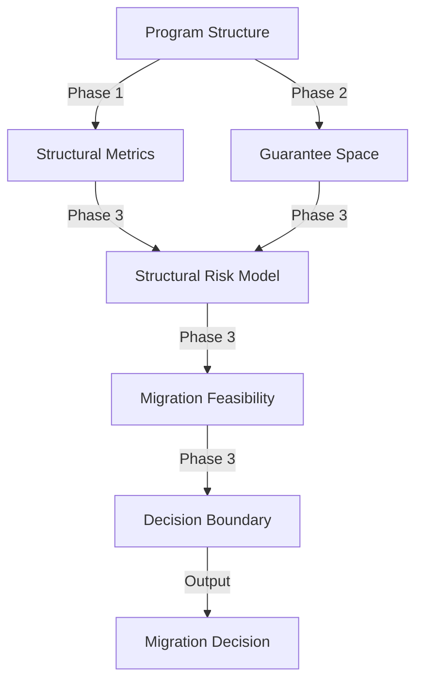
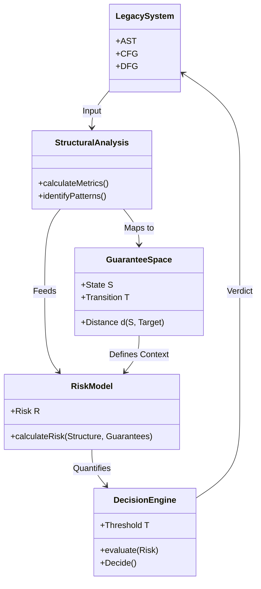

# Phase 3 Research Roadmap: Migration Decision Model

**Research Context:** COBOL Structure Analysis Laboratory  
**Focus:** Structural Theory for Legacy Migration Decision Making  
**Document ID:** `docs/Phase3_Research_Roadmap.md`

---

## 1. Phase 3 Overview

### Objective
The primary goal of **Phase 3** is to construct a **Migration Decision Model** that scientifically determines the feasibility and risk of migrating legacy COBOL systems. This phase bridges the gap between the structural analysis foundations established in Phase 1 and the guarantee space theory developed in Phase 2.

### Core Problem
How can we formally prove that a specific legacy system structure can be safely migrated to a modern architecture? We aim to replace heuristic "expert judgment" with a **calculable structural risk metric**.

### Conceptual Flow
The research progression follows this path:

---

## 2. Research Tasks

Phase 3 is divided into six strategic research tasks.

### Task 1: Guarantee Space Formalization for Decision Making
*   **Objective**: Refine the Guarantee Space theory to support binary decision-making (Safe/Unsafe).
*   **Theoretical Focus**:
    *   Formalize the **Guarantee Lattice** as a decision space.
    *   Define **Critical Guarantees** ($G_{crit}$) that *must* be preserved for migration to be valid.
    *   Map structural patterns (AST/CFG/DFG) to specific regions in the Guarantee Space.
*   **Expected Output**: `docs/60_decision/01_Guarantee_Decision_Space.md`

### Task 2: Structural Risk Model
*   **Objective**: Quantify the risk associated with specific code structures during migration.
*   **Theoretical Focus**:
    *   **Migration Debt**: Quantify the "distance" between the current structure and the target structure in terms of missing guarantees.
    *   **Complexity Risk**: Correlate Cyclomatic Complexity and Halstead Metrics with the probability of guarantee loss.
    *   **Dependency Risk**: Model the risk propagation through the dependency graph ($D$).
*   **Expected Output**: `docs/60_decision/02_Structural_Risk_Model.md`

### Task 3: Migration Feasibility Model
*   **Objective**: Define the mathematical conditions under which migration is theoretically possible.
*   **Theoretical Focus**:
    *   **Reachability**: Can the target state be reached from the initial state within the Guarantee Transition Graph?
    *   **Resource Constraints**: Introduce cost functions (time, effort) to the transition paths.
    *   **Blocking Structures**: Identify specific code patterns (e.g., irreducible control flow, unstructured data) that make the target unreachable.
*   **Expected Output**: `docs/60_decision/03_Migration_Feasibility.md`

### Task 4: Decision Boundary Model
*   **Objective**: Establish the threshold for "Go/No-Go" decisions.
*   **Theoretical Focus**:
    *   **Risk Tolerance**: Define a function $Acceptable(Risk)$ based on business constraints.
    *   **The Decision Inequality**: Migration is feasible if $Risk(System) < Threshold(Context)$.
    *   **Sensitivity Analysis**: How stable is the decision against small changes in structure or requirements?
*   **Expected Output**: `docs/60_decision/04_Decision_Boundary.md`

### Task 5: Case Study Mapping
*   **Objective**: Validate the theoretical models against common COBOL patterns.
*   **Theoretical Focus**:
    *   **"God Class" Migration**: Analyze the risk profile of monolithic programs.
    *   **"Spaghetti Code" Resolution**: Map the unraveling of GOTO structures to paths in the Guarantee Space.
    *   **Data Coupling**: Analyze the impact of shared `COPYBOOKS` on migration feasibility.
*   **Expected Output**: `docs/60_decision/05_Case_Study_Analysis.md`

### Task 6: Verification Framework
*   **Objective**: Define how to verify that the migration decision was correct post-migration.
*   **Theoretical Focus**:
    *   **Traceability**: Linking decision metrics back to source code.
    *   **Monitoring**: runtime verification of preserved guarantees.
    *   **Feedback Loop**: Using post-migration data to refine the Risk Model.
*   **Expected Output**: `docs/60_decision/06_Verification_Framework.md`

---

## 3. Expected Research Artifacts

The following documents will be produced as the primary output of Phase 3:

1.  **Theory Documents (`docs/60_decision/`)**:
    *   `01_Guarantee_Decision_Space.md`: Formal definitions.
    *   `02_Structural_Risk_Model.md`: Risk quantification formulas.
    *   `03_Migration_Feasibility.md`: Feasibility theorems.
    *   `04_Decision_Boundary.md`: The decision logic core.
    *   `05_Case_Study_Analysis.md`: Application to real-world patterns.
    *   `06_Verification_Framework.md`: Verification methodology.

2.  **Summary Report**:
    *   `docs/Phase3_Summary.md`: A consolidated view of the Migration Decision Model.

---

## 4. Final Structural Integration

The culmination of Phase 3 will be a unified **Migration Decision System**.

---

## 5. Execution Strategy

1.  **Sequential Execution**: Tasks 1 through 4 will be executed sequentially to build the theoretical core.
2.  **Validation**: Task 5 (Case Studies) will be used to test the theories from Tasks 1-4.
3.  **Refinement**: Task 6 will provide the framework for continuous improvement.

**Next Step**: Begin Task 1 by executing `docs/prompts/phase3/01_Guarantee-Space-Formalization.prompt.md`.
