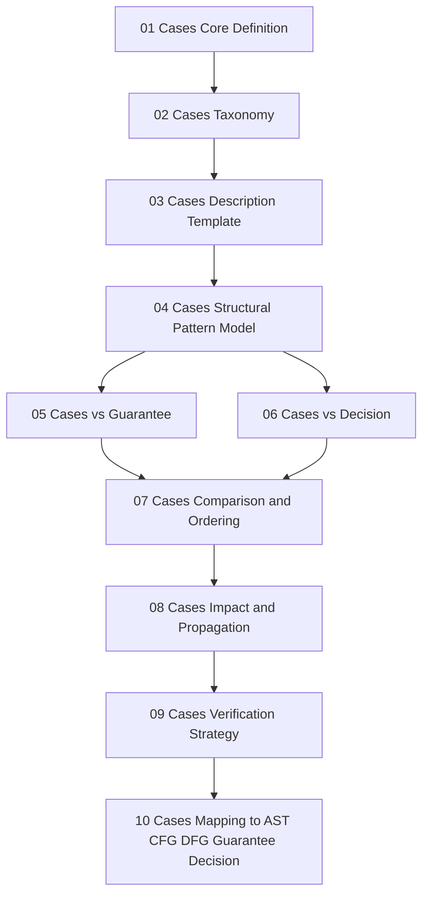

# Phase7：70_cases ロードマップ
**テーマ：ケースを通じた移行判断モデルの適用可能性検証**

---

## 1. Phase7 の位置づけ

Phase7 の `70_cases` は、これまでに定義してきた

- AST による構造表現
- Guarantee による保証単位
- Decision による移行判断軸

を、**実際のケースへ適用するための検証層**です。

ここでの目的は、単に事例を並べることではなく、各ケースを使って次の問いに答えられるようにすることです。

- どのような構造を持つ対象が
- どのような保証条件を必要とし
- どの判断軸によって
- 移行可否・難易度・影響範囲が分かれるのか

つまり `70_cases` は、**構造モデルを現実の判断材料へ接続する層**です。

---

## 2. Phase7 の主目的

### 主目的
ケースを用いて、構造抽出モデルと判断モデルの妥当性を検証する。

### 副目的
- 抽象モデルがどの程度ケースに適用可能かを確認する
- ケース差異を分類し、判断の再利用性を高める
- 移行判断に必要な最小観測単位を確定する
- 将来的なスコアリングや自動診断モデルの土台を作る

---

## 3. Phase7 の研究対象

`70_cases` で扱うのは、単なるサンプルプログラムではなく、**判断検証用ケース**です。  
各ケースは次の3層で記述します。

### 構文層
- COBOL 構文上の特徴
- IF / EVALUATE / PERFORM / GO TO / FILE I/O / COPY / WORKING-STORAGE など

### 構造層
- 制御構造
- データ依存
- 入出力依存
- 外部定義依存
- 段落分割と責務分離
- ネスト深度
- 結合度

### 判断層
- 移行可能性
- 保証困難性
- 影響範囲
- テスト要求量
- リスク要因
- 分割移行のしやすさ
- 代替実装の余地

---

## 4. Phase7 の基本方針

### 方針1：ケースは「具体例」ではなく「判断パターン」として扱う
個別案件の説明ではなく、構造的特徴を抽出可能な形にする。

### 方針2：ケースを分類体系の材料にする
ケース収集の目的は数ではなく、**構造的に異なる代表型を確立すること**。

### 方針3：Case → Pattern → Decision へ抽象化する
最終的には個別ケースを越えて、判断テンプレートに昇華する。

### 方針4：良いケースと悪いケースの両方を扱う
移行容易なケースだけでなく、境界曖昧・依存過多・保証困難なケースを含める。

---

## 5. Phase7 の成果物イメージ

`70_cases` では、最終的に次の成果物群を作るのが自然です。

- ケース定義書
- ケース分類表
- ケース評価軸
- ケース比較表
- ケースから抽出した判断パターン集
- ケースと AST/CFG/DFG/Guarantee/Decision の対応表
- ケースベースの移行可否判定テンプレート

---

## 6. Phase7 の推奨ロードマップ

以下を **10本構成** にすると、Phase6 と同様に扱いやすいです。

### 01_Cases-Core-Definition.md
#### 目的
`Case` とは何かを定義する。

#### 内容
- ケースの研究目的
- ケースの単位
- ケースと Scope / Guarantee / Decision の関係
- ケースを「事例」ではなく「判断検証単位」として定義
- ケース記述の最小構成要素

#### 到達点
- `Case` の定義がぶれなくなる
- 以後の文書でケースの意味が統一される

---

### 02_Cases-Taxonomy.md
#### 目的
ケースの分類体系を定義する。

#### 内容
分類軸の候補：

- 制御構造中心ケース
- データ構造中心ケース
- I/O中心ケース
- 外部依存中心ケース
- 保証困難ケース
- 分割移行可能ケース
- 影響伝播が大きいケース
- 境界曖昧ケース

さらに分類粒度：

- 単一構文ケース
- 複合構造ケース
- 業務責務ケース
- システム連携ケース

#### 到達点
- ケースの集め方にルールができる
- 「何を代表ケースにするか」を決められる

---

### 03_Cases-Description-Template.md
#### 目的
各ケースを同じフォーマットで記述できるようにする。

#### 内容
テンプレート項目例：

- ケースID
- ケース名
- 対象構文
- 構造要約
- 関与ノード
- 制御構造
- データ依存
- I/O依存
- 外部依存
- 想定保証項目
- 判断上の論点
- 想定リスク
- 移行難所
- 分割可能性
- 推定検証コスト

#### 到達点
- ケース比較が可能になる
- 評価の再現性が上がる

---

### 04_Cases-Structural-Pattern-Model.md
#### 目的
ケースを構造パターンとして抽象化する。

#### 内容
- ケースから抽出される構造パターン
- 単純分岐型
- 多分岐判定型
- 状態依存型
- 反復更新型
- 入出力駆動型
- 外部定義拘束型
- 段落遷移複雑型
- データ共有密結合型

#### 到達点
- 個別ケースを越えたパターン化が可能になる
- 判断モデルとの接続がしやすくなる

---

### 05_Cases-vs-Guarantee.md
#### 目的
ケースと Guarantee の関係を定義する。

#### 内容
- どのケースでどの保証が必要か
- 保証密度の高いケース
- 保証衝突が起きやすいケース
- 保証単位の分解可能性
- ケースごとの保証コスト
- ケースと Guarantee Space との対応

#### 到達点
- ケースが保証理論の検証材料になる
- 「難しいケース」の本質を保証観点で説明できる

---

### 06_Cases-vs-Decision.md
#### 目的
ケースと移行判断モデルの関係を定義する。

#### 内容
- ケースをどの判断軸で評価するか
- 可移行 / 要分割 / 要代替 / 要保留 の判定
- ケースごとの判断材料
- 判断に必要な観測情報
- 構造不足時の判定不能条件

#### 到達点
- ケースをもとに判断モデルを実証できる
- 「なぜその判断になるか」が説明可能になる

---

### 07_Cases-Comparison-and-Ordering.md
#### 目的
ケース同士を比較し、難易度や優先順位を整理する。

#### 内容
- ケース比較軸
- 複雑度比較
- 保証量比較
- 影響範囲比較
- 境界明瞭性比較
- 分割可能性比較
- 移行優先順位付け
- PoC 向きケースと本番危険ケースの区別

#### 到達点
- ケースの優先度が決まる
- 実証対象の選定ができる

---

### 08_Cases-Impact-and-Propagation.md
#### 目的
ケースごとの影響伝播特性を分析する。

#### 内容
- ケース内の変更影響
- ケース外への影響拡張
- データ項目変更時の伝播
- 制御条件変更時の伝播
- COPY変更による影響
- I/O仕様変更による影響
- 影響閉包の観点から見たケース特性

#### 到達点
- ケースが影響分析モデルの試験台になる
- 変更リスクの定量化準備ができる

---

### 09_Cases-Verification-Strategy.md
#### 目的
ケースの妥当性をどのように検証するかを定義する。

#### 内容
- ケース検証の対象
- 構造抽出の正しさ
- 保証割当の妥当性
- 判断結果の一貫性
- ケース比較結果の妥当性
- レビュー方式
- 将来の自動判定への接続可能性

#### 到達点
- `70_cases` が単なる記述集で終わらない
- 検証可能な研究単位になる

---

### 10_Cases-Mapping-to-AST-CFG-DFG-Guarantee-Decision.md
#### 目的
ケースと既存モデル群の接続を明示する。

#### 内容
- ケース → AST ノード群
- ケース → CFG 部分構造
- ケース → DFG 依存構造
- ケース → Guarantee 集合
- ケース → Decision 判定軸
- ケースをモデル横断でどう扱うか
- 将来のケースベース推論モデルへの布石

#### 到達点
- `70_cases` が独立章ではなく、全体モデルの接続層になる
- 研究体系全体の整合性が完成に近づく

---

## 7. 実施順序

推奨順は次です。

```text
01 定義
→ 02 分類
→ 03 記述テンプレート
→ 04 構造パターン化
→ 05 Guarantee 接続
→ 06 Decision 接続
→ 07 比較と序列化
→ 08 影響伝播
→ 09 検証戦略
→ 10 モデル横断マッピング
```

この順序にする理由は、

- まずケースそのものを定義し
- 収集・記述方式を決め
- そこから抽象化し
- 保証／判断へ接続し
- 最後に全体モデルへ埋め戻す

という流れが最も整合的だからです。

---

## 8. Phase7 の完了条件

Phase7 は、単に 10 本の文書を書いたら完了ではありません。  
以下が満たされたときに完了とみなせます。

### 完了条件
- Case の定義が Scope / Guarantee / Decision と矛盾しない
- ケース分類が再利用可能である
- 各ケースを同一テンプレートで記述できる
- ケースを構造パターンへ抽象化できる
- ケースごとに必要保証を説明できる
- ケースごとに移行判断を説明できる
- ケース比較に一貫した評価軸がある
- 変更影響分析にケースを使える
- 検証方針が定義されている
- AST / CFG / DFG / Guarantee / Decision への対応付けができている

---

## 9. Phase7 の先に見える Phase8 候補

`70_cases` の次は、自然には次のどちらかになります。

### 候補A：80_evaluation
ケースに基づく評価・計量化へ進む
- 難易度指標
- 保証コスト
- リスクスコア
- 判断一貫性評価

### 候補B：80_patterns
ケースから抽出した構造パターン群を独立章として整理する
- 典型構造パターン
- 反パターン
- 移行困難パターン
- 分割移行向きパターン

研究の流れとしては、  
**70_cases は 80_evaluation または 80_patterns への橋渡し層**になります。

---

## 10. ディレクトリ構成案

```text
docs/
└─ 70_cases/
   ├─ 01_Cases-Core-Definition.md
   ├─ 02_Cases-Taxonomy.md
   ├─ 03_Cases-Description-Template.md
   ├─ 04_Cases-Structural-Pattern-Model.md
   ├─ 05_Cases-vs-Guarantee.md
   ├─ 06_Cases-vs-Decision.md
   ├─ 07_Cases-Comparison-and-Ordering.md
   ├─ 08_Cases-Impact-and-Propagation.md
   ├─ 09_Cases-Verification-Strategy.md
   └─ 10_Cases-Mapping-to-AST-CFG-DFG-Guarantee-Decision.md
```

---

## 11. Mermaid による Phase7 全体像



---

## 12. この Phase7 の本質

Phase7 の本質は、**理論をケースで崩さずに通せるかを見ること**です。

`10_ast` が構造の観測基盤、  
`50_guarantee` が保証の意味論、  
`60_decision` が判断軸なら、  
`70_cases` はそれらを**実証可能な単位へ落とす層**です。

したがって、ここでは
「ケースをたくさん集める」ことよりも、
「ケースを使って何が説明できるか」を優先するのが重要です。
