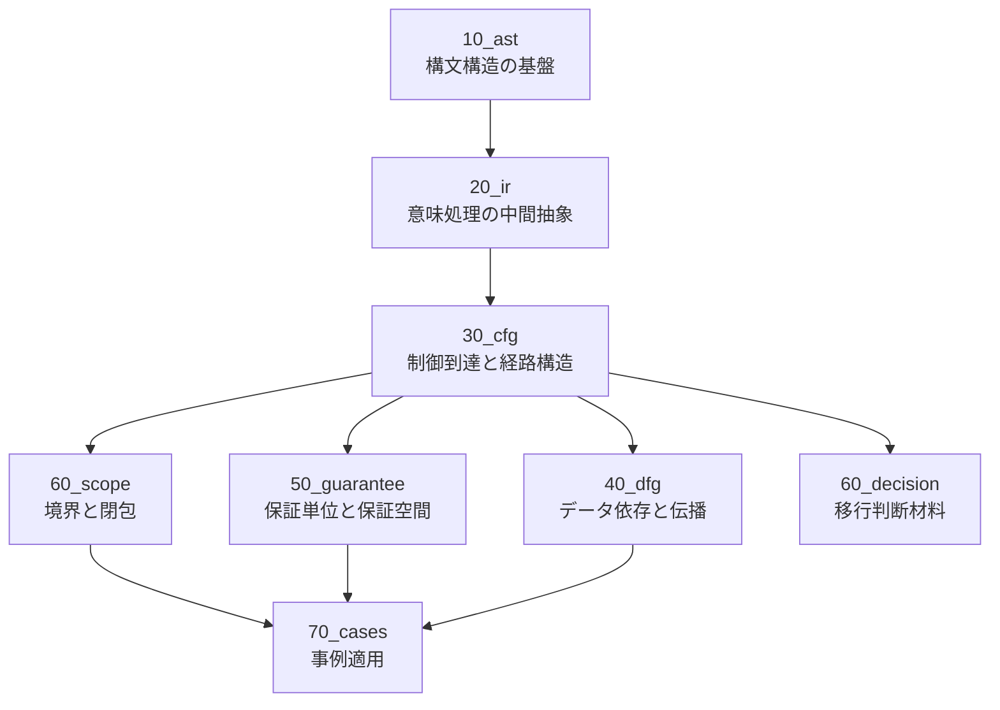

# Phase9 Roadmap: 30_CFG

## 1. 位置づけ

Phase9 では、`30_cfg` を研究対象として実行する。  
ここで扱う CFG は、単なる「分岐とジャンプの図」ではない。  
本フェーズで定義する CFG は、**COBOL プログラムの制御構造を、移行判断・保証範囲・変更影響分析に接続するための構造モデル**である。

本研究空間では、CFG を以下の 3 層で扱う。

- **構文層**: IF / EVALUATE / PERFORM / GO TO / EXIT などの表層制御記述
- **構造層**: 基本ブロック、分岐点、反復点、到達可能性、支配関係、出口構造
- **判断層**: 移行単位の切り出し、保証単位との整合、影響伝播、危険構造の検出

したがって `30_cfg` は、`10_ast` の上に構築され、`20_ir` と整合し、後続の `40_dfg` `50_guarantee` `60_decision` `70_cases` に橋をかける中核フェーズとなる。

---

## 2. Phase9 の目的

Phase9 の目的は、COBOL の制御構造を抽象化し、次の問いに答えられる CFG モデルを定義することである。

1. **この制御構造は、どの単位で閉じているか**
2. **どこで分岐し、どこで収束するか**
3. **どの経路が保証対象となるか**
4. **どの経路が未保証・高リスク経路か**
5. **どのノード／辺が変更影響を増幅するか**
6. **AST / IR / Scope / Guarantee とどう接続されるか**

このため、Phase9 では以下を成果物として確立する。

- CFG のコア定義
- COBOL 制御文から CFG への写像規則
- ノード／エッジ／領域の分類体系
- 基本ブロックと制御領域の定義
- ループ・分岐・出口・異常遷移の扱い
- 支配関係・到達可能性・合流点の基礎定義
- Guarantee / Scope / Migration Unit への接続条件
- 高リスク制御構造の検出観点

---

## 3. 本フェーズで採る基本方針

### 3.1 抽象化の方針

CFG は「実行順序の詳細再現」ではなく、**制御判断に必要な最小十分構造**として定義する。  
したがって、実装依存の低水準ジャンプ表現ではなく、以下を優先する。

- 分岐の存在
- 経路の閉包性
- ループの有無
- 収束点の明示
- 早期離脱の検出
- 影響が伝播する境界

### 3.2 COBOL 特有構造への対応

COBOL の CFG は、一般的な構造化言語の CFG よりも次の点で難しい。

- paragraph / section 単位の制御遷移
- `PERFORM THRU` による範囲遷移
- `GO TO` による非構造遷移
- `ALTER` のような動的遷移の存在可能性
- `NEXT SENTENCE` / `EXIT PARAGRAPH` / `EXIT SECTION` の出口構造
- 宣言節や I/O 例外処理との境界

したがって、Phase9 では「構造化 CFG」だけでなく、**非構造制御を含む拡張 CFG** を視野に入れる。

### 3.3 判断材料としての CFG

本フェーズでは、CFG を最終的に次の判断に使える形へ接続する。

- この範囲は安全に移行単位として分割できるか
- この分岐は保証単位を分離する必要があるか
- このループは状態依存で高リスクか
- この `GO TO` は構造回復を要するか
- この段落群は単一の制御閉包を持つか

---

## 4. Phase9 の研究対象範囲

### 4.1 対象に含むもの

- 基本ブロックの定義
- Entry / Exit / Branch / Merge / Loop の定義
- IF / EVALUATE / PERFORM / GO TO / EXIT 系の制御抽象化
- paragraph / section 間遷移
- 到達可能性
- 支配関係（dominator の概念レベル定義）
- 制御領域の境界
- ループ構造の抽象化
- 異常遷移・非構造遷移の分類
- AST / IR / Scope / Guarantee への接続

### 4.2 本フェーズでは深入りしないもの

- 実装アルゴリズム詳細
- 解析器実装や最適化手法
- グラフライブラリやデータ構造の具体実装
- 実行時性能評価

本フェーズは、**CFG の構造定義と判断接続の理論化** に専念する。

---

## 5. 成果物の全体像

Phase9 では、`docs/30_cfg/` 配下に 10 本の中核文書を作成する。

```text
/docs/30_cfg/
  01_CFG-Core-Definition.md
  02_CFG-Node-and-Edge-Taxonomy.md
  03_Basic-Block-and-Control-Region.md
  04_CFG-Mapping-from-AST-and-IR.md
  05_Branch-Merge-and-Path-Structure.md
  06_Loop-and-Iteration-Model.md
  07_NonStructured-Control-and-GOTO.md
  08_Dominance-Reachability-and-Closure.md
  09_CFG-to-Scope-Guarantee-Decision.md
  10_CFG-Risk-Patterns-and-Migration-Readiness.md
```

必要に応じて補助資料として以下を追加する。

```text
/docs/prompts/research/phase9/
/log/research-log/
/diagrams/mermaid/
```

---

## 6. 実行順序ロードマップ

本フェーズは以下の順序で進める。

### Step 1. CFG の存在理由を固定する
最初に、CFG を「なぜ必要か」で固定する。  
目的は、AST・IR と役割が重複しないようにすることである。

- AST は構文構造
- IR は意味処理の中間抽象
- CFG は制御到達と経路閉包の抽象

この切り分けを先に明示することで、以後の定義がぶれない。

### Step 2. ノードとエッジの語彙を定義する
CFG の最小語彙を固定する。

- entry
- exit
- basic block
- branch
- merge
- loop header
- back edge
- abnormal edge
- call-like transfer
- paragraph transition

ここで重要なのは、**COBOL 特有の paragraph / section 制御を汎用 CFG 語彙にどう収めるか** である。

### Step 3. 基本ブロックと制御領域を定義する
単文単位ではなく、解析と判断の基本単位となる「まとまり」を定義する。

- 連続実行可能な直線区間
- 単一入口かどうか
- 単一出口かどうか
- 領域の閉包条件

### Step 4. AST / IR から CFG への写像を定義する
どのノード列・構文列から、どの制御グラフが導かれるかを定義する。

- IF → 2 分岐 + merge
- EVALUATE → 多分岐 + merge
- PERFORM UNTIL / VARYING → loop structure
- GO TO → 非構造 edge
- paragraph fall-through → 明示的 control edge

### Step 5. 分岐・合流・経路の構造を定義する
どの経路が制御上意味を持つかを整理する。

- path
- feasible / infeasible の概念準備
- branch coverage の前提構造
- merge 点の意味
- 早期脱出経路

### Step 6. ループを抽象化する
COBOL の `PERFORM` 系を中心に反復構造を整理する。

- pre-test loop
- post-test loop 相当の扱い
- counted / varying loop
- paragraph range loop
- nested loop

### Step 7. 非構造制御を独立論点として整理する
特に `GO TO` を、単に悪いものとしてではなく、**構造破壊の程度** で分類する。

- 局所ジャンプ
- 領域横断ジャンプ
- ループ破壊ジャンプ
- 入口多重化
- 出口多重化

### Step 8. 支配・到達・閉包性を導入する
移行判断に効くグラフ性質を定義する。

- reachable
- dominator
- post-dominator
- closed control region
- single-entry / single-exit

### Step 9. Scope / Guarantee / Decision に接続する
CFG を単独モデルで終わらせず、既存理論に接続する。

- Scope の境界候補
- Guarantee Unit の経路依存性
- migration unit の制御的閉包性
- decision のための危険構造指標

### Step 10. リスクパターンを定義する
最後に、実務に接続する観点として、危険構造を抽出する。

- 非構造ジャンプ密度
- 多出口領域
- 深い分岐ネスト
- 長距離 back edge
- paragraph 横断の複雑化
- 例外経路の未閉包

---

## 7. 各ファイルの役割定義

### 01_CFG-Core-Definition.md

**役割**: CFG の存在理由、抽象レベル、対象範囲を定義する中核文書。  
**主題**:

- CFG とは何か
- AST / IR / DFG との役割差
- 制御構造をどの粒度で表すか
- ノード・辺・経路・領域の最小定義
- 構文層／構造層／判断層の区別

**到達点**: Phase9 全体の基準語彙を確定する。

---

### 02_CFG-Node-and-Edge-Taxonomy.md

**役割**: ノード／エッジの分類体系を定義する。  
**主題**:

- entry / exit / branch / merge / loop header / terminal
- normal edge / conditional edge / back edge / abnormal edge
- paragraph transition edge
- section boundary edge
- structured / non-structured edge の区別

**到達点**: CFG 記述に使う部品の語彙を固定する。

---

### 03_Basic-Block-and-Control-Region.md

**役割**: CFG のまとまり単位を定義する。  
**主題**:

- 基本ブロックの条件
- 単一入口・単一出口
- 制御領域の閉包
- region と scope 候補の関係
- paragraph と region のズレ

**到達点**: 解析単位と判断単位の橋渡しを作る。

---

### 04_CFG-Mapping-from-AST-and-IR.md

**役割**: AST / IR から CFG がどう生成されるかを定義する。  
**主題**:

- IF / EVALUATE / PERFORM / GO TO の写像
- statement 列から block を生成する規則
- paragraph / section をまたぐ制御の写像
- IR 上の control operation と CFG edge の対応

**到達点**: `10_ast` `20_ir` との接続面を確定する。

---

### 05_Branch-Merge-and-Path-Structure.md

**役割**: 分岐・合流・経路の概念を整理する。  
**主題**:

- path の定義
- 分岐の開き方
- merge の意味
- 多分岐構造
- 早期 return / early exit 相当
- path-sensitive 保証への接続準備

**到達点**: 保証単位を経路依存で捉える基礎を作る。

---

### 06_Loop-and-Iteration-Model.md

**役割**: 反復構造の抽象モデルを定義する。  
**主題**:

- PERFORM UNTIL
- PERFORM VARYING
- paragraph / THRU の反復
- nested loop
- loop header / loop body / exit edge
- termination 条件の構造的位置づけ

**到達点**: ループを移行難易度と結びつける基盤を作る。

---

### 07_NonStructured-Control-and-GOTO.md

**役割**: 非構造制御を独立に理論化する。  
**主題**:

- GO TO の類型化
- 構造回復可能性
- 多入口／多出口の生成
- paragraph 横断ジャンプ
- ループ破壊ジャンプ
- 非構造度の指標候補

**到達点**: 高リスク制御構造の基礎分類を定義する。

---

### 08_Dominance-Reachability-and-Closure.md

**役割**: グラフ性質を導入し、制御閉包を定義する。  
**主題**:

- reachability
- dominator / post-dominator
- control closure
- single-entry / single-exit region
- irreducible な制御構造の扱い

**到達点**: Scope / Migration Unit を切り出すための構造基準を得る。

---

### 09_CFG-to-Scope-Guarantee-Decision.md

**役割**: 既存理論との接続文書。  
**主題**:

- CFG と Scope 境界
- CFG と Guarantee Unit
- 経路保証と制御保証
- migration decision の判断材料
- 保証不能経路の概念

**到達点**: `30_cfg` を全体理論の中に組み込む。

---

### 10_CFG-Risk-Patterns-and-Migration-Readiness.md

**役割**: 実務的判断に直結する危険構造の整理。  
**主題**:

- 高リスク CFG パターン
- 分割困難領域
- 未閉包経路
- 例外処理絡みの複雑性
- 移行準備度評価への接続

**到達点**: 研究成果を移行可否判断の材料へ落とし込む。

---

## 8. 期待される主要概念

Phase9 で明示的に定義すべき主要概念を列挙する。

### 8.1 コア概念

- Control Flow Graph
- Node
- Edge
- Path
- Entry
- Exit
- Merge
- Branch
- Basic Block
- Control Region

### 8.2 発展概念

- Reachability
- Dominance
- Post-dominance
- Loop header
- Back edge
- Closed region
- Multi-entry region
- Multi-exit region
- Irreducible control

### 8.3 判断接続概念

- Scope candidate
- Guarantee path
- Uncovered path
- Risky transfer
- Migration-ready region
- Control complexity hotspot

---

## 9. 研究上の重要論点

### 9.1 CFG の単位は paragraph か basic block か

これは最重要論点の一つである。  
paragraph は COBOL 実務での自然単位だが、CFG の最小構造単位とは一致しない。  
したがって本研究では、

- **制御解析単位** = basic block
- **業務・保守参照単位** = paragraph / section

という二層モデルを採るのが自然である。

### 9.2 構造化制御と非構造制御を同じ CFG に載せるか

結論としては、同じ CFG 上に載せつつ、**edge taxonomy で差を明示する** のがよい。  
これにより、通常経路と危険経路を同一枠内で比較できる。

### 9.3 Guarantee Unit はノード単位か経路単位か

Phase9 の時点では、Guarantee は少なくとも一部で **経路依存** と捉える必要がある。  
同じノード集合でも、どの分岐を経由するかで保証条件が変わるからである。

### 9.4 Scope は CFG の閉包で定義できるか

これは `60_scope` との接続論点である。  
単純な single-entry / single-exit だけでは不足する可能性がある。  
COBOL では paragraph 横断や非構造ジャンプにより、制御閉包と業務閉包がずれるためである。

---

## 10. Phase9 の完了条件

Phase9 は、以下を満たしたとき完了とみなす。

1. CFG のコア定義が文章として閉じている
2. ノード／エッジ分類が一貫している
3. 基本ブロックと paragraph の関係が説明できる
4. IF / EVALUATE / PERFORM / GO TO の写像規則が定義されている
5. ループ構造が独立概念として整理されている
6. 非構造制御の分類が示されている
7. reachability / dominance / closure が判断論に接続されている
8. Scope / Guarantee / Decision へのリンクが明文化されている
9. 高リスク制御パターンが列挙されている
10. 後続の `40_dfg` に渡せる制御境界が定義されている

---

## 11. 推奨ディレクトリ構成

```text
/docs/30_cfg/
  01_CFG-Core-Definition.md
  02_CFG-Node-and-Edge-Taxonomy.md
  03_Basic-Block-and-Control-Region.md
  04_CFG-Mapping-from-AST-and-IR.md
  05_Branch-Merge-and-Path-Structure.md
  06_Loop-and-Iteration-Model.md
  07_NonStructured-Control-and-GOTO.md
  08_Dominance-Reachability-and-Closure.md
  09_CFG-to-Scope-Guarantee-Decision.md
  10_CFG-Risk-Patterns-and-Migration-Readiness.md

/docs/prompts/research/phase9/
  01_CFG-Core-Definition.prompt.md
  02_CFG-Node-and-Edge-Taxonomy.prompt.md
  03_Basic-Block-and-Control-Region.prompt.md
  04_CFG-Mapping-from-AST-and-IR.prompt.md
  05_Branch-Merge-and-Path-Structure.prompt.md
  06_Loop-and-Iteration-Model.prompt.md
  07_NonStructured-Control-and-GOTO.prompt.md
  08_Dominance-Reachability-and-Closure.prompt.md
  09_CFG-to-Scope-Guarantee-Decision.prompt.md
  10_CFG-Risk-Patterns-and-Migration-Readiness.prompt.md

/log/research-log/
  2026-03-29_Phase9_CFG_Roadmap.md
```

---

## 12. Mermaid による全体像



---

## 13. 実行時の観点メモ

Phase9 を進める際は、常に以下の視点を保持する。

### 13.1 構文に引きずられない
IF や PERFORM の見た目ではなく、**どこで分岐し、どこで閉じるか** を見る。

### 13.2 業務上の意味単位と制御単位を分ける
paragraph は保守上重要だが、制御解析上の最小単位ではない。  
このズレを明示的に扱う。

### 13.3 GOTO を例外扱いしすぎない
GOTO は排除対象ではなく、**構造回復対象** である。  
どの程度まで局所化・回復できるかが判断材料になる。

### 13.4 Guarantee と接続できるかを常に確認する
CFG が単独で完結すると研究が分断される。  
各定義は「保証経路」「未保証経路」に接続可能かを都度確認する。

---

## 14. このフェーズの最終成果

Phase9 完了時には、`30_cfg` は次の価値を持つはずである。

- COBOL の制御構造を、単なる分岐図ではなく**移行判断モデル**として語れる
- `10_ast` `20_ir` `50_guarantee` `60_scope` `60_decision` の中継層として機能する
- 非構造制御を含む難所を、構造的に説明できる
- 後続の DFG やケース分析で、「どこからどこまでが制御的に一体か」を提供できる

すなわち `30_cfg` は、単なる制御グラフ定義ではなく、  
**移行可否判断に必要な「制御の見取り図」を理論化するフェーズ** である。

---

## 15. 次アクション

Phase9 開始時の推奨順序は次の通り。

1. `01_CFG-Core-Definition.md` を作成する
2. `02_CFG-Node-and-Edge-Taxonomy.md` で語彙を固定する
3. `03_Basic-Block-and-Control-Region.md` で解析単位を定義する
4. `04_CFG-Mapping-from-AST-and-IR.md` で既存研究成果に接続する
5. 以降 05〜10 を順に実行する

この順序により、定義 → 部品 → 単位 → 写像 → 経路 → ループ → 非構造 → 性質 → 接続 → 判断、という自然な積み上げになる。

