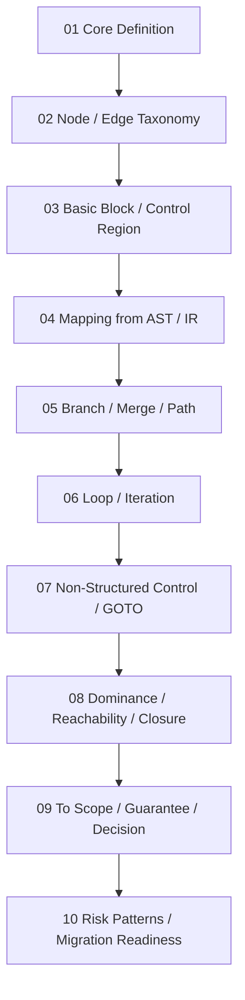

# Phase9 / 30_CFG INDEX

## 位置づけ

- 位置づけについての詳細はD:\dev\cobol-structure-analysis-lab\docs\prompts\phase9\30_Cgf_Roadmap.md 参照

本ファイルは、Phase9 として実施する `30_cfg` 研究群を、**そのまま運用できる単位**で一覧化した実行インデックスである。  
対象は、COBOL 構造解析研究室における **制御構造の抽象モデルとしての CFG（Control Flow Graph）** であり、単なる構文上の分岐図ではなく、**移行判断・影響分析・保証境界の基礎構造**として扱う。

本 INDEX は次の役割を持つ。

- Phase9 全体の実行順序を固定する
- 各ファイルの目的を明示する
- 各段階の完了条件を定義する
- 前段の成果が次段へどう接続するかを見える化する
- `30_cfg` を `10_ast` `20_ir` `50_guarantee` `60_decision` `60_scope` と整合した研究単位として運用可能にする

---

## Phase9 の研究目標

Phase9 の目標は、COBOL プログラムの制御構造を、移行判断可能な抽象水準で表現する CFG モデルを定義することである。

このとき重要なのは、CFG を単なる実行順の矢印集合としてではなく、以下の判断材料を生成する構造層として確立することである。

- どこが分岐点か
- どこが合流点か
- どこに反復構造があるか
- どこに非構造ジャンプがあるか
- どの領域が局所的に閉じているか
- どの経路が保証対象やスコープ境界に影響するか
- どの構造が移行難易度やリスクを押し上げるか

---

## 実行順序の原則

Phase9 の 10 本は、以下の順序で実行する。

1. 中核定義を確立する
2. 構成要素を分類する
3. 局所構造単位を定義する
4. AST / IR からの接続関係を確立する
5. 分岐・合流・経路構造を定義する
6. 反復構造を定義する
7. 非構造制御を扱う
8. 到達性・支配性・閉包性を定義する
9. Scope / Guarantee / Decision に接続する
10. リスクパターンとして判断層へ引き上げる

この順序を崩すと、後半で用いる概念（支配、閉包、リスク、判断接続）が未定義になるため、原則として順番に進める。

- 各実行指示で、ファイルが生成、されたときそれっらのファイルを順次commitしてください

---

## 実行一覧

| No | ファイル名 | 主目的 | 主な到達点 | 完了条件 |
|---|---|---|---|---|
| 01 | `01_CFG-Core-Definition.prompt.md` | CFG の中核定義を与える | CFG の役割・抽象度・対象範囲を明示 | CFG を構文層ではなく構造層の制御モデルとして定義できている |
| 02 | `02_CFG-Node-and-Edge-Taxonomy.prompt.md` | ノードとエッジの分類体系を作る | 分岐・合流・開始・終了・ジャンプなどの分類を定義 | CFG 構成要素の型体系が曖昧さなく列挙されている |
| 03 | `03_Basic-Block-and-Control-Region.prompt.md` | 基本ブロックと局所制御領域を定義する | 直列実行単位と局所閉包単位を定義 | 局所解析単位としての block / region が使える状態になっている |
| 04 | `04_CFG-Mapping-from-AST-and-IR.prompt.md` | AST / IR から CFG への写像規則を定義する | どの構造がどのノード・辺へ落ちるかを整理 | AST / IR / CFG 間の接続規則が明示されている |
| 05 | `05_Branch-Merge-and-Path-Structure.prompt.md` | 分岐・合流・経路構造を定義する | 条件分岐のパス分解と再合流構造を定義 | 経路構造が解析対象として明示的に扱える |
| 06 | `06_Loop-and-Iteration-Model.prompt.md` | 反復・循環構造を定義する | PERFORM VARYING / UNTIL 等を反復モデルとして整理 | ループ構造を CFG 上で識別・分類できる |
| 07 | `07_NonStructured-Control-and-GOTO.prompt.md` | 非構造制御を扱う | GOTO 等の構造破壊要素をモデル化する | 非構造制御を例外ではなく分析対象として定義できている |
| 08 | `08_Dominance-Reachability-and-Closure.prompt.md` | 到達性・支配性・閉包性を定義する | CFG の解析概念を判断基盤へ引き上げる | dominance / reachability / closure が操作可能概念として定義されている |
| 09 | `09_CFG-to-Scope-Guarantee-Decision.prompt.md` | CFG を他理論へ接続する | Scope / Guarantee / Decision との対応を定義 | CFG が単独理論ではなく研究全体へ接続されている |
| 10 | `10_CFG-Risk-Patterns-and-Migration-Readiness.prompt.md` | リスクパターンに落とし込む | 移行難易度・監査観点・準備度へ接続 | CFG 研究の成果が判断材料として出力できる |

---

## 各ファイルの詳細運用指針

### 01_CFG-Core-Definition

**目的**  
CFG とは何かを、研究空間における正式定義として与える。

**この段階で決めること**
- CFG の抽象度
- CFG が扱う対象
- CFG が扱わない対象
- AST / IR との役割分担
- 判断層に接続するための前提

**完了条件**
- CFG の定義文が明文化されている
- 「なぜ CFG が必要か」が研究目的に照らして説明されている
- 構文木との差異が明示されている

---

### 02_CFG-Node-and-Edge-Taxonomy

**目的**  
CFG を構成するノードとエッジの型を定義する。

**この段階で決めること**
- 開始 / 終了ノード
- 実行ノード
- 条件分岐ノード
- 合流ノード
- ループ境界ノード
- ジャンプ系ノード
- 例外的遷移や中断遷移
- 辺の意味分類

**完了条件**
- 主要ノード型と辺型が一覧化されている
- それぞれの意味が重複なく定義されている
- 後続の block / path / loop 議論の前提として使える

---

### 03_Basic-Block-and-Control-Region

**目的**  
CFG 上での局所解析単位を定義する。

**この段階で決めること**
- Basic Block の定義
- Control Region の定義
- 直列実行領域
- 局所的に閉じた制御領域
- Region の入出口条件

**完了条件**
- block と region の違いが明示されている
- 局所解析の単位が操作可能になっている
- Scope や影響伝播と接続しやすい形に整理されている

---

### 04_CFG-Mapping-from-AST-and-IR

**目的**  
AST / IR の構造から CFG をどう構成するかを定義する。

**この段階で決めること**
- statement / paragraph / section の写像粒度
- IF / EVALUATE / PERFORM / GOTO の写像方針
- IR 上の中間制御表現との対応
- 写像時に失われる情報 / 保持される情報

**完了条件**
- AST→CFG、IR→CFG の写像規則が説明できる
- CFG 生成の前提と限界が示されている
- 研究全体の構造連携が明確になっている

---

### 05_Branch-Merge-and-Path-Structure

**目的**  
分岐・合流・経路を CFG の中心構造として定義する。

**この段階で決めること**
- 条件分岐の path 分解
- merge の定義
- path の同値性 / 差異
- path 数の増加と複雑性
- 条件網羅や経路保証との接続

**完了条件**
- branch / merge / path がそれぞれ定義されている
- path を保証やリスクの単位として扱える
- Decision との接続の下地ができている

---

### 06_Loop-and-Iteration-Model

**目的**  
CFG 上で反復構造をモデル化する。

**この段階で決めること**
- loop header / body / exit の定義
- back edge の扱い
- PERFORM VARYING / UNTIL / TIMES の抽象化
- 反復境界と停止条件
- 入れ子ループや複合ループの扱い

**完了条件**
- 反復構造の識別規則がある
- ループを単なる循環ではなく制御構造として定義できている
- 移行時の難所としての loop 特性に触れられている

---

### 07_NonStructured-Control-and-GOTO

**目的**  
非構造制御を CFG の例外ではなく本体の一部として扱う。

**この段階で決めること**
- GOTO の構造的位置づけ
- paragraph 跨ぎ遷移
- section 跨ぎ遷移
- fall-through や暗黙遷移
- 非構造性の定義
- 構造回復の可能性

**完了条件**
- 非構造制御の型が定義されている
- 構造破壊がどのように CFG に現れるか説明できる
- 移行リスクへ接続できている

---

### 08_Dominance-Reachability-and-Closure

**目的**  
CFG の解析概念を明示し、判断層で使える土台を作る。

**この段階で決めること**
- reachability の定義
- dominance / post-dominance の定義
- closure / region closure の定義
- 入口支配 / 出口支配
- 閉じた領域と開いた領域の区別

**完了条件**
- 到達性・支配性・閉包性が定義されている
- それらが保証境界や影響境界に使えると示されている
- Scope / Guarantee 側への橋渡しが成立している

---

### 09_CFG-to-Scope-Guarantee-Decision

**目的**  
CFG を研究全体の理論群へ接続する。

**この段階で決めること**
- CFG と Scope 境界の対応
- CFG と Guarantee Unit の対応
- CFG と Decision 単位の対応
- 経路と保証の関係
- 制御閉包と判断閉包の関係

**完了条件**
- CFG が Scope / Guarantee / Decision のどこに効くか明示されている
- CFG の成果が他ディレクトリへ輸送可能になっている
- 単独理論で終わっていない

---

### 10_CFG-Risk-Patterns-and-Migration-Readiness

**目的**  
CFG 研究を最終的に移行判断材料へ変換する。

**この段階で決めること**
- リスクの高い CFG パターン
- 構造回復困難なパターン
- 保証困難な経路構造
- テスト困難性との関係
- 移行準備度の指標案

**完了条件**
- 代表的リスクパターンが列挙されている
- 「どの CFG がなぜ危険か」を説明できる
- Decision 層に渡せる評価観点が生成されている

---

## 推奨運用手順

### 手順1: まず 01 を固定する

CFG の定義が曖昧なまま先に進むと、後続で node / edge / path / loop の意味がぶれる。  
したがって、最初に 01 を完了し、Phase9 の用語基盤を固める。

### 手順2: 02〜04 で「構成」と「生成」を確立する

- 02 で部品を定義する
- 03 で局所単位を定義する
- 04 で AST / IR からどう作るかを定義する

ここまでで、CFG の形そのものが扱えるようになる。

### 手順3: 05〜08 で解析可能性を上げる

- 05 で path を扱う
- 06 で loop を扱う
- 07 で非構造制御を扱う
- 08 で dominance / reachability / closure を扱う

ここが Phase9 の中核であり、移行リスク分析の基礎になる。

### 手順4: 09〜10 で判断材料へ接続する

- 09 で Scope / Guarantee / Decision へ接続する
- 10 でリスクパターンと準備度へ落とす

これにより、CFG は単なるグラフ理論ではなく、移行判断理論の構成要素として完結する。

---

## 推奨成果物

Phase9 実行時には、各ファイル本文に加えて、次の成果物を随伴させると運用しやすい。

- 各回の研究ログ (`log/research-log/`)
- 用語整理メモ
- Mermaid 図
- 前段成果との接続メモ
- 次段への引き継ぎメモ

---

## Mermaid による全体像

---

## Phase9 完了条件

Phase9 全体は、以下を満たしたとき完了とみなす。

- CFG の定義が研究空間内で一貫している
- 構成要素、経路、反復、非構造制御が定義されている
- 支配性・到達性・閉包性など解析概念が導入されている
- Scope / Guarantee / Decision との接続が明示されている
- リスクパターンと移行準備度に落とし込まれている
- `30_cfg` が独立章であると同時に、研究全体へ統合されている

---

## この INDEX の使い方

本 INDEX は次の 3 通りに使える。

1. **入口文書として使う**  
   Phase9 着手時に、全体像を確認する。

2. **進行管理表として使う**  
   各 prompt 実行前後に、現在地と完了条件を照合する。

3. **接続管理表として使う**  
   Phase9 の成果を `20_ir` `50_guarantee` `60_scope` `60_decision` に接続する際の参照基盤とする。

---

## 備考

- 本 INDEX は `Phase9_CFG_Japanese_Prompts.zip` 内の 10 本と対応する
- 本 INDEX 自体は運用文書であり、研究本文ではない
- 研究本文作成時には、本 INDEX の「目的」と「完了条件」を各本文の冒頭・末尾に反映させると整合性が保ちやすい

##  ログ出力
### 研究ログ
- 上記Phase9の01～10までを実行した後
- 各01～10の research-log を作成してください
- 各ログファイル作成時、順次commitしてください　
### 作業ログ
- 上記Phase9の01～10のSearch-log作成後
- 各01～10の working-log を作成してください
- 各ログファイル作成時、順次commitしてください　
