# research-log Mermaid Concept Image 追加タスク（27ログ対応完全版）

目的
既存の research-log に Mermaid による Concept Image を追加する。
既存の研究内容は変更せず、各ログの理論構造を可視化する。

重要：
この作業は「研究ログの可視化」であり、研究内容の変更ではない。

---

# 絶対ルール

以下を厳守すること。

1. 既存文章は一切変更しない
2. 見出し構造を変更しない
3. 既存のMermaid図がある場合は変更しない
4. Concept Image セクションのみ追加する
5. 図は Mermaid のみ使用する
6. 外部画像は使用しない

---

# 挿入位置

Concept Image セクションが無い場合

ファイルの末尾に以下を追加する

## Concept Image

```mermaid
(ここに指定されたMermaid図)
```

---

# Mermaid図仕様

各ログのテーマに応じて以下の図を使用する。

---------------------------------------
AST研究ログ
---------------------------------------

対象
2026-02-19_AST_ScopeDefinition.md
2026-02-19_AST_ScopeFormalization.md

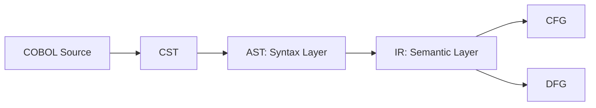

---------------------------------------
AST Node構造
---------------------------------------

対象
2026-02-20_AST_NodeTaxonomy.md

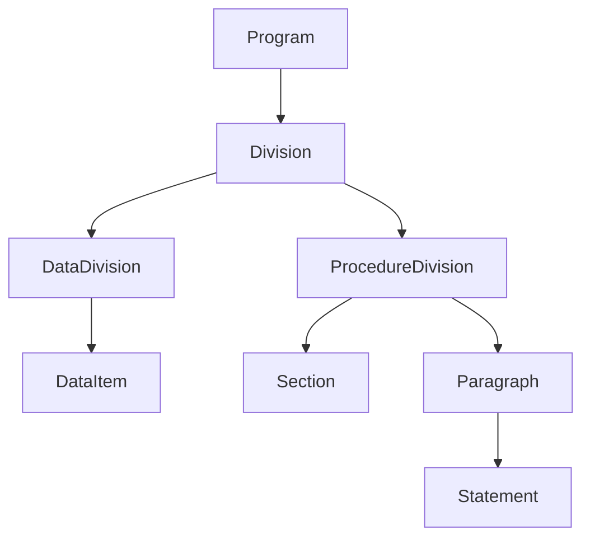

---------------------------------------
AST 粒度ポリシー
---------------------------------------

対象
2026-02-21_AST_GranularityPolicy.md

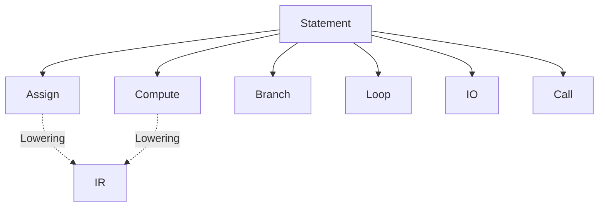

---------------------------------------
Guarantee Unit
---------------------------------------

対象
2026-03-01_01_GuaranteeUnitDefinition.md

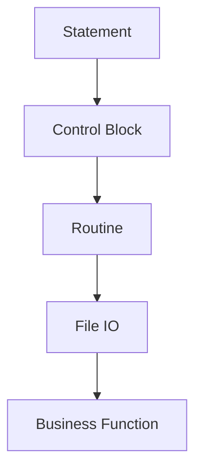

---------------------------------------
Formal Guarantee
---------------------------------------

対象
2026-03-02_01_FormalGuaranteeFormalization.md

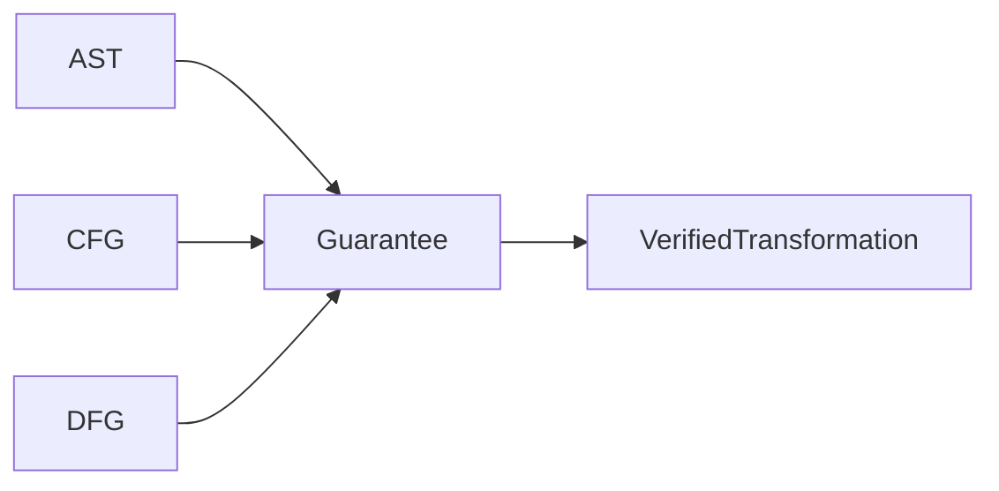

---------------------------------------
Guarantee Space
---------------------------------------

対象
2026-03-03_01_GuaranteeSpaceFormalization.md
2026-03-04_01_DependentGuaranteeSpaceFormalization.md
2026-03-04_02_WeightedGuaranteeSpaceTheory.md

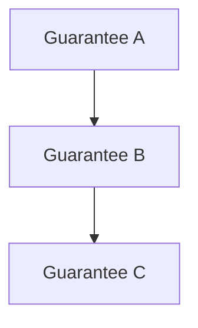

---------------------------------------
Metric / Geometry
---------------------------------------

対象
2026-03-04_03_GuaranteeMetricTheory.md
2026-03-04_04_GuaranteeSpaceGeometryTheory.md
2026-03-04_06_GuaranteeSpaceGeometryRevision.md
2026-03-04_07_GuaranteeSpaceGeometryPart2.md

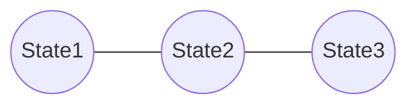

---------------------------------------
Lattice
---------------------------------------

対象
2026-03-04_08_LatticeStructure.md
2026-03-04_08_LatticeStructureRefinement.md

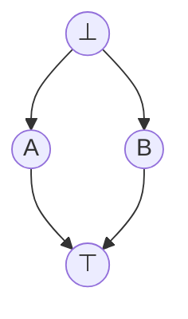

---------------------------------------
Transition Graph
---------------------------------------

対象
2026-03-04_09_GuaranteeTransitionGraph.md
2026-03-04_09_GuaranteeTransitionGraphRefinement.md


---------------------------------------
Migration Path
---------------------------------------

対象
2026-03-04_10_MigrationPathLinearExtension.md
2026-03-04_10_MigrationPathTheory.md
2026-03-04_10_MigrationPathTheoryRefinement.md


---------------------------------------
Migration Complexity
---------------------------------------

対象
2026-03-05_11_MigrationComplexity.md
2026-03-05_11_MigrationComplexityRevision.md

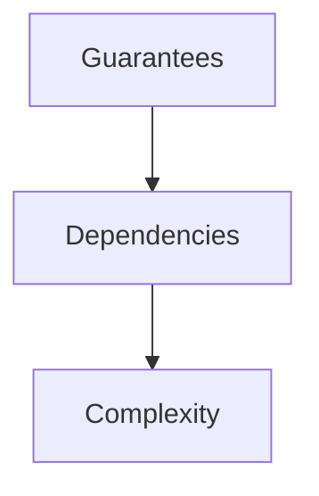

---------------------------------------
Guarantee Dynamics
---------------------------------------

対象
2026-03-05_12_GuaranteeDynamics.md
2026-03-05_12_GuaranteeDynamicsRevision.md

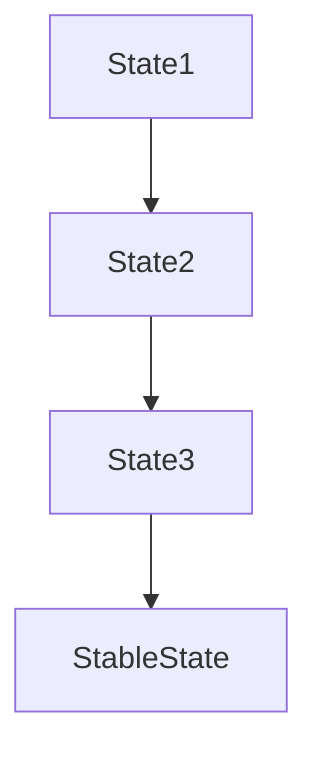

---------------------------------------
Optimization Landscape
---------------------------------------

対象
2026-03-05_13_OptimizationLandscape.md
2026-03-05_13_OptimizationLandscapeRevision.md


---------------------------------------
Migration Geometry
---------------------------------------

対象
2026-03-08_01_MigrationGeometryConstruction.md

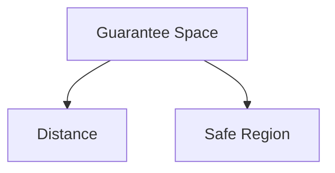

---

# 対象ファイル（27件）

2026-02-19_AST_ScopeDefinition.md
2026-02-19_AST_ScopeFormalization.md
2026-02-20_AST_NodeTaxonomy.md
2026-02-21_AST_GranularityPolicy.md
2026-03-01_01_GuaranteeUnitDefinition.md
2026-03-02_01_FormalGuaranteeFormalization.md
2026-03-03_01_GuaranteeSpaceFormalization.md
2026-03-04_01_DependentGuaranteeSpaceFormalization.md
2026-03-04_02_WeightedGuaranteeSpaceTheory.md
2026-03-04_03_GuaranteeMetricTheory.md
2026-03-04_04_GuaranteeSpaceGeometryTheory.md
2026-03-04_06_GuaranteeSpaceGeometryRevision.md
2026-03-04_07_GuaranteeSpaceGeometryPart2.md
2026-03-04_08_LatticeStructure.md
2026-03-04_08_LatticeStructureRefinement.md
2026-03-04_09_GuaranteeTransitionGraph.md
2026-03-04_09_GuaranteeTransitionGraphRefinement.md
2026-03-04_10_MigrationPathLinearExtension.md
2026-03-04_10_MigrationPathTheory.md
2026-03-04_10_MigrationPathTheoryRefinement.md
2026-03-05_11_MigrationComplexity.md
2026-03-05_11_MigrationComplexityRevision.md
2026-03-05_12_GuaranteeDynamics.md
2026-03-05_12_GuaranteeDynamicsRevision.md
2026-03-05_13_OptimizationLandscape.md
2026-03-05_13_OptimizationLandscapeRevision.md
2026-03-08_01_MigrationGeometryConstruction.md

---

# 出力ルール

作業完了後は

変更したファイル一覧

のみ表示する。
