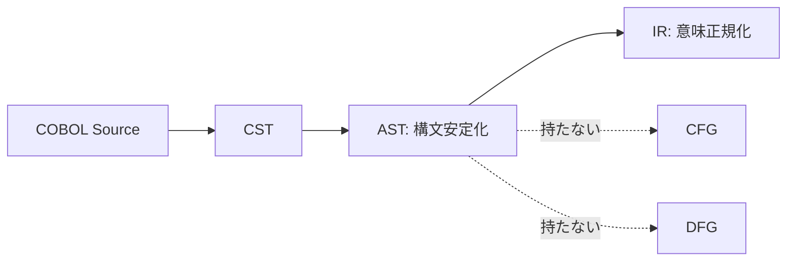
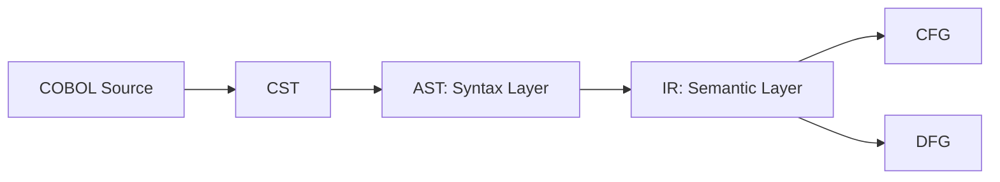

# 2026-02-19_AST_ScopeDefinition

## 🎯 今日の研究焦点（1つだけ）
- ASTの目的と境界を明確化する。「ASTに何を入れ、何を入れないか」を定義する。

## 🏗 モデル仮説
- ASTは構文の安定化層である。意味確定・制御確定・副作用展開は含めない。
- ASTの責務は以下の4点に限定される：
  - 構文ゆれの吸収
  - ノード種の安定化
  - 階層構造の保持
  - ソース位置（Span）の保持

## 🔬 構造設計（触った層：AST）

### ■ ASTが持つもの
- Program構造（Division単位）
- DataDivision階層
- ProcedureDivision階層
- Statement分類（Assign / Compute / Branch / Loop / IO）
- Span（行・列）
- NodeId（安定ID）

### ■ ASTが持たないもの
- 制御フローのブロック分割
- 実行順序の確定
- I/O状態遷移展開（AT END → 分岐化）
- REDEFINESのエイリアス解決
- MOVE CORRESPONDINGの展開
- 代入のSSA化

## ✅ 今日の決定事項
1. ASTは構文的木構造で止める
2. 正規化（Lowering）はIRで行う
3. SpanとNodeIdは必須属性とする
4. 意味変換はIRへ完全委譲する

## ⚠ 保留・未解決
- PERFORM THRU の扱い方針
- 88レベルの位置づけ
- ALTERのサポート可否

## 📊 図式化（必要ならMermaid 1枚）

## 🧠 抽象度の到達レベル
L1: 構文
L2: 意味
L3: 制御
L4: データ
L5: 仕様

→ 今日の到達：**L1（構文）** — ASTの責務をL1に限定し、L2以降との境界を明文化した。

## Concept Image

