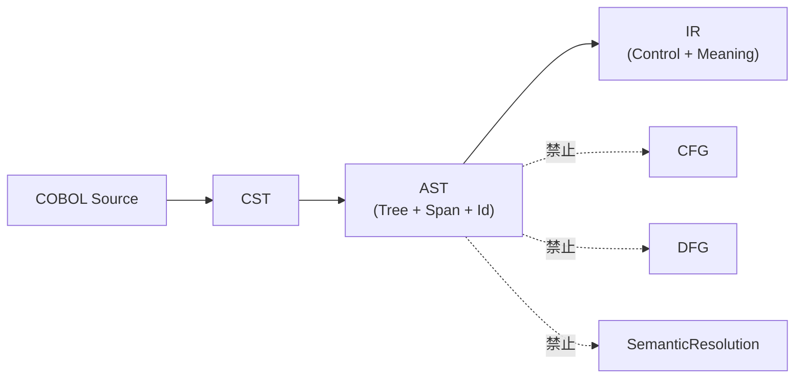
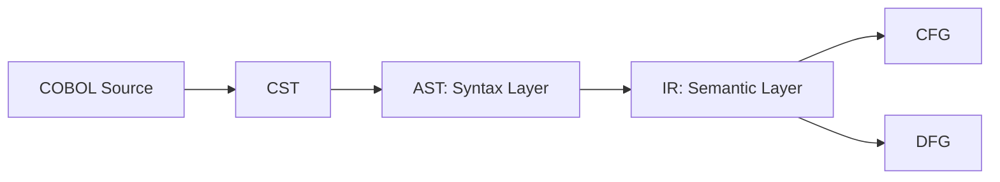

# 2026-02-19_AST_ScopeFormalization

## 🎯 今日の研究焦点（1つだけ）
- ASTの責務境界を概念レベルから形式仕様へ昇格させる。

## 🏗 モデル仮説
- ASTは以下で定義される構造体である：

  `AST = (Nodes, Edges, Root, SpanMap, NodeIdMap)`

- ただしASTは意味評価・制御分割・副作用展開を行わない。

## 🔬 構造設計（触った層：AST）

### ■ 形式的定義
- Nodes: 有限集合
- Edges: 親子関係（有向非循環木）
- Root: Programノード
- SpanMap: Node → SourceSpan
- NodeIdMap: Node → StableId

### ■ 不変条件
1. ASTは木構造である（グラフにしない）
2. 各ノードは1つの親のみを持つ
3. 全ノードがSpanを持つ
4. NodeIdは安定生成される
5. ASTは意味確定を行わない

### ■ 責務境界（禁止事項）
ASTは以下を持たない：
- BasicBlock分割
- 到達可能性判定
- I/O状態遷移展開
- Alias解決
- SSA変換
- 状態変数導入

## ✅ 今日の決定事項
1. ASTは厳密な木構造とする
2. SpanとNodeIdは必須属性
3. 意味正規化はIRへ完全委譲
4. ASTは実行順序を確定しない

## ⚠ 保留・未解決
- Symbol解決の層はASTかIRか
- COPY展開のタイミング
- コメント保持の必要性

## 📊 図式化（必要ならMermaid 1枚）

## 🧠 抽象度の到達レベル
L1: 構文
L2: 意味
L3: 制御
L4: データ
L5: 仕様

→ 今日の到達：**L1（構文）〜 L5境界（仕様）** — ASTの責務を形式仕様として定義し、不変条件・禁止事項を確定した。

## Concept Image

