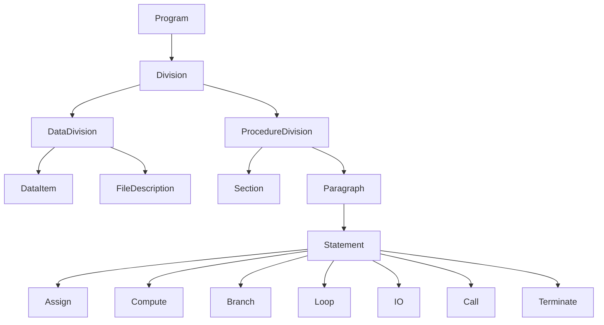
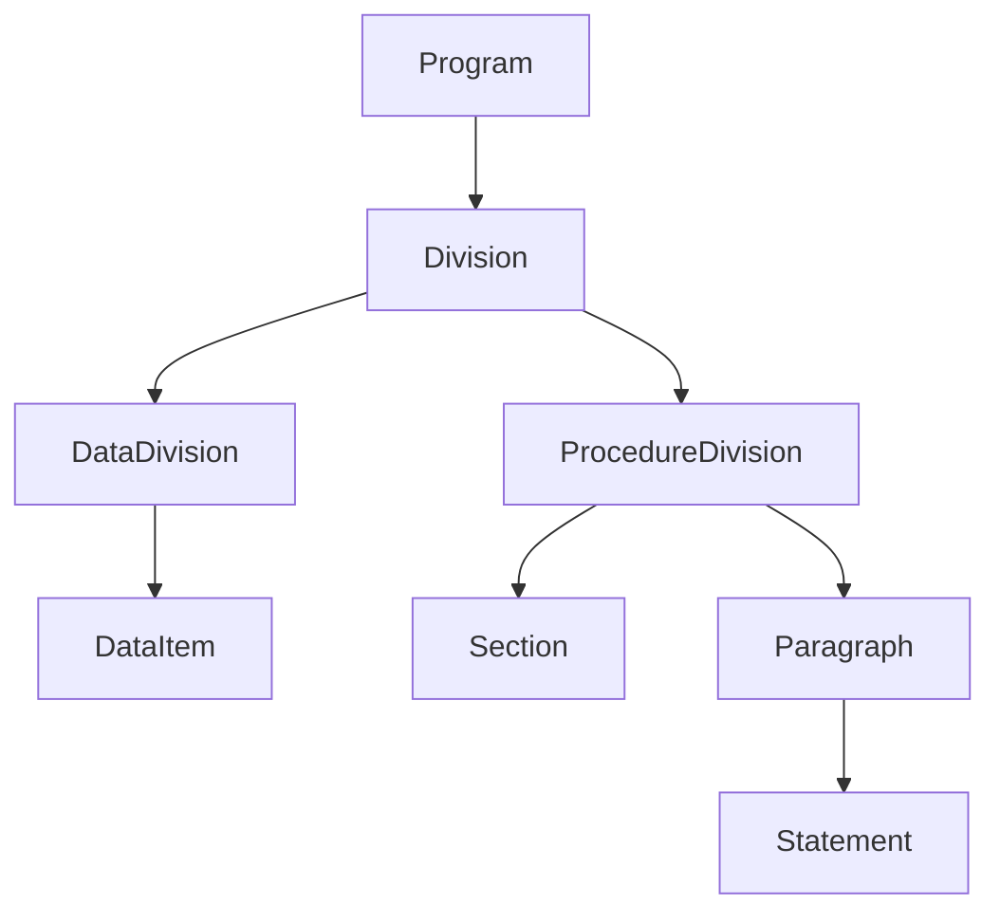

# 2026-02-20_AST_NodeTaxonomy

## 🎯 今日の研究焦点（1つだけ）
- ASTを構成する最小ノード種（Taxonomy）を定義する。過剰分解を避け、拡張可能な最小集合を確定する。

## 🏗 モデル仮説
- ASTは階層構造を持ち、最小集合のノード種で構成される。
- Statementは命令単位ではなく抽象カテゴリで止める。

## 🔬 構造設計（触った層：AST/IR/CFG/DFG）
- 触った層: **AST**

### ■ Level 0（Program）
- ProgramNode

### ■ Level 1（Division）
- IdentificationDivisionNode
- EnvironmentDivisionNode
- DataDivisionNode
- ProcedureDivisionNode

### ■ Level 2（Data構造）
- DataItemNode
- FileDescriptionNode

※ `REDEFINES` / `OCCURS` は構文情報として保持する。

### ■ Level 3（Procedure構造）
- SectionNode
- ParagraphNode

### ■ Level 4（Statement抽象カテゴリ）
- AssignStatementNode
- ComputeStatementNode
- BranchStatementNode（IF / EVALUATE）
- LoopStatementNode（PERFORM）
- IOStatementNode（READ / WRITE / REWRITE / START / DELETE）
- CallStatementNode
- TerminateStatementNode（GOBACK / STOP）

## ✅ 今日の決定事項
1. ASTは4層階層構造とする。
2. Statementは抽象カテゴリに止める。
3. `REDEFINES` / `OCCURS` は構文情報として保持する。
4. ノード種は最小集合に限定する。

## ⚠ 保留・未解決
- EVALUATEを独立ノードにするか。
- INSPECT / UNSTRINGの分類。
- MOVE CORRESPONDINGの扱い。
- DECLARATIVESの扱い。

## 📊 図式化（必要ならMermaid 1枚）

## 🧠 抽象度の到達レベル
L1: 構文
L2: 意味
L3: 制御
L4: データ
L5: 仕様

→ 今日の到達：**L1（構文）〜 L5境界（仕様）**。ASTノード種の最小集合を仕様レベルで確定した。

## Concept Image

