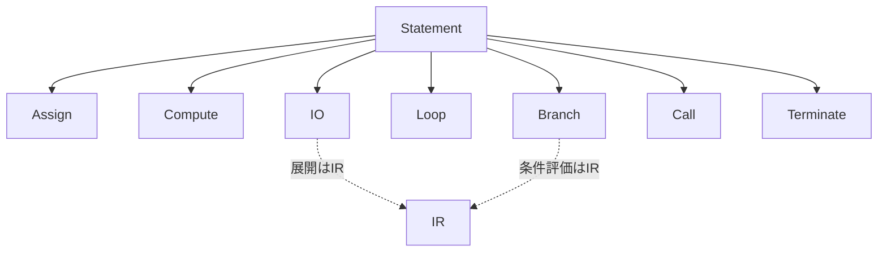
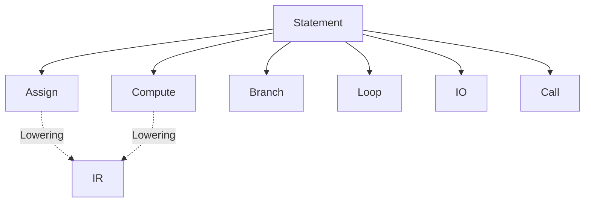

# 2026-02-21_AST_GranularityPolicy

## 🎯 今日の研究焦点（1つだけ）
- ASTにおけるノード粒度（Granularity）の方針を定義する。どの単位を1ノードとするかの設計原則を確定する。

## 🏗 モデル仮説
- ASTの粒度は「構文安定性」と「IRへの受け渡し容易性」を基準に決定する。
- 過剰分解は避ける。
- 意味解釈が必要な分解はIR層に委譲する。

## 🔬 構造設計（触った層：AST/IR/CFG/DFG）
- 触った層: **AST**

### ■ 粒度決定の原則
1. 構文単位を基本とする（文単位）。
2. 構文の糖衣差はASTで吸収する。
3. 意味的展開は行わない。
4. 副作用分解は行わない。
5. 1命令＝1ノードを原則とする（例外は今後定義）。

### ■ Statement粒度方針

| COBOL文 | AST粒度 |
|---------|---------|
| MOVE A TO B | 1 AssignStatementNode |
| ADD A TO B | 1 ComputeStatementNode |
| IF ... END-IF | 1 BranchStatementNode |
| PERFORM ... | 1 LoopStatementNode |
| READ ... AT END | 1 IOStatementNode |
| CALL ... | 1 CallStatementNode |

※ `AT END` / `INVALID KEY` 等の分岐展開はIRで行う。

### ■ 分解しない対象
- MOVE CORRESPONDING を複数代入へ分解しない。
- READの状態分岐を展開しない。
- PERFORM THRU を分解しない。
- COMPUTE式を演算単位へ分解しない。

### ■ IRで分解する対象
- `AT END` -> 条件分岐化
- `INVALID KEY` -> 分岐化
- `MOVE CORRESPONDING` -> 複数Assign化
- `COMPUTE`式 -> 二項演算命令列化

## ✅ 今日の決定事項
1. ASTは「構文単位」で止める。
2. 意味分解はIR層へ完全委譲する。
3. 副作用展開は行わない。
4. 1命令1ノードを基本原則とする。

## ⚠ 保留・未解決
- EVALUATEを1ノードにするか。
- INSPECTの粒度。
- UNSTRING / STRINGの粒度。
- DECLARATIVESの構造粒度。

## 📊 図式化（必要ならMermaid 1枚）

## 🧠 抽象度の到達レベル
L1: 構文
L2: 意味
L3: 制御
L4: データ
L5: 仕様

→ 今日の到達：**L1（構文）〜 L5境界（仕様）**。ASTの粒度原則を仕様として明文化し、IRへの委譲境界を確定した。

## Concept Image

