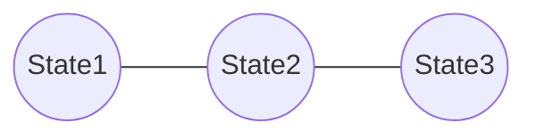

# Research Log: Guarantee Space の幾何学的構造化

**Date:** 2026-03-04  
**Author:** Cursor Agent  
**Topic:** 保証空間の Hypercube 幾何、測度、距離構造による理論体系の抽象化

## 1. 背景と目的

Weighted Guarantee Space と Metric の導入により、定量的な評価は可能になった。しかし、これらの概念（重み、距離、順序）がバラバラに定義されている状態から、統一的な数学的構造（Geometry）として統合する必要があった。
本研究では、Guarantee Space を $N$ 次元 Hypercube 上の幾何空間として再定義し、測度論、距離空間論、グラフ理論の観点から理論を強化した。

## 2. 決定事項：Migration Geometry の数理モデル

### 2.1 測度論的 Strength

保証強度 $Strength(S)$ を、有限加法測度 $\mu(S)$ として再定義した。これにより、保証の加法性や単調性が測度論の文脈で正当化された。

### 2.2 Hypercube Geometry

Guarantee Space $\mathcal{G}$ が $N=|\mathbb{P}|$ 次元の Hypercube $\{0,1\}^N$ と同型であることを明示した。
これにより、移行プロセスは「Hypercube 上の頂点移動」として視覚化可能になった。

### 2.3 Weighted Hamming Metric

保証間の距離 $d_w$ が、Hypercube 上の Weighted Hamming Metric であることを示した。これは情報理論における符号距離の概念と整合する。

### 2.4 最短経路問題（Shortest Path Problem）

移行戦略の立案を、Hypercube の部分グラフ（$\mathcal{G}_{dep}$）上での「始点 $\bot$ から終点 $\top$ への最短経路問題」として定式化した。
コスト関数は経路上のエッジ重み（追加される保証のコスト）の総和である。

## 3. 重要な洞察

1.  **商距離（Quotient Metric）**: 依存関係がある場合、見かけ上の距離ではなく、閉包演算を通した「商距離」が本質的なコストを表す。これは、依存によって「強制的に移動させられる」コストを内包する。
2.  **到達不能領域の幾何**: Unreachable State は Hypercube 上の「穴」や「通行止め」として表現され、幾何学的な障害物（Obstacle）として移行パスを歪める要因となる。
3.  **理論の統合**: 順序（依存）、測度（強度）、距離（コスト）、グラフ（遷移）が、一つの幾何モデル（Migration Geometry）として完全に統合された。

## 4. 成果物

- `docs/50_guarantee/05_Weighted-Guarantee-Space.md`: 改訂版。測度論、Hypercube、最短経路問題の導入。
- `docs/50_guarantee/06_Metric-on-Guarantee-Space.md`: 改訂版。Weighted Hamming Metric、商距離、Migration Geometryの定義。

## Concept Image

