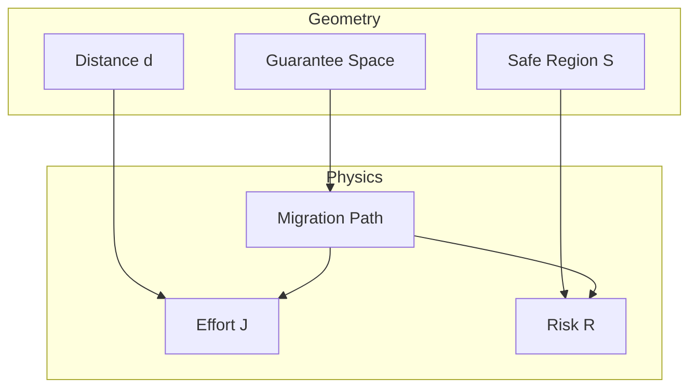

# Research Log: 2026-03-08

## Theme
- Phase5: Migration Geometry Construction

## Objective
- Migration Geometry の数学的モデルを構築し、移行設計を幾何学的最適化問題として定式化する。

## Background
- Phase4 までで Guarantee Space の基本概念（順序、依存、重み）は定義された。
- しかし、これらを統合する「空間モデル」としての定義が不足しており、移行パスの最適化やリスク評価を統一的に扱うフレームワークが必要だった。

## Problem
- 移行設計における「距離」「コスト」「リスク」の概念が混同されやすい。
- 移行状態の「良さ（Utility）」と「安全性（Safety）」の区別が曖昧。
- 直交性を仮定したモデルと、現実の依存関係の乖離をどう扱うか。

## Hypothesis
- 移行設計は「Guarantee Space」上の幾何学的最適化問題として定式化できる。
- 距離（Distance）、コスト（Cost）、リスク（Risk）を厳密に分離することで、直感的な「移行難易度」を定量化できる。
- Guarantee Space を一次近似として直交空間 $[0,1]^n$ でモデル化し、依存関係を Safe Region $\mathcal{S}$ への制約として扱うことで、数学的単純さと実用性を両立できる。

## Approach
- **幾何学的定義**: Guarantee Space を $GS \cong [0,1]^n$ とし、Weighted Euclidean Metric $d_w$ を導入。
- **状態モデル**: 状態 $S$ を点、経路 $P$ を曲線として定義。
- **評価関数**: 目的関数 $J(P)$ を Effort, Risk, Utility の積分として構成。

## Experiment / Analysis
- `Phase5_Migration_Geometry_Roadmap.md` に基づき、定義文書を作成。
- レビュー指摘に基づき、Utility Function $\phi$ を追加導入し、Safety との分離を検証。
- Big Bang (Geodesic) と Strangler (Curved Path) の幾何学的特徴を比較。

## Result
- **Migration Geometry Definition**: $\mathcal{M} = (GS, d, \mathcal{S}, \mathcal{F}, \phi)$ として定義完了。
- **Orthogonality**: 直交性は一次近似であり、実体は結合していることを明記。
- **Optimization**: $J(P) = \int (Effort + Risk - Utility) dt$ として目的関数を定式化。

## Insight
- 移行計画とは、単なるタスクリストではなく、幾何空間内の「最適経路探索」であるという視座が得られた。
- 「安全だが価値の低い状態（塩漬け）」と「安全で価値の高い状態（モダナイズ済）」を Utility で区別することで、移行の動機付けを数理的に説明できる。

## Open Questions
- 非直交空間（Riemannian Geometry）への具体的な拡張方法。
- 実際のCOBOLコードから Guarantee Vector を算出する具体的な静的解析アルゴリズム（Phase 6以降）。
- Weight パラメータ（Data=2.0 等）の客観的決定手法。

## Next Actions
- Phase 6: アルゴリズム実装と検証
- 実際のCOBOLパターンを用いたケーススタディによる理論の精緻化

## Concept Image

## Related Files
- docs/80_geometry/20_Migration_Geometry_Definition.md
- docs/80_geometry/21_Migration_State_Model.md
- docs/80_geometry/22_Migration_Distance_Metric.md
- docs/80_geometry/23_Migration_Path_Model.md
- docs/80_geometry/24_Migration_Strategy_Space.md
- docs/80_geometry/25_Migration_Optimization_Model.md

## Related Prompts
- docs/prompts/phase5/Phase5_Migration_Geometry_Roadmap.md
- docs/prompts/phase5/Phase5_Review_Fix_Execution_Prompt.md

## Notes
- レビュー指摘により理論強度が大幅に向上した。特にUtilityの導入は決定打。
