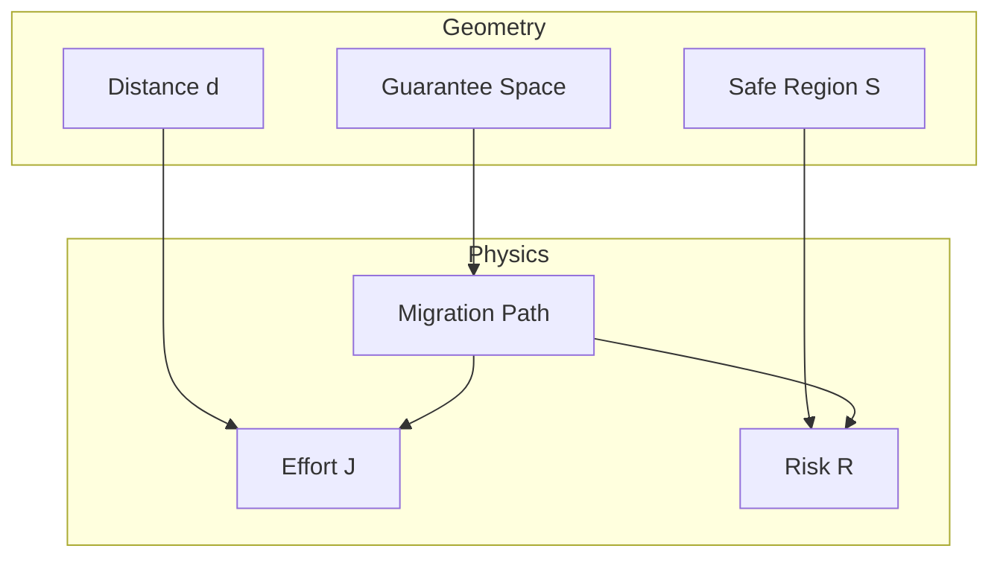

# 2026-03-08_MigrationGeometryConstruction

## 🎯 今日の研究焦点（1つだけ）
- Phase5: Migration Geometry の数学的モデル構築

## 🏗 モデル仮説
- 移行設計は「Guarantee Space」上の幾何学的最適化問題として定式化できる。
- 距離（Distance）、コスト（Cost）、リスク（Risk）を厳密に分離することで、直感的な「移行難易度」を定量化できる。

## 🔬 構造設計（触った層：AST/IR/CFG/DFG）
- Guarantee Space (Phase 4.5 -> Phase 5)

## ✅ 今日の決定事項
- **Migration Geometry Definition**: $\mathcal{M} = (GS, d, \mathcal{S}, \mathcal{F}, \phi)$ として定義。Utility $\phi$ を追加。
- **Orthogonality**: Guarantee Space の直交性は一次近似であり、実体は結合していることを明記。
- **Metric**: Weighted Euclidean Metric を採用。
- **Path Model**: Big Bang (Geodesic) と Safe Path (Curved) の幾何学的対比を確立。
- **Optimization**: $J(P) = \int (Effort + Risk - Utility) dt$ として目的関数を定式化。

## ⚠ 保留・未解決
- 非直交空間（Riemannian Geometry）への具体的な拡張方法。
- 実際のCOBOLコードから Guarantee Vector を算出する具体的な静的解析アルゴリズム（Phase 6以降）。

## 📊 図式化（必要ならMermaid 1枚）

## 🧠 抽象度の到達レベル
L1: 構文
L2: 意味
L3: 制御
L4: データ
L5: 仕様

→ 今日の到達：L5 (仕様・理論モデル)

## ⏭ 次の研究ステップ
- Phase 6: アルゴリズム実装と検証
- 実際のCOBOLパターンを用いたケーススタディによる理論の精緻化
