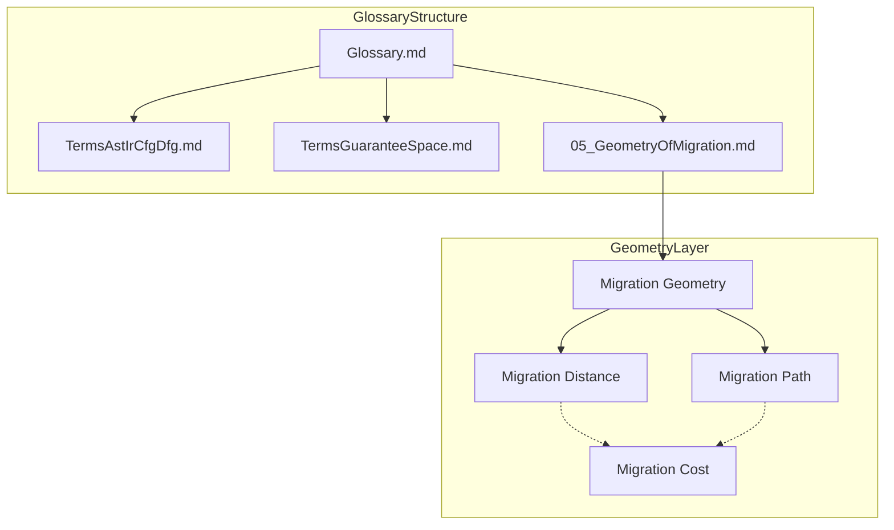

# Research Log: 2026-03-10

## Theme
- 用語集の体系化とMigration Geometryの定義

## Objective
- プロジェクトの用語定義を体系化し、特にPhase 5で構築されたMigration Geometryの概念を形式化・カタログ化することを目的とする。

## Background
- 新しい概念（Guarantee Space, Migration Pathなど）が増えるにつれ、定義の不整合や参照の困難さが発生している。
- 幾何学的アプローチによる移行には正確な定義が不可欠である。

## Problem
- 用語定義が各文書に散在している。
- 形式的記述（数式）と自然言語の定義が十分にリンクされていない。
- 用語集の標準フォーマットが欠如している。

## Hypothesis
- 層（Syntax, Structure, Guarantee, Geometry, Decision）ごとに分類された中央集権的な用語集ディレクトリ（`docs/90_glossary/`）を作成することで、明確さが向上する。
- Markdownテーブル形式を使用することで、定義の欠落やプレースホルダーの特定が容易になる。

## Approach
- `docs/90_glossary/` ディレクトリ構造を確立する。
- 用語の標準Markdownテーブルフォーマット（Term, Layer, Definition, Formal Description, Related Concepts）を定義する。
- 最初の用語集ファイル `05_GeometryOfMigration.md` を作成し、幾何学の中核概念を定義する。

## Experiment / Analysis
- ファイル構造とフォーマットを定義した `docs/90_glossary/README.md` を作成した。
- 以下の用語を定義した `docs/90_glossary/05_GeometryOfMigration.md` を作成した:
  - Migration Geometry
  - Migration Distance
  - Migration Path
  - Shortest Migration Path (プレースホルダーとして)
  - Migration Cost
- 過去の `working-log` ファイル名を命名規則 `{YYYY-MM-DD}_{Seq}_{Title}.md` に準拠するよう変更した。

## Result
- テーブル形式により、用語間の関係（Distance -> Cost -> Optimization）が可視化された。
- 「Shortest Migration Path」は、完全な最適化モデルの形式化を待つプレースホルダーとして明示的に特定された。
- Geometry層とDecision層（例：Migration Cost）の区別が明確になった。

## Insight
- テーブル形式は定義の網羅性をチェックするのに有効である。
- このフォーマットで用語を定義する行為自体が、概念モデルのさらなる精緻化を促す（例：「最短経路」の定義が「最適化モデル」に依存することへの気づき）。

## Open Questions
- 用語集において「Syntax層」の用語と「Guarantee層」の用語の接続をどのように形式的に定義するか？
- 定義の成熟度を追跡するために、テーブルに「Status」列を追加すべきか？

## Next Actions
- Syntax/Structure層のための `TermsAstIrCfgDfg.md` を作成する。
- Guarantee層のための `TermsGuaranteeSpace.md` を作成する。
- `Glossary.md` インデックスを作成する。

## Concept Image

## Related Files
- `docs/90_glossary/README.md`
- `docs/90_glossary/05_GeometryOfMigration.md`
- `log/working-log/2026-03-10_01_GlossaryCreation.md`

## Related Diagrams
- None

## Related Prompts
- None

## Notes
- 一貫性を保つため、過去の作業ログをリネームした。
- 本日の作業ログファイル名の日付を修正した。
