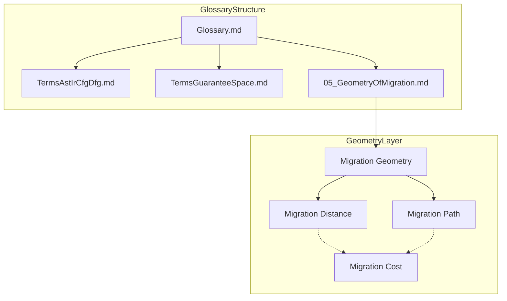

# Research Log: 2026-03-10

## Theme
- Glossary Systematization and Migration Geometry Definitions

## Objective
- To systematize the terminology definitions for the project, particularly focusing on formalizing and cataloging the Migration Geometry concepts constructed in Phase 5.

## Background
- As new concepts (Guarantee Space, Migration Path, etc.) increase, definition inconsistencies and reference difficulties have arisen.
- Precise definitions are crucial for the geometric approach to migration.

## Problem
- Terminology definitions are scattered across various documents.
- Formal descriptions (formulas) and natural language definitions are not well-linked.
- A standardized format for glossaries is missing.

## Hypothesis
- Creating a centralized glossary directory (`docs/90_glossary/`) categorized by layers (Syntax, Structure, Guarantee, Geometry, Decision) will improve clarity.
- Using a Markdown Table format will facilitate the identification of missing definitions and placeholders.

## Approach
- Establish the `docs/90_glossary/` directory structure.
- Define a standard Markdown Table format for terms (Term, Layer, Definition, Formal Description, Related Concepts).
- Create the first glossary file `05_GeometryOfMigration.md` to define core geometric concepts.

## Experiment / Analysis
- Created `docs/90_glossary/README.md` to define the file structure and format.
- Created `docs/90_glossary/05_GeometryOfMigration.md` defining:
  - Migration Geometry
  - Migration Distance
  - Migration Path
  - Shortest Migration Path (as a placeholder)
  - Migration Cost
- Renamed past `working-log` files to comply with the naming convention `{YYYY-MM-DD}_{Seq}_{Title}.md`.

## Result
- The relationship between terms (Distance -> Cost -> Optimization) became visible through the table format.
- "Shortest Migration Path" was explicitly identified as a placeholder awaiting the full Optimization Model formalization.
- The distinction between Geometry layer and Decision layer (e.g., Migration Cost) was clarified.

## Insight
- The table format is effective for checking definition completeness.
- The act of defining terms in this format prompts further refinement of the conceptual model (e.g., realizing that "Shortest Path" definition depends on "Optimization Model").

## Open Questions
- How to formally define the connection between "Syntax Layer" terms and "Guarantee Layer" terms in the glossary?
- Should the "Status" column be added to the table to track definition maturity?

## Next Actions
- Create `TermsAstIrCfgDfg.md` for Syntax/Structure layers.
- Create `TermsGuaranteeSpace.md` for Guarantee layer.
- Populate the `Glossary.md` index.

## Concept Image

## Related Files
- `docs/90_glossary/README.md`
- `docs/90_glossary/05_GeometryOfMigration.md`
- `log/working-log/2026-03-10_01_GlossaryCreation.md`

## Related Diagrams
- None

## Related Prompts
- None

## Notes
- Renamed past working logs to maintain consistency.
- Corrected the date in today's working log filename.
