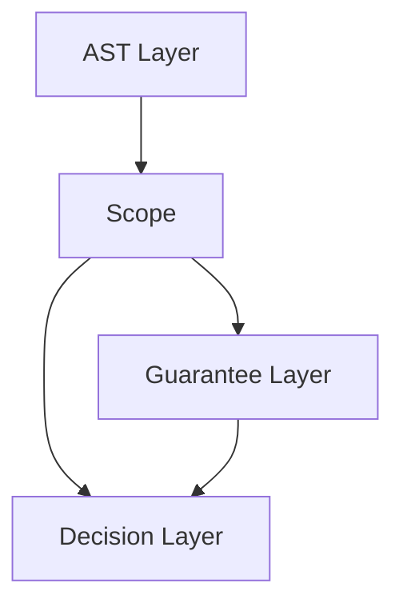

# 2026-03-27_01_ScopeCoreDefinition

## 🎯 今日の研究焦点（1つだけ）
- Phase 6 の起点として、`Scope` を構造解析・保証適用・移行判断を接続する第一級の形式概念として定義する。

## 🏗 モデル仮説
- `Scope` は単なる構文範囲ではなく、**有界な意味的対象領域**として定義されるべきである。
- AST が構文単位を与え、Guarantee が保存対象を与え、Decision が可否判断を与えるなら、`Scope` はそれらを**同一の対象に適用するための接続層**として必要になる。
- `Scope` を先に固定しなければ、保証評価の対象、検証の対象、移行判断の対象がずれ、理論の整合性が保てない。

## 🔬 構造設計（触った層：AST/IR/CFG/DFG）
- AST 層との関係では、`Scope` は構文的可視範囲と意味的十分範囲を区別する概念として位置づけた。
- Guarantee 層との関係では、`Scope` を保証の適用範囲を規定する対象領域として整理した。
- Decision 層との関係では、`Scope` を migration feasibility、risk、verification adequacy の判断対象を固定する概念として整理した。
- この時点では IR / CFG / DFG への詳細写像は行わず、後続文書で展開する前提だけを確立した。

## ✅ 今日の決定事項
- `Scope` を、三つ組 \( \sigma = \langle T_\sigma, B_\sigma, P_\sigma \rangle \) として扱う方針を採用した。
- `T_\sigma` は対象集合、`B_\sigma` は境界条件、`P_\sigma` は AST / Guarantee / Decision への許容射影族とした。
- `Scope` は `Boundary` と同一ではなく、`Boundary` は `Scope` を区切る条件であると定めた。
- `Scope` は `Unit` と同一ではなく、AST node、Guarantee Unit、Migration Unit とは役割が異なると定めた。
- `Scope` は `Region` や `Context` よりも強い概念であり、判断妥当性を支える対象概念として扱うと定めた。
- `Scope` の初期形式的性質として、boundedness、containment、traceability、applicability、composability、closure relevance を採用した。

## ⚠ 保留・未解決
- `Scope` の分類体系をどの粒度で切るか。`Syntactic / Structural / Control / Data / Dependency / Guarantee / Decision / Verification / Impact / Migration` を独立分類とみなすか、階層分類とみなすかは未確定である。
- `Boundary` の明示境界と暗黙境界をどの形式体系で扱うかは次文書に委ねる。
- `Scope` と `Guarantee Unit` / `Migration Unit` の差異は宣言できたが、比較可能な形式定義としてはまだ未完成である。
- `Scope` の closure を dependency closure と structural completeness のどちらから先に定義するかは要検討である。

## 📊 図式化（必要ならMermaid 1枚）

## 🧠 抽象度の到達レベル
L1: 構文
L2: 意味
L3: 制御
L4: データ
L5: 仕様

→ 今日の到達：
- L2: `Scope` を意味対象として定義した。
- L5: 移行判断へ接続される対象概念としての仕様上の位置づけを固定した。

## ⏭ 次の研究ステップ
- `02_Scope-Taxonomy.md` で Scope の分類体系を整理する。
- `03_Scope-Boundary-Model.md` で境界条件の形式化を進める。
- `05_Scope-vs-Guarantee-Unit.md` と `06_Scope-vs-Migration-Unit.md` で unit 差分を明示化する。
- `09_Scope-Closure-and-Completeness.md` に向けて、closure relevance の先行整理を行う。
