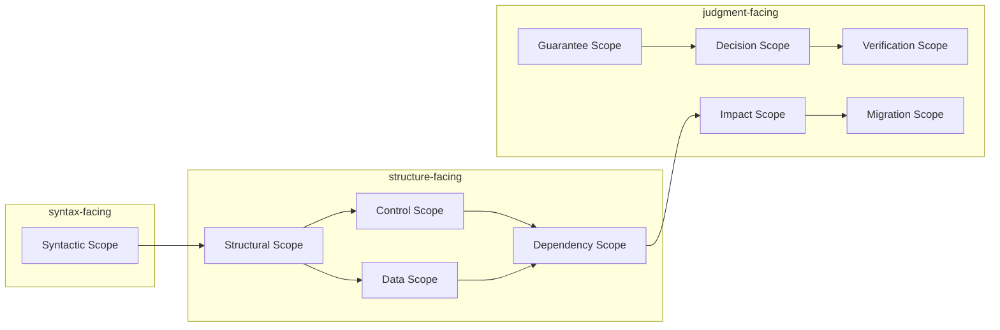

# 2026-03-27_02_ScopeTaxonomy

## 🎯 今日の研究焦点（1つだけ）
- Phase 6 の第2文書として、`Scope` の**分類体系（taxonomy）**を確定し、単一の未分化概念として扱わない理論的基盤を与える。

## 🏗 モデル仮説
- `Scope` は分析目的と抽象層が異なれば、**別の類型**として区別されるべきである。
- 分類原理は、(1) 分析目的、(2) 抽象層（構文・構造・判断）、(3) 射影と境界、の三つで整理できる。
- **syntax-facing / structure-facing / judgment-facing** の面向性により、AST・CFG/DFG・保証・移行判断への接続を言語化できる。

## 🔬 構造設計（触った層：AST/IR/CFG/DFG）
- **Syntactic / Structural**：構文可視性と責務・モジュールまとまりを分離した。
- **Control / Data / Dependency**：CFG・DFG・依存閉包に対応する構造層の Scope を定義した。
- **Guarantee / Decision / Verification / Impact / Migration**：保証適用・判断・検証・影響・移行計画に対応する判断層の Scope を定義した。
- IR は本稿では直接定義せず、後続の写像文書に委ねる前提とした。

## ✅ 今日の決定事項
- 主要な `Scope` 類型として、少なくとも次の十種を採用した。  
  Syntactic, Structural, Control, Data, Dependency, Guarantee, Decision, Verification, Impact, Migration。
- 面向性を次のように整理した。  
  - syntax-facing：Syntactic Scope  
  - structure-facing：Structural, Control, Data, Dependency  
  - judgment-facing：Guarantee, Decision, Verification, Impact, Migration  
- 各類型について、**定義・主目的・抽象層・他 Scope との代表的関係**を記述する枠組みを固定した。
- 異なる類型は重なり・乖離・部分衝突しうることを、理論上の欠陥ではなく**現実制約の表現**として位置づけた。

## ⚠ 保留・未解決
- 十種類が**相互に直交する軸**なのか、**階層や包含**を持つ族なのかの完全な形式化は未着手である。
- 類型ごとの境界条件 \(B\) と射影 \(P\) のテンプレートは、`03_Scope-Boundary-Model.md` で精緻化する必要がある。
- Mermaid 図は概念的な層関係の概略であり、厳密な束・グラフ表現への写像は今後の課題である。

## 📊 図式化（必要ならMermaid 1枚）

## 🧠 抽象度の到達レベル
L1: 構文  
L2: 意味  
L3: 制御  
L4: データ  
L5: 仕様  

→ 今日の到達：
- L2〜L4：`Scope` を構文・制御・データ・依存の各構造目的に対応する類型へ展開した。
- L5：移行・検証・影響といった判断目的に対応する類型を、仕様レベルで区別した。

## ⏭ 次の研究ステップ
- `03_Scope-Boundary-Model.md` で、各類型に対する明示境界・暗黙境界を形式化する。
- `04_Scope-Composition-and-Containment.md` で、類型間の包含・合成・交差を扱う。
- `07_Impact-Scope-and-Propagation.md` および `08_Verification-Scope.md` で、Impact / Verification と Dependency / Guarantee の整合を詰める。
