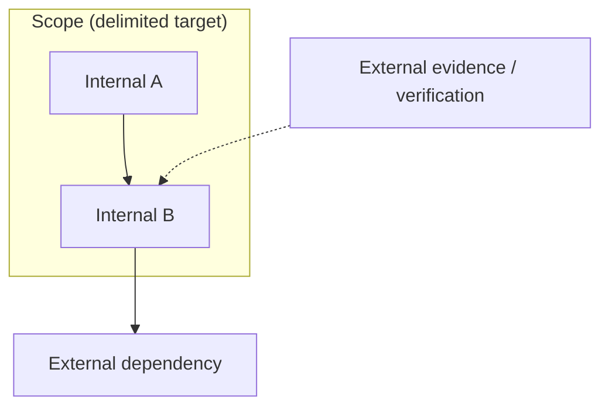

# 2026-03-27_03_ScopeBoundaryModel

## 🎯 今日の研究焦点（1つだけ）
- Phase 6 の第3文書として、`Scope` と **`Boundary` を別概念として形式化**し、有界性を与える条件体系として境界モデルを確定する。

## 🏗 モデル仮説
- `Scope` の対象集合 \(T\) と、それを区切る境界条件の集合 \(B\) は同一ではない。`Boundary` は **delimitation**（区切り）であり、`Scope` 自体の **containment**（包含）とは区別される。
- 境界は単なる線ではなく、**所属・接続・露出・判断責任**を規定する分析的条件である。
- 境界の曖昧さは移行失敗の結果ではなく、**前駆状態**として扱うべきである。

## 🔬 構造設計（触った層：AST/IR/CFG/DFG）
- **Explicit / Implicit**：記述境界と慣習・暗黙依存による境界を分離した。
- **Internal / External**：`Scope` 内部の分節と、外部 I/O・共有状態との接面を分離した。
- **Structural / Judgment**：CFG/DFG/依存に基づく境界と、保証・検証・意思決定の責任境界を分離した。
- 制御・データ・依存・保証適用の **Boundary Crossing** を、横断そのものと前提衝突（Violation）に分けて記述した。

## ✅ 今日の決定事項
- `Boundary` を、境界条件 \(b_i: U \to \{0,1\}\) の族として形式的に定義する方針を採用した（対象集合は境界条件の合取で与えられる最小形）。
- **Explicit / Implicit / Internal / External / Structural / Judgment** の六類型を採用した。
- `Boundary Crossing` を、制御・データ・依存・保証適用の四観点で定義した。
- `Boundary Violation` を、単なる横断ではなく **前提との整合破綻** として定義した。
- **Boundary ambiguity as a precursor of migration failure** に相当する議論を、移行失敗の連鎖として明示した。
- 後続の `07_Impact-Scope-and-Propagation.md`、`08_Verification-Scope.md`、`09_Scope-Closure-and-Completeness.md` への接続点を宣言した。

## ⚠ 保留・未解決
- 境界条件 \(b_i\) を、述語論理・制約系・グラフ切断としてどの形式言語で統一するかは未確定である。
- 複数の `Boundary` が同時に作用する場合の **優先順位・合成則** は、`04_Scope-Composition-and-Containment.md` で扱う必要がある。
- `60_decision` の Decision Boundary と、本稿の Judgment Boundary の **完全な対応写像** は今後の精緻化課題である。

## 📊 図式化（必要ならMermaid 1枚）

## 🧠 抽象度の到達レベル
L1: 構文  
L2: 意味  
L3: 制御  
L4: データ  
L5: 仕様  

→ 今日の到達：
- L3〜L4：構造境界（制御・データ・依存）と外部接面を区別した。
- L5：判断境界（検証・保証帰属・意思決定責任）を `Scope` 理論に接続した。

## ⏭ 次の研究ステップ
- `04_Scope-Composition-and-Containment.md` で、複数 `Scope` の包含・合成・交差と境界の整合条件を定義する。
- `07_Impact-Scope-and-Propagation.md` で、Dependency / Structural 境界と Impact の到達を接続する。
- `08_Verification-Scope.md` で、Verification boundary と Guarantee / Dependency の整合を詰める。
