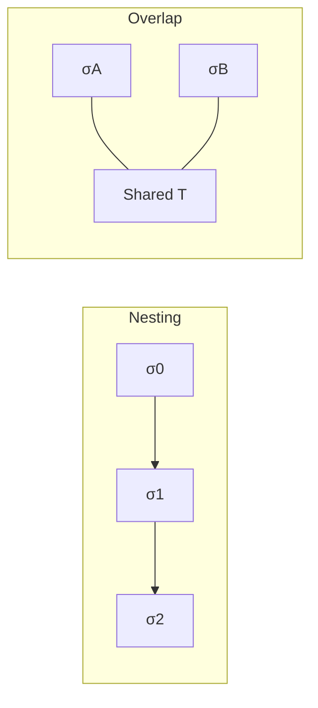

# 2026-03-27_04_ScopeCompositionAndContainment

## 🎯 今日の研究焦点（1つだけ）
- Phase 6 の第4文書として、複数 `Scope` の **包含・階層化・重なり・交差・合成・分割** を、三つ組 \( \langle T, B, P \rangle \) の整合として形式化し、孤立した `Scope` 定義を **関係構造** に接続する。

## 🏗 モデル仮説
- **Containment** は \(T\) の包含だけでなく、**境界の整合**と **射影の制限可能性** を伴う関係 \( \preceq_{\mathrm{ct}} \) として定義される。
- **Overlap** は「集合として交わる」だけでなく、包含に落ちない**部分重複**として区別し、**保証帰属・検証責任の衝突**を分析上の問題として扱う。
- **Intersection / Union / Composition** は、集合の交差・和と同型だが、well-formed な `Scope` であるには **Merge(\(B\))** と **Align(\(P\))** が必要である。
- **careless composition** は、**無効な migration grouping** を生む。一貫性の失敗はしばしば「大きさ」ではなく **境界の合成可能性** の問題である。

## 🔬 構造設計（触った層：AST/IR/CFG/DFG）
- **Control**：包含と到達可能性の包含の乖離、局所 `Scope` と外部 exit の緊張。
- **Data**：分割と定義使用関係、暗黙共有・別名による再 overlap。
- **Dependency**：合成・分割とグラフ切断の同型、カットエッジが外部契約を隠すリスク。

## ✅ 今日の決定事項
- Containment / Nesting / Overlap / Intersection / Union・Composition / Partition を、上記の意味で **研究モデル上の関係・操作** として定義した。
- **§7.3** として、「結合された `Scope` が分析的一貫性を失う」場合の代表類型（依存閉包欠落、検証射程の断裂、保証帰属衝突、判断単位の混線、暗黙境界の再出現）を明示した。
- **migration packaging / cutover design / verification planning** と composition・containment の接続を、移行判断の節で宣言した。
- 後続の `07_Impact-Scope-and-Propagation.md`、`08_Verification-Scope.md`、`09_Scope-Closure-and-Completeness.md` への接続点を宣言した。

## ⚠ 保留・未解決
- `Merge`（境界）と `Align`（射影）を、述語論理・制約系・グラフ操作として **どの形式言語で固定するか** は未確定である。
- 重複を許容する **partition** の調停条件を、一般形で閉じるまでには至っていない。

## 📊 図式化（必要ならMermaid 1枚）

## 🧠 抽象度の到達レベル
L1: 構文  
L2: 意味  
L3: 制御  
L4: データ  
L5: 仕様  

→ 今日の到達：
- L3〜L4：構造関係を制御・データ・依存に接続した。
- L5：合成が **packaging / cutover / verification** の設計単位とどう対応するかを記述した。

## ⏭ 次の研究ステップ
- `06_Scope-vs-Migration-Unit.md` で、`Scope` と運用・移行単位の対応を整理する。
- `07_Impact-Scope-and-Propagation.md` で、伝播が分割と合成をどう跨ぐかを詰める。
- `08_Verification-Scope.md` で、合成後の検証射程の連続性を形式化する。
