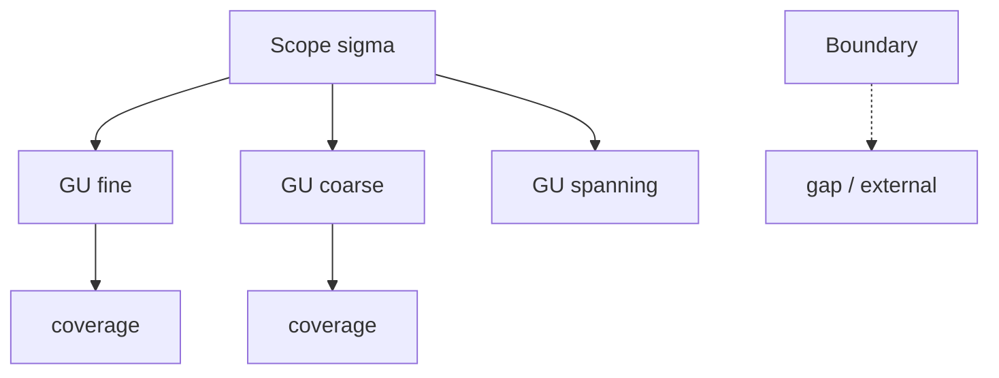

# 2026-03-27_05_ScopeVsGuaranteeUnit

## 🎯 今日の研究焦点（1つだけ）
- Phase 6 の第5文書として、**Scope**（適用範囲・target range）と **Guarantee Unit**（評価単位・evaluative unit）を **同一視しない** ための差分定義を確定し、`50_guarantee` と `60_scope` の接続を **構造中心** に固定する。

## 🏗 モデル仮説
- **Scope** は三つ組 \( \langle T, B, P \rangle \) として **何を対象とするか** を記述する。**保証の真偽や強度を与える評価器ではない**。
- **Guarantee Unit** は、保存主張を **どの粒度で帰属・検証するか** を束ねる単位であり、Guarantee Space 上の **評価の座** である。
- **Guarantee coverage** は均一とは限らず、**部分的・不均一** な被覆は構造的事実として記述される。
- **Guarantee applicability は Scope identity を定義しない**（適用可能だからといって対象領域の同一性が決まらない）。

## 🔬 構造設計（触った層：AST/IR/CFG/DFG）
- **単一 Scope / 複数 GU**：同一 \( T_\sigma \) に文・モジュール・業務シナリオなど **複数の評価単位** が重なる。
- **単一 GU / 複数構造**：一つの \( GU \) がモジュール・コピーブック・データ定義に **横断** しうる。
- **境界と被覆**：\( B_\sigma \) が外部依存を隠すと、保証が **Scope 内完結** に見え、被覆が過大評価される。

## ✅ 今日の決定事項
- **target range** と **evaluative unit** の二語で中核差異を固定した。
- **§6.1** として「Guarantee applicability は Scope identity を定義しない」を明示した。
- 混同時の破綻（帰属誤り、被覆過大、合成誤り、Decision 錯誤）を列挙し、**Scope は保証されるものそのものではない** と宣言した。
- **guarantee attribution** と **migration decision** の分離接続を、移行判断の節で宣言した。
- 後続の `06_Scope-vs-Migration-Unit.md` への接続点を宣言した。

## ⚠ 保留・未解決
- **coverage** を、グラフ上の部分集合・観点の部分集合・手続カバレッジのどれで **測るか** の形式言語は未固定である。
- Guarantee の **合成** と Scope の **合成**（`04`）の **対応写像** は、今後の精緻化課題である。

## 📊 図式化（必要ならMermaid 1枚）

## 🧠 抽象度の到達レベル
L1: 構文  
L2: 意味  
L3: 制御  
L4: データ  
L5: 仕様  

→ 今日の到達：
- L1〜L5：`50_guarantee` の L1〜L5 と **Scope** の **対象記述** を接続し、**評価階層**と**対象境界**を分離して語った。
- L5：migration feasibility と guarantee-based reasoning を **二重依存**（Scope と GU）として記述した。

## ⏭ 次の研究ステップ
- `06_Scope-vs-Migration-Unit.md` で、`Scope` と運用・移行単位の対応を詰める。
- `07_Impact-Scope-and-Propagation.md` で、被覆と影響伝播の関係を書く。
- `08_Verification-Scope.md` で、検証射程と Guarantee coverage の整合を形式化する。
