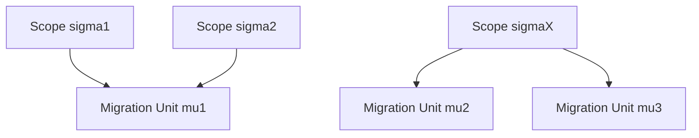

# 2026-03-27_06_ScopeVsMigrationUnit

## 🎯 今日の研究焦点（1つだけ）
- Phase 6 の第6文書として、**Scope**（分析対象の意味的境界）と **Migration Unit**（移行実行・切替の運用単位）を区別し、analysis と execution の不一致を **mismatch** として構造化する。

## 🏗 モデル仮説
- **Scope** は三つ組 \( \langle T, B, P \rangle \) により、何を対象として読むかを定める **analytical scope** である。
- **Migration Unit** は \( \langle E, C, O \rangle \) により、一括実行される成果物・制約・運用責務を定める **migration execution unit** である。
- **Scope mismatch** は、分析境界と運用境界が異なる原理で決まることの表現であり、偶発的なズレではなく **planning logic の一次構造** として扱うべきである。
- **Analytical coherence does not guarantee migration executability**。構造整合と運用実行可能性は別条件で成立する。

## 🔬 構造設計（触った層：AST/IR/CFG/DFG）
- **analysis unit / execution unit**：対象理解の単位と、実行・切替・回復の単位を明示的に分離した。
- **小さい Scope / 大きい MU**：共有データ、外部契約、切替整合性により、局所 Scope が単独では動かせない場合を整理した。
- **大きい Scope / 複数 MU**：停止時間制約、段階導入、平行稼働により、一体の分析対象が複数ステップに裂ける場合を整理した。

## ✅ 今日の決定事項
- `Migration Unit` を、最小形 \( \mu = \langle E_\mu, C_\mu, O_\mu \rangle \) で定義した。
- **analytical scope** と **migration execution unit** の対比表で中核差異を固定した。
- **packaging constraints** と **cutover feasibility** を、単なる管理論ではなく構造的制約として位置づけた。
- **§7.1** として「Analytical coherence does not guarantee migration executability」を明示した。
- **analytical scoping** と **execution packaging** の二段階を、migration planning logic の基底手続として宣言した。

## ⚠ 保留・未解決
- \( C_\mu \) と \( O_\mu \) を、どこまで形式制約系として厳密化するかは未確定である。
- `04` の Scope 合成と、複数 Scope を 1 つの Migration Unit に束ねる操作の **対応写像** は今後の精緻化課題である。
- cutover feasibility を、Decision 側のコスト・リスクモデルとどう接続して定式化するかは、追加整理の余地がある。

## 📊 図式化（必要ならMermaid 1枚）

## 🧠 抽象度の到達レベル
L1: 構文  
L2: 意味  
L3: 制御  
L4: データ  
L5: 仕様  

→ 今日の到達：
- L3〜L4：依存・共有状態・切替整合性を、Scope と Migration Unit のズレとして整理した。
- L5：feasibility judgment と planning logic が、分析境界と実行境界の二層を持つことを記述した。

## ⏭ 次の研究ステップ
- `07_Impact-Scope-and-Propagation.md` で、impact が Scope 境界と実行単位境界をどう跨ぐかを詰める。
- `08_Verification-Scope.md` で、verification range が Migration Unit とどうずれるかを整理する。
- `09_Scope-Closure-and-Completeness.md` で、mismatch が closure / completeness に与える影響を確認する。
