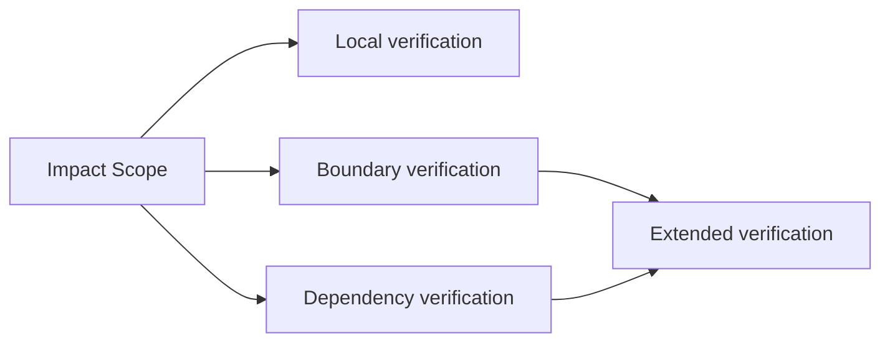

# 2026-03-28_02_VerificationScope

## 🎯 今日の研究焦点（1つだけ）
- Phase 6 の第8文書として、どの範囲に対して検証証拠が必要または十分とされるのかを **Verification Scope** として形式化し、`Impact Scope`・guarantee support・decision evidence を接続する。

## 🏗 モデル仮説
- verification は test case 数ではなく、**どの対象領域に対して証拠が意味を持つか** によって成立する。
- **Verification Scope** は \( \sigma_{ver} = \langle T_{ver}, B_{ver}, P_{ver} \rangle \) として記述される。
- verification confidence は絶対的な性質ではなく、**scope に束縛された confidence** である。
- **Impact Scope** と **Verification Scope** は一致することもあるが、verification が境界・依存確認を要求するため、後者が前者を超えることがある。
- **Under-Verification** は、証拠不足というより **境界設定不足** として理解すべきである。

## 🔬 構造設計（触った層：AST/IR/CFG/DFG）
- **Local Verification Scope**：局所変換・直近 def-use・同一構文単位の確認。
- **Boundary Verification Scope**：露出境界・契約面・責務切替の確認。
- **Dependency Verification Scope**：呼出先、共有状態、外部依存を含む確認。
- **Extended Verification Scope**：保証支援や判断正当化のために必要な範囲まで押し広げた検証領域。

## ✅ 今日の決定事項
- `Verification Scope` を、証拠収集と妥当性確認の対象領域として定義した。
- **§2.1** として「Verification confidence is scoped, not absolute」を明示した。
- `Impact Scope` と `Verification Scope` の関係を、一致・超過・遅れの 3 類型で整理した。
- **Evidence Adequacy** を、領域十分性・境界十分性・主張整合性の 3 条件で整理した。
- **Verification Evidence Collection Region** \( E_{ver}(\sigma_{ver}) \) を定義し、証拠収集領域が検証対象領域と一致しない場合を説明した。
- under-verification が invalid guarantees、weak decision evidence、false confidence を生むことを明記した。

## ⚠ 保留・未解決
- \( E_{ver}(\sigma_{ver}) \) をどこまで形式化し、ログ・外部観測・比較証跡を同一理論で扱うかは未確定である。
- `Boundary Verification Scope` と `03_Scope-Boundary-Model.md` の境界類型との完全対応は、さらに細かく詰める余地がある。
- adequacy と guarantee strength を数理的に接続する規則は、今後の精緻化課題である。

## 📊 図式化（必要ならMermaid 1枚）

## 🧠 抽象度の到達レベル
L1: 構文  
L2: 意味  
L3: 制御  
L4: データ  
L5: 仕様  

→ 今日の到達：
- L3〜L4：影響・依存・境界をまたぐ verification range を整理した。
- L5：verification confidence、guarantee support、decision evidence の接続を scope の語彙で記述した。

## ⏭ 次の研究ステップ
- `09_Scope-Closure-and-Completeness.md` で、verification adequacy と closure / completeness の関係を確認する。
- `10_Scope-Mapping-to-AST-CFG-DFG.md` で、verification scope の各類型を AST / CFG / DFG に写像する。
- guarantee theory 側と、verification adequacy がどの保証主張をどの程度支えるかの対応を精緻化する。
