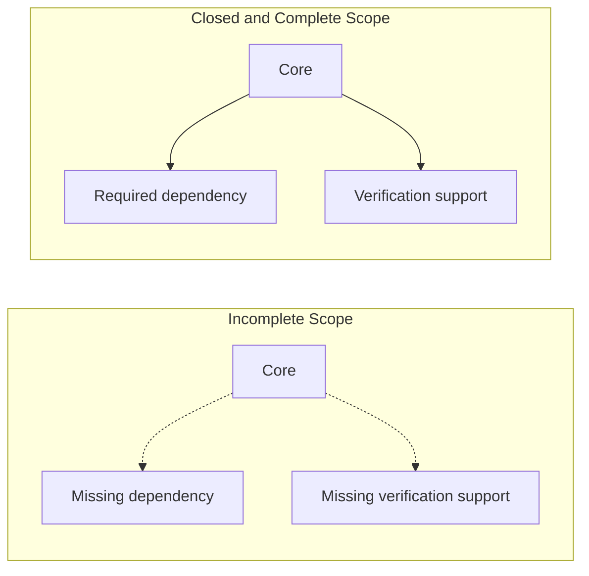

# 2026-03-28_03_ScopeClosureAndCompleteness

## 🎯 今日の研究焦点（1つだけ）
- Phase 6 の第9文書として、分析・保証帰属・検証・移行判断に対して、`Scope` がいつ **closed** で、いつ **sufficiently complete** とみなせるかを adequacy condition として形式化する。

## 🏗 モデル仮説
- `Scope` は bounded であるだけでは不十分であり、**intended analytical use** に対して adequate でなければならない。
- **Scope Closure** は、dependency / propagation を含む関係に対して、未説明の開放端を残さないことを意味する。
- **Completeness** は単一概念ではなく、structural / dependency / guarantee / verification の各目的に対して相対的に定まる。
- completeness はサイズや coverage percentage ではなく、**relation-sensitive / purpose-sensitive** に扱われるべきである。
- incomplete scope は false feasibility judgment を生む。

## 🔬 構造設計（触った層：AST/IR/CFG/DFG）
- **Structural Completeness**：制御構造、主要データ構造、境界露出点、責務単位の欠落がないこと。
- **Dependency Completeness**：共有状態、呼出連鎖、外部契約、共通定義など、判断に有意な依存が落ちていないこと。
- **Guarantee Completeness**：guarantee attribution を支える対象・前提・境界が十分であること。
- **Verification Completeness**：verification adequacy を支える対象領域と外部前提が説明可能であること。

## ✅ 今日の決定事項
- `Closed(\sigma \mid \Pi)` を、目的依存の closure 述語として置いた。
- **§2.1** として「Scope は bounded であっても inadequate でありうる」を明示した。
- closure を dependency closure と propagation closure に明示的に接続した。
- `Complete_{struct}`、`Complete_{dep}`、`Complete_g`、`Complete_{ver}` の 4 類型を定義した。
- **Decision Adequacy** を、closure と各種 completeness が migration feasibility judgment を支える状態として整理した。
- incomplete scope が false feasibility judgment を生むメカニズムを列挙した。

## ⚠ 保留・未解決
- `Complete_g` と guarantee strength の関係をどこまで形式化するかは未確定である。
- closure の述語 \( \Pi \) を、Decision / Verification / Impact ごとにどこまで厳密に展開するかは今後の精緻化課題である。
- completeness の各類型の間の順序関係や含意関係は、まだ明示していない。

## 📊 図式化（必要ならMermaid 1枚）

## 🧠 抽象度の到達レベル
L1: 構文  
L2: 意味  
L3: 制御  
L4: データ  
L5: 仕様  

→ 今日の到達：
- L3〜L4：closure を dependency / propagation と結びつけて整理した。
- L5：decision adequacy を、closure と completeness の複合条件として書けた。

## ⏭ 次の研究ステップ
- `10_Scope-Mapping-to-AST-CFG-DFG.md` で、今回の closure / completeness を AST / CFG / DFG へ写像する。
- completeness の各類型が、どの保証主張や検証主張をどこまで支えるかを精緻化する。
