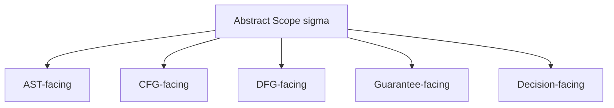

# 2026-03-28_04_ScopeMappingToASTCFGDFG

## 🎯 今日の研究焦点（1つだけ）
- Phase 6 の締めくくり文書として、`Scope` 理論を AST / CFG / DFG / Guarantee / Decision の各層へ写像し、**theory-level invariance** と **model-specific manifestation** を両立する統合記述を与える。

## 🏗 モデル仮説
- `Scope` は principle 上は **model-invariant** な抽象概念である。
- ただし各モデルは異なる構造語彙を持つため、`Scope` は各層で **model-specific** に現れる。
- ここで必要なのは equivalence ではなく **correspondence** である。
- AST / CFG / DFG / Guarantee / Decision は、同一の抽象 `Scope` を異なる可視化として与える。

## 🔬 構造設計（触った層：AST/IR/CFG/DFG）
- **AST-facing Scope**：構文部分木・粒度・containment の可視化として整理した。
- **CFG-facing Scope**：control reachability、branching、責務境界の manifestation として整理した。
- **DFG-facing Scope**：dependency、def-use、共有状態、data propagation の manifestation として整理した。
- **Guarantee-facing Scope**：applicability / coverage / attribution constraint の manifestation として整理した。
- **Decision-facing Scope**：judgment boundary、evidence sufficiency、feasibility framing の manifestation として整理した。

## ✅ 今日の決定事項
- **§2.1** として「Model-specific manifestation and theory-level invariance」を明示した。
- 抽象 `Scope` を各モデルへ写像する記法として、\( M_{ast}(\sigma), M_{cfg}(\sigma), M_{dfg}(\sigma), M_g(\sigma), M_d(\sigma) \) を置いた。
- cross-model relation を equivalence ではなく **correspondence** として整理した。
- correspondence の成立条件を、対象整合・境界整合・目的整合の 3 条件で整理した。
- Phase 6 から後続の AST / CFG / DFG 精緻化フェーズへ接続する橋渡し文書として位置づけた。

## ⚠ 保留・未解決
- 各 \( M_x \) をどこまで形式写像として厳密化するかは未確定である。
- AST / CFG / DFG 間の correspondence を、将来どの共通中間表現で管理するかは今後の設計課題である。
- model 間で境界解釈が衝突した場合の優先規則は、まだ定義していない。

## 📊 図式化（必要ならMermaid 1枚）

## 🧠 抽象度の到達レベル
L1: 構文  
L2: 意味  
L3: 制御  
L4: データ  
L5: 仕様  

→ 今日の到達：
- L1〜L4：AST / CFG / DFG での `Scope` の現れ方の差を整理した。
- L5：Guarantee / Decision を含む cross-model alignment を、Phase 6 の統合記述として置いた。

## ⏭ 次の研究ステップ
- AST / CFG / DFG 側の詳細フェーズで、今回の correspondence を各構造モデルの formal rule へ下ろす。
- boundary conflict や cross-model mismatch を、将来の分析ルールとして定式化する。
