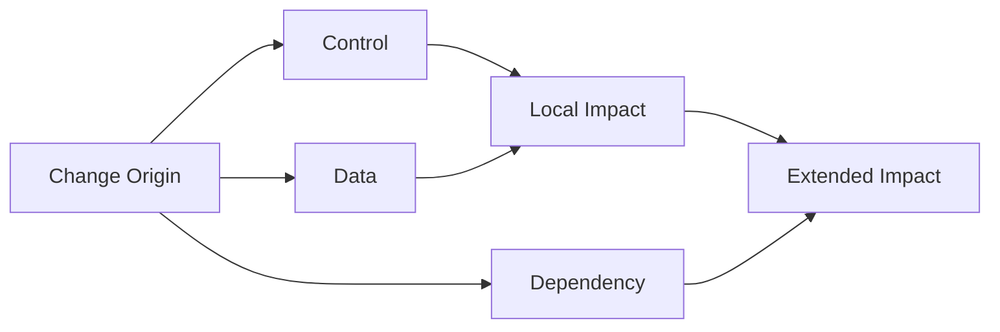

# 2026-03-28_07_ImpactScopeAndPropagation

## 🎯 今日の研究焦点（1つだけ）
- Phase 6 の第7文書として、変更影響を **Change Origin** から始まる **structural propagation** として再整理し、その到達領域を **Impact Scope** として形式化する。

## 🏗 モデル仮説
- **Impact** は平坦な影響物一覧ではなく、**起点・経路・到達・境界** を持つ `Scope` 的現象として扱うべきである。
- **Change Origin** は編集座標ではなく、意味的に伝播を開始しうる構造起点である。
- **Propagation Path** は control / data / dependency を媒体とする **意味的 structural reachability** である。
- **Impact Scope** は reachable set 全体ではなく、境界づけられ分析可能な影響領域である。
- **Local Impact Scope** と **Extended Impact Scope** は、それぞれ別の三つ組として記述され、影響分析の粒度制御に対応する。

## 🔬 構造設計（触った層：AST/IR/CFG/DFG）
- **Change Origin**：AST / CFG / DFG / dependency graph 上で識別可能な起点として整理した。
- **Propagation media**：control、data、dependency の 3 種が、影響を別々かつ重畳的に駆動する構造として整理した。
- **Reachability**：単純な参照有無ではなく、影響媒体として妥当な経路に制限された推移閉包 \( \leadsto^* \) として置いた。
- **Local / Extended**：\( \sigma_{loc}(o) \) と \( \sigma_{ext}(o) \) を分け、局所理解と移行判断で必要な粒度差を示した。

## ✅ 今日の決定事項
- `Impact Scope` を、\( \sigma_{imp}(o) = \langle T_{imp}(o), B_{imp}(o), P_{imp}(o) \rangle \) として定義した。
- **§2.1** として「Impact は平坦な影響物一覧ではなく、Scope を持つ現象である」を明示した。
- **Local / Extended Impact Scope** を区別し、\( T_{loc}(o) \subseteq T_{ext}(o) \) として整理した。
- `07` 本文では、\( \sigma_{loc}(o) \) と \( \sigma_{ext}(o) \) をそれぞれ三つ組として明記し、粒度制御との対応を補強した。
- **Impact Closure** を、伝播飽和・境界明示・未確定領域の隔離によって判断する方針を採用した。
- risk / packaging / verification / feasibility への接続を、`60_decision` と `Scope Theory` の橋渡しとして記述した。

## ⚠ 保留・未解決
- `B_{imp}` / `B_{loc}` / `B_{ext}` を、外部露出・未閉包・ブラックボックス境界としてどこまで厳密に分類するかは未確定である。
- propagation の深さ制限や停止条件を、一般理論としてどう置くかは今後の精緻化課題である。
- `Impact Closure` と `09_Scope-Closure-and-Completeness.md` の closure 概念の完全対応は、後続文書で確認が必要である。

## 📊 図式化（必要ならMermaid 1枚）

## 🧠 抽象度の到達レベル
L1: 構文  
L2: 意味  
L3: 制御  
L4: データ  
L5: 仕様  

→ 今日の到達：
- L3〜L4：影響を制御・データ・依存の各媒体を通じた到達として整理した。
- L5：impact が risk、verification、migration feasibility の判断対象をどこまで押し広げるかを記述した。
- L5：local / extended の区別を、単なる広さではなく **判断粒度** の違いとして書けた。

## ⏭ 次の研究ステップ
- `08_Verification-Scope.md` で、verification range が local / extended impact のどちらまで要求するかを詰める。
- `09_Scope-Closure-and-Completeness.md` で、impact closure と scope closure の関係を明確化する。
- `10_Scope-Mapping-to-AST-CFG-DFG.md` で、今回の propagation 語彙を AST / CFG / DFG へ写像する。
