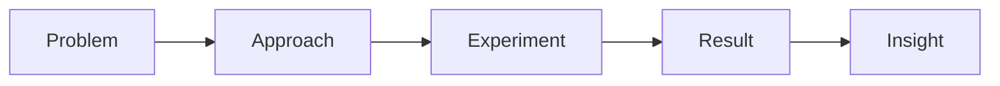
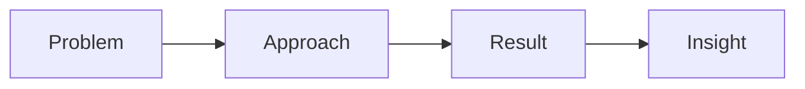

# 研究ログテンプレート（Research Log Template）

## 目的
このテンプレートは、本プロジェクトにおける研究ログの標準構造を定義する。

本テンプレートは、Cursorおよび複数のAIモデルを用いたAI支援研究ワークフローを前提として設計されている。

対象とする研究領域：

- AST / IR / CFG / DFG の設計研究
- Guarantee Space
- Migration Geometry
- 移行設計理論
- 構造解析
- プロンプト駆動実験

本テンプレートは以下を支援することを目的とする。

- 日次研究記録
- 理論の精緻化
- AIレビュー
- Mermaidによる構造可視化
- X / WordPress / Qiita への将来的な発信

---

# ファイル命名規則

研究ログファイルは ISO 日付形式を使用する。

```text
YYYY-MM-DD.md
```

例

```text
2026-03-07.md
```

---

# テンプレート

```markdown
# Research Log: YYYY-MM-DD

## Theme
- 

## Objective
- 

## Background
- 

## Problem
- 

## Hypothesis
- 

## Approach
- 

## Experiment / Analysis
- 

## Result
- 

## Insight
- 

## Open Questions
- 

## Next Actions
- 

## Concept Image

※ 概念図は **ログのMarkdownファイル内にMermaidで記述すること**。
外部画像ではなく、再現可能な構造図として記録する。



## Related Files
- 

## Related Diagrams
- 

## Related Prompts
- 

## Notes
- 
```

---

# セクション説明

## Theme
このログの中心テーマを記述する。

例

- Guarantee Space partial order
- CFG construction rule refinement
- Migration Geometry concept alignment

---

## Objective
この研究セッションで達成しようとしている目的を書く。

---

## Background
研究の背景となる文脈を記録する。

例

- 以前の研究結果
- 未解決問題
- 研究の動機

---

## Problem
今回検討する具体的な問題を記述する。

---

## Hypothesis
仮説がある場合はここに記述する。

---

## Approach
採用した思考方法や分析手法を記述する。

---

## Experiment / Analysis
実際に実施した分析・比較・検証内容を記録する。

---

## Result
得られた結果をまとめる。

---

## Insight
この研究セッションで得られた新しい理解を書く。

---

## Open Questions
残された未解決問題を列挙する。

---

## Next Actions
次に実施する研究アクションを記録する。

---

## Concept Image（概念図）

各研究ログには **必ず1つのMermaid図を含める。**

重要：

- 図はログのMarkdownファイル内に記述する
- 外部画像ファイルは使用しない
- 構造理解を目的とする

推奨デフォルト図：


必要に応じて以下の図を使用可能

- mindmap（概念整理）
- graph TD（依存関係）
- flowchart TD（分岐構造）
- timeline（研究進行）

---

## Related Files
関連する理論文書、実験ファイル、設計ノートを記録する。

---

## Related Diagrams
関連するMermaid図や図面を記録する。

---

## Related Prompts
Cursor / Gemini / ChatGPT などで使用したプロンプトを記録する。

---

## Notes
自由記述欄。

メモ、補足、思考断片など。

---

# 推奨運用ルール

1. 研究セッションごと、または1日1ログを作成する。
2. ログは簡潔だが構造的に記述する。
3. 最低限以下は必ず記録する。

- Theme
- Problem
- Approach
- Result
- Insight

4. 各ログには **Concept Image（Mermaid図）を1つ含める。**
5. Mermaid図は装飾ではなく構造説明として使用する。
6. 用語はできるだけ再利用可能な安定語彙を使用する。
7. 関連理論文書へのリンクを可能な限り記録する。

---

# 推奨ディレクトリ構成

```text
log/research-log/YYYY/
```

例

```text
log/research-log/2026/2026-03-07.md
```

---

# 簡易ログ（軽量版）

短い研究セッションでは以下の簡易形式を使用可能。

```markdown
# Research Log: YYYY-MM-DD

## Theme
- 

## Problem
- 

## Approach
- 

## Result
- 

## Insight
- 

## Concept Image


```

---

研究ログテンプレート  
Version 1.1
